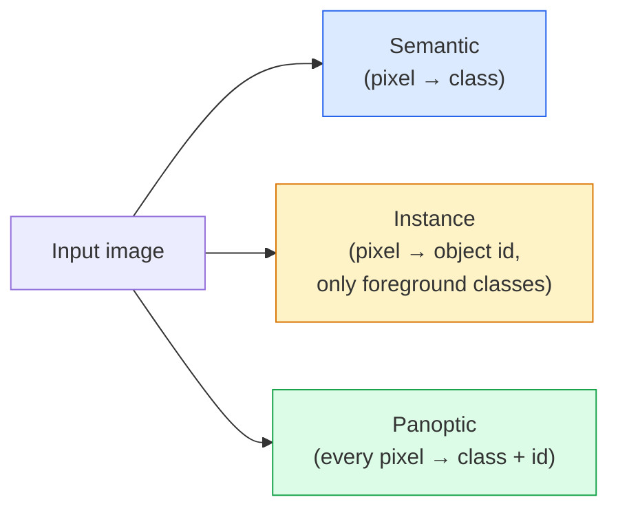
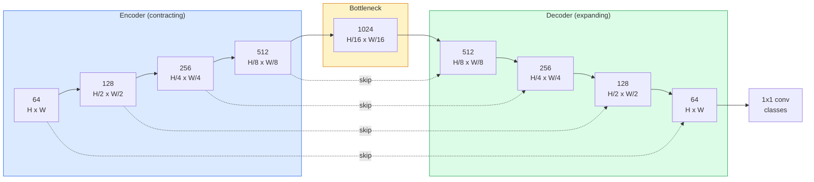

# 语义分割 — U-Net

> 分割是在每个像素上进行分类。U-Net 通过将下采样编码器与上采样解码器配对，并在它们之间连接跳跃连接，使其能够工作。

**类型：** 构建
**语言：** Python
**前置条件：** 阶段4 第03课（CNN），阶段4 第04课（图像分类）
**时长：** ~75分钟

## 学习目标

- 区分语义分割(Semantic Segmentation)、实例分割(Instance Segmentation)和全景分割(Panoptic Segmentation)，并为给定问题选择正确的任务
- 在 PyTorch 中从头构建 U-Net，包含编码器块、瓶颈层、带有转置卷积(Transposed Convolution)的解码器和跳跃连接(Skip Connection)
- 实现逐像素交叉熵(Pixel-wise Cross-entropy)、Dice 损失以及当前医学和工业分割默认的组合损失
- 按类别读取 IoU 和 Dice 指标，并诊断不良分数源于小目标召回率、边界精度还是类别不平衡

## 问题

分类(Classification)为每张图像输出一个标签。检测(Detection)为每张图像输出几个边界框。分割(Segmentation)为每个像素输出一个标签。对于大小为 `H x W` 的输入，输出是一个形状为 `H x W`（语义）或 `H x W x N_instances`（实例）的张量。这意味着每张图像有数百万个预测，而非一个。

分割的结构正是其驱动几乎所有密集预测视觉产品的原因：医学成像（肿瘤掩膜）、自动驾驶（道路、车道、障碍物）、卫星（建筑足迹、作物边界）、文档解析（布局区域）、机器人（可抓取区域）。这些任务都无法通过将物体框在一个边界框内来解决；它们需要精确的轮廓。

这个架构问题说起来简单，解决起来却不简单：你需要网络同时看到图像的全局上下文（这是什么场景）和局部像素细节（哪个像素是道路，哪个是路面）。标准 CNN 通过空间压缩来获取上下文，这丢弃了细节。U-Net 是一种同时获得两者的设计。

## 核心概念

### 语义分割 vs 实例分割 vs 全景分割



- **语义分割**说“这个像素是道路，那个像素是汽车”。相邻的两辆车合并成一个团块。
- **实例分割**说“这个像素是汽车 #3，那个像素是汽车 #5”。忽略背景材料（“材料” = 天空、道路、草地）。
- **全景分割**统一两者：每个像素获得一个类别标签，每个实例获得一个唯一 ID，材料和物体都被分割。

本课涵盖语义分割。下一课（Mask R-CNN）涵盖实例分割。

### U-Net 形状



编码器将空间分辨率减半四次并将通道数加倍。解码器反之：将空间分辨率加倍四次并将通道数减半。在每个分辨率上，跳跃连接将匹配的编码器特征与解码器特征拼接。最后的 1x1 卷积在全分辨率下输出 `64 -> num_classes`。

为什么需要跳跃连接：解码器在尝试输出像素级预测时，只能看到很小的特征图。没有跳跃连接，它无法准确定位边缘，因为该信息在编码器中被压缩掉了。跳跃连接将编码器在下采样过程中计算的高分辨率特征图传递给它。

### 转置卷积与双线性上采样

解码器需要扩展空间维度。有两种选择：

- **转置卷积(Transposed Convolution)** (`nn.ConvTranspose2d`) — 可学习的上采样。历史上的 U-Net 默认选项。如果步长和卷积核大小不能整除，可能产生棋盘格伪影。
- **双线性上采样 + 3x3 卷积** — 平滑上采样后接一个卷积。伪影更少，参数更少，现在是现代默认选项。

两者都在实际应用中出现。对于第一个 U-Net，双线性更安全。

### 在像素网格上的交叉熵

对于有 C 个类别的语义分割，模型输出是 `(N, C, H, W)`。目标是 `(N, H, W)`，包含整数类别 ID。交叉熵与分类情况相同，只是应用于每个空间位置：

```
Loss = mean over (n, h, w) of -log( softmax(logits[n, :, h, w])[target[n, h, w]] )
```

PyTorch 中的 `F.cross_entropy` 原生支持这种形状。无需重塑。

### Dice 损失及其必要性

交叉熵平等对待每个像素。当一个类别在画面中占主导时（医学成像：99% 背景，1% 肿瘤），这是错误的。网络可以通过处处预测背景获得 99% 的准确率，但仍然没有用。

Dice 损失通过直接优化预测掩膜与真实掩膜的重叠来解决这个问题：

```
Dice(p, y) = 2 * sum(p * y) / (sum(p) + sum(y) + epsilon)
Dice_loss = 1 - Dice
```

其中 `p` 是类别的 sigmoid/softmax 概率图，`y` 是二值真实掩膜。只有当重叠完美时损失才为零。由于它是基于比率的，类别不平衡无关紧要。

在实践中，使用**组合损失(Combined Loss)**：

```
L = L_cross_entropy + lambda * L_dice       (lambda ~ 1)
```

交叉熵在训练早期提供稳定的梯度；Dice 在训练后期专注于实际匹配掩膜形状。这种组合是医学成像的默认选项，并且在任何类别不平衡的数据集上都很难被击败。

### 评估指标

- **像素准确度(Pixel Accuracy)** — 预测正确的像素百分比。计算成本低。由于与分类中的准确度相同的原因，在不平衡数据上效果不佳。
- **每类 IoU** — 每个类别掩膜的 intersection over union；跨类别平均 = mIoU。
- **Dice (像素上的 F1)** — 类似于 IoU；`Dice = 2 * IoU / (1 + IoU)`。医学成像偏好 Dice，驾驶社区偏好 IoU；它们单调相关。
- **边界 F1 (Boundary F1)** — 衡量预测边界与真实边界有多接近，甚至惩罚小的偏移。对于高精度任务（如半导体检测）很重要。

报告每类的 IoU，而不仅仅是 mIoU。当九个类别为 85% 时，一个类别为 15%，平均 IoU 会隐藏这一点。

### 输入分辨率权衡

U-Net 的编码器将分辨率减半四次，因此输入必须能被 16 整除。医学图像通常是 512x512 或 1024x1024。自动驾驶裁剪图像是 2048x1024。U-Net 的内存成本随 `H * W * C_max` 缩放，在 1024x1024 且瓶颈通道数为 1024 时，前向传播已使用数 GB 显存。

两种标准变通方案：
1. 将输入分块处理——处理256x256的瓦片（tile），重叠并拼接。
2. 用空洞卷积（dilated convolution）替换瓶颈层，保持更高的空间分辨率同时扩大感受野（DeepLab系列）。

对于第一个模型，使用64通道基础的U-Net处理256x256输入，在8 GB显存上可以舒适训练。

## 动手构建

### 步骤1：编码器块（Encoder block）

两个3x3卷积，带批归一化（batch norm）和ReLU。第一个卷积改变通道数，第二个保持通道数不变。

```python
import torch
import torch.nn as nn
import torch.nn.functional as F

class DoubleConv(nn.Module):
    def __init__(self, in_c, out_c):
        super().__init__()
        self.net = nn.Sequential(
            nn.Conv2d(in_c, out_c, kernel_size=3, padding=1, bias=False),
            nn.BatchNorm2d(out_c),
            nn.ReLU(inplace=True),
            nn.Conv2d(out_c, out_c, kernel_size=3, padding=1, bias=False),
            nn.BatchNorm2d(out_c),
            nn.ReLU(inplace=True),
        )

    def forward(self, x):
        return self.net(x)
```

这个块会被重复使用。`bias=False` 因为批归一化的beta参数已经处理了偏置。

### 步骤2：下采样和上采样块

```python
class Down(nn.Module):
    def __init__(self, in_c, out_c):
        super().__init__()
        self.net = nn.Sequential(
            nn.MaxPool2d(2),
            DoubleConv(in_c, out_c),
        )

    def forward(self, x):
        return self.net(x)


class Up(nn.Module):
    def __init__(self, in_c, out_c):
        super().__init__()
        self.up = nn.Upsample(scale_factor=2, mode="bilinear", align_corners=False)
        self.conv = DoubleConv(in_c, out_c)

    def forward(self, x, skip):
        x = self.up(x)
        if x.shape[-2:] != skip.shape[-2:]:
            x = F.interpolate(x, size=skip.shape[-2:], mode="bilinear", align_corners=False)
        x = torch.cat([skip, x], dim=1)
        return self.conv(x)
```

仅对空间维度进行的形状检查（`shape[-2:]`）处理尺寸不能被16整除的输入；安全的`F.interpolate`在拼接前对齐张量。比较完整形状也会触发对通道数差异的检查，这应是一个明显的错误，而不是静默插值。

### 步骤3：U-Net

```python
class UNet(nn.Module):
    def __init__(self, in_channels=3, num_classes=2, base=64):
        super().__init__()
        self.inc = DoubleConv(in_channels, base)
        self.d1 = Down(base, base * 2)
        self.d2 = Down(base * 2, base * 4)
        self.d3 = Down(base * 4, base * 8)
        self.d4 = Down(base * 8, base * 16)
        self.u1 = Up(base * 16 + base * 8, base * 8)
        self.u2 = Up(base * 8 + base * 4, base * 4)
        self.u3 = Up(base * 4 + base * 2, base * 2)
        self.u4 = Up(base * 2 + base, base)
        self.outc = nn.Conv2d(base, num_classes, kernel_size=1)

    def forward(self, x):
        x1 = self.inc(x)
        x2 = self.d1(x1)
        x3 = self.d2(x2)
        x4 = self.d3(x3)
        x5 = self.d4(x4)
        x = self.u1(x5, x4)
        x = self.u2(x, x3)
        x = self.u3(x, x2)
        x = self.u4(x, x1)
        return self.outc(x)

net = UNet(in_channels=3, num_classes=2, base=32)
x = torch.randn(1, 3, 256, 256)
print(f"output: {net(x).shape}")
print(f"params: {sum(p.numel() for p in net.parameters()):,}")
```

输出形状`(1, 2, 256, 256)`——与输入相同的空间尺寸，`num_classes`个通道。在`base=32`时约有770万个参数。

### 步骤4：损失函数

```python
def dice_loss(logits, targets, num_classes, eps=1e-6):
    probs = F.softmax(logits, dim=1)
    targets_one_hot = F.one_hot(targets, num_classes).permute(0, 3, 1, 2).float()
    dims = (0, 2, 3)
    intersection = (probs * targets_one_hot).sum(dim=dims)
    denom = probs.sum(dim=dims) + targets_one_hot.sum(dim=dims)
    dice = (2 * intersection + eps) / (denom + eps)
    return 1 - dice.mean()


def combined_loss(logits, targets, num_classes, lam=1.0):
    ce = F.cross_entropy(logits, targets)
    dc = dice_loss(logits, targets, num_classes)
    return ce + lam * dc, {"ce": ce.item(), "dice": dc.item()}
```

对每个类别计算Dice系数然后取平均（宏平均Dice）。`eps`防止在批次中缺失的类别上除以零。

### 步骤5：IoU指标

```python
@torch.no_grad()
def iou_per_class(logits, targets, num_classes):
    preds = logits.argmax(dim=1)
    ious = torch.zeros(num_classes)
    for c in range(num_classes):
        pred_c = (preds == c)
        true_c = (targets == c)
        inter = (pred_c & true_c).sum().float()
        union = (pred_c | true_c).sum().float()
        ious[c] = (inter / union) if union > 0 else torch.tensor(float("nan"))
    return ious
```

返回长度为C的向量。`nan`标记批次中缺失的类别——在计算mIoU时不要对这些类别取平均。

### 步骤6：端到端验证的合成数据集

在彩色背景上生成形状，让网络必须学习形状而非像素颜色。

```python
import numpy as np
from torch.utils.data import Dataset, DataLoader

def synthetic_segmentation(num_samples=200, size=64, seed=0):
    rng = np.random.default_rng(seed)
    images = np.zeros((num_samples, size, size, 3), dtype=np.float32)
    masks = np.zeros((num_samples, size, size), dtype=np.int64)
    for i in range(num_samples):
        bg = rng.uniform(0, 1, (3,))
        images[i] = bg
        masks[i] = 0
        num_shapes = rng.integers(1, 4)
        for _ in range(num_shapes):
            cls = int(rng.integers(1, 3))
            color = rng.uniform(0, 1, (3,))
            cx, cy = rng.integers(10, size - 10, size=2)
            r = int(rng.integers(4, 12))
            yy, xx = np.meshgrid(np.arange(size), np.arange(size), indexing="ij")
            if cls == 1:
                mask = (xx - cx) ** 2 + (yy - cy) ** 2 < r ** 2
            else:
                mask = (np.abs(xx - cx) < r) & (np.abs(yy - cy) < r)
            images[i][mask] = color
            masks[i][mask] = cls
        images[i] += rng.normal(0, 0.02, images[i].shape)
        images[i] = np.clip(images[i], 0, 1)
    return images, masks


class SegDataset(Dataset):
    def __init__(self, images, masks):
        self.images = images
        self.masks = masks

    def __len__(self):
        return len(self.images)

    def __getitem__(self, i):
        img = torch.from_numpy(self.images[i]).permute(2, 0, 1).float()
        mask = torch.from_numpy(self.masks[i]).long()
        return img, mask
```

三个类别：背景（0）、圆形（1）、正方形（2）。网络必须学会区分形状。

### 步骤7：训练循环

```python
def train_one_epoch(model, loader, optimizer, device, num_classes):
    model.train()
    loss_sum, total = 0.0, 0
    iou_sum = torch.zeros(num_classes)
    for x, y in loader:
        x, y = x.to(device), y.to(device)
        logits = model(x)
        loss, _ = combined_loss(logits, y, num_classes)
        optimizer.zero_grad()
        loss.backward()
        optimizer.step()
        loss_sum += loss.item() * x.size(0)
        total += x.size(0)
        iou_sum += iou_per_class(logits, y, num_classes).nan_to_num(0)
    return loss_sum / total, iou_sum / len(loader)
```

在合成数据集上运行10-30个周期，观察形状类别的mIoU超过0.9。注意`nan_to_num(0)`将批次中缺失的类别视为0；为了准确计算每类IoU，应在评估时按存在性进行掩码并在批次间使用`torch.nanmean`，而不是在这里取平均。

## 使用它

在生产中，`segmentation_models_pytorch`（"smp"）将每个标准分割架构与任意torchvision或timm主干网络封装起来。三行代码：

```python
import segmentation_models_pytorch as smp

model = smp.Unet(
    encoder_name="resnet34",
    encoder_weights="imagenet",
    in_channels=3,
    classes=3,
)
```

实际工作中也值得了解：
- **DeepLabV3+**用空洞卷积替代基于最大池化的下采样，使瓶颈层保持分辨率；在卫星和驾驶数据上有更快的边界。
- **SegFormer**将卷积编码器替换为层次化Transformer；目前在多项基准测试中达到SOTA。
- **Mask2Former** / **OneFormer**将语义、实例和全景分割统一在单一架构中。

这三个模型都是`smp`或`transformers`中的直接替代品，使用相同的数据加载器。

## 发布

本課(lesson)产出：

- `outputs/prompt-segmentation-task-picker.md`——一个提示（prompt），用于在语义、实例和全景分割之间进行选择，并为给定任务指定架构。
- `outputs/prompt-segmentation-task-picker.md`——一个技能（skill），报告类别分布、预测掩码统计以及预测不足或边界模糊的类别。

## 练习

1. **（简单）** 为二值分割任务（前景 vs 背景）实现`bce_dice_loss`。在合成二类数据集上验证，当前景仅占5%像素时，组合损失比单独的BCE收敛更快。
2. **（中等）** 将`bce_dice_loss`上采样块替换为`nn.Upsample + conv`上采样块。在合成数据集上训练两者并比较mIoU。观察转置卷积版本中出现棋盘伪影的位置。
3. **（困难）** 取一个真实分割数据集（Oxford-IIIT Pets、Cityscapes mini split或医学子集），训练U-Net使其IoU与`bce_dice_loss`基准相差2个点以内。报告每类IoU，并确定哪些类别从损失中加入Dice获益最大。

## 关键术语

|  术语  |  人们的说法  |  实际含义  |
|------|----------------|----------------------|
|  语义分割（Semantic segmentation）  |  给每个像素打标签  |  逐像素分类到C个类别；同一类的实例合并  |
|  实例分割（Instance segmentation）  |  给每个对象打标签  |  区分同一类别的不同实例；仅处理前景  |
|  全景分割（Panoptic segmentation）  |  语义+实例  |  每个像素获得一个类别；每个物体实例也获得唯一ID  |
|  跳跃连接（Skip connection）  |  U-Net桥接  |  将编码器特征拼接到匹配分辨率的解码器特征；保留高频细节  |
|  转置卷积（Transposed conv）  |  反卷积  |  可学习的上采样；可能产生棋盘伪影  |
| Dice损失(Dice loss)  |  "重叠损失(Overlap loss)"  |  1 - 2 | A ∩ B |  / ( | A |  +  | B | ); 直接优化掩模重叠且对类别不平衡鲁棒 |
| 平均交并比(mIoU)  |  "均值交并比(Mean intersection over union)"  |  所有类别的平均IoU；分割领域的标准度量 |
| 边界F1值(Boundary F1)  |  "边界精度(Boundary accuracy)"  |  仅边界像素的F1得分；对精度关键任务很重要 |

## 延伸阅读

- [U-Net: Convolutional Networks for Biomedical Image Segmentation (Ronneberger et al., 2015)](https://arxiv.org/abs/1505.04597) — 原始论文；每个人都在复制的图表在第2页
- [U-Net: Convolutional Networks for Biomedical Image Segmentation (Ronneberger et al., 2015)](https://arxiv.org/abs/1505.04597) — 首次将分割问题建模为端到端卷积问题的论文
- [U-Net: Convolutional Networks for Biomedical Image Segmentation (Ronneberger et al., 2015)](https://arxiv.org/abs/1505.04597) — 生产环境分割的参考文献；涵盖所有标准架构和损失函数
- [U-Net: Convolutional Networks for Biomedical Image Segmentation (Ronneberger et al., 2015)](https://arxiv.org/abs/1505.04597) — 关于TTA、伪标签和类别权重在实际数据中为何重要的详解
