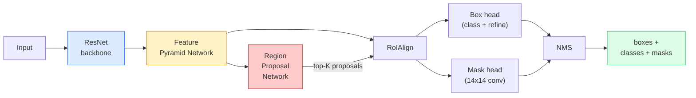

# 实例分割(Instance Segmentation) — Mask R-CNN

> 向Faster R-CNN检测器添加一个微小的掩码分支，就得到了实例分割(Instance Segmentation)。难点在于RoIAlign，它比看起来要难得多。

**类型：** 构建+学习
**语言：** Python
**前提：** 阶段4 第06课 (YOLO)，阶段4 第07课 (U-Net)
**时间：** 约75分钟

## 学习目标

- 端到端追踪Mask R-CNN架构：骨干网络(Backbone)、FPN、RPN、RoIAlign、边界框头、掩码头
- 从头实现RoIAlign并解释为什么不再使用RoIPool
- 使用torchvision `maskrcnn_resnet50_fpn_v2` 预训练模型获得生产质量的实例掩码并正确读取其输出格式
- 通过替换边界框头和掩码头、保持骨干网络冻结来在小型自定义数据集上微调Mask R-CNN

## 问题

语义分割(Semantic Segmentation)为每个类别提供一个掩码。实例分割(Instance Segmentation)为每个物体提供一个掩码，即使两个物体共享同一个类别。计数个体、跨帧追踪以及测量物体（墙面每块砖的边界框、显微图像中的每个细胞）都需要实例分割。

Mask R-CNN (He等人, 2017) 通过将实例分割重新定义为检测加掩码(Detection-plus-a-Mask)来解决这个问题。其设计非常简洁，以至于在接下来的五年里，几乎每篇实例分割论文都是Mask R-CNN的变体，而torchvision的实现仍然是中小型数据集上的生产默认选择。

工程上的难题是采样：如何从一个角点不与像素边界对齐的提议框中裁剪出固定大小的特征区域？采样错误会导致平均精度(mAP)全面下降十分之几个点。RoIAlign就是答案。

## 核心概念

### 架构



需要理解五个部分：

1. **骨干网络(Backbone)** — 在ImageNet上训练的ResNet-50或ResNet-101。产生步长为4、8、16、32的金字塔特征图。
2. **FPN（特征金字塔网络(Feature Pyramid Network)）** — 自上而下加侧向连接，使每一层都有C个通道的语义丰富特征。检测器查询与物体大小匹配的FPN层。
3. **RPN（区域提议网络(Region Proposal Network)）** — 一个小型卷积头，在每个锚点位置预测“这里是否有物体？”以及“如何修正边界框？”。每张图像产生约1000个提议(Proposal)。
4. **RoIAlign** — 从任何FPN层的任何边界框中采样固定大小（例如7x7）的特征块。双线性采样，无量化。
5. **头(Heads)** — 两层边界框头，用于修正边界框并选择类别；加上一个小型卷积头，为每个提议输出一个`28x28` 二值掩码。

### 为什么用RoIAlign而不是RoIPool

最初的Fast R-CNN使用RoIPool，它将提议框分割成网格，取每个单元的最大特征，并将所有坐标四舍五入为整数。这种舍入导致特征图与输入像素坐标的偏差最多达一个完整特征图像素——在224x224图像上影响很小，但在特征图步长为32时是灾难性的。

```
RoIPool:
  box (34.7, 51.3, 98.2, 142.9)
  round -> (34, 51, 98, 142)
  split grid -> round each cell boundary
  misalignment accumulates at every step

RoIAlign:
  box (34.7, 51.3, 98.2, 142.9)
  sample at exact float coordinates using bilinear interpolation
  no rounding anywhere
```

RoIAlign在COCO上免费将掩码平均精度(AP)提升了3-4个点。每个关注定位(localisation)的检测器现在都使用它——YOLOv7 seg、RT-DETR、Mask2Former等。

### RPN一句话总结

在特征图的每个位置，放置K个不同大小和形状的锚点框(Anchor Box)。为每个锚点预测物体性(Objectness)分数和回归偏移(Regression Offset)以将锚点调整为更合适的边界框。保留分数最高的前约1000个框，在IoU 0.7处应用非极大值抑制(NMS)，然后将剩余框交给头部。RPN使用自己的小损失函数训练——与第06课中YOLO损失相同的结构，只是有两个类别（有物体/无物体）。

### 掩码头

对于每个提议（经过RoIAlign后），掩码头是一个小型全卷积网络(FCN)：四个3x3卷积、一个2x反卷积(deconv)、最后一个1x1卷积，产生`num_classes` 个输出通道，分辨率为`28x28`。只保留对应预测类别的通道，其他忽略。这样将掩码预测与分类解耦。

将28x28掩码上采样到提议的原始像素大小，以生成最终的二值掩码。

### 损失函数

Mask R-CNN将四个损失函数相加：

```
L = L_rpn_cls + L_rpn_box + L_box_cls + L_box_reg + L_mask
```

- `L_rpn_cls`, `L_rpn_box` — RPN提议的物体性(Objectness)损失 + 边界框回归损失。
- `L_rpn_cls` — 头部分类器的(C+1)类（包括背景）交叉熵损失。
- `L_rpn_cls` — 头部边界框修正的平滑L1损失。
- `L_rpn_cls` — 28x28掩码输出的逐像素二值交叉熵损失。

每个损失都有自己的默认权重；torchvision实现将它们作为构造函数参数公开。

### 输出格式

`torchvision.models.detection.maskrcnn_resnet50_fpn_v2` 返回一个字典列表，每张图像一个字典：

```
{
    "boxes":  (N, 4) in (x1, y1, x2, y2) pixel coordinates,
    "labels": (N,) class IDs, 0 = background so indices are 1-based,
    "scores": (N,) confidence scores,
    "masks":  (N, 1, H, W) float masks in [0, 1] — threshold at 0.5 for binary,
}
```

掩码已是全图像分辨率。28x28的头部输出已在内部上采样。

## 动手构建

### 第1步：从头实现RoIAlign

这是Mask R-CNN中一个用代码比用文字更容易理解的组件。

```python
import torch
import torch.nn.functional as F

def roi_align_single(feature, box, output_size=7, spatial_scale=1 / 16.0):
    """
    feature: (C, H, W) single-image feature map
    box: (x1, y1, x2, y2) in original image pixel coordinates
    output_size: side of the output grid (7 for box head, 14 for mask head)
    spatial_scale: reciprocal of the feature map stride
    """
    C, H, W = feature.shape
    x1, y1, x2, y2 = [c * spatial_scale - 0.5 for c in box]
    bin_w = (x2 - x1) / output_size
    bin_h = (y2 - y1) / output_size

    grid_y = torch.linspace(y1 + bin_h / 2, y2 - bin_h / 2, output_size)
    grid_x = torch.linspace(x1 + bin_w / 2, x2 - bin_w / 2, output_size)
    yy, xx = torch.meshgrid(grid_y, grid_x, indexing="ij")

    gx = 2 * (xx + 0.5) / W - 1
    gy = 2 * (yy + 0.5) / H - 1
    grid = torch.stack([gx, gy], dim=-1).unsqueeze(0)
    sampled = F.grid_sample(feature.unsqueeze(0), grid, mode="bilinear",
                            align_corners=False)
    return sampled.squeeze(0)
```

每个数值都位于双线性采样位置。没有舍入，没有量化，没有梯度丢失。

### 第2步：与torchvision的RoIAlign比较

```python
from torchvision.ops import roi_align

feature = torch.randn(1, 16, 50, 50)
boxes = torch.tensor([[0, 10, 20, 100, 90]], dtype=torch.float32)  # (batch_idx, x1, y1, x2, y2)

ours = roi_align_single(feature[0], boxes[0, 1:].tolist(), output_size=7, spatial_scale=1/4)
theirs = roi_align(feature, boxes, output_size=(7, 7), spatial_scale=1/4, sampling_ratio=1, aligned=True)[0]

print(f"shape ours:   {tuple(ours.shape)}")
print(f"shape theirs: {tuple(theirs.shape)}")
print(f"max|diff|:    {(ours - theirs).abs().max().item():.3e}")
```

在`sampling_ratio=1`和`aligned=True`下，两者匹配到`1e-5`以内。

### 第3步：加载预训练的Mask R-CNN

```python
import torch
from torchvision.models.detection import maskrcnn_resnet50_fpn_v2, MaskRCNN_ResNet50_FPN_V2_Weights

model = maskrcnn_resnet50_fpn_v2(weights=MaskRCNN_ResNet50_FPN_V2_Weights.DEFAULT)
model.eval()
print(f"params: {sum(p.numel() for p in model.parameters()):,}")
print(f"classes (including background): {len(model.roi_heads.box_predictor.cls_score.out_features * [0])}")
```

46M参数，91个类别（COCO）。第一个类别（id 0）是背景；模型实际检测的所有内容从id 1开始。

### 第4步：运行推理

```python
with torch.no_grad():
    x = torch.randn(3, 400, 600)
    predictions = model([x])
p = predictions[0]
print(f"boxes:  {tuple(p['boxes'].shape)}")
print(f"labels: {tuple(p['labels'].shape)}")
print(f"scores: {tuple(p['scores'].shape)}")
print(f"masks:  {tuple(p['masks'].shape)}")
```

掩码张量的形状为`(N, 1, H, W)`。设置阈值为0.5以获得每个对象的二值掩码：

```python
binary_masks = (p['masks'] > 0.5).squeeze(1)  # (N, H, W) boolean
```

### 第5步：更换头部以适应自定义类别数

常见的微调方案：重用主干网络、FPN和RPN；替换两个分类头部。

```python
from torchvision.models.detection.faster_rcnn import FastRCNNPredictor
from torchvision.models.detection.mask_rcnn import MaskRCNNPredictor

def build_custom_maskrcnn(num_classes):
    model = maskrcnn_resnet50_fpn_v2(weights=MaskRCNN_ResNet50_FPN_V2_Weights.DEFAULT)
    in_features = model.roi_heads.box_predictor.cls_score.in_features
    model.roi_heads.box_predictor = FastRCNNPredictor(in_features, num_classes)
    in_features_mask = model.roi_heads.mask_predictor.conv5_mask.in_channels
    hidden_layer = 256
    model.roi_heads.mask_predictor = MaskRCNNPredictor(in_features_mask, hidden_layer, num_classes)
    return model

custom = build_custom_maskrcnn(num_classes=5)
print(f"custom cls_score.out_features: {custom.roi_heads.box_predictor.cls_score.out_features}")
```

`num_classes`必须包含背景类，因此具有4个对象类别的数据集使用`num_classes=5`。

### 第6步：冻结不需要训练的部分

在小型数据集上，冻结主干网络和FPN。只有RPN的目标性+回归和两个头部进行学习。

```python
def freeze_backbone_and_fpn(model):
    # torchvision Mask R-CNN packs the FPN inside `model.backbone` (as
    # `model.backbone.fpn`), so iterating `model.backbone.parameters()` covers
    # both the ResNet feature layers and the FPN lateral/output convs.
    for p in model.backbone.parameters():
        p.requires_grad = False
    return model

custom = freeze_backbone_and_fpn(custom)
trainable = sum(p.numel() for p in custom.parameters() if p.requires_grad)
print(f"trainable after freeze: {trainable:,}")
```

在500张图像的数据集上，这决定了收敛还是过拟合。

## 使用它

torchvision中Mask R-CNN的完整训练循环有40行代码，在不同任务之间没有实质性变化——更换数据集即可运行。

```python
def train_step(model, images, targets, optimizer):
    model.train()
    loss_dict = model(images, targets)
    losses = sum(loss for loss in loss_dict.values())
    optimizer.zero_grad()
    losses.backward()
    optimizer.step()
    return {k: v.item() for k, v in loss_dict.items()}
```

`targets`列表必须包含每张图像的字典，包含`boxes`、`labels`和`masks`（作为`(num_instances, H, W)`二值张量）。模型在训练时返回包含四个损失的字典，在评估时返回预测列表，键为`model.training`。

`pycocotools`评估器生成mAP@IoU=0.5:0.95，分别对应边界框和掩码；你需要这两个数字来判断边界框头部还是掩码头部是瓶颈。

## 发布

本課(lesson)产出：

- `outputs/prompt-instance-vs-semantic-router.md` — 一个提示，询问三个问题并选择实例分割 vs 语义分割 vs 全景分割以及确切的起始模型。
- `outputs/prompt-instance-vs-semantic-router.md` — 一项技能，根据新的`outputs/skill-mask-rcnn-head-swapper.md`生成用于在任何torchvision检测模型上更换头部的10行代码。

## 练习

1. **(简单)** 在100个随机边界框上验证你的RoIAlign与`torchvision.ops.roi_align`的对比。报告最大绝对差值。同时运行RoIPool（2017年之前的行为），并展示其在靠近边界的边界框上大约有1-2个特征图像素的差异。
2. **(中等)** 在50张图像的自定义数据集（任意两个类别：气球、鱼、坑洞、标志）上微调`torchvision.ops.roi_align`。冻结主干网络，训练20个epoch，报告mask AP@0.5。
3. **(困难)** 将Mask R-CNN的掩码头部替换为预测56x56而不是28x28的版本。测量替换前后的mAP@IoU=0.75。解释为什么增益（或没有增益）符合预期的边界精度/内存权衡。

## 关键术语

|  术语  |  人们的说法  |  实际含义  |
|------|----------------|----------------------|
|  Mask R-CNN  |  "检测加掩码"  |  Faster R-CNN + 一个小的全卷积网络(FCN)头部，为每个建议框预测每个类别的28x28掩码  |
|  FPN  |  "特征金字塔"  |  自上而下+横向连接，为每个步长级别提供C通道的语义丰富特征  |
|  RPN  |  "区域提议网络"  |  一个小型卷积头部，每张图像生成约1000个对象/非对象建议框  |
|  RoIAlign  |  "无舍入裁剪"  |  从任意浮点坐标边界框中双线性采样固定大小的特征网格  |
|  RoIPool  |  "2017年之前的裁剪"  |  与RoIAlign目的相同，但对边界框坐标进行舍入；已过时  |
|  Mask AP  |  "实例mAP"  |  使用掩码IoU而不是边界框IoU计算的平均精度；COCO实例分割指标  |
|  二值掩码头部  |  "每类掩码"  |  为每个建议框预测每个类别的二值掩码；只保留预测类别的通道  |
|  背景类  |  "类别0"  |  捕获所有“无对象”的类别；实际类别的索引从1开始  |

## 延伸阅读

- [Mask R-CNN (He et al., 2017)](https://arxiv.org/abs/1703.06870) — 论文；关于RoIAlign的第3节是关键阅读
- [Mask R-CNN (He et al., 2017)](https://arxiv.org/abs/1703.06870) — FPN论文；每个现代检测器都使用它
- [Mask R-CNN (He et al., 2017)](https://arxiv.org/abs/1703.06870) — 微调循环的参考
- [Mask R-CNN (He et al., 2017)](https://arxiv.org/abs/1703.06870) — 包含几乎所有检测和分割变体的训练权重的生产级实现
