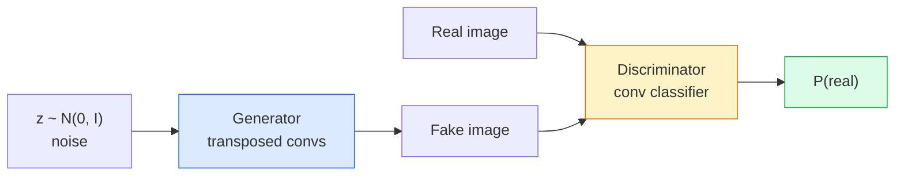
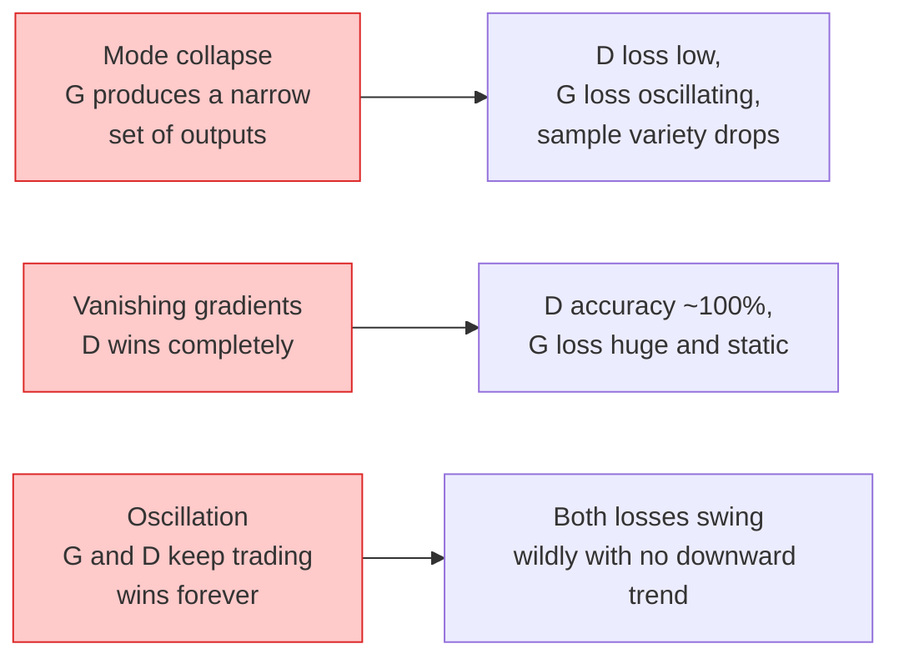

# 图像生成——生成对抗网络

> 生成对抗网络(GAN)由两个固定博弈的神经网络组成：一个绘画，一个评判。它们共同进步，直至画作能骗过评判者。

**类型：** 构建
**语言：** Python
**前置知识：** 阶段4 第03课(CNN)、阶段3 第06课(优化器)、阶段3 第07课(正则化)
**时间：** 约75分钟

## 学习目标

- 解释生成器与判别器之间的极小极大博弈(Minimax Game)及均衡为何对应p_model = p_data
- 使用PyTorch实现DCGAN，在60行内生成连贯的32x32合成图像
- 运用三个标准技巧稳定GAN训练：非饱和损失(Non-saturating Loss)、谱范数(Spectral Norm)、TTUR(双时间尺度更新规则)
- 解读训练曲线，区分健康收敛、模式坍缩(Mode Collapse)、振荡(Oscillation)及判别器完全胜出

## 问题

分类(Classification)教会网络将图像映射到标签。生成(Generation)则反转问题：采样与真实分布相似的新图像。没有可作差比的“正确”输出，只有想要模仿的分布。

标准损失函数(MSE、交叉熵)无法衡量“该样本是否来自真实分布”。最小化逐像素误差会产生模糊平均值而非真实样本。突破在于学会损失：训练第二个网络，其任务是区分真实与伪造，并用其判断来推动生成器。

GAN(Goodfellow等, 2014)定义了该框架。到2018年，StyleGAN能生成与照片无异的1024x1024人脸。扩散模型(Diffusion Models)此后在质量和可控性上占据主导地位，但使扩散实用化的每一项技巧——归一化选择、潜在空间(Latent Spaces)、特征损失——最初都是在GAN上理解的。

## 核心概念

### 两个网络



**生成器(Generator)** G接收噪声向量 `z` 并输出图像。**判别器(Discriminator)** D接收图像并输出单个标量：图像为真实的概率。

### 博弈

G希望D出错，D希望自己正确。形式化而言：

```
min_G max_D  E_x[log D(x)] + E_z[log(1 - D(G(z)))]
```

从右向左读：D在真实(`log D(real)`)和伪造(`log (1 - D(fake))`)图像上最大化准确率。G最小化D在伪造图像上的准确率——它希望`D(G(z))`高。

Goodfellow证明了该极小极大博弈存在全局均衡，其中`p_G = p_data`，D处处输出0.5，且生成分布与真实分布之间的詹森-香农散度(Jensen-Shannon Divergence)为零。难点在于达到该均衡。

### 非饱和损失

上述形式数值稳定性差。训练早期，每个伪造图像的`D(G(z))`接近零，因此`log(1 - D(G(z)))`相对于G的梯度消失。解决方法：翻转G的损失。

```
L_D = -E_x[log D(x)] - E_z[log(1 - D(G(z)))]
L_G = -E_z[log D(G(z))]                          # non-saturating
```

现在当`D(G(z))`接近零时，G的损失较大且梯度包含信息。所有现代GAN均使用此变体训练。

### DCGAN架构规则

Radford、Metz、Chintala（2015）将多年失败实验提炼为五条规则，使GAN训练稳定：

1. 用步长卷积替换池化（两个网络）。
2. 生成器和判别器均使用批归一化(Batch Norm)，除G的输出层和D的输入层外。
3. 深层架构中移除全连接层。
4. G除了输出层外所有层使用ReLU（输出层用tanh，输出在[-1,1]）。
5. D所有层使用LeakyReLU（negative_slope=0.2）。

所有现代基于卷积的GAN（StyleGAN、BigGAN、GigaGAN）仍从这些规则起步，然后逐步替换组件。

### 失败模式及其特征



- **模式坍缩(Mode Collapse)**：G找到一张能骗过D的图像，只产生该图像。修复：添加小批量判别(Minibatch Discrimination)、谱范数或标签条件(Label Conditioning)。
- **判别器胜出**：D过快过强，G梯度消失。修复：减小D、降低D学习率，或对真实标签应用标签平滑(Label Smoothing)。
- **振荡**：两个网络交替获胜而无法接近均衡。修复：TTUR（D学习速率比G快2-4倍），或切换为Wasserstein损失。

### 评估

GAN没有真实标签，如何知晓其工作效果？

- **样本检查**——在每个epoch结束时观察64个样本。不可省略。
- **FID（Fréchet Inception Distance）**——真实集与生成集Inception-v3特征分布之间的距离。越低越好。社区标准。
- **Inception Score**——较旧，更脆弱；优先使用FID。
- **生成模型的精确率/召回率**——分别衡量质量（精确率）和覆盖率（召回率）。比单独FID信息更丰富。

对于小规模合成数据运行，样本检查已足够。

## 动手构建

### 步骤1：生成器

一个小型DCGAN生成器，接收64维噪声并生成32x32图像。

```python
import torch
import torch.nn as nn

class Generator(nn.Module):
    def __init__(self, z_dim=64, img_channels=3, feat=64):
        super().__init__()
        self.net = nn.Sequential(
            nn.ConvTranspose2d(z_dim, feat * 4, kernel_size=4, stride=1, padding=0, bias=False),
            nn.BatchNorm2d(feat * 4),
            nn.ReLU(inplace=True),
            nn.ConvTranspose2d(feat * 4, feat * 2, kernel_size=4, stride=2, padding=1, bias=False),
            nn.BatchNorm2d(feat * 2),
            nn.ReLU(inplace=True),
            nn.ConvTranspose2d(feat * 2, feat, kernel_size=4, stride=2, padding=1, bias=False),
            nn.BatchNorm2d(feat),
            nn.ReLU(inplace=True),
            nn.ConvTranspose2d(feat, img_channels, kernel_size=4, stride=2, padding=1, bias=False),
            nn.Tanh(),
        )

    def forward(self, z):
        return self.net(z.view(z.size(0), -1, 1, 1))
```

四个转置卷积(Transposed Convolution)，每个带`kernel_size=4, stride=2, padding=1`以便干净地加倍空间尺寸。通过tanh输出激活在[-1,1]。

### 步骤2：判别器

生成器的镜像。LeakyReLU，步长卷积，以标量logit结束。

```python
class Discriminator(nn.Module):
    def __init__(self, img_channels=3, feat=64):
        super().__init__()
        self.net = nn.Sequential(
            nn.Conv2d(img_channels, feat, kernel_size=4, stride=2, padding=1),
            nn.LeakyReLU(0.2, inplace=True),
            nn.Conv2d(feat, feat * 2, kernel_size=4, stride=2, padding=1, bias=False),
            nn.BatchNorm2d(feat * 2),
            nn.LeakyReLU(0.2, inplace=True),
            nn.Conv2d(feat * 2, feat * 4, kernel_size=4, stride=2, padding=1, bias=False),
            nn.BatchNorm2d(feat * 4),
            nn.LeakyReLU(0.2, inplace=True),
            nn.Conv2d(feat * 4, 1, kernel_size=4, stride=1, padding=0),
        )

    def forward(self, x):
        return self.net(x).view(-1)
```

最后一个卷积将`4x4`特征图减少到`1x1`。输出是每张图像一个标量；仅在损失计算期间应用sigmoid。

### 步骤3：训练步骤

交替：每批次先更新D一次，再更新G一次。

```python
import torch.nn.functional as F

def train_step(G, D, real, z, opt_g, opt_d, device):
    real = real.to(device)
    bs = real.size(0)

    # D step
    opt_d.zero_grad()
    d_real = D(real)
    d_fake = D(G(z).detach())
    loss_d = (F.binary_cross_entropy_with_logits(d_real, torch.ones_like(d_real))
              + F.binary_cross_entropy_with_logits(d_fake, torch.zeros_like(d_fake)))
    loss_d.backward()
    opt_d.step()

    # G step
    opt_g.zero_grad()
    d_fake = D(G(z))
    loss_g = F.binary_cross_entropy_with_logits(d_fake, torch.ones_like(d_fake))
    loss_g.backward()
    opt_g.step()

    return loss_d.item(), loss_g.item()
```

在D步骤中，`G(z).detach()`至关重要：我们不希望在更新D时梯度流入G。忘记这一点是经典的初学者错误。

### 步骤4：在合成形状上的完整训练循环

```python
from torch.utils.data import DataLoader, TensorDataset
import numpy as np

def synthetic_images(num=2000, size=32, seed=0):
    rng = np.random.default_rng(seed)
    imgs = np.zeros((num, 3, size, size), dtype=np.float32) - 1.0
    for i in range(num):
        r = rng.uniform(6, 12)
        cx, cy = rng.uniform(r, size - r, size=2)
        yy, xx = np.meshgrid(np.arange(size), np.arange(size), indexing="ij")
        mask = (xx - cx) ** 2 + (yy - cy) ** 2 < r ** 2
        color = rng.uniform(-0.5, 1.0, size=3)
        for c in range(3):
            imgs[i, c][mask] = color[c]
    return torch.from_numpy(imgs)

device = "cuda" if torch.cuda.is_available() else "cpu"
data = synthetic_images()
loader = DataLoader(TensorDataset(data), batch_size=64, shuffle=True)

G = Generator(z_dim=64, img_channels=3, feat=32).to(device)
D = Discriminator(img_channels=3, feat=32).to(device)
opt_g = torch.optim.Adam(G.parameters(), lr=2e-4, betas=(0.5, 0.999))
opt_d = torch.optim.Adam(D.parameters(), lr=2e-4, betas=(0.5, 0.999))

for epoch in range(10):
    for (batch,) in loader:
        z = torch.randn(batch.size(0), 64, device=device)
        ld, lg = train_step(G, D, batch, z, opt_g, opt_d, device)
    print(f"epoch {epoch}  D {ld:.3f}  G {lg:.3f}")
```

`Adam(lr=2e-4, betas=(0.5, 0.999))`是DCGAN的默认值——较低的beta1可以防止动量项过度稳定对抗游戏。

### 步骤5：采样

```python
@torch.no_grad()
def sample(G, n=16, z_dim=64, device="cpu"):
    G.eval()
    z = torch.randn(n, z_dim, device=device)
    imgs = G(z)
    imgs = (imgs + 1) / 2
    return imgs.clamp(0, 1)
```

在采样前始终切换到评估模式。对于DCGAN，这一点很重要，因为会使用批归一化的运行统计量，而不是当前批次的统计量。

### 步骤6：谱归一化

判别器中BN的直接替代方案，可保证网络是1-Lipschitz的。修复了大多数“D赢得太狠”的失败情况。

```python
from torch.nn.utils import spectral_norm

def build_sn_discriminator(img_channels=3, feat=64):
    return nn.Sequential(
        spectral_norm(nn.Conv2d(img_channels, feat, 4, 2, 1)),
        nn.LeakyReLU(0.2, inplace=True),
        spectral_norm(nn.Conv2d(feat, feat * 2, 4, 2, 1)),
        nn.LeakyReLU(0.2, inplace=True),
        spectral_norm(nn.Conv2d(feat * 2, feat * 4, 4, 2, 1)),
        nn.LeakyReLU(0.2, inplace=True),
        spectral_norm(nn.Conv2d(feat * 4, 1, 4, 1, 0)),
    )
```

将`Discriminator`替换为`build_sn_discriminator()`，通常不需要TTUR技巧。谱归一化是您可以应用的最简单的单一鲁棒性升级。

## 使用它

对于严肃的生成任务，请使用预训练权重或切换到扩散模型。两个标准库：

- `torch_fidelity`可以在不编写自定义评估代码的情况下计算生成器的FID/IS。
- `torch_fidelity`（旧版）和`pytorch-gan-zoo`提供了DCGAN、WGAN-GP、SN-GAN、StyleGAN和BigGAN的经过测试的实现。

到2026年，GAN仍然是以下任务的最佳选择：实时图像生成（延迟<10毫秒）、风格迁移、具有精确控制的图像到图像翻译（Pix2Pix、CycleGAN）。扩散模型在逼真度和文本条件生成方面更胜一筹。

## 发布

本課(lesson)产出：

- `outputs/prompt-gan-training-triage.md`——一个读取训练曲线描述并选择失败模式（模式崩塌、D获胜、振荡）以及单个推荐修复的提示。
- `outputs/prompt-gan-training-triage.md`——一个从`outputs/skill-dcgan-scaffold.md`、目标`z_dim`和`image_size`编写DCGAN框架的技能，包括训练循环和样本保存器。

## 练习

1. **(简单)** 在上述合成圆形数据集上训练DCGAN，并在每个epoch结束时保存16个样本的网格。到第几个epoch时生成的圆形变得明显是圆形？
2. **(中等)** 用谱归一化替换判别器的批归一化。并排训练两个版本。哪一个收敛更快？哪一个在三个随机种子下的方差更低？
3. **(困难)** 实现条件DCGAN：将类别标签输入到G和D中（在G中将one-hot编码连接到噪声，在D中连接类别嵌入通道）。在第7课的合成“圆形与正方形”数据集上训练，并通过使用特定标签采样来证明类别条件起作用。

## 关键术语

|  术语  |  人们的说法  |  实际含义  |
|------|----------------|----------------------|
| 生成器(G)  |  “绘制物品的网络”  |  将噪声映射到图像；训练以欺骗判别器 |
| 判别器(D)  |  “评论家”  |  二分类器；训练以区分真实图像和生成图像 |
| 极小极大  |  “游戏”  |  对对抗损失关于G求最小、关于D求最大；平衡点为p_G = p_data |
| 非饱和损失  |  “数值稳定的版本”  |  G的损失为-log(D(G(z)))而不是log(1 - D(G(z)))，以避免训练早期梯度消失 |
| 模式崩塌  |  “生成器只生成一种东西”  |  G只生成数据分布的一小部分；使用谱归一化、小批量判别或更大的批次来修复 |
| TTUR  |  “两个学习率”  |  D比G学习更快，通常快2-4倍；稳定训练 |
| 谱归一化  |  “1-Lipschitz层”  |  一种权重归一化，限制每个层的Lipschitz常数；防止D变得任意陡峭 |
| FID  |  “Fréchet Inception距离”  |  真实和生成集合的Inception-v3特征分布之间的距离；标准评估指标 |

## 延伸阅读

- [Generative Adversarial Networks (Goodfellow et al., 2014)](https://arxiv.org/abs/1406.2661)——开创一切的那篇论文
- [Generative Adversarial Networks (Goodfellow et al., 2014)](https://arxiv.org/abs/1406.2661)——使GAN可训练的那些架构规则
- [Generative Adversarial Networks (Goodfellow et al., 2014)](https://arxiv.org/abs/1406.2661)——最有用的一种稳定化技巧
- [Generative Adversarial Networks (Goodfellow et al., 2014)](https://arxiv.org/abs/1406.2661)——当前最优的GAN；读起来像过去十年所有技巧的精选集
