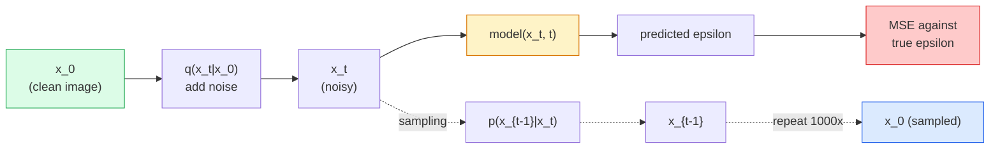

# 图像生成 —— 扩散模型

> 扩散模型学习去噪。训练它从带噪图像中去除微小的噪声，反向重复一千次，就得到了一个图像生成器。

**类型：** 构建
**语言：** Python
**先修知识：** 阶段4第07课（U-Net），阶段1第06课（概率论），阶段3第06课（优化器）
**时间：** ~75分钟

## 学习目标

- 推导前向加噪过程`x_0 -> x_1 -> ... -> x_T`并解释为何闭式`q(x_t | x_0)`对任意t成立
- 实现一个DDPM风格的训练目标，回归每一步添加的噪声，以及一个从纯噪声反向行走生成图像的采样器
- 构建一个时间条件U-Net（小到可以在CPU上训练），预测任意时间步的噪声
- 解释DDPM和DDIM采样的区别，以及各自适用的场景（第23课深入讲解流匹配(Flow Matching)和矫正流(Rectified Flow)）

## 问题

GAN是一步生成：噪声输入，图像输出，一次前向传播。它们速度快但难以训练。扩散模型是迭代生成：从纯噪声开始，小步去噪，图像逐渐显现。它们速度慢但容易训练。过去五年中，后者的特性占据了主导：任何小团队都能训练扩散模型并获得合理的样本；而GAN训练是一门需要多年失败经验才能掌握的技艺。

除了训练稳定性，扩散模型的迭代结构还解锁了现代图像生成的所有功能：文本条件生成、图像修复、图像编辑、超分辨率、可控风格。采样循环的每一步都可以注入新的约束。正是这一点使得Stable Diffusion、Imagen、DALL-E 3、Midjourney以及你将使用的每个可控图像模型都基于扩散模型。

本课构建最小化的DDPM：前向加噪、反向去噪、训练循环。下一课（Stable Diffusion）将其集成到生产系统中，包括VAE、文本编码器和无分类器引导(Classifier-Free Guidance)。

## 核心概念

### 前向过程

取一张图像`x_0`。添加少量高斯噪声得到`x_1`。再添加少量得到`x_2`。持续T步直到`x_T`几乎无法与纯高斯噪声区分。

```
q(x_t | x_{t-1}) = N(x_t; sqrt(1 - beta_t) * x_{t-1},  beta_t * I)
```

`beta_t`是一个小方差调度，通常从0.0001线性增加到0.02，共T=1000步。每一步都略微缩小信号并注入新噪声。

### 闭式跳跃

一步接一步地添加噪声是一个马尔可夫链，但数学上可以折叠：你可以一步直接从`x_0`采样`x_t`。

```
Define alpha_t = 1 - beta_t
Define alpha_bar_t = prod_{s=1..t} alpha_s

Then:
  q(x_t | x_0) = N(x_t; sqrt(alpha_bar_t) * x_0,  (1 - alpha_bar_t) * I)

Equivalently:
  x_t = sqrt(alpha_bar_t) * x_0 + sqrt(1 - alpha_bar_t) * epsilon
  where epsilon ~ N(0, I)
```

这一个方程式是扩散模型实用的全部原因。训练时，你随机选择一个`t`，直接从`x_0`采样`x_t`，一步训练——无需模拟完整的马尔可夫链。

### 反向过程

前向过程是固定的。反向过程`p(x_{t-1} | x_t)`是神经网络学习的内容。扩散模型不直接预测`x_{t-1}`；它们预测步骤t添加的噪声`epsilon`，然后通过数学推导得到`x_{t-1}`。



### 训练损失

对于每个训练步骤：

1. 采样一张真实图像`x_0`。
2. 从[1, T]均匀采样一个时间步`x_0`。
3. 采样噪声`x_0`。
4. 计算`x_0`。
5. 用网络预测`x_0`。
6. 最小化`x_0`。

就是这样。神经网络学会预测任意时间步的噪声。损失函数是均方误差(MSE)。没有对抗博弈，没有模式崩塌，没有振荡。

### 采样器（DDPM）

生成时：从`x_T ~ N(0, I)`开始，一步接一步反向行走。

```
for t = T, T-1, ..., 1:
    eps = model(x_t, t)
    x_{t-1} = (1 / sqrt(alpha_t)) * (x_t - (beta_t / sqrt(1 - alpha_bar_t)) * eps) + sqrt(beta_t) * z
    where z ~ N(0, I) if t > 1, else 0
return x_0
```

关键在于，尽管反向条件通常没有闭式解，但对于这个特定的高斯前向过程，它是闭式的。那些看起来丑陋的系数正是贝叶斯法则给出的。

### 为什么是1000步

前向噪声调度选择使得每一步添加的噪声恰好使反向步骤近似高斯。步数太少，反向步骤远离高斯，网络难以建模。步数太多，采样代价高昂而收益递减。T=1000配合线性调度是DDPM的默认设置。

### DDIM：20倍速采样

训练相同，采样改变。DDIM（Song等人，2020）定义了一个确定性的反向过程，可以在不重新训练的情况下跳过时间步。使用DDIM进行50步采样可获得接近1000步DDPM的质量。每个生产系统都使用DDIM或更快的变体（DPM-Solver, Euler ancestral）。

### 时间条件

网络`epsilon_theta(x_t, t)`需要知道它在去噪的时间步。现代扩散模型通过正弦时间嵌入（与Transformer中的位置编码相同思想）注入`t`，这些嵌入在U-Net的每一层被加到特征图上。

```
t_embedding = sinusoidal(t)
feature_map += MLP(t_embedding)
```

没有时间条件，网络必须从图像本身猜测噪声水平，这虽然可行但样本效率低得多。

## 动手构建

### 第1步：噪声调度

```python
import torch

def linear_beta_schedule(T=1000, beta_start=1e-4, beta_end=2e-2):
    return torch.linspace(beta_start, beta_end, T)


def precompute_schedule(betas):
    alphas = 1.0 - betas
    alphas_cumprod = torch.cumprod(alphas, dim=0)
    return {
        "betas": betas,
        "alphas": alphas,
        "alphas_cumprod": alphas_cumprod,
        "sqrt_alphas_cumprod": torch.sqrt(alphas_cumprod),
        "sqrt_one_minus_alphas_cumprod": torch.sqrt(1.0 - alphas_cumprod),
        "sqrt_recip_alphas": torch.sqrt(1.0 / alphas),
    }

schedule = precompute_schedule(linear_beta_schedule(T=1000))
```

预计算一次，训练和采样时按索引收集。

### 步骤2：前向扩散（q_sample）

```python
def q_sample(x0, t, noise, schedule):
    sqrt_a = schedule["sqrt_alphas_cumprod"][t].view(-1, 1, 1, 1)
    sqrt_one_minus_a = schedule["sqrt_one_minus_alphas_cumprod"][t].view(-1, 1, 1, 1)
    return sqrt_a * x0 + sqrt_one_minus_a * noise
```

单行闭式解。`t` 是时间步的一个批次，每张图像对应一个。

### 步骤3：一个微型时间条件U-Net

```python
import torch.nn as nn
import torch.nn.functional as F
import math

def timestep_embedding(t, dim=64):
    half = dim // 2
    freqs = torch.exp(-math.log(10000) * torch.arange(half, device=t.device) / half)
    args = t[:, None].float() * freqs[None]
    emb = torch.cat([args.sin(), args.cos()], dim=-1)
    return emb


class TinyUNet(nn.Module):
    def __init__(self, img_channels=3, base=32, t_dim=64):
        super().__init__()
        self.t_mlp = nn.Sequential(
            nn.Linear(t_dim, base * 4),
            nn.SiLU(),
            nn.Linear(base * 4, base * 4),
        )
        self.t_dim = t_dim
        self.enc1 = nn.Conv2d(img_channels, base, 3, padding=1)
        self.enc2 = nn.Conv2d(base, base * 2, 4, stride=2, padding=1)
        self.mid = nn.Conv2d(base * 2, base * 2, 3, padding=1)
        self.dec1 = nn.ConvTranspose2d(base * 2, base, 4, stride=2, padding=1)
        self.dec2 = nn.Conv2d(base * 2, img_channels, 3, padding=1)
        self.time_proj = nn.Linear(base * 4, base * 2)

    def forward(self, x, t):
        t_emb = timestep_embedding(t, self.t_dim)
        t_emb = self.t_mlp(t_emb)
        t_proj = self.time_proj(t_emb)[:, :, None, None]

        h1 = F.silu(self.enc1(x))
        h2 = F.silu(self.enc2(h1)) + t_proj
        h3 = F.silu(self.mid(h2))
        d1 = F.silu(self.dec1(h3))
        d2 = torch.cat([d1, h1], dim=1)
        return self.dec2(d2)
```

两级U-Net，在瓶颈处注入时间条件。对真实图像增加深度和宽度。

### 步骤4：训练循环

```python
def train_step(model, x0, schedule, optimizer, device, T=1000):
    model.train()
    x0 = x0.to(device)
    bs = x0.size(0)
    t = torch.randint(0, T, (bs,), device=device)
    noise = torch.randn_like(x0)
    x_t = q_sample(x0, t, noise, schedule)
    pred = model(x_t, t)
    loss = F.mse_loss(pred, noise)
    optimizer.zero_grad()
    loss.backward()
    optimizer.step()
    return loss.item()
```

这就是整个训练循环。没有GAN博弈，没有特殊损失函数，只有一个MSE调用。

### 步骤5：采样器（DDPM）

```python
@torch.no_grad()
def sample(model, schedule, shape, T=1000, device="cpu"):
    model.eval()
    x = torch.randn(shape, device=device)
    betas = schedule["betas"].to(device)
    sqrt_one_minus_a = schedule["sqrt_one_minus_alphas_cumprod"].to(device)
    sqrt_recip_alphas = schedule["sqrt_recip_alphas"].to(device)

    for t in reversed(range(T)):
        t_batch = torch.full((shape[0],), t, dtype=torch.long, device=device)
        eps = model(x, t_batch)
        coef = betas[t] / sqrt_one_minus_a[t]
        mean = sqrt_recip_alphas[t] * (x - coef * eps)
        if t > 0:
            x = mean + torch.sqrt(betas[t]) * torch.randn_like(x)
        else:
            x = mean
    return x
```

1000次前向传播以生成一批样本。在实际代码中，你会将其替换为DDIM 50步采样器。

### 步骤6：DDIM采样器（确定性，大约快20倍）

```python
@torch.no_grad()
def sample_ddim(model, schedule, shape, steps=50, T=1000, device="cpu", eta=0.0):
    model.eval()
    x = torch.randn(shape, device=device)
    alphas_cumprod = schedule["alphas_cumprod"].to(device)

    ts = torch.linspace(T - 1, 0, steps + 1).long()
    for i in range(steps):
        t = ts[i]
        t_prev = ts[i + 1]
        t_batch = torch.full((shape[0],), t, dtype=torch.long, device=device)
        eps = model(x, t_batch)
        a_t = alphas_cumprod[t]
        a_prev = alphas_cumprod[t_prev] if t_prev >= 0 else torch.tensor(1.0, device=device)
        x0_pred = (x - torch.sqrt(1 - a_t) * eps) / torch.sqrt(a_t)
        sigma = eta * torch.sqrt((1 - a_prev) / (1 - a_t) * (1 - a_t / a_prev))
        dir_xt = torch.sqrt(1 - a_prev - sigma ** 2) * eps
        noise = sigma * torch.randn_like(x) if eta > 0 else 0
        x = torch.sqrt(a_prev) * x0_pred + dir_xt + noise
    return x
```

`eta=0` 是完全确定性的（相同的噪声输入总是产生相同的输出）。`eta=1` 恢复为DDPM。

## 使用它

对于生产环境，使用 `diffusers`：

```python
from diffusers import DDPMScheduler, UNet2DModel

unet = UNet2DModel(sample_size=32, in_channels=3, out_channels=3, layers_per_block=2)
scheduler = DDPMScheduler(num_train_timesteps=1000)
```

该库内置了现成的调度器（DDPM、DDIM、DPM-Solver、Euler、Heun）、可配置的U-Net、用于文生图和图生图的管线，以及LoRA微调辅助工具。

对于研究，`k-diffusion`（Katherine Crowson）拥有最忠实的参考实现和最佳的采样变体。

## 发布

本課(lesson)产出：

- `outputs/prompt-diffusion-sampler-picker.md` —— 根据质量目标、延迟预算和条件类型选择DDPM/DDIM/DPM-Solver/Euler的提示。
- `outputs/prompt-diffusion-sampler-picker.md` —— 一个技能，给定T和目标损坏水平，生成线性、余弦或sigmoid的beta调度，以及信噪比随时间变化的诊断图。

## 练习

1. **（简单）** 可视化前向过程：取一张图像，在 `t in [0, 100, 250, 500, 750, 1000]` 处绘制 `x_t`。验证 `x_1000` 看起来像纯高斯噪声。
2. **（中等）** 在合成圆圈数据集上训练TinyUNet 20个epoch，并采样16个圆圈。比较DDPM（1000步）和DDIM（50步）采样——它们从相同的噪声种子产生的图像相似吗？
3. **（困难）** 实现余弦噪声调度（Nichol & Dhariwal, 2021）：`x_t`。分别用线性和余弦调度训练相同的模型，并展示余弦在低步数下给出更好的样本。

## 关键术语

|  术语  |  人们的说法  |  实际含义  |
|------|----------------|----------------------|
|  前向过程  |  "随时间添加噪声"  |  将图像在T步内退化为高斯噪声的固定马尔可夫链  |
|  反向过程  |  "逐步去噪"  |  学习到的分布，从噪声逆向行走到图像  |
|  噪声预测  |  "预测噪声"  |  训练目标：`epsilon_theta(x_t, t)` 预测在步骤t添加的噪声  |
|  Beta调度  |  "噪声量"  |  定义每步噪声量的T个小方差序列  |
|  alpha_bar_t  |  "累积保留因子"  |  到时间t为止(1 - beta_s)的乘积；t越大，剩余信号越少  |
|  DDPM采样器  |  "祖先式，随机"  |  从每个条件高斯分布中采样 x_{t-1}；1000步  |
|  DDIM采样器  |  "确定性，快速"  |  将采样重写为确定性ODE；20-100步，质量相近  |
|  时间条件  |  "告诉模型当前时刻t"  |  注入U-Net的正弦嵌入，使模型知道噪声水平  |

## 延伸阅读

- [Denoising Diffusion Probabilistic Models (Ho et al., 2020)](https://arxiv.org/abs/2006.11239) —— 使扩散实用化并在FID上击败GAN的论文
- [Denoising Diffusion Probabilistic Models (Ho et al., 2020)](https://arxiv.org/abs/2006.11239) —— 余弦调度和v参数化
- [Denoising Diffusion Probabilistic Models (Ho et al., 2020)](https://arxiv.org/abs/2006.11239) —— 使实时推理成为可能的确定性采样器
- [Denoising Diffusion Probabilistic Models (Ho et al., 2020)](https://arxiv.org/abs/2006.11239) —— 所有扩散设计选择的统一视角；当前最佳参考
