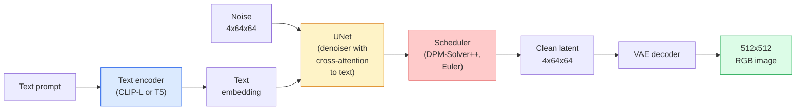

# Stable Diffusion — 架构与微调(Architecture & Fine-Tuning)

> Stable Diffusion 是一种在预训练自编码器(VAE)的潜空间(Latent Space)中运行的DDPM，通过交叉注意力(Cross-Attention)以文本为条件，使用快速确定性ODE求解器采样，并由无分类器指导(Classifier-Free Guidance)引导。

**类型：** 学习+使用
**语言：** Python
**先修知识：** 阶段4第10课（扩散模型(Diffusion)），阶段7第02课（自注意力(Self-Attention)）
**时间：** ~75分钟

## 学习目标

- 梳理Stable Diffusion流水线的五个组成部分：VAE、文本编码器(Text Encoder)、U-Net、调度器(Scheduler)、安全检查器(Safety Checker)——以及每个部分实际的作用
- 解释潜扩散(Latent Diffusion)以及为何在4x64x64的潜空间（而非3x512x512的图像）中训练能将计算量降低48倍且不损失质量
- 使用`diffusers`生成图像，运行图像到图像(img2img)、修补(Inpainting)和ControlNet引导生成
- 通过LoRA在小型自定义数据集上微调Stable Diffusion，并在推理时加载LoRA适配器

## 问题

直接在512x512 RGB图像上训练DDPM成本高昂。每个训练步骤都要反向传播经过一个看到3x512x512=786,432个输入值的U-Net，采样需要经过同一个U-Net的50多次前向传播。在Stable Diffusion 1.5（2022年发布）的质量水平下，像素空间扩散需要大约256 GPU-月的训练时间，并且在消费级GPU上每张图像需要10-30秒。

使开放式权重的文本到图像模型变得实用的技巧是**潜扩散**(Latent Diffusion)（Rombach等人，CVPR 2022）。训练一个VAE，将3x512x512的图像映射到4x64x64的潜张量(Latent Tensor)并反向映射，然后在潜空间中进行扩散。计算量降至`(3*512*512)/(4*64*64) = 48x`。在相同GPU上，采样时间从几十秒降至不到两秒。

几乎所有现代图像生成模型——SDXL、SD3、FLUX、HunyuanDiT、Wan-Video——都是潜扩散模型，只是在自编码器(Autoencoder)、去噪器(Denoiser, U-Net或DiT)和文本条件处理上有所变化。学会Stable Diffusion，你就学会了模板。

## 核心概念

### 流水线



- **VAE** — 冻结的自编码器。编码器将图像转换为潜变量（用于图像到图像和训练）。解码器将潜变量转换回图像。
- **文本编码器** — CLIP文本编码器（SD 1.x/2.x）、CLIP-L + CLIP-G（SDXL）或T5-XXL（SD3/FLUX）。生成一系列词嵌入(Token Embeddings)。
- **U-Net** — 去噪器。具有交叉注意力层，在每个分辨率层从潜变量关注到文本嵌入。
- **调度器** — 采样算法（DDIM、Euler、DPM-Solver++）。选择噪声系数(sigmas)，将预测的噪声混合回潜变量。
- **安全检查器** — 可选的输出图像上的NSFW/非法内容过滤器。

### 无分类器指导(Classifier-Free Guidance, CFG)

纯文本条件学习每个提示词`epsilon_theta(x_t, t, c)`的`c`。CFG训练同一个网络，其中`c`有10%的概率被丢弃（替换为空嵌入），从而得到一个能够预测条件噪声和无条件噪声的单一模型。推理时：

```
eps = eps_uncond + w * (eps_cond - eps_uncond)
```

`w`是指导尺度(guidance scale)。`w=0`是无条件，`w=1`是简单条件，`w>1`推动输出朝向“更受提示词条件限制”的方向，代价是多样性降低。SD默认值为`w=7.5`。

CFG是文本到图像达到生产质量的原因。没有它，提示词对输出的影响较弱；有了它，提示词起主导作用。

### 潜空间几何(Latent Space Geometry)

VAE的4通道潜变量不仅仅是压缩后的图像。它是一个流形(Manifold)，其中的算术大致对应语义编辑（提示词工程和插值都在此进行），并且扩散U-Net被训练将其整个建模能力用在此处。解码一个随机的4x64x64潜变量不会生成看起来随机的图像——它会生成垃圾，因为只有特定的子流形潜变量才能解码为有效图像。

两个推论：

1. **图像到图像(Img2img)** = 将图像编码为潜变量，添加部分噪声，运行去噪器，解码。图像结构得以保留，因为编码接近可逆；内容根据提示词变化。
2. **修补(Inpainting)** = 与图像到图像相同，但去噪器仅更新被遮蔽区域；未遮蔽区域保持为编码后的潜变量。

### U-Net架构

SD U-Net是第10课中TinyUNet的大型版本，增加了三个部分：

- **Transformer块**在每个空间分辨率上，包含自注意力(Self-Attention)和到文本嵌入的交叉注意力(Cross-Attention)。
- **时间嵌入(Time Embedding)**通过正弦编码上的MLP实现。
- **跳跃连接(Skip Connections)**在编码器和解码器的匹配分辨率之间。

SD 1.5的总参数量：~860M。SDXL：~2.6B。FLUX：~12B。参数量的大幅增加主要在注意力层。

### LoRA微调

对Stable Diffusion进行全量微调需要20+ GB显存，并更新860M参数。LoRA（低秩自适应，Low-Rank Adaptation）保持基模型冻结，并在注意力层中注入小的秩分解矩阵。SD的LoRA适配器通常为10-50 MB，在单个消费级GPU上训练10-60分钟，推理时作为即插即用的修改加载。

```
Original: W_q : (d_in, d_out)   frozen
LoRA:     W_q + alpha * (A @ B)   where A : (d_in, r), B : (r, d_out)

r is typically 4-32.
```

LoRA是几乎所有社区微调模型的发布方式。CivitAI和Hugging Face托管了数百万个。

### 你会看到的调度器

- **DDIM** — 确定性，~50步，简单。
- **Euler ancestral** — 随机性，30-50步，样本略显创意。
- **DPM-Solver++ 2M Karras** — 确定性，20-30步，生产默认。
- **LCM / TCD / Turbo** — 一致性模型(Consistency Models)和蒸馏变体；1-4步，质量有一定牺牲。

切换调度器只需在`diffusers`中修改一行代码，有时可以在无需重新训练的情况下修复样本问题。

## 动手构建

本课从头到尾使用`diffusers`，而不是从头重建Stable Diffusion。你需要重建的组件（VAE、文本编码器、U-Net、调度器）是各自课程的主题；这里的目标是熟悉生产级API。

### 第1步：文本到图像

```python
import torch
from diffusers import StableDiffusionPipeline

pipe = StableDiffusionPipeline.from_pretrained(
    "runwayml/stable-diffusion-v1-5",
    torch_dtype=torch.float16,
).to("cuda")

image = pipe(
    prompt="a dog riding a skateboard in tokyo, studio ghibli style",
    guidance_scale=7.5,
    num_inference_steps=25,
    generator=torch.Generator("cuda").manual_seed(42),
).images[0]
image.save("dog.png")
```

`float16`将显存减半，且无明显质量损失。`num_inference_steps=25`配合默认的DPM-Solver++可达到`num_inference_steps=50`与DDIM相当的效果。

### 第二步：切换调度器(Scheduler)

```python
from diffusers import DPMSolverMultistepScheduler, EulerAncestralDiscreteScheduler

pipe.scheduler = DPMSolverMultistepScheduler.from_config(pipe.scheduler.config)
pipe.scheduler = EulerAncestralDiscreteScheduler.from_config(pipe.scheduler.config)
```

调度器状态与U-Net权重解耦。你可以在DDPM上训练，并使用任意调度器进行采样。

### 第三步：图到图(Image-to-image)

```python
from diffusers import StableDiffusionImg2ImgPipeline
from PIL import Image

img2img = StableDiffusionImg2ImgPipeline.from_pretrained(
    "runwayml/stable-diffusion-v1-5",
    torch_dtype=torch.float16,
).to("cuda")

init_image = Image.open("dog.png").convert("RGB").resize((512, 512))
out = img2img(
    prompt="a dog riding a skateboard, oil painting",
    image=init_image,
    strength=0.6,
    guidance_scale=7.5,
).images[0]
```

`strength`是去噪前添加的噪声量（0.0=不变，1.0=完全重生成）。0.5-0.7是风格迁移的标准范围。

### 第四步：修复(Inpainting)

```python
from diffusers import StableDiffusionInpaintPipeline

inpaint = StableDiffusionInpaintPipeline.from_pretrained(
    "runwayml/stable-diffusion-inpainting",
    torch_dtype=torch.float16,
).to("cuda")

image = Image.open("dog.png").convert("RGB").resize((512, 512))
mask = Image.open("dog_mask.png").convert("L").resize((512, 512))

out = inpaint(
    prompt="a cat",
    image=image,
    mask_image=mask,
    guidance_scale=7.5,
).images[0]
```

掩膜(Mask)中的白色像素是需要重生成的区域，黑色像素被保留。

### 第五步：LoRA加载

```python
pipe.load_lora_weights("sayakpaul/sd-lora-ghibli")
pipe.fuse_lora(lora_scale=0.8)

image = pipe(prompt="a village square in ghibli style").images[0]
```

`lora_scale`控制强度；0.0=无效果，1.0=完全效果。`fuse_lora`将适配器(adapter)永久融合到权重中以提升速度，但阻止了切换。加载不同适配器前请调用`pipe.unfuse_lora()`。

### 第六步：LoRA训练（草图）

真正的LoRA训练位于`peft`或`diffusers.training`中。概述如下：

```python
# Pseudocode
for step, batch in enumerate(dataloader):
    images, prompts = batch
    latents = vae.encode(images).latent_dist.sample() * 0.18215

    t = torch.randint(0, num_train_timesteps, (batch_size,))
    noise = torch.randn_like(latents)
    noisy_latents = scheduler.add_noise(latents, noise, t)

    text_emb = text_encoder(tokenizer(prompts))

    pred_noise = unet(noisy_latents, t, text_emb)  # LoRA weights injected here

    loss = F.mse_loss(pred_noise, noise)
    loss.backward()
    optimizer.step()
```

只有LoRA矩阵接收梯度；基础U-Net、VAE和文本编码器(text encoder)被冻结。在批大小为1且启用梯度检查点(gradient checkpointing)的情况下，这可以在8 GB显存中运行。

## 使用它

在实际生产中，你需要做出的决策如下：

- **模型族(Model family)**：开源社区微调用SD 1.5，更高保真度用SDXL，最先进且严格遵守许可用SD3 / FLUX。
- **调度器(Scheduler)**：20-30步用DPM-Solver++ 2M Karras，延迟低于1秒时用LCM-LoRA。
- **精度(Precision)**：4080/4090上用`float16`，A100及更新型号上用`bfloat16`，显存紧张时（通过`bitsandbytes`或`compel`）用`int8`。
- **条件(Conditioning)**：纯文本即可；如需更强控制，在基础管线(pipeline)上添加ControlNet（canny边缘、深度、姿态）。

批量生成时，社区工具用`AUTO1111` / `ComfyUI`；生产API用`diffusers` + `accelerate`或`optimum-nvidia`配合TensorRT编译。

## 发布

本課(lesson)产出：

- `outputs/prompt-sd-pipeline-planner.md`——一个根据延迟预算、保真度目标和许可约束选择SD 1.5 / SDXL / SD3 / FLUX及调度器和平精度的提示词(prompt)。
- `outputs/prompt-sd-pipeline-planner.md`——一个用于编写完整LoRA训练配置的技能，包括标题(captions)、秩(rank)、批大小(batch size)和学习率(learning rate)。

## 练习

1. **(简单)** 在`[1, 3, 5, 7.5, 10, 15]`中使用`guidance_scale`生成相同的提示词。描述图像如何变化。伪影在哪个引导值(guidance value)下出现？
2. **(中等)** 取一张真实照片，在`StableDiffusionImg2ImgPipeline`中以`[1, 3, 5, 7.5, 10, 15]`的`guidance_scale`运行。哪种强度在改变风格时保留了构图？为什么1.0完全忽略输入？
3. **(困难)** 在一个主题（宠物、标志、角色）的10-20张图像上训练LoRA，并用该主题生成新场景。报告保留身份(identity)最好且不过拟合输入图像的LoRA秩和训练步数。

## 关键术语

|  术语  |  人们的说法  |  实际含义  |
|------|----------------|----------------------|
|  潜在扩散(Latent diffusion)  |  "在潜在空间中扩散"  |  在VAE潜在空间（4x64x64）而非像素空间（3x512x512）中运行整个DDPM；节省48倍计算量  |
|  VAE缩放因子(VAE scale factor)  |  "0.18215"  |  将VAE原始潜在值重新缩放至近似单位方差(unit variance)的常数；硬编码于每个SD管线中  |
|  无分类器引导(Classifier-free guidance)  |  "CFG"  |  混合有条件与无条件噪声预测；最重要的推理参数  |
|  调度器(Scheduler)  |  "采样器(Sampler)"  |  将噪声与模型预测转化为去噪潜在轨迹的算法  |
|  LoRA  |  "低秩适配器(Low-rank adapter)"  |  在不触及基础权重的情况下微调注意力层的小型低秩分解矩阵  |
|  交叉注意力(Cross-attention)  |  "文本-图像注意力"  |  从潜在令牌(latent tokens)到文本令牌的注意力；在每个U-Net层级注入提示信息  |
|  ControlNet  |  "结构条件"  |  一个单独训练的适配器，通过额外输入（canny边缘、深度、姿态、分割）引导SD  |
|  DPM-Solver++  |  "默认调度器"  |  二阶确定性ODE求解器；2026年低步数（20-30）下质量最佳  |

## 延伸阅读

- [High-Resolution Image Synthesis with Latent Diffusion (Rombach et al., 2022)](https://arxiv.org/abs/2112.10752)——Stable Diffusion论文；包含所有验证设计的消融实验
- [High-Resolution Image Synthesis with Latent Diffusion (Rombach et al., 2022)](https://arxiv.org/abs/2112.10752)——CFG论文
- [High-Resolution Image Synthesis with Latent Diffusion (Rombach et al., 2022)](https://arxiv.org/abs/2112.10752)——LoRA最初用于NLP；几乎未加修改就迁移到了SD
- [High-Resolution Image Synthesis with Latent Diffusion (Rombach et al., 2022)](https://arxiv.org/abs/2112.10752)——每个SD / SDXL / SD3 / FLUX管线的参考文档
