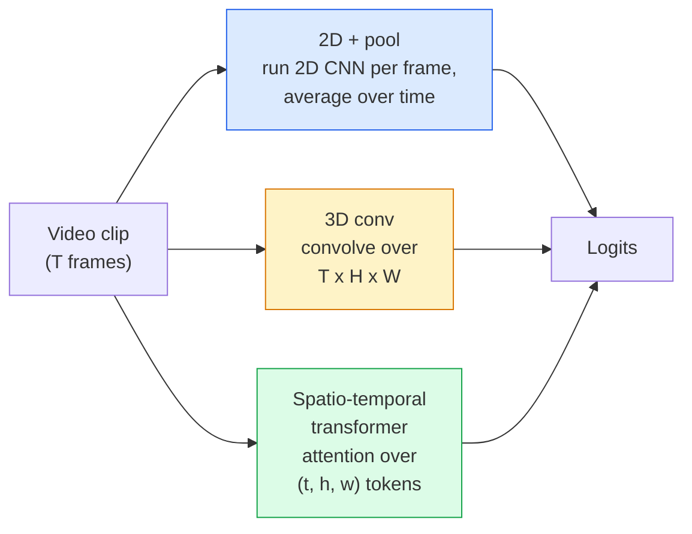

# 视频理解——时间建模

> 视频是由一系列图像以及连接它们的物理规律组成的。每种视频模型要么将时间视为额外的轴（3D卷积），要么视为需要关注的序列（transformer），要么是提取一次并池化的特征（2D+池化）。

**类型：**学习+构建
**语言：**Python
**前置要求：**第4阶段第03课（CNN），第4阶段第04课（图像分类）
**时间：**约45分钟

## 学习目标

- 区分三种主要的视频建模方法（2D+池化、3D卷积、时空transformer）并预测它们的成本与精度权衡
- 在PyTorch中实现帧采样、时间池化和2D+池化基线分类器
- 解释为什么I3D的“膨胀”3D卷积核能从ImageNet权重很好地迁移，以及分解的(2+1)D卷积有何不同
- 阅读标准动作识别数据集和指标：Kinetics-400/600、UCF101、Something-Something V2；在片段和视频级别的top-1精度

## 问题

一个30秒、30fps的视频有900帧图像。简单来说，视频分类就是进行900次图像分类，然后进行某种聚合。当动作在几乎每一帧中都可见时（体育、烹饪、运动视频）这种方法有效，但当动作本身由运动定义时则效果很差："把某物从左推到右"在每一帧看起来都像两个静止物体。

每个视频架构的核心问题是：何时以及如何建模时间结构？答案驱动着其他所有方面——计算成本、预训练策略、是否可以重用ImageNet权重、模型训练所用的数据集。

本课特意比静态图像课更短。核心图像机制已经就位，视频理解主要涉及时间故事：采样、建模和聚合。

## 核心概念

### 三大架构家族



### 2D + 池化

取一个2D CNN（ResNet、EfficientNet、ViT）。在每个采样帧上独立运行。对每帧嵌入进行平均（或最大池化、注意力池化）。将池化后的向量输入分类器。

优点：
- ImageNet预训练直接迁移。
- 最容易实现。
- 便宜：T帧 * 单张图像推理成本。

缺点：
- 无法建模运动。动作 = 外观的聚合。
- 时间池化是顺序不变的；"开门"和"关门"看起来一样。

何时使用：外观密集型任务、小视频数据集上的迁移学习、初始基线。

### 3D卷积

用3D (T, H, W)卷积核替换2D (H, W)卷积核。网络在空间和时间上同时卷积。早期家族：C3D、I3D、SlowFast。

I3D技巧：取一个预训练的2D ImageNet模型，沿着新的时间轴复制每个2D卷积核以“膨胀”它。一个3x3的2D卷积变成3x3x3的3D卷积。这为3D模型提供了强大的预训练权重，而不是从头训练。

优点：
- 直接建模运动。
- I3D膨胀提供免费的迁移学习。

缺点：
- 比2D对应模型多T/8的FLOPs（对于堆叠3次的3时间核）。
- 时间核很小；长距离运动需要金字塔或双流方法。

何时使用：运动作为信号的动作识别（Something-Something V2、Kinetics中运动密集型类别）。

### 时空transformer

将视频词元化为时空块的网格，并在所有块上进行注意力。TimeSformer、ViViT、Video Swin、VideoMAE。

重要的注意力模式：
- **联合（Joint）**——一个大的注意力覆盖(t, h, w)。关于`T*H*W`的二次方；昂贵。
- **分裂（Divided）**——每块两个注意力：一个在时间上，一个在空间上。近似线性缩放。
- **分解（Factorised）**——时间注意力和空间注意力在块之间交替。

优点：
- 在每项主要基准上达到SOTA精度。
- 通过面片膨胀从图像transformer（ViT）迁移。
- 通过稀疏注意力支持长上下文视频。

缺点：
- 计算消耗大。
- 需要仔细选择注意力模式，否则运行时间会膨胀。

何时使用：大型数据集、高保真视频理解、多模态视频+文本任务。

### 帧采样

一个10秒、30fps的片段有300帧；将所有300帧输入任何模型都是浪费。标准策略：

- **均匀采样**——在整个片段中均匀选取T帧。2D+池化的默认方式。
- **密集采样**——随机连续的T帧窗口。常见于3D卷积，因为运动需要相邻帧。
- **多片段采样**——从同一视频中采样多个T帧窗口，分别分类，在测试时平均预测。

T通常为8、16、32或64。更高的T意味着更多的时间信号和更多的计算。

### 评估

两个层级：
- **片段级准确率(Clip-level accuracy)** — 模型看到一个T帧片段，报告top-k。
- **视频级准确率(Video-level accuracy)** — 对每个视频多个片段的片段级预测取平均；更高且更稳定。

始终报告两者。一个在片段级78%/视频级82%的模型严重依赖测试时平均；而片段级80%/视频级81%的模型在每个片段上更稳健。

### 你将遇到的常用数据集

- **Kinetics-400 / 600 / 700** — 通用动作数据集。40万片段；YouTube链接（许多现已失效）。
- **Something-Something V2** — 运动定义的动作（"将X从左移到右"）。无法通过2D+池化解决。
- **UCF-101**, **HMDB-51** — 较旧、较小，但仍被报告。
- **AVA** — 动作在空间和时间上的*定位*；比分类更难。

## 动手构建

### 第一步：帧采样器(Frame sampler)

在帧列表（或视频张量）上工作的均匀和密集采样器。

```python
import numpy as np

def sample_uniform(num_frames_total, T):
    if num_frames_total <= T:
        return list(range(num_frames_total)) + [num_frames_total - 1] * (T - num_frames_total)
    step = num_frames_total / T
    return [int(i * step) for i in range(T)]


def sample_dense(num_frames_total, T, rng=None):
    rng = rng or np.random.default_rng()
    if num_frames_total <= T:
        return list(range(num_frames_total)) + [num_frames_total - 1] * (T - num_frames_total)
    start = int(rng.integers(0, num_frames_total - T + 1))
    return list(range(start, start + T))
```

两者都返回`T`索引，用于切片视频张量。

### 第二步：2D+池化基线(2D+pool baseline)

对每一帧运行2D ResNet-18，对特征进行平均池化，然后分类。

```python
import torch
import torch.nn as nn
from torchvision.models import resnet18, ResNet18_Weights

class FramePool(nn.Module):
    def __init__(self, num_classes=400, pretrained=True):
        super().__init__()
        weights = ResNet18_Weights.IMAGENET1K_V1 if pretrained else None
        backbone = resnet18(weights=weights)
        self.features = nn.Sequential(*(list(backbone.children())[:-1]))  # global avg pool kept
        self.head = nn.Linear(512, num_classes)

    def forward(self, x):
        # x: (N, T, 3, H, W)
        N, T = x.shape[:2]
        x = x.view(N * T, *x.shape[2:])
        feats = self.features(x).view(N, T, -1)
        pooled = feats.mean(dim=1)
        return self.head(pooled)

model = FramePool(num_classes=10)
x = torch.randn(2, 8, 3, 224, 224)
print(f"output: {model(x).shape}")
print(f"params: {sum(p.numel() for p in model.parameters()):,}")
```

一千一百万参数，ImageNet预训练，逐帧运行，平均，分类。在外观密集型任务上，该基线通常在正确3D模型的5-10个点以内——有时更好，因为它复用了更强的ImageNet骨干网络。

### 第三步：I3D风格的膨胀3D卷积

通过沿新的时间轴重复权重，将单个2D卷积转换为3D卷积。

```python
def inflate_2d_to_3d(conv2d, time_kernel=3):
    out_c, in_c, kh, kw = conv2d.weight.shape
    weight_3d = conv2d.weight.data.unsqueeze(2)  # (out, in, 1, kh, kw)
    weight_3d = weight_3d.repeat(1, 1, time_kernel, 1, 1) / time_kernel
    conv3d = nn.Conv3d(in_c, out_c, kernel_size=(time_kernel, kh, kw),
                        padding=(time_kernel // 2, conv2d.padding[0], conv2d.padding[1]),
                        stride=(1, conv2d.stride[0], conv2d.stride[1]),
                        bias=False)
    conv3d.weight.data = weight_3d
    return conv3d

conv2d = nn.Conv2d(3, 64, kernel_size=3, padding=1, bias=False)
conv3d = inflate_2d_to_3d(conv2d, time_kernel=3)
print(f"2D weight shape:  {tuple(conv2d.weight.shape)}")
print(f"3D weight shape:  {tuple(conv3d.weight.shape)}")
x = torch.randn(1, 3, 8, 56, 56)
print(f"3D output shape:  {tuple(conv3d(x).shape)}")
```

除以`time_kernel`保持激活幅度大致恒定——这对于在第一次前向传播时不破坏批归一化统计量很重要。

### 第四步：分解式(2+1)D卷积

将3D卷积分解为2D（空间）卷积和1D（时间）卷积。相同的感受野，更少的参数，在某些基准上准确率更高。

```python
class Conv2Plus1D(nn.Module):
    def __init__(self, in_c, out_c, kernel_size=3):
        super().__init__()
        mid_c = (in_c * out_c * kernel_size * kernel_size * kernel_size) \
                // (in_c * kernel_size * kernel_size + out_c * kernel_size)
        self.spatial = nn.Conv3d(in_c, mid_c, kernel_size=(1, kernel_size, kernel_size),
                                 padding=(0, kernel_size // 2, kernel_size // 2), bias=False)
        self.bn = nn.BatchNorm3d(mid_c)
        self.act = nn.ReLU(inplace=True)
        self.temporal = nn.Conv3d(mid_c, out_c, kernel_size=(kernel_size, 1, 1),
                                  padding=(kernel_size // 2, 0, 0), bias=False)

    def forward(self, x):
        return self.temporal(self.act(self.bn(self.spatial(x))))

c = Conv2Plus1D(3, 64)
x = torch.randn(1, 3, 8, 56, 56)
print(f"(2+1)D output: {tuple(c(x).shape)}")
```

完整的R(2+1)D网络与ResNet-18相同，只是每个3x3卷积被替换为`Conv2Plus1D`。

## 使用它

两个库覆盖了生产级视频工作：

- `torchvision.models.video` — R(2+1)D、MViT、Swin3D，带有预训练的Kinetics权重。与图像模型相同的API。
- `torchvision.models.video` (Meta) — 模型动物园，用于Kinetics / SSv2 / AVA的数据加载器，标准变换。

对于视觉-语言视频模型（视频字幕、视频问答），使用`transformers`（`VideoMAE`、`VideoLLaMA`、`InternVideo`）。

## 发布

本課(lesson)产出：

- `outputs/prompt-video-architecture-picker.md` — 一个提示(Prompt)，根据外观vs运动、数据集大小和计算预算选择2D+池化 / I3D / (2+1)D / 变换器。
- `outputs/prompt-video-architecture-picker.md` — 一个技能(Skill)，检查视频流水线的采样器并标记常见错误：索引差一、当`outputs/skill-frame-sampler-auditor.md`时采样不均匀、缺少保持宽高比的裁剪等。

## 练习

1. **(简单)** 计算FramePool（T=8）与I3D风格3D ResNet（T=8）的FLOPs（近似值）。证明为什么2D+池化便宜3-5倍。
2. **(中等)** 生成一个合成视频数据集：随机方向运动的随机球，按运动方向标记（"从左到右"、"从右到左"、"对角线向上"）。对其训练FramePool。证明它达到接近随机准确率，表明仅凭外观不足以完成运动任务。
3. **(困难)** 通过将ResNet-18中的每个Conv2d替换为`Conv2Plus1D`构建R(2+1)D-18。从ImageNet预训练的ResNet-18膨胀第一个卷积的权重。在练习2的运动数据集上训练并击败FramePool。

## 关键术语

|  术语  |  人们的说法  |  实际含义  |
|------|----------------|----------------------|
|  2D + 池化  |  "逐帧分类器"  |  在每个采样帧上运行2D CNN，对时间上的特征进行平均池化，然后分类  |
|  3D卷积  |  "时空卷积核"  |  在(T, H, W)上卷积的核；能原生建模运动  |
|  膨胀  |  "将2D权重提升到3D"  |  通过沿新时间轴重复2D卷积权重来初始化3D卷积权重，然后除以kernel_T以保持激活尺度  |
|  (2+1)D  |  "分解式卷积"  |  将3D分解为2D空间+1D时间；参数更少，之间额外非线性  |
|  分割注意力  |  "先时间后空间"  |  每层有两个注意力的变换器块：一个对同一帧的令牌(token)，一个对同一位置的令牌  |
|  片段  |  "T帧窗口"  |  一个采样得到的T帧子序列；视频模型消费的单位  |
|  片段vs视频准确率  |  "两种评估设置"  |  片段=每个视频一个样本，视频=多个采样片段的平均  |
|  Kinetics  |  "视频界的ImageNet"  |  400-700个动作类别，30万+YouTube片段，标准的视频预训练语料库  |

## 延伸阅读

- [I3D: Quo Vadis, Action Recognition (Carreira & Zisserman, 2017)](https://arxiv.org/abs/1705.07750) — introduces inflation and the Kinetics dataset
- [I3D: Quo Vadis, Action Recognition (Carreira & Zisserman, 2017)](https://arxiv.org/abs/1705.07750) — factorised conv, still a strong baseline
- [I3D: Quo Vadis, Action Recognition (Carreira & Zisserman, 2017)](https://arxiv.org/abs/1705.07750) — the first strong video transformer
- [I3D: Quo Vadis, Action Recognition (Carreira & Zisserman, 2017)](https://arxiv.org/abs/1705.07750) — masked autoencoder pretraining for video; current dominant pretraining recipe
