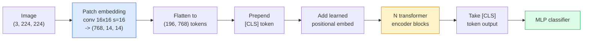

# 视觉变换器(Vision Transformers, ViT)

> 将图像切分为小块，将每个小块视为一个单词，运行标准变换器。无需回头。

**类型：** 构建
**语言：** Python
**前置知识：** 阶段7第02课（自注意力），阶段4第04课（图像分类）
**时长：** ~45分钟

## 学习目标

- 从头实现小块嵌入、可学习位置嵌入、类别标记和变换器编码器模块，构建一个最小化的ViT
- 解释为什么ViT被认为需要大规模预训练数据，直到DeiT和MAE证明了相反的情况
- 比较ViT、Swin和ConvNeXt在架构先验方面的差异（无、局部窗口注意力、卷积骨干）
- 使用`timm`和标准线性探测/微调方案在小数据集上微调预训练的ViT

## 问题

在十年间，卷积一直是计算机视觉的代名词。CNN具有强大的归纳偏置——局部性、平移等变性——以至于没人认为可以取代它们。随后Dosovitskiy等人（2020年）证明，一个普通的变换器应用于展平的图像小块，没有任何卷积机制，在大规模下能够匹敌甚至超越最好的CNN。

关键在于“大规模”。在ImageNet-1k上，ViT输给了ResNet。在ImageNet-21k或JFT-300M上预训练然后在ImageNet-1k上微调的ViT则胜出。结论是变换器缺乏有用的先验，但可以从足够的数据中学习。后续工作（DeiT, MAE, DINO）表明，采用合适的训练策略——强数据增强、自监督预训练、蒸馏——ViT在小数据上也能很好地训练。

到2026年，纯CNN在边缘设备上仍然有竞争力（ConvNeXt最强），但变换器在其它所有领域占据主导：分割（Mask2Former, SegFormer）、检测（DETR, RT-DETR）、多模态（CLIP, SigLIP）、视频（VideoMAE, VJEPA）。ViT模块结构是最需要了解的。

## 核心概念

### 流水线



七个步骤。小块 -> 标记 -> 注意力 -> 分类器。每种变体（DeiT, Swin, ConvNeXt, MAE预训练）只改变其中一两个步骤，其余保持不变。

### 小块嵌入

第一个卷积是秘密。核大小16，步长16，因此224x224的图像变为14x14的16x16小块网格，每个小块投影为768维嵌入。单个卷积同时完成小块化和线性投影。

```
Input:  (3, 224, 224)
Conv (3 -> 768, k=16, s=16, no padding):
Output: (768, 14, 14)
Flatten spatial: (196, 768)
```

196个小块 = 196个标记。每个标记的特征维度为768（ViT-B）、1024（ViT-L）或1280（ViT-H）。

### 类别标记

一个可学习的向量，预置到序列开头：

```
tokens = [CLS; patch_1; patch_2; ...; patch_196]   shape (197, 768)
```

经过N个变换器模块后，`[CLS]`的输出是全局图像表示。分类头只读取这一个向量。

### 位置嵌入

变换器没有内置的空间位置概念。为每个标记添加一个可学习的向量：

```
tokens = tokens + learned_pos_embedding   (also shape (197, 768))
```

嵌入是模型的参数；基于梯度的训练使其适应2D图像结构。存在正弦2D替代方案，但实践中很少使用。

### 变换器编码器模块

标准结构。多头自注意力、MLP、残差连接、前置层归一化。

```
x = x + MSA(LN(x))
x = x + MLP(LN(x))

MLP is two-layer with GELU: Linear(d -> 4d) -> GELU -> Linear(4d -> d)
```

ViT-B/16堆叠了12个这样的模块，每个模块有12个注意力头，总计8600万参数。

### 为什么前置层归一化

早期变换器使用后置层归一化(`x = LN(x + sublayer(x))`)且在没有预热的情况下难以训练超过6-8层。前置层归一化(`x = x + sublayer(LN(x))`)可以在没有预热的情况下稳定地训练更深的网络。所有ViT和所有现代LLM都使用前置层归一化。

### 小块大小权衡

- 16x16小块 -> 196个标记，标准。
- 32x32小块 -> 49个标记，更快但分辨率更低。
- 8x8小块 -> 784个标记，更精细但O(n^2)的注意力成本急剧上升。

更大的小块 = 更少的标记 = 更快但空间细节更少。SwinV2在层次化窗口中使用4x4小块。

### DeiT在ImageNet-1k上训练ViT的策略

原始ViT需要JFT-300M才能击败CNN。DeiT（Touvron等人，2020年）仅通过四个改变就在ImageNet-1k上将ViT-B训练到81.8%的top-1准确率：

1. 强数据增强：RandAugment, Mixup, CutMix, Random Erasing。
2. 随机深度（训练时随机丢弃整个模块）。
3. 重复增强（每批次对同一图像采样3次）。
4. 从CNN教师那里蒸馏（可选，进一步提升准确率）。

所有现代ViT训练策略都源自DeiT。

### Swin vs ConvNeXt

- **Swin** (Liu et al., 2021) — 基于窗口的注意力。每个块在局部窗口内进行注意力计算；交替的块会移动窗口以在不同窗口间混合信息。在保持注意力操作的同时，重新引入了类似CNN的局部先验。
- **ConvNeXt** (Liu et al., 2022) — 重新设计的CNN，匹配Swin的架构选择（深度可分离卷积、LayerNorm、GELU、倒瓶颈结构）。表明差距不在于“注意力 vs 卷积”，而在于“现代训练配方+架构”。

到2026年，ConvNeXt-V2和Swin-V2都已达到生产级别；正确的选择取决于你的推理栈（ConvNeXt在边缘设备上编译效果更好）和预训练语料库。

### MAE预训练

掩码自编码器(Masked Autoencoder) (He et al., 2022)：随机遮蔽75%的补丁，训练编码器仅处理可见的25%，训练一个小型解码器从编码器的输出重建被遮蔽的补丁。预训练后，丢弃解码器并微调解码器。

MAE使得ViT仅凭ImageNet-1k即可训练，达到SOTA，并且是当前默认的自监督配方。

## 动手构建

### 第1步：补丁嵌入(Patch embedding)

```python
import torch
import torch.nn as nn

class PatchEmbedding(nn.Module):
    def __init__(self, in_channels=3, patch_size=16, dim=192, image_size=64):
        super().__init__()
        assert image_size % patch_size == 0
        self.proj = nn.Conv2d(in_channels, dim, kernel_size=patch_size, stride=patch_size)
        num_patches = (image_size // patch_size) ** 2
        self.num_patches = num_patches

    def forward(self, x):
        x = self.proj(x)
        return x.flatten(2).transpose(1, 2)
```

一个卷积层，一个展平，一个转置。这就是图像到令牌的整个步骤。

### 第2步：Transformer块

Pre-LN，多头自注意力，带GELU的MLP，残差连接。

```python
class Block(nn.Module):
    def __init__(self, dim, num_heads, mlp_ratio=4, dropout=0.0):
        super().__init__()
        self.ln1 = nn.LayerNorm(dim)
        self.attn = nn.MultiheadAttention(dim, num_heads, dropout=dropout, batch_first=True)
        self.ln2 = nn.LayerNorm(dim)
        self.mlp = nn.Sequential(
            nn.Linear(dim, dim * mlp_ratio),
            nn.GELU(),
            nn.Dropout(dropout),
            nn.Linear(dim * mlp_ratio, dim),
            nn.Dropout(dropout),
        )

    def forward(self, x):
        a, _ = self.attn(self.ln1(x), self.ln1(x), self.ln1(x), need_weights=False)
        x = x + a
        x = x + self.mlp(self.ln2(x))
        return x
```

`nn.MultiheadAttention` 处理分割成头、缩放点积和输出投影。`batch_first=True` 所以形状为 `(N, seq, dim)`。

### 第3步：ViT

```python
class ViT(nn.Module):
    def __init__(self, image_size=64, patch_size=16, in_channels=3,
                 num_classes=10, dim=192, depth=6, num_heads=3, mlp_ratio=4):
        super().__init__()
        self.patch = PatchEmbedding(in_channels, patch_size, dim, image_size)
        num_patches = self.patch.num_patches
        self.cls_token = nn.Parameter(torch.zeros(1, 1, dim))
        self.pos_embed = nn.Parameter(torch.zeros(1, num_patches + 1, dim))
        self.blocks = nn.ModuleList([
            Block(dim, num_heads, mlp_ratio) for _ in range(depth)
        ])
        self.ln = nn.LayerNorm(dim)
        self.head = nn.Linear(dim, num_classes)
        nn.init.trunc_normal_(self.pos_embed, std=0.02)
        nn.init.trunc_normal_(self.cls_token, std=0.02)

    def forward(self, x):
        x = self.patch(x)
        cls = self.cls_token.expand(x.size(0), -1, -1)
        x = torch.cat([cls, x], dim=1)
        x = x + self.pos_embed
        for blk in self.blocks:
            x = blk(x)
        x = self.ln(x[:, 0])
        return self.head(x)

vit = ViT(image_size=64, patch_size=16, num_classes=10, dim=192, depth=6, num_heads=3)
x = torch.randn(2, 3, 64, 64)
print(f"output: {vit(x).shape}")
print(f"params: {sum(p.numel() for p in vit.parameters()):,}")
```

约2.8M参数——一个在CPU上可处理的小型ViT。真正的ViT-B是86M；相同的类定义，带`dim=768, depth=12, num_heads=12`。

### 第4步：完整性检查——单张图像推理

```python
logits = vit(torch.randn(1, 3, 64, 64))
print(f"logits: {logits}")
print(f"probs:  {logits.softmax(-1)}")
```

应无错误运行。概率之和为1。

## 使用它

`timm` 提供了每个带有ImageNet预训练权重的ViT变体。一行代码：

```python
import timm

model = timm.create_model("vit_base_patch16_224", pretrained=True, num_classes=10)
```

`timm` 是2026年视觉Transformer的生产默认选项。支持ViT、DeiT、Swin、Swin-V2、ConvNeXt、ConvNeXt-V2、MaxViT、MViT、EfficientFormer等数十种模型，均使用相同的API。

对于多模态工作（图像+文本），`transformers` 提供了CLIP、SigLIP、BLIP-2、LLaVA。所有这些模型的图像编码器都是ViT变体。

## 发布

本課(lesson)产出：

- `outputs/prompt-vit-vs-cnn-picker.md` — 根据数据集大小、计算资源和推理栈在ViT、ConvNeXt或Swin之间进行选择的提示。
- `outputs/prompt-vit-vs-cnn-picker.md` — 验证ViT的补丁嵌入和位置嵌入形状是否与模型预期的序列长度匹配的技能，捕获最常见的移植错误。

## 练习

1. **(简单)** 打印上述小型ViT前向传播中每个中间张量的形状。确认：输入 `(N, 3, 64, 64)` -> 补丁 `(N, 16, 192)` -> 带CLS `(N, 17, 192)` -> 分类器输入 `(N, 192)` -> 输出 `(N, num_classes)`。
2. **(中等)** 在第4课的数据集上微调一个预训练的`(N, 3, 64, 64)` ViT-S/16，并与在同一数据上微调的ResNet-18进行比较。报告训练时间和最终准确率。
3. **(困难)** 为小型ViT实现MAE预训练：遮蔽75%的补丁，训练编码器+一个小型解码器来重建被遮蔽的补丁。评估预训练前后在合成数据上的线性探测准确率。

## 关键术语

|  术语  |  人们的说法  |  实际含义  |
|------|----------------|----------------------|
|  补丁嵌入(Patch embedding)  |  "第一个卷积层"  |  一个卷积层，卷积核大小 = 步长 = 补丁大小；将图像转换为令牌嵌入的网格  |
|  分类令牌(Class token)  |  "[CLS]"  |  一个可学习的向量，添加到令牌序列的前面；其最终输出作为全局图像表示  |
|  位置嵌入(Positional embedding)  |  "可学习的位置编码"  |  一个可学习的向量，添加到每个令牌上，使Transformer知道每个补丁的来源  |
|  Pre-LN  |  "子层前的层归一化"  |  稳定的Transformer变体：`x + sublayer(LN(x))` 而不是 `LN(x + sublayer(x))`  |
|  多头注意力(Multi-head attention)  |  "并行注意力"  |  标准的Transformer注意力，拆分为num_heads个独立的子空间，之后再拼接  |
|  ViT-B/16  |  "Base, patch 16"  |  标准尺寸：dim=768, depth=12, heads=12, patch_size=16, image=224；约86M参数  |
|  DeiT  |  "数据高效的ViT"  |  仅凭ImageNet-1k并配合强大的数据增强训练的ViT；证明大型预训练数据集不是严格必需的  |
|  MAE  |  "掩码自编码器"  |  自监督预训练：遮蔽75%的补丁，重建；主流的ViT预训练配方  |

## 延伸阅读

- [An Image is Worth 16x16 Words (Dosovitskiy et al., 2020)](https://arxiv.org/abs/2010.11929) — ViT论文
- [An Image is Worth 16x16 Words (Dosovitskiy et al., 2020)](https://arxiv.org/abs/2010.11929) — 如何在仅ImageNet-1k上训练ViT
- [An Image is Worth 16x16 Words (Dosovitskiy et al., 2020)](https://arxiv.org/abs/2010.11929) — MAE预训练
- [An Image is Worth 16x16 Words (Dosovitskiy et al., 2020)](https://arxiv.org/abs/2010.11929) — 你将使用的每个生产级视觉Transformer的参考
