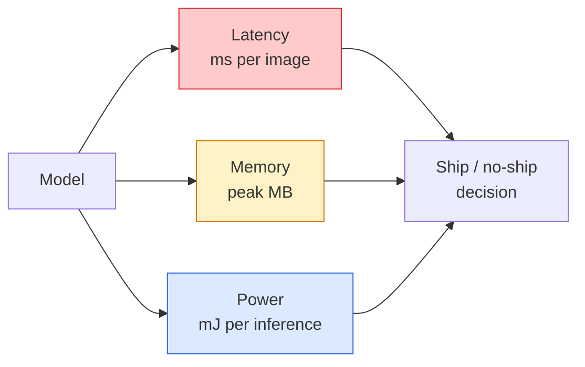

# 实时视觉——边缘部署

> 边缘推理是指将一个准确率90%的模型在仅有2 GB RAM的设备上以30帧/秒运行的学科。每一个百分点的准确率都要与毫秒级的延迟进行权衡。

**类型：** 学习+构建
**语言：** Python
**先修知识：** 阶段4第04课（图像分类），阶段10第11课（量化）
**时间：** 约75分钟

## 学习目标

- 测量任意PyTorch模型的推理延迟、峰值内存和吞吐量，并理解FLOPs（浮点运算次数）/参数/延迟之间的权衡
- 使用PyTorch的训练后量化将视觉模型量化为INT8，并验证准确率损失<1%
- 导出为ONNX并使用ONNX Runtime或TensorRT编译；列举三种最常见的导出失败及其解决方法
- 解释在边缘约束下何时选择MobileNetV3、EfficientNet-Lite、ConvNeXt-Tiny或MobileViT

## 问题

训练阶段的视觉模型是一个浮点数怪兽。1亿个参数，每次前向传播100亿次浮点运算，2 GB显存。这些都无法塞进手机、汽车信息娱乐单元、工业相机或无人机。交付一个视觉系统意味着将相同的预测结果适配到小100倍的资源预算中。

三个主要调节旋钮：模型选择（使用相同训练方法但更小的架构）、量化（INT8代替FP32）以及推理运行时（ONNX Runtime、TensorRT、Core ML、TFLite）。正确使用它们决定了演示是在工作站上运行，还是在30美元的相机模块上出货。

本节课首先建立测量规范（你无法优化你无法测量的东西），然后介绍三个旋钮。目标不是学习每一种边缘运行时，而是了解存在哪些杠杆以及如何验证每个杠杆按预期工作。

## 核心概念

### 三种资源预算



- **延迟**：p50、p95、p99。只平均p50会隐藏对实时系统至关重要的尾部行为。
- **峰值内存**：设备曾看到的最大值，而非稳态平均值。由于对嵌入式目标而言，内存耗尽（OOM）是致命错误。
- **功耗/能量**：电池供电设备上每次推理的毫焦耳数。通常通过CPU/GPU利用率乘以时间来近似。

边缘决策依赖于一张（模型，延迟，内存，准确率）的表格。每个单元格在目标设备上测量，而不是在工作站上。

### 测量规范

每条边缘性能分析应遵循三条规则：

1. **预热**模型：在测量前用5-10次虚拟前向传播进行预热。冷缓存和即时编译会产生不具备代表性的初始数值。
2. **同步**GPU工作负载：在计时块前后使用`torch.cuda.synchronize()`进行同步。否则你测量的是内核调度时间，而非内核执行时间。
3. **固定输入尺寸**为生产分辨率。224x224上的延迟不等于512x512上的延迟。

### FLOPs作为代理指标

FLOPs（每次推理的浮点运算次数）是一个廉价且与设备无关的延迟代理指标。适用于架构比较，但作为绝对实际时间可能会造成误导。FLOPs多10%的模型在实际中可能快2倍，因为它使用了硬件友好的运算（深度可分离卷积编译良好，而大型7x7卷积则不然）。

规则：使用FLOPs进行架构搜索，使用设备端延迟进行部署决策。

### 量化简述

将FP32权重和激活替换为INT8。模型大小缩小4倍，内存带宽降低4倍，在支持INT8内核的硬件上计算量降低2-4倍（每个现代移动SoC，每个带张量核心的NVIDIA GPU）。对于视觉任务，使用训练后静态量化，准确率损失通常为0.1-1个百分点。

类型：

- **动态量化**——权重量化为INT8，激活以FP32计算。简单，加速效果较小。
- **静态量化（训练后）**——权重量化 + 在小型校准集上校准激活范围。比动态快得多。
- **量化感知训练（QAT）**——在训练过程中模拟量化，使模型学会适应。准确率最高，需要标注数据。

对于视觉任务，训练后静态量化以5%的工作量提供95%的收益。仅当训练后量化（PTQ）的准确率损失不可接受时才使用QAT。

### 剪枝和蒸馏

- **剪枝**——移除不重要的权重（基于幅度）或通道（结构化）。在过参数化的模型上效果良好；在已紧凑的架构上用处较小。
- **蒸馏**——训练一个小的学生模型来模仿大教师模型的logits。通常能恢复大部分因缩小模型而损失的准确率。是生产级边缘模型的标准做法。

### 推理运行时

- **PyTorch eager模式**——慢，不用于部署。仅用于开发。
- **TorchScript**——遗留方案。已被`torch.compile`和ONNX导出取代。
- **ONNX Runtime**——中性运行时。CPU、CUDA、CoreML、TensorRT、OpenVINO都有ONNX提供程序。推荐从此开始。
- **TensorRT**——NVIDIA的编译器。在NVIDIA GPU（工作站和Jetson）上延迟最佳。可与ONNX Runtime集成或独立使用。
- **Core ML**——Apple的iOS/macOS运行时。需要`torch.compile`或`.mlmodel`。
- **TFLite**——Google的Android/ARM运行时。需要`torch.compile`。
- **OpenVINO**——Intel的CPU/VPU运行时。需要`torch.compile` + `.mlmodel`。

实践中：PyTorch导出为ONNX，然后为目标平台选择运行时。ONNX是通用语言。

### 边缘架构选择指南

|  预算  |  模型  |  理由  |
|--------|-------|-----|
|  < 300万参数  |  MobileNetV3-Small  |  到处可编译，良好基线  |
|  300万-1000万  |  EfficientNet-Lite-B0  |  TFLite上每参数准确率最佳  |
|  10-20M  |  ConvNeXt-Tiny  |  最佳每参数精度，CPU友好  |
|  20-30M  |  MobileViT-S 或 EfficientViT  |  具有ImageNet精度的Transformer  |
|  30-80M  |  Swin-V2-Tiny  |  如果堆栈支持窗口注意力  |

除非有特定理由不这么做，否则将所有模型量化到INT8。

```figure
cnn-param-count
```

## 动手构建

### 第1步：正确测量延迟

```python
import time
import torch

def measure_latency(model, input_shape, device="cpu", warmup=10, iters=50):
    model = model.to(device).eval()
    x = torch.randn(input_shape, device=device)
    with torch.no_grad():
        for _ in range(warmup):
            model(x)
        if device == "cuda":
            torch.cuda.synchronize()
        times = []
        for _ in range(iters):
            if device == "cuda":
                torch.cuda.synchronize()
            t0 = time.perf_counter()
            model(x)
            if device == "cuda":
                torch.cuda.synchronize()
            times.append((time.perf_counter() - t0) * 1000)
    times.sort()
    return {
        "p50_ms": times[len(times) // 2],
        "p95_ms": times[int(len(times) * 0.95)],
        "p99_ms": times[int(len(times) * 0.99)],
        "mean_ms": sum(times) / len(times),
    }
```

预热、同步、使用`time.perf_counter()`。报告百分位数，而不仅仅是均值。

### 第2步：参数和FLOP计数

```python
def parameter_count(model):
    return sum(p.numel() for p in model.parameters())

def flops_estimate(model, input_shape):
    """
    Rough FLOP count for a conv/linear-only model. For production use `fvcore` or `ptflops`.
    """
    total = 0
    def conv_hook(m, inp, out):
        nonlocal total
        c_out, c_in, kh, kw = m.weight.shape
        h, w = out.shape[-2:]
        total += 2 * c_in * c_out * kh * kw * h * w
    def linear_hook(m, inp, out):
        nonlocal total
        total += 2 * m.in_features * m.out_features
    hooks = []
    for m in model.modules():
        if isinstance(m, torch.nn.Conv2d):
            hooks.append(m.register_forward_hook(conv_hook))
        elif isinstance(m, torch.nn.Linear):
            hooks.append(m.register_forward_hook(linear_hook))
    model.eval()
    with torch.no_grad():
        model(torch.randn(input_shape))
    for h in hooks:
        h.remove()
    return total
```

实际项目中使用`fvcore.nn.FlopCountAnalysis`或`ptflops`；它们能正确处理每种模块类型。

### 第3步：训练后静态量化

```python
def quantise_ptq(model, calibration_loader, backend="x86"):
    import torch.ao.quantization as tq
    model = model.eval().cpu()
    model.qconfig = tq.get_default_qconfig(backend)
    tq.prepare(model, inplace=True)
    with torch.no_grad():
        for x, _ in calibration_loader:
            model(x)
    tq.convert(model, inplace=True)
    return model
```

三个步骤：配置、准备（插入观察器）、用真实数据校准、转换（融合+量化）。需要模型已融合（`Conv -> BN -> ReLU` -> `ConvBnReLU`），这由`torch.ao.quantization.fuse_modules`处理。

### 第4步：导出到ONNX

```python
def export_onnx(model, sample_input, path="model.onnx"):
    model = model.eval()
    torch.onnx.export(
        model,
        sample_input,
        path,
        input_names=["input"],
        output_names=["output"],
        dynamic_axes={"input": {0: "batch"}, "output": {0: "batch"}},
        opset_version=17,
    )
    return path
```

`opset_version=17`是2026年的安全默认值。`dynamic_axes`允许你以任意批量大小运行ONNX模型。

### 第5步：基准测试和比较方案

```python
import torch.nn as nn
from torchvision.models import mobilenet_v3_small

def compare_regimes():
    model = mobilenet_v3_small(weights=None, num_classes=10)
    params = parameter_count(model)
    flops = flops_estimate(model, (1, 3, 224, 224))
    lat_fp32 = measure_latency(model, (1, 3, 224, 224), device="cpu")
    print(f"FP32 MobileNetV3-Small: {params:,} params  {flops/1e9:.2f} GFLOPs  "
          f"p50={lat_fp32['p50_ms']:.2f}ms  p95={lat_fp32['p95_ms']:.2f}ms")
```

对`resnet50`、`efficientnet_v2_s`和`convnext_tiny`运行相同的函数，你就得到了部署决策所需的比较表。

## 使用它

生产环境堆栈趋向于以下三条路径之一：

- **Web/无服务器**：PyTorch -> ONNX -> ONNX Runtime（CPU或CUDA提供程序）。最简单，对大多数情况足够好。
- **NVIDIA边缘（Jetson，GPU服务器）**：PyTorch -> ONNX -> TensorRT。最佳延迟，最大的工程投入。
- **移动端**：PyTorch -> ONNX -> Core ML（iOS）或TFLite（Android）。导出前量化。

在测量方面，`torch-tb-profiler`、`nvprof`/`nsys`以及macOS上的Instruments可以提供逐层分解。`benchmark_app`（OpenVINO）和`trtexec`（TensorRT）提供独立的CLI数字。

## 发布

本課(lesson)产出：

- `outputs/prompt-edge-deployment-planner.md` — 一个提示，给定目标设备和延迟SLA，选择骨干网络、量化策略和运行时。
- `outputs/prompt-edge-deployment-planner.md` — 一项技能，编写完整的延迟基准测试脚本，包括预热、同步、百分位数和内存跟踪。

## 练习

1. **(简单)** 测量`resnet18`、`mobilenet_v3_small`、`efficientnet_v2_s`和`convnext_tiny`在CPU上224x224输入下的p50延迟。报告表格，并指出哪个架构具有最佳的每毫秒精度。
2. **(中等)** 对`resnet18`应用训练后静态量化。报告FP32与INT8的延迟以及在CIFAR-10或类似保留子集上的精度损失。
3. **(困难)** 将`resnet18`导出到ONNX，通过`mobilenet_v3_small`的`efficientnet_v2_s`运行它，并与PyTorch eager基线比较延迟。识别ONNX Runtime更快的第一个层，并解释原因。

## 关键术语

|  术语  |  人们的说法  |  实际含义  |
|------|----------------|----------------------|
|  延迟  |  "多快"  |  从输入到输出的时间；p50/p95/p99百分位数，而非均值  |
|  FLOPs  |  "模型大小"  |  每次前向传递的浮点运算次数；计算成本的粗略代理  |
|  INT8量化  |  "8位"  |  用8位整数替换FP32权重/激活；约缩小4倍，快2-4倍  |
|  PTQ  |  "训练后量化"  |  在不重训练的情况下量化已训练模型；简单，通常足够  |
|  QAT  |  "量化感知训练"  |  在训练中模拟量化；最佳精度，需要标注数据  |
|  ONNX  |  "中立格式"  |  每个主流推理运行时都支持的模型交换格式  |
|  TensorRT  |  "NVIDIA编译器"  |  将ONNX编译为针对NVIDIA GPU优化的引擎  |
|  蒸馏  |  "教师->学生"  |  训练一个小模型模仿大模型的logits；恢复大部分丢失的精度  |

## 延伸阅读

- [EfficientNet (Tan & Le, 2019)](https://arxiv.org/abs/1905.11946) — 高效架构的复合缩放
- [EfficientNet (Tan & Le, 2019)](https://arxiv.org/abs/1905.11946) — 以移动端优先的架构，包含h-swish和squeeze-excite
- [EfficientNet (Tan & Le, 2019)](https://arxiv.org/abs/1905.11946) — 如何实际获得论文中的吞吐量数字
- [EfficientNet (Tan & Le, 2019)](https://arxiv.org/abs/1905.11946) — 量化、图优化、提供程序选择
