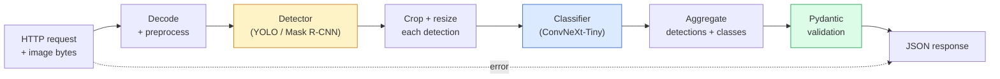

# 构建完整视觉流水线——结业项目

> 生产级视觉系统是由数据契约串联的模型与规则链条。各组件已在本阶段就绪；结业项目将它们端到端连接起来。

**类型：** 构建
**语言：** Python
**前置要求：** 第4阶段课程01-15
**时间：** ~120分钟

## 学习目标

- 设计一个生产级视觉流水线：检测目标、分类目标、输出结构化JSON——处理所有失败路径
- 将检测器（Mask R-CNN 或 YOLO）、分类器（ConvNeXt-Tiny）和数据契约（Pydantic）接入同一服务
- 对端到端流水线进行基准测试并识别首要瓶颈（通常是预处理，然后是检测器）
- 交付一个最简FastAPI服务：接收图像上传，运行流水线，返回带有分类的检测结果

## 问题

单个视觉模型有用，但视觉产品是它们的链条。零售货架审计是一个检测器加上产品分类器再加上价格OCR流水线。自动驾驶是2D检测器加上3D检测器加上分割器加上跟踪器加上规划器。医疗预筛查是分割器加上区域分类器加上临床医生界面。

连接这些链条，正是区分机器学习原型与产品的关键。模型之间的每个接口都是新的错误来源。每个坐标变换、每次归一化、每个掩膜尺寸调整，都是静默失败的候选者。流水线的强度取决于其最薄弱的接口。

本结业项目搭建最小可行流水线：检测+分类+结构化输出+服务层。第4阶段的其他所有内容都嵌入这一骨架：将Mask R-CNN替换为YOLOv8，添加OCR头，添加分割分支，添加跟踪器。架构稳定，组件可插拔。

## 核心概念

### 流水线



七个阶段。两个模型阶段计算量大；其他五个阶段是错误潜伏的地方。

### 使用Pydantic的数据契约

每个模型边界都成为类型化对象。这能将静默失败转变为明显失败。

```
Detection(
    box: tuple[float, float, float, float],   # (x1, y1, x2, y2), absolute pixels
    score: float,                              # [0, 1]
    class_id: int,                             # from detector's label map
    mask: Optional[list[list[int]]],           # RLE-encoded if present
)

PipelineResult(
    image_id: str,
    detections: list[Detection],
    classifications: list[Classification],
    inference_ms: float,
)
```

当检测器返回的边界框是`(cx, cy, w, h)`而非`(x1, y1, x2, y2)`时，Pydantic的验证会在边界处失败，你立即发现，而不是调试一个静默返回空区域的下游裁剪操作。

### 延迟分布

几乎所有视觉流水线都遵循三个事实：

1. **预处理通常是最大的单一模块。** 解码JPEG、转换色彩空间、调整尺寸——这些受CPU限制且容易忽视。
2. **检测器占用绝大多数GPU时间。** 70-90%的GPU时间用于检测前向传播。
3. **后处理（NMS、RLE编解码）在GPU上便宜，在CPU上昂贵。** 始终使用实际目标进行性能分析。

了解分布情况才能将优化转化为优先级列表。

### 故障模式

- **空检测结果** — 返回空列表，不崩溃。记录日志。
- **超出边界的边界框** — 在裁剪前限制到图像尺寸内。
- **过小裁剪区域** — 对小于分类器最小输入的边界框跳过分类。
- **损坏的上传** — 返回400响应，附带特定错误码，而非500。
- **模型加载失败** — 在服务启动时失败，而非首次请求时。

生产级流水线处理上述每种情况，无需编写会隐藏故障的通用`try/except`。每个故障都有命名代码和对应响应。

### 批处理

生产级服务服务于多个客户端。跨请求批处理检测和分类可以倍增吞吐量。权衡：等待批次填满会增加额外延迟。典型设置：收集请求最多20毫秒，一起批处理，处理后分发响应。`torchserve`和`triton`原生支持此功能；负载可预测的小型服务则自建微批处理器。

## 动手构建

### 步骤1：数据契约

```python
from pydantic import BaseModel, Field
from typing import List, Optional, Tuple

class Detection(BaseModel):
    box: Tuple[float, float, float, float]
    score: float = Field(ge=0, le=1)
    class_id: int = Field(ge=0)
    mask_rle: Optional[str] = None


class Classification(BaseModel):
    detection_index: int
    class_id: int
    class_name: str
    score: float = Field(ge=0, le=1)


class PipelineResult(BaseModel):
    image_id: str
    detections: List[Detection]
    classifications: List[Classification]
    inference_ms: float
```

五秒钟的代码能在任何严肃流水线上节省一小时的调试时间。

### 步骤2：最简Pipeline类

```python
import time
import numpy as np
import torch
from PIL import Image

class VisionPipeline:
    def __init__(self, detector, classifier, class_names,
                 device="cpu", min_crop=32):
        self.detector = detector.to(device).eval()
        self.classifier = classifier.to(device).eval()
        self.class_names = class_names
        self.device = device
        self.min_crop = min_crop

    def preprocess(self, image):
        """
        image: PIL.Image or np.ndarray (H, W, 3) uint8
        returns: CHW float tensor on device
        """
        if isinstance(image, Image.Image):
            image = np.asarray(image.convert("RGB"))
        tensor = torch.from_numpy(image).permute(2, 0, 1).float() / 255.0
        return tensor.to(self.device)

    @torch.no_grad()
    def detect(self, image_tensor):
        return self.detector([image_tensor])[0]

    @torch.no_grad()
    def classify(self, crops):
        if len(crops) == 0:
            return []
        batch = torch.stack(crops).to(self.device)
        logits = self.classifier(batch)
        probs = logits.softmax(-1)
        scores, cls = probs.max(-1)
        return list(zip(cls.tolist(), scores.tolist()))

    def run(self, image, image_id="anonymous"):
        t0 = time.perf_counter()
        tensor = self.preprocess(image)
        det = self.detect(tensor)

        crops = []
        detections = []
        valid_indices = []
        for i, (box, score, cls) in enumerate(zip(det["boxes"], det["scores"], det["labels"])):
            x1, y1, x2, y2 = [max(0, int(b)) for b in box.tolist()]
            x2 = min(x2, tensor.shape[-1])
            y2 = min(y2, tensor.shape[-2])
            detections.append(Detection(
                box=(x1, y1, x2, y2),
                score=float(score),
                class_id=int(cls),
            ))
            if (x2 - x1) < self.min_crop or (y2 - y1) < self.min_crop:
                continue
            crop = tensor[:, y1:y2, x1:x2]
            crop = torch.nn.functional.interpolate(
                crop.unsqueeze(0),
                size=(224, 224),
                mode="bilinear",
                align_corners=False,
            )[0]
            crops.append(crop)
            valid_indices.append(i)

        class_preds = self.classify(crops)

        classifications = []
        for valid_idx, (cls_id, cls_score) in zip(valid_indices, class_preds):
            classifications.append(Classification(
                detection_index=valid_idx,
                class_id=int(cls_id),
                class_name=self.class_names[cls_id],
                score=float(cls_score),
            ))

        return PipelineResult(
            image_id=image_id,
            detections=detections,
            classifications=classifications,
            inference_ms=(time.perf_counter() - t0) * 1000,
        )
```

每个接口都是类型化的。每个失败路径都有特定的处理决策。

### 步骤3：连接检测器和分类器

```python
from torchvision.models.detection import maskrcnn_resnet50_fpn_v2
from torchvision.models import convnext_tiny

# Use ImageNet-pretrained weights for a realistic pipeline without training
detector = maskrcnn_resnet50_fpn_v2(weights="DEFAULT")
classifier = convnext_tiny(weights="DEFAULT")
class_names = [f"imagenet_class_{i}" for i in range(1000)]

pipe = VisionPipeline(detector, classifier, class_names)

# Smoke test with a synthetic image
test_image = (np.random.rand(400, 600, 3) * 255).astype(np.uint8)
result = pipe.run(test_image, image_id="demo")
print(result.model_dump_json(indent=2)[:500])
```

### 步骤4：FastAPI服务

```python
from fastapi import FastAPI, UploadFile, HTTPException
from io import BytesIO

app = FastAPI()
pipe = None  # initialised on startup

@app.on_event("startup")
def load():
    global pipe
    detector = maskrcnn_resnet50_fpn_v2(weights="DEFAULT").eval()
    classifier = convnext_tiny(weights="DEFAULT").eval()
    pipe = VisionPipeline(detector, classifier, class_names=[f"c{i}" for i in range(1000)])

@app.post("/detect")
async def detect_endpoint(file: UploadFile):
    if file.content_type not in {"image/jpeg", "image/png", "image/webp"}:
        raise HTTPException(status_code=400, detail="unsupported image type")
    data = await file.read()
    try:
        img = Image.open(BytesIO(data)).convert("RGB")
    except Exception:
        raise HTTPException(status_code=400, detail="cannot decode image")
    result = pipe.run(img, image_id=file.filename or "upload")
    return result.model_dump()
```

使用`uvicorn main:app --host 0.0.0.0 --port 8000`运行。使用`curl -F 'file=@dog.jpg' http://localhost:8000/detect`测试。

### 步骤5：对流水线进行基准测试

```python
import time

def benchmark(pipe, num_runs=20, image_size=(400, 600)):
    img = (np.random.rand(*image_size, 3) * 255).astype(np.uint8)
    pipe.run(img)  # warm up

    stages = {"preprocess": [], "detect": [], "classify": [], "total": []}
    for _ in range(num_runs):
        t0 = time.perf_counter()
        tensor = pipe.preprocess(img)
        t1 = time.perf_counter()
        det = pipe.detect(tensor)
        t2 = time.perf_counter()
        crops = []
        for box in det["boxes"]:
            x1, y1, x2, y2 = [max(0, int(b)) for b in box.tolist()]
            x2 = min(x2, tensor.shape[-1])
            y2 = min(y2, tensor.shape[-2])
            if (x2 - x1) >= pipe.min_crop and (y2 - y1) >= pipe.min_crop:
                crop = tensor[:, y1:y2, x1:x2]
                crop = torch.nn.functional.interpolate(
                    crop.unsqueeze(0), size=(224, 224), mode="bilinear", align_corners=False
                )[0]
                crops.append(crop)
        pipe.classify(crops)
        t3 = time.perf_counter()
        stages["preprocess"].append((t1 - t0) * 1000)
        stages["detect"].append((t2 - t1) * 1000)
        stages["classify"].append((t3 - t2) * 1000)
        stages["total"].append((t3 - t0) * 1000)

    for stage, times in stages.items():
        times.sort()
        print(f"{stage:12s}  p50={times[len(times)//2]:7.1f} ms  p95={times[int(len(times)*0.95)]:7.1f} ms")
```

CPU上的典型输出：预处理约3毫秒，检测300-500毫秒，分类20-40毫秒，总计350-550毫秒。在GPU上，检测为20-40毫秒，预处理和分类在相对意义上开始变得更加重要。

## 使用它

生产级模板收敛到相同的结构，外加：

- **模型版本控制** — 始终在响应中记录模型名称和权重哈希。
- **每请求追踪ID** — 记录每个请求的每个阶段耗时，以便将慢响应与阶段关联。
- **回退路径** — 如果分类器超时，则返回没有分类的检测结果，而不是使整个请求失败。
- **安全过滤器** — NSFW/PII过滤器在分类之后、响应离开服务之前运行。
- **批处理端点** — 一个`/detect_batch`，接受图像URL列表进行批量处理。

在生产服务中，`torchserve`、`Triton Inference Server`和`BentoML`开箱即用地处理批处理、版本控制、指标和健康检查。直接运行`FastAPI`对于原型和小规模产品是可以的。

## 发布

本課(lesson)产出：

- `outputs/prompt-vision-service-shape-reviewer.md` — 一个提示词，审查视觉服务代码中的契约/响应形状违规，并指出第一个破坏性错误。
- `outputs/prompt-vision-service-shape-reviewer.md` — 一种技能，给定目标延迟和吞吐量，为每个流水线阶段分配时间预算，并标记哪个阶段将首先超出预算。

## 练习

1. **(简单)** 在任意开放数据集的10张图像上运行流水线。报告每阶段平均时间和每张图像的检测数量分布。
2. **(中等)** 向`Detection`添加一个掩码输出字段，并将其编码为RLE。验证即使对于10个物体的图像，JSON也保持在1MB以下。
3. **(困难)** 在分类器前添加一个微批处理器：收集最多10毫秒的裁剪块，在一次GPU调用中分类所有裁剪块，返回每个请求的结果。测量在每秒5个并发请求下的吞吐量提升和增加的延迟。

## 关键术语

|  术语  |  人们的说法  |  实际含义  |
|------|----------------|----------------------|
|  流水线(Pipeline)  |  "The system"  |  预处理、推理和后处理步骤的有序链条，每对步骤之间有类型化接口。  |
|  数据契约(Data contract)  |  "The schema"  |  每个阶段输入和输出都必须符合的Pydantic/数据类定义；在边界捕获集成错误。  |
|  预处理(Preprocessing)  |  "Before the model"  |  解码、颜色转换、调整大小、归一化；通常是最大的CPU时间消耗者。  |
|  后处理(Postprocessing)  |  "After the model"  |  NMS、掩码缩放、阈值、RLE编码；在GPU上廉价，在CPU上昂贵。  |
|  微批处理器(Microbatcher)  |  "Collect then forward"  |  等待固定时间窗口聚合多个请求，执行单次批处理前向传播的聚合器。  |
|  追踪ID(Trace ID)  |  "Request id"  |  每个请求的唯一标识符，在每个阶段记录，以便慢请求可以端到端追踪。  |
|  故障代码(Failure code)  |  "Named error"  |  每个故障类别的特定错误码，而非通用的500错误；使客户端能够实现重试逻辑。  |
|  健康检查(Health check)  |  "Readiness probe"  |  报告服务是否能够响应的轻量级端点；负载均衡器依赖于此。  |

## 延伸阅读

- [Full Stack Deep Learning — Deploying Models](https://fullstackdeeplearning.com/course/2022/lecture-5-deployment/) — 生产环境中机器学习部署的权威概述
- [Full Stack Deep Learning — Deploying Models](https://fullstackdeeplearning.com/course/2022/lecture-5-deployment/) — 支持批处理、版本控制和指标的服务框架
- [Full Stack Deep Learning — Deploying Models](https://fullstackdeeplearning.com/course/2022/lecture-5-deployment/) — PyTorch官方服务库
- [Full Stack Deep Learning — Deploying Models](https://fullstackdeeplearning.com/course/2022/lecture-5-deployment/) — 支持批处理和多模型的高吞吐量服务
