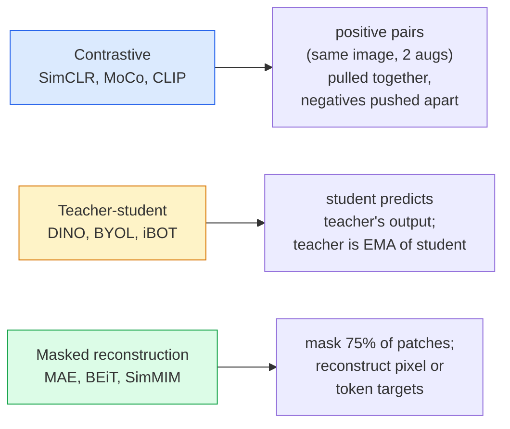

# 自监督视觉 — SimCLR, DINO, MAE

> 标签是有监督视觉的瓶颈。自监督预训练消除了这一瓶颈：从1亿张无标注图像中学习视觉特征，然后在1万张有标注图像上微调。

**类型：** 学习 + 构建
**语言：** Python
**先修知识：** 第四阶段第04课（图像分类），第四阶段第14课（ViT）
**时长：** 约75分钟

## 学习目标

- 追溯三大自监督系列 — 对比学习（SimCLR）、师生模型（DINO）、掩码重建（MAE） — 并说明每个系列优化的目标
- 从头实现InfoNCE损失，并解释为什么批量大小为512有效而32失败
- 解释为什么MAE的75%掩码比率并非随意，以及它与文本领域BERT的15%掩码有何不同
- 使用DINOv2或MAE在ImageNet上的检查点进行线性探针和零样本检索

## 问题

有监督的ImageNet有130万张标注图像，其标注成本估计为1000万美元。医疗和工业数据集规模更小，标注成本更高。每个视觉团队都会问：我们能否在廉价的未标注数据（如YouTube帧、网络爬取、监控摄像头画面、卫星扫描）上进行预训练，然后在小规模标注集上微调？

自监督学习就是答案。在LAION或JFT上训练的现代自监督ViT，经过微调后可以达到或超过有监督的ImageNet准确率。并且在下游任务（检测、分割、深度估计）上的迁移能力也优于有监督预训练。DINOv2（Meta, 2023）和MAE（Meta, 2022）是目前用于可迁移视觉特征的生产级默认选择。

概念上的转变在于：前置任务（模型被训练去完成的任务）不必是下游任务。重要的是它迫使模型学习有用的特征。预测灰度图的颜色、旋转图像并要求模型对旋转角度分类、掩码图像块并重建 — 所有这些方法都曾有效。真正能规模化的是三种方法：对比学习、师生蒸馏和掩码重建。

## 核心概念

### 三大系列



### 对比学习（SimCLR）

取一张图像，应用两次随机增强，得到两个视图。将两者输入相同的编码器加投影头。最小化一个损失函数，该损失要求“这两个嵌入应该接近”且“这个嵌入应该与批次中所有其他图像的嵌入远离”。

```
Loss for positive pair (z_i, z_j) among 2N views per batch:

   L_ij = -log( exp(sim(z_i, z_j) / tau) / sum_k in batch \ {i} exp(sim(z_i, z_k) / tau) )

sim = cosine similarity
tau = temperature (0.1 standard)
```

这就是InfoNCE损失。它需要每个正样本对应大量负样本，因此批量大小很重要 — SimCLR需要512到8192。MoCo引入了过去批次的动量队列，将负样本数量与批量大小解耦。

### 师生模型（DINO）

两个网络架构相同：学生和教师。教师是学生权重的指数移动平均（EMA）。两者都看到图像的增强视图。学生的输出被训练去匹配教师的输出 — 没有显式的负样本。

```
loss = CE( student_output(view_1),  teacher_output(view_2) )
     + CE( student_output(view_2),  teacher_output(view_1) )

teacher_weights = m * teacher_weights + (1 - m) * student_weights   (m ≈ 0.996)
```

为什么它不会坍缩到“预测一个常数”：教师的输出会被中心化（减去每个维度的均值）和锐化（除以小的温度系数）。中心化防止某个维度主导；锐化防止输出坍缩为均匀分布。

DINO是DINOv2在1.42亿张精选图像上扩展的基础。由此得到的特征是当前零样本视觉检索和密集预测的SOTA。

### 掩码重建（MAE）

掩码ViT输入中75%的图像块。仅将可见的25%通过编码器。一个小型解码器接收编码器的输出加上掩码位置处的掩码标记，并被训练去重建被掩码块的像素。

```
Encoder:  visible 25% of patches -> features
Decoder:  features + mask tokens at masked positions -> reconstructed pixels
Loss:     MSE between reconstructed and original pixels on masked patches only
```

使MAE有效的关键设计选择：

- **75%的掩码比率** — 很高。迫使编码器学习语义特征；重建25%几乎微不足道（相邻像素高度相关，CNN就能轻易完成）。
- **非对称编码器/解码器** — 大型ViT编码器仅处理可见块；小型解码器（8层，512维）负责重建。预训练速度比朴素的BEiT快3倍。
- **像素空间重建目标** — 比BEiT的标记化目标更简单，且在ViT上表现更好。

预训练后，丢弃解码器。编码器成为特征提取器。

### 为什么是75%而不是15%

BERT掩码15%的标记。MAE掩码75%。差别在于信息密度。

- 自然语言每个标记的熵很高。预测15%的标记仍然困难，因为每个掩码位置有许多合理的补全。
- 图像块的熵较低 — 未掩码邻域通常几乎唯一地确定掩码块的像素。要使预测需要语义理解，必须激进地掩码。

75%足够高，使得简单的空间外推无法解决该任务；编码器必须表示图像内容。

### 线性探针评估

自监督预训练后，标准评估是**线性探针**：冻结编码器，在其顶部基于ImageNet标签训练一个线性分类器。报告Top-1准确率。

- SimCLR ResNet-50：约71%（2020）
- DINO ViT-S/16：约77%（2021）
- MAE ViT-L/16：约76%（2022）
- DINOv2 ViT-g/14：约86%（2023）

线性探针是特征质量的纯度量；微调通常增加2-5个百分点，但也混合了头部重训练的影响。

## 动手构建

### 步骤1：双视图增强管道

```python
import torch
import torchvision.transforms as T

two_view_train = lambda: T.Compose([
    T.RandomResizedCrop(96, scale=(0.2, 1.0)),
    T.RandomHorizontalFlip(),
    T.ColorJitter(0.4, 0.4, 0.4, 0.1),
    T.RandomGrayscale(p=0.2),
    T.ToTensor(),
])


class TwoViewDataset(torch.utils.data.Dataset):
    def __init__(self, base):
        self.base = base
        self.aug = two_view_train()

    def __len__(self):
        return len(self.base)

    def __getitem__(self, i):
        img, _ = self.base[i]
        v1 = self.aug(img)
        v2 = self.aug(img)
        return v1, v2
```

每个 __getitem__ 返回同一图像的两个增强视图；不需要标签。

### 步骤2：InfoNCE损失

```python
import torch.nn.functional as F

def info_nce(z1, z2, tau=0.1):
    """
    z1, z2: (N, D) L2-normalised embeddings of paired views
    """
    N, D = z1.shape
    z = torch.cat([z1, z2], dim=0)  # (2N, D)
    sim = z @ z.T / tau              # (2N, 2N)

    mask = torch.eye(2 * N, dtype=torch.bool, device=z.device)
    sim = sim.masked_fill(mask, float("-inf"))

    targets = torch.cat([torch.arange(N, 2 * N), torch.arange(0, N)]).to(z.device)
    return F.cross_entropy(sim, targets)
```

在调用前对嵌入向量进行L2归一化。`tau=0.1`是SimCLR的默认值；更低的温度会使损失函数更尖锐，并需要更多负样本。

### 步骤3：InfoNCE合理性检查

```python
z1 = F.normalize(torch.randn(16, 32), dim=-1)
z2 = z1.clone()
loss_same = info_nce(z1, z2, tau=0.1).item()
z2_random = F.normalize(torch.randn(16, 32), dim=-1)
loss_random = info_nce(z1, z2_random, tau=0.1).item()
print(f"InfoNCE with identical pairs:  {loss_same:.3f}")
print(f"InfoNCE with random pairs:     {loss_random:.3f}")
```

相同的配对应给出低损失（对于大批量和低温接近0）。随机配对在16对批次下应给出log(2N-1) ≈ log(31) ≈ 3.4。

### 步骤4：MAE风格掩码

```python
def random_mask_indices(num_patches, mask_ratio=0.75, seed=0):
    g = torch.Generator().manual_seed(seed)
    n_keep = int(num_patches * (1 - mask_ratio))
    perm = torch.randperm(num_patches, generator=g)
    visible = perm[:n_keep]
    masked = perm[n_keep:]
    return visible.sort().values, masked.sort().values


num_patches = 196
visible, masked = random_mask_indices(num_patches, mask_ratio=0.75)
print(f"visible: {len(visible)} / {num_patches}")
print(f"masked:  {len(masked)} / {num_patches}")
```

简单、快速，且对给定种子是确定性的。真实的MAE实现会批量处理并保持每个样本的掩码。

## 使用它

DINOv2是2026年的生产标准：

```python
import torch
from transformers import AutoImageProcessor, AutoModel

processor = AutoImageProcessor.from_pretrained("facebook/dinov2-base")
model = AutoModel.from_pretrained("facebook/dinov2-base")
model.eval()

# Per-image embeddings for zero-shot retrieval
with torch.no_grad():
    inputs = processor(images=[pil_image], return_tensors="pt")
    outputs = model(**inputs)
    embedding = outputs.last_hidden_state[:, 0]  # CLS token
```

得到的768维嵌入向量是现代图像检索、密集对应和零样本迁移流程的骨干。在下游任务上微调通常只需要一个线性分类头。

对于图像-文本嵌入，SigLIP或OpenCLIP是等效的；对于MAE风格的微调，`timm`仓库提供了所有MAE检查点。

## 发布

本課(lesson)产出：

- `outputs/prompt-ssl-pretraining-picker.md` — 一个提示，根据数据集大小、计算资源和下游任务选择SimCLR/MAE/DINOv2。
- `outputs/prompt-ssl-pretraining-picker.md` — 一个技能，为任何冻结编码器+带标签数据集编写线性探测评估。

## 练习

1. **(简单)** 验证当降低温度时，对于良好对齐的嵌入，InfoNCE损失下降；对于随机嵌入，损失上升。绘制`tau in [0.05, 0.1, 0.2, 0.5]`与损失的图。
2. **(中等)** 实现一个DINO风格的中心缓冲区。证明没有中心化时，学生网络在几个周期内崩溃为常数向量。
3. **(困难)** 使用第10课中的TinyUNet作为主干，在CIFAR-100上训练MAE。报告在10、50和200个周期时的线性探测准确率。证明在相同的1000张图像子集上，MAE预训练的线性探测优于从头监督训练的线性探测。

## 关键术语

|  术语  |  人们的说法  |  实际含义  |
|------|----------------|----------------------|
|  自监督  |  "无标签"  |  一个从无标签数据中产生有用表示的前置任务  |
|  前置任务  |  "虚假任务"  |  在自监督学习（SSL）中使用的目标（重建补丁、匹配视图）；预训练后丢弃  |
|  线性探测  |  "冻结编码器+线性分类头"  |  标准自监督学习评估：仅在冻结特征之上训练线性分类器  |
|  InfoNCE  |  "对比损失"  |  对余弦相似度做softmax；正对是目标类别，其他都是负样本  |
|  EMA教师  |  "移动平均教师"  |  权重是学生权重的指数移动平均的教师；用于BYOL、MoCo、DINO  |
|  掩码比例  |  "隐藏补丁的百分比"  |  MAE期间掩码的补丁比例；视觉75%，文本15%  |
|  表示坍塌  |  "常数输出"  |  自监督学习失败，编码器对所有输入输出常数向量；通过中心化、锐化或负样本防止  |
|  DINOv2  |  "生产级自监督学习骨干"  |  Meta的2023年自监督ViT；2026年最强通用图像特征  |

## 延伸阅读

- [SimCLR (Chen et al., 2020)](https://arxiv.org/abs/2002.05709) — 对比学习参考
- [SimCLR (Chen et al., 2020)](https://arxiv.org/abs/2002.05709) — 带有动量、中心化、锐化的教师-学生
- [SimCLR (Chen et al., 2020)](https://arxiv.org/abs/2002.05709) — ViT的掩码自编码器预训练
- [SimCLR (Chen et al., 2020)](https://arxiv.org/abs/2002.05709) — 将自监督ViT扩展到生产特征
