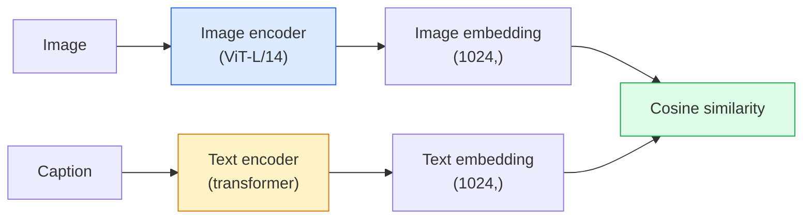

# 开放词汇视觉 — CLIP

> 训练一个图像编码器和一个文本编码器，使得匹配的（图像，描述）对落在共享空间中的同一点。这就是全部技巧。

**类型：** 构建+使用
**语言：** Python
**前置条件：** 第4阶段第14课（ViT），第4阶段第17课（自监督）
**时间：** 约45分钟

## 学习目标

- 解释CLIP的双塔架构和对比训练目标
- 使用预训练的CLIP（或SigLIP）进行零样本分类，无需任何任务特定训练
- 从头实现零样本分类：编码类别提示，计算余弦相似度，取argmax
- 区分CLIP、SigLIP、OpenCLIP和LLaVA/LLaMA-vision模型——2026年各自用途

## 问题

传统分类器是封闭词汇的：一个1000类的ImageNet模型只能预测1000个标签。每个新类别都需要标注数据和重新训练的分类头。

CLIP（Radford等人，OpenAI 2021）表明，在从网络抓取的4亿（图像，描述）对上训练，可以产生一个模型，在推理时能够对任何类别集合进行分类，完全用自然语言描述。你通过写一个句子来给出一个新类别。

这种能力——零样本迁移——就是为什么每个现代视觉系统都从类似CLIP的检查点开始。检测（Grounding DINO, OWL-ViT）、分割（CLIPSeg, SAM）、检索、内容审核、视觉语言模型和文本到图像生成都建立在类似CLIP的联合嵌入之上。

## 核心概念

### 双塔结构



两个编码器都以线性投影结束，投影到相同的嵌入维度（CLIP-B/32为512，CLIP-L/14为1024）。进行L2归一化并计算余弦相似度。

### 目标函数

给定一批N个（图像，描述）对，构建一个N×N的相似度矩阵。训练两个编码器，使得对角线（匹配对）具有高相似度，非对角线（不匹配）具有低相似度。

```
sim_matrix = image_embeddings @ text_embeddings.T / tau

loss_i2t = cross_entropy(sim_matrix,       targets=arange(N))
loss_t2i = cross_entropy(sim_matrix.T,     targets=arange(N))
loss = (loss_i2t + loss_t2i) / 2
```

对称的，因为图像到文本和文本到图像检索都应该有效。`tau`（温度）通常作为标量参数学习，初始化为0.07。

### SigLIP：一种更好的损失函数

SigLIP（Zhai等人，2023）用逐对sigmoid替换了softmax：

```
loss = mean over pairs of log(1 + exp(-y_ij * sim_ij))
y_ij = +1 if matching, -1 otherwise
```

逐对损失移除了CLIP所需的批次级归一化。SigLIP在小批量下训练得更好，在相同数据下匹配或超越CLIP。

### 零样本分类

给定一个训练好的CLIP：

1. 对于每个类别，组成一个提示："a photo of a {class}"。用文本编码器对所有类别提示进行编码 -> `T` 形状 (C, d)。编码测试图像 -> `T` 形状 (1, d)。相似度 = `T` 形状 (1, C)。Argmax -> 预测类别。
2. 
3. 
4. 
5. 

提示工程很重要。OpenAI为ImageNet发布了80个提示模板（"a photo of a {}"，"a blurry photo of a {}"，"a sketch of a {}"，...）。平均每个类别所有模板的嵌入，可以获得额外1-3%的top-1准确率。

### 2026年CLIP风格模型的应用

- **零样本分类** — 直接使用。
- **图像检索** — 一次编码所有图像，推理时嵌入查询。
- **文本条件检测** — Grounding DINO, OWL-ViT将CLIP文本塔包裹在检测器周围。
- **文本条件分割** — CLIPSeg; SAM通过CLIP使用文本提示输入。
- **视觉语言模型** — LLaVA, Qwen-VL, InternVL将CLIP家族的视觉编码器连接到LLM。
- **文本到图像生成** — Stable Diffusion, DALL-E 3以CLIP文本嵌入为条件。

一旦你有了共享的嵌入空间，每个视觉+语言任务就变成了距离计算。

## 动手构建

### 第1步：一个微型的双塔模型

真正的CLIP是ViT+Transformer。在本课中，双塔是对预提取特征的小型MLP，这样训练信号可在CPU上观测。

```python
import torch
import torch.nn as nn
import torch.nn.functional as F


class TwoTower(nn.Module):
    def __init__(self, img_in=128, txt_in=64, emb=64):
        super().__init__()
        self.image_proj = nn.Sequential(nn.Linear(img_in, 128), nn.ReLU(), nn.Linear(128, emb))
        self.text_proj = nn.Sequential(nn.Linear(txt_in, 128), nn.ReLU(), nn.Linear(128, emb))
        self.logit_scale = nn.Parameter(torch.ones([]) * 2.6592)  # ln(1/0.07)

    def forward(self, img_feats, txt_feats):
        i = F.normalize(self.image_proj(img_feats), dim=-1)
        t = F.normalize(self.text_proj(txt_feats), dim=-1)
        return i, t, self.logit_scale.exp()
```

两个投影，共享维度输出，学习的温度。与真正的CLIP API形状相同。

### 第2步：对比损失

```python
def clip_loss(image_emb, text_emb, logit_scale):
    N = image_emb.size(0)
    sim = logit_scale * image_emb @ text_emb.T
    targets = torch.arange(N, device=sim.device)
    l_i = F.cross_entropy(sim, targets)
    l_t = F.cross_entropy(sim.T, targets)
    return (l_i + l_t) / 2
```

对称的。更高的logit_scale = 更尖锐的softmax = 更自信但有不稳定风险。

### 第3步：零样本分类器

```python
@torch.no_grad()
def zero_shot_classify(model, image_feats, class_text_feats, class_names):
    """
    image_feats:      (N, img_in)
    class_text_feats: (C, txt_in)   one averaged embedding per class
    """
    i = F.normalize(model.image_proj(image_feats), dim=-1)
    t = F.normalize(model.text_proj(class_text_feats), dim=-1)
    sim = i @ t.T
    pred = sim.argmax(dim=-1)
    return [class_names[p] for p in pred.tolist()]
```

每步一句话。这就是与生产环境CLIP检查点一起使用的精确零样本流程。

### 第4步：合理性检查

```python
torch.manual_seed(0)
model = TwoTower()

img = torch.randn(8, 128)
txt = torch.randn(8, 64)
i, t, scale = model(img, txt)
loss = clip_loss(i, t, scale)
print(f"batch size: {i.size(0)}   loss: {loss.item():.3f}")
```

对于随机初始化的模型，损失应接近`log(N) = log(8) = 2.08`——这是尚未学习任何结构时的对称交叉熵目标。

## 使用它

OpenCLIP是2026年的社区默认选择：

```python
import open_clip
import torch
from PIL import Image

model, _, preprocess = open_clip.create_model_and_transforms("ViT-B-32", pretrained="laion2b_s34b_b79k")
tokenizer = open_clip.get_tokenizer("ViT-B-32")

image = preprocess(Image.open("dog.jpg")).unsqueeze(0)
text = tokenizer(["a photo of a dog", "a photo of a cat", "a photo of a car"])

with torch.no_grad():
    image_features = model.encode_image(image)
    text_features = model.encode_text(text)
    image_features = image_features / image_features.norm(dim=-1, keepdim=True)
    text_features = text_features / text_features.norm(dim=-1, keepdim=True)
    probs = (100.0 * image_features @ text_features.T).softmax(dim=-1)

print(probs)
```

SigLIP较新，在小规模上训练效果更好，是新工作的首选：`google/siglip-base-patch16-224`。Hugging Face同时提供两者。

## 发布

本課(lesson)产出：

- `outputs/prompt-zero-shot-class-picker.md`——给定类别列表和领域，为零样本CLIP设计类别模板的提示。
- `outputs/prompt-zero-shot-class-picker.md`——用任何CLIP检查点构建图像嵌入索引的技能，支持文本查询和图像查询。

## 练习

1. **(简单)** 使用预训练的OpenCLIP ViT-B/32，在CIFAR-10上使用80模板提示集进行零样本分类。报告top-1准确率；应在85-90%左右。
2. **(中等)** 在同一CIFAR-10任务上比较单模板（"a photo of a {}"）与80模板平均嵌入。量化差距并解释模板为何有帮助。
3. **(困难)** 构建零样本图像检索索引：使用CLIP嵌入1000张图像，构建FAISS索引，用自然语言描述查询。报告20个你自己编写的手工查询的检索召回率@5。

## 关键术语

|  术语  |  人们的说法  |  实际含义  |
|------|----------------|----------------------|
|  双塔  |  "双编码器"  |  分离的图像和文本编码器，以共享维度的投影头结束  |
|  零样本  |  "无任务特定训练"  |  在推理时仅通过文本描述的类别进行分类；不接触标签  |
|  温度 / logit_scale  |  "tau"  |  在softmax之前缩放相似度矩阵的可学习标量  |
|  提示模板  |  "A photo of a {}"  |  类别名称的自然语言包装；平均多个模板可提高零样本准确率  |
|  CLIP  |  "图像+文本模型"  |  2021年的OpenAI模型；2026年该领域的词汇  |
|  SigLIP  |  "Sigmoid CLIP"  |  将softmax替换为逐对sigmoid；在小批量上训练效果更好  |
|  OpenCLIP  |  "开放复现"  |  社区在LAION上训练的CLIP变体；开源管线的生产默认选择  |
|  VLM  |  "视觉语言模型"  |  CLIP系列编码器加LLM，训练用于回答关于图像的问题  |

## 延伸阅读

- [CLIP: Learning Transferable Visual Models from Natural Language Supervision (Radford et al., 2021)](https://arxiv.org/abs/2103.00020)
- [CLIP: Learning Transferable Visual Models from Natural Language Supervision (Radford et al., 2021)](https://arxiv.org/abs/2103.00020)
- [CLIP: Learning Transferable Visual Models from Natural Language Supervision (Radford et al., 2021)](https://arxiv.org/abs/2103.00020)——社区代码库
- [CLIP: Learning Transferable Visual Models from Natural Language Supervision (Radford et al., 2021)](https://arxiv.org/abs/2103.00020)——带有并排用例的HF指南
