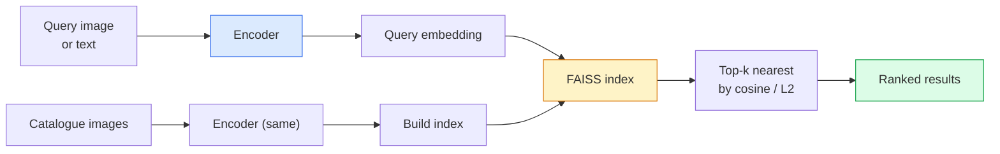

# 图像检索与度量学习

> 检索系统通过嵌入空间中的距离对候选进行排序。度量学习是塑造该空间以使距离符合你期望的学科。

**类型：** 构建
**语言：** Python
**前置要求：** 第四阶段第14课（ViT），第四阶段第18课（CLIP）
**时间：** ~45分钟

## 学习目标

- 解释三元组损失、对比损失和基于代理的度量学习损失，并为给定数据集选择正确的损失
- 正确实现L2归一化和余弦相似性，并审查“相同物品”与“相同类别”检索之间的差异
- 构建FAISS索引，通过文本和图像查询，并为保留的查询集报告recall@K
- 使用DINOv2、CLIP和SigLIP作为现成的嵌入主干，并了解每种方法在何时表现最佳

## 问题

检索在工业视觉中无处不在：重复检测、反向图像搜索、视觉搜索（“查找相似产品”）、人脸重识别、监控中的人物重识别（person re-ID）、电子商务中的实例级匹配。产品问题总是相同的：“给定此查询图像，对我的目录进行排名。”

两个设计决策塑造了整个系统。嵌入（Embedding）——生成向量的模型。索引（Index）——如何在大规模下找到最近邻。两者在2026年都是商品（DINOv2用于嵌入，FAISS用于索引），这提高了门槛：困难的部分是为你的应用定义*什么算作相似*，然后塑造嵌入空间以使距离匹配。

这种塑造就是度量学习。这是一个虽小但高杠杆的学科。

## 核心概念

### 检索概览



### 四种损失家族

|  损失类型  |  所需  |  优点  |  缺点  |
|------|----------|------|------|
|  **对比损失**  |  （锚点，正样本）+ 负样本  |  简单，适用于任意成对标签  |  如果没有大量负样本，收敛缓慢  |
|  **三元组损失**  |  （锚点，正样本，负样本）  |  直观；直接控制间隔  |  困难三元组挖掘代价高  |
|  **NT-Xent / InfoNCE**  |  成对样本 + 批次挖掘的负样本  |  可扩展到大批次  |  需要大批次或动量队列  |
|  **基于代理的（ProxyNCA）**  |  仅类别标签  |  快速、稳定、无需挖掘  |  在小数据集上可能对代理过拟合  |

对于大多数生产用例，从预训练主干开始，仅当现成嵌入在你的测试集上表现不佳时才添加度量学习微调。

### 正式定义的三元组损失

```
L = max(0, ||f(a) - f(p)||^2 - ||f(a) - f(n)||^2 + margin)
```

将锚点`a`拉近正样本`p`，推离负样本`n`，使用`margin`确保有一个间隔。三图像结构可推广到任意相似性排序。

挖掘很重要：容易的三元组（`n`已经远离`a`）贡献零损失；只有困难三元组才能教会网络。半困难挖掘（`n`比`p`更远但在间隔内）是2016年FaceNet的配方，至今仍占主导地位。

### 余弦相似性与L2距离

两种度量，两种约定：

- **余弦（Cosine）**：向量之间的夹角。需要L2归一化的嵌入。
- **L2**：欧几里得距离。适用于原始或归一化的嵌入，但通常与L2归一化 + 平方L2配对使用。

对于大多数现代网络，两者是等价的：当`||a|| = ||b|| = 1`时，`||a - b||^2 = 2 - 2 cos(a, b)`。选择与嵌入训练匹配的约定；混用会静默地改变“最近”的含义。

### Recall@K

标准检索指标：

```
recall@K = fraction of queries where at least one correct match is in the top K results
```

并排报告recall@1、@5、@10。recall@10高于0.95而recall@1低于0.5意味着嵌入空间具有正确的结构但排序有噪声——尝试更长的微调或重排序步骤。

对于重复检测，precision@K更重要，因为每个假阳性都是用户可见的错误。对于视觉搜索，recall@K是产品信号。

### FAISS简述

Facebook AI相似性搜索。最邻近搜索的事实标准库。三种索引选择：

- `IndexFlatIP` / `IndexFlatL2` — 暴力搜索，精确，无需训练。最多用于约100万向量。
- `IndexFlatIP` — 划分为K个单元，仅搜索最近的几个单元。近似、快速，需要训练数据。
- `IndexFlatIP` — 基于图的，对多次查询最快，索引尺寸大。

对于10万向量，你可能需要使用基于余弦相似性的`IndexFlatIP`。对于1000万，你需要`IndexIVFFlat`。对于1亿以上，则结合乘积量化（`IndexIVFPQ`）。

### 实例级检索(Instance-level retrieval)与类别级检索(Category-level retrieval)

两个同名但截然不同的问题：

- **类别级**——“在我的目录中找到猫。” 类别条件相似性；现成的CLIP / DINOv2嵌入表现良好。
- **实例级**——“在我的目录中找到*这个确切的产品*。” 需要对同一类中视觉相似的对象进行细粒度区分；现成的嵌入表现不佳；使用度量学习(Metric Learning)进行微调至关重要。

在选择模型之前，始终问清楚你要解决的是哪一个问题。

## 动手构建

### 步骤1：三元组损失(Triplet loss)

```python
import torch
import torch.nn.functional as F

def triplet_loss(anchor, positive, negative, margin=0.2):
    d_ap = F.pairwise_distance(anchor, positive, p=2)
    d_an = F.pairwise_distance(anchor, negative, p=2)
    return F.relu(d_ap - d_an + margin).mean()
```

一行代码。适用于L2归一化或原始嵌入。

### 步骤2：半困难挖掘(Semi-hard mining)

给定一批嵌入和标签，为每个锚点找到最困难的半困难负样本。

```python
def semi_hard_negatives(emb, labels, margin=0.2):
    dist = torch.cdist(emb, emb)
    same_class = labels[:, None] == labels[None, :]
    diff_class = ~same_class
    N = emb.size(0)

    positives = dist.clone()
    positives[~same_class] = float("-inf")
    positives.fill_diagonal_(float("-inf"))
    pos_idx = positives.argmax(dim=1)

    semi_hard = dist.clone()
    semi_hard[same_class] = float("inf")
    d_ap = dist[torch.arange(N), pos_idx].unsqueeze(1)
    semi_hard[dist <= d_ap] = float("inf")
    neg_idx = semi_hard.argmin(dim=1)

    fallback_mask = semi_hard[torch.arange(N), neg_idx] == float("inf")
    if fallback_mask.any():
        hardest = dist.clone()
        hardest[same_class] = float("inf")
        neg_idx = torch.where(fallback_mask, hardest.argmin(dim=1), neg_idx)
    return pos_idx, neg_idx
```

每个锚点获得一个类内最困难的正样本，以及一个比正样本远但在间隔(margin)内的半困难负样本。

### 步骤3：Recall@K

```python
def recall_at_k(query_emb, gallery_emb, query_labels, gallery_labels, k=1):
    sim = query_emb @ gallery_emb.T
    _, top_k = sim.topk(k, dim=-1)
    matches = (gallery_labels[top_k] == query_labels[:, None]).any(dim=-1)
    return matches.float().mean().item()
```

在L2归一化嵌入上通过内积计算的前K个结果等价于通过余弦相似度计算的前K个结果。报告查询中至少有一个正确邻居的比例的平均值。

### 步骤4：整合

```python
import torch
import torch.nn as nn
from torch.optim import Adam

class Encoder(nn.Module):
    def __init__(self, in_dim=128, emb_dim=64):
        super().__init__()
        self.net = nn.Sequential(
            nn.Linear(in_dim, 128), nn.ReLU(),
            nn.Linear(128, emb_dim),
        )

    def forward(self, x):
        return F.normalize(self.net(x), dim=-1)

torch.manual_seed(0)
num_classes = 6
protos = F.normalize(torch.randn(num_classes, 128), dim=-1)

def sample_batch(bs=32):
    labels = torch.randint(0, num_classes, (bs,))
    x = protos[labels] + 0.15 * torch.randn(bs, 128)
    return x, labels

enc = Encoder()
opt = Adam(enc.parameters(), lr=3e-3)

for step in range(200):
    x, y = sample_batch(32)
    emb = enc(x)
    pos_idx, neg_idx = semi_hard_negatives(emb, y)
    loss = triplet_loss(emb, emb[pos_idx], emb[neg_idx])
    opt.zero_grad(); loss.backward(); opt.step()
```

经过几百步训练后，嵌入聚集成每个类一个簇。

## 使用它

2026年的生产堆栈：

- **DINOv2 + FAISS** — 通用视觉检索。开箱即用。
- **CLIP + FAISS** — 当查询是文本时使用。
- **微调后的DINOv2 + FAISS** — 实例级检索、人脸重识别、时尚、电子商务。
- **Milvus / Weaviate / Qdrant** — 基于FAISS或HNSW的管理型向量数据库封装。

对于最先进的实例检索，方案是：DINOv2主干网络，添加一个嵌入层，使用三元组损失或InfoNCE损失在实例标记对上微调，然后在FAISS中建立索引。

## 发布

本課(lesson)产出：

- `outputs/prompt-retrieval-loss-picker.md` — 一个提示词，用于为给定检索问题选择三元组损失/InfoNCE/ProxyNCA。
- `outputs/prompt-retrieval-loss-picker.md` — 一项技能，用于编写干净的评估框架，实现Recall@K，包含训练/验证/图库划分和适当的数据契约。

## 练习

1. **(简单)** 运行上面的玩具示例。使用PCA在训练前后绘制嵌入，观察六个簇的形成。
2. **(中等)** 添加一个ProxyNCA损失实现：每个类一个学习到的“代理”，在余弦相似度上进行标准交叉熵。在玩具数据上比较收敛速度与三元组损失。
3. **(困难)** 从ImageNet验证集中选取1000张图像，通过HuggingFace使用DINOv2提取嵌入，构建FAISS平面索引，并报告对相同图像作为查询的Recall@{1,5,10}（应为1.0）以及对以ImageNet标签为真实标签的保留划分的Recall。

## 关键术语

|  术语  |  人们的说法  |  实际含义  |
|------|----------------|----------------------|
|  度量学习(Metric learning)  |  “塑造空间”  |  训练编码器，使其输出空间中的距离反映目标相似性  |
|  三元组损失(Triplet loss)  |  “拉近和推远”  |  L = max(0, d(a, p) - d(a, n) + margin)；经典的度量学习损失  |
|  半困难挖掘(Semi-hard mining)  |  “有用的负样本”  |  比正样本离锚点更远但在间隔内的负样本；经验上信息量最大  |
|  基于代理的损失(Proxy-based loss)  |  “类原型”  |  每个类一个学习到的代理；基于代理相似度的交叉熵；无需配对挖掘  |
|  Recall@K  |  “Top-K命中率”  |  查询在前K个结果中至少有一个正确结果的比例  |
|  实例检索(Instance retrieval)  |  “找到这个确切的东西”  |  细粒度匹配；现成的特征通常表现不佳  |
|  FAISS  |  “近邻库”  |  Facebook的近邻库；支持精确和近似索引  |
|  HNSW  |  “图索引”  |  分层可导航小世界；快速近似近邻，内存开销小  |

## 延伸阅读

- [FaceNet: A Unified Embedding for Face Recognition (Schroff et al., 2015)](https://arxiv.org/abs/1503.03832) — 三元组损失/半困难挖掘论文
- [FaceNet: A Unified Embedding for Face Recognition (Schroff et al., 2015)](https://arxiv.org/abs/1503.03832) — 三元组微调实践指南
- [FaceNet: A Unified Embedding for Face Recognition (Schroff et al., 2015)](https://arxiv.org/abs/1503.03832) — 每个索引和权衡
- [FaceNet: A Unified Embedding for Face Recognition (Schroff et al., 2015)](https://arxiv.org/abs/1503.03832) — 现代损失及其关联的综述
