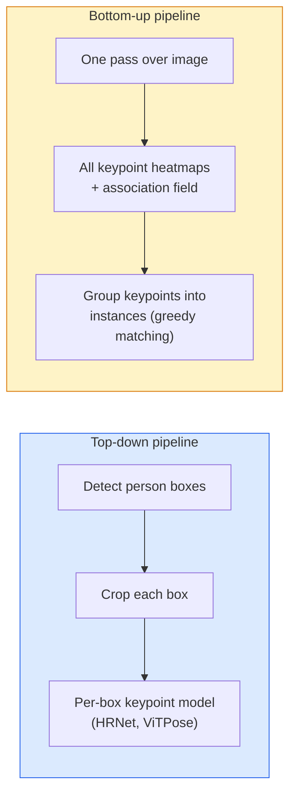

# 关键点检测与姿态估计 (Keypoint Detection & Pose Estimation)

> 姿态是一组有序的关键点。关键点检测器是一个热图回归器。其余的都是辅助性工作。

**类型：** 构建
**语言：** Python
**前置条件：** 第4阶段第6课（检测），第4阶段第7课（U-Net）
**时间：** 约45分钟

## 学习目标

- 区分自上而下和自下而上的姿态估计，并说明各自的使用场景
- 通过每个关键点对应的高斯目标回归K个关键点的热图，并在推理时提取关键点坐标
- 解释部分亲和场（Part Affinity Fields, PAFs）以及自下而上流程如何将关键点关联成实例
- 使用MediaPipe Pose或MMPose进行生产级关键点估计，并理解其输出格式

## 问题

关键点任务有很多名称：人体姿态（17个身体关节点）、面部关键点（68或478个点）、手部（21个点）、动物姿态、机器人物体姿态、医学解剖标志点。每一个任务都共享相同的结构：检测物体上的K个离散点，并输出它们的(x, y)坐标。

姿态估计是动作捕捉、健身应用、运动分析、手势控制、动画、AR试穿和机器人抓取的基础。2D姿态已经成熟；3D姿态（从单张图像估计世界坐标下的关节点位置）是当前的研究前沿。

工程问题是规模。单张图像、单人姿态是一个20毫秒的问题。在30帧每秒下对拥挤人群进行多人姿态估计是一个不同的问题，需要不同的架构。

## 核心概念

### 自上而下 vs 自下而上



- **自上而下** — 先检测人，然后对每个裁剪区域运行单人关键点模型。精度最高；计算量随人数线性增长。
- **自下而上** — 一次前向传播预测所有关键点加上关联场；然后分组。计算量不随人群规模变化。

自上而下（HRNet, ViTPose）是精度领先者；自下而上（OpenPose, HigherHRNet）是密集场景下的吞吐量领先者。

### 热图回归 (Heatmap regression)

不直接回归`(x, y)`，而是为每个关键点预测一个`H x W`热图，其中高斯斑块位于真实位置的中心。

```
target[k, y, x] = exp(-((x - cx_k)^2 + (y - cy_k)^2) / (2 sigma^2))
```

在推理时，每个热图的argmax即为预测的关键点位置。

为什么热图比直接回归效果更好：网络的空间结构（卷积特征图）自然地与空间输出对齐。高斯目标也起到了正则化作用——较小的定位误差产生较小的损失，而不是零损失。

### 亚像素定位 (Sub-pixel localisation)

Argmax给出整数坐标。对于亚像素精度，通过拟合argmax及其邻域上的抛物线进行细化，或者使用已知的偏移`(dx, dy) = 0.25 * (heatmap[y, x+1] - heatmap[y, x-1], ...)`方向。

### 部分亲和场 (Part Affinity Fields, PAFs)

OpenPose用于自下而上关联的技巧。对于每对连接的关键点（例如，左肩到左肘），预测一个2通道的场，编码从一个点到另一个点的单位向量。为了将肩部与其肘部关联起来，沿着连接候选对的线段积分PAF；积分最高的候选对被匹配。

```
For each connection (limb):
  PAF channels: 2 (unit vector x, y)
  Line integral: sum over sample points of (PAF . line_direction)
  Higher integral = stronger match
```

优雅且扩展到任意人群规模，无需对每个人进行裁剪。

### COCO关键点

标准的人体姿态数据集：每人17个关键点，以PCK（关键点正确百分比）和OKS（目标关键点相似度）作为指标。OKS是关键点版的IoU，也是COCO mAP@OKS报告的内容。

### 2D vs 3D

- **2D姿态** — 图像坐标；已达到生产级质量（MediaPipe, HRNet, ViTPose）。
- **3D姿态** — 世界/相机坐标；仍活跃在研究领域。常用方法：
  - 使用小型MLP将2D预测提升到3D（VideoPose3D）。
  - 从图像直接3D回归（PyMAF, MHFormer）。
  - 多视角设置（CMU Panoptic）用于获取真实标注。

## 动手构建

### 步骤1：高斯热图目标

```python
import numpy as np
import torch

def gaussian_heatmap(size, cx, cy, sigma=2.0):
    yy, xx = np.meshgrid(np.arange(size), np.arange(size), indexing="ij")
    return np.exp(-((xx - cx) ** 2 + (yy - cy) ** 2) / (2 * sigma ** 2)).astype(np.float32)

hm = gaussian_heatmap(64, 32, 32, sigma=2.0)
print(f"peak: {hm.max():.3f} at ({hm.argmax() % 64}, {hm.argmax() // 64})")
```

每个关键点的热图沿通道轴堆叠，构成完整的目标张量。

### 步骤2：小型关键点头

一个U-Net风格的模型，输出K个热图通道。

```python
import torch.nn as nn
import torch.nn.functional as F

class TinyKeypointNet(nn.Module):
    def __init__(self, num_keypoints=4, base=16):
        super().__init__()
        self.down1 = nn.Sequential(nn.Conv2d(3, base, 3, 2, 1), nn.ReLU(inplace=True))
        self.down2 = nn.Sequential(nn.Conv2d(base, base * 2, 3, 2, 1), nn.ReLU(inplace=True))
        self.mid = nn.Sequential(nn.Conv2d(base * 2, base * 2, 3, 1, 1), nn.ReLU(inplace=True))
        self.up1 = nn.ConvTranspose2d(base * 2, base, 2, 2)
        self.up2 = nn.ConvTranspose2d(base, num_keypoints, 2, 2)

    def forward(self, x):
        h1 = self.down1(x)
        h2 = self.down2(h1)
        h3 = self.mid(h2)
        u1 = self.up1(h3)
        return self.up2(u1)
```

输入`(N, 3, H, W)`，输出`(N, K, H, W)`。损失是逐像素均方误差，相对于高斯目标。

### 步骤3：推理—提取关键点坐标

```python
def heatmap_to_coords(heatmaps):
    """
    heatmaps: (N, K, H, W)
    returns:  (N, K, 2) float coordinates in image pixels
    """
    N, K, H, W = heatmaps.shape
    hm = heatmaps.reshape(N, K, -1)
    idx = hm.argmax(dim=-1)
    ys = (idx // W).float()
    xs = (idx % W).float()
    return torch.stack([xs, ys], dim=-1)

coords = heatmap_to_coords(torch.randn(2, 4, 32, 32))
print(f"coords: {coords.shape}")  # (2, 4, 2)
```

推理时只需一行代码。对于亚像素细化，在argmax周围进行插值。

### 第4步：合成关键点数据集

简单：在白色画布上绘制四个点并学习预测它们。

```python
def make_synthetic_sample(size=64):
    img = np.ones((3, size, size), dtype=np.float32)
    rng = np.random.default_rng()
    kps = rng.integers(8, size - 8, size=(4, 2))
    for cx, cy in kps:
        img[:, cy - 2:cy + 2, cx - 2:cx + 2] = 0.0
    hms = np.stack([gaussian_heatmap(size, cx, cy) for cx, cy in kps])
    return img, hms, kps
```

足够简单，一个小模型在一分钟内就能学会。

### 第5步：训练

```python
model = TinyKeypointNet(num_keypoints=4)
opt = torch.optim.Adam(model.parameters(), lr=3e-3)

for step in range(200):
    batch = [make_synthetic_sample() for _ in range(16)]
    imgs = torch.from_numpy(np.stack([b[0] for b in batch]))
    hms = torch.from_numpy(np.stack([b[1] for b in batch]))
    pred = model(imgs)
    # Upsample pred to full resolution
    pred = F.interpolate(pred, size=hms.shape[-2:], mode="bilinear", align_corners=False)
    loss = F.mse_loss(pred, hms)
    opt.zero_grad(); loss.backward(); opt.step()
```

## 使用它

- **MediaPipe Pose** — Google的生产级姿态估计器；支持WebGL和移动运行时，延迟低于10毫秒。
- **MMPose** (OpenMMLab) — 综合研究代码库；包含每个最先进架构的预训练权重。
- **YOLOv8-pose** — 最快的实时多人姿态估计，单次前向传播即可完成。
- **transformers HumanDPT / PoseAnything** — 较新的视觉-语言方法，用于开放词汇姿态估计（任意对象，任意关键点集）。

## 发布

本課(lesson)产出：

- `outputs/prompt-pose-stack-picker.md` — 一个提示，根据延迟、人群规模和2D与3D需求选择MediaPipe / YOLOv8-pose / HRNet / ViTPose。
- `outputs/prompt-pose-stack-picker.md` — 一项技能，编写所有生产级姿态模型使用的亚像素热图到坐标的例程。

## 练习

1. **(简单)** 在合成的4点数据集上训练小型关键点模型。报告200步后预测关键点与真实关键点之间的平均L2误差。
2. **(中等)** 添加亚像素细化：给定argmax位置，从相邻像素沿x和y拟合一维抛物线。报告相对于整数argmax的精度提升。
3. **(困难)** 构建一个2人合成数据集，每个图像显示两个4关键点模式的实例。训练一个带有PAF的bottom-up管线，预测哪个关键点属于哪个实例，并评估OKS。

## 关键术语

|  术语  |  人们的说法  |  实际含义  |
|------|----------------|----------------------|
|  关键点  |  "一个地标"  |  对象上的特定有序点（关节、角点、特征）  |
|  姿态  |  "骨架"  |  属于一个实例的有序关键点集  |
|  自顶向下  |  "先检测后姿态"  |  两阶段管线：人物检测器 + 每个裁剪区域的关键点模型；精度最高  |
|  自底向上  |  "先姿态后分组"  |  单次通过所有关键点预测 + 分组；在人群规模下时间恒定  |
|  热图  |  "高斯目标"  |  每个关键点的H×W张量，峰值在真实位置；首选回归目标  |
|  PAF  |  "部分亲和场"  |  编码肢体方向的2通道单位向量场；用于将关键点分组为实例  |
|  OKS  |  "关键点IoU"  |  对象关键点相似度；COCO姿态评估指标  |
|  HRNet  |  "高分辨率网络"  |  占主导地位的自顶向下关键点架构；全程保留高分辨率特征  |

## 延伸阅读

- [OpenPose (Cao et al., 2017)](https://arxiv.org/abs/1812.08008) — 使用PAF的bottom-up方法；仍然是最佳的该方法介绍
- [OpenPose (Cao et al., 2017)](https://arxiv.org/abs/1812.08008) — 自顶向下参考架构
- [OpenPose (Cao et al., 2017)](https://arxiv.org/abs/1812.08008) — 纯ViT作为姿态骨干网络；当前在许多基准测试中达到SOTA
- [OpenPose (Cao et al., 2017)](https://arxiv.org/abs/1812.08008) — 生产级实时姿态估计；2026年最快的部署栈
