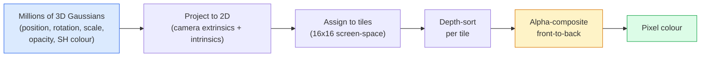

# 从零开始学习3D高斯泼溅

> 场景是数百万个3D高斯体的云团。每个高斯体都有位置、朝向、缩放、不透明度以及依赖于视角的颜色。对它们进行光栅化，通过光栅化进行反向传播，完成。

**类型：** 构建
**语言：** Python
**先修知识：** 第四阶段第13课（3D视觉与NeRF）、第一阶段第12课（张量运算）、第四阶段第10课（扩散基础，可选）
**时间：** ~90分钟

## 学习目标

- 解释为什么3D高斯泼溅在2026年取代NeRF成为照片级3D重建的生产默认方案
- 列出每个高斯体的六个参数（位置、旋转四元数、缩放、不透明度、球谐颜色、可选特征）以及每个参数所占的浮点数
- 使用`alpha`合成，从零实现2D高斯泼溅光栅化器，然后展示3D情况如何投影到同一个循环
- 使用`alpha`、`nerfstudio`或`gsplat`从20-50张照片重建场景，并导出到`SuperSplat` glTF扩展或OpenUSD 26.03的`KHR_gaussian_splatting`模式

## 问题

NeRF将场景存储为MLP的权重。每个渲染像素都需要沿射线进行数百次MLP查询。训练需要数小时，渲染需要数秒，而且权重无法编辑——如果你想移动场景中的一把椅子，就必须重新训练。

3D高斯泼溅（Kerbl, Kopanas, Leimkühler, Drettakis, SIGGRAPH 2023）取代了这一切。场景是显式的3D高斯体集合。渲染是GPU光栅化，可达100+ fps。训练只需数分钟。编辑是直接的：平移一组高斯体，椅子就移动了。到2026年，Khronos Group已经批准了高斯泼溅的glTF扩展，OpenUSD 26.03发布了高斯泼溅模式，Zillow和Apartments.com用它们渲染房地产，大多数关于3D重建的新研究论文都是核心3DGS思想的变体。

心智模型很简单，但数学部分涉及多个环节，以至于大多数介绍从光栅化开始，跳过投影和球谐函数。本课将构建完整的内容——先制作2D版本，再扩展到3D。

## 核心概念

### 高斯体携带的信息

一个3D高斯体是空间中的一个参数化斑点，具有以下属性：

```
position         mu         (3,)    centre in world coordinates
rotation         q          (4,)    unit quaternion encoding orientation
scale            s          (3,)    log-scales per axis (exponentiated at render time)
opacity          alpha      (1,)    post-sigmoid opacity [0, 1]
SH coefficients  c_lm       (3 * (L+1)^2,)   view-dependent colour
```

旋转和缩放构建一个3x3协方差矩阵：`Sigma = R S S^T R^T`。这就是高斯体在3D中的形状。球谐函数允许颜色随视角变化——高光、细微光泽、视角相关的辉光——而无需存储每个视角的纹理。使用球谐函数度数为3时，每个颜色通道有16个系数，每个高斯体仅颜色就需要48个浮点数。

一个场景通常有100万到500万个高斯体。每个约存储60个浮点数（3+4+3+1+48+其他）。对于一个500万高斯体的场景，这大约是240 MB——远小于带有逐点纹理的等价点云，也比重新渲染为高分辨率时的NeRF的MLP权重小一个数量级。

### 光栅化，而非光线步进



五个步骤，全部对GPU友好。每个像素无需MLP查询。单张RTX 3080 Ti能以147 fps渲染600万个高斯体。

### 投影步骤

位于世界位置`mu`且具有3D协方差`Sigma`的3D高斯体，投影到屏幕位置`mu'`且具有2D协方差`Sigma'`的2D高斯体：

```
mu' = project(mu)
Sigma' = J W Sigma W^T J^T          (2 x 2)

W = viewing transform (rotation + translation of camera)
J = Jacobian of the perspective projection at mu'
```

2D高斯体的足迹是一个椭圆，其轴是`Sigma'`的特征向量。椭圆内的每个像素都接收该高斯体的贡献，权重为`exp(-0.5 * (p - mu')^T Sigma'^-1 (p - mu'))`。

### Alpha合成规则

对于一个像素，覆盖它的高斯体按从后到前排序（或等效地，使用反向公式按从前到后排序）。颜色合成的方程与20世纪80年代以来所有半透明光栅化器相同：

```
C_pixel = sum_i alpha_i * T_i * c_i

T_i = prod_{j < i} (1 - alpha_j)       transmittance up to i
alpha_i = opacity_i * exp(-0.5 * d^T Sigma'^-1 d)   local contribution
c_i = eval_SH(SH_i, view_direction)    view-dependent colour
```

这与NeRF的体积渲染方程**完全相同**，只是应用于显式的稀疏高斯体集合，而非沿射线的密集采样。正是这一恒等式使得渲染质量与NeRF相当——两者都在积分同一个辐射场方程。

### 为何这是可微的

每一步——投影、块分配、Alpha合成、球谐函数评估——相对于高斯体参数都是可微的。给定一个真实图像，计算渲染像素损失，通过光栅化器反向传播，通过梯度下降更新所有`(mu, q, s, alpha, c_lm)`参数。经过约30,000次迭代，高斯体找到正确的位置、缩放和颜色。

### 稠密化与修剪

固定的一组高斯体无法覆盖复杂场景。训练包括两种自适应机制：

- **克隆**：当梯度幅度高但缩放较小时，在当前位置克隆一个高斯体——此处重建需要更多细节。
- **分裂**：当梯度高时，将一个大的高斯体分裂成两个较小的高斯体——一个大的高斯体过于平滑，无法拟合该区域。
- **修剪**：剔除不透明度低于阈值的高斯体——它们没有贡献。

稠密化每N次迭代运行一次。一个场景通常从约10万个初始高斯体（从SfM点中播种）增长到训练结束时的100万至500万个。

### 球谐函数简述

视角相关的颜色是单位球面上的函数`c(direction)`。球谐函数是球面上的傅里叶基。截断到度数`L`，每个通道得到`(L+1)^2`个基函数。评估新视角的颜色是学习到的SH系数与在视角方向评估的基之间的点积。度数为0时，一个系数表示恒定颜色。度数为3时，16个系数足以捕捉朗伯着色、高光和轻微反射。SD高斯泼溅论文默认使用度数3。

### 2026年的生产堆栈

```
1. Capture         smartphone / DJI drone / handheld scanner
2. SfM / MVS       COLMAP or GLOMAP derives camera poses + sparse points
3. Train 3DGS      nerfstudio / gsplat / inria official / PostShot (~10-30 min on RTX 4090)
4. Edit            SuperSplat / SplatForge (clean floaters, segment)
5. Export          .ply -> glTF KHR_gaussian_splatting or .usd (OpenUSD 26.03)
6. View            Cesium / Unreal / Babylon.js / Three.js / Vision Pro
```

### 4D与生成式变体

- **4D高斯泼溅**——高斯体是时间的函数；用于体积视频（《超人2026》，A$AP Rocky的《Helicopter》）。
- **生成式泼溅**——文本到泼溅模型（World Labs的Marble），可生成整个场景。
- **3D高斯无迹变换**——NVIDIA NuRec用于自动驾驶仿真的变体。

## 动手构建

### 第一步：二维高斯分布

我们首先构建一个二维光栅化器。三维情形在投影后将简化为二维。

```python
import torch
import torch.nn as nn
import torch.nn.functional as F


def eval_2d_gaussian(means, covs, points):
    """
    means:  (G, 2)      centres
    covs:   (G, 2, 2)   covariance matrices
    points: (H, W, 2)   pixel coordinates
    returns: (G, H, W)  density at every pixel for every Gaussian
    """
    G = means.size(0)
    H, W, _ = points.shape
    flat = points.view(-1, 2)
    inv = torch.linalg.inv(covs)
    diff = flat[None, :, :] - means[:, None, :]
    d = torch.einsum("gpi,gij,gpj->gp", diff, inv, diff)
    density = torch.exp(-0.5 * d)
    return density.view(G, H, W)
```

`einsum` 为每个（高斯，像素）对计算二次形式 `diff^T Sigma^-1 diff`。

### 第二步：二维泼溅光栅化器

从前到后的Alpha混合。深度在二维中没有意义，因此我们使用一个学习到的每高斯标量来确定顺序。

```python
def rasterise_2d(means, covs, colours, opacities, depths, image_size):
    """
    means:     (G, 2)
    covs:      (G, 2, 2)
    colours:   (G, 3)
    opacities: (G,)     in [0, 1]
    depths:    (G,)     per-Gaussian scalar used for ordering
    image_size: (H, W)
    returns:   (H, W, 3) rendered image
    """
    H, W = image_size
    yy, xx = torch.meshgrid(
        torch.arange(H, dtype=torch.float32, device=means.device),
        torch.arange(W, dtype=torch.float32, device=means.device),
        indexing="ij",
    )
    points = torch.stack([xx, yy], dim=-1)

    densities = eval_2d_gaussian(means, covs, points)
    alphas = opacities[:, None, None] * densities
    alphas = alphas.clamp(0.0, 0.99)

    order = torch.argsort(depths)
    alphas = alphas[order]
    colours_sorted = colours[order]

    T = torch.ones(H, W, device=means.device)
    out = torch.zeros(H, W, 3, device=means.device)
    for i in range(means.size(0)):
        a = alphas[i]
        out += (T * a)[..., None] * colours_sorted[i][None, None, :]
        T = T * (1.0 - a)
    return out
```

速度不快——实际实现使用基于块（tile）的CUDA内核——但数学完全正确且完全可微。

### 第三步：可训练的二维泼溅场景

```python
class Splats2D(nn.Module):
    def __init__(self, num_splats=128, image_size=64, seed=0):
        super().__init__()
        g = torch.Generator().manual_seed(seed)
        H, W = image_size, image_size
        self.means = nn.Parameter(torch.rand(num_splats, 2, generator=g) * torch.tensor([W, H]))
        self.log_scale = nn.Parameter(torch.ones(num_splats, 2) * math.log(2.0))
        self.rot = nn.Parameter(torch.zeros(num_splats))  # single angle in 2D
        self.colour_logits = nn.Parameter(torch.randn(num_splats, 3, generator=g) * 0.5)
        self.opacity_logit = nn.Parameter(torch.zeros(num_splats))
        self.depth = nn.Parameter(torch.rand(num_splats, generator=g))

    def covs(self):
        s = torch.exp(self.log_scale)
        c, si = torch.cos(self.rot), torch.sin(self.rot)
        R = torch.stack([
            torch.stack([c, -si], dim=-1),
            torch.stack([si, c], dim=-1),
        ], dim=-2)
        S = torch.diag_embed(s ** 2)
        return R @ S @ R.transpose(-1, -2)

    def forward(self, image_size):
        covs = self.covs()
        colours = torch.sigmoid(self.colour_logits)
        opacities = torch.sigmoid(self.opacity_logit)
        return rasterise_2d(self.means, covs, colours, opacities, self.depth, image_size)
```

`log_scale`、`opacity_logit` 和 `colour_logits` 都是无约束参数，在渲染时通过正确的激活函数映射。这是每个3DGS实现的标准模式。

### 第四步：将二维高斯分布拟合到目标图像

```python
import math
import numpy as np

def make_target(size=64):
    yy, xx = np.meshgrid(np.arange(size), np.arange(size), indexing="ij")
    img = np.zeros((size, size, 3), dtype=np.float32)
    # Red circle
    mask = (xx - 20) ** 2 + (yy - 20) ** 2 < 10 ** 2
    img[mask] = [1.0, 0.2, 0.2]
    # Blue square
    mask = (np.abs(xx - 45) < 8) & (np.abs(yy - 40) < 8)
    img[mask] = [0.2, 0.3, 1.0]
    return torch.from_numpy(img)


target = make_target(64)
model = Splats2D(num_splats=64, image_size=64)
opt = torch.optim.Adam(model.parameters(), lr=0.05)

for step in range(200):
    pred = model((64, 64))
    loss = F.mse_loss(pred, target)
    opt.zero_grad(); loss.backward(); opt.step()
    if step % 40 == 0:
        print(f"step {step:3d}  mse {loss.item():.4f}")
```

经过200多步，64个高斯分布收敛到两个形状。这就是整个思想——对显式几何基元进行梯度下降。

### 第五步：从二维到三维

三维扩展保持相同的循环。新增内容：

1. 每个高斯的旋转是四元数（quaternion）而不是单个角度。
2. 协方差（Covariance）为 `R S S^T R^T`，其中 `R` 由四元数和 `S = diag(exp(log_scale))` 构建。
3. 投影 `R S S^T R^T` 使用相机外参（extrinsics）和透视投影在 `R` 处的雅可比矩阵（Jacobian）。
4. 颜色变为球谐函数（spherical harmonics）展开；在观察方向上计算。
5. 深度排序使用实际相机空间的z值，而不是学习到的标量。

每个生产实现（`gsplat`、`inria/gaussian-splatting`、`nerfstudio`）都在GPU上使用基于块（tile）的CUDA内核执行此操作。

### 第六步：球谐函数求值

最高3阶的球谐基（SH basis）每通道有16项。求值：

```python
def eval_sh_degree_3(sh_coeffs, dirs):
    """
    sh_coeffs: (..., 16, 3)   last dim is RGB channels
    dirs:      (..., 3)       unit vectors
    returns:   (..., 3)
    """
    C0 = 0.282094791773878
    C1 = 0.488602511902920
    C2 = [1.092548430592079, 1.092548430592079,
          0.315391565252520, 1.092548430592079,
          0.546274215296039]
    x, y, z = dirs[..., 0], dirs[..., 1], dirs[..., 2]
    x2, y2, z2 = x * x, y * y, z * z
    xy, yz, xz = x * y, y * z, x * z

    result = C0 * sh_coeffs[..., 0, :]
    result = result - C1 * y[..., None] * sh_coeffs[..., 1, :]
    result = result + C1 * z[..., None] * sh_coeffs[..., 2, :]
    result = result - C1 * x[..., None] * sh_coeffs[..., 3, :]

    result = result + C2[0] * xy[..., None] * sh_coeffs[..., 4, :]
    result = result + C2[1] * yz[..., None] * sh_coeffs[..., 5, :]
    result = result + C2[2] * (2.0 * z2 - x2 - y2)[..., None] * sh_coeffs[..., 6, :]
    result = result + C2[3] * xz[..., None] * sh_coeffs[..., 7, :]
    result = result + C2[4] * (x2 - y2)[..., None] * sh_coeffs[..., 8, :]

    # degree 3 terms omitted here for brevity; full 16-coefficient version in the code file
    return result
```

学习到的 `sh_coeffs` 存储该高斯“每个方向的颜色”。在渲染时，根据当前观察方向求值，得到3维向量RGB。

## 使用它

对于真正的3DGS工作，使用 `gsplat`（Meta）或 `nerfstudio`：

```bash
pip install nerfstudio gsplat
ns-download-data example
ns-train splatfacto --data path/to/data
```

`splatfacto` 是nerfstudio的3DGS训练器。在RTX 4090上，典型场景运行时间10-30分钟。

2026年重要的导出选项：

- `.ply` — 原始高斯点云（可移植，文件最大）。
- `.ply` — PlayCanvas / SuperSplat量化格式。
- glTF `.ply` — Khronos标准，可在各查看器间移植（2026年2月RC版）。
- OpenUSD `.ply` — USD原生，适用于NVIDIA Omniverse和Vision Pro流程。

对于4D/动态场景，`4DGS` 和 `Deformable-3DGS` 通过随时间变化的均值和不透明度扩展了相同机制。

## 发布

本課(lesson)产出：

- `outputs/prompt-3dgs-capture-planner.md` — 一个提示词（prompt），用于规划给定场景类型的采集会话（照片数量、相机路径、光照）。
- `outputs/prompt-3dgs-capture-planner.md` — 一项技能，根据下游查看器或引擎选择正确的导出格式（`outputs/skill-3dgs-export-router.md` / `.ply` / glTF / USD）。

## 练习

1. **（简单）** 在上述二维泼溅训练器上对另一张合成图像进行训练。变化 `num_splats` 中的 `[16, 64, 256]`，绘制每个步数的MSE。识别收益递减点。
2. **（中等）** 扩展二维光栅化器，支持每高斯RGB颜色，该颜色通过2阶谐波依赖于标量“视角”。在一对目标图像上训练，验证模型重建了二者。
3. **（困难）** 克隆 `num_splats`，在20张照片的采集（任何场景：书桌、植物、面孔、房间）上训练 `[16, 64, 256]`。导出为glTF `nerfstudio` 并在查看器（Three.js `splatfacto`、SuperSplat、Babylon.js V9）中打开。报告训练时间、高斯数量及渲染帧率。

## 关键术语

|  术语  |  人们的说法  |  实际含义  |
|------|----------------|----------------------|
|  3DGS  |  "高斯泼溅"  |  将显式场景表示为数百万个三维高斯分布，每个高斯具有位置、旋转、缩放、不透明度、球谐颜色  |
|  协方差（Covariance）  |  "高斯形状"  |  `Sigma = R S S^T R^T`；单个高斯的朝向和各向异性缩放  |
|  Alpha混合（Alpha compositing）  |  "从后到前混合"  |  与NeRF体渲染相同的公式，现在应用于显式稀疏集  |
|  致密化（Densification）  |  "克隆与分裂"  |  在重建欠拟合处自适应添加新的高斯分布  |
|  剪枝（Pruning）  |  "删除低不透明度"  |  移除训练中坍塌到接近零不透明度的高斯分布  |
|  球谐函数（Spherical harmonics）  |  "视点相关颜色"  |  球面上的傅里叶基；存储颜色作为观察方向的函数  |
| Splatfacto | "nerfstudio的3DGS" | 2026年训练3DGS的最简单路径 |
| `KHR_gaussian_splatting` | "glTF标准" | Khronos 2026扩展，使3DGS可在各查看器和引擎间移植 |

## 延伸阅读

- [3D Gaussian Splatting for Real-Time Radiance Field Rendering (Kerbl et al., SIGGRAPH 2023)](https://repo-sam.inria.fr/fungraph/3d-gaussian-splatting/) — 原始论文
- [3D Gaussian Splatting for Real-Time Radiance Field Rendering (Kerbl et al., SIGGRAPH 2023)](https://repo-sam.inria.fr/fungraph/3d-gaussian-splatting/) — 生产级CUDA光栅化器
- [3D Gaussian Splatting for Real-Time Radiance Field Rendering (Kerbl et al., SIGGRAPH 2023)](https://repo-sam.inria.fr/fungraph/3d-gaussian-splatting/) — 参考训练方案
- [3D Gaussian Splatting for Real-Time Radiance Field Rendering (Kerbl et al., SIGGRAPH 2023)](https://repo-sam.inria.fr/fungraph/3d-gaussian-splatting/) — 2026便携格式
- [3D Gaussian Splatting for Real-Time Radiance Field Rendering (Kerbl et al., SIGGRAPH 2023)](https://repo-sam.inria.fr/fungraph/3d-gaussian-splatting/) — [gsplat (Meta/nerfstudio)](https://github.com/nerfstudio-project/gsplat)架构
- [3D Gaussian Splatting for Real-Time Radiance Field Rendering (Kerbl et al., SIGGRAPH 2023)](https://repo-sam.inria.fr/fungraph/3d-gaussian-splatting/) — 行业概述
