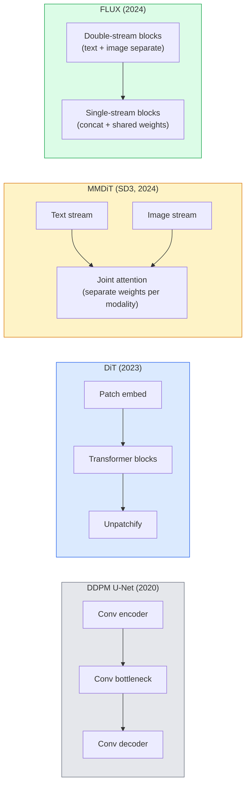

# 扩散变换器与整流流

> U-Net并非扩散的秘密。将其替换为变换器，将噪声调度换成直线流，你就突然得到了SD3、FLUX以及2026年的每一个文生图模型。

**类型：** 学习+构建
**语言：** Python
**前置知识：** 第四阶段第10课（扩散DDPM）、第四阶段第14课（ViT）、第七阶段第02课（自注意力）
**时间：** 约75分钟

## 学习目标

- 追踪从U-Net DDPM（第10课）到扩散变换器（DiT）、MMDiT（SD3）以及单流+双流DiT（FLUX）的演变
- 解释整流流：为什么噪声和数据之间的直线轨迹能让模型在20步而非1000步内采样
- 实现一个微小的DiT模块和一个整流流训练循环，两者均在100行以内
- 根据架构、参数量和许可协议区分模型变体（SD3、FLUX.1-dev、FLUX.1-schnell、Z-Image、Qwen-Image）

## 问题

第10课使用U-Net去噪器构建了一个DDPM。这个配方主导了2020-2023年：U-Net + 贝塔调度 + 噪声预测损失。它产生了Stable Diffusion 1.5和2.1以及DALL-E 2。

每个2026年最先进的文生图模型都已超越它。Stable Diffusion 3、FLUX、SD4、Z-Image、Qwen-Image、Hunyuan-Image——没有一个使用U-Net。它们使用扩散变换器（DiT）。SD3和FLUX还将DDPM噪声调度替换为整流流，它拉直了从噪声到数据的路径，并通过一致性或蒸馏变体实现了1-4步推理。

这一转变至关重要，因为它正是基于扩散的图像生成变得可控、提示准确（SD3/SD4解决了文本渲染问题）且生产快速的原因。理解DiT+整流流就是理解2026年生成式图像技术栈。

## 核心概念

### 从U-Net到变换器



- **DiT**（Peebles & Xie, 2023）——在潜在斑块上用类似ViT的变换器替换U-Net。通过自适应层归一化（AdaLN）进行条件化。
- **MMDiT**（SD3, Esser et al., 2024）——双流，文本和图像令牌分别使用独立权重，并共享联合注意力。
- **FLUX**（Black Forest Labs, 2024）——前N个块像SD3一样是双流，后面的块拼接并共享权重（单流），以实现更高深度下的效率。
- **Z-Image**（2025）——一个高效的6B参数单流DiT，挑战“不惜一切代价扩大规模”。

### 整流流概述

DDPM将前向过程定义为一个有噪声的随机微分方程(SDE)，其中`x_t`被逐渐破坏。学习的反向过程是第二个SDE，通过1000个小步求解。

整流流定义了干净数据和纯噪声之间的**直线**插值：

```
x_t = (1 - t) * x_0 + t * epsilon,     t in [0, 1]
```

训练一个网络来预测速度`v_theta(x_t, t) = epsilon - x_0`——即从干净数据到噪声（`dx_t/dt`）的直线路径上的前向方向。在采样过程中，你反向积分这个速度，从噪声步进到数据。得到的常微分方程(ODE)更接近直线，因此采样所需的积分步数大大减少。

SD3称之为**整流流匹配**。FLUX、Z-Image以及大多数2026年的模型都使用相同的目标。典型推理：20-30步欧拉（确定性）vs 旧DDPM机制中的50+步DDIM。蒸馏版/turbo版/schnell版/LCM变体将其降至1-4步。

### AdaLN条件化

DiT通过**自适应层归一化**对时间步和类别/文本进行条件化：从条件向量预测`scale`和`shift`，并在LayerNorm之后应用它们。比U-Net中的FiLM风格调制更简洁，也是每个现代DiT的默认方法。

```
cond -> MLP -> (scale, shift, gate)
norm(x) * (1 + scale) + shift, then residual add * gate
```

### SD3和FLUX中的文本编码器

- **SD3**使用三个文本编码器：两个CLIP模型 + T5-XXL。嵌入被拼接并作为文本条件输入到图像流。
- **FLUX**使用一个CLIP-L + T5-XXL。
- **Qwen-Image / Z-Image**变体使用其内部文本编码器，与其基座大语言模型对齐。

文本编码器是SD3/FLUX在提示理解上远胜于SD1.5的重要原因。仅T5-XXL就有4.7B参数。

### 无分类器引导仍然有效

整流流改变了采样器，而非条件化。无分类器引导（训练时以10%概率丢弃文本，推理时混合条件和无条件预测）与整流流结合使用效果相同。大多数2026年的模型使用引导尺度3.5-5——低于SD1.5的7.5，因为整流流模型默认更紧密地遵循提示。

### 一致性、Turbo、Schnell、LCM

四种名称对应同一个想法：将一个慢速的多步模型蒸馏成一个快速的少步模型。

- **LCM（潜在一致性模型）** ——训练一个学生模型，从任意中间步骤`x_t`一步预测最终`x_0`。
- **SDXL Turbo / FLUX schnell** ——使用对抗性扩散蒸馏训练的1-4步模型。
- **SD Turbo** ——将OpenAI风格的一致性模型适配到潜在扩散。

任何新模型的生产部署都同时包含一个“全质量”检查点和一个“turbo/schnell”变体。Schnell（德语“快”，Black Forest Labs的约定）在1-4步内运行，适应实时流水线。

### 2026年模型概览

|  模型  |  参数量  |  架构  |  许可协议  |
|-------|------|--------------|---------|
|  Stable Diffusion 3 Medium  |  2B  |  MMDiT  |  SAI社区  |
|  Stable Diffusion 3.5 Large  |  8B  |  MMDiT  |  SAI社区  |
|  FLUX.1-dev  |  12B  |  双流+单流DiT  |  非商业  |
|  FLUX.1-schnell  |  12B  |  相同，蒸馏  |  Apache 2.0  |
|  FLUX.2  |  —  |  迭代的 FLUX.1  |  混合  |
|  Z-Image  |  6B  |  S3-DiT (Scalable Single-Stream)  |  宽松许可  |
|  Qwen-Image  |  ~20B  |  DiT + Qwen 文本塔  |  Apache 2.0  |
|  Hunyuan-Image-3.0  |  ~80B  |  DiT  |  研究用途  |
|  SD4 Turbo  |  3B  |  DiT + 蒸馏  |  SAI Commercial  |

FLUX.1-schnell 是 2026 年的开源默认选择。Z-Image 是效率领先者。FLUX.2 和 SD4 是目前的质量标杆。

### 为什么这种阶段转变很重要

DDPM + U-Net 是有效的。DiT + 整流流(rectified flow)效果**更好、更快、扩展更干净**。这种转变类似于 NLP 中从 RNN 到 Transformer 的转变：两种架构解决了相同的问题，但 Transformer 能够扩展并占据主导地位。2026 年关于图像、视频或 3D 生成的每篇论文都使用 DiT 形状的去噪器，通常采用整流流目标。U-Net DDPM 现在主要用于教学（第 10 课）。

## 动手构建

### 第 1 步：带有 AdaLN 的 DiT 模块

```python
import torch
import torch.nn as nn


class AdaLNZero(nn.Module):
    """
    Adaptive LayerNorm with a gate. Predicts (scale, shift, gate) from the conditioning.
    Init such that the whole block starts as identity ("zero init").
    """

    def __init__(self, dim, cond_dim):
        super().__init__()
        self.norm = nn.LayerNorm(dim, elementwise_affine=False)
        self.mlp = nn.Linear(cond_dim, dim * 3)
        nn.init.zeros_(self.mlp.weight)
        nn.init.zeros_(self.mlp.bias)

    def forward(self, x, cond):
        scale, shift, gate = self.mlp(cond).chunk(3, dim=-1)
        h = self.norm(x) * (1 + scale.unsqueeze(1)) + shift.unsqueeze(1)
        return h, gate.unsqueeze(1)


class DiTBlock(nn.Module):
    def __init__(self, dim=192, heads=3, mlp_ratio=4, cond_dim=192):
        super().__init__()
        self.adaln1 = AdaLNZero(dim, cond_dim)
        self.attn = nn.MultiheadAttention(dim, heads, batch_first=True)
        self.adaln2 = AdaLNZero(dim, cond_dim)
        self.mlp = nn.Sequential(
            nn.Linear(dim, dim * mlp_ratio),
            nn.GELU(),
            nn.Linear(dim * mlp_ratio, dim),
        )

    def forward(self, x, cond):
        h, gate1 = self.adaln1(x, cond)
        a, _ = self.attn(h, h, h, need_weights=False)
        x = x + gate1 * a
        h, gate2 = self.adaln2(x, cond)
        x = x + gate2 * self.mlp(h)
        return x
```

`AdaLNZero` 从恒等映射开始，因为其 MLP 权重初始化为零。训练使模块偏离恒等映射；这极大地稳定了深度 Transformer 扩散模型。

### 第 2 步：一个微型 DiT

```python
def timestep_embedding(t, dim):
    import math
    half = dim // 2
    freqs = torch.exp(-math.log(10000) * torch.arange(half, device=t.device) / half)
    args = t[:, None].float() * freqs[None]
    return torch.cat([args.sin(), args.cos()], dim=-1)


class TinyDiT(nn.Module):
    def __init__(self, image_size=16, patch_size=2, in_channels=3, dim=96, depth=4, heads=3):
        super().__init__()
        self.patch_size = patch_size
        self.num_patches = (image_size // patch_size) ** 2
        self.patch = nn.Conv2d(in_channels, dim, kernel_size=patch_size, stride=patch_size)
        self.pos = nn.Parameter(torch.zeros(1, self.num_patches, dim))
        self.time_mlp = nn.Sequential(
            nn.Linear(dim, dim * 2),
            nn.SiLU(),
            nn.Linear(dim * 2, dim),
        )
        self.blocks = nn.ModuleList([DiTBlock(dim, heads, cond_dim=dim) for _ in range(depth)])
        self.norm_out = nn.LayerNorm(dim, elementwise_affine=False)
        self.head = nn.Linear(dim, patch_size * patch_size * in_channels)

    def forward(self, x, t):
        n = x.size(0)
        x = self.patch(x)
        x = x.flatten(2).transpose(1, 2) + self.pos
        t_emb = self.time_mlp(timestep_embedding(t, self.pos.size(-1)))
        for blk in self.blocks:
            x = blk(x, t_emb)
        x = self.norm_out(x)
        x = self.head(x)
        return self._unpatchify(x, n)

    def _unpatchify(self, x, n):
        p = self.patch_size
        h = w = int(self.num_patches ** 0.5)
        x = x.view(n, h, w, p, p, -1).permute(0, 5, 1, 3, 2, 4).reshape(n, -1, h * p, w * p)
        return x
```

### 第 3 步：整流流训练

```python
import torch.nn.functional as F

def rectified_flow_train_step(model, x0, optimizer, device):
    model.train()
    x0 = x0.to(device)
    n = x0.size(0)
    t = torch.rand(n, device=device)
    epsilon = torch.randn_like(x0)
    x_t = (1 - t[:, None, None, None]) * x0 + t[:, None, None, None] * epsilon

    target_velocity = epsilon - x0
    pred_velocity = model(x_t, t)

    loss = F.mse_loss(pred_velocity, target_velocity)
    optimizer.zero_grad()
    loss.backward()
    optimizer.step()
    return loss.item()
```

与 DDPM 的噪声预测损失（第 10 课）比较：相同的结构，不同的目标。我们不预测噪声 `epsilon`，而是预测**速度** `epsilon - x_0`，它沿着直线插值从数据指向噪声。

### 第 4 步：欧拉采样器

整流流是一个常微分方程(ODE)。欧拉法是最简单的，对于训练良好的整流流模型，在 20 步以上时几乎与高阶求解器一样精确。

```python
@torch.no_grad()
def rectified_flow_sample(model, shape, steps=20, device="cpu"):
    model.eval()
    x = torch.randn(shape, device=device)
    dt = 1.0 / steps
    t = torch.ones(shape[0], device=device)
    for _ in range(steps):
        v = model(x, t)
        x = x - dt * v
        t = t - dt
    return x
```

20 步。在训练好的模型上，这产生的样本可与 1000 步的 DDPM 相媲美。

### 第 5 步：端到端冒烟测试

```python
import numpy as np

def synthetic_blobs(num=200, size=16, seed=0):
    rng = np.random.default_rng(seed)
    out = np.zeros((num, 3, size, size), dtype=np.float32)
    yy, xx = np.meshgrid(np.arange(size), np.arange(size), indexing="ij")
    for i in range(num):
        cx, cy = rng.uniform(4, size - 4, size=2)
        r = rng.uniform(2, 4)
        mask = (xx - cx) ** 2 + (yy - cy) ** 2 < r ** 2
        colour = rng.uniform(-1, 1, size=3)
        for c in range(3):
            out[i, c][mask] = colour[c]
    return torch.from_numpy(out)
```

用整流流在此上训练一个 `TinyDiT`。500 步后，采样输出应看起来像微弱的彩色斑点。

## 使用它

对于使用 FLUX / SD3 / Z-Image 的实际图像生成，`diffusers` 为每个都提供了统一的 API：

```python
from diffusers import FluxPipeline, StableDiffusion3Pipeline
import torch

pipe = FluxPipeline.from_pretrained(
    "black-forest-labs/FLUX.1-schnell",
    torch_dtype=torch.bfloat16,
).to("cuda")

out = pipe(
    prompt="a golden retriever surfing a tsunami, hyperrealistic, studio lighting",
    guidance_scale=0.0,           # schnell was trained without CFG
    num_inference_steps=4,
    max_sequence_length=256,
).images[0]
out.save("surf.png")
```

三行代码。四步内的 `FLUX.1-schnell`。将模型 id 替换为 `black-forest-labs/FLUX.1-dev` 可在 20-30 步内以 CFG 获得更高质量。

对于 SD3：

```python
pipe = StableDiffusion3Pipeline.from_pretrained(
    "stabilityai/stable-diffusion-3.5-large",
    torch_dtype=torch.bfloat16,
).to("cuda")
out = pipe(prompt, guidance_scale=3.5, num_inference_steps=28).images[0]
```

## 发布

本課(lesson)产出：

- `outputs/prompt-dit-model-picker.md` — 根据质量、延迟和许可约束，在 SD3、FLUX.1-dev、FLUX.1-schnell、Z-Image、SD4 Turbo 之间选择。
- `outputs/prompt-dit-model-picker.md` — 编写一个完整的训练循环，用于带有 AdaLN DiT 和欧拉采样的整流流。

## 练习

1. **（简单）** 在上面的合成斑点数据集上训练 TinyDiT 500 步。比较使用 10、20 和 50 个欧拉步生成的样本。
2. **（中等）** 通过将学习的类别嵌入与时间嵌入拼接来添加文本条件（按颜色分为 10 个斑点“类别”）。使用类别 0、5 和 9 采样，并验证颜色匹配。
3. **（困难）** 计算来自相同大小网络、相同数据、相同步数训练的整流流和 DDPM 版本生成样本的弗雷歇距离（FID 代理）。报告哪个收敛更快。

## 关键术语

|  术语  |  人们的说法  |  实际含义  |
|------|----------------|----------------------|
|  DiT  |  "扩散 Transformer"  |  取代 U-Net 作为扩散去噪器的 Transformer；对分块潜变量进行操作  |
|  AdaLN  |  "自适应层归一化"  |  通过 LayerNorm 后应用学习的缩放、偏移、门控进行时间步/文本条件化；每个现代 DiT 中的标准  |
|  MMDiT  |  "多模态 DiT (SD3)"  |  文本和图像 token 的独立权重流，共享联合自注意力  |
|  单流/双流  |  "FLUX 技巧"  |  前 N 个块为双流（每个模态独立权重），后续块为单流（拼接+共享权重）以提高效率  |
|  整流流  |  "直线噪声到数据"  |  数据和噪声之间的线性插值；网络预测速度；推理时需要的 ODE 步数更少  |
|  速度目标  |  "epsilon - x_0"  |  整流流中的回归目标；从干净数据指向噪声  |
| CFG指导（guidance）  |  "无分类器指导（classifier-free guidance）"  |  混合条件预测和无条件预测；仍用于修正流（rectified-flow）模型 |
| Schnell / turbo / LCM  |  "1-4步蒸馏（distillation）"  |  从全质量模型蒸馏出的小步变体；生产实时 |

## 延伸阅读

- [Scalable Diffusion Models with Transformers (Peebles & Xie, 2023)](https://arxiv.org/abs/2212.09748) — DiT论文
- [Scalable Diffusion Models with Transformers (Peebles & Xie, 2023)](https://arxiv.org/abs/2212.09748) — MMDiT与大规模修正流（rectified-flow）
- [Scalable Diffusion Models with Transformers (Peebles & Xie, 2023)](https://arxiv.org/abs/2212.09748) — 双流+单流细节
- [Scalable Diffusion Models with Transformers (Peebles & Xie, 2023)](https://arxiv.org/abs/2212.09748) — 6B参数的单一流DiT
- [Scalable Diffusion Models with Transformers (Peebles & Xie, 2023)](https://arxiv.org/abs/2212.09748) — 每个扩散设计权衡的参考
- [Scalable Diffusion Models with Transformers (Peebles & Xie, 2023)](https://arxiv.org/abs/2212.09748) — LCM-LoRA如何实现4步推理（inference）
