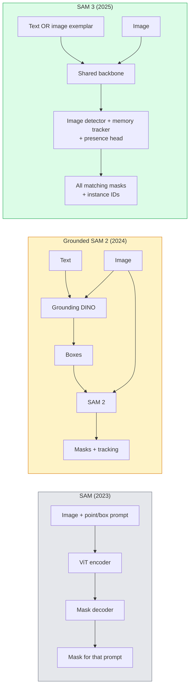

# SAM 3 与开放词汇分割

> 给模型一个文本提示和一张图像，即可获取每个匹配对象的掩码。SAM 3 将其简化为单次前向传播。

**类型：** 使用 + 构建
**语言：** Python
**前置知识：** 阶段4 第07课 (U-Net), 阶段4 第08课 (Mask R-CNN), 阶段4 第18课 (CLIP)
**时间：** ~60分钟

## 学习目标

- 区分 SAM（仅视觉提示）、Grounded SAM / SAM 2（检测器 + SAM）和 SAM 3（通过可提示概念分割实现原生文本提示）
- 解释 SAM 3 架构：共享骨干网络 + 图像检测器 + 基于记忆的视频追踪器 + 存在性头 + 解耦的检测器-追踪器设计
- 使用 Hugging Face `transformers` SAM 3 集成进行文本提示的检测、分割和视频追踪
- 根据延迟、概念复杂度和部署目标在 SAM 3、Grounded SAM 2、YOLO-World 和 SAM-MI 之间做出选择

## 问题

2023年的 SAM 是一个仅支持视觉提示的模型：你点击一个点或绘制一个框，它返回一个掩码。对于“给我这张照片中所有的橙子”，你需要一个检测器（Grounding DINO）来生成框，然后 SAM 分割每个框。Grounded SAM 将其转化为流水线，但它是两个冻结模型的级联，不可避免地会累积误差。

SAM 3（Meta，2025年11月，ICLR 2026）消除了级联。它接受一个简短的名词短语或图像样本作为提示，并在单次前向传播中返回所有匹配的掩码和实例 ID。这就是**可提示概念分割（PCS）**。结合2026年3月的 Object Multiplex 更新（SAM 3.1），它可以高效地追踪视频中同一概念的多个实例。

本课旨在讲解这一结构性转变。2D 分割、检测和文本-图像接地已经融合到一个模型中。生产中的问题不再是“我应该串联哪个流水线”，而是“哪个可提示模型可以端到端地处理我的用例”。

## 核心概念

### 三代模型



### 可提示概念分割

“概念提示”是一个简短的名词短语（`"yellow school bus"`，`"striped red umbrella"`，`"hand holding a mug"`）或一个图像样本。模型返回图像中与该概念匹配的每个实例的分割掩码，以及每个匹配的唯一实例 ID。

这与传统的视觉提示 SAM 在三个方面不同：

1. 无需每个实例的提示 — 一个文本提示返回所有匹配。
2. 开放词汇 — 概念可以是任何可以用自然语言描述的事物。
3. 一次返回多个实例，而不是每个提示一个掩码。

### 关键架构组件

- **共享骨干网络** — 单个 ViT 处理图像。检测器头和基于记忆的追踪器都从中读取。
- **存在性头** — 预测概念是否存在于图像中。将“是否存在？”与“在哪里？”解耦。减少不存在概念上的假阳性。
- **解耦的检测器-追踪器** — 图像级检测和视频级追踪有独立的头，因此不会相互干扰。
- **记忆库** — 在帧间存储每个实例的特征以用于视频追踪（与 SAM 2 相同的机制）。

### 大规模训练

SAM 3 在**400万个独特概念**上进行了训练，这些概念由一个数据引擎生成，该引擎使用 AI 和人工审核迭代地标注和修正。新的**SA-CO基准**包含27万个独特概念，比之前的基准大50倍。SAM 3 在 SA-CO 上达到了人类表现的75-80%，并在图像和视频 PCS 上使现有系统的性能翻倍。

### SAM 3.1 Object Multiplex

2026年3月更新：**Object Multiplex**引入了一种共享记忆机制，用于同时追踪同一概念的多个实例。以前，追踪 N 个实例需要 N 个独立的记忆库。Multiplex 将其压缩为一个共享记忆和每个实例的查询。结果：多目标追踪速度显著提升，且不牺牲准确性。

### 2026年 Grounded SAM 仍有用的场景

- 当您需要替换特定的开放词汇检测器（DINO-X、Florence-2）时。
- 当 SAM 3 的许可证（受 Hugging Face 限制）成为障碍时。
- 当您需要比 SAM 3 提供的检测阈值更精细的控制时。
- 用于检测器组件的研究/消融工作。

模块化流水线仍有其价值。对于大多数生产工作，SAM 3 是更简单的答案。

### YOLO-World 与 SAM 3 对比

- **YOLO-World** — 仅开放词汇检测器（无掩码）。实时。适用于需要高帧率框的场景。
- **SAM 3** — 完整的分割加追踪。较慢但输出更丰富。

生产分工：YOLO-World 用于快速检测流水线（机器人导航、快速仪表板），SAM 3 用于需要掩码或追踪的任何场景。

### SAM-MI 效率

SAM-MI（2025-2026）解决了 SAM 的解码器瓶颈。关键思想：

- **稀疏点提示** — 使用少量精心选择的点而非密集提示；将解码器调用减少96%。
- **浅层掩码聚合** — 将粗略的掩码预测合并为一个更清晰的掩码。
- **解耦的掩码注入** — 解码器接收预计算的掩码特征，而不是重新运行。

结果：在开放词汇基准上比 Grounded-SAM 加速约1.6倍。

### 三种模型的输出格式

所有模型返回相同的通用结构（框 + 标签 + 分数 + 掩码 + ID），这很有帮助——您的下游流水线无需根据运行的模型进行分支。

## 动手构建

### 步骤1：提示词构建

构建一个辅助工具，将用户句子转换为SAM 3概念提示词列表。这是“用户输入内容”与“模型消费内容”之间的边界。

```python
def split_concepts(sentence):
    """
    Heuristic splitter for multi-concept prompts.
    Returns list of short noun phrases.
    """
    for sep in [",", ";", "and", "or", "&"]:
        if sep in sentence:
            parts = [p.strip() for p in sentence.replace("and ", ",").split(",")]
            return [p for p in parts if p]
    return [sentence.strip()]

print(split_concepts("cats, dogs and balloons"))
```

SAM 3每次前向传播接受一个概念；对于多概念查询，进行循环或批处理。

### 步骤2：后处理辅助工具

将SAM 3的原始输出转换为符合Phase 4 Lesson 16流程合约的干净检测列表。

```python
from dataclasses import dataclass
from typing import List

@dataclass
class ConceptDetection:
    concept: str
    instance_id: int
    box: tuple          # (x1, y1, x2, y2)
    score: float
    mask_rle: str       # run-length encoded


def rle_encode(binary_mask):
    flat = binary_mask.flatten().astype("uint8")
    runs = []
    prev, count = flat[0], 0
    for v in flat:
        if v == prev:
            count += 1
        else:
            runs.append((int(prev), count))
            prev, count = v, 1
    runs.append((int(prev), count))
    return ";".join(f"{v}x{c}" for v, c in runs)
```

RLE即使对于大量高分辨率掩码也能保持响应负载较小。同一格式适用于SAM 2、SAM 3、Grounded SAM 2。

### 步骤3：统一的开放词汇分割接口

将你使用的任何后端（SAM 3、Grounded SAM 2、YOLO-World + SAM 2）封装到单一方法背后。当后端发生变化时，你的下游代码无需改变。

```python
from abc import ABC, abstractmethod
import numpy as np

class OpenVocabSeg(ABC):
    @abstractmethod
    def detect(self, image: np.ndarray, concept: str) -> List[ConceptDetection]:
        ...


class StubOpenVocabSeg(OpenVocabSeg):
    """
    Deterministic stub used for pipeline testing when real models are not loaded.
    """
    def detect(self, image, concept):
        h, w = image.shape[:2]
        return [
            ConceptDetection(
                concept=concept,
                instance_id=0,
                box=(w * 0.2, h * 0.3, w * 0.5, h * 0.8),
                score=0.89,
                mask_rle="0x100;1x50;0x200",
            ),
            ConceptDetection(
                concept=concept,
                instance_id=1,
                box=(w * 0.55, h * 0.25, w * 0.85, h * 0.75),
                score=0.74,
                mask_rle="0x80;1x40;0x220",
            ),
        ]
```

真正的`SAM3OpenVocabSeg`子类将封装`transformers.Sam3Model`和`Sam3Processor`。

### 步骤4：Hugging Face SAM 3用法（参考）

对于实际模型，`transformers`集成：

```python
from transformers import Sam3Processor, Sam3Model
import torch

processor = Sam3Processor.from_pretrained("facebook/sam3")
model = Sam3Model.from_pretrained("facebook/sam3").eval()

inputs = processor(images=pil_image, return_tensors="pt")
inputs = processor.set_text_prompt(inputs, "yellow school bus")

with torch.no_grad():
    outputs = model(**inputs)

masks = processor.post_process_masks(
    outputs.masks, inputs.original_sizes, inputs.reshaped_input_sizes
)
boxes = outputs.boxes
scores = outputs.scores
```

一次提示词，单次调用返回所有匹配项。

### 步骤5：衡量Grounded SAM 2免费提供的东西

一个诚实的基准测试：在实际流程中用SAM 3替换Grounded SAM 2会发生什么？

- 延迟：SAM 3节省了一次前向传播（无需单独检测器），但模型本身更重；通常净中性或略有加速。
- 准确性：SAM 3在罕见或组合概念（“带条纹的红伞”）上表现更好。在常见单词概念上相似。
- 灵活性：Grounded SAM 2允许你更换检测器（DINO-X、Florence-2、Grounding DINO 1.5）；SAM 3是整体的。

结论：SAM 3是2026年开放词汇分割的默认选择。当你需要检测器灵活性或不同许可条款时，Grounded SAM 2仍然是正确的答案。

## 使用它

生产部署模式：

- **实时标注** — SAM 3 + CVAT的标签即文本提示功能。标注员选择标签名称；SAM 3预标注每个匹配实例。审核并修正。
- **视频分析** — SAM 3.1 Object Multiplex用于多目标跟踪；将帧送入基于记忆的跟踪器。
- **机器人** — SAM 3用于开放词汇操作（“拿起红色杯子”）；作为规划原语运行。
- **医学影像** — SAM 3在医学概念上微调；需要在HF上提交访问请求。

Ultralytics在其Python包中封装了SAM 3：

```python
from ultralytics import SAM

model = SAM("sam3.pt")
results = model(image_path, prompts="yellow school bus")
```

与YOLO和SAM 2相同的接口。

## 发布

本課(lesson)产出：

- `outputs/prompt-open-vocab-stack-picker.md` — 一种提示词，根据延迟、概念复杂度和许可选择SAM 3 / Grounded SAM 2 / YOLO-World / SAM-MI。
- `outputs/prompt-open-vocab-stack-picker.md` — 一种技能，将用户话语转换为格式良好的SAM 3概念提示词（拆分、消歧、回退）。

## 练习

1. **(简单)** 在你选择的概念提示词下，对10张图像运行SAM 3。在同一图像上与SAM 2 + Grounding DINO 1.5进行比较。报告每个模型遗漏了哪些概念。
2. **(中等)** 在SAM 3之上构建一个“点击包含/点击排除”UI：文本提示返回候选实例；用户点击保留哪些作为正例。将最终概念集输出为JSON。
3. **(困难)** 在自定义概念集（例如5种电子元件）上微调SAM 3，每个概念使用20张标注图像。与零样本SAM 3在同一测试集上比较；测量掩码IoU改进。

## 关键术语

|  术语  |  人们的说法  |  实际含义  |
|------|----------------|----------------------|
|  开放词汇分割  |  "按文本分割"  |  为自然语言描述的对象生成掩码，而非固定标签集  |
|  PCS  |  "可提示概念分割"  |  SAM 3的核心任务——给定名词短语或图像示例，分割所有匹配实例  |
|  概念提示  |  "文本输入"  |  短名词短语或图像示例；非完整句子  |
|  存在性头  |  "它在吗？"  |  SAM 3模块，在定位前决定概念是否存在于图像中  |
|  SA-CO  |  "SAM 3基准"  |  27万概念开放词汇分割基准；比先前开放词汇基准大50倍  |
|  Object Multiplex  |  "SAM 3.1更新"  |  共享内存多目标跟踪；快速联合跟踪多个实例  |
|  Grounded SAM 2  |  "模块化流程"  |  检测器 + SAM 2级联；在检测器可更换时仍然相关  |
|  SAM-MI  |  "高效SAM变体"  |  掩码注入，相比Grounded-SAM加速1.6倍  |

## 延伸阅读

- [SAM 3: Segment Anything with Concepts (arXiv 2511.16719)](https://arxiv.org/abs/2511.16719)
- [SAM 3.1 Object Multiplex (Meta AI, March 2026)](https://ai.meta.com/blog/segment-anything-model-3/)
- [SAM 3 model page on Hugging Face](https://huggingface.co/facebook/sam3)
- [Grounded SAM 2 tutorial (PyImageSearch)](https://pyimagesearch.com/2026/01/19/grounded-sam-2-from-open-set-detection-to-segmentation-and-tracking/)
- [Ultralytics SAM 3 docs](https://docs.ultralytics.com/models/sam-3/)
- [SAM3-I: Instruction-aware SAM (arXiv 2512.04585)](https://arxiv.org/abs/2512.04585)
