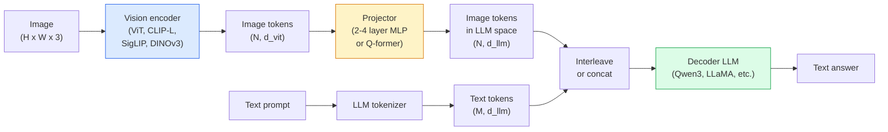

# 视觉语言模型——ViT-MLP-LLM模式

> 视觉编码器将图像转换为token。MLP投影器将这些token映射到LLM的嵌入空间。语言模型完成其余工作。这种模式——ViT-MLP-LLM——是2026年所有生产级VLM的基础。

**类型：** 学习+使用
**语言：** Python
**前置要求：** 第4阶段第14课（ViT），第4阶段第18课（CLIP），第7阶段第02课（自注意力）
**时长：** ~75分钟

## 学习目标

- 阐述ViT-MLP-LLM架构，并解释三个组件各自的作用
- 比较Qwen3-VL、InternVL3.5、LLaVA-Next和GLM-4.6V在参数量、上下文长度和基准性能上的差异
- 解释DeepStack：为什么多层ViT特征比单层最后一层特征更好地增强视觉-语言对齐
- 使用跨模态错误率(Cross-Modal Error Rate, CMER)衡量生产环境中的VLM幻觉，并基于该信号采取行动

## 问题

CLIP（第4阶段第18课）提供了图像和文本的共享嵌入空间，足以用于零样本分类和检索。但它无法回答“这张图里有多少辆红色汽车？”，因为CLIP不生成文本——它只计算相似度。

视觉语言模型( Vision-Language Models, VLMs)——Qwen3-VL、InternVL3.5、LLaVA-Next、GLM-4.6V——将CLIP系列的图像编码器与完整的语言模型结合。模型看到图像和问题后生成答案。2026年，开源VLM在多模态基准测试（MMMU、MMBench、DocVQA、ChartQA、MathVista、OSWorld）上已能与GPT-5和Gemini-2.5-Pro媲美甚至超越。

这三部分（ViT、投影器、LLM）是标准配置。模型间的差异在于选择哪个ViT、哪个投影器、哪个LLM、训练数据以及对齐方案。一旦理解了这个模式，交换任何组件都是机械性的。

## 核心概念

### ViT-MLP-LLM架构



1. **视觉编码器**——预训练的ViT（CLIP-L/14、SigLIP、DINOv3或微调变体）。生成图像块token。
2. **投影器**——一个小型模块（2-4层MLP或Q-former），将视觉token映射到LLM的嵌入维度。这是大部分微调发生的地方。
3. **LLM**——仅解码器语言模型（Qwen3、Llama、Mistral、GLM、InternLM）。按顺序读取视觉+文本token，生成文本。

原则上，这三个部分都是可训练的。实践中，视觉编码器和LLM大多保持冻结，而投影器进行训练——只需几十亿参数的信号成本很低。

### DeepStack

普通投影只使用ViT的最后一层。DeepStack（Qwen3-VL）从多个ViT深度采样特征并堆叠。深层携带高层语义；浅层携带细粒度空间和纹理信息。将两者输入LLM，缩小了“图像包含什么”（语义）与“具体在哪里”（空间定位）之间的差距。

### 三个阶段

现代VLM分阶段训练：

1. **对齐**——冻结ViT和LLM。仅在图像-标题对上训练投影器。教会投影器将视觉空间映射到语言空间。
2. **预训练**——解冻所有部分。在大规模交错的图像-文本数据（5亿+对）上训练。构建模型的视觉知识。
3. **指令微调**——在精心整理的（图像、问题、答案）三元组上微调。教会对话行为和任务格式。这就是将“视觉感知语言模型”转变为可用助手的关键。

大多数LoRA微调针对第3阶段，使用小型标注数据集。

### 模型系列对比（2026年初）

|  模型  |  参数  |  视觉编码器  |  LLM  |  上下文长度  |  优势  |
|-------|--------|----------------|-----|---------|-----------|
|  Qwen3-VL-235B-A22B (MoE)  |  235B（22B激活）|||  自定义ViT + DeepStack  |  Qwen3  |  256K  |  通用SOTA，GUI智能体  |  |
|  Qwen3-VL-30B-A3B (MoE)  |  30B（3B激活）|||  自定义ViT + DeepStack  |  Qwen3  |  256K  |  更小的MoE替代方案  |  |
|  Qwen3-VL-8B (dense)  |  8B  |  自定义ViT  |  Qwen3  |  128K  |  生产环境密集默认配置  |
|  InternVL3.5-38B  |  38B  |  InternViT-6B  |  Qwen3 + GPT-OSS  |  128K  |  MMBench/MMVet表现强劲  |
|  InternVL3.5-241B-A28B  |  241B（28B激活）|||  InternViT-6B  |  Qwen3  |  128K  |  与GPT-4o竞争  |  |
|  LLaVA-Next 72B  |  72B  |  SigLIP  |  Llama-3  |  32K  |  开源，易于微调  |
|  GLM-4.6V  |  ~70B  |  自定义  |  GLM  |  64K  |  开源，强OCR  |
|  MiniCPM-V-2.6  |  8B  |  SigLIP  |  MiniCPM  |  32K  |  适合边缘设备  |

### 视觉智能体

Qwen3-VL-235B在OSWorld上达到了全球顶级性能——这是一个针对操作GUI（桌面、移动、网页）的**视觉智能体**的基准测试。该模型看到截图，理解UI，并输出操作（点击、输入、滚动）。结合工具，它闭环完成常见桌面任务。这就是2026年大多数“AI PC”演示的底层运行机制。

### 智能体能力 + RoPE变体

VLM需要知道视频中帧的**时间**信息。Qwen3-VL从T-RoPE（时间旋转位置编码）演进到**基于文本的时间对齐**——将显式时间戳文本token与视频帧交错。模型看到“`<timestamp 00:32>` frame, prompt”后，便能推理时间关系。

### 对齐问题

在爬取的数据集中，12%的图像-文本对包含不完全基于图像的描述。在这种数据上训练的VLM会悄悄学会幻觉——编造物体、误读数字、捏造关系。在生产环境中，这是主要的故障模式。

Skywork.ai 引入了**跨模态错误率(Cross-Modal Error Rate, CMER)**来追踪这一问题：

```
CMER = fraction of outputs where the text confidence is high but the image-text similarity (via a CLIP-family checker) is low
```

高CMER意味着模型自信地说出一些不基于图像的内容。监控CMER并将其作为生产环境的关键绩效指标(KPI)，可将他们部署中的幻觉率降低约35%。诀窍不是“修复模型”，而是“将高CMER输出路由到人工审核”。

### 使用LoRA/QLoRA进行微调

对大多数团队来说，对70B参数的VLM进行全量微调遥不可及。在注意力层和投影仪层上使用LoRA（秩16-64），或使用4位基础权重的QLoRA，可以适配单个A100/H100。成本：5,000-50,000个样本，$100-$5,000的计算费用，2-10小时的训练时间。

### 空间推理仍然薄弱

当前VLM在空间推理基准测试（上下、左右、计数、距离）上得分50-60%。如果你的用例依赖于“哪个物体在哪个上面”，请仔细验证——通用VLM性能低于人类。对于纯空间任务，比VLM更好的替代方案：专门的关键点/姿态估计器、深度模型，或带有边界框几何后处理的检测模型。

## 动手构建

### 步骤1：投影器(Projector)

这是你最常训练的部分。由2-4层MLP构成，使用GELU激活函数。

```python
import torch
import torch.nn as nn


class Projector(nn.Module):
    def __init__(self, vit_dim=768, llm_dim=4096, hidden=4096):
        super().__init__()
        self.net = nn.Sequential(
            nn.Linear(vit_dim, hidden),
            nn.GELU(),
            nn.Linear(hidden, llm_dim),
        )

    def forward(self, x):
        return self.net(x)
```

输入是一个`(N_patches, d_vit)`标记(token)张量。输出是`(N_patches, d_llm)`。LLM将每个输出行视为另一个标记(token)。

### 步骤2：组装端到端的ViT-MLP-LLM

最小VLM的前向传播骨架。实际代码使用`transformers`；这里是概念布局。

```python
class MinimalVLM(nn.Module):
    def __init__(self, vit, projector, llm, image_token_id):
        super().__init__()
        self.vit = vit
        self.projector = projector
        self.llm = llm
        self.image_token_id = image_token_id  # placeholder token in text prompt

    def forward(self, image, input_ids, attention_mask):
        # 1. vision features
        vision_tokens = self.vit(image)                     # (B, N_patches, d_vit)
        vision_embeds = self.projector(vision_tokens)       # (B, N_patches, d_llm)

        # 2. text embeddings
        text_embeds = self.llm.get_input_embeddings()(input_ids)  # (B, M, d_llm)

        # 3. replace image placeholder tokens with vision embeds
        merged = self._merge(text_embeds, vision_embeds, input_ids)

        # 4. run LLM
        return self.llm(inputs_embeds=merged, attention_mask=attention_mask)

    def _merge(self, text_embeds, vision_embeds, input_ids):
        out = text_embeds.clone()
        expected = vision_embeds.size(1)
        for b in range(input_ids.size(0)):
            positions = (input_ids[b] == self.image_token_id).nonzero(as_tuple=True)[0]
            if len(positions) != expected:
                raise ValueError(
                    f"batch item {b} has {len(positions)} image tokens but vision_embeds has {expected} patches."
                    " Every sample in the batch must be pre-padded to the same number of image placeholder tokens.")
            out[b, positions] = vision_embeds[b]
        return out
```

文本中的`<image>`占位标记(token)会被替换为真实的图像嵌入——与LLaVA、Qwen-VL和InternVL使用的模式相同。

### 步骤3：CMER计算

一个轻量级的运行时检查。

```python
import torch.nn.functional as F


def cross_modal_error_rate(image_emb, text_emb, text_confidence, sim_threshold=0.25, conf_threshold=0.8):
    """
    image_emb, text_emb: embeddings of image and generated text (normalised internally)
    text_confidence:     mean per-token probability in [0, 1]
    Returns:             fraction of high-confidence outputs with low image-text alignment
    """
    image_emb = F.normalize(image_emb, dim=-1)
    text_emb = F.normalize(text_emb, dim=-1)
    sim = (image_emb * text_emb).sum(dim=-1)        # cosine similarity
    high_conf_low_sim = (text_confidence > conf_threshold) & (sim < sim_threshold)
    return high_conf_low_sim.float().mean().item()
```

将CMER作为生产环境的关键绩效指标(KPI)。按端点、提示类型、客户分别监控。CMER上升表明模型开始在某种输入分布上产生幻觉。

### 步骤4：玩具VLM分类器（可运行）

演示投影器的训练。输入假造的"ViT特征"，一个微小的LLM风格的标记(token)输出类别。

```python
class ToyVLM(nn.Module):
    def __init__(self, vit_dim=32, llm_dim=64, num_classes=5):
        super().__init__()
        self.projector = Projector(vit_dim, llm_dim, hidden=64)
        self.head = nn.Linear(llm_dim, num_classes)

    def forward(self, vision_tokens):
        projected = self.projector(vision_tokens)
        pooled = projected.mean(dim=1)
        return self.head(pooled)
```

可以在不到200步内用合成数据（特征，类别）对拟合——足以证明投影器模式有效。

## 使用它

2026年生产团队使用VLM的三种方式：

- **托管API** — OpenAI Vision、Anthropic Claude Vision、Google Gemini Vision。零基础设施，供应商风险。
- **开源自托管** — 通过`transformers`和`vllm`部署Qwen3-VL或InternVL3.5。完全控制，前期投入较高。
- **领域微调** — 加载Qwen2.5-VL-7B或LLaVA-1.6-7B，在5k-50k自定义样本上使用LoRA，用`transformers`或`vllm`提供服务。

```python
from transformers import AutoProcessor, AutoModelForVision2Seq
import torch
from PIL import Image

model_id = "Qwen/Qwen3-VL-8B-Instruct"
processor = AutoProcessor.from_pretrained(model_id)
model = AutoModelForVision2Seq.from_pretrained(model_id, torch_dtype=torch.bfloat16, device_map="auto")

messages = [{
    "role": "user",
    "content": [
        {"type": "image", "image": Image.open("plot.png")},
        {"type": "text", "text": "What does this chart show?"},
    ],
}]
inputs = processor.apply_chat_template(messages, add_generation_prompt=True, tokenize=True, return_dict=True, return_tensors="pt").to("cuda")
generated = model.generate(**inputs, max_new_tokens=256)
answer = processor.decode(generated[0][inputs["input_ids"].shape[1]:], skip_special_tokens=True)
```

`apply_chat_template`隐藏了`<image>`占位标记化(tokenisation)；模型内部处理合并。

## 发布

本課(lesson)产出：

- `outputs/prompt-vlm-selector.md` — 根据准确率、延迟、上下文长度和预算选择Qwen3-VL / InternVL3.5 / LLaVA-Next / API。
- `outputs/prompt-vlm-selector.md` — 输出代码，用于在生产VLM端点上检测跨模态错误率、每个端点的仪表板和告警阈值。

## 练习

1. **(简单)** 在五张图像上通过任意开源VLM运行三个提示（"这是什么？"、"数物体数目"、"描述场景"）。人工对每个答案评分：正确/部分正确/幻觉。计算初步的类CMER比率。
2. **(中等)** 使用LoRA（秩16）在500张目标领域图像及其描述上微调Qwen2.5-VL-3B或LLaVA-1.6-7B。比较零样本与微调后的MMBench风格准确率。
3. **(困难)** 将VLM的图像编码器替换为DINOv3，代替默认的SigLIP/CLIP。仅重新训练投影器（冻结LLM和冻结DINOv3）。测量密集预测任务（计数、空间推理）是否提升。

## 关键术语

|  术语  |  人们的说法  |  实际含义  |
|------|----------------|----------------------|
|  ViT-MLP-LLM  |  "VLM模式"  |  视觉编码器 + 投影器 + 语言模型；每个2026年的VLM  |
|  投影器(Projector)  |  "桥梁"  |  2-4层MLP（或Q-former），将视觉标记映射到LLM嵌入空间  |
|  DeepStack  |  "Qwen3-VL特征技巧"  |  多层ViT特征堆叠，而非仅最后一层  |
|  图像标记(Image token)  |  "<image>占位符"  |  文本流中的特殊标记，由投影后的视觉嵌入替换  |
|  CMER  |  "幻觉KPI"  |  跨模态错误率；当文本置信度高但图像-文本相似性低时升高  |
|  视觉代理  |  "可点击的VLM"  |  通过工具调用操作图形用户界面的VLM（涵盖OSWorld、移动端、网页端）  |
|  Q-Former  |  "固定数量令牌桥"  |  BLIP-2风格投影器，产生固定数量的视觉查询令牌  |
|  对齐/预训练/指令微调  |  "三阶段"  |  标准VLM训练流水线  |

## 延伸阅读

- [Qwen3-VL Technical Report (arXiv 2511.21631)](https://arxiv.org/abs/2511.21631)
- [InternVL3.5 Advancing Open-Source Multimodal Models (arXiv 2508.18265)](https://arxiv.org/html/2508.18265v1)
- [LLaVA-Next series](https://llava-vl.github.io/blog/2024-05-10-llava-next-stronger-llms/)
- [BentoML: Best Open-Source VLMs 2026](https://www.bentoml.com/blog/multimodal-ai-a-guide-to-open-source-vision-language-models)
- [MMMU: Multi-discipline Multimodal Understanding benchmark](https://mmmu-benchmark.github.io/)
- [VLMs in manufacturing (Robotics Tomorrow, March 2026)](https://www.roboticstomorrow.com/story/2026/03/when-machines-learn-to-see-like-experts-the-rise-of-vision-language-models-in-manufacturing/26335/)
