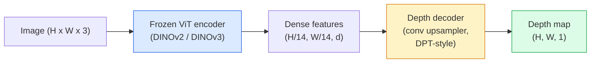

# 单目深度与几何估计

> 深度图(depth map)是单通道图像，每个像素表示到相机的距离。以前，没有立体视觉或LiDAR，从单张RGB帧预测深度图是不可能的。到了2026年，冻结的ViT编码器加上轻量级头部网络已经能将误差缩小到真值的百分之几以内。

**类型：** 构建+使用
**语言：** Python
**前置知识：** 第4阶段第14课（ViT）、第4阶段第17课（自监督视觉）、第4阶段第07课（U-Net）
**时间：** 约60分钟

## 学习目标

- 区分相对深度(relative depth)和度量深度(metric depth)，并指出每个生产模型（MiDaS、Marigold、Depth Anything V3、ZoeDepth）解决的是哪一种
- 使用Depth Anything V3（DINOv2主干网络）无需标定即可预测任意单张图像的深度
- 解释单目深度为何能从单张图像工作（透视线索、纹理梯度、学习先验）以及它无法恢复的内容（绝对尺度、遮挡几何）
- 利用深度图(depth map)和针孔相机内参将2D检测提升到3D点

## 问题

深度是二维计算机视觉中缺失的轴。给定RGB图像，你知道物体在图像平面上的位置，但不知道它们有多远。深度传感器（立体相机、LiDAR、飞行时间）直接解决了这个问题，但成本高、脆弱且范围有限。

单目深度估计(Monocular depth estimation)——从单张RGB帧预测深度——过去会产生模糊、不可靠的输出。到2026年，大型预训练编码器改变了这一点：Depth Anything V3使用冻结的DINOv2主干网络，生成可泛化到室内、室外、医学和卫星领域的深度图。Marigold将深度重新定义为条件扩散问题。ZoeDepth回归真实的度量距离。

深度也是2D检测和3D理解之间的桥梁：将检测框的像素乘以深度，就能将2D物体提升到3D点云中。这是每个AR遮挡系统、每个避障管道和每个“拿起杯子”机器人的核心。

## 核心概念

### 相对深度与度量深度

- **相对深度(Relative depth)** — 有序的`z`值，没有真实世界单位。“像素A比像素B近，但距离比值并非以米为单位。”
- **度量深度(Metric depth)** — 到相机的绝对距离（米）。要求模型已学习图像线索与真实距离之间的统计关系。

MiDaS和Depth Anything V3输出相对深度。Marigold输出相对深度。ZoeDepth、UniDepth和Metric3D输出度量深度。度量模型对相机内参敏感，相对模型则不敏感。

### 编码器-解码器模式



Depth Anything V3冻结编码器，只训练DPT风格的解码器。编码器提供丰富的特征，解码器将这些特征插值回图像分辨率并回归深度。

### 为什么单张图像能产生深度

二维图像包含许多与深度相关的单目线索：

- **透视(Perspective)** — 三维中的平行线在二维中汇聚。
- **纹理梯度(Texture gradient)** — 远处的表面纹理更小、更密集。
- **遮挡顺序(Occlusion order)** — 近处的物体遮挡远处的物体。
- **大小恒常性(Size constancy)** — 已知物体（汽车、人类）提供近似尺度。
- **大气透视(Atmospheric perspective)** — 在室外场景中，远处的物体显得更朦胧、更蓝。

在数十亿图像上训练的ViT将这些线索内化。拥有足够的数据和强大的主干网络，单目深度无需任何显式的3D监督就能达到合理的精度。

### 单目深度做不到什么

- **绝对度量尺度** — 在没有内参或场景中已知物体的情况下无法获得。网络可以预测“杯子是勺子距离的两倍”，但不知道杯子是1米还是10米远。
- **遮挡几何(Occluded geometry)** — 椅背不可见，无法可靠推断。
- **真正无纹理/反射表面** — 镜子、玻璃、均匀墙壁。网络会输出看似合理但错误的深度。

### 2026年的Depth Anything V3

- 原始DINOv2 ViT-L/14作为编码器（冻结）。
- DPT解码器。
- 在来自不同来源的带位姿图像对上训练（除了光度一致性外，无需显式深度监督）。
- 从**任意数量的视觉输入中预测空间一致的几何，无论是否已知相机位姿**。
- 在单目深度、任意视图几何、视觉渲染、相机位姿估计方面达到SOTA。

这是2026年当你需要深度时可以直接调用的模型。

### Marigold — 扩散用于深度

Marigold（Ke等人，CVPR 2024）将深度估计重新定义为条件图像到图像扩散。条件：RGB。目标：深度图。使用预训练的Stable Diffusion 2 U-Net作为主干网络。输出的深度图在物体边界处异常清晰。权衡：推理速度慢于前馈模型（10-50步去噪）。

### 内参与针孔相机

要将像素`(u, v)`（深度`d`）提升到相机坐标系中的3D点`(X, Y, Z)`：

```
fx, fy, cx, cy = camera intrinsics
X = (u - cx) * d / fx
Y = (v - cy) * d / fy
Z = d
```

内参来自EXIF元数据、标定图案或单目内参估计器（Perspective Fields、UniDepth）。没有内参，你仍然可以通过假设60-70°视场角和中等分辨率原则来渲染点云——可用于可视化，不可用于测量。

### 评估

两个标准指标：

- **AbsRel**（绝对相对误差）：`mean(|d_pred - d_gt| / d_gt)`。越低越好。生产模型为0.05-0.1。
- **delta < 1.25**（阈值精度）：`mean(|d_pred - d_gt| / d_gt)`的像素比例。越高越好。SOTA达到0.9以上。

对于相对深度（Depth Anything V3、MiDaS），评估使用这两个指标的尺度和平移不变版本。

## 动手构建

### 步骤1：深度指标

```python
import torch

def abs_rel_error(pred, target, mask=None):
    if mask is not None:
        pred = pred[mask]
        target = target[mask]
    return (torch.abs(pred - target) / target.clamp(min=1e-6)).mean().item()


def delta_accuracy(pred, target, threshold=1.25, mask=None):
    if mask is not None:
        pred = pred[mask]
        target = target[mask]
    ratio = torch.maximum(pred / target.clamp(min=1e-6), target / pred.clamp(min=1e-6))
    return (ratio < threshold).float().mean().item()
```

在评估前始终掩蔽无效深度像素（零值、NaN、饱和值）。

### 步骤 2：缩放与平移对齐

对于相对深度模型，在计算指标之前将预测值与真实值对齐。最小二乘拟合 `a * pred + b = target`：

```python
def align_scale_shift(pred, target, mask=None):
    if mask is not None:
        p = pred[mask]
        t = target[mask]
    else:
        p = pred.flatten()
        t = target.flatten()
    A = torch.stack([p, torch.ones_like(p)], dim=1)
    coeffs, *_ = torch.linalg.lstsq(A, t.unsqueeze(-1))
    a, b = coeffs[:2, 0]
    return a * pred + b
```

在评估 MiDaS / Depth Anything 时，先运行 `align_scale_shift` 再运行 `abs_rel_error`。

### 步骤 3：将深度提升为点云

```python
import numpy as np

def depth_to_point_cloud(depth, intrinsics):
    H, W = depth.shape
    fx, fy, cx, cy = intrinsics
    v, u = np.meshgrid(np.arange(H), np.arange(W), indexing="ij")
    z = depth
    x = (u - cx) * z / fx
    y = (v - cy) * z / fy
    return np.stack([x, y, z], axis=-1)


depth = np.random.uniform(0.5, 4.0, (240, 320))
intr = (320.0, 320.0, 160.0, 120.0)
pc = depth_to_point_cloud(depth, intr)
print(f"point cloud shape: {pc.shape}  (H, W, 3)")
```

一个函数，适用于每个 3D 提升应用。将点云导出到 `.ply`，并在 MeshLab 或 CloudCompare 中打开。

### 步骤 4：使用合成深度场景进行冒烟测试

```python
def synthetic_depth(size=96):
    yy, xx = np.meshgrid(np.arange(size), np.arange(size), indexing="ij")
    # Floor: linear gradient from near (top) to far (bottom)
    depth = 1.0 + (yy / size) * 4.0
    # Box in the middle: closer
    mask = (np.abs(xx - size / 2) < size / 6) & (np.abs(yy - size * 0.6) < size / 6)
    depth[mask] = 2.0
    return depth.astype(np.float32)


gt = torch.from_numpy(synthetic_depth(96))
pred = gt + 0.3 * torch.randn_like(gt)  # simulated prediction
aligned = align_scale_shift(pred, gt)
print(f"before align  absRel = {abs_rel_error(pred, gt):.3f}")
print(f"after align   absRel = {abs_rel_error(aligned, gt):.3f}")
```

### 步骤 5：Depth Anything V3 用法（参考）

```python
import torch
from transformers import pipeline
from PIL import Image

pipe = pipeline(task="depth-estimation", model="LiheYoung/depth-anything-v2-large")

image = Image.open("street.jpg").convert("RGB")
out = pipe(image)
depth_np = np.array(out["depth"])
```

三行代码。`out["depth"]` 是 PIL 灰度图像；转换为 numpy 进行数学运算。对于 Depth Anything V3 特定情况，发布后替换模型 ID；API 保持不变。

## 使用它

- **Depth Anything V3**（Meta AI / 字节跳动，2024-2026）——相对深度的默认选择。生产环境中速度最快的 ViT-large-backbone 模型。
- **Marigold**（ETH，2024）——最高视觉质量，推理速度慢。
- **UniDepth**（ETH，2024）——带相机内参估计的度量深度。
- **ZoeDepth**（Intel，2023）——度量深度；较旧但仍可靠。
- **MiDaS v3.1**——遗留但稳定；良好的比较基线。

典型的集成模式：

1. RGB 帧到达。
2. 深度模型生成深度图。
3. 检测器生成边界框。
4. 将边界框中心点通过深度提升到 3D；如果有点云则合并。
5. 下游：AR 遮挡、路径规划、物体尺寸估计、立体替换。

对于实时使用，Depth Anything V2 Small（INT8 量化）在消费级 GPU 上以 518x518 分辨率达到约 30 fps。

## 发布

本課(lesson)产出：

- `outputs/prompt-depth-model-picker.md`——根据延迟、度量与相对需求以及场景类型，在 Depth Anything V3、Marigold、UniDepth、MiDaS 之间选择。
- `outputs/prompt-depth-model-picker.md`——一种技能，通过正确的内参处理从深度图构建点云并导出到 `outputs/skill-depth-to-pointcloud.md`。

## 练习

1. **(简单)** 在你的桌面上任意 10 张图像上运行 Depth Anything V2。将深度保存为灰度 PNG 并检查。识别一个预测深度看起来错误的物体，并解释为什么单目线索失败。
2. **(中等)** 给定来自 Depth Anything V2 的 RGB + 深度，提升为点云并使用 `open3d` 渲染。比较两个场景（室内/室外）并指出哪个看起来更可信。
3. **(困难)** 拍摄五对仅因已知物体位置不同（例如瓶子移动了 30 厘米更近）的图像。使用 UniDepth 预测两幅图像的度量深度。报告预测距离增量与真实 30 厘米之间的差异。

## 关键术语

|  术语  |  人们的说法  |  实际含义  |
|------|----------------|----------------------|
|  单目深度  |  "单图像深度"  |  从单个 RGB 帧估计深度，无立体或 LiDAR  |
|  相对深度  |  "有序深度"  |  无序的 z 值，无真实世界单位  |
|  度量深度  |  "绝对距离"  |  以米为单位的深度；需要标定或使用度量监督训练的模型  |
|  AbsRel  |  "绝对相对误差"  |  均值  | d_pred - d_gt |  / d_gt，标准深度指标  |
|  Delta 准确率  |  "delta < 1.25"  |  预测值在真实值 25% 以内的像素比例  |
|  针孔相机  |  "fx, fy, cx, cy"  |  用于将 (u, v, d) 提升到 (X, Y, Z) 的相机模型  |
|  DPT  |  "稠密预测变换器"  |  在冻结的 ViT 编码器之上用于深度的卷积解码器  |
|  DINOv2 骨干  |  "它能工作的原因"  |  无需深度标签即可跨领域泛化的自监督特征  |

## 延伸阅读

- [Depth Anything V3 paper page](https://depth-anything.github.io/)——具有 DINOv2 编码器的 SOTA 单目深度
- [Depth Anything V3 paper page](https://depth-anything.github.io/)——基于扩散的深度估计
- [Depth Anything V3 paper page](https://depth-anything.github.io/)——具有内参的度量深度
- [Depth Anything V3 paper page](https://depth-anything.github.io/)——典型的相对深度基线
- [Depth Anything V3 paper page](https://depth-anything.github.io/)——提升深度准确性的编码器系列
