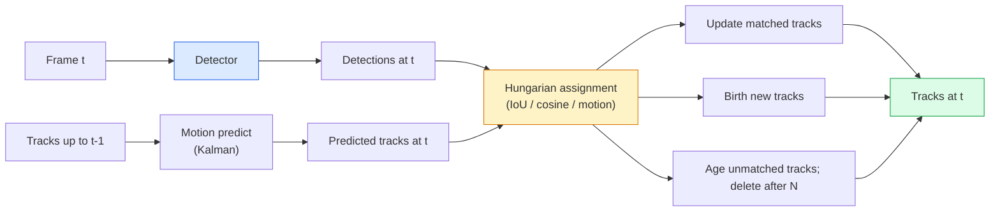

# 多目标跟踪与视频记忆

> 跟踪是检测加关联。检测每一帧。将这一帧的检测结果与上一帧的轨迹按ID匹配。

**类型：** 构建
**语言：** Python
**前置要求：** 第4阶段第06课（YOLO检测），第4阶段第08课（Mask R-CNN），第4阶段第24课（SAM 3）
**时间：** 约60分钟

## 学习目标

- 区分基于检测的跟踪与基于查询的跟踪，并列举算法系列（SORT、DeepSORT、ByteTrack、BoT-SORT、SAM 2记忆跟踪器、SAM 3.1 Object Multiplex）
- 从头实现IoU+匈牙利算法用于经典基于检测的跟踪
- 解释SAM 2的记忆库，以及它为何比基于IoU的关联更好地处理遮挡
- 解读三个跟踪指标（MOTA、IDF1、HOTA），并根据给定的用例选择最合适的指标

## 问题

检测器告诉你单个帧中物体的位置。跟踪器告诉你帧`t`中的哪个检测与帧`t-1`中的检测是同一个物体。没有它，你就无法统计穿越一条线的物体数量、跟踪一个球穿过遮挡，或知道“4号车已在车道内行驶了8秒”。

跟踪对于每个面向视频的产品都至关重要：体育分析、监控、自动驾驶、医疗视频分析、野生动物监测、文字商标计数。核心构建模块是共通的：一个逐帧检测器、一个运动模型（卡尔曼滤波器或更复杂的模型）、一个关联步骤（基于IoU/余弦/学习特征的匈牙利算法），以及轨迹生命周期（诞生、更新、消亡）。

2026年带来了两种新模式：**基于SAM 2记忆的跟踪**（特征记忆代替运动模型关联）和**SAM 3.1 Object Multiplex**（同一概念的多个实例共享记忆）。本课首先讲解经典技术栈，然后介绍基于记忆的方法。

## 核心概念

### 基于检测的跟踪



你在2026年会遇到的每个跟踪器都是这个循环的变体。不同之处在于：

- **SORT**（2016）：卡尔曼滤波器 + IoU匈牙利算法。简单、快速、无外观模型。
- **DeepSORT**（2017）：SORT + 每个轨迹基于CNN的外观特征（ReID嵌入）。更好地处理交叉。
- **ByteTrack**（2021）：将低置信度检测作为第二阶段进行关联；不需要外观特征但在MOT17上性能领先。
- **BoT-SORT**（2022）：Byte + 相机运动补偿 + ReID。
- **StrongSORT / OC-SORT** — ByteTrack的衍生版本，具有更好的运动和外观。

### 卡尔曼滤波器的单段简介

卡尔曼滤波器维护每个轨迹的状态`(x, y, w, h, dx, dy, dw, dh)`及其协方差。在每一帧，使用恒速模型**预测**状态，然后用匹配的检测结果**更新**。当预测不确定性高时，更新更信任检测结果。这提供了平滑的轨迹，并能够在短时遮挡（1-5帧）期间继续跟踪。

每个经典跟踪器在运动预测步骤中都使用卡尔曼滤波器。

### 匈牙利算法

给定一个`M x N`代价矩阵（轨迹×检测），找到最小化总成本的一对一分配。代价通常是`1 - IoU(track_bbox, detection_bbox)`或外观特征的负余弦相似度。运行复杂度为O((M+N)^3)；当M、N最多约1000时，通过`scipy.optimize.linear_sum_assignment`在Python中足够快。

### ByteTrack的关键思想

标准跟踪器会丢弃低置信度检测（<0.5）。ByteTrack将它们保留为**第二阶段候选**：在将轨迹与高置信度检测匹配后，未匹配的轨迹尝试与低置信度检测匹配，使用稍宽松的IoU阈值。这恢复了短时遮挡，减少了拥挤场景中的ID切换。

### 基于SAM 2记忆的跟踪

SAM 2通过维护每个实例的时空特征**记忆库**来处理视频。给定一帧上的提示（点击、框、文本），它将实例编码到记忆中。在后续帧中，记忆与新帧的特征进行交叉注意力计算，解码器为新帧中的同一实例生成掩码。

没有卡尔曼滤波器，没有匈牙利分配。关联隐含在记忆注意力操作中。

优点：
- 对大面积遮挡鲁棒（记忆在多个帧中携带实例身份）。
- 结合SAM 3的文本提示时支持开放词汇。
- 无需单独的运动模型即可工作。

缺点：
- 对于多物体跟踪，比ByteTrack慢。
- 记忆库增长，限制了上下文窗口。

### SAM 3.1 Object Multiplex

之前的SAM 2 / SAM 3跟踪为每个实例维护独立的记忆库。对于50个物体，有50个记忆库。Object Multiplex（2026年3月）将它们合并为一个共享记忆，带有**每个实例的查询令牌**。成本随实例数量次线性增长。

Multiplex是2026年人群跟踪的新默认选择：音乐会人群、仓库工人、交通路口。

### 需要了解的三个指标

- **MOTA（多目标跟踪准确度）** — 1 - (FN + FP + ID切换) / GT。按错误类型加权；一个综合了检测和关联失败的单一指标。
- **IDF1（ID F1值）** — ID精确率和召回率的调和平均数。专门关注每个真实轨迹随时间保持其ID的程度。对于ID切换敏感的任务优于MOTA。
- **HOTA（高阶跟踪准确度）** — 分解为检测准确度（DetA）和关联准确度（AssA）。自2020年以来的社区标准；最全面。

对于监控（谁是谁）：报告IDF1。对于体育分析（传球计数）：HOTA。对于一般学术比较：HOTA。

## 动手构建

### 步骤1：基于IoU的代价矩阵

```python
import numpy as np


def bbox_iou(a, b):
    """
    a, b: (N, 4) arrays of [x1, y1, x2, y2].
    Returns (N_a, N_b) IoU matrix.
    """
    ax1, ay1, ax2, ay2 = a[:, 0], a[:, 1], a[:, 2], a[:, 3]
    bx1, by1, bx2, by2 = b[:, 0], b[:, 1], b[:, 2], b[:, 3]
    inter_x1 = np.maximum(ax1[:, None], bx1[None, :])
    inter_y1 = np.maximum(ay1[:, None], by1[None, :])
    inter_x2 = np.minimum(ax2[:, None], bx2[None, :])
    inter_y2 = np.minimum(ay2[:, None], by2[None, :])
    inter = np.clip(inter_x2 - inter_x1, 0, None) * np.clip(inter_y2 - inter_y1, 0, None)
    area_a = (ax2 - ax1) * (ay2 - ay1)
    area_b = (bx2 - bx1) * (by2 - by1)
    union = area_a[:, None] + area_b[None, :] - inter
    return inter / np.clip(union, 1e-8, None)
```

### 步骤2：最小SORT风格跟踪器

为简洁起见，省略了固定的恒速卡尔曼滤波器——这里我们使用简单的IoU关联；在生产中，卡尔曼预测是必不可少的。`sort` Python包提供了完整版本。

```python
from scipy.optimize import linear_sum_assignment


class Track:
    def __init__(self, tid, bbox, frame):
        self.id = tid
        self.bbox = bbox
        self.last_frame = frame
        self.hits = 1

    def update(self, bbox, frame):
        self.bbox = bbox
        self.last_frame = frame
        self.hits += 1


class SimpleTracker:
    def __init__(self, iou_threshold=0.3, max_age=5):
        self.tracks = []
        self.next_id = 1
        self.iou_threshold = iou_threshold
        self.max_age = max_age

    def step(self, detections, frame):
        if not self.tracks:
            for d in detections:
                self.tracks.append(Track(self.next_id, d, frame))
                self.next_id += 1
            return [(t.id, t.bbox) for t in self.tracks]

        track_boxes = np.array([t.bbox for t in self.tracks])
        det_boxes = np.array(detections) if len(detections) else np.empty((0, 4))

        iou = bbox_iou(track_boxes, det_boxes) if len(det_boxes) else np.zeros((len(track_boxes), 0))
        cost = 1 - iou
        cost[iou < self.iou_threshold] = 1e6

        matched_track = set()
        matched_det = set()
        if cost.size > 0:
            row, col = linear_sum_assignment(cost)
            for r, c in zip(row, col):
                if cost[r, c] < 1.0:
                    self.tracks[r].update(det_boxes[c], frame)
                    matched_track.add(r); matched_det.add(c)

        for i, d in enumerate(det_boxes):
            if i not in matched_det:
                self.tracks.append(Track(self.next_id, d, frame))
                self.next_id += 1

        self.tracks = [t for t in self.tracks if frame - t.last_frame <= self.max_age]
        return [(t.id, t.bbox) for t in self.tracks]
```

60行。输入逐帧检测结果，返回逐帧轨迹ID。真实系统会添加卡尔曼预测、ByteTrack的第二阶段重新匹配以及外观特征。

### 步骤3：合成轨迹测试

```python
def synthetic_frames(num_frames=20, num_objects=3, H=240, W=320, seed=0):
    rng = np.random.default_rng(seed)
    starts = rng.uniform(20, 200, size=(num_objects, 2))
    velocities = rng.uniform(-5, 5, size=(num_objects, 2))
    frames = []
    for f in range(num_frames):
        dets = []
        for i in range(num_objects):
            cx, cy = starts[i] + f * velocities[i]
            dets.append([cx - 10, cy - 10, cx + 10, cy + 10])
        frames.append(dets)
    return frames


tracker = SimpleTracker()
for f, dets in enumerate(synthetic_frames()):
    tracks = tracker.step(dets, f)
```

三个沿直线移动的物体应在所有20帧中保持其ID。

### 步骤4：ID切换指标

```python
def count_id_switches(tracks_per_frame, gt_per_frame):
    """
    tracks_per_frame:  list of list of (track_id, bbox)
    gt_per_frame:      list of list of (gt_id, bbox)
    Returns number of ID switches.
    """
    prev_assignment = {}
    switches = 0
    for tracks, gts in zip(tracks_per_frame, gt_per_frame):
        if not tracks or not gts:
            continue
        t_boxes = np.array([b for _, b in tracks])
        g_boxes = np.array([b for _, b in gts])
        iou = bbox_iou(g_boxes, t_boxes)
        for g_idx, (gt_id, _) in enumerate(gts):
            j = iou[g_idx].argmax()
            if iou[g_idx, j] > 0.5:
                t_id = tracks[j][0]
                if gt_id in prev_assignment and prev_assignment[gt_id] != t_id:
                    switches += 1
                prev_assignment[gt_id] = t_id
    return switches
```

这是一个简化的IDF1邻近指标：统计一个真实对象改变其分配到的预测轨迹ID的次数。真实的MOTA/IDF1/HOTA工具位于`py-motmetrics`和`TrackEval`中。

## 使用它

2026年的生产级跟踪器：

- `ultralytics` — 内置YOLOv8 + ByteTrack / BoT-SORT。`results = model.track(source, tracker="bytetrack.yaml")`。默认选项。
- `ultralytics` (Roboflow) — ByteTrack包装器加标注工具。
- SAM 2 / SAM 3.1 — 通过`ultralytics`进行基于记忆的跟踪。
- 自定义栈：检测器 (YOLOv8 / RT-DETR) + `ultralytics` / `results = model.track(source, tracker="bytetrack.yaml")` / `supervision`。

选择指南：

- 行人/汽车/箱子，30+帧/秒：**使用ultralytics的ByteTrack**。
- 人群中同一类的多个实例：**SAM 3.1对象多路复用**。
- 严重遮挡且外观可识别：**DeepSORT / StrongSORT**（ReID特征）。
- 体育/复杂交互：**BoT-SORT**或学习型跟踪器（MOTRv3）。

## 发布

本課(lesson)产出：

- `outputs/prompt-tracker-picker.md` — 根据场景类型、遮挡模式和延迟预算选择SORT / ByteTrack / BoT-SORT / SAM 2 / SAM 3.1。
- `outputs/prompt-tracker-picker.md` — 编写针对真实轨迹的MOTA / IDF1 / HOTA的完整评估框架。

## 练习

1. **（简单）** 运行上述合成跟踪器，分别有3、10和30个对象。报告每种情况下的ID切换次数。确定简单的仅IoU关联开始失败的位置。
2. **（中等）** 在关联之前添加一个恒速卡尔曼预测步骤。证明短时（2-3帧）遮挡不再导致ID切换。
3. **（困难）** 将SAM 2基于记忆的跟踪器（通过`transformers`）作为替代跟踪后端集成。在30秒的人群片段上同时运行SimpleTracker和SAM 2，比较ID切换次数，并为5个显著人物手动标注真实ID。

## 关键术语

|  术语  |  人们的说法  |  实际含义  |
|------|----------------|----------------------|
|  基于检测的跟踪  |  "先检测后关联"  |  逐帧检测器 + 基于IoU/外观的匈牙利分配  |
|  卡尔曼滤波器  |  "运动预测"  |  线性动力学+协方差，用于平滑轨迹预测和遮挡处理  |
|  匈牙利算法  |  "最优分配"  |  解决最小成本二分匹配问题；`scipy.optimize.linear_sum_assignment`  |
|  ByteTrack  |  "低置信度第二轮"  |  将未匹配的轨迹与低置信度检测重新匹配，以恢复短时遮挡  |
|  DeepSORT  |  "SORT+外观"  |  添加ReID特征用于跨帧匹配；更有利于ID保持  |
|  记忆库  |  "SAM 2技巧"  |  存储跨帧的每个实例时空特征；交叉注意力替代显式关联  |
|  对象多路复用  |  "SAM 3.1共享记忆"  |  单个共享记忆，每个实例查询，用于快速多对象跟踪  |
|  HOTA  |  "现代跟踪指标"  |  分解为检测精度和关联精度；社区标准  |

## 延伸阅读

- [SORT (Bewley et al., 2016)](https://arxiv.org/abs/1602.00763) — 最小的基于检测的跟踪论文
- [SORT (Bewley et al., 2016)](https://arxiv.org/abs/1602.00763) — 添加外观特征
- [SORT (Bewley et al., 2016)](https://arxiv.org/abs/1602.00763) — 低置信度第二轮
- [SORT (Bewley et al., 2016)](https://arxiv.org/abs/1602.00763) — 相机运动补偿
- [SORT (Bewley et al., 2016)](https://arxiv.org/abs/1602.00763) — 分解跟踪指标
- [SORT (Bewley et al., 2016)](https://arxiv.org/abs/1602.00763) — 基于记忆的跟踪器
- [SORT (Bewley et al., 2016)](https://arxiv.org/abs/1602.00763)
