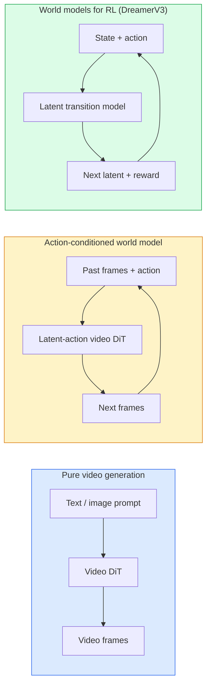

# 世界模型与视频扩散(World Models & Video Diffusion)

> 一个能够预测场景未来几秒的视频模型就是一个世界模拟器。将该预测条件限定在动作上，你就得到了一个可学习的游戏引擎。

**类型：** 学习+构建
**语言：** Python
**前置知识：** 第四阶段第10课(扩散模型(Diffusion))、第四阶段第12课(视频理解(Video Understanding))、第四阶段第23课(DiT+整流流(Rectified Flow))
**时间：** 约75分钟

## 学习目标

- 解释纯视频生成模型(Sora 2)与动作条件世界模型(Genie 3、DreamerV3)之间的区别
- 描述视频DiT：时空块(Spatio-temporal patches)、三维位置编码(3D position encoding)、(T, H, W)令牌间的联合注意力(Joint attention)
- 追溯世界模型如何接入机器人技术：视觉语言模型(VLM)规划→视频模型模拟→逆动力学(Inverse dynamics)输出动作
- 针对给定用例(创意视频、交互式模拟、自动驾驶合成)在Sora 2、Genie 3、Runway GWM-1 Worlds、Wan-Video和HunyuanVideo之间进行选择

## 问题

视频生成与世界建模在2026年趋于融合。一个能够生成连贯一分钟视频的模型，在某种意义上已经学会了世界如何运动：物体恒存性(Object permanence)、重力、因果关系、风格。如果你将该预测条件限定在动作上(向左走、开门)，那么视频模型就变成了一个可学习的模拟器，可以替代游戏引擎、驾驶模拟器或机器人环境。

其重要性是具体的。Genie 3可以从单张图像生成可玩的游戏环境。Runway GWM-1 Worlds合成无限可探索的场景。Sora 2生成带有同步音频和建模物理的长达一分钟的视频。NVIDIA Cosmos-Drive、Wayve Gaia-2和Tesla DrivingWorld生成逼真的驾驶视频，用于自动驾驶车辆训练数据。世界模型范式正在悄然接管机器人领域的仿真到现实(Sim-to-real)。

本课是第四阶段的“宏观”课程。它将图像生成、视频理解和智能体推理(Agentic reasoning)连接成主导研究正在转向的架构模式。

## 核心概念

### 世界建模的三个家族



- **Sora 2** 是纯文本条件视频生成。没有动作接口。你无法在生成过程中“引导”它。
- **Genie 3**、**GWM-1 Worlds**、**Mirage/Magica** 是动作条件世界模型。从观察到的视频中推断潜在动作(Latent actions)，然后将未来帧预测条件限定在动作上。可交互——你按按键或移动摄像机，场景会做出响应。
- **DreamerV3** 和经典的强化学习(RL)世界模型家族在潜在空间中预测，带有显式动作条件，并在奖励信号上训练。视觉性较弱；对于样本高效的强化学习更有效。

### 视频DiT架构

```
Video latent:          (C, T, H, W)
Patchify (spatial):    grid of P_h x P_w patches per frame
Patchify (temporal):   group P_t frames into a temporal patch
Resulting tokens:      (T / P_t) * (H / P_h) * (W / P_w) tokens
```

位置编码是三维的：每个(t, h, w)坐标的旋转或可学习嵌入。注意力可以是：

- **完全联合(Full joint)**——所有令牌关注所有令牌。对于N个令牌是O(N^2)复杂度。对于长视频而言过于庞大。
- **分隔(Divided)**——交替进行时间注意力(相同空间位置，跨时间：`(H*W) * T^2`)和空间注意力(相同时间步，跨空间：`T * (H*W)^2`)。被TimeSformer和大多数视频DiT使用。
- **窗口(Window)**——在(t, h, w)中的局部窗口。被Video Swin使用。

每个2026年的视频扩散模型都使用这三种模式之一，加上自适应层归一化(AdaLN)条件(第23课)和整流流(Rectified flow)。

### 基于动作的条件化：潜在动作模型(Latent Action Models)

Genie通过判别性地预测连续两帧之间的动作，学习每帧的**潜在动作(Latent action)**。然后模型的解码器条件限定在推断出的潜在动作上——而非显式的键盘键。在推理时，用户可以指定一个潜在动作(或从新的先验中采样一个)，模型生成与该动作一致的下一帧。

Sora完全跳过了动作接口。它的解码器根据过去的时空令牌预测未来的时空令牌。提示条件限定起始；没有任何东西在生成过程中引导它。

### 物理合理性(Physical Plausibility)

Sora 2在2026年的发布明确宣传了**物理合理性**：重量、平衡、物体恒存性、因果关系。团队通过人工评分的合理性分数进行衡量；与Sora 1相比，模型在掉落物体、角色碰撞和故意失败(未跳起)方面有显著改进。

合理性仍然是主要的失败模式。2024-2025年关于人们吃意大利面或用玻璃杯喝水的视频揭示了模型缺乏持久的物体表示。2026年的模型(Sora 2、Runway Gen-5、HunyuanVideo)减少了但并未消除这些问题。

### 自动驾驶世界模型

驾驶世界模型生成条件于轨迹、边界框或导航地图的逼真道路场景。用途：

- **Cosmos-Drive-Dreams** (NVIDIA)——为强化学习训练生成数分钟的驾驶视频。
- **Gaia-2** (Wayve)——用于策略评估的轨迹条件场景合成。
- **DrivingWorld** (Tesla)——模拟不同天气、一天中的时间、交通状况。
- **Vista** (ByteDance)——反应式驾驶场景合成。

它们替代了昂贵的真实世界数据收集，用于边缘情况——行人夜间乱穿马路、结冰路口、异常车辆类型——否则需要数百万英里的驾驶数据。

### 机器人技术栈：视觉语言模型(VLM)+视频模型+逆动力学(Inverse Dynamics)

新兴的三组件机器人循环：

1. **视觉语言模型(VLM)** 解析目标("拿起红色杯子")，规划高层动作序列。
2. **视频生成模型** 模拟执行每个动作的样子——预测N帧后的观测。
3. **逆动力学模型** 提取产生这些观测的具体电机指令。

这取代了奖励塑形和样本密集的强化学习。世界模型负责想象；逆动力学闭环驱动执行。Genie Envisioner是其中一种实例；许多研究团队正在向这一结构收敛。

### 评估

- **视觉质量**——FVD(Fréchet视频距离(Fréchet Video Distance))、用户研究。
- **提示对齐(Prompt alignment)**——每帧的CLIPScore、VQA式评估。
- **物理合理性**——在基准测试套件上人工评分(Sora 2的内部基准、VBench)。
- **可控性(Controllability)**(针对交互式世界模型)——动作→观测一致性；能否回到之前的状态？

### 2026年模型概览

|  模型   |  用途   |  参数   |  输出   |  许可  |
|-------|-----|------------|--------|---------|
|  Sora 2 | 文本到视频、音频 | — | 1分钟1080p+音频 | 仅API  |
| Runway Gen-5  |  文本/图像到视频  |  —  |  10秒片段  |  API |
| Runway GWM-1 Worlds  |  交互式世界（Interactive World）  |  —  |  无限3D展开  |  API |
| Genie 3  |  从图像生成的交互式世界  |  11B+  |  可玩帧  |  研究预览（Research Preview） |
| Wan-Video 2.1  |  开放文本到视频  |  14B  |  高质量片段  |  非商业许可 |
| HunyuanVideo  |  开放文本到视频  |  13B  |  10秒片段  |  宽松许可 |
| Cosmos / Cosmos-Drive  |  自动驾驶模拟  |  7-14B  |  驾驶场景  |  NVIDIA开放 |
| Magica / Mirage 2  |  原生AI游戏引擎  |  —  |  可修改世界  |  产品 |

## 动手构建

### 第一步：视频的3D分块（3D Patchify）

```python
import torch
import torch.nn as nn


class VideoPatch3D(nn.Module):
    def __init__(self, in_channels=4, dim=64, patch_t=2, patch_h=2, patch_w=2):
        super().__init__()
        self.proj = nn.Conv3d(
            in_channels, dim,
            kernel_size=(patch_t, patch_h, patch_w),
            stride=(patch_t, patch_h, patch_w),
        )
        self.patch_t = patch_t
        self.patch_h = patch_h
        self.patch_w = patch_w

    def forward(self, x):
        # x: (N, C, T, H, W)
        x = self.proj(x)
        n, c, t, h, w = x.shape
        tokens = x.reshape(n, c, t * h * w).transpose(1, 2)
        return tokens, (t, h, w)
```

步长等于核大小的3D卷积作为时空分块器。`(T, H, W) -> (T/2, H/2, W/2)` 标记网格。

### 第二步：3D旋转位置编码

旋转位置嵌入（Rotary Position Embeddings, RoPE）分别沿`t`、`h`、`w`轴应用：

```python
def rope_3d(tokens, t_dim, h_dim, w_dim, grid):
    """
    tokens: (N, T*H*W, D)
    grid: (T, H, W) sizes
    t_dim + h_dim + w_dim == D
    """
    T, H, W = grid
    n, seq, d = tokens.shape
    if t_dim + h_dim + w_dim != d:
        raise ValueError(f"t_dim+h_dim+w_dim ({t_dim}+{h_dim}+{w_dim}) must equal D={d}")
    assert seq == T * H * W
    t_idx = torch.arange(T, device=tokens.device).repeat_interleave(H * W)
    h_idx = torch.arange(H, device=tokens.device).repeat_interleave(W).repeat(T)
    w_idx = torch.arange(W, device=tokens.device).repeat(T * H)
    # Simplified: just scale channels by frequencies. Real RoPE rotates pairs.
    freqs_t = torch.exp(-torch.log(torch.tensor(10000.0)) * torch.arange(t_dim // 2, device=tokens.device) / (t_dim // 2))
    freqs_h = torch.exp(-torch.log(torch.tensor(10000.0)) * torch.arange(h_dim // 2, device=tokens.device) / (h_dim // 2))
    freqs_w = torch.exp(-torch.log(torch.tensor(10000.0)) * torch.arange(w_dim // 2, device=tokens.device) / (w_dim // 2))
    emb_t = torch.cat([torch.sin(t_idx[:, None] * freqs_t), torch.cos(t_idx[:, None] * freqs_t)], dim=-1)
    emb_h = torch.cat([torch.sin(h_idx[:, None] * freqs_h), torch.cos(h_idx[:, None] * freqs_h)], dim=-1)
    emb_w = torch.cat([torch.sin(w_idx[:, None] * freqs_w), torch.cos(w_idx[:, None] * freqs_w)], dim=-1)
    return tokens + torch.cat([emb_t, emb_h, emb_w], dim=-1)
```

简化加法形式。实际RoPE以不同频率旋转成对通道；位置信息相同。

### 第三步：分离注意力块（Divided Attention Block）

```python
class DividedAttentionBlock(nn.Module):
    def __init__(self, dim=64, heads=2):
        super().__init__()
        self.time_attn = nn.MultiheadAttention(dim, heads, batch_first=True)
        self.space_attn = nn.MultiheadAttention(dim, heads, batch_first=True)
        self.ln1 = nn.LayerNorm(dim)
        self.ln2 = nn.LayerNorm(dim)
        self.ln3 = nn.LayerNorm(dim)
        self.mlp = nn.Sequential(nn.Linear(dim, 4 * dim), nn.GELU(), nn.Linear(4 * dim, dim))

    def forward(self, x, grid):
        T, H, W = grid
        n, seq, d = x.shape
        # time attention: same (h, w), across t
        xt = x.view(n, T, H * W, d).permute(0, 2, 1, 3).reshape(n * H * W, T, d)
        a, _ = self.time_attn(self.ln1(xt), self.ln1(xt), self.ln1(xt), need_weights=False)
        xt = (xt + a).reshape(n, H * W, T, d).permute(0, 2, 1, 3).reshape(n, seq, d)
        # space attention: same t, across (h, w)
        xs = xt.view(n, T, H * W, d).reshape(n * T, H * W, d)
        a, _ = self.space_attn(self.ln2(xs), self.ln2(xs), self.ln2(xs), need_weights=False)
        xs = (xs + a).reshape(n, T, H * W, d).reshape(n, seq, d)
        xs = xs + self.mlp(self.ln3(xs))
        return xs
```

时间注意力在每个空间位置内跨时间进行注意力操作；空间注意力在每个帧内跨位置进行注意力操作。两个O(T^2 + (HW)^2)操作替代一个O((THW)^2)操作。这是TimeSformer和所有现代视频DiT（Video Diffusion Transformer）的核心。

### 第四步：组合一个小型视频DiT

```python
class TinyVideoDiT(nn.Module):
    def __init__(self, in_channels=4, dim=64, depth=2, heads=2):
        super().__init__()
        self.patch = VideoPatch3D(in_channels=in_channels, dim=dim, patch_t=2, patch_h=2, patch_w=2)
        self.blocks = nn.ModuleList([DividedAttentionBlock(dim, heads) for _ in range(depth)])
        self.out = nn.Linear(dim, in_channels * 2 * 2 * 2)

    def forward(self, x):
        tokens, grid = self.patch(x)
        for blk in self.blocks:
            tokens = blk(tokens, grid)
        return self.out(tokens), grid
```

不是可运行的视频生成器；而是一个结构演示，确保每个组件形状正确。

### 第五步：检查形状

```python
vid = torch.randn(1, 4, 8, 16, 16)  # (N, C, T, H, W)
model = TinyVideoDiT()
out, grid = model(vid)
print(f"input  {tuple(vid.shape)}")
print(f"tokens grid {grid}")
print(f"output {tuple(out.shape)}")
```

分块后期望得到`grid = (4, 8, 8)`和`out = (1, 256, 32)`；然后头部将每个标记投影到时空分块，准备逆分块回视频。

## 使用它

2026年的生产访问模式：

- **Sora 2 API**（OpenAI）— 文本到视频，同步音频。高级定价。
- **Runway Gen-5 / GWM-1**（Runway）— 图像到视频，交互式世界。
- **Wan-Video 2.1 / HunyuanVideo** — 开源自托管。
- **Cosmos / Cosmos-Drive**（NVIDIA）— 驾驶模拟开放权重。
- **Genie 3** — 研究预览，需请求访问。

对于构建交互式世界模型演示：从Wan-Video开始保证质量，叠加潜在动作适配器实现交互。对于自动驾驶模拟：Cosmos-Drive是2026年的开放参考。

对于机器人学，实际部署的堆栈：

1. 语言目标 -> VLM（Qwen3-VL）-> 高层规划。
2. 规划 -> 潜在动作视频模型 -> 想象展开。
3. 展开 -> 逆动力学模型 -> 底层动作。
4. 执行动作 -> 观察反馈到第一步。

## 发布

本課(lesson)产出：

- `outputs/prompt-video-model-picker.md` — 根据任务、许可证和延迟在Sora 2 / Runway / Wan / HunyuanVideo / Cosmos之间选择。
- `outputs/prompt-video-model-picker.md` — 一种技能，定义自动检查（物体恒存性、重力、连续性），在发布前对任何生成的视频运行。

## 练习

1. **(简单)** 计算一个5秒360p视频在patch-t=2, patch-h=8, patch-w=8下的标记数。分析此规模下注意力的内存需求。
2. **(中等)** 将上述分离注意力块替换为完整的联合注意力块，并测量形状和参数数量。解释为什么分离注意力对真实视频模型是必要的。
3. **(困难)** 构建一个最小的潜在动作视频模型：使用（帧_t, 动作_t, 帧_{t+1}）三元组数据集（任何简单2D游戏），训练一个以动作嵌入为条件的小型视频DiT，并展示不同动作产生不同的下一帧。

## 关键术语

|  术语  |  人们的说法  |  实际含义  |
|------|----------------|----------------------|
|  世界模型  |  “学习到的模拟器”  |  给定状态和动作预测未来观测的模型 |
|  视频DiT  |  “时空变换器”  |  具有3D分块和分离注意力的扩散变换器 |
|  潜在动作（Latent Action）  |  “推断控制”  |  从帧对推断的离散或连续动作潜在表示；用于条件化下一帧生成 |
|  分离注意力（Divided Attention）  |  “先时间后空间”  |  每个块两个注意力操作——先跨时间再跨空间——使O(N^2)可控 |
|  物体恒存性（Object Permanence）  |  “事物保持真实”  |  视频模型必须学习的场景属性；在食物、玻璃器皿上的经典失败模式 |
|  FVD  |  "弗雷歇视频距离"  |  FID的视频等效度量；主要视觉质量指标  |
|  逆动力学模型  |  "从观测到动作"  |  给定(状态, 下一状态)，输出连接它们的动作；闭合机器人回路  |
|  Cosmos-Drive  |  "NVIDIA驾驶模拟"  |  开放权重的自动驾驶世界模型，用于强化学习和评估  |

## 延伸阅读

- [Sora technical report (OpenAI)](https://openai.com/index/video-generation-models-as-world-simulators/)
- [Sora technical report (OpenAI)](https://openai.com/index/video-generation-models-as-world-simulators/) — 潜在动作世界模型
- [Sora technical report (OpenAI)](https://openai.com/index/video-generation-models-as-world-simulators/) — 视频Transformer的分割注意力
- [Sora technical report (OpenAI)](https://openai.com/index/video-generation-models-as-world-simulators/) — 用于强化学习的世界模型
- [Sora technical report (OpenAI)](https://openai.com/index/video-generation-models-as-world-simulators/) — 驾驶世界模型
- [Sora technical report (OpenAI)](https://openai.com/index/video-generation-models-as-world-simulators/)
- [Sora technical report (OpenAI)](https://openai.com/index/video-generation-models-as-world-simulators/)
