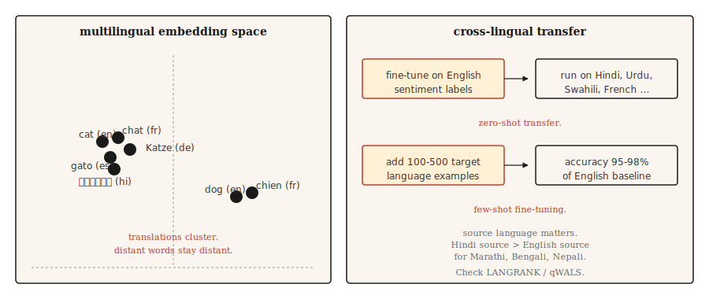

# 多语言自然语言处理

> 一个模型，100多种语言，其中大多数语言无需训练数据。跨语言迁移是2020年代实用的奇迹。

**类型：** 学习
**语言：** Python
**前提条件：** 阶段5 · 04 (GloVe, FastText, 子词), 阶段5 · 11 (机器翻译)
**时间：** ~45分钟

## 问题

英语有数十亿的标注样本。乌尔都语有数千。迈蒂利语几乎没有。任何服务于全球用户的实用NLP系统都必须处理那些没有任务特定训练数据的语言的长尾。

多语言模型通过同时在多种语言上训练一个模型来解决这个问题。共享表示使模型能够将在高资源语言中学到的技能迁移到低资源语言。在英文情感分析上微调模型，它就能在乌尔都语上开箱即用地产生令人惊讶的良好情感预测。这就是零样本跨语言迁移，它重塑了NLP走向世界的方式。

本课指出了权衡、经典模型以及让刚接触多语言工作的团队绊倒的一个决策：选择迁移的源语言。

## 核心概念



**共享词汇。** 多语言模型使用在所有目标语言文本上训练的 SentencePiece 或 WordPiece 分词器。词汇是共享的：相同的子词单元在相关语言中表示相同的词素。英语和意大利语中的 `anti-` 获得相同的token。

**共享表示。** 在多种语言上通过掩码语言建模预训练的transformer学习到，不同语言中语义相似的句子会产生相似的隐藏状态。mBERT、XLM-R和NLLB都表现出这一点。英文中"cat"的嵌入与法文"chat"和西班牙文"gato"的嵌入聚类在一起，完整句子的嵌入也是如此。

**零样本迁移。** 在一种语言（通常是英语）的标注数据上微调模型。推理时，在任何该模型支持的其他语言上运行。不需要目标语言的标签。对于类型学上相关的语言结果很强，对于遥远的语言结果较弱。

**少样本微调。** 添加100-500个目标语言的标注样本。分类任务上的准确率跃升至英语基线的95-98%。这是多语言NLP中性价比最高的杠杆。

## 模型

|  模型  |  年份  |  覆盖范围  |  备注  |
|-------|------|----------|-------|
|  mBERT  |  2018  |  104种语言  |  在维基百科上训练。第一个实用的多语言语言模型。在低资源语言上表现弱。  |
|  XLM-R  |  2019  |  100种语言  |  在CommonCrawl（比维基百科大得多）上训练。设定了跨语言基线。Base 270M，Large 550M。  |
|  XLM-V  |  2023  |  100种语言  |  具有100万token词汇（对比25万）的XLM-R。在低资源语言上更好。  |
|  mT5  |  2020  |  101种语言  |  用于多语言生成的T5架构。  |
|  NLLB-200  |  2022  |  200种语言  |  Meta的翻译模型；包含55种低资源语言。  |
|  BLOOM  |  2022  |  46种语言 + 13种编程语言  |  开放的多语言训练的176B LLM。  |
|  Aya-23  |  2024  |  23种语言  |  Cohere的多语言LLM。在阿拉伯语、印地语、斯瓦希里语上表现强。  |

根据用例选择。分类任务使用XLM-R-base作为明智的默认选择效果很好。生成任务需要mT5或NLLB，取决于翻译与开放生成。LLM风格的工作与Aya-23或Claude配合，使用显式的多语言提示。

## 源语言决策（2026年研究）

大多数团队默认使用英语作为微调源。最近的研究（2026）表明这通常是错误的。

语言相似度比原始语料库大小更能预测迁移质量。对于斯拉夫语目标，德语或俄语通常胜过英语。对于印度语目标，印地语通常胜过英语。**qWALS**相似度度量（2026，基于《世界语言结构地图集》特征）对此进行了量化。**LANGRANK**（Lin等人，ACL 2019）是一种独立的、更早的方法，它通过语言相似度、语料库大小和遗传相关性的组合对候选源语言进行排名。

实用规则：如果你的目标语言有一个类型学上接近的高资源亲属语言，先尝试在该语言上微调，然后与英语微调进行比较。

## 动手构建

### 步骤1：零样本跨语言分类

```python
from transformers import AutoTokenizer, AutoModelForSequenceClassification
import torch

tok = AutoTokenizer.from_pretrained("joeddav/xlm-roberta-large-xnli")
model = AutoModelForSequenceClassification.from_pretrained("joeddav/xlm-roberta-large-xnli")


def classify(text, candidate_labels, hypothesis_template="This text is about {}."):
    scores = {}
    for label in candidate_labels:
        hypothesis = hypothesis_template.format(label)
        inputs = tok(text, hypothesis, return_tensors="pt", truncation=True)
        with torch.no_grad():
            logits = model(**inputs).logits[0]
        entail_score = torch.softmax(logits, dim=-1)[2].item()
        scores[label] = entail_score
    return dict(sorted(scores.items(), key=lambda x: -x[1]))


print(classify("I love this product!", ["positive", "negative", "neutral"]))
print(classify("मुझे यह उत्पाद पसंद है!", ["positive", "negative", "neutral"]))
print(classify("J'adore ce produit !", ["positive", "negative", "neutral"]))
```

一个模型，三种语言，相同的API。在NLI数据上训练的XLM-R通过蕴含技巧很好地迁移到分类。

### 步骤2：多语言嵌入空间

```python
from sentence_transformers import SentenceTransformer
import numpy as np

model = SentenceTransformer("sentence-transformers/paraphrase-multilingual-MiniLM-L12-v2")

pairs = [
    ("The cat is sleeping.", "Le chat dort."),
    ("The cat is sleeping.", "El gato está durmiendo."),
    ("The cat is sleeping.", "Die Katze schläft."),
    ("The cat is sleeping.", "The dog is barking."),
]

for eng, other in pairs:
    emb_eng = model.encode([eng], normalize_embeddings=True)[0]
    emb_other = model.encode([other], normalize_embeddings=True)[0]
    sim = float(np.dot(emb_eng, emb_other))
    print(f"  {eng!r} <-> {other!r}: cos={sim:.3f}")
```

翻译后的句子在嵌入空间中距离很近。不同的英文句子则距离较远。这就是跨语言检索、聚类和相似性工作的原理。

### 步骤3：少样本微调策略

```python
from transformers import TrainingArguments, Trainer
from datasets import Dataset


def few_shot_finetune(base_model, base_tokenizer, examples):
    ds = Dataset.from_list(examples)

    def tokenize_fn(ex):
        out = base_tokenizer(ex["text"], truncation=True, max_length=128)
        out["labels"] = ex["label"]
        return out

    ds = ds.map(tokenize_fn)
    args = TrainingArguments(
        output_dir="out",
        per_device_train_batch_size=8,
        num_train_epochs=5,
        learning_rate=2e-5,
        save_strategy="no",
    )
    trainer = Trainer(model=base_model, args=args, train_dataset=ds)
    trainer.train()
    return base_model
```

对于100-500个目标语言样本，`num_train_epochs=5`和`learning_rate=2e-5`是安全的默认值。更高的学习率会导致多语言对齐崩溃，从而得到一个仅英语模型。

## 真正有效的评估

- **逐个语言在预留集上的准确率。** 不做聚合。聚合会掩盖长尾问题。
- **与单语言基线进行基准测试。** 对于数据充足的语言，从头开始训练的单语言模型有时优于多语言模型。请测试。
- **实体级测试。** 目标语言中的命名实体。多语言模型对于远离拉丁字母的脚本通常分词能力较弱。
- **跨语言一致性。** 两种语言中相同含义应产生相同预测。测量差距。

## 使用它

2026年技术栈：

|  任务  |  推荐方案  |
|-----|-------------|
|  分类，100种语言  |  微调的XLM-R-base（~270M）  |
|  零样本文本分类  |  `joeddav/xlm-roberta-large-xnli`  |
|  多语言句子嵌入  |  `sentence-transformers/paraphrase-multilingual-MiniLM-L12-v2`  |
|  翻译，200种语言  |  `facebook/nllb-200-distilled-600M`（见第11课）  |
|  生成式多语言  |  Claude, GPT-4, Aya-23, mT5-XXL  |
|  低资源语言NLP  |  XLM-V或基于相关高资源语言的领域特定微调  |

如果性能重要，始终为目标语言微调预算。零样本是起点，而非最终答案。

### 分词代价（低资源语言出什么问题）

多语言模型在所有语言间共享一个分词器。该词汇表是在以英语、法语、西班牙语、中文、德语为主的语料上训练的。对于主导集合之外的任何语言，三种代价悄然叠加：

- **生育代价。** 低资源语言文本每个词的分词数远多于英语。一个印地语句子可能需要等效英语句子的3-5倍token。这3-5倍的代价消耗了你的上下文窗口、训练效率和延迟。
- **变体恢复代价。** 每个拼写错误、变音符号变体、Unicode标准化不匹配或大小写变化都会成为嵌入空间中冷启动的无关序列。模型无法学习母语者认为显而易见的正字法对应关系。
- **容量溢出代价。** 代价1和2消耗了上下文位置、层深度和嵌入维度。留给实际推理的空间系统性地小于高资源语言从同一模型获得的空间。

实际症状：你的模型在印地语上正常训练，损失曲线看似正确，评估困惑度看似合理，但生产输出却微妙地错误。形态学在句子中间崩溃。罕见屈折形式仍无法恢复。**无法通过增加数据量来修复破损的分词器。**

缓解措施：选择对目标语言覆盖良好的分词器（XLM-V的100万token词汇表是直接修复）；在训练前在预留的目标文本上验证分词生育率；使用字节级回退（SentencePiece `byte_fallback=True`，GPT-2风格的字节级BPE）处理真正长尾的脚本，确保永远不会出现未登录词。

## 发布

保存为 `outputs/skill-multilingual-picker.md`：

```markdown
---
name: multilingual-picker
description: Pick source language, target model, and evaluation plan for a multilingual NLP task.
version: 1.0.0
phase: 5
lesson: 18
tags: [nlp, multilingual, cross-lingual]
---

Given requirements (target languages, task type, available labeled data per language), output:

1. Source language for fine-tuning. Default English; check LANGRANK or qWALS if target language has a typologically close high-resource language.
2. Base model. XLM-R (classification), mT5 (generation), NLLB (translation), Aya-23 (generative LLM).
3. Few-shot budget. Start with 100-500 target-language examples if available. Zero-shot only if labeling is infeasible.
4. Evaluation plan. Per-language accuracy (not aggregate), cross-lingual consistency, entity-level F1 on non-Latin scripts.

Refuse to ship a multilingual model without per-language evaluation — aggregate metrics hide long-tail failures. Flag scripts with low tokenization coverage (Amharic, Tigrinya, many African languages) as needing a model with byte-fallback (SentencePiece with byte_fallback=True, or byte-level tokenizer like GPT-2).
```

## 练习

1. **简单。** 在英语、法语、印地语和阿拉伯语上，对每种语言10个句子运行零样本分类流程。报告每种语言的准确率。你会看到法语强，印地语一般，阿拉伯语波动。
2. **中等。** 使用`paraphrase-multilingual-MiniLM-L12-v2`构建一个跨语言检索器，基于小型混合语言语料库。用英语查询，检索任意语言的文档。测量召回率@5。
3. **困难。** 比较英语源和印地语源微调在印地语分类任务上的表现。在两种方案下使用500个目标语言示例进行少样本微调。报告哪种源产生更好的印地语准确率及其差距。这是LANGRANK论文的缩影。

## 关键术语

|  术语  |  人们的说法  |  实际含义  |
|------|-----------------|-----------------------|
|  多语言模型  |  一个模型，多种语言  |  跨语言共享词汇和参数。  |
|  跨语言迁移  |  用一种语言训练，在另一种语言上运行  |  在源语言上微调，在目标语言上评估，无需目标语言标签。  |
|  零样本  |  无目标语言标签  |  无需在目标语言上微调即可迁移。  |
|  少样本  |  少量目标标签  |  使用100-500个目标语言示例进行微调。  |
|  mBERT  |  首个多语言LM  |  在维基百科上预训练的104语言BERT。  |
|  XLM-R  |  标准跨语言基线  |  在CommonCrawl上预训练的100语言RoBERTa。  |
|  NLLB  |  元（Meta）的200语言机器翻译  |  不落下任何语言。包含55种低资源语言。  |

## 延伸阅读

- [Conneau et al. (2019). Unsupervised Cross-lingual Representation Learning at Scale](https://arxiv.org/abs/1911.02116) —— XLM-R论文。
- [Conneau et al. (2019). Unsupervised Cross-lingual Representation Learning at Scale](https://arxiv.org/abs/1911.02116) —— 开启跨语言迁移研究路线的分析论文。
- [Conneau et al. (2019). Unsupervised Cross-lingual Representation Learning at Scale](https://arxiv.org/abs/1911.02116) —— NLLB-200论文。
- [Conneau et al. (2019). Unsupervised Cross-lingual Representation Learning at Scale](https://arxiv.org/abs/1911.02116) —— Aya，Cohere的多语言LLM。
- [Conneau et al. (2019). Unsupervised Cross-lingual Representation Learning at Scale](https://arxiv.org/abs/1911.02116) —— qWALS / LANGRANK源语言论文。
