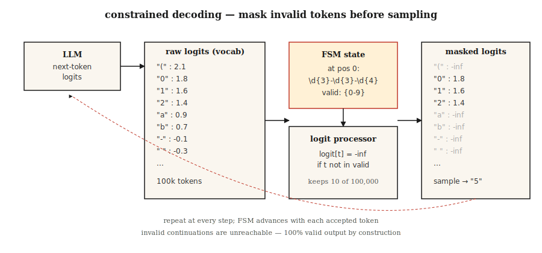

# 结构化输出与约束解码(Constrained Decoding)

> 让大语言模型输出JSON。大多数情况下能拿到JSON。但在生产环境中，“大多数”就是问题所在。约束解码通过修改采样前的logits，将“大多数”变成了“总是”。

**类型:** 构建
**语言:** Python
**前置知识:** 阶段5·17(聊天机器人)，阶段5·19(子词分词)
**时间:** ~60分钟

## 问题

一个分类器提示大语言模型：“返回{正面，负面，中性}中的一个。”模型返回“该情感为正面——此评论极其正面，因为客户明确表示他们……”。你的解析器崩溃了。你的分类器F1得分为0.0。

自由生成不是合约，而是建议。生产系统需要合约。

到了2026年，存在三层方案。

1. **提示工程(Prompting)。** 礼貌地请求。“仅返回JSON对象。”前沿模型约80%成功，较小模型效果更差。
2. **原生结构化输出API(Structured Output APIs)。** OpenAI `response_format`、Anthropic工具调用、Gemini JSON模式。在支持的架构上可靠。供应商锁定。
3. **约束解码(Constrained Decoding)。** 在每一步生成时修改logits，使模型*无法*输出无效token。通过构造保证100%有效。适用于任何本地模型。

本节课建立对所有三层的直观理解，并说明何时选择哪一层。

## 核心概念



**约束解码的工作原理。** 在每一步生成时，大语言模型在整个词汇表(~10万个token)上产生一个logit向量。一个*logit处理器*位于模型和采样器之间。它根据目标语法(JSON Schema、正则表达式、上下文无关文法)的当前位置计算哪些token有效，并将所有无效token的logits设为负无穷。对剩余logits做softmax，概率质量只分布在有效续写上。

2026年的实现方式：

- **Outlines。** 将JSON Schema或正则表达式编译成有限状态机。每个token有O(1)的下一有效token查找。基于有限状态机，因此递归模式需要展平。
- **XGrammar / llguidance。** 上下文无关文法引擎。处理递归JSON Schema。接近零解码开销。OpenAI在其2025年结构化输出实现中致谢了llguidance。
- **vLLM引导解码(Guided Decoding)。** 通过Outlines、XGrammar或lm-format-enforcer后端内置`guided_json`、`guided_regex`、`guided_choice`、`guided_grammar`。
- **Instructor。** 基于Pydantic的任意大语言模型封装。验证失败时重试。跨提供商，但不修改logits——它依赖重试加结构化输出感知提示。

### 反直觉的结果

约束解码通常*快于*无约束生成。原因有二。第一，它缩小了下一token的搜索空间。第二，巧妙的实现对于强制token(如`{"name": "`这样的脚手架——每个字节都已确定)完全跳过token生成。

### 让你付出代价的陷阱

字段顺序很重要。将`answer`放在`reasoning`之前，模型在思考之前就提交了答案。JSON是有效的。答案是错误的。没有验证能发现它。

```json
// BAD
{"answer": "yes", "reasoning": "because ..."}

// GOOD
{"reasoning": "... therefore ...", "answer": "yes"}
```

模式字段顺序是逻辑问题，而非格式问题。

## 动手构建

### 步骤1：从头开始正则表达式约束生成

参见`code/main.py`了解独立的有限状态机实现。核心思想用30行代码表示：

```python
def mask_logits(logits, valid_token_ids):
    mask = [float("-inf")] * len(logits)
    for tid in valid_token_ids:
        mask[tid] = logits[tid]
    return mask


def generate_constrained(model, tokenizer, prompt, fsm):
    ids = tokenizer.encode(prompt)
    state = fsm.initial_state
    while not fsm.is_accept(state):
        logits = model.next_token_logits(ids)
        valid = fsm.valid_tokens(state, tokenizer)
        logits = mask_logits(logits, valid)
        tok = sample(logits)
        ids.append(tok)
        state = fsm.transition(state, tok)
    return tokenizer.decode(ids)
```

有限状态机跟踪到目前为止我们已经满足的文法的哪些部分。`valid_tokens(state, tokenizer)`计算哪些词汇表中的token可以推进状态机且不离开可接受路径。

### 步骤2：用于JSON Schema的Outlines

```python
from pydantic import BaseModel
from typing import Literal
import outlines


class Review(BaseModel):
    sentiment: Literal["positive", "negative", "neutral"]
    confidence: float
    evidence_span: str


model = outlines.models.transformers("meta-llama/Llama-3.2-3B-Instruct")
generator = outlines.generate.json(model, Review)

result = generator("Classify: 'The wait staff was attentive and the food arrived hot.'")
print(result)
# Review(sentiment='positive', confidence=0.93, evidence_span='attentive ... hot')
```

零验证错误。永远。有限状态机使无效输出不可达。

### 步骤3：用于提供商无关的Pydantic的Instructor

```python
import instructor
from anthropic import Anthropic
from pydantic import BaseModel, Field


class Invoice(BaseModel):
    vendor: str
    total_usd: float = Field(ge=0)
    line_items: list[str]


client = instructor.from_anthropic(Anthropic())
invoice = client.messages.create(
    model="claude-opus-4-7",
    max_tokens=1024,
    response_model=Invoice,
    messages=[{"role": "user", "content": "Extract from: 'Acme Corp $420. Widget, Gizmo.'"}],
)
```

机制不同。Instructor不触及logits。它将模式格式化到提示中，解析输出，并在验证失败时重试(默认3次)。适用于任何提供商。重试增加延迟和成本。跨提供商可移植性是其卖点。

### 步骤4：原生供应商API

```python
from openai import OpenAI

client = OpenAI()
response = client.responses.create(
    model="gpt-5",
    input=[{"role": "user", "content": "Classify: 'The food was cold.'"}],
    text={"format": {"type": "json_schema", "name": "sentiment",
          "schema": {"type": "object", "required": ["sentiment"],
                     "properties": {"sentiment": {"type": "string",
                                                  "enum": ["positive", "negative", "neutral"]}}}}},
)
print(response.output_parsed)
```

服务器端约束解码。对于支持的架构，可靠性堪比Outlines。无需管理本地模型。将你锁定在供应商。

## 陷阱

- **递归模式(Recursive Schemas)。** Outlines将递归展平到固定深度。树状结构输出(嵌套评论、抽象语法树)需要XGrammar或llguidance(基于上下文无关文法)。
- **大型枚举(Huge Enums)。** 10,000个选项的枚举编译缓慢或超时。切换到检索器：先预测top-k候选，然后约束到这些候选。
- **文法过于严格(Grammar Too Strict)。** 强制`date: "YYYY-MM-DD"`正则表达式，模型就无法为缺失日期输出`"unknown"`。模型通过虚构一个日期来补偿。允许`null`或一个哨兵。
- **过早承诺(Premature Commitment)。** 见上文字段顺序陷阱。始终将推理放在前面。
- **无模式的供应商JSON模式(Vendor JSON Mode Without Schema)。** 纯JSON模式仅保证有效JSON，不保证*对你的用例*有效。始终提供完整模式。

## 使用它

2026年技术栈：

|  情况  |  选择  |
|-----------|------|
|  OpenAI/Anthropic/Google模型，简单模式  |  原生供应商结构化输出  |
|  任何供应商，Pydantic工作流，能容忍重试  |  Instructor  |
|  本地模型，需要100%有效性，扁平模式  |  Outlines (有限状态机)  |
| 本地模型，递归模式(schema) | XGrammar 或 llguidance |
| 自托管推理服务器 | vLLM 引导解码(guided decoding) |
| 可接受重试的批处理 | Instructor + 最便宜模型 |

## 发布

保存为 `outputs/skill-structured-output-picker.md`：

```markdown
---
name: structured-output-picker
description: Choose a structured output approach, schema design, and validation plan.
version: 1.0.0
phase: 5
lesson: 20
tags: [nlp, llm, structured-output]
---

Given a use case (provider, latency budget, schema complexity, failure tolerance), output:

1. Mechanism. Native vendor structured output, Instructor retries, Outlines FSM, or XGrammar CFG. One-sentence reason.
2. Schema design. Field order (reasoning first, answer last), nullable fields for "unknown", enum vs regex, required fields.
3. Failure strategy. Max retries, fallback model, graceful `null` handling, out-of-distribution refusal.
4. Validation plan. Schema compliance rate (target 100%), semantic validity (LLM-judge), field-coverage rate, latency p50/p99.

Refuse any design that puts `answer` or `decision` before reasoning fields. Refuse to use bare JSON mode without a schema. Flag recursive schemas behind an FSM-only library.
```

## 练习

1. **简单。** 对 `Review(sentiment, confidence, evidence_span)` 使用一个没有约束解码的轻量级开源权重模型（例如 Llama-3.2-3B）。测量在 100 条评论中解析为有效 JSON 的比例。
2. **中等。** 对同一语料库使用 Outlines JSON 模式。比较合规率、延迟和语义准确性。
3. **困难。** 为电话号码 (`Review(sentiment, confidence, evidence_span)`) 从头实现一个正则表达式约束的解码器。在 1000 个样本上验证无效输出为 0。

## 关键术语

|  术语  |  人们的说法  |  实际含义  |
|------|-----------------|-----------------------|
| 约束解码(Constrained decoding) | 强制有效输出 | 在每个生成步骤中屏蔽无效 token 的 logits。 |
| Logit 处理器(Logit processor) | 进行约束的组件 | 函数: `(logits, state) -> masked_logits`。 |
| FSM (有限状态机) | 有限状态机(Finite-state machine) | 编译后的文法表示；O(1) 有效下一 token 查找。 |
| CFG (上下文无关文法) | 上下文无关文法(Context-free grammar) | 处理递归的文法；比 FSM 慢但表达能力更强。 |
| 模式(Schema)字段顺序 | 是否重要？ | 是的——第一个字段就会提交(commit)；始终将推理(reasoning)放在答案(answer)之前。 |
| 引导解码(Guided decoding) | vLLM 对其的称呼 | 相同概念，集成到推理服务器中。 |
| JSON 模式 | OpenAI 早期版本 | 保证 JSON 语法；但不保证匹配模式(schema)。 |

## 延伸阅读

- [Willard, Louf (2023). Efficient Guided Generation for LLMs](https://arxiv.org/abs/2307.09702) — Outlines 论文。
- [Willard, Louf (2023). Efficient Guided Generation for LLMs](https://arxiv.org/abs/2307.09702) — 基于 CFG 的快速约束解码。
- [Willard, Louf (2023). Efficient Guided Generation for LLMs](https://arxiv.org/abs/2307.09702) — 推理服务器集成。
- [Willard, Louf (2023). Efficient Guided Generation for LLMs](https://arxiv.org/abs/2307.09702) — API 参考 + 注意事项。
- [Willard, Louf (2023). Efficient Guided Generation for LLMs](https://arxiv.org/abs/2307.09702) — Pydantic + 跨提供者的重试。
- [Willard, Louf (2023). Efficient Guided Generation for LLMs](https://arxiv.org/abs/2307.09702) — 对 6 个约束解码框架进行基准测试。
