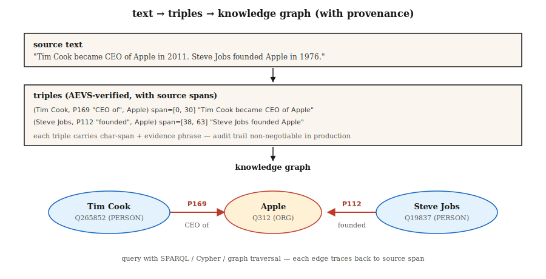

# 关系抽取与知识图谱构建

> NER（命名实体识别）找到了实体。实体链接将它们锚定。关系抽取找到了它们之间的边。知识图谱是节点、边及其来源的总和。

**类型：** 构建
**语言：** Python
**前提条件：** 阶段5 · 06（NER），阶段5 · 25（实体链接）
**时间：** 约60分钟

## 问题

一位分析师读到：“蒂姆·库克(Tim Cook)于2011年成为苹果(Apple)公司首席执行官(CEO)。”四个事实：

- `(Tim Cook, role, CEO)`
- `(Tim Cook, employer, Apple)`
- `(Tim Cook, start_date, 2011)`
- `(Apple, type, Organization)`

关系抽取(RE)将自由文本转换为结构化三元组`(subject, relation, object)`。跨语料库聚合，你就得到了知识图谱。再进行聚合与查询，你就获得了用于RAG(检索增强生成)、分析或合规审计的推理基础。

2026年的问题：LLM（大语言模型）热衷于抽取关系。过于热衷。它们会幻觉出源文本不支持的三元组。没有来源，你就无法区分真实的三元组和看似合理的虚构。2026年的答案是AEVS风格的锚定与验证流水线。

## 核心概念



**三元组形式。** `(subject_entity, relation_type, object_entity)`。关系来自于封闭本体论(Wikidata属性、FIBO、UMLS)或开放集合(OpenIE风格，任何关系皆可)。

**三种抽取方法。**

1. **规则/基于模式。** Hearst模式："X such as Y" → `(Y, isA, X)`。加上手工编写的正则表达式。脆弱、精确、可解释。
2. **有监督分类器。** 给定句子中的两个实体提及，从固定集合中预测关系。在TACRED、ACE、KBP上训练。2015–2022年的标准方法。
3. **生成式LLM。** 提示模型生成三元组。开箱即用。需要来源，否则会幻觉出看似合理的垃圾。

**AEVS（锚定-抽取-验证-补充，2026）。** 当前的幻觉缓解框架：

- **锚定。** 识别每个实体跨度(span)和关系短语跨度，并标注精确位置。
- **抽取。** 生成与锚定跨度关联的三元组。
- **验证。** 将每个三元组元素与源文本进行匹配；拒绝任何不支持的内容。
- **补充。** 覆盖性检查确保没有锚定跨度被遗漏。

幻觉大幅减少。需要更多计算，但可审计。

**开放与封闭的权衡。**

- **封闭本体论。** 固定属性列表（例如Wikidata的11,000+个属性）。可预测。可查询。难以发明。
- **开放IE。** 任何动词短语都成为关系。召回率高。精确率低。查询混乱。

生产环境的知识图谱通常混合使用：开放IE用于发现，然后将关系规范化到封闭本体论，再合并到主图中。

## 动手构建

### 第1步：基于模式的抽取

```python
PATTERNS = [
    (r"(?P<s>[A-Z]\w+) (?:is|was) (?:a|an|the) (?P<o>[A-Z]?\w+)", "isA"),
    (r"(?P<s>[A-Z]\w+) (?:is|was) born in (?P<o>\w+)", "bornIn"),
    (r"(?P<s>[A-Z]\w+) works? (?:at|for) (?P<o>[A-Z]\w+)", "worksAt"),
    (r"(?P<s>[A-Z]\w+) founded (?P<o>[A-Z]\w+)", "founded"),
]
```

请参阅`code/main.py`获取完整的简易抽取器。Hearst模式仍然出现在特定领域的流水线中，因为它们是可调试的。

### 第2步：有监督关系分类

```python
from transformers import AutoTokenizer, AutoModelForSequenceClassification

tok = AutoTokenizer.from_pretrained("Babelscape/rebel-large")
model = AutoModelForSequenceClassification.from_pretrained("Babelscape/rebel-large")

text = "Tim Cook was born in Alabama. He later became CEO of Apple."
encoded = tok(text, return_tensors="pt", truncation=True)
output = model.generate(**encoded, max_length=200)
triples = tok.batch_decode(output, skip_special_tokens=False)
```

REBEL是一个序列到序列(seq2seq)的关系抽取器：输入文本，输出三元组，且直接使用Wikidata属性ID。在远程监督(distant-supervision)数据上进行微调。标准的开放权重基线。

### 第3步：结合锚定的LLM提示抽取

```python
prompt = f"""Extract (subject, relation, object) triples from the text.
For each triple, include the exact character span in the source text.

Text: {text}

Output JSON:
[{{"subject": {{"text": "...", "span": [start, end]}},
   "relation": "...",
   "object": {{"text": "...", "span": [start, end]}}}}, ...]

Only include triples fully supported by the text. No inference beyond what is stated.
"""
```

根据源文本验证每个返回的跨度。拒绝任何`text[start:end] != triple_entity`的情况。这是AEVS“验证”步骤的最小形式。

### 第4步：规范化到封闭本体论

```python
RELATION_MAP = {
    "is the CEO of": "P169",       # "chief executive officer"
    "was born in":   "P19",         # "place of birth"
    "founded":        "P112",       # "founded by" (inverted subject/object)
    "works at":       "P108",       # "employer"
}


def canonicalize(relation):
    rel_low = relation.lower().strip()
    if rel_low in RELATION_MAP:
        return RELATION_MAP[rel_low]
    return None   # drop unmapped open relations or route to manual review
```

规范化通常占工程工作的60-80%。为此做好预算。

### 第5步：构建一个小型图并进行查询

```python
triples = extract(text)
graph = {}
for s, r, o in triples:
    graph.setdefault(s, []).append((r, o))


def neighbors(node, relation=None):
    return [(r, o) for r, o in graph.get(node, []) if relation is None or r == relation]


print(neighbors("Tim Cook", relation="P108"))    # -> [(P108, Apple)]
```

这是每个基于知识图谱的RAG系统的原子操作。可以使用RDF三元组存储（Blazegraph、Virtuoso）、属性图（Neo4j）或向量增强的图存储进行扩展。

## 陷阱

- **共指消解应在关系抽取之前。** "他创立了苹果"——RE需要知道"他"是谁。先进行共指消解（第24课）。
- **实体规范化。** "Apple Inc"和"Apple"必须解析为同一个节点。先进行实体链接（第25课）。
- **幻觉三元组。** LLM会生成文本不支持的三元组。强制进行跨度验证。
- **关系规范化漂移。** 开放IE的关系不一致（"出生在"、"来自"、"是……本地人"）。必须合并为规范化的ID，否则图无法查询。
- **时间错误。** "蒂姆·库克是苹果公司的CEO"——现在为真，2005年为假。许多关系具有时间边界。使用限定符（`P580` 开始时间，`P582` 结束时间，在Wikidata中）。
- **领域不匹配。** REBEL在维基百科上训练。法律、医学和科学文本通常需要领域微调的关系抽取模型。

## 使用它

2026年技术栈：

|  情况  |  选择  |
|-----------|------|
|  快速生产、通用领域  |  REBEL或LlamaPred配合Wikidata规范化  |
|  特定领域（生物医学、法律）  |  SciREX风格的领域微调 + 自定义本体论  |
|  LLM提示、可审计输出  |  AEVS流水线：锚定 → 抽取 → 验证 → 补充  |
|  高量新闻信息抽取  |  基于模式 + 有监督混合  |
| 从头构建知识图谱  |  开放信息抽取 + 手动规范化处理 |
| 时间知识图谱  |  使用限定词提取（开始/结束时间、时间点） |

集成模式：命名实体识别 → 共指消解 → 实体链接 → 关系抽取 → 本体映射 → 图加载。每个阶段都是一个潜在的质量关卡。

## 发布

保存为 `outputs/skill-re-designer.md`：

```markdown
---
name: re-designer
description: Design a relation extraction pipeline with provenance and canonicalization.
version: 1.0.0
phase: 5
lesson: 26
tags: [nlp, relation-extraction, knowledge-graph]
---

Given a corpus (domain, language, volume) and downstream use (KG-RAG, analytics, compliance), output:

1. Extractor. Pattern-based / supervised / LLM / AEVS hybrid. Reason tied to precision vs recall target.
2. Ontology. Closed property list (Wikidata / domain) or open IE with canonicalization pass.
3. Provenance. Every triple carries source char-span + doc id. Non-negotiable for audit.
4. Merge strategy. Canonical entity id + relation id + temporal qualifiers; dedup policy.
5. Evaluation. Precision / recall on 200 hand-labelled triples + hallucination-rate on LLM-extracted sample.

Refuse any LLM-based RE pipeline without span verification (source provenance). Refuse open-IE output flowing into a production graph without canonicalization. Flag pipelines with no temporal qualifier on time-bounded relations (employer, spouse, position).
```

## 练习

1. **简单.** 对`code/main.py`中的5个新闻句子运行模式抽取器。手工检查精确率。
2. **中等.** 对同样的句子使用REBEL（或一个小型大语言模型）。比较三元组。哪个抽取器精确率更高？召回率更高？
3. **困难.** 构建AEVS流水线：用大语言模型抽取 + 根据源文本验证跨度。在50个维基百科风格的句子上测量验证步骤前后的幻觉率。

## 关键术语

|  术语  |  人们的说法  |  实际含义  |
|------|-----------------|-----------------------|
| 三元组  |  主语-关系-宾语  |  `(s, r, o)`元组，是知识图谱的原子单元。 |
| 开放信息抽取  |  抽取任意内容  |  开放词汇的关系短语；高召回率，低精确率。 |
| 封闭本体  |  固定模式  |  有限的关系类型集合（Wikidata、UMLS、FIBO）。 |
| 规范化  |  标准化一切  |  将表面名称/关系映射到规范ID。 |
| AEVS  |  基于源的抽取  |  锚定-抽取-验证-补充流水线（2026年）。 |
| 溯源  |  信源链接  |  每个三元组携带一个文档ID和字符跨度关联到其源。 |
| 远程监督  |  廉价标签  |  将文本与现有知识图谱对齐以创建训练数据。 |

## 延伸阅读

- [Mintz et al. (2009). Distant supervision for relation extraction without labeled data](https://www.aclweb.org/anthology/P09-1113.pdf) — 远程监督论文。
- [Mintz et al. (2009). Distant supervision for relation extraction without labeled data](https://www.aclweb.org/anthology/P09-1113.pdf) — 序列到序列关系抽取主力模型。
- [Mintz et al. (2009). Distant supervision for relation extraction without labeled data](https://www.aclweb.org/anthology/P09-1113.pdf) — 联合信息抽取。
- [Mintz et al. (2009). Distant supervision for relation extraction without labeled data](https://www.aclweb.org/anthology/P09-1113.pdf) — 2026年幻觉缓解设计。
- [Mintz et al. (2009). Distant supervision for relation extraction without labeled data](https://www.aclweb.org/anthology/P09-1113.pdf) — 规范图查询。
