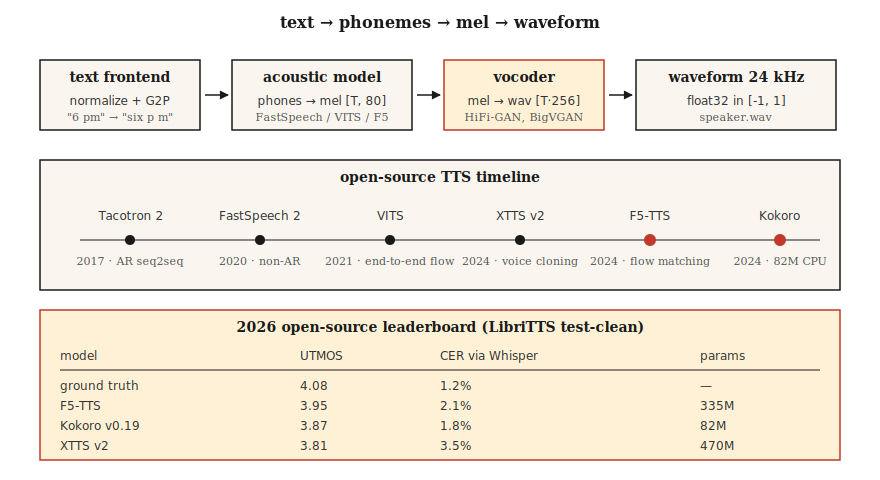

# 文本转语音（TTS）——从Tacotron到F5和Kokoro

> ASR将语音逆转为文本；TTS将文本逆转为语音。2026年的技术栈分为三部分：文本→令牌，令牌→梅尔频谱，梅尔频谱→波形。每个部分都有一个适合笔记本电脑的默认模型。

**类型：** 构建
**语言：** Python
**前置知识：** 阶段6·02（频谱图与梅尔），阶段5·09（序列到序列），阶段7·05（完整Transformer）
**时间：** 约75分钟

## 问题

你有一个字符串："Please remind me to water the plants at 6 pm." 你需要一个3秒的音频片段，听起来自然，韵律正确（停顿、重音），用正确的元音发音"plants"，并且在CPU上运行时间低于300毫秒，用于实时语音助手。你还需要切换声音，处理代码切换输入（"remind me at 6 pm, daijoubu?"），并且在名字上不出丑。

现代TTS流水线如下所示：

1. **文本前端。** 规范化文本（日期、数字、电子邮件），转换为音素或子词令牌，预测韵律特征。
2. **声学模型。** 文本→梅尔频谱图。Tacotron 2 (2017), FastSpeech 2 (2020), VITS (2021), F5-TTS (2024), Kokoro (2024)。
3. **声码器。** 梅尔频谱→波形。WaveNet (2016), WaveRNN, HiFi-GAN (2020), BigVGAN (2022), 2024年后的神经编解码声码器。

到2026年，声学模型与声码器的界限随着端到端扩散和流匹配模型而变得模糊。但三部分的思维模型在调试时仍然适用。

## 核心概念



**Tacotron 2 (2017)。** 序列到序列：字符嵌入→BiLSTM编码器→位置敏感注意力→自回归LSTM解码器输出梅尔帧。慢（自回归），长文本不稳定。仍被引用为基线。

**FastSpeech 2 (2020)。** 非自回归。时长预测器输出每个音素获得多少梅尔帧。单次通过，比Tacotron快10倍。失去一些自然度（单调对齐），但到处部署。

**VITS (2021)。** 联合训练编码器+基于流的时长+HiFi-GAN声码器，端到端变分推理。高质量，单模型。2022-2024年主导的开源TTS。变体：YourTTS（多说话者零样本），XTTS v2 (2024, Coqui)。

**F5-TTS (2024)。** 基于流匹配的扩散Transformer。自然韵律，5秒参考音频的零样本声音克隆。2026年开源TTS排行榜榜首。3.35亿参数。

**Kokoro (2024)。** 小模型（8200万），可在CPU上运行，实时使用中最佳的英语TTS。封闭词汇仅英语，Apache-2.0许可证。

**OpenAI TTS-1-HD, ElevenLabs v2.5, Google Chirp-3。** 商业最新技术。ElevenLabs v2.5的情绪标签（"[whispered]", "[laughing]"）和角色声音在2026年主导有声书制作。

### 声码器演进

|  时代  |  声码器  |  延迟  |  质量  |
|-----|---------|---------|---------|
|  2016  |  WaveNet  |  仅离线  |  发布时最优  |
|  2018  |  WaveRNN  |  约实时  |  良好  |
|  2020  |  HiFi-GAN  |  100倍实时  |  接近人类  |
|  2022  |  BigVGAN  |  50倍实时  |  跨说话者/语言泛化  |
|  2024  |  SNAC, DAC（神经编解码器）  |  与自回归模型集成  |  离散令牌，位高效  |

到2026年，大多数"TTS"模型是文本到波形的端到端；梅尔频谱图成为一个内部表示。

### 评估

- **MOS（平均意见分）。** 1-5分制，众包。仍是黄金标准；但速度极慢。
- **CMOS（比较MOS）。** A-vs-B偏好。每个标注的置信区间更窄。
- **UTMOS, DNSMOS。** 无参考神经MOS预测器。用于排行榜。
- **CER（字符错误率）通过ASR。** 将TTS输出通过Whisper运行，计算与输入文本的CER。作为可懂度的代理。
- **SECS（说话者嵌入余弦相似度）。** 声音克隆质量。

2026年在LibriTTS测试集clean上的数据：

|  模型  |  UTMOS  |  CER（通过Whisper）  |  大小  |
|-------|-------|-------------------|------|
|  真实数据  |  4.08  |  1.2%  |  —  |
|  F5-TTS  |  3.95  |  2.1%  |  335M  |
|  XTTS v2  |  3.81  |  3.5%  |  470M  |
|  VITS  |  3.62  |  3.1%  |  25M  |
|  Kokoro v0.19  |  3.87  |  1.8%  |  82M  |
|  Parler-TTS Large  |  3.76  |  2.8%  |  2.3B  |

## 动手构建

### 步骤1：将输入音素化

```python
from phonemizer import phonemize
ph = phonemize("Hello world", language="en-us", backend="espeak")
# 'həloʊ wɜːld'
```

音素是通用的桥梁。避免将原始文本输入到低于VITS级别质量的任何模型中。

### 步骤2：运行Kokoro（2026年CPU默认）

```python
from kokoro import KPipeline
tts = KPipeline(lang_code="a")  # "a" = American English
audio, sr = tts("Please remind me to water the plants at 6 pm.", voice="af_bella")
# audio: float32 tensor, sr=24000
```

离线运行，单文件，8200万参数。

### 步骤3：运行带语音克隆的F5-TTS

```python
from f5_tts.api import F5TTS
tts = F5TTS()
wav = tts.infer(
    ref_file="my_voice_5s.wav",
    ref_text="The quick brown fox jumps over the lazy dog.",
    gen_text="Please remind me to water the plants.",
)
```

传入一个5秒的参考片段及其转录文本；F5会克隆语调和音色。

### 步骤4：从头实现HiFi-GAN声码器

太大，无法放入教程脚本，但其结构如下：

```python
class HiFiGAN(nn.Module):
    def __init__(self, mel_channels=80, upsample_rates=[8, 8, 2, 2]):
        super().__init__()
        # 4 upsample blocks, total 256x to go from mel-rate to audio-rate
        ...
    def forward(self, mel):
        return self.blocks(mel)  # -> waveform
```

训练：对抗性（在短窗口上的判别器）+梅尔谱图重建损失+特征匹配损失。已商品化——使用来自`hifi-gan`仓库或nvidia-NeMo的预训练检查点。

### 步骤5：完整流程（伪代码）

```python
text = "Please remind me at 6 pm."
phones = phonemize(text)
mel = acoustic_model(phones, speaker=alice)      # [T, 80]
wav = vocoder(mel)                                # [T * 256]
soundfile.write("out.wav", wav, 24000)
```

## 使用它

2026年技术栈：

|  情况  |  选择  |
|-----------|------|
|  实时英语语音助手  |  Kokoro（CPU）或XTTS v2（GPU）  |
|  从5秒参考片段进行语音克隆  |  F5-TTS  |
|  商业角色声音  |  ElevenLabs v2.5  |
|  有声书朗读  |  ElevenLabs v2.5或XTTS v2 + 微调  |
|  低资源语言  |  在5–20小时目标语言数据上训练VITS  |
|  富有表现力/情感标签  |  ElevenLabs v2.5或StyleTTS 2微调  |

截至2026年的开源领导者：**质量选F5-TTS，效率选Kokoro**。除非你是历史学家，否则不要碰Tacotron。

## 陷阱

- **无文本规范化器。**"Dr. Smith"读作"Doctor"还是"Drive"？"2026"读作"twenty twenty six"还是"two zero two six"？在音素化之前进行规范化。
- **OOV专有名词。**“Ghumare” → “ghyu-mair”？为未知标记配备一个后备的字形到音素模型。
- **截断。**声码器输出很少截断，但推理时梅尔缩放不匹配可能超出±1.0。始终`np.clip(wav, -1, 1)`。
- **采样率不匹配。**Kokoro输出24 kHz；下游流程期望16 kHz → 重采样，否则会出现混叠。

## 发布

保存为`outputs/skill-tts-designer.md`。为给定的语音、延迟和语言目标设计一个TTS流程。

## 练习

1. **简单。**运行`code/main.py`。从玩具词汇构建音素字典，估计每个音素的时长，并打印一个虚拟的“梅尔”调度。
2. **中等。**安装Kokoro，用声音`code/main.py`和`af_bella`合成同一句子。比较音频时长和主观质量。
3. **困难。**录制你自己的5秒参考片段。使用F5-TTS克隆它。报告参考输出与克隆输出之间的SECS值。

## 关键术语

|  术语  |  人们的说法  |  实际含义  |
|------|-----------------|-----------------------|
|  音素  |  声音单元  |  抽象声音类别；英语中有39个（ARPABet）。  |
|  时长预测器  |  每个音素持续多长时间  |  非自回归模型输出；每个音素的整数帧数。  |
|  声码器  |  梅尔→波形  |  将梅尔谱图映射到原始样本的神经网络。  |
|  HiFi-GAN  |  标准声码器  |  基于生成对抗网络；2020–2024年占主导地位。  |
|  MOS  |  主观质量  |  来自人类评分员的1–5分平均意见得分。  |
|  SECS  |  语音克隆指标  |  目标说话人嵌入与输出说话人嵌入之间的余弦相似度。  |
|  F5-TTS  |  2024年开源SOTA  |  流匹配扩散；零样本克隆。  |
|  Kokoro  |  CPU英语领导者  |  8200万参数模型，Apache 2.0。  |

## 延伸阅读

- [Shen et al. (2017). Tacotron 2](https://arxiv.org/abs/1712.05884) — 序列到序列基线模型。
- [Shen et al. (2017). Tacotron 2](https://arxiv.org/abs/1712.05884) — 端到端基于流的方法。
- [Shen et al. (2017). Tacotron 2](https://arxiv.org/abs/1712.05884) — 当前开源SOTA。
- [Shen et al. (2017). Tacotron 2](https://arxiv.org/abs/1712.05884) — 2026年仍在使用的声码器。
- [Shen et al. (2017). Tacotron 2](https://arxiv.org/abs/1712.05884) — 2024年CPU友好的英语TTS。
