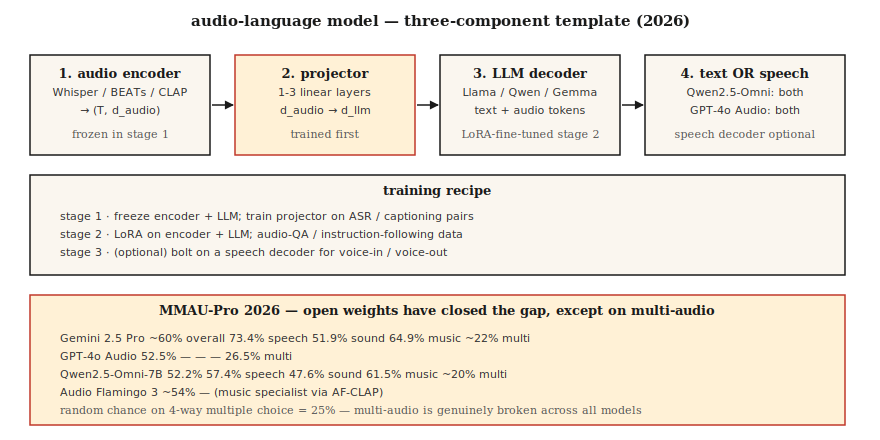

# 音频语言模型——Qwen2.5-Omni、Audio Flamingo、GPT-4o Audio

> 2026年音频语言模型对语音+环境声音+音乐进行推理。Qwen2.5-Omni-7B在MMAU-Pro上与GPT-4o Audio持平。Audio Flamingo Next在LongAudioBench上击败Gemini 2.5 Pro。开源与闭源之间的差距基本消除——除了多音频任务，几乎所有模型都接近随机水平。

**类型：** 学习
**语言：** Python
**先修知识：** 第6阶段·04（自动语音识别）、第12阶段·03（视觉语言模型）、第7阶段·10（音频 Transformer）
**时间：** 约45分钟

## 问题

你有5秒的音频：狗叫，有人喊“停下！”，然后安静。有用的提问覆盖多个维度：

- **转录。** “说了什么？”——自动语音识别领域。
- **语义推理。** “此人是否处于危险？”——需要联合理解狗叫+喊叫+安静。
- **音乐推理。** “哪些乐器演奏了旋律？”
- **长音频检索。** “在这段90分钟的讲座中，讲师在哪里解释了梯度下降？”

一个能通过单一提示回答以上所有问题的模型就是**音频语言模型**（音频语言模型 / 音频语言模型）。与纯自动语音识别不同：音频语言模型生成自由形式的自然语言答案，而不仅仅是转录文本。

## 核心概念



### 三组件模板

每个2026年的音频语言模型都具有相同的骨架：

1. **音频编码器。** Whisper编码器 · BEATs · CLAP · WavLM · 或每个模型自定义的编码器。
2. **投影器。** 线性或MLP，将音频编码器特征桥接到大语言模型的词嵌入空间。
3. **大语言模型。** 基于Llama / Qwen / Gemma的解码器。接受交错文本+音频标记，生成文本。

训练：

- **阶段1。** 冻结编码器+大语言模型；仅在自动语音识别/字幕数据上训练投影器。
- **阶段2。** 在指令遵循的音频任务（问答、推理、音乐理解）上进行全量/LoRA微调。
- **阶段3（可选）。** 语音输入/语音输出增加一个语音解码器。Qwen2.5-Omni和Audio Flamingo 3 Chat采用了此步骤。

### 2026年模型地图

|  模型  |  骨干网络  |  音频编码器  |  输出模态  |  访问方式  |
|-------|----------|---------------|-----------------|--------|
|  Qwen2.5-Omni-7B  |  Qwen2.5-7B  |  自定义+Whisper  |  文本+语音  |  Apache-2.0  |
|  Qwen3-Omni  |  Qwen3  |  自定义  |  文本+语音  |  Apache-2.0  |
|  Audio Flamingo 3  |  Qwen2  |  AF-CLAP  |  文本  |  NVIDIA非商业  |
|  Audio Flamingo Next  |  Qwen2  |  AF-CLAP v2  |  文本  |  NVIDIA非商业  |
|  SALMONN  |  Vicuna  |  Whisper+BEATs  |  文本  |  Apache-2.0  |
|  LTU / LTU-AS  |  Llama  |  CAV-MAE  |  文本  |  Apache-2.0  |
|  GAMA  |  Llama  |  AST+Q-Former  |  文本  |  Apache-2.0  |
|  Gemini 2.5 Flash/Pro（闭源）  |  Gemini  |  专有  |  文本+语音  |  接口  |
|  GPT-4o Audio（闭源）  |  GPT-4o  |  专有  |  文本+语音  |  接口  |

### 基准测试现实检验（2026年）

**MMAU-Pro。** 1800个问答对，涵盖语音/声音/音乐/混合。包含多音频子集。

|  模型  |  总体  |  语音  |  声音  |  音乐  |  多音频  |
|-------|---------|--------|-------|-------|-------------|
|  Gemini 2.5 Pro  |  ~60%  |  73.4%  |  51.9%  |  64.9%  |  ~22%  |
|  Gemini 2.5 Flash  |  ~57%  |  73.4%  |  50.5%  |  64.9%  |  21.2%  |
|  GPT-4o Audio  |  52.5%  |  —  |  —  |  —  |  26.5%  |
|  Qwen2.5-Omni-7B  |  52.2%  |  57.4%  |  47.6%  |  61.5%  |  ~20%  |
|  Audio Flamingo 3  |  ~54%  |  —  |  —  |  —  |  —  |
|  Audio Flamingo Next  |  长音频基准(LongAudioBench)上的最优(SOTA)  |  —  |  —  |  —  |  —  |

**多音频列对所有人都是致命的。** 4选项多项选择的随机概率为25%；大多数模型得分在此附近。LALM仍难以比较两个片段。

### 2026年LALM的实用场景

- **呼叫中心录音的合规性审计。** "座席是否提到了必需的披露信息？"
- **无障碍。** 向聋人用户描述声音事件（不仅仅是转录）。
- **内容审核。** 检测暴力语言+威胁语气+背景上下文。
- **播客/会议章节划分。** 基于语义的摘要，而不仅仅是说话人轮换。
- **音乐目录分析。** "查找所有包含B段转调的曲目。"

### 目前尚不适用的场景

- 细粒度音乐理论（低于和弦级别）。
- 长对话的说话人归属推理（超过10分钟后性能下降）。
- 多音频比较（22-26%仅略高于随机水平）。
- 实时流式推理（多数采用离线批次推理）。

## 动手构建

### 步骤1：查询Qwen2.5-Omni

```python
from transformers import AutoModelForCausalLM, AutoProcessor

processor = AutoProcessor.from_pretrained("Qwen/Qwen2.5-Omni-7B")
model = AutoModelForCausalLM.from_pretrained("Qwen/Qwen2.5-Omni-7B", torch_dtype="auto")

audio, sr = load_wav("clip.wav", sr=16000)
messages = [{
    "role": "user",
    "content": [
        {"type": "audio", "audio": audio},
        {"type": "text", "text": "What sounds do you hear, and what's happening?"},
    ],
}]
inputs = processor.apply_chat_template(messages, tokenize=True, return_tensors="pt")
output = model.generate(**inputs, max_new_tokens=200)
print(processor.decode(output[0], skip_special_tokens=True))
```

### 步骤2：投影器(Projector)模式

```python
import torch.nn as nn

class AudioProjector(nn.Module):
    def __init__(self, audio_dim=1280, llm_dim=4096):
        super().__init__()
        self.down = nn.Linear(audio_dim, llm_dim)
        self.act = nn.GELU()
        self.up = nn.Linear(llm_dim, llm_dim)

    def forward(self, audio_features):
        return self.up(self.act(self.down(audio_features)))
```

就这些。投影器通常是1-3个线性层。在ASR对（音频→文本）上训练是阶段1的预训练任务。

### 步骤3：基准测试MMAU/LongAudioBench

```python
from datasets import load_dataset
mmau = load_dataset("MMAU/MMAU-Pro")

correct = 0
for item in mmau["test"]:
    answer = call_model(item["audio"], item["question"], item["choices"])
    if answer == item["correct_choice"]:
        correct += 1
print(f"Accuracy: {correct / len(mmau['test']):.3f}")
```

按类别（语音/声音/音乐/多音频）分别报告。聚合数字会掩盖模型失败的地方。

## 使用它

| 任务  |  2026年推荐 |
|------|-----------|
| 自由形式音频问答（开放式）  |  Qwen2.5-Omni-7B |
| 长音频最佳开源模型  |  Audio Flamingo Next |
| 最佳闭源模型  |  Gemini 2.5 Pro |
| 语音输入/语音输出代理  |  Qwen2.5-Omni或GPT-4o Audio |
| 音乐推理  |  Audio Flamingo 3或2（音乐专用AF-CLAP） |
| 呼叫中心审计  |  通过API使用Gemini 2.5 Pro，结合政策文档的RAG |

## 陷阱

- **对多音频的过度信任。** 如果你的任务需要判断"哪个片段包含X"，随机水平的性能是真实存在的。
- **长音频退化。** 超过10分钟后，大多数模型的说话人归属失效。先进行说话人分离（第6课），再总结。
- **静音上的幻觉。** 与Whisper相同的问题，被使用Whisper编码器的LALM继承。需加VAD门控。
- **基准测试的挑拣。** 供应商博客文章突出最佳案例类别。请自行运行MMAU-Pro多音频子集。

## 发布

保存为`outputs/skill-alm-picker.md`。为给定的音频理解任务选择LALM + 基准子集 + 输出模态（文本vs语音）。

## 练习

1. **简单。** 运行`code/main.py`查看一个玩具投影器模式以及（音频嵌入、文本令牌）→输出令牌的假LALM路由。
2. **中等。** 在100个MMAU-Pro语音项上对Qwen2.5-Omni-7B进行评分。与论文报告的数字比较。
3. **困难。** 构建一个最小的音频字幕基线：BEATs编码器 + 2层投影器 + 冻结的Llama-3.2-1B。仅在AudioCaps上微调投影器。与Clotho-AQA上的SALMONN比较。

## 关键术语

|  术语  |  人们的说法  |  实际含义  |
|------|-----------------|-----------------------|
|  LALM  |  Audio ChatGPT  |  音频编码器 + 投影器 + LLM解码器。  |
|  投影器  |  适配器  |  将音频特征映射到LLM嵌入空间的小型MLP。  |
|  MMAU  |  基准测试  |  包含语音、声音、音乐的10k个音频问答对。  |
|  MMAU-Pro  |  更难的MMAU  |  1800个多音频/推理密集型问题。  |
|  LongAudioBench  |  长形式评估  |  包含语义查询的多分钟片段。  |
|  语音输入/语音输出  |  语音原生  |  模型接收语音并输出语音，无需文本绕路。  |

## 延伸阅读

- [Chu et al. (2024). Qwen2-Audio](https://arxiv.org/abs/2407.10759) — 参考架构。
- [Chu et al. (2024). Qwen2-Audio](https://arxiv.org/abs/2407.10759) — 语音输入语音输出。
- [Chu et al. (2024). Qwen2-Audio](https://arxiv.org/abs/2407.10759) — 开源长音频领先者。
- [Chu et al. (2024). Qwen2-Audio](https://arxiv.org/abs/2407.10759) — LongAudioBench最优(SOTA)。
- [Chu et al. (2024). Qwen2-Audio](https://arxiv.org/abs/2407.10759) — 双编码器先驱。
- [Chu et al. (2024). Qwen2-Audio](https://arxiv.org/abs/2407.10759) — 2026年实时排名。
