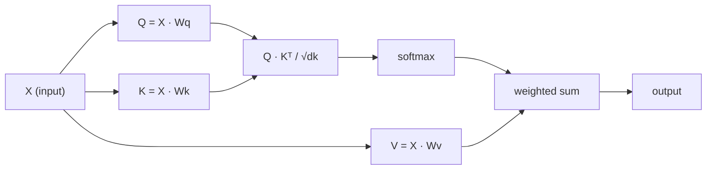

# 从头实现自注意力(Self-Attention)

> 注意力(Attention)就像一个查找表，每个词都会问“谁与我相关？”——然后学习答案。

**类型：** 构建
**语言：** Python
**先决条件：** 阶段3（深度学习核心），阶段5第10课（序列到序列）
**时长：** ~90分钟

## 学习目标

- 仅使用NumPy从头实现缩放点积自注意力(Scaled Dot-Product Self-Attention)，包括查询/键/值投影和Softmax加权求和
- 构建多头注意力(Multi-Head Attention)层，拆分头，并行计算注意力，并拼接结果
- 追踪注意力矩阵如何捕获词元关系，并解释为什么通过sqrt(d_k)缩放可以防止Softmax饱和
- 应用因果掩码(Causal Masking)将双向注意力转换为自回归（解码器风格）注意力

## 问题

循环神经网络(RNN)一次处理一个词元。当你到达第50个词元时，来自第1个词元的信息已经经历了50次压缩步骤。长距离依赖被压缩到一个固定大小的隐藏状态——这是一个即使LSTM的门控机制也无法完全解决的瓶颈。

2014年的Bahdanau注意力论文展示了解决方案：让解码器回顾每个编码器位置，并决定哪些位置对当前步骤重要。但它仍然是在RNN上附加的。2017年的《Attention Is All You Need》论文提出了一个更尖锐的问题：如果注意力是*唯一*的机制呢？没有循环，没有卷积，只有注意力。

自注意力(Self-Attention)让序列中的每个位置能在单个并行步骤中关注所有其他位置。这就是Transformer快速、可扩展且占主导地位的原因。

## 核心概念

### 数据库查找类比

将注意力视为一种软数据库查找：

```
Traditional database:
  Query: "capital of France"  -->  exact match  -->  "Paris"

Attention:
  Query: "capital of France"  -->  similarity to ALL keys  -->  weighted blend of ALL values
```

每个词元生成三个向量：
- **查询 (Q)**："我在找什么？"
- **键 (K)**："我包含什么？"
- **值 (V)**："如果被选中，我提供什么信息？"

查询与所有键之间的点积产生注意力分数。分数高意味着“这个键与我的查询匹配”。这些分数对值进行加权。输出是值的加权和。

### Q、K、V 的计算

每个词元嵌入通过三个学习到的权重矩阵进行投影：

```
Input embeddings (sequence of n tokens, each d-dimensional):

  X = [x1, x2, x3, ..., xn]       shape: (n, d)

Three weight matrices:

  Wq  shape: (d, dk)
  Wk  shape: (d, dk)
  Wv  shape: (d, dv)

Projections:

  Q = X @ Wq    shape: (n, dk)      each token's query
  K = X @ Wk    shape: (n, dk)      each token's key
  V = X @ Wv    shape: (n, dv)      each token's value
```

可视化单个词元：

```
             Wq
  x_i ------[*]------> q_i    "What am I looking for?"
       |
       |     Wk
       +----[*]------> k_i    "What do I contain?"
       |
       |     Wv
       +----[*]------> v_i    "What do I offer?"
```

### 注意力矩阵

一旦你得到了所有词元的Q、K、V，注意力分数形成一个矩阵：

```
Scores = Q @ K^T    shape: (n, n)

              k1    k2    k3    k4    k5
        +-----+-----+-----+-----+-----+
   q1   | 2.1 | 0.3 | 0.1 | 0.8 | 0.2 |   <- how much q1 attends to each key
        +-----+-----+-----+-----+-----+
   q2   | 0.4 | 1.9 | 0.7 | 0.1 | 0.3 |
        +-----+-----+-----+-----+-----+
   q3   | 0.2 | 0.6 | 2.3 | 0.5 | 0.1 |
        +-----+-----+-----+-----+-----+
   q4   | 0.9 | 0.1 | 0.4 | 1.7 | 0.6 |
        +-----+-----+-----+-----+-----+
   q5   | 0.1 | 0.3 | 0.2 | 0.5 | 2.0 |
        +-----+-----+-----+-----+-----+

Each row: one token's attention over the entire sequence
```

观察一个查询依次扫描所有键：每一行对每个词元打分，Softmax将分数转换为权重，上下文向量是值的加权混合。

```figure
attention-matrix
```

### 为什么要缩放？

点积的值随维度dk增长。如果dk=64，点积可能在几十的范围内，将Softmax推向梯度消失的区域。解决方法：除以sqrt(dk)。

```
Scaled scores = (Q @ K^T) / sqrt(dk)
```

这使值保持在Softmax能产生有用梯度的范围内。

### Softmax将分数转换为权重

Softmax将原始分数转换为每一行的概率分布：

```
Raw scores for q1:   [2.1, 0.3, 0.1, 0.8, 0.2]
                            |
                         softmax
                            |
Attention weights:   [0.52, 0.09, 0.07, 0.14, 0.08]   (sums to ~1.0)
```

现在每个词元都有一组权重，表示它对其他每个词元的关注程度。

### 值的加权和

每个词元的最终输出是所有值向量的加权和：

```
output_i = sum( attention_weight[i][j] * v_j  for all j )

For token 1:
  output_1 = 0.52 * v1 + 0.09 * v2 + 0.07 * v3 + 0.14 * v4 + 0.08 * v5
```

### 完整流程



一行公式表示：

```
Attention(Q, K, V) = softmax( Q @ K^T / sqrt(dk) ) @ V
```

```figure
softmax-attention-scaling
```

## 动手构建

### 步骤1：从头实现Softmax

Softmax将原始对数(logits)转换为概率。减去最大值以获得数值稳定性。

```python
import numpy as np

def softmax(x):
    shifted = x - np.max(x, axis=-1, keepdims=True)
    exp_x = np.exp(shifted)
    return exp_x / np.sum(exp_x, axis=-1, keepdims=True)

logits = np.array([2.0, 1.0, 0.1])
print(f"logits:  {logits}")
print(f"softmax: {softmax(logits)}")
print(f"sum:     {softmax(logits).sum():.4f}")
```

### 第二步：缩放点积注意力

核心函数。接收Q、K、V矩阵，返回注意力输出及权重矩阵。

```python
def scaled_dot_product_attention(Q, K, V):
    dk = Q.shape[-1]
    scores = Q @ K.T / np.sqrt(dk)
    weights = softmax(scores)
    output = weights @ V
    return output, weights
```

### 第三步：带可学习投影的自注意力类

完整的自注意力模块，包含使用类Xavier缩放初始化的Wq、Wk、Wv权重矩阵。

```python
class SelfAttention:
    def __init__(self, d_model, dk, dv, seed=42):
        rng = np.random.default_rng(seed)
        scale = np.sqrt(2.0 / (d_model + dk))
        self.Wq = rng.normal(0, scale, (d_model, dk))
        self.Wk = rng.normal(0, scale, (d_model, dk))
        scale_v = np.sqrt(2.0 / (d_model + dv))
        self.Wv = rng.normal(0, scale_v, (d_model, dv))
        self.dk = dk

    def forward(self, X):
        Q = X @ self.Wq
        K = X @ self.Wk
        V = X @ self.Wv
        output, weights = scaled_dot_product_attention(Q, K, V)
        return output, weights
```

### 第四步：在句子上运行

为句子创建假嵌入并观察注意力权重。

```python
sentence = ["The", "cat", "sat", "on", "the", "mat"]
n_tokens = len(sentence)
d_model = 8
dk = 4
dv = 4

rng = np.random.default_rng(42)
X = rng.normal(0, 1, (n_tokens, d_model))

attn = SelfAttention(d_model, dk, dv, seed=42)
output, weights = attn.forward(X)

print("Attention weights (each row: where that token looks):\n")
print(f"{'':>6}", end="")
for token in sentence:
    print(f"{token:>6}", end="")
print()

for i, token in enumerate(sentence):
    print(f"{token:>6}", end="")
    for j in range(n_tokens):
        w = weights[i][j]
        print(f"{w:6.3f}", end="")
    print()
```

### 第五步：用ASCII热力图可视化注意力

将注意力权重映射到字符以实现快速可视化。

```python
def ascii_heatmap(weights, tokens, chars=" ░▒▓█"):
    n = len(tokens)
    print(f"\n{'':>6}", end="")
    for t in tokens:
        print(f"{t:>6}", end="")
    print()

    for i in range(n):
        print(f"{tokens[i]:>6}", end="")
        for j in range(n):
            level = int(weights[i][j] * (len(chars) - 1) / weights.max())
            level = min(level, len(chars) - 1)
            print(f"{'  ' + chars[level] + '   '}", end="")
        print()

ascii_heatmap(weights, sentence)
```

## 使用它

PyTorch的`nn.MultiheadAttention`完全实现了我们的构建，外加多头拆分和输出投影：

```python
import torch
import torch.nn as nn

d_model = 8
n_heads = 2
seq_len = 6

mha = nn.MultiheadAttention(embed_dim=d_model, num_heads=n_heads, batch_first=True)

X_torch = torch.randn(1, seq_len, d_model)

output, attn_weights = mha(X_torch, X_torch, X_torch)

print(f"Input shape:            {X_torch.shape}")
print(f"Output shape:           {output.shape}")
print(f"Attention weight shape: {attn_weights.shape}")
print(f"\nAttn weights (averaged over heads):")
print(attn_weights[0].detach().numpy().round(3))
```

关键区别：多头注意力并行运行多个注意力函数，每个函数有自己的Q、K、V投影，大小为dk = d_model / n_heads，然后拼接结果。这让模型能同时关注不同类型的关系。

## 发布

本課(lesson)产出：
- `outputs/prompt-attention-explainer.md` - 通过数据库查找类比解释注意力的提示

## 练习

1. 修改`scaled_dot_product_attention`以接受可选的掩码矩阵，该矩阵在softmax前将某些位置设为负无穷（这是因果/解码器掩码的工作方式）
2. 从头实现多头注意力：将Q、K、V拆分为`scaled_dot_product_attention`个块，对每个块运行注意力，拼接，并通过最终权重矩阵Wo进行投影
3. 取两个不同但长度相同的句子，通过同一个SelfAttention实例，比较它们的注意力模式。什么变了？什么没变？

## 关键术语

|  术语  |  人们的说法  |  实际含义  |
|------|----------------|----------------------|
|  Query (Q)  |  "问题向量"  |  输入的 learned projection，表示该 token 正在寻找什么信息  |
|  Key (K)  |  "标签向量"  |  输入的 learned projection，表示该 token 包含什么信息，与查询匹配  |
|  Value (V)  |  "内容向量"  |  输入的 learned projection，携带根据注意力分数聚合的实际信息  |
|  缩放点积注意力  |  "注意力公式"  |  softmax(QK^T / sqrt(dk)) @ V - 缩放防止高维度下softmax饱和  |
|  自注意力  |  "token 看自己和他人"  |  注意力中Q、K、V都来自同一序列，每个位置都能关注其他所有位置  |
|  注意力权重  |  "关注程度"  |  位置的概率分布，由对缩放点积执行softmax产生  |
|  多头注意力  |  "并行注意力"  |  运行多个不同投影的注意力函数，然后拼接结果以获得更丰富的表示  |

## 延伸阅读

- [Attention Is All You Need (Vaswani et al., 2017)](https://arxiv.org/abs/1706.03762) - 原始Transformer论文
- [Attention Is All You Need (Vaswani et al., 2017)](https://arxiv.org/abs/1706.03762) - 完整架构的最佳可视化讲解
- [Attention Is All You Need (Vaswani et al., 2017)](https://arxiv.org/abs/1706.03762) - 逐行PyTorch实现及解释
