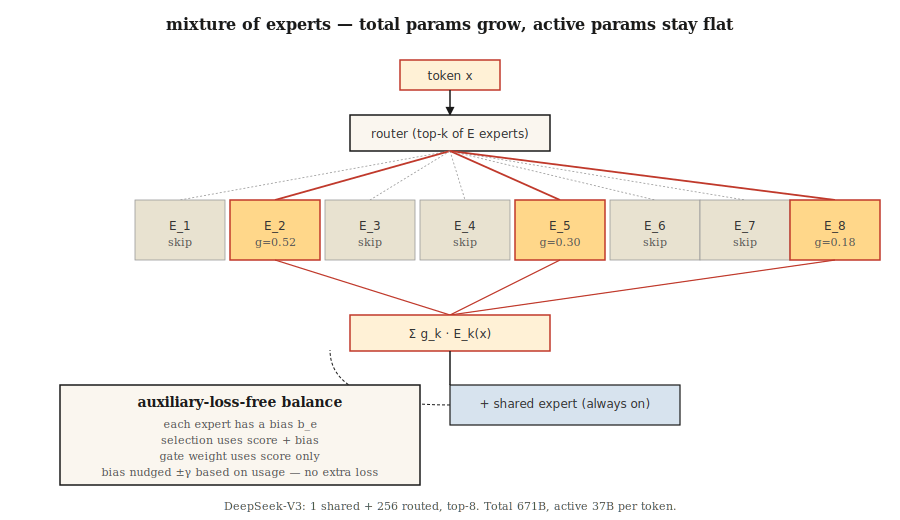

# 混合专家模型(MoE)

> 一个稠密的700亿参数Transformer会对每个token激活所有参数。一个6710亿参数的MoE每个token只激活370亿参数，并在每个基准测试上都击败了它。稀疏性是这十年最重要的扩展思想。

**类型:** 构建
**语言:** Python
**先决条件:** 阶段7 · 05（完整Transformer），阶段7 · 07（GPT）
**时间:** ~45分钟

## 问题

稠密Transformer在推理时的FLOPs等于其参数量（前向传播乘以2）。扩展稠密模型时，每个token都要支付全部计算成本。到2024年，前沿模型遇到了计算瓶颈：要变得更有意义地智能，每个token需要指数级更多的FLOPs。

混合专家模型打破了这一联系。将每个前馈网络替换为`E`个独立专家和一个路由器，该路由器为每个token选择`k`个专家。总参数量=`E × FFN_size`。每个token的激活参数量=`k × FFN_size`。典型的2026年配置：`E=256`，`k=8`。存储随`E`扩展，计算随`k`扩展。

2026年的前沿模型几乎全部是MoE：DeepSeek-V3（总参数6710亿/激活370亿）、Mixtral 8×22B、Qwen2.5-MoE、Llama 4、Kimi K2、gpt-oss。在Artificial Analysis的独立排行榜上，前10名开源模型全是MoE。

## 核心概念



### 前馈网络替换

稠密Transformer块：

```
h = x + attn(norm(x))
h = h + FFN(norm(h))
```

MoE块：

```
h = x + attn(norm(x))
scores = router(norm(h))              # (N_tokens, E)
top_k = argmax_k(scores)              # pick k of E per token
h = h + sum_{e in top_k}(
        gate(scores[e]) * Expert_e(norm(h))
    )
```

每个专家都是一个独立的前馈网络（通常是SwiGLU）。路由器是一个单独的线性层。每个token选择自己的`k`个专家，并获取它们输出的门控混合。

### 负载均衡问题

如果路由器将90%的token都分配给专家3，其他专家就会匮乏。已有三种修复尝试：

1. **辅助负载均衡损失**（Switch Transformer，Mixtral）。添加一个与专家使用量方差成正比的惩罚项。可行，但增加了一个超参数和一个额外的梯度信号。
2. **专家容量+令牌丢弃**（早期Switch）。每个专家最多处理`C × N/E`个token；超出的token跳过该层。损害质量。
3. **无辅助损失的均衡**（DeepSeek-V3）。为每个专家添加一个可学习的偏置，该偏置会偏移路由器的top-k选择。偏置在训练损失之外更新。对主目标没有惩罚。2024年的重大突破。

DeepSeek-V3的方法：每个训练步骤后，对于每个专家，检查其使用量是否高于或低于目标。将偏置微调`±γ`。选择使用`scores + bias`。用于门控的专家概率是原始的`scores`，保持不变。将路由与表达解耦。

### 共享专家

DeepSeek-V2/V3还将专家分为*共享*和*路由*两类。每个token都会经过所有共享专家。路由专家通过top-k选择。共享专家捕获通用知识；路由专家进行专门化。V3使用1个共享专家加上256个路由专家中的top-8。

### 细粒度专家

经典MoE（GShard，Switch）：每个专家与完整前馈网络一样宽。`E`很小（8–64），`k`很小（1–2）。

现代细粒度MoE（DeepSeek-V3，Qwen-MoE）：每个专家更窄（1/8前馈网络大小）。`E`很大（256+），`k`更大（8+）。总参数量相同，但组合扩展速度快得多。每个token有`C(256, 8) = 400 trillion`种可能的“专家组合”。质量上升，延迟保持不变。

### 成本画像

每个token，每层：

|  配置  |  每token激活参数量 |  总参数量  |
|--------|-----------------------|--------------|
|  Mixtral 8×22B  |  ~39B  |  141B  |
|  Llama 3 70B（稠密）  |  70B  |  70B  |
|  DeepSeek-V3  |  37B  |  671B  |
|  Kimi K2（MoE）  |  ~32B  |  1T  |

DeepSeek-V3在几乎所有基准测试上都击败了Llama 3 70B（稠密），而每个token的激活FLOPs却**更少**。更多参数=更多知识。更多激活FLOPs=每个token更多计算。MoE将它们解耦。

### 陷阱：内存

所有专家都驻留在GPU上，无论哪些被激活。一个6710亿参数的模型需要约1.3 TB的显存来存储fp16权重。前沿MoE部署需要专家并行——将专家分片到多个GPU上，通过网络路由token。延迟主要来自all-to-all通信，而不是矩阵乘法。

## 动手构建

参考`code/main.py`。一个用纯stdlib实现的紧凑MoE层，包含：

- `n_experts=8` SwiGLU风格的专家（为演示起见，每个专家只有一个线性层）
- top-k=2路由
- softmax归一化的门控权重
- 通过每个专家的偏置实现无辅助损失的均衡

### 第1步：路由器

```python
def route(hidden, W_router, top_k, bias):
    scores = [sum(h * w for h, w in zip(hidden, W_router[e])) for e in range(len(W_router))]
    biased = [s + b for s, b in zip(scores, bias)]
    top_idx = sorted(range(len(biased)), key=lambda i: -biased[i])[:top_k]
    # softmax over ORIGINAL scores of the chosen experts
    chosen = [scores[i] for i in top_idx]
    m = max(chosen)
    exps = [math.exp(c - m) for c in chosen]
    s = sum(exps)
    gates = [e / s for e in exps]
    return top_idx, gates
```

偏置影响选择，而非门控权重。这就是DeepSeek-V3的技巧——偏置修正负载不均衡，而不影响模型的预测。

### 第2步：将100个token通过路由器

追踪每个专家被调用的频率。没有偏置时，使用情况是偏斜的。通过偏置更新循环（对过度使用的专家`-γ`，对使用不足的专家`+γ`），经过几次迭代后使用情况收敛到均匀分布。

### 第3步：参数计数对比

打印MoE配置的“等效稠密模型”参数。DeepSeek-V3的形状：256个路由专家+1个共享专家，8个活跃专家，d_model=7168。总参数数量惊人。活跃参数数量是稠密模型Llama 3 70B的七分之一。

## 使用它

HuggingFace加载：

```python
from transformers import AutoModelForCausalLM, AutoTokenizer
model = AutoModelForCausalLM.from_pretrained("mistralai/Mixtral-8x22B-v0.1")
```

2026年生产环境推理：vLLM原生支持MoE路由。SGLang拥有最快的专家并行路径。两者都自动处理top-k选择和专家并行。

**何时选择MoE：**
- 你希望以更低的每个token推理成本获得前沿质量。
- 你有足够的VRAM/专家并行基础设施。
- 你的工作负载是token密集型（聊天、代码），而非上下文密集型（长文档）。

**何时不选择MoE：**
- 边缘部署——你需要为任何活跃的FLOP支付全部存储成本。
- 延迟关键的单用户服务——专家路由增加开销。
- 小模型（<7B）——MoE的质量优势只有在超过某个计算阈值（约6B活跃参数）时才会显现。

## 发布

参见`outputs/skill-moe-configurator.md`。该技能根据参数预算、训练token数和部署目标，为新MoE选择专家数E、k和共享专家布局。

## 练习

1. **简单：** 运行`code/main.py`。观察无辅助损失的偏置更新如何在50次迭代中均衡专家使用率。
2. **中等：** 将学习到的路由器替换为基于哈希的路由器（确定性的，无需学习）。比较质量和均衡性。为什么学习到的路由器更好？
3. **困难：** 实现GRPO风格的“rollout匹配路由”（DeepSeek-V3.2技巧）：记录推理期间哪些专家被激活，在梯度计算时强制相同的路由。在玩具策略梯度设置中衡量其效果。

## 关键术语

|  术语  |  人们的说法  |  实际含义  |
|------|-----------------|-----------------------|
|  专家  |  “众多FFN之一”  |  独立的前馈网络；参数专用于FFN计算的稀疏切片。  |
|  路由器  |  “门控”  |  一个微小的线性层，为每个token对每个专家打分；top-k选择。  |
|  top-k路由  |  “每个token的k个活跃专家”  |  每个token的FFN计算仅通过k个专家，并由门控加权。  |
|  辅助损失  |  “负载均衡惩罚”  |  额外的损失项，惩罚偏斜的专家使用率。  |
|  无辅助损失  |  “DeepSeek-V3的技巧”  |  仅通过路由器选择上的每个专家偏置进行均衡；无额外梯度。  |
|  共享专家  |  “始终激活”  |  额外专家，每个token都通过；捕获通用知识。  |
|  专家并行  |  “按专家分片”  |  将不同专家分配到不同GPU；跨网络路由token。  |
|  稀疏性  |  “活跃参数 < 总参数”  |  比例`k × expert_size / (E × expert_size)`；DeepSeek-V3为37/671≈5.5%。  |

## 延伸阅读

- [Shazeer et al. (2017). Outrageously Large Neural Networks: The Sparsely-Gated Mixture-of-Experts Layer](https://arxiv.org/abs/1701.06538) — 核心思想。
- [Shazeer et al. (2017). Outrageously Large Neural Networks: The Sparsely-Gated Mixture-of-Experts Layer](https://arxiv.org/abs/1701.06538) — Switch，经典的MoE。
- [Shazeer et al. (2017). Outrageously Large Neural Networks: The Sparsely-Gated Mixture-of-Experts Layer](https://arxiv.org/abs/1701.06538) — Mixtral 8×7B。
- [Shazeer et al. (2017). Outrageously Large Neural Networks: The Sparsely-Gated Mixture-of-Experts Layer](https://arxiv.org/abs/1701.06538) — MLA + 无辅助损失MoE + MTP。
- [Shazeer et al. (2017). Outrageously Large Neural Networks: The Sparsely-Gated Mixture-of-Experts Layer](https://arxiv.org/abs/1701.06538) — 基于偏置均衡的论文。
- [Shazeer et al. (2017). Outrageously Large Neural Networks: The Sparsely-Gated Mixture-of-Experts Layer](https://arxiv.org/abs/1701.06538) — 本课路由器使用的细粒度+共享专家分割。
- [Shazeer et al. (2017). Outrageously Large Neural Networks: The Sparsely-Gated Mixture-of-Experts Layer](https://arxiv.org/abs/1701.06538) — 原始共享专家论文。
