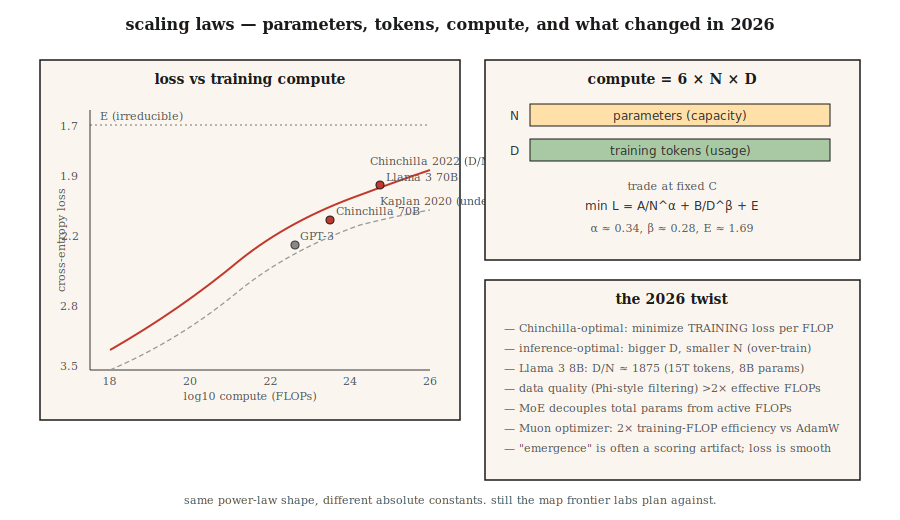

# 缩放定律

> 2020年的Kaplan论文称：模型越大，损失越小。2022年的Hoffmann论文表示：你训练不足。计算资源分为两部分——参数(Parameters)和词元(Tokens)——而如何分配并不明确。

**类型：** 学习
**语言：** Python
**先修条件：** 第七阶段 · 05（完整Transformer），第七阶段 · 07（GPT）
**时间：** 约45分钟

## 问题

当你拥有C次浮点运算(FLOPs)的训练计算量并希望得到最佳模型时，你面临两个旋钮：

1. **参数数量(N)？** 模型越大，容量越高。
2. **训练词元数量(D)？** 数据越多，容量利用越好。

FLOPs大致按`6 × N × D`缩放。你可以增加N减少D，或者增加D减少N。哪种更好？

在2022年之前，答案是“大力增加N”。GPT-3（2020年）拥有1750亿参数，在约3000亿个词元上训练。比率约为每个参数1.7个词元。Kaplan缩放定律支持了这一点。

Hoffmann等人（2022年）训练了一组小型模型称为Chinchilla，发现了不同之处：最优比率接近**每个参数20个词元**。GPT-3训练不足10倍。Chinchilla（700亿参数，1.4万亿词元）在每项基准测试中都击败了GPT-3（1750亿参数，3000亿词元），推理成本降低了2.5倍。

2026年是Chinchilla的世界——但有一个重要的转折。Llama 3 8B在15万亿个词元上训练，比率达到每个参数1875个词元。超过Chinchilla最优值94倍。对于将大规模使用的模型，推理成本比训练成本更重要，因此为了更小的部署规模而进行过度训练（超过Chinchilla）是2026年的默认做法。

## 核心概念



### Hoffmann定律

根据Chinchilla论文，损失函数如下：

```
L(N, D) = A / N^α + B / D^β + E
```

- `N` = 参数（非嵌入层）。
- `N` = 训练词元。
- `N`, `D`（大致对称）。
- `N`，不可约损失上限。
- `N`, `D`。

两个项在缩放时相互权衡。在固定计算量（C = 6ND）下对`N`求导并求解：

```
N_opt ≈ 0.6 × (C/6)^0.5
D_opt ≈ 0.6 × (C/6)^0.5
D_opt / N_opt ≈ 20
```

计算最优：每个参数20个词元。

### 为什么还要过度训练

Chinchilla最优最小化了每个训练FLOP的训练损失。但训练成本只付一次，推理成本却永远存在。

对于一个每月服务万亿词元的聊天机器人，推理成本占主导地位。Llama的方法：训练更小、更长。80亿参数在15万亿词元上训练是深度推理优化的：

- 适用于消费级GPU。
- 延迟仅为700亿参数Chinchilla最优模型的一小部分。
- 质量对于大多数任务来说足够接近。

DeepMind 2024年的论文（“过度训练是新的最优”）将其形式化。对于推理主导的工作负载，正确的比率更接近每个参数100–500个词元，具体取决于服务量。

### 涌现 vs 平滑性

声称：某些能力（算术、多步推理、思维链遵循）在某个规模下突然“涌现”。

Schaeffer等人（2023年）认为这是一种测量假象：涌现度量使用不连续的评分（精确匹配、阈值准确率），掩盖了底层logits中的平滑改进。连续度量（交叉熵）显示出平滑曲线。

到2026年，共识是：通过连续损失进行的预测是可靠的。基准测试的跳跃通常是评分者的假象。应根据连续度量来规划预算。

### 2026年的图景

缩放定律仍然有效，但是：

|  因素  |  改变了什么  |
|--------|-------------|
|  数据质量  |  策划“优质”词元（Phi风格）使曲线偏移超过2倍有效计算量 |
|  MoE  |  总参数与活跃FLOPs解耦；按活跃FLOP的缩放定律 |
|  后训练  |  某些能力（指令遵循、代码）随SFT+RLHF的变化比预训练更大 |
|  多模态  |  图像和文本词元一起缩放；每个模态有不同的曲线 |
| 合成数据 | 模型生成训练数据；有效计算可以复合 |

Muon优化器（Kimi Moonlight，2024）在匹配数据下显示了相较于AdamW约2倍的有效计算增益。一些2026年的训练运行默认使用Muon。这改变了缩放定律中的绝对常数，而非其形状。

```figure
scaling-laws
```

## 动手构建

参见`code/main.py`。我们实现了Chinchilla损失方程，并针对多个计算预算中的每一个求解计算最优的`(N, D)`。

### 第一步：Chinchilla损失

```python
def chinchilla_loss(N, D, A=406.4, B=410.7, alpha=0.34, beta=0.28, E=1.69):
    return A / N ** alpha + B / D ** beta + E
```

在固定`C = 6ND`下，将`L`绘制为关于`(N, D)`的等高线图。找到最小值。

### 第二步：计算最优前沿

对于从`1e17`到`1e25`FLOPs的计算预算，在满足`6ND = C`的条件下找到最小化损失的`(N, D)`。验证比率`D/N ≈ 20`。

### 第三步：过训练成本

计算训练一个10倍小的模型（最优N的1/10，最优D的10倍）所付出的额外损失。报告作为交换的推理FLOP节省（与N成正比）。

### 第四步：与真实模型比较

代入已知的GPT-3、Chinchilla、Llama 3 8B、DeepSeek-V3（活跃参数）的`(N, D)`对，并比较预测损失与报告损失。

## 使用它

你不太可能自己训练前沿模型。但缩放定律告诉你：

1. **你的微调是否有足够的数据。** 如果你的任务特定数据低于基础模型每个参数20个token，预计会在某个损失下限处饱和。
2. **是否选择更大的基础模型。** 如果你将所有预算都花在推理上，那么更倾向于更小、训练时间更长的模型。
3. **收益递减的地方。** 超过1000倍Chinchilla最优后，对数损失的变化变为噪声。

**2026年的研究轨迹：**

- **数据受限体制。** 网络上的高质量token数量有限（过滤后约5-10万亿英语token）。前沿预训练正在接近这个上限。合成数据、多语言、多模态和RLHF规模微调是接下来的杠杆。
- **计算倍增技巧。** Muon优化器、MoE、更好的数据管理——每个都改变了绝对常数，而非渐近线。
- **强化学习的缩放定律。** 开放问题。早期证据表明RL样本中存在幂律，但指数与预训练非常不同。

## 发布

参见`outputs/skill-training-budget-estimator.md`。该技能根据计算预算、部署约束和目标损失为新的训练运行选择`(N, D, hours, GPU)`。

## 练习

1. **简单。** 运行`code/main.py`。打印计算预算`1e20`、`1e22`、`1e24`下的Chinchilla最优`(N, D)`。与真实模型表进行比较。
2. **中等。** 实现Hoffmann的损失作为计算函数的曲线。针对计算最优前沿绘制损失与`code/main.py`的关系图。确定定律预测需要多少`(N, D)`FLOPs才能实现交叉熵的下一个0.1下降。
3. **困难。** 在5个在相同数据集上训练的小模型（100K到10M参数）上拟合你自己的缩放定律。估计`code/main.py`和`(N, D)`。你的指数与已发表的指数匹配得如何？

## 关键术语

|  术语  |  人们的说法  |  实际含义  |
|------|-----------------|-----------------------|
| 参数（N） | “模型大小” | 非嵌入权重数量；决定容量。 |
| Token（D） | “训练数据” | 已看到的训练token数量；决定参数被利用的程度。 |
| 计算（C） | “消耗的FLOPs” | 对于标准Transformer，大约为`6 × N × D`。 |
| Chinchilla最优 | “D/N ≈ 20” | 使每次预训练FLOP的损失最小化的比率。 |
| 过训练 | “超越Chinchilla” | 花费额外的训练FLOPs以节省推理FLOPs；D/N >> 20。 |
| 不可约损失 | “下限” | 缩放定律中的`E`项；数据本身的熵。 |
| 涌现能力 | “规模上的突然跳跃” | 通常是评分器的人为产物；连续损失是平滑的。 |
| 有效计算 | “训练效率倍增器” | 更好的数据/优化器/架构倍增了每个FLOP的效果。 |

## 延伸阅读

- [Kaplan et al. (2020). Scaling Laws for Neural Language Models](https://arxiv.org/abs/2001.08361)——第一篇缩放定律论文；训练不足。
- [Kaplan et al. (2020). Scaling Laws for Neural Language Models](https://arxiv.org/abs/2001.08361)——Chinchilla。
- [Kaplan et al. (2020). Scaling Laws for Neural Language Models](https://arxiv.org/abs/2001.08361)——涌现作为测量人为产物。
- [Kaplan et al. (2020). Scaling Laws for Neural Language Models](https://arxiv.org/abs/2001.08361)——为什么Llama的过训练适合其工作负载。
- [Kaplan et al. (2020). Scaling Laws for Neural Language Models](https://arxiv.org/abs/2001.08361)——2倍计算倍增。
