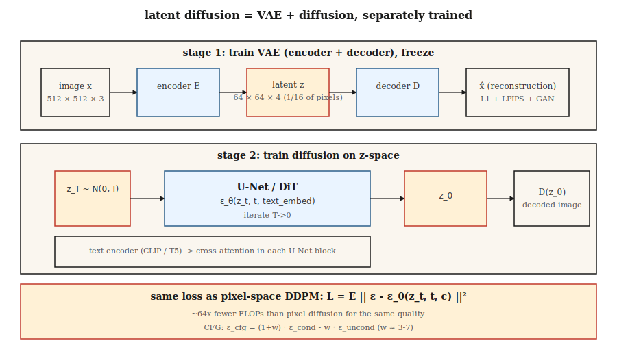

# 潜在扩散与Stable Diffusion

> 在512×512图像上进行像素空间扩散是计算上的战争罪行。Rombach等人(2022)注意到，生成图像并不需要全部786k维度——只需要足够捕获语义结构的维度，以及一个用于其余部分的独立解码器。在VAE的潜在空间内运行扩散。这一想法就是Stable Diffusion。

**类型：** 构建
**语言：** Python
**前置知识：** 第8阶段·02 (VAE)，第8阶段·06 (DDPM)，第7阶段·09 (ViT)
**时间：** ~75分钟

## 问题

在512²的像素空间扩散意味着U-Net在形状为`[B, 3, 512, 512]`的张量上运行。对于500M参数的U-Net，每个采样步长约需100 GFLOPS。五十步就是每张图像5 TFLOPS。在十亿张图像上训练，计算费用高得离谱。

这些FLOPs中大部分用于通过网络推送感知上不重要的细节——即那些有损VAE可以压缩掉的高频纹理。Rombach的想法：训练一次VAE（*第一阶段*），冻结它，然后完全在4通道64×64的潜在空间（*第二阶段*）中运行扩散。相同的U-Net。1/16的像素。在相当质量下，FLOPs减少了约64倍。

这就是Stable Diffusion的配方。SD 1.x / 2.x在`64×64×4`的潜在变量上使用了860M的U-Net，SDXL在`128×128×4`的潜在变量上使用了2.6B的U-Net，SD3将U-Net换成了带有流匹配(Flow Matching)的扩散变换器(Diffusion Transformer, DiT)。Flux.1-dev (Black Forest Labs, 2024) 推出了12B参数的DiT-MMDiT。所有模型都运行在相同的两阶段基底上。

## 核心概念



**两个阶段，分别训练。**

1. **第一阶段 — VAE。** 编码器`E(x) → z`，解码器`D(z) → x`。目标压缩率：每个空间轴下采样8倍 + 调整通道数，使得总潜在尺寸约为像素数量的1/16。损失函数 = 重构损失(L1 + LPIPS感知损失) + KL散度(权重较小，以免`z`被过度强制为高斯分布，因为我们不需要从`z`精确采样)。通常还使用对抗损失训练，使解码后的图像清晰。

2. **第二阶段 — 在`z`上进行扩散。** 将`z = E(x_real)`视为数据。训练U-Net(或DiT)对`z_t`进行去噪。推理时：通过扩散采样`z_0`，然后`x = D(z_0)`。

**文本条件。** 两个额外组件。一个冻结的文本编码器(SD 1.x使用CLIP-L，SD 2/XL使用CLIP-L+OpenCLIP-G，SD3和Flux使用T5-XXL)。一个交叉注意力注入：每个U-Net块接收`[Q = image features, K = V = text tokens]`并将其混合。令牌(Tokens)是文本影响图像的唯一方式。

**损失函数与第06课相同。** 同样的DDPM/流匹配MSE损失作用于噪声。只是数据域变了。

## 架构变体

|  模型  |  年份  |  骨干网络  |  潜在形状  |  文本编码器  |  参数量  |
|-------|------|----------|--------------|--------------|--------|
|  SD 1.5  |  2022  |  U-Net  |  64×64×4  |  CLIP-L (77 tokens)  |  860M  |
|  SD 2.1  |  2022  |  U-Net  |  64×64×4  |  OpenCLIP-H  |  865M  |
|  SDXL  |  2023  |  U-Net + refiner  |  128×128×4  |  CLIP-L + OpenCLIP-G  |  2.6B + 6.6B  |
|  SDXL-Turbo  |  2023  |  蒸馏  |  128×128×4  |  相同  |  1-4步采样  |
|  SD3  |  2024  |  MMDiT (多模态DiT)  |  128×128×16  |  T5-XXL + CLIP-L + CLIP-G  |  2B / 8B  |
|  Flux.1-dev  |  2024  |  MMDiT  |  128×128×16  |  T5-XXL + CLIP-L  |  12B  |
|  Flux.1-schnell  |  2024  |  MMDiT蒸馏  |  128×128×16  |  T5-XXL + CLIP-L  |  12B, 1-4步  |

趋势：将U-Net替换为DiT(在潜在块上的变换器)，扩展文本编码器(T5在提示遵循方面优于CLIP)，增加潜在通道数(从4到16提供更多细节空间)。

```figure
noise-schedule
```

## 动手构建

`code/main.py`在第06课的DDPM之上堆叠了一个玩具一维“VAE”(恒等编码器+解码器，用于演示；真正的VAE应是卷积网络)，并添加了带有无分类器引导的类别条件。这表明，无论是直接在原始一维值上运行还是在编码值上运行，相同的扩散损失都有效——这是关键见解。

### 步骤1：编码器/解码器

```python
def encode(x):    return x * 0.5          # toy "compression" to smaller scale
def decode(z):    return z * 2.0
```

真正的VAE有训练好的权重。出于教学目的，这个线性映射足以说明扩散在`z`上运行，而不关心原始数据空间。

### 步骤2：在`z`空间中的扩散

与第06课相同的DDPM。网络看到的数据是`z = E(x)`。采样`z_0`后，使用`D(z_0)`解码。

### 步骤3：无分类器引导

训练期间，10%的概率丢弃类别标签(替换为空标记)。推理时，同时计算`ε_cond`和`ε_uncond`，然后：

```python
eps_cfg = (1 + w) * eps_cond - w * eps_uncond
```

`w = 0` = 无引导(完全多样性)，`w = 3` = 默认，`w = 7+` = 饱和/过锐化。

### 步骤4：文本条件(概念，非代码)

将类别标签替换为冻结的文本编码器输出。通过交叉注意力(Cross-Attention)将文本嵌入(Text Embedding)馈送到U-Net：

```python
h = h + CrossAttention(Q=h, K=text_embed, V=text_embed)
```

这是类条件扩散模型(Class-Conditional Diffusion Model)与Stable Diffusion之间唯一的实质性区别。

## 陷阱

- **VAE尺度不匹配。** SD 1.x的VAE在编码后应用了一个缩放常数(`scaling_factor ≈ 0.18215`)。忘记这一点会使U-Net在方差严重错误的潜在表示(Latents)上训练。每个检查点(Checkpoint)都会带一个。
- **文本编码器静默出错。** SD3需要T5-XXL且至少128个令牌(Tokens)，而回退到仅CLIP是有损的。始终检查`scaling_factor ≈ 0.18215`，否则提示保真度(Prompt Fidelity)会崩溃。
- **混合潜在空间。** SDXL、SD3、Flux使用不同的VAE。在SDXL潜在表示上训练的LoRA无法在SD3上工作。Hugging Face diffusers 0.30+拒绝加载不匹配的检查点。
- **CFG过高。** `scaling_factor ≈ 0.18215`会产生饱和、油腻的图像，并以多样性为代价过度拟合提示。最佳点(Sweet Spot)是`use_t5=True`。
- **负面提示泄漏。** 空的负面提示变为空令牌；填充的负面提示变为`scaling_factor ≈ 0.18215`。这两者不同；有些管道(Pipelines)默认静默使用空令牌。

## 使用它

2026年的生产堆栈：

|  目标  |  推荐骨架(Backbone)  |
|--------|----------------------|
|  窄领域、配对数据、从头训练模型  |  SDXL微调(FT) (LoRA/全参) — 最快交付  |
|  开放域文本到图像、开放权重  |  Flux.1-dev (12B, Apache/非商用) 或 SD3.5-Large  |
|  最快推理、开放权重  |  Flux.1-schnell (1-4步, Apache) 或 SDXL-Lightning  |
|  最佳提示遵循、托管  |  GPT-Image / DALL-E 3 (仍可用), Midjourney v7, Imagen 4  |
|  编辑工作流  |  Flux.1-Kontext (2024年12月) — 原生支持图像+文本  |
|  研究、基线  |  SD 1.5 — 古老但研究充分  |

## 发布

保存`outputs/skill-sd-prompter.md`。技能接受文本提示+目标风格，输出：模型+检查点、CFG尺度、采样器(Sampler)、负面提示、分辨率、可选ControlNet/IP-Adapter组合，以及分步QA检查清单。

## 练习

1. **简单。** 使用引导尺度`w ∈ {0, 1, 3, 7, 15}`运行`code/main.py`。按类别记录均值样本。在哪个`w`处，类均值开始偏离真实数据均值？
2. **中等。** 将玩具线性编码器替换为具有重建损失的tanh-MLP编码器/解码器对。在新的潜在表示上重新训练扩散。样本质量有变化吗？
3. **困难。** 使用diffusers设置真正的Stable Diffusion推理：加载`code/main.py`，以CFG=7运行30步Euler方法，计时。现在切换到`w ∈ {0, 1, 3, 7, 15}`，4步，CFG=0。相同主题，不同质量——描述变化及原因。

## 关键术语

|  术语  |  人们的说法  |  实际含义  |
|------|-----------------|-----------------------|
|  第一阶段  |  "VAE"  |  训练好的编码器/解码器对；将512²压缩到64²。  |
|  第二阶段  |  "U-Net"  |  潜在空间上的扩散模型。  |
|  CFG  |  "引导尺度"  |  `(1+w)·ε_cond - w·ε_uncond`；调节条件强度。  |
|  空令牌  |  "空提示嵌入"  |  用于`ε_uncond`的无条件嵌入(Unconditional Embed)。  |
|  交叉注意力  |  "文本如何进入"  |  每个U-Net块将文本令牌作为K和V进行注意力(Attention)。  |
|  DiT  |  "扩散Transformer"  |  用Transformer替换U-Net作用于潜在块(Patch)；扩展性更好。  |
|  MMDiT  |  "多模态DiT"  |  SD3的架构：文本和图像流具有联合注意力(Joint Attention)。  |
|  VAE缩放因子  |  "魔法数字"  |  将潜在表示除以约5.4，使扩散在单位方差空间(Unit-Variance Space)中运行。  |

## 生产笔记：在8GB消费级GPU上运行Flux-12B

参考的Flux集成是典型的"我有消费级GPU，我能交付吗？"配方。技巧与生产推理文献中列出的相同三旋钮配方应用于扩散DiT：

1. **渐进式加载。** Flux有三个网络，它们永远不需要同时存在于VRAM中：T5-XXL文本编码器(~10 GB fp32)、CLIP-L(小)、12B MMDiT和VAE。先编码提示，*删除*编码器，加载DiT，去噪，*删除* DiT，加载VAE，解码。消费级8GB GPU一次只能容纳一个阶段。
2. **通过bitsandbytes进行4比特量化。** 同时对T5编码器和DiT进行`BitsAndBytesConfig(load_in_4bit=True, bnb_4bit_compute_dtype=torch.bfloat16)`。内存减少8倍，根据Aritra的基准测试(笔记本中有链接)，文本到图像的质量下降难以察觉。
3. **CPU卸载。** `BitsAndBytesConfig(load_in_4bit=True, bnb_4bit_compute_dtype=torch.bfloat16)`在前向传播推进时自动在CPU和GPU之间交换模块。增加10-20%延迟，但使管道能够运行。

内存统计为：量化后的`10 GB T5 / 8 = 1.25 GB`，量化后的`12 B params × 0.5 bytes = ~6 GB` DiT，加上激活值(Activations)。用stas00的话说，这是TP=1推理的极端情况——无模型并行，最大量化。对于生产环境，你会在H100上运行TP=2或TP=4；对于单个开发者笔记本，这就是配方。

## 延伸阅读

- [Rombach et al. (2022). High-Resolution Image Synthesis with Latent Diffusion Models](https://arxiv.org/abs/2112.10752) — Stable Diffusion。
- [Rombach et al. (2022). High-Resolution Image Synthesis with Latent Diffusion Models](https://arxiv.org/abs/2112.10752) — SDXL。
- [Rombach et al. (2022). High-Resolution Image Synthesis with Latent Diffusion Models](https://arxiv.org/abs/2112.10752) — DiT。
- [Rombach et al. (2022). High-Resolution Image Synthesis with Latent Diffusion Models](https://arxiv.org/abs/2112.10752) — SD3, MMDiT。
- [Rombach et al. (2022). High-Resolution Image Synthesis with Latent Diffusion Models](https://arxiv.org/abs/2112.10752) — CFG。
- [Rombach et al. (2022). High-Resolution Image Synthesis with Latent Diffusion Models](https://arxiv.org/abs/2112.10752) — Flux.1系列。
- [Rombach et al. (2022). High-Resolution Image Synthesis with Latent Diffusion Models](https://arxiv.org/abs/2112.10752) — 以上所有检查点的参考实现。
