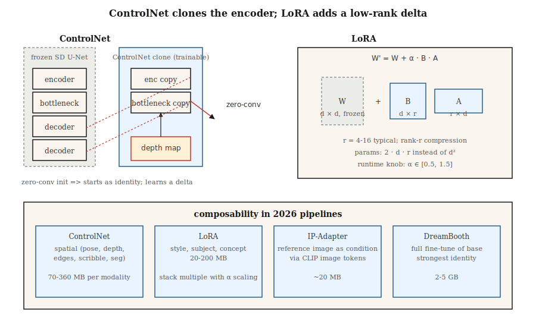

# ControlNet、LoRA 与条件控制

> 仅靠文本是一种笨拙的控制信号。ControlNet 让你克隆一个预训练的扩散模型，并用深度图、姿态骨架、涂鸦或边缘图像来引导它。LoRA 让你通过训练一千万个参数来微调一个 2B 参数模型。两者结合将 Stable Diffusion 从一个玩具变成了 2026 年所有机构都在使用的图像管线。

**类型：** 构建
**语言：** Python
**先决条件：** 第 8 阶段·07（潜在扩散），第 10 阶段（从头构建 LLM——为 LoRA 打基础）
**时间：** 约 75 分钟

## 问题

像“一位穿着红裙的女人在繁忙街道上遛狗”这样的提示，并没有给模型任何关于*狗在哪里*、*女人是什么姿势*或*街道的视角*的信息。文本只固定了指定图像所需的大约 10% 的信息。其余的是视觉信息，无法用文字有效描述。

为每一种信号（姿态、深度、Canny 边缘、分割）从头训练一个新的条件模型是 prohibitively expensive 的。你希望保持 2.6B 参数的 SDXL 主干冻结，附加一个小型侧网络来读取条件信号，并让它微调主干的中间特征。这就是 ControlNet。

你还需要教会模型新的概念（你的脸、你的产品、你的风格），而无需重新训练整个模型。你需要一个规模小 100 倍的增量。这就是 LoRA——低秩适配器，插入到现有的注意力权重中。

ControlNet + LoRA + 文本 = 2026 年实践者的工具箱。大多数生产级图像管线会在 SDXL / SD3 / Flux 基座之上叠加 2-5 个 LoRA、1-3 个 ControlNet 和一个 IP-Adapter。

## 核心概念



### ControlNet（Zhang 等人，2023）

取一个预训练的 SD。*克隆* U-Net 的编码器部分。冻结原始部分。训练克隆版以接受额外的条件输入（边缘、深度、姿态）。通过*零卷积*跳跃连接（1×1 卷积初始化为零——开始时无操作，学习一个增量）将克隆版连接回原始解码器部分。

```
SD U-Net decoder:   ... ← orig_enc_features + zero_conv(controlnet_enc(condition))
```

零卷积初始化意味着 ControlNet 从恒等映射开始——即使训练前也没有任何损害。使用 1M 个（提示、条件、图像）三元组和标准扩散损失进行训练。

每种模态的 ControlNet 以小型侧模型形式提供（SDXL 约 360M，SD 1.5 约 70M）。你可以在推理时组合它们：

```
features += weight_a * control_a(depth) + weight_b * control_b(pose)
```

### LoRA（Hu 等人，2021）

对于模型中的任何线性层 `W ∈ R^{d×d}`，冻结 `W` 并添加一个低秩增量：

```
W' = W + ΔW,  ΔW = B @ A,  A ∈ R^{r×d},  B ∈ R^{d×r}
```

其中 `r << d`。对于注意力层，秩 4-16 是标准，对于重度微调，秩 64-128。新参数数量：`2 · d · r` 而不是 `d²`。对于 SDXL 注意力层，`d=640`，`r=16`：每个适配器 2 万参数而不是 41 万——减少了 20 倍。纵观整个模型：一个 LoRA 通常为 20-200MB，而基础模型为 5GB。

在推理时，你可以缩放 LoRA：`W' = W + α · B @ A`。`α = 0.5-1.5` 是正常情况。多个 LoRA 可以叠加相加（通常的注意事项是它们以非线性方式相互作用）。

### IP-Adapter（Ye 等人，2023）

一个微小的适配器，接受*图像*作为条件（与文本一起）。使用 CLIP 图像编码器生成图像令牌，并将它们与文本令牌一起注入交叉注意力层。每个基础模型约 20MB。让你无需 LoRA 即可“生成此参考风格的图像”。

## 组合性矩阵

|  工具  |  控制内容  |  大小  |  使用时机  |
|------|------------------|------|-------------|
|  ControlNet  |  空间结构（姿态、深度、边缘）  |  70-360MB  |  精确布局、构图  |
|  LoRA  |  风格、主体、概念  |  20-200MB  |  个性化、风格  |
|  IP-Adapter  |  参考图像的风格或主体  |  20MB  |  文本无法描述外观  |
|  Textual Inversion  |  单一概念作为新令牌  |  10KB  |  旧方法，已被 LoRA 取代  |
|  DreamBooth  |  对主体进行全微调  |  2-5GB  |  强特征，高计算量  |
|  T2I-Adapter  |  更轻量的 ControlNet 替代  |  70MB  |  边缘设备，推理预算有限  |

ControlNet ≈ 空间控制。LoRA ≈ 语义控制。两者兼用。

## 动手构建

`code/main.py` 在 1-D 上模拟这两种机制：

1. **LoRA.** 一个预训练的线性层 `W`。冻结它。训练一个低秩 `B @ A` 使得 `W + BA` 匹配目标线性层。证明 `r = 1` 足以完美学习一个秩-1 修正。

2. **ControlNet-lite.** 一个“冻结的基础”预测器和一个读取额外信号的“侧网络”。侧网络的输出由一个初始化为零的可学习标量（我们的零卷积版本）控制。训练并观察该标量逐渐增大。

### 步骤 1：LoRA 数学

```python
def lora(W, A, B, x, alpha=1.0):
    # W is frozen; A, B are the trainable low-rank factors.
    return [W[i][j] * x[j] for i, j in ...] + alpha * (B @ (A @ x))
```

### 步骤2：零初始化侧网络

```python
side_out = control_net(x, condition)
gated = gate * side_out  # gate initialized to 0
h = base(x) + gated
```

在第0步，输出与基础模型相同。早期训练更新`gate`缓慢——没有灾难性漂移。

## 陷阱

- **过度缩放LoRA。** `α = 2`或`α = 3`是一种常见的“增强”技巧，会导致过度风格化/破损的输出。保持`α ≤ 1.5`。
- **ControlNet权重冲突。** 使用权重为1.0的姿态ControlNet和权重为1.0的深度ControlNet通常会导致过度。权重总和≈1.0是安全的默认值。
- **LoRA基座错误。** SDXL LoRA在SD 1.5上静默无效，因为注意力维度不匹配。Diffusers将在0.30+版本中发出警告。
- **文本反转漂移。** 在一个检查点上训练的令牌在另一个检查点上严重漂移。LoRA更具可移植性。
- **LoRA权重合并与存储。** 你可以将LoRA烘焙到基础模型权重中以加快推理（无需运行时加法），但会失去在运行时缩放`α = 2`的能力。保留两个版本。

## 使用它

|  目标  |  2026管道  |
|------|---------------|
|  重现品牌艺术风格  |  在秩32下对约30张精选图像训练的LoRA  |
|  将我的脸放入生成图像  |  DreamBooth或LoRA + IP-Adapter-FaceID  |
|  特定姿态 + 提示  |  ControlNet-Openpose + SDXL + 文本  |
|  深度感知构图  |  ControlNet-Depth + SD3  |
|  参考图像 + 提示  |  IP-Adapter + 文本  |
|  精确布局  |  ControlNet-Scribble或ControlNet-Canny  |
|  背景替换  |  ControlNet-Seg + 修补（第09课）  |
|  快速一步风格  |  SDXL-Turbo上的LCM-LoRA  |

## 发布

保存`outputs/skill-sd-toolkit-composer.md`。技能接受一个任务（输入资源：提示、可选参考图像、可选姿态、可选深度、可选涂鸦）并输出工具栈、权重和可重现的种子协议。

## 练习

1. **简单。** 在`code/main.py`中，将LoRA秩`r`从1变化到4。在什么秩下，LoRA恰好匹配秩为2的目标德尔塔？
2. **中等。** 在两个目标变换上分别训练两个LoRA。将它们一起加载并展示它们的加性交互。什么时候交互打破线性？
3. **困难。** 使用diffusers堆叠：SDXL基础 + Canny-ControlNet（权重0.8）+ 风格LoRA（α 0.8）+ IP-Adapter（权重0.6）。随着栈权重的变化，测量FID与提示遵从性的权衡。

## 关键术语

|  术语  |  人们的说法  |  实际含义  |
|------|-----------------|-----------------------|
|  ControlNet  |  "空间控制"  |  克隆编码器 + 零卷积跳跃；读取条件图像。  |
|  零卷积  |  "以恒等开始"  |  1×1卷积初始化为零；ControlNet从无操作开始。  |
|  LoRA  |  "低秩适配器"  |  `W + B @ A`, `r << d`；参数比全微调少100倍。  |
|  秩r  |  "旋钮"  |  LoRA压缩；典型4-16，64以上用于重度个性化。  |
|  α  |  "LoRA强度"  |  LoRA德尔塔的运行时缩放。  |
|  IP-Adapter  |  "参考图像"  |  通过CLIP图像令牌的小型图像条件适配器。  |
|  DreamBooth  |  "全主体微调"  |  在主体的约30张图像上训练整个模型。  |
|  文本反转  |  "新令牌"  |  仅学习新的词嵌入；遗留方法，大多已被取代。  |

## 生产说明：LoRA交换、ControlNet通道、多租户服务

一个真实的文本到图像SaaS在同一基础检查点上服务数百个LoRA和十几个ControlNet。服务问题看起来很像LLM多租户（生产文献在连续批处理和LoRAX/S-LoRA下涵盖了LLM案例）：

- **热交换LoRA，不要合并。** 将`W' = W + α·B·A`合并到基础中，每步推理速度提升约3-5%，但冻结了`α`和基础。将LoRA作为秩-r德尔塔保持在VRAM中；diffusers提供了`pipe.load_lora_weights()` + `pipe.set_adapters([...], adapter_weights=[...])`用于每个请求的激活。交换成本是`2 · d · r · num_layers`权重——MB级别，亚秒级。
- **ControlNet作为第二注意力通道。** 克隆编码器与基础并行运行。两个权重各为1.0的ControlNet = 每步两次额外前向传播，而不是一次合并传播。批量大小的余量呈二次方下降。每个活动ControlNet预算约1.5倍步成本。
- **量化LoRA也可行。** 如果你量化了基础（见第07课，8GB上的Flux），LoRA德尔塔也干净地量化到8位或4位。QLoRA风格的加载让你可以在4位Flux基础上堆叠5-10个LoRA而不耗尽内存。

Flux特有：Niels的Flux-on-8GB笔记本将基础量化为4位；在该量化基础之上以`weight_name="pytorch_lora_weights.safetensors"`堆叠风格LoRA（`pipe.load_lora_weights("user/style-lora")`）仍然有效。这是大多数SaaS机构在2026年采用的方案。

## 延伸阅读

- [Zhang, Rao, Agrawala (2023). Adding Conditional Control to Text-to-Image Diffusion Models](https://arxiv.org/abs/2302.05543) — ControlNet。
- [Zhang, Rao, Agrawala (2023). Adding Conditional Control to Text-to-Image Diffusion Models](https://arxiv.org/abs/2302.05543) — LoRA（最初用于LLM；移植到扩散）。
- [Zhang, Rao, Agrawala (2023). Adding Conditional Control to Text-to-Image Diffusion Models](https://arxiv.org/abs/2302.05543) — IP-Adapter。
- [Zhang, Rao, Agrawala (2023). Adding Conditional Control to Text-to-Image Diffusion Models](https://arxiv.org/abs/2302.05543) — ControlNet的更轻量替代方案。
- [Zhang, Rao, Agrawala (2023). Adding Conditional Control to Text-to-Image Diffusion Models](https://arxiv.org/abs/2302.05543) — DreamBooth。
- [Zhang, Rao, Agrawala (2023). Adding Conditional Control to Text-to-Image Diffusion Models](https://arxiv.org/abs/2302.05543) — 参考管道。
