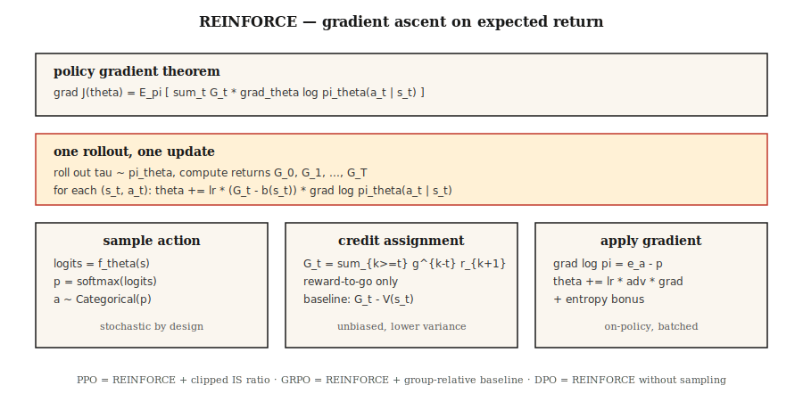

# 策略梯度 — 从头实现 REINFORCE

> 别再估计值了。直接参数化策略(Policy)，计算期望回报的梯度，沿梯度上升。Williams (1992) 用一条定理就阐明了这一点。这就是 PPO、GRPO 以及所有大语言模型强化学习循环存在的基础。

**类型:** 构建
**语言:** Python
**前置知识:** 阶段3·03 (反向传播), 阶段9·03 (蒙特卡洛), 阶段9·04 (时序差分学习)
**时间:** ~75 分钟

## 问题

Q-learning 和 DQN 参数化的是*价值*(Value)函数。你通过 `argmax Q` 选择动作。这在离散动作和离散状态下没问题。但当动作连续时（比如在10维力矩上 `argmax`？）或者你想要随机策略时（`argmax` 本质上是确定性的），它就不奏效了。

策略梯度( Policy Gradient) 转而参数化*策略*。`π_θ(a | s)` 是一个神经网络，输出动作上的分布。从中采样来行动。计算期望回报关于 `θ` 的梯度。沿梯度上升。没有 `argmax`。没有贝尔曼递归。仅仅是关于 `J(θ) = E_{π_θ}[G]` 的梯度上升。

REINFORCE 定理 (Williams 1992) 告诉我们这个梯度是可计算的：`∇J(θ) = E_π[ G · ∇_θ log π_θ(a | s) ]`。运行一个回合。计算回报。每一步乘以 `∇ log π_θ(a | s)`。平均。梯度上升。完成。

2026 年的每一个大语言模型强化学习算法——PPO、DPO、GRPO——都是对 REINFORCE 的改进。将它的原理了然于胸是学习本阶段剩余内容、以及阶段10·07 (RLHF实现) 和阶段10·08 (DPO) 的前提。

## 核心概念



**策略梯度定理。** 对于由 `π_θ` 参数化的任意策略 `θ`：

`∇J(θ) = E_{τ ~ π_θ}[ Σ_{t=0}^{T} G_t · ∇_θ log π_θ(a_t | s_t) ]`

其中 `G_t = Σ_{k=t}^{T} γ^{k-t} r_{k+1}` 是从步骤 `t` 开始的折扣回报。期望是对从 `π_θ` 采样的完整轨迹 `τ` 取的。

**证明很短。** 对期望内的 `J(θ) = Σ_τ P(τ; θ) G(τ)` 求导。使用 `∇P(τ; θ) = P(τ; θ) ∇ log P(τ; θ)`（对数导数技巧）。分解 `log P(τ; θ) = Σ log π_θ(a_t | s_t) + environment terms that do not depend on θ`。环境项消失。两行代数就给出了定理。

**方差缩减技巧。** 原始 REINFORCE 方差极大——回报有噪声，`∇ log π` 有噪声，它们的乘积噪声更大。两个标准修复：

1. **基线减法。** 将 `G_t` 替换为 `G_t - b(s_t)`，其中基线 `b(s_t)` 不依赖于 `a_t`。无偏性源于 `E[b(s_t) · ∇ log π(a_t | s_t)] = 0`。典型选择：由评论家(Critic)学习的 `b(s_t) = V̂(s_t)` → 演员-评论家(Actor-Critic)（第07课）。
2. **剩余回报。** 将 `G_t` 替换为 `G_t - b(s_t)`。对于给定动作，只有未来回报相关——过去回报贡献零均值噪声。

结合两者，得到：

`∇J ≈ (1/N) Σ_{i=1}^{N} Σ_{t=0}^{T_i} [ G_t^{(i)} - V̂(s_t^{(i)}) ] · ∇_θ log π_θ(a_t^{(i)} | s_t^{(i)})`

这就是带基线的 REINFORCE——A2C（第07课）和 PPO（第08课）的直接前身。

**Softmax 策略参数化。** 对于离散动作，标准选择：

`π_θ(a | s) = exp(f_θ(s, a)) / Σ_{a'} exp(f_θ(s, a'))`

其中 `f_θ` 是任何为每个动作输出得分的神经网络。梯度有简洁形式：

`∇_θ log π_θ(a | s) = ∇_θ f_θ(s, a) - Σ_{a'} π_θ(a' | s) ∇_θ f_θ(s, a')`

即，所选动作的得分减去其在策略下的期望值。

**连续动作的高斯策略。** `π_θ(a | s) = N(μ_θ(s), σ_θ(s))`。`∇ log N(a; μ, σ)` 有闭式解。这正是阶段9·07的 SAC 所需要的。

```figure
policy-gradient-landscape
```

## 动手构建

### 步骤1：softmax 策略网络

```python
def policy_logits(theta, state_features):
    return [dot(theta[a], state_features) for a in range(N_ACTIONS)]

def softmax(logits):
    m = max(logits)
    exps = [exp(l - m) for l in logits]
    Z = sum(exps)
    return [e / Z for e in exps]
```

对表格环境使用线性策略（每个动作一个权重向量）。对于 Atari，换成 CNN 并保留 softmax 输出层。

### 步骤2：采样和对数概率

```python
def sample_action(probs, rng):
    x = rng.random()
    cum = 0
    for a, p in enumerate(probs):
        cum += p
        if x <= cum:
            return a
    return len(probs) - 1

def log_prob(probs, a):
    return log(probs[a] + 1e-12)
```

### 步骤3：轨迹展开并捕获对数概率

```python
def rollout(theta, env, rng, gamma):
    trajectory = []
    s = env.reset()
    while not done:
        logits = policy_logits(theta, s)
        probs = softmax(logits)
        a = sample_action(probs, rng)
        s_next, r, done = env.step(s, a)
        trajectory.append((s, a, r, probs))
        s = s_next
    return trajectory
```

### 步骤4：REINFORCE 更新

```python
def reinforce_step(theta, trajectory, gamma, lr, baseline=0.0):
    returns = compute_returns(trajectory, gamma)
    for (s, a, _, probs), G in zip(trajectory, returns):
        advantage = G - baseline
        grad_log_pi_a = [-p for p in probs]
        grad_log_pi_a[a] += 1.0
        for i in range(N_ACTIONS):
            for j in range(len(s)):
                theta[i][j] += lr * advantage * grad_log_pi_a[i] * s[j]
```

梯度 `∇ log π(a|s) = e_a - π(·|s)`（`a` 的独热编码减去概率）是 softmax 策略梯度的核心。将它牢牢记住。

### 步骤5：基线

近几回合 `G` 的滑动均值足以让 4×4 网格世界运行起来方差缩减；大约需要 500 回合收敛。将基线升级为学习的 `V̂(s)` 就得到了演员-评论家。

## 陷阱

- **梯度爆炸。** 回报可能很大。在乘以 `∇ log π` 之前，始终将 `G` 在批次内归一化到 `~N(0, 1)`。
- **熵坍塌。** 策略过早收敛到近乎确定性的动作，停止探索，陷入困境。修复方法：在目标函数中加入熵奖励 `G`。
- **高方差。** 原始 REINFORCE 需要数千回合。使用评论家基线（第07课）或 TRPO/PPO 的信任区域（第08课）是标准修复。
- **样本效率低。** 在线策略意味着每次更新后丢弃所有转移。通过重要性采样进行离线策略修正可以复用数据，但代价是方差增加（PPO 的比率是一个裁剪后的重要性采样权重）。
- **非平稳梯度。** 100 回合前的梯度使用的是旧的 `G`。因此在线策略方法每隔几轮 rollout 就更新一次。
- **信用分配。** 没有剩余回报时，过去回报贡献噪声。始终使用剩余回报。

## 使用它

2026 年，REINFORCE 很少直接运行，但其梯度公式无处不在：

|  用例  |  衍生方法  |
|----------|---------------|
|  连续控制  |  使用高斯策略的 PPO/SAC  |
|  LLM RLHF  |  使用KL惩罚的PPO，运行在token级策略上  |
|  LLM推理 (DeepSeek)  |  GRPO — 使用组相对基线的REINFORCE，无批评家  |
|  多智能体  |  集中式批评家REINFORCE (MADDPG, COMA)  |
|  离散动作机器人  |  A2C, A3C, PPO  |
|  仅偏好设定  |  DPO — 重写为偏好似然损失的REINFORCE，无采样  |

当你在2026年的训练脚本中看到`loss = -advantage * log_prob`时，那就是带基线的REINFORCE。整篇论文(DPO, GRPO, RLOO)都是在这一行代码之上的方差缩减技巧。

## 发布

保存为 `outputs/skill-policy-gradient-trainer.md`：

```markdown
---
name: policy-gradient-trainer
description: Produce a REINFORCE / actor-critic / PPO training config for a given task and diagnose variance issues.
version: 1.0.0
phase: 9
lesson: 6
tags: [rl, policy-gradient, reinforce]
---

Given an environment (discrete / continuous actions, horizon, reward stats), output:

1. Policy head. Softmax (discrete) or Gaussian (continuous) with parameter counts.
2. Baseline. None (vanilla), running mean, learned `V̂(s)`, or A2C critic.
3. Variance controls. Reward-to-go on by default, return normalization, gradient clip value.
4. Entropy bonus. Coefficient β and decay schedule.
5. Batch size. Episodes per update; on-policy data freshness contract.

Refuse REINFORCE-no-baseline on horizons > 500 steps. Refuse continuous-action control with a softmax head. Flag any run with `β = 0` and observed policy entropy < 0.1 as entropy-collapsed.
```

## 练习

1. **简单.** 在4×4网格世界上使用线性softmax策略实现REINFORCE。训练1000个回合，无基线。绘制学习曲线；测量方差(收益的标准差)。
2. **中等.** 添加运行均值基线。再次训练。比较样本效率和方差与原始运行。基线将收敛步数减少了多少？
3. **困难.** 添加熵奖励`β · H(π)`。扫描`β ∈ {0, 0.01, 0.1, 1.0}`。绘制最终收益和策略熵。此任务的最佳点在哪里？

## 关键术语

|  术语  |  人们的说法  |  实际含义  |
|------|-----------------|-----------------------|
|  策略梯度  |  "直接训练策略"  |  `∇J(θ) = E[G · ∇ log π_θ(a\ | s)]`; 从对数导数技巧推导得出。  |
|  REINFORCE  |  "原始PG算法"  |  Williams (1992); 蒙特卡洛收益乘以对数策略梯度。  |
|  对数导数技巧  |  "得分函数估计器"  |  `∇P(τ;θ) = P(τ;θ) · ∇ log P(τ;θ)`; 使期望的梯度易于处理。  |
|  基线  |  "方差缩减"  |  从`G`中减去任何`b(s)`; 无偏因为`E[b · ∇ log π] = 0`。  |
|  剩余奖励  |  "仅未来收益计数"  |  使用`G_t^{from t}`而不是完整的`G_0`; 正确且方差更低。  |
|  熵奖励  |  "鼓励探索"  |  `+β · H(π(·\ | s))`项防止策略崩溃。  |
|  同策略  |  "在刚看到的数据上训练"  |  梯度期望相对于当前策略 — 不能直接重用旧数据。  |
|  优势  |  "比平均好多少"  |  `A(s, a) = G(s, a) - V(s)`; 带基线的REINFORCE乘以此带符号量。  |

## 延伸阅读

- [Williams (1992). Simple Statistical Gradient-Following Algorithms for Connectionist Reinforcement Learning](https://link.springer.com/article/10.1007/BF00992696) — 原始REINFORCE论文。
- [Williams (1992). Simple Statistical Gradient-Following Algorithms for Connectionist Reinforcement Learning](https://link.springer.com/article/10.1007/BF00992696) — 带函数逼近的现代策略梯度定理。
- [Williams (1992). Simple Statistical Gradient-Following Algorithms for Connectionist Reinforcement Learning](https://link.springer.com/article/10.1007/BF00992696) — 教科书式介绍。
- [Williams (1992). Simple Statistical Gradient-Following Algorithms for Connectionist Reinforcement Learning](https://link.springer.com/article/10.1007/BF00992696) — 带有PyTorch代码的清晰教学阐述。
- [Williams (1992). Simple Statistical Gradient-Following Algorithms for Connectionist Reinforcement Learning](https://link.springer.com/article/10.1007/BF00992696) — 方差缩减和将REINFORCE与信任区域家族(TRPO, PPO)连接的自然梯度视角。
