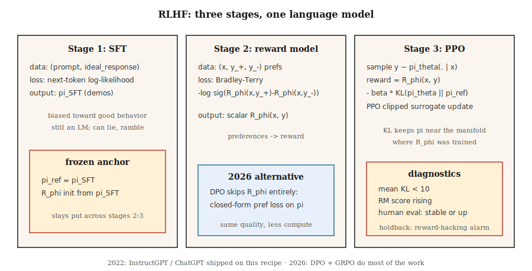

# 奖励建模与人类反馈强化学习(Reward Modeling & RLHF)

> 人类无法为"好的助手回复"编写奖励函数(reward function)，但他们可以比较两个回复并选出更好的一个。拟合一个奖励模型(reward model)来进行这些比较，然后对语言模型进行强化学习(RL)来对抗该模型。Christiano 2017。InstructGPT 2022。这个配方将GPT-3变成了ChatGPT。到2026年，它大部分被DPO取代——但思维模型保持不变。

**类型：** 构建
**语言：** Python
**前置条件：** 阶段5 · 05（情感分析），阶段9 · 08（PPO）
**时间：** ~45分钟

## 问题

你训练了一个基于下一个词预测目标(next-token-prediction objective)的语言模型。它能写出语法正确的英语。但它也会撒谎、胡言乱语，并且拒绝拒绝。你无法通过更多的预训练来解决这个问题——网络文本是问题所在，而不是解药。

你想要一个*标量奖励(scalar reward)*，用于表示"对于指令X，回复A比回复B更好"。手工编写那个奖励函数是不可能的。"有用性(Helpfulness)"并不是关于词元(token)的闭式表达(closed-form expression)。但人类可以比较两个输出并标记偏好。这在大规模收集上是廉价的。

RLHF（Christiano 等人 2017；Ouyang 等人 2022）将偏好转换为奖励模型，然后通过PPO针对该奖励优化LM。分三步：SFT → RM → PPO。这个配方诞生了ChatGPT、Claude、Gemini以及2023-2025年间所有其他对齐的大语言模型(aligned-LLM)。

到2026年，PPO步骤大部分被DPO（阶段10·08）取代，因为它更便宜且在对齐微调方面几乎同样好。但是*奖励模型*部分仍然是每个Best-of-N采样器、每个基于可验证奖励的强化学习(RL-from-verifiable-rewards)流水线以及每个使用过程奖励模型(process reward model)的推理模型的基础。理解了RLHF，你就理解了整个对齐栈(alignment stack)。

## 核心概念



**阶段1：监督微调(Supervised Fine-Tuning, SFT)。** 从预训练基础模型开始。在目标行为（遵循指令的回复、有帮助的回复等）的人工编写的示范数据上微调。结果：一个模型`π_SFT`，它*偏向良好行为*但仍具有无界动作空间(unbounded action space)。

**阶段2：奖励模型训练。**

- 收集回复对`(y_+, y_-)`对提示(prompts)`x`，由人类标记为"y_+优于y_-"。
- 训练一个奖励模型`(y_+, y_-)`，使其为`x`分配更高的分数。
- 损失函数：**Bradley-Terry成对逻辑回归(Bradley-Terry pairwise logistic)**：

  `L(φ) = -E[ log σ(R_φ(x, y_+) - R_φ(x, y_-)) ]`

σ是sigmoid函数。奖励差值隐含了偏好的对数几率(log-odds)。BT自1952年（Bradley-Terry）以来一直是标准，并且是现代RLHF中的主导选择。

- `R_φ`通常从SFT模型初始化，并在顶部加一个标量头(scalar head)。相同的transformer主干；一个线性层输出奖励。

**阶段3：针对RM的PPO，带KL惩罚。**

- 从`π_SFT`初始化可训练策略`π_θ`。保留一个冻结的*参考*`π_ref = π_SFT`。
- 回复`π_θ`结束时的奖励：

  `r_total(x, y) = R_φ(x, y) - β · KL(π_θ(·|x) || π_ref(·|x))`

KL惩罚防止`π_θ`从`π_SFT`任意漂移——它是一个*正则化器(regularizer)*，而不是硬信任区域(hard trust region)。`β`通常为`0.01`-`0.05`。
- 使用此奖励运行PPO（第08课）。优势在词元级别轨迹上计算，但RM只对整个回复评分。

**为什么用KL？** 没有它，PPO会愉快地找到奖励破解策略(reward-hacking strategies)——RM只在分布内的完成(completions)上训练。一个分布外的响应可能得分高于任何人类编写的响应。KL使`π_θ`保持在RM训练的流形(manifold)附近。它是RLHF中最重要的一个旋钮。

**2026年状态：**

- **DPO** (Rafailov 2023)：闭式代数将阶段2+3合并为偏好数据上的单个监督损失。没有RM，没有PPO。在对齐基准上质量相同，但计算量更小。在阶段10·08中介绍。
- **GRPO** (DeepSeek 2024–2025)：PPO带组相对基线(group-relative baseline)而非评论家(critic)，奖励来自*验证器(verifier)*（代码运行/数学答案匹配）而非人类训练的RM。在推理模型中占主导。在阶段9·12中介绍。
- **过程奖励模型(Process reward models, PRMs)：** 对部分解决方案（每个推理步骤）评分，用于推理的RLHF和GRPO变体中。
- **宪法AI(Constitutional AI) / RLAIF：** 使用对齐的LLM生成偏好而非人类。扩展了偏好预算。

## 动手构建

本课使用微小的合成"提示"和"回复"，表示为字符串。RM是基于词袋表示(bag-of-tokens representation)的线性评分器。没有真正的LLM——重要的是流水线的*形状*，而非规模。参见`code/main.py`。

### 步骤1：合成偏好数据

```python
PROMPTS = ["help me", "answer me", "explain this"]
GOOD_WORDS = {"clear", "specific", "kind", "thorough"}
BAD_WORDS = {"vague", "rude", "wrong", "short"}

def make_pair(rng):
    x = rng.choice(PROMPTS)
    y_good = rng.choice(list(GOOD_WORDS)) + " " + rng.choice(list(GOOD_WORDS))
    y_bad = rng.choice(list(BAD_WORDS)) + " " + rng.choice(list(BAD_WORDS))
    return (x, y_good, y_bad)
```

在实际的RLHF中，这由人类标注员替代。形状——`(prompt, preferred_response, rejected_response)`——是相同的。

### 步骤2：Bradley-Terry奖励模型

线性得分：`R(x, y) = w · bag(y)`。训练以最小化BT成对对数损失(BT pairwise log-loss)：

```python
def rm_train_step(w, x, y_pos, y_neg, lr):
    r_pos = dot(w, bag(y_pos))
    r_neg = dot(w, bag(y_neg))
    p = sigmoid(r_pos - r_neg)
    for tok, cnt in bag(y_pos).items():
        w[tok] += lr * (1 - p) * cnt
    for tok, cnt in bag(y_neg).items():
        w[tok] -= lr * (1 - p) * cnt
```

经过几百次更新后，`w`对好词元赋予正权重，对坏词元赋予负权重。

### 步骤3：在RM之上的类PPO策略

我们的玩具策略从词汇表中生成一个词元。我们在RM下对该词元评分，计算`log π_θ(token | prompt)`，加上相对于参考的KL惩罚，并应用裁剪后的PPO替代目标(clipped PPO surrogate)。

```python
def rlhf_step(theta, ref, w, prompt, rng, eps=0.2, beta=0.1, lr=0.05):
    logits_theta = policy_logits(theta, prompt)
    probs = softmax(logits_theta)
    token = sample(probs, rng)
    logits_ref = policy_logits(ref, prompt)
    probs_ref = softmax(logits_ref)
    reward = dot(w, bag([token])) - beta * kl(probs, probs_ref)
    # ppo-style update on theta, treating reward as the return
    ...
```

### 步骤4：监控KL

每次更新跟踪平均`KL(π_θ || π_ref)`。如果它超过`~5-10`，说明策略已经远离`π_SFT`——要么`β`在上升，要么奖励破解正在开始。这是实际RLHF中的首要诊断指标。

### 步骤5：使用TRL的生产配方

一旦你理解了玩具流水线，这里是真实库用户编写的相同循环。Hugging Face的[TRL](https://huggingface.co/docs/trl)是参考实现——`RewardTrainer`用于阶段2，`PPOTrainer`（内置KL到参考模型）用于阶段3。

```python
# Stage 2: reward model from pairwise preferences
from trl import RewardTrainer, RewardConfig
from transformers import AutoModelForSequenceClassification, AutoTokenizer

tok = AutoTokenizer.from_pretrained("meta-llama/Llama-3.1-8B-Instruct")
rm = AutoModelForSequenceClassification.from_pretrained(
    "meta-llama/Llama-3.1-8B-Instruct", num_labels=1
)

# dataset rows: {"prompt", "chosen", "rejected"} — Bradley-Terry format
trainer = RewardTrainer(
    model=rm,
    tokenizer=tok,
    train_dataset=preference_data,
    args=RewardConfig(output_dir="./rm", num_train_epochs=1, learning_rate=1e-5),
)
trainer.train()
```

```python
# Stage 3: PPO against the RM with KL penalty to the SFT reference
from trl import PPOTrainer, PPOConfig, AutoModelForCausalLMWithValueHead

policy = AutoModelForCausalLMWithValueHead.from_pretrained("./sft-checkpoint")
ref    = AutoModelForCausalLMWithValueHead.from_pretrained("./sft-checkpoint")  # frozen

ppo = PPOTrainer(
    config=PPOConfig(learning_rate=1.41e-5, batch_size=64, init_kl_coef=0.05,
                     target_kl=6.0, adap_kl_ctrl=True),
    model=policy, ref_model=ref, tokenizer=tok,
)

for batch in dataloader:
    responses = ppo.generate(batch["query_ids"], max_new_tokens=128)
    rewards   = rm(torch.cat([batch["query_ids"], responses], dim=-1)).logits[:, 0]
    stats     = ppo.step(batch["query_ids"], responses, rewards)
    # stats includes: mean_kl, clip_frac, value_loss — the three PPO diagnostics
```

库为你做的三件事。`adap_kl_ctrl=True`实现了自适应β调度：如果观察到的KL超过`target_kl`，β加倍；如果低于一半，β减半。参考模型按惯例冻结——你不能意外地与`policy`共享参数。价值头(Value Head)与策略(Policy)共享相同的骨干网络(`AutoModelForCausalLMWithValueHead`附加一个标量MLP头)，这就是为什么TRL分别报告`policy/kl`和`value/loss`。

## 陷阱

- **过度优化/奖励欺骗(Reward Hacking)。** 奖励模型(Reward Model, RM)不完美；`π_θ`发现对抗性补全(Adversarial Completions)得分高但质量差。症状：奖励无限上升而人工评估得分停滞或下降。解决方法：提前停止，提高`β`，扩展RM训练数据。
- **长度欺骗(Length Hacking)。** 在有用性回答上训练的RM通常隐含地奖励长度。策略学会了填充回答。补救措施：长度归一化奖励，或使用长度感知RM的RLAIF。
- **RM太小。** RM至少需要与策略一样大。微小的RM无法忠实地评分策略的输出。
- **KL调优。** β太低→漂移和奖励欺骗。β太高→策略几乎不变。标准技巧是使用一个*自适应*β，目标是每一步固定的KL。
- **偏好数据噪声。** 约30%的人类标签有噪声或模糊。通过在一致性过滤的数据上训练RM或对BT使用温度进行校准。
- **离策略问题。** PPO数据在第一个epoch后略微离策略。像第08课那样监控裁剪分数。

## 使用它

2026年的RLHF是分层的：

|  层(Level)  |  目标(Target)  |  方法(Method)  |
|-------|--------|--------|
|  指令跟随、有用性、无害性  |  对齐(Alignment)  |  DPO（阶段10·08）优于RLHF-PPO。  |
|  推理正确性（数学，代码）  |  能力(Capability)  |  带有验证器奖励的GRPO（阶段9·12）。  |
|  长期多步任务  |  Agentic  |  使用步骤上的过程奖励模型(Process Reward Model)的PPO/GRPO。  |
|  安全/拒绝行为  |  安全(Safety)  |  带有独立安全RM的RLHF-PPO，或宪法AI(Constitutional AI)。  |
|  推理时的Best-of-N  |  快速对齐(Fast Alignment)  |  在解码时使用RM；无需策略训练。  |
|  奖励蒸馏(Reward Distillation)  |  推理计算  |  在冻结的LM顶部训练一个小型"奖励头(Reward Head)"。  |

RLHF是2022-2024年的*主要*方法。在2026年，生产对齐流水线以DPO优先，PPO仅在RM密集型或安全关键步骤中使用。

## 发布

保存为 `outputs/skill-rlhf-architect.md`：

```markdown
---
name: rlhf-architect
description: Design an RLHF / DPO / GRPO alignment pipeline for a language model, including RM, KL, and data strategy.
version: 1.0.0
phase: 9
lesson: 9
tags: [rl, rlhf, alignment, llm]
---

Given a base LM, a target behavior (alignment / reasoning / refusal / agent), and a preference or verifier budget, output:

1. Stage. SFT? RM? DPO? GRPO? With justification.
2. Preference or verifier source. Humans, AI feedback, rule-based, unit-test-pass, or reward distillation.
3. KL strategy. Fixed β, adaptive β, or DPO (implicit KL).
4. Diagnostics. Mean KL, reward stability, over-optimization guard (holdout human eval).
5. Safety gate. Red-team set, refusal rate, safety RM separate from helpfulness RM.

Refuse to ship RLHF-PPO without a KL monitor. Refuse to use an RM smaller than the target policy. Refuse length-only rewards. Flag any pipeline that does not hold back a blind human-eval set as lacking over-optimization protection.
```

## 练习

1. **简单。** 在`code/main.py`中的500个合成偏好对(synthetic preference pairs)上训练Bradley-Terry奖励模型。在保留的100个对上测量成对准确率(pairwise accuracy)。应超过90%。
2. **中等。** 使用`code/main.py`运行玩具PPO-RLHF循环。对于每次更新，绘制RM得分与KL到参考模型的关系图。哪些运行会出现奖励欺骗？
3. **困难。** 在相同的偏好数据上实现DPO（闭式偏好似然损失(Closed-form Preference-likelihood Loss)），并与RLHF-PPO流水线在使用计算量和最终RM得分方面进行比较。

## 关键术语

|  术语  |  人们的说法  |  实际含义  |
|------|-----------------|-----------------------|
|  RLHF  |  "对齐强化学习(Alignment RL)"  |  三阶段SFT + RM + PPO流水线（Christiano 2017, Ouyang 2022）。  |
|  奖励模型(Reward Model, RM)  |  "评分网络"  |  通过Bradley-Terry拟合成对偏好的学习标量函数。  |
|  Bradley-Terry  |  "成对逻辑损失(Pairwise Logistic Loss)"  |  `P(y_+ ≻ y_-) = σ(R(y_+) - R(y_-))`；标准的RM目标。  |
|  KL惩罚(KL Penalty)  |  "靠近参考模型"  |  奖励中的`β · KL(π_θ \ | \ |  π_ref)`；反奖励欺骗正则化器。  |
|  奖励欺骗(Reward Hacking)  |  "古德哈特定律(Goodhart's Law)"  |  策略利用RM缺陷；症状：奖励上升，人工评估持平。  |
|  RLAIF  |  "AI标注偏好"  |  标签来自另一个LM而非人类的RLHF。  |
|  PRM  |  "过程奖励模型(Process Reward Model)"  |  为部分推理步骤评分；用于推理流水线。  |
|  宪法AI(Constitutional AI)  |  "Anthropic的方法"  |  由明确规则引导的AI生成偏好。  |

## 延伸阅读

- [Christiano et al. (2017). Deep Reinforcement Learning from Human Preferences](https://arxiv.org/abs/1706.03741) —— 开启RLHF的论文。
- [Christiano et al. (2017). Deep Reinforcement Learning from Human Preferences](https://arxiv.org/abs/1706.03741) —— ChatGPT背后的配方。
- [Christiano et al. (2017). Deep Reinforcement Learning from Human Preferences](https://arxiv.org/abs/1706.03741) —— 早期用于摘要的RLHF。
- [Christiano et al. (2017). Deep Reinforcement Learning from Human Preferences](https://arxiv.org/abs/1706.03741) —— DPO；2026年后RLHF的默认方法。
- [Christiano et al. (2017). Deep Reinforcement Learning from Human Preferences](https://arxiv.org/abs/1706.03741) —— RLAIF和自我批评循环。
- [Christiano et al. (2017). Deep Reinforcement Learning from Human Preferences](https://arxiv.org/abs/1706.03741) —— HH论文。
- [Christiano et al. (2017). Deep Reinforcement Learning from Human Preferences](https://arxiv.org/abs/1706.03741) —— 生产环境的[Ouyang et al. (2022). InstructGPT — Training language models to follow instructions with human feedback](https://arxiv.org/abs/2203.02155)和[Stiennon et al. (2020). Learning to summarize with human feedback](https://arxiv.org/abs/2009.01325)。阅读训练器源代码以了解自适应KL和价值头细节。
- [Christiano et al. (2017). Deep Reinforcement Learning from Human Preferences](https://arxiv.org/abs/1706.03741) by Lambert, Castricato, von Werra, Havrilla —— 三阶段流水线的权威讲解，附有图表。
- [Christiano et al. (2017). Deep Reinforcement Learning from Human Preferences](https://arxiv.org/abs/1706.03741) —— 该库；[Ouyang et al. (2022). InstructGPT — Training language models to follow instructions with human feedback](https://arxiv.org/abs/2203.02155)包含Llama、Mistral和Qwen的端到端RLHF脚本。
- [Christiano et al. (2017). Deep Reinforcement Learning from Human Preferences](https://arxiv.org/abs/1706.03741) —— 奖励假设观点；思考奖励欺骗的必要先决条件。
