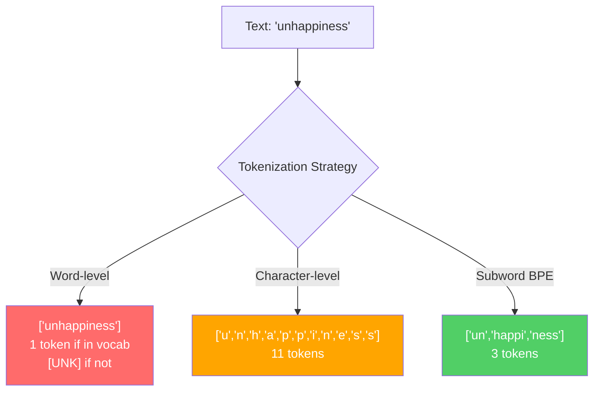
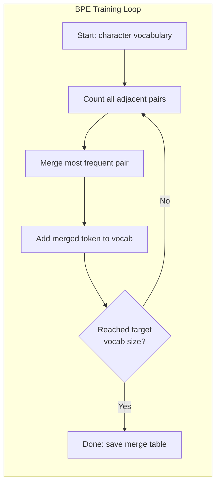
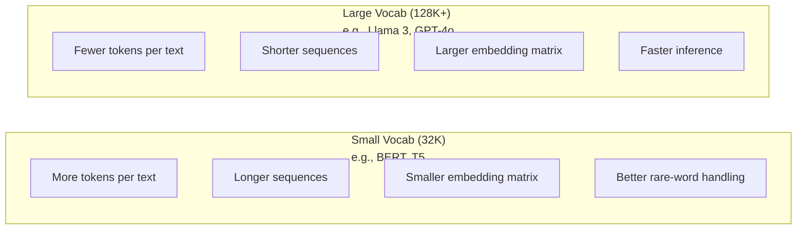

# 分词器(Tokenizers)：BPE、WordPiece、SentencePiece

> 你的大语言模型(LLM)并不阅读英语。它读取整数。分词器(Tokenizer)决定了这些整数是否承载意义还是浪费意义。

**类型：** 实践
**语言：** Python
**前置要求：** 阶段05（自然语言处理基础）
**时间：** 约90分钟

## 学习目标

- 从零实现BPE、WordPiece和Unigram分词算法，并比较它们的合并策略
- 解释词汇量大小如何影响模型效率：太小会导致长序列，太大会浪费嵌入参数
- 跨语言和代码分析分词伪影，识别特定分词器在哪里失败
- 使用tiktoken和sentencepiece库对文本进行分词，并检查生成的令牌ID

## 问题

你的大语言模型(LLM)并不阅读英语。它不阅读任何语言。它读取数字。

从"Hello, world!"到[15496, 11, 995, 0]的差距就是分词器(Tokenizer)。每个单词、每个空格、每个标点符号都必须先转换为整数，模型才能处理。这种转换并非中立。它将假设嵌入到模型中，后续无法撤销。

如果这一步做错了，你的模型就会浪费容量，用多个令牌编码常见单词。"unfortunately"变成四个令牌而不是一个。对于多音节词较多的文本，你的128K上下文窗口就会缩小75%。如果做对了，同样的上下文窗口能承载两倍的含义。“这个模型处理代码很好”和“这个模型在Python上很吃力”之间的区别，往往归结于分词器是如何训练的。

你每次调用GPT-4或Claude的API，都是按令牌计费的。模型生成的每个令牌都需要计算成本。表示输出所需的令牌越少，端到端推理越快。分词(Tokenization)并非预处理。它是架构。

## 核心概念

### 三种失败的方法（以及一种成功的方法）

将文本转换为数字有三种显而易见的方法。其中两种在规模上不可行。

**词级分词(Word-level tokenization)** 根据空格和标点分割。"The cat sat"变成["The", "cat", "sat"]。简单。但是"tokenization"呢？或者"GPT-4o"？或者像"Geschwindigkeitsbegrenzung"这样的德语复合词？词级分词需要庞大的词汇量来覆盖每种语言中的每个单词。如果漏掉一个词，就会得到可怕的`[UNK]`令牌——相当于模型在说“我不知道这是什么”。仅英语就有超过一百万个词形。加上代码、URL、科学记数法和其他100种语言，你需要一个无限的词汇量。

**字符级分词(Character-level tokenization)** 则走向另一个极端。"hello"变成["h", "e", "l", "l", "o"]。词汇量很小（几百个字符）。永远不会有未知令牌。但序列变得极长。一个在词级只有10个令牌的句子，在字符级会变成50个令牌。模型必须学会"t"、"h"、"e"组合在一起表示"the"——这消耗了注意力容量，而人类三岁时就能学会。

**子词分词(Subword tokenization)** 找到了最佳平衡点。常见单词保持完整："the"是一个令牌。罕见单词分解为有意义的片段："unhappiness"变成["un", "happi", "ness"]。词汇量保持可控（3万到12.8万个令牌）。序列保持简短。未知令牌基本消失，因为任何单词都可以由子词片段构建。

每个现代大语言模型(LLM)都使用子词分词(Subword tokenization)。GPT-2、GPT-4、BERT、Llama 3、Claude——全部如此。问题在于使用哪种算法。



### BPE：字节对编码

BPE是一种被重新用于分词的贪心压缩算法。其思想简单到可以写在一张索引卡上。

从单个字符开始。统计训练语料中每个相邻对的出现次数。合并出现最频繁的对为一个新令牌。重复直到达到目标词汇量大小。

```figure
tokenizer-bpe
```

以下是在包含单词"lower"、"lowest"和"newest"的小型语料上运行BPE的示例：

```
Corpus (with word frequencies):
  "lower"  x5
  "lowest" x2
  "newest" x6

Step 0 -- Start with characters:
  l o w e r       (x5)
  l o w e s t     (x2)
  n e w e s t     (x6)

Step 1 -- Count adjacent pairs:
  (e,s): 8    (s,t): 8    (l,o): 7    (o,w): 7
  (w,e): 13   (e,r): 5    (n,e): 6    ...

Step 2 -- Merge most frequent pair (w,e) -> "we":
  l o we r        (x5)
  l o we s t      (x2)
  n e we s t      (x6)

Step 3 -- Recount and merge (e,s) -> "es":
  l o we r        (x5)
  l o we s t      (x2)    <- 'es' only forms from 'e'+'s', not 'we'+'s'
  n e we s t      (x6)    <- wait, the 'e' before 'we' and 's' after 'we'

Actually tracking this precisely:
  After "we" merge, remaining pairs:
  (l,o): 7   (o,we): 7   (we,r): 5   (we,s): 8
  (s,t): 8   (n,e): 6    (e,we): 6

Step 3 -- Merge (we,s) -> "wes" or (s,t) -> "st" (tied at 8, pick first):
  Merge (we,s) -> "wes":
  l o we r        (x5)
  l o wes t       (x2)
  n e wes t       (x6)

Step 4 -- Merge (wes,t) -> "west":
  l o we r        (x5)
  l o west        (x2)
  n e west        (x6)

...continue until target vocab size reached.
```

合并表就是分词器。要编码新文本，按学习到的顺序应用合并。训练语料决定了存在哪些合并，这一选择永久地塑造了模型看到的内容。



### 字节级BPE（GPT-2、GPT-3、GPT-4）

标准BPE基于Unicode字符操作。字节级BPE基于原始字节（0-255）操作。这使基础词汇量恰好为256，可以处理任何语言或编码，并且永远不会产生未知令牌。

GPT-2引入了这种方法。基础词汇量涵盖所有可能的字节。BPE合并在此基础上构建。OpenAI的tiktoken库实现了字节级BPE，其词汇量大小如下：

- GPT-2：50,257个令牌
- GPT-3.5/GPT-4：约100,256个令牌（cl100k_base编码）
- GPT-4o：200,019个令牌（o200k_base编码）

### WordPiece（BERT）

WordPiece看起来与BPE相似，但选择合并的方式不同。它不依赖原始频率，而是最大化训练数据的似然：

```
BPE merge criterion:      count(A, B)
WordPiece merge criterion: count(AB) / (count(A) * count(B))
```

BPE问：“哪一对出现最频繁？” WordPiece问：“哪一对同时出现的频率高于随机预期？” 这一微妙的差异导致了不同的词汇表。WordPiece倾向于合并那些共现令人惊讶的对，而不仅仅是频繁的对。

WordPiece还使用"##"前缀表示子词延续：

```
"unhappiness" -> ["un", "##happi", "##ness"]
"embedding"   -> ["em", "##bed", "##ding"]
```

"##"前缀告诉你这一片段继续了前一个令牌。BERT使用WordPiece，词汇量为30,522个令牌。每个BERT变体——DistilBERT、RoBERTa的分词器实际上是BPE，但BERT本身是WordPiece。

### SentencePiece（Llama、T5）

SentencePiece将输入视为Unicode字符的原始流，包括空白。没有预分词步骤。没有关于词边界的语言特定规则。这使得它真正与语言无关——它适用于中文、日文、泰文以及其他不使用空格分隔单词的语言。

SentencePiece 支持两种算法：
- **BPE 模式**：与标准 BPE 相同的合并逻辑，应用于原始字符序列
- **Unigram 模式**：从一个大词汇表开始，迭代地移除对整体似然影响最小的词元。BPE 的反向过程——剪枝而非合并。

Llama 2 使用 SentencePiece BPE，词汇表大小为 32,000。T5 使用 SentencePiece Unigram，词汇表大小为 32,000。注意：Llama 3 切换为基于 tiktoken 的字节级 BPE 分词器，词汇表大小为 128,256。

### 词汇表大小权衡

这是一个具有可衡量后果的实际工程决策。



具体数字。对于 128K 词汇表和 4,096 维嵌入，仅嵌入矩阵就有 128,000 × 4,096 = 5.24 亿个参数。对于 32K 词汇表，则为 1.31 亿个参数。仅分词器的选择就导致了 4 亿个参数的差异。

但更大的词汇表能更积极地压缩文本。同样的英文段落，用 32K 词汇表需要 100 个词元，用 128K 词汇表可能只需要 70 个词元。这意味着生成时的前向传递次数减少 30%。对于处理数百万请求的模型来说，这直接降低了计算成本。

趋势很明显：词汇表大小正在增长。GPT-2 使用 50,257。GPT-4 使用约 100K。Llama 3 使用 128K。GPT-4o 使用 200K。

|  模型  |  词汇表大小  |  分词器类型  |  每个英文单词的平均词元数  |
|-------|-----------|----------------|---------------------------|
|  BERT  |  30,522  |  WordPiece  |  ~1.4  |
|  GPT-2  |  50,257  |  字节级 BPE  |  ~1.3  |
|  Llama 2  |  32,000  |  SentencePiece BPE  |  ~1.4  |
|  GPT-4  |  ~100,256  |  字节级 BPE  |  ~1.2  |
|  Llama 3  |  128,256  |  字节级 BPE (tiktoken)  |  ~1.1  |
|  GPT-4o  |  200,019  |  字节级 BPE  |  ~1.0  |

### 多语言代价

主要基于英文训练的分词器对其他语言很不友好。GPT-2 分词器中，韩语文本平均每个词需要 2-3 个词元。中文可能更糟。这意味着韩语用户的有效上下文窗口只有英语用户的一半——支付相同的价格却获得更少的信息密度。

这就是为什么 Llama 3 将词汇表从 32K 增加到 128K。为非英语脚本分配更多词元意味着跨语言更公平的压缩。

```figure
tokenizer-tradeoff
```

## 动手构建

### 第一步：字符级分词器

从基础开始。字符级分词器将每个字符映射到其 Unicode 码点。无需训练。没有未知词元。只是直接的映射。

```python
class CharTokenizer:
    def encode(self, text):
        return [ord(c) for c in text]

    def decode(self, tokens):
        return "".join(chr(t) for t in tokens)
```

"hello" 变成 [104, 101, 108, 108, 111]。每个字符都是自己的词元。这是我们改进的基线。

### 第二步：从头实现 BPE 分词器

真正的实现。我们在原始字节上训练（像 GPT-2 一样），计数词对，合并最频繁的，并按顺序记录每次合并。合并表就是分词器。

```python
from collections import Counter

class BPETokenizer:
    def __init__(self):
        self.merges = {}
        self.vocab = {}

    def _get_pairs(self, tokens):
        pairs = Counter()
        for i in range(len(tokens) - 1):
            pairs[(tokens[i], tokens[i + 1])] += 1
        return pairs

    def _merge_pair(self, tokens, pair, new_token):
        merged = []
        i = 0
        while i < len(tokens):
            if i < len(tokens) - 1 and tokens[i] == pair[0] and tokens[i + 1] == pair[1]:
                merged.append(new_token)
                i += 2
            else:
                merged.append(tokens[i])
                i += 1
        return merged

    def train(self, text, num_merges):
        tokens = list(text.encode("utf-8"))
        self.vocab = {i: bytes([i]) for i in range(256)}

        for i in range(num_merges):
            pairs = self._get_pairs(tokens)
            if not pairs:
                break
            best_pair = max(pairs, key=pairs.get)
            new_token = 256 + i
            tokens = self._merge_pair(tokens, best_pair, new_token)
            self.merges[best_pair] = new_token
            self.vocab[new_token] = self.vocab[best_pair[0]] + self.vocab[best_pair[1]]

        return self

    def encode(self, text):
        tokens = list(text.encode("utf-8"))
        for pair, new_token in self.merges.items():
            tokens = self._merge_pair(tokens, pair, new_token)
        return tokens

    def decode(self, tokens):
        byte_sequence = b"".join(self.vocab[t] for t in tokens)
        return byte_sequence.decode("utf-8", errors="replace")
```

训练循环是 BPE 的核心：计数词对，合并获胜者，重复。每次合并减少总词元数。经过 `num_merges` 轮后，词汇表从 256（基础字节）增长到 256 + 合并次数。

编码时按照合并学习的顺序应用合并。这很重要。如果合并 1 创建了 "th"，合并 5 创建了 "the"，编码必须先应用合并 1，以便 "the" 可以在合并 5 中由 "th" + "e" 形成。

解码是逆过程：在词汇表中查找每个词元 ID，拼接字节，解码为 UTF-8。

### 第三步：编码和解码往返

```python
corpus = (
    "The cat sat on the mat. The cat ate the rat. "
    "The dog sat on the log. The dog ate the frog. "
    "Natural language processing is the study of how computers "
    "understand and generate human language. "
    "Tokenization is the first step in any NLP pipeline."
)

tokenizer = BPETokenizer()
tokenizer.train(corpus, num_merges=40)

test_sentences = [
    "The cat sat on the mat.",
    "Natural language processing",
    "tokenization pipeline",
    "unhappiness",
]

for sentence in test_sentences:
    encoded = tokenizer.encode(sentence)
    decoded = tokenizer.decode(encoded)
    raw_bytes = len(sentence.encode("utf-8"))
    ratio = len(encoded) / raw_bytes
    print(f"'{sentence}'")
    print(f"  Tokens: {len(encoded)} (from {raw_bytes} bytes) -- ratio: {ratio:.2f}")
    print(f"  Roundtrip: {'PASS' if decoded == sentence else 'FAIL'}")
```

压缩比告诉你分词器的效果。比值为 0.50 表示分词器将文本压缩为原始字节的一半词元。越小越好。在训练语料上，比值会很好。在分布外文本上，比如 "unhappiness"（未出现在语料中），比值会更差——分词器对未见过的模式退回到字符级编码。

### 第四步：与 tiktoken 比较

```python
import tiktoken

enc = tiktoken.get_encoding("cl100k_base")

texts = [
    "The cat sat on the mat.",
    "unhappiness",
    "Hello, world!",
    "def fibonacci(n): return n if n < 2 else fibonacci(n-1) + fibonacci(n-2)",
    "Geschwindigkeitsbegrenzung",
]

for text in texts:
    our_tokens = tokenizer.encode(text)
    tiktoken_tokens = enc.encode(text)
    tiktoken_pieces = [enc.decode([t]) for t in tiktoken_tokens]
    print(f"'{text}'")
    print(f"  Our BPE:   {len(our_tokens)} tokens")
    print(f"  tiktoken:  {len(tiktoken_tokens)} tokens -> {tiktoken_pieces}")
```

tiktoken 使用完全相同的算法，但在数百 GB 的文本上训练了 100,000 次合并。算法相同。区别在于训练数据和合并次数。你在一个段落上训练了 40 次合并的分词器无法与 tiktoken 在大型语料上的 100K 次合并竞争。但机制是相同的。

### 第5步：词表分析

```python
def analyze_vocabulary(tokenizer, test_texts):
    total_tokens = 0
    total_chars = 0
    token_usage = Counter()

    for text in test_texts:
        encoded = tokenizer.encode(text)
        total_tokens += len(encoded)
        total_chars += len(text)
        for t in encoded:
            token_usage[t] += 1

    print(f"Vocabulary size: {len(tokenizer.vocab)}")
    print(f"Total tokens across all texts: {total_tokens}")
    print(f"Total characters: {total_chars}")
    print(f"Avg tokens per character: {total_tokens / total_chars:.2f}")

    print(f"\nMost used tokens:")
    for token_id, count in token_usage.most_common(10):
        token_bytes = tokenizer.vocab[token_id]
        display = token_bytes.decode("utf-8", errors="replace")
        print(f"  Token {token_id:4d}: '{display}' (used {count} times)")

    unused = [t for t in tokenizer.vocab if t not in token_usage]
    print(f"\nUnused tokens: {len(unused)} out of {len(tokenizer.vocab)}")
```

这揭示了词表中的齐普夫分布(Zipf distribution)。少数词元占据主导（空格、"the"、"e"）。大多数词元很少使用。生产级分词器针对这种分布进行优化——常见模式获得短词元ID，罕见模式获得更长表示。

## 使用它

你的简易BPE能工作了。现在看看生产级工具是什么样子。

### tiktoken (OpenAI)

```python
import tiktoken

enc = tiktoken.get_encoding("cl100k_base")

text = "Tokenizers convert text to integers"
tokens = enc.encode(text)
print(f"Tokens: {tokens}")
print(f"Pieces: {[enc.decode([t]) for t in tokens]}")
print(f"Roundtrip: {enc.decode(tokens)}")
```

tiktoken 用Rust编写，带有Python绑定。每秒编码数百万个词元。相同的BPE算法，工业级实现。

### Hugging Face tokenizers

```python
from tokenizers import Tokenizer
from tokenizers.models import BPE
from tokenizers.trainers import BpeTrainer
from tokenizers.pre_tokenizers import ByteLevel

tokenizer = Tokenizer(BPE())
tokenizer.pre_tokenizer = ByteLevel()

trainer = BpeTrainer(vocab_size=1000, special_tokens=["<pad>", "<eos>", "<unk>"])
tokenizer.train(["corpus.txt"], trainer)

output = tokenizer.encode("The cat sat on the mat.")
print(f"Tokens: {output.tokens}")
print(f"IDs: {output.ids}")
```

Hugging Face tokenizers库底层也是Rust。它能在数秒内在千兆字节语料上训练BPE。这就是训练自己模型时使用的工具。

### 加载Llama的分词器

```python
from transformers import AutoTokenizer

tokenizer = AutoTokenizer.from_pretrained("meta-llama/Llama-3.1-8B")

text = "Tokenizers are the unsung heroes of LLMs"
tokens = tokenizer.encode(text)
print(f"Token IDs: {tokens}")
print(f"Tokens: {tokenizer.convert_ids_to_tokens(tokens)}")
print(f"Vocab size: {tokenizer.vocab_size}")

multilingual = ["Hello world", "Hola mundo", "Bonjour le monde"]
for text in multilingual:
    ids = tokenizer.encode(text)
    print(f"'{text}' -> {len(ids)} tokens")
```

Llama 3的128K词表对非英语文本的压缩效果明显优于GPT-2的50K词表。你可以自行验证——用多种语言编码同一句话，并统计词元数量。

## 发布

本课生成`outputs/prompt-tokenizer-analyzer.md` ——一个可复用的提示词，分析任意文本和模型组合的分词效率。输入一个文本样本，它会告诉你哪个模型的分词器处理得最好。

## 练习

1. 修改BPE分词器，在每个合并步骤打印词表。观察"t" + "h"如何变成"th"，然后"th" + "e"变成"the"。追踪常见英语单词如何逐块组装。

2. 向BPE分词器添加特殊词元(`<pad>`, `<eos>`, `<unk>`)。将它们分配为ID 0,1,2，并相应偏移所有其他词元。实现一个预分词步骤，在运行BPE之前按空白分割。

3. 实现WordPiece合并准则（似然比而非频率）。在相同语料上使用相同合并次数训练BPE和WordPiece。比较生成的词表——哪个产生的子词更具语言学意义？

4. 构建一个多语言分词器效率基准。取10个句子，分别用英语、西班牙语、中文、韩语和阿拉伯语。用tiktoken (cl100k_base)对每个句子进行分词，测量每字符平均词元数。量化每种语言的"多语言税"。

5. 在更大的语料（下载一篇维基百科文章）上训练你的BPE分词器。调整合并次数，使压缩比在相同文本上与tiktoken相差10%以内。这会迫使你理解语料大小、合并次数和压缩质量之间的关系。

## 关键术语

|  术语  |  人们的说法  |  实际含义  |
|------|----------------|----------------------|
|  词元 |  "一个词"  |  模型词表中的单元——可以是字符、子词、单词或多词块  |
|  BPE |  "某种压缩技术"  |  字节对编码——迭代合并最频繁的相邻词元对，直到达到目标词表大小  |
|  WordPiece |  "BERT的分词器"  |  类似BPE，但合并时最大化似然比 count(AB)/(count(A)*count(B)) 而非原始频率  |
|  SentencePiece |  "一个分词器库"  |  一种与语言无关的分词器，直接在原始Unicode上操作，无需预分词，支持BPE和Unigram算法  |
|  词表大小 |  "它知道多少个词"  |  唯一词元的总数：GPT-2有50,257个，BERT有30,522个，Llama 3有128,256个  |
|  词元生育率 |  "不是分词器术语"  |  每个词的平均词元数——衡量跨语言的分词器效率（1.0理想，3.0意味着模型要付出三倍努力）  |
|  字节级BPE |  "GPT的分词器"  |  在原始字节(0-255)上操作的BPE，而非Unicode字符，保证任何输入都不会有未知词元  |
|  合并表 |  "分词器文件"  |  训练期间学习到的对合并的有序列表——这就是分词器本身，顺序很重要  |
|  预分词 |  "按空格分割"  |  在子词分词之前应用的规则：空白分割、数字分离、标点处理  |
|  压缩比 |  "分词器有多高效"  |  生成的词元数除以输入字节数——越低表示压缩越好且推理越快  |

## 延伸阅读

- [Sennrich et al., 2016 -- "Neural Machine Translation of Rare Words with Subword Units"](https://arxiv.org/abs/1508.07909) —— 将BPE引入NLP的论文，将1994年的压缩算法转变为现代分词的基础
- [Sennrich et al., 2016 -- "Neural Machine Translation of Rare Words with Subword Units"](https://arxiv.org/abs/1508.07909) —— 语言无关的分词，使多语言模型变得实用
- [Sennrich et al., 2016 -- "Neural Machine Translation of Rare Words with Subword Units"](https://arxiv.org/abs/1508.07909) —— 用Rust编写、带Python绑定的生产级BPE实现，被GPT-3.5/4/4o使用
- [Sennrich et al., 2016 -- "Neural Machine Translation of Rare Words with Subword Units"](https://arxiv.org/abs/1508.07909) —— 具有Rust性能的生产级分词器训练
