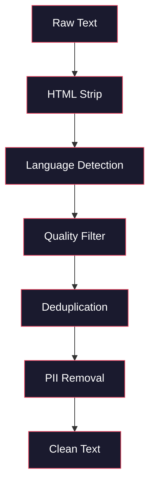
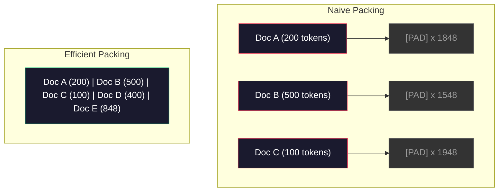

# 预训练数据管道

> 模型是一面镜子。它反映你喂给它的任何数据。喂给它垃圾，它就能流利地反映垃圾。

**类型：** 构建
**语言：** Python
**先修要求：** 阶段10，第01-02课（分词器、构建分词器）
**时间：** 约90分钟

## 学习目标

- 构建一个流式数据管道，对TB级别的文本进行分词、分块、洗牌和批处理，而无需全部加载到内存中
- 实现实际预训练管道中使用的数据质量过滤器（去重、语言检测、内容过滤）
- 创建具有适当注意力掩码和文档边界处理的固定长度训练序列
- 分析管道吞吐量，确保数据加载器能跟上GPU训练速度

## 问题

你有一个分词器。现在你需要数据。

不是一个数据集。不是一个CSV文件。而是TB级别的文本——经过清洗、去重、质量过滤、分词成固定长度序列，并以随机批次的方式提供，速度足够快，让你的8-GPU集群永远不会等待下一个批次。

大多数人认为训练LLM是关于模型架构的。其实不是。Llama 3使用了15.6万亿个token。GPT-3使用了3000亿个。DeepSeek-V2使用了8.1万亿个。这三者的架构大致相同：堆叠的Transformer块，包含注意力层和前馈层。输出质量的差异主要来自数据。

DeepMind的Chinchilla论文精确地说明了这一点。对于给定的计算预算，存在一个模型参数与训练token之间的最优比例。Chinchilla表明，2022年的大多数模型都严重训练不足——它们的参数相对于所看到的数据量来说太多了。一个在1.4万亿个token上训练的70B参数模型（Chinchilla最优）优于一个在3000亿个token上训练的280B参数模型（Gopher）。

你的数据管道决定了你的模型学习的是语言还是噪声。

## 核心概念

### 数据来源

每个大语言模型都在多种来源的混合数据上训练。对于大多数实验室来说，具体的组成是严格保密的，但我们足以了解这些类别。

|  来源  |  大小  |  质量  |  使用者  |
|--------|------|---------|---------|
|  Common Crawl  |  ~250 TB 原始  |  低（需要大量过滤）  |  GPT-3, Llama, 大多数开放模型  |
|  Wikipedia  |  ~20 GB  |  高  |  每个主要LLM  |
|  GitHub代码  |  ~1 TB+  |  中（大量重复、死代码）  |  StarCoder, CodeLlama, DeepSeek-Coder  |
|  书籍（BookCorpus, Pile）  |  ~100 GB  |  高  |  GPT-2, GPT-3, 早期模型  |
|  学术论文（arXiv, S2ORC）  |  ~100 GB  |  对于STEM来说高  |  Llama, Galactica  |
|  StackOverflow, Reddit  |  ~100 GB  |  中  |  Llama, Falcon  |
|  精选网络（C4, RefinedWeb）  |  ~5 TB  |  中高（预过滤）  |  T5, Falcon  |

Llama 3公开了其数据混合：大约50%的网络数据，25%的代码，13%的书籍和学术论文，8%的数学数据，以及4%的多语言网络数据。总计15.6万亿个token，来自超过5 TB的原始文本。

比例与总大小同等重要。过多的网络数据会使模型成为Reddit鹦鹉。代码太少，它无法编程。数学太少，它无法推理。正确搭配这种混合是训练LLM最困难的部分之一，而且没有公式——需要实验和评估。

### 数据清洗

原始网络数据很脏。一个典型的Common Crawl转储包含：

- HTML标签和JavaScript
- 样板页眉、页脚、导航菜单
- 重复页面（精确和近似重复）
- 机器生成的垃圾信息
- 个人身份信息（PII）
- 低质量文本（关键词列表、SEO垃圾信息）
- 非文本内容编码为文本

清洗这些内容不是可选的。它决定了模型是生成连贯的段落，还是输出HTML标签与产品列表的混合物。



每个步骤消除一类噪声：

**HTML剥离：** 移除所有标记。只保留可见的文本内容。像 `trafilatura` 或 `readability` 这样的库可以提取文章内容，同时丢弃导航、广告和样板。

**语言检测：** 使用fastText的语言识别模型（lid.176.bin）对每个文档进行分类。过滤到你的目标语言。一个被分类为英语但置信度低于0.8的文档可能不是干净的英语。

**质量过滤：** 这是有趣的地方。RefinedWeb（Falcon背后的数据集）使用基于困惑度的过滤器：在Wikipedia上训练一个小语言模型，然后对每个文档评分。高困惑度意味着文档不像Wikipedia——可能是垃圾信息、关键词列表或机器生成的内容。困惑度高于阈值的文档被移除。

**去重：** 影响最大的清洗步骤。Common Crawl包含大量重复页面——法律免责声明、cookie通知、服务条款。在重复数据上训练浪费计算资源，并可能导致模型逐字记忆和复述特定段落。

**PII 移除：** 姓名、电子邮件地址、电话号码、社会安全号码。基于正则表达式的结构化 PII 检测，以及用于识别上下文中姓名的命名实体识别(NER)模型。

### 使用 MinHash 进行去重

精确去重很容易：对每个文档进行哈希，移除重复项。但近似重复才是真正的问题。同一篇新闻文章的两个副本，周围有略微不同的广告，它们就是近似重复。内容有 95% 相同，但逐字节比较却有差异。

MinHash + 局部敏感哈希(LSH)能高效解决这个问题。


思路如下：

1. **Shingling（分片）：** 将每个文档转换为一组 n-gram（例如，单词或字符的 5-gram）。"the quick brown fox" 以 3 个单词为一片的分片变成 {"the quick brown", "quick brown fox"}。

2. **MinHash：** 针对每个文档的分片集合，计算 k 个哈希值。每个哈希值是在不同哈希函数下所有分片中的最小哈希值。这创建了一个固定大小的"签名"，近似表示任意两个文档之间的 Jaccard 相似度。

3. **LSH（局部敏感哈希）：** 根据 MinHash 签名的波段将文档分组到桶中。同一桶中的文档是候选近似重复文档。这避免了比较每一对——你只需要比较候选对。

4. **验证：** 对于每个候选对，计算精确的 Jaccard 相似度。如果相似度超过阈值（通常为 0.8），则移除其中一个副本。

Llama 团队报告通过去重移除了大约 38% 的网络数据。这不是一个小数目。Common Crawl 中有超过三分之一的内容是重复或近似重复的。

### 序列打包(Sequence Packing)

你的模型期望固定长度的输入序列。你的文档长度可变。有些只有 50 个词元。有些有 50,000 个词元。

朴素方法：将每个文档填充到最大序列长度。这会在填充词元上浪费大量计算资源，而它们对学习毫无贡献。

更好的方法：将多个文档打包到一个序列中，用序列结束标记分隔。一个 2048 个词元的序列可能包含三个用 [EOS] 标记连接的短文档。



必须正确设置注意力掩码。文档 A 中的词元不应注意到同一打包序列中文档 B 中的词元。这需要块对角注意力掩码。

长文档被截断或在序列边界处分割成块。分割点很重要：在句子中间分割会让模型看到不完整的想法。一些处理流程会在可能时将分割点对齐到段落或句子边界。

### Chinchilla 缩放定律(Chinchilla Scaling Law)

对于固定的计算预算 C（以 FLOPs 衡量），最优模型大小 N 和数据集大小 D 满足：

```
N_opt ~ C^0.5
D_opt ~ C^0.5
```

实际上，这意味着你应该大致等比例地缩放模型大小和数据集大小。拥有 10 倍参数的模型需要大约 10 倍的训练词元才能达到相同的损失。

|  模型  |  参数  |  训练词元数  |  Chinchilla 最优？  |
|-------|-----------|----------------|-------------------|
|  GPT-3  |  175B  |  300B  |  否（欠训练 3-4 倍）  |
|  Chinchilla  |  70B  |  1.4T  |  是（按设计）  |
|  Llama 2  |  70B  |  2T  |  过训练（有意为之）  |
|  Llama 3  |  70B  |  15T  |  严重过训练  |

Llama 3 有意违反了 Chinchilla 定律。Meta 发现，在远超过计算最优比率的数据上进行过训练，能在推理时产生更好的模型。额外的训练成本只付出一次，但较小的模型永远更便宜地提供服务。这有时被称为"推理最优"缩放方法，自 2024 年以来已成为行业标准。

## 动手构建

### 步骤 1：文本清洗

去除 HTML，规范化空白，移除非文本内容。我们将使用一个公共领域文本（Project Gutenberg）作为小型语料库。

```python
import re

def clean_text(text):
    text = re.sub(r"<[^>]+>", "", text)
    text = re.sub(r"http\S+", "", text)
    text = re.sub(r"[^\x20-\x7E\n]", "", text)
    text = re.sub(r"\n{3,}", "\n\n", text)
    text = re.sub(r" {2,}", " ", text)
    return text.strip()

def quality_filter(text, min_words=50, max_ratio_caps=0.3, max_ratio_special=0.1):
    words = text.split()
    if len(words) < min_words:
        return False
    caps_ratio = sum(1 for w in words if w.isupper()) / len(words)
    if caps_ratio > max_ratio_caps:
        return False
    special_chars = sum(1 for c in text if not c.isalnum() and not c.isspace())
    if special_chars / max(len(text), 1) > max_ratio_special:
        return False
    return True
```

质量过滤器能捕获 SEO 垃圾内容（全大写）、机器生成的噪声（高特殊字符比例）以及短小页面（太短）。仅这三项检查就能从网络爬取中移除大量垃圾内容。

### 步骤 2：MinHash 去重

从头实现 MinHash。不需要外部库——只需 `hashlib`。

```python
import hashlib
from collections import defaultdict

def get_shingles(text, k=5):
    words = text.lower().split()
    if len(words) < k:
        return set()
    return {" ".join(words[i:i+k]) for i in range(len(words) - k + 1)}

def minhash_signature(shingles, num_hashes=128):
    signature = []
    for i in range(num_hashes):
        min_hash = float("inf")
        for shingle in shingles:
            h = int(hashlib.sha256(f"{i}:{shingle}".encode()).hexdigest(), 16)
            min_hash = min(min_hash, h)
        signature.append(min_hash)
    return signature

def lsh_buckets(signature, bands=16):
    rows_per_band = len(signature) // bands
    buckets = []
    for b in range(bands):
        start = b * rows_per_band
        band_data = tuple(signature[start:start + rows_per_band])
        bucket_hash = hashlib.md5(str(band_data).encode()).hexdigest()
        buckets.append((b, bucket_hash))
    return buckets

def deduplicate(documents, threshold=0.8, num_hashes=128, bands=16):
    signatures = []
    shingle_sets = []
    for doc in documents:
        shingles = get_shingles(doc)
        shingle_sets.append(shingles)
        signatures.append(minhash_signature(shingles, num_hashes))

    bucket_map = defaultdict(list)
    for doc_idx, sig in enumerate(signatures):
        for band_id, bucket_hash in lsh_buckets(sig, bands):
            bucket_map[(band_id, bucket_hash)].append(doc_idx)

    duplicate_pairs = set()
    for bucket_docs in bucket_map.values():
        if len(bucket_docs) < 2:
            continue
        for i in range(len(bucket_docs)):
            for j in range(i + 1, len(bucket_docs)):
                duplicate_pairs.add((bucket_docs[i], bucket_docs[j]))

    removed = set()
    for i, j in duplicate_pairs:
        if i in removed or j in removed:
            continue
        s1, s2 = shingle_sets[i], shingle_sets[j]
        if not s1 or not s2:
            continue
        jaccard = len(s1 & s2) / len(s1 | s2)
        if jaccard >= threshold:
            removed.add(j)

    return [doc for idx, doc in enumerate(documents) if idx not in removed], len(removed)
```

`num_hashes=128`和`bands=16`参数控制精确度-召回率权衡。更多的哈希值能提供更准确的相似度估计。更多的条带会增加召回率（捕获更多重复），代价是更多的误报。这些值对典型的网络文本效果良好。

### 步骤3：分词和打包序列

对清洗、去重后的文本进行分词，并打包成固定长度的序列用于训练。

```python
def tokenize_corpus(documents, tokenizer):
    all_tokens = []
    for doc in documents:
        tokens = tokenizer.encode(doc)
        all_tokens.extend(tokens)
        all_tokens.append(tokenizer.eos_id)
    return all_tokens

def pack_sequences(token_ids, seq_length, pad_id=0):
    sequences = []
    attention_masks = []
    for i in range(0, len(token_ids), seq_length):
        seq = token_ids[i:i + seq_length]
        mask = [1] * len(seq)
        if len(seq) < seq_length:
            pad_count = seq_length - len(seq)
            seq = seq + [pad_id] * pad_count
            mask = mask + [0] * pad_count
        sequences.append(seq)
        attention_masks.append(mask)
    return sequences, attention_masks
```

### 步骤4：训练用数据加载器

生成随机批次的打包序列。这是训练循环所消费的数据。

```python
import random

class PreTrainingDataLoader:
    def __init__(self, sequences, attention_masks, batch_size, shuffle=True):
        self.sequences = sequences
        self.attention_masks = attention_masks
        self.batch_size = batch_size
        self.shuffle = shuffle

    def __len__(self):
        return (len(self.sequences) + self.batch_size - 1) // self.batch_size

    def __iter__(self):
        indices = list(range(len(self.sequences)))
        if self.shuffle:
            random.shuffle(indices)
        for start in range(0, len(indices), self.batch_size):
            batch_idx = indices[start:start + self.batch_size]
            batch_seqs = [self.sequences[i] for i in batch_idx]
            batch_masks = [self.attention_masks[i] for i in batch_idx]
            yield batch_seqs, batch_masks
```

### 步骤5：数据集统计信息

计算关键数字：总词元数、唯一词元数、压缩率、文档长度分布。

```python
from collections import Counter

def compute_statistics(documents, token_ids, sequences, tokenizer_vocab_size):
    total_chars = sum(len(d) for d in documents)
    total_tokens = len(token_ids)
    unique_tokens = len(set(token_ids))
    compression_ratio = total_chars / total_tokens

    doc_lengths = [len(d.split()) for d in documents]
    avg_doc_length = sum(doc_lengths) / max(len(doc_lengths), 1)
    max_doc_length = max(doc_lengths) if doc_lengths else 0
    min_doc_length = min(doc_lengths) if doc_lengths else 0

    token_counts = Counter(token_ids)
    top_tokens = token_counts.most_common(10)

    non_pad_tokens = sum(sum(1 for t in seq if t != 0) for seq in sequences)
    total_positions = sum(len(seq) for seq in sequences)
    utilization = non_pad_tokens / max(total_positions, 1)

    stats = {
        "total_documents": len(documents),
        "total_characters": total_chars,
        "total_tokens": total_tokens,
        "unique_tokens": unique_tokens,
        "vocab_utilization": unique_tokens / tokenizer_vocab_size,
        "compression_ratio": compression_ratio,
        "avg_doc_length_words": avg_doc_length,
        "max_doc_length_words": max_doc_length,
        "min_doc_length_words": min_doc_length,
        "num_sequences": len(sequences),
        "sequence_utilization": utilization,
        "top_10_tokens": top_tokens,
    }
    return stats
```

压缩率告诉你分词器在该语料库上的效率。英文文本通常压缩到每个词元约3-4个字符。如果看到每个词元1.5个字符，说明分词器拆分过于激进。如果看到8个字符以上，说明它学习到了非常特定领域的合并。

序列利用率告诉你打包序列中实际数据与填充的比例。低于90%意味着打包效率低下——你在填充词元上浪费了算力。

## 使用它

### 与HuggingFace数据集对比

通过HuggingFace的datasets库加载相同语料库，并比较流水线速度。

```python
from datasets import load_dataset
from transformers import AutoTokenizer

ds = load_dataset("wikitext", "wikitext-2-raw-v1", split="train")
tokenizer = AutoTokenizer.from_pretrained("meta-llama/Meta-Llama-3-8B")

import time

start = time.time()
tokenized = ds.map(
    lambda x: tokenizer(x["text"], truncation=True, max_length=2048),
    batched=True,
    num_proc=4,
)
hf_time = time.time() - start
total_tokens = sum(len(t) for t in tokenized["input_ids"])
print(f"HuggingFace: {total_tokens:,} tokens in {hf_time:.2f}s ({total_tokens/hf_time:,.0f} tokens/sec)")
```

HuggingFace流水线底层使用Rust分词器，并在4个核心上进行并行处理。你的纯Python流水线会慢10-50倍。这个差距就是为什么生产团队使用编译型分词器。算法相同，实现语言是差异所在。

## 发布

本节课提供了一个用于验证和调试LLM训练流水线中数据质量的提示。参见`outputs/prompt-data-quality-checker.md`。

## 练习

1. **简单：** 使用简单的启发式方法（字符集分析）向清洗流水线添加语言检测。只过滤英文文档，并测量有多少文档被移除。
2. **中等：** 在MinHash近似去重之外，使用SHA-256哈希实现精确去重。比较两种方法在网络爬取语料库上捕获的重复数量。
3. **困难：** 构建基于困惑度的质量过滤器。在维基百科文本上训练一个小的二元语言模型，计算每个文档的困惑度，并移除最低的20%。比较在过滤后与未过滤数据上训练时模型输出的质量。

## 关键术语

|  术语  |  人们的说法  |  实际含义  |
|------|----------------|----------------------|
|  Common Crawl  |  "互联网"  |  一个每月爬取网络的非营利组织——约250TB原始数据，大多数LLM训练数据的起点  |
|  MinHash  |  "某种哈希技巧"  |  一种使用固定大小签名估计集合之间Jaccard相似度的技术——能够大规模检测近似重复  |
|  LSH  |  "局部敏感哈希"  |  一种将相似项分到同一桶的方法——将成对比较从O(n^2)减少到近线性  |
|  序列打包  |  "拼接文档"  |  将多个文档放入固定长度序列，并加上正确的注意力掩码——消除填充浪费  |
|  Chinchilla缩放法则  |  "用更多数据训练"  |  在固定计算预算下，最优性能需要模型大小和训练词元数大致相等地缩放  |
|  生成率  |  "每个词的词元数"  |  每个词平均生成的词元数——GPT-4中英文为1.3，非拉丁文字更高  |
|  数据混合  |  "选择训练数据"  |  代码、文本、数学、多语言数据的比例——没有公式，需要实验  |
|  困惑度过滤器  |  "质量评分"  |  使用小型语言模型对文档评分——高困惑度意味着文本与干净的参考数据不同  |
|  去重  |  "移除副本"  |  消除精确和近似重复的文档——通常移除30-40%的原始网络数据  |
|  注意力掩码  |  "关注哪些词元"  |  一个二进制掩码，防止打包序列中跨文档边界的注意力  |

## 延伸阅读

- [Hoffmann et al., 2022 -- Training Compute-Optimal Large Language Models (Chinchilla)](https://arxiv.org/abs/2203.15556)——改变了我们对数据规模看法的论文
- [Hoffmann et al., 2022 -- Training Compute-Optimal Large Language Models (Chinchilla)](https://arxiv.org/abs/2203.15556)——如何筛选高质量Common Crawl
- [Hoffmann et al., 2022 -- Training Compute-Optimal Large Language Models (Chinchilla)](https://arxiv.org/abs/2203.15556)——Llama 2的数据流水线细节
- [Hoffmann et al., 2022 -- Training Compute-Optimal Large Language Models (Chinchilla)](https://arxiv.org/abs/2203.15556)——为什么去重比你想象的更重要
- [Hoffmann et al., 2022 -- Training Compute-Optimal Large Language Models (Chinchilla)](https://arxiv.org/abs/2203.15556)——原始MinHash论文
- [Hoffmann et al., 2022 -- Training Compute-Optimal Large Language Models (Chinchilla)](https://arxiv.org/abs/2203.15556)——15.6T词元、数据混合比例、过滤流水线
