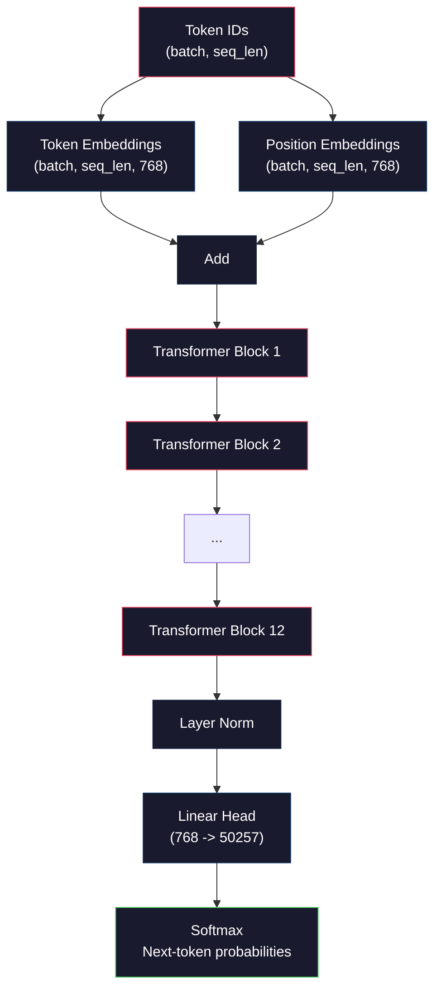
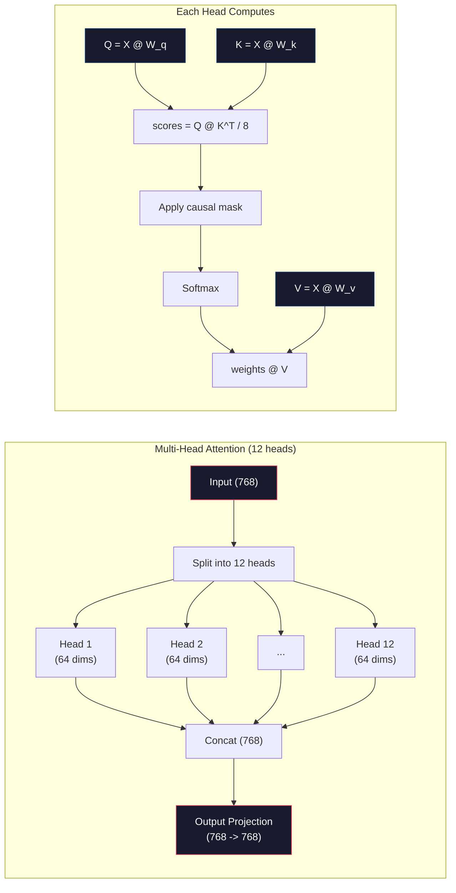
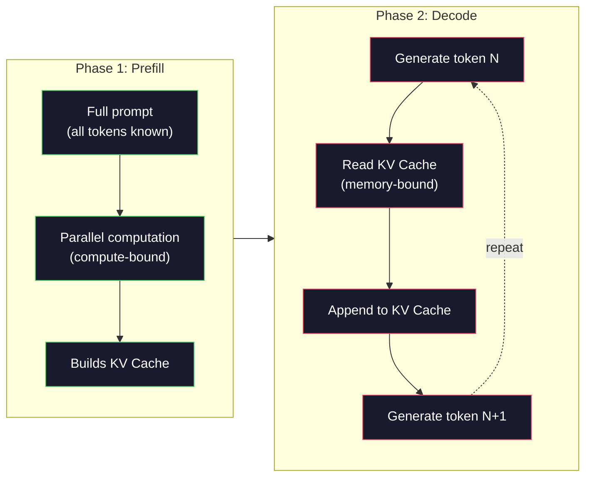

# 预训练一个Mini GPT（1.24亿参数）

> GPT-2 Small有1.24亿个参数。它包含12个Transformer层、12个注意力头以及768维的嵌入。你可以在单个GPU上花几个小时从头开始训练它。大多数人从未这样做过，他们使用预训练的检查点。但如果你不亲自训练一个，你就不会真正理解你构建产品所使用的模型内部发生了什么。

**类型：** 构建
**语言：** Python（使用numpy）
**前置条件：** 阶段10，第01-03课（分词器、构建分词器、数据流水线）
**时间：** 约120分钟

## 学习目标

- 从头实现完整的GPT-2架构（1.24亿参数）：词嵌入、位置嵌入、Transformer块和语言模型头
- 在文本语料上使用下一个词预测和交叉熵损失训练一个GPT模型
- 实现带温度采样和top-k/top-p过滤的自回归文本生成
- 监控训练损失曲线，验证模型学习到连贯的语言模式

## 问题

你知道什么是Transformer。你读过相关图示。你能背诵“注意力就是一切”并在白板上画出标有“多头注意力”的方框。

但这些都不意味着你理解模型生成文本时实际发生了什么。

GPT-2 Small中有124,438,272个参数（包含权重绑定）。每一个参数都是通过运行训练循环设定的：前向传播、计算损失、反向传播、更新权重。十二个Transformer块。每个块十二个注意力头。一个768维的嵌入空间。一个包含50,257个词元的词表。每次模型生成一个词元时，全部1.24亿个参数都会参与到一个单一的矩阵乘法链中，该链接受一个词元ID序列并产生下一个词元的概率分布。

如果你从未亲自构建过这个，那你就是在和黑箱打交道。你可以使用API，可以微调。但当出现问题时——当模型产生幻觉、重复自己或拒绝遵循指令时——你对*为什么*会这样没有心智模型。

本课程从头构建GPT-2 Small。不是用PyTorch，而是用numpy。每一次矩阵乘法都是可见的。每一个梯度都由你的代码计算。你将亲眼看到1.24亿个数字如何协同工作来预测下一个词。

## 核心概念

### GPT架构

GPT是一种自回归语言模型。“自回归”意味着它一次生成一个词元，每个词元都以之前所有的词元为条件。该架构是一堆Transformer解码器块。

下面是从词元ID到下一个词元概率的完整计算图：

1. 输入词元ID。形状：(batch_size, seq_len)。
2. 词嵌入查找。每个ID映射到一个768维的向量。形状：(batch_size, seq_len, 768)。
3. 位置嵌入查找。每个位置（0, 1, 2, ...）映射到一个768维的向量。形状相同。
4. 将词嵌入和位置嵌入相加。
5. 经过12个Transformer块。
6. 最后的层归一化。
7. 线性投影到词表大小。形状：(batch_size, seq_len, vocab_size)。
8. Softmax得到概率。

这就是整个模型。没有卷积，没有循环。只有嵌入、注意力、前馈网络和层归一化，堆叠12次。



### Transformer块

12个块中的每一个都遵循相同的模式。采用预归一化架构（GPT-2使用预归一化，而不是原始Transformer的后归一化）：

1. LayerNorm
2. 多头自注意力
3. 残差连接（加回输入）
4. LayerNorm
5. 前馈网络（MLP）
6. 残差连接（加回输入）

残差连接至关重要。没有它们，梯度在反向传播到达第1块时就会消失。有了它们，梯度可以通过“跳跃”路径直接从损失流到任何层。这就是为什么你可以堆叠12、32甚至96个块（据说GPT-4使用了120个块）。

### 注意力：核心机制

自注意力让每个词元可以查看所有之前的词元，并决定每个词元应该关注多少。以下是数学原理。

对于每个词元位置，从输入中计算三个向量：
- **查询（Q）**：“我在找什么？”
- **键（K）**：“我包含什么？”
- **值（V）**：“我携带什么信息？”

```
Q = input @ W_q    (768 -> 768)
K = input @ W_k    (768 -> 768)
V = input @ W_v    (768 -> 768)

attention_scores = Q @ K^T / sqrt(d_k)
attention_scores = mask(attention_scores)   # causal mask: -inf for future positions
attention_weights = softmax(attention_scores)
output = attention_weights @ V
```

因果掩码使GPT成为自回归模型。位置5可以关注位置0-5，但不能关注6、7、8等。这防止了模型在训练时通过查看未来词元来“作弊”。

**多头注意力**将768维的空间分割成12个头，每个头64维。每个头学习不同的注意力模式。一个头可能跟踪句法关系（主谓一致）。另一个可能跟踪语义相似性（同义词）。另一个可能跟踪位置邻近性（附近的词）。所有12个头的输出被拼接起来，并投影回768维。



除以sqrt(d_k)（sqrt(64)=8）是缩放。没有它，对于高维向量，点积会变得很大，将softmax推入梯度几乎为零的区域。这是原始论文“注意力就是一切”的关键见解之一。

### KV缓存：为什么推理很快

在训练时，你一次性处理整个序列。在推理时，你一次生成一个词元。如果没有优化，生成第N个词元需要为所有N-1个之前的词元重新计算注意力。这是每个生成词元O(N^2)，或者说对于长度为N的序列总共O(N^3)。

KV缓存解决了这个问题。在计算每个词元的K和V后，将它们存储起来。当生成第N+1个词元时，你只需要为新词元计算Q，并查找之前所有词元的缓存K和V。这将对每个词元的K和V计算成本从O(N)降低到O(1)。注意力分数计算仍然是O(N)，因为你需要关注所有之前的位置，但你避免了在输入上重复的矩阵乘法。

对于具有12层和12个头的GPT-2，KV缓存每个词元存储2（K + V）× 12层 × 12头 × 64维 = 18,432个值。对于一个1024词元的序列，在FP32中约为75MB。对于具有128层的Llama 3 405B，单个序列的KV缓存可能超过10GB。这就是为什么长上下文推理受限于内存。

### 预填充与解码：推理的两个阶段

当你向LLM发送提示时，推理分为两个不同的阶段。

**预填充**并行处理整个提示。所有令牌已知，因此模型可以同时计算所有位置的注意力。此阶段受计算限制——GPU以全吞吐量进行矩阵乘法。对于A100上的1000令牌提示，预填充大约需要20-50毫秒。

**解码**逐个生成令牌。每个新令牌依赖于之前的所有令牌。此阶段受内存限制——瓶颈是从GPU内存读取模型权重和KV缓存，而不是矩阵计算本身。GPU的计算核心在等待内存读取时大多处于空闲状态。对于GPT-2，无论矩阵乘法需要多少FLOP，每个解码步骤所需的时间大致相同，因为内存带宽是限制因素。

这种区别对生产系统很重要。预填充吞吐量与GPU计算能力成正比（更多FLOPS = 更快的预填充）。解码吞吐量与内存带宽成正比（更快的内存 = 更快的解码）。这就是为什么NVIDIA的H100专注于比A100更快的内存带宽提升——它直接加速了令牌生成。



### 训练循环（Training Loop）

训练LLM就是下一个令牌预测。给定令牌[0, 1, 2, ..., N-1]，预测令牌[1, 2, 3, ..., N]。损失函数是模型预测概率分布与实际下一个令牌之间的交叉熵。

一个训练步骤：

1. **前向传播**：将批次通过所有12个模块。获取每个位置的logits（softmax前的得分）。
2. **计算损失**：logits与目标令牌（输入偏移一个位置）之间的交叉熵。
3. **反向传播**：使用反向传播计算所有1.24亿参数的梯度。
4. **优化器步骤**：更新权重。GPT-2使用Adam，带有学习率预热和余弦衰减。

学习率调度的重要性超出你的预期。GPT-2在前2,000步从0预热到峰值学习率，然后按照余弦曲线衰减。从高学习率开始会导致模型发散。保持恒定高学习率会导致后期训练震荡。预热后衰减的模式被所有主要LLM使用。

### GPT-2 Small：数据

|  组件  |  形状  |  参数数量  |
|-----------|-------|------------|
|  令牌嵌入  |  (50257, 768)  |  38,597,376  |
|  位置嵌入  |  (1024, 768)  |  786,432  |
|  每模块注意力（W_q, W_k, W_v, W_out） |  4 x (768, 768)  |  2,359,296  |
|  每模块FFN（up + down）  |  (768, 3072) + (3072, 768)  |  4,718,592  |
|  每模块层归一化（2个）  |  2 x 768 x 2  |  3,072  |
|  最终层归一化  |  768 x 2  |  1,536  |
|  **每模块总计**  |   |  **7,080,960**  |
|  **总计（12模块）**  |   |  **85,054,464 + 39,383,808 = 124,438,272**  |

输出投影（logits头）与令牌嵌入矩阵共享权重。这称为权重绑定——它减少了3800万参数并提高了性能，因为它迫使模型在输入和输出中使用相同的表示空间。

## 动手构建

### 步骤1：嵌入层

令牌嵌入将50,257个可能的令牌每个映射到一个768维向量。位置嵌入添加每个令牌在序列中位置的信息。两者相加。

```python
import numpy as np

class Embedding:
    def __init__(self, vocab_size, embed_dim, max_seq_len):
        self.token_embed = np.random.randn(vocab_size, embed_dim) * 0.02
        self.pos_embed = np.random.randn(max_seq_len, embed_dim) * 0.02

    def forward(self, token_ids):
        seq_len = token_ids.shape[-1]
        tok_emb = self.token_embed[token_ids]
        pos_emb = self.pos_embed[:seq_len]
        return tok_emb + pos_emb
```

0.02的标准差初始化来自GPT-2论文。太大时，初始前向传播会产生极值，破坏训练稳定性。太小时，初始输出对所有输入几乎相同，使早期梯度信号无效。

### 步骤2：带因果掩码的自注意力

首先是单头注意力。因果掩码在softmax之前将未来位置设为负无穷，确保每个位置只能关注自身及之前的位置。

```python
def attention(Q, K, V, mask=None):
    d_k = Q.shape[-1]
    scores = Q @ K.transpose(0, -1, -2 if Q.ndim == 4 else 1) / np.sqrt(d_k)
    if mask is not None:
        scores = scores + mask
    weights = np.exp(scores - scores.max(axis=-1, keepdims=True))
    weights = weights / weights.sum(axis=-1, keepdims=True)
    return weights @ V
```

softmax实现中，在取指数前减去最大值。否则，exp(大数)会溢出为无穷。这是一个数值稳定性技巧，不改变输出，因为softmax(x - c) = softmax(x)对任何常数c成立。

### 步骤3：多头注意力

将768维输入拆分为12个头，每个头64维。每个头独立计算注意力。将结果拼接并投影回768维。

```python
class MultiHeadAttention:
    def __init__(self, embed_dim, num_heads):
        self.num_heads = num_heads
        self.head_dim = embed_dim // num_heads
        self.W_q = np.random.randn(embed_dim, embed_dim) * 0.02
        self.W_k = np.random.randn(embed_dim, embed_dim) * 0.02
        self.W_v = np.random.randn(embed_dim, embed_dim) * 0.02
        self.W_out = np.random.randn(embed_dim, embed_dim) * 0.02

    def forward(self, x, mask=None):
        batch, seq_len, d = x.shape
        Q = (x @ self.W_q).reshape(batch, seq_len, self.num_heads, self.head_dim).transpose(0, 2, 1, 3)
        K = (x @ self.W_k).reshape(batch, seq_len, self.num_heads, self.head_dim).transpose(0, 2, 1, 3)
        V = (x @ self.W_v).reshape(batch, seq_len, self.num_heads, self.head_dim).transpose(0, 2, 1, 3)

        scores = Q @ K.transpose(0, 1, 3, 2) / np.sqrt(self.head_dim)
        if mask is not None:
            scores = scores + mask
        weights = np.exp(scores - scores.max(axis=-1, keepdims=True))
        weights = weights / weights.sum(axis=-1, keepdims=True)
        attn_out = weights @ V

        attn_out = attn_out.transpose(0, 2, 1, 3).reshape(batch, seq_len, d)
        return attn_out @ self.W_out
```

reshape-transpose-reshape操作是多头注意力中最令人困惑的部分。过程如下：(batch, seq_len, 768)张量变为(batch, seq_len, 12, 64)，然后变为(batch, 12, seq_len, 64)。现在12个头各自有(seq_len, 64)矩阵来运行注意力。注意力后，反向操作：(batch, 12, seq_len, 64)变为(batch, seq_len, 12, 64)，再变为(batch, seq_len, 768)。

### 步骤4：Transformer模块

一个完整的Transformer模块：层归一化，带残差的多头注意力，层归一化，带残差的前馈网络。

```python
class LayerNorm:
    def __init__(self, dim, eps=1e-5):
        self.gamma = np.ones(dim)
        self.beta = np.zeros(dim)
        self.eps = eps

    def forward(self, x):
        mean = x.mean(axis=-1, keepdims=True)
        var = x.var(axis=-1, keepdims=True)
        return self.gamma * (x - mean) / np.sqrt(var + self.eps) + self.beta


class FeedForward:
    def __init__(self, embed_dim, ff_dim):
        self.W1 = np.random.randn(embed_dim, ff_dim) * 0.02
        self.b1 = np.zeros(ff_dim)
        self.W2 = np.random.randn(ff_dim, embed_dim) * 0.02
        self.b2 = np.zeros(embed_dim)

    def forward(self, x):
        h = x @ self.W1 + self.b1
        h = np.maximum(0, h)  # GELU approximation: ReLU for simplicity
        return h @ self.W2 + self.b2


class TransformerBlock:
    def __init__(self, embed_dim, num_heads, ff_dim):
        self.ln1 = LayerNorm(embed_dim)
        self.attn = MultiHeadAttention(embed_dim, num_heads)
        self.ln2 = LayerNorm(embed_dim)
        self.ffn = FeedForward(embed_dim, ff_dim)

    def forward(self, x, mask=None):
        x = x + self.attn.forward(self.ln1.forward(x), mask)
        x = x + self.ffn.forward(self.ln2.forward(x))
        return x
```

前馈网络将768维输入扩展到3,072维（4倍），应用非线性激活，然后投影回768维。这种扩张-收缩模式为模型在每个位置提供了更宽的内部表示。GPT-2使用GELU激活函数，但为简便起见我们使用ReLU——对于理解架构而言差异很小。

### 第5步：完整GPT模型

堆叠12个Transformer块。在开头添加嵌入层，在末尾添加输出投影层。

```python
class MiniGPT:
    def __init__(self, vocab_size=50257, embed_dim=768, num_heads=12,
                 num_layers=12, max_seq_len=1024, ff_dim=3072):
        self.embedding = Embedding(vocab_size, embed_dim, max_seq_len)
        self.blocks = [
            TransformerBlock(embed_dim, num_heads, ff_dim)
            for _ in range(num_layers)
        ]
        self.ln_f = LayerNorm(embed_dim)
        self.vocab_size = vocab_size
        self.embed_dim = embed_dim

    def forward(self, token_ids):
        seq_len = token_ids.shape[-1]
        mask = np.triu(np.full((seq_len, seq_len), -1e9), k=1)

        x = self.embedding.forward(token_ids)
        for block in self.blocks:
            x = block.forward(x, mask)
        x = self.ln_f.forward(x)

        logits = x @ self.embedding.token_embed.T
        return logits

    def count_parameters(self):
        total = 0
        total += self.embedding.token_embed.size
        total += self.embedding.pos_embed.size
        for block in self.blocks:
            total += block.attn.W_q.size + block.attn.W_k.size
            total += block.attn.W_v.size + block.attn.W_out.size
            total += block.ffn.W1.size + block.ffn.b1.size
            total += block.ffn.W2.size + block.ffn.b2.size
            total += block.ln1.gamma.size + block.ln1.beta.size
            total += block.ln2.gamma.size + block.ln2.beta.size
        total += self.ln_f.gamma.size + self.ln_f.beta.size
        return total
```

注意权重绑定(Weight tying)：`logits = x @ self.embedding.token_embed.T`。输出投影重复使用（转置后的）词元嵌入矩阵。这不仅是参数节省技巧，也意味着模型使用相同的向量空间来理解词元（嵌入）和预测词元（输出）。

### 第6步：训练循环

对于124M参数的实际训练运行，你需要GPU和PyTorch。本训练循环演示了在纯numpy运行的小型模型上的机制。我们使用小型模型（4层、4头、128维）以使其易于处理。

```python
def cross_entropy_loss(logits, targets):
    batch, seq_len, vocab_size = logits.shape
    logits_flat = logits.reshape(-1, vocab_size)
    targets_flat = targets.reshape(-1)

    max_logits = logits_flat.max(axis=-1, keepdims=True)
    log_softmax = logits_flat - max_logits - np.log(
        np.exp(logits_flat - max_logits).sum(axis=-1, keepdims=True)
    )

    loss = -log_softmax[np.arange(len(targets_flat)), targets_flat].mean()
    return loss


def train_mini_gpt(text, vocab_size=256, embed_dim=128, num_heads=4,
                   num_layers=4, seq_len=64, num_steps=200, lr=3e-4):
    tokens = np.array(list(text.encode("utf-8")[:2048]))
    model = MiniGPT(
        vocab_size=vocab_size, embed_dim=embed_dim, num_heads=num_heads,
        num_layers=num_layers, max_seq_len=seq_len, ff_dim=embed_dim * 4
    )

    print(f"Model parameters: {model.count_parameters():,}")
    print(f"Training tokens: {len(tokens):,}")
    print(f"Config: {num_layers} layers, {num_heads} heads, {embed_dim} dims")
    print()

    for step in range(num_steps):
        start_idx = np.random.randint(0, max(1, len(tokens) - seq_len - 1))
        batch_tokens = tokens[start_idx:start_idx + seq_len + 1]

        input_ids = batch_tokens[:-1].reshape(1, -1)
        target_ids = batch_tokens[1:].reshape(1, -1)

        logits = model.forward(input_ids)
        loss = cross_entropy_loss(logits, target_ids)

        if step % 20 == 0:
            print(f"Step {step:4d} | Loss: {loss:.4f}")

    return model
```

损失(loss)初始值接近ln(vocab_size)——对于256词元的字节级词表，即ln(256)=5.55。随机模型对每个词元赋予等概率。随着训练进行，损失下降，因为模型学会预测常见模式：如"t"后跟"th"，句号后跟空格等。

在生产环境中，你会使用Adam优化器，配合梯度累积、学习率预热和梯度裁剪。前向-损失-反向-更新循环是相同的。优化器更为复杂。

### 第7步：文本生成

生成过程使用训练好的模型逐个词元预测。每个预测从输出分布中采样（或贪心地取argmax）。

```python
def generate(model, prompt_tokens, max_new_tokens=100, temperature=0.8):
    tokens = list(prompt_tokens)
    seq_len = model.embedding.pos_embed.shape[0]

    for _ in range(max_new_tokens):
        context = np.array(tokens[-seq_len:]).reshape(1, -1)
        logits = model.forward(context)
        next_logits = logits[0, -1, :]

        next_logits = next_logits / temperature
        probs = np.exp(next_logits - next_logits.max())
        probs = probs / probs.sum()

        next_token = np.random.choice(len(probs), p=probs)
        tokens.append(next_token)

    return tokens
```

温度(Temperature)控制随机性。温度1.0使用原始分布。温度0.5使分布更加尖锐（更确定——模型更常选择最高概率选项）。温度1.5使分布更平坦（更随机——低概率词元获得更大机会）。温度0.0是贪心解码（总是选择最高概率词元）。

`tokens[-seq_len:]`窗口是必要的，因为模型具有最大上下文长度（GPT-2为1024）。一旦超出，必须丢弃最旧的词元。这就是大家常说的"上下文窗口"。

```figure
sampling-decoder
```

## 使用它

### 完整训练和生成演示

```python
corpus = """The transformer architecture has revolutionized natural language processing.
Attention mechanisms allow the model to focus on relevant parts of the input.
Self-attention computes relationships between all pairs of positions in a sequence.
Multi-head attention splits the representation into multiple subspaces.
Each attention head can learn different types of relationships.
The feedforward network provides nonlinear transformations at each position.
Residual connections enable gradient flow through deep networks.
Layer normalization stabilizes training by normalizing activations.
Position embeddings give the model information about token ordering.
The causal mask ensures autoregressive generation during training.
Pre-training on large text corpora teaches the model general language understanding.
Fine-tuning adapts the pre-trained model to specific downstream tasks."""

model = train_mini_gpt(corpus, num_steps=200)

prompt = list("The transformer".encode("utf-8"))
output_tokens = generate(model, prompt, max_new_tokens=100, temperature=0.8)
generated_text = bytes(output_tokens).decode("utf-8", errors="replace")
print(f"\nGenerated: {generated_text}")
```

在小语料库和小模型上，生成的文本最多是半连贯的。它会从训练文本中学习一些字节级模式，但无法像使用40GB训练数据和完整124M参数架构的GPT-2那样泛化。重点不在于输出质量，而在于你可以追踪每一步：嵌入查找、注意力计算、前馈变换、logit投影、softmax和采样。每一步都是可见的。

## 发布

本课产生`outputs/prompt-gpt-architecture-analyzer.md`——一个分析任何GPT风格模型架构选择的提示。输入模型卡片或技术报告，它会分解参数分配、注意力设计和缩放决策。

## 练习

1. 将模型修改为24层和16头（而非12/12）。统计参数数量。将深度加倍与宽度（嵌入维度）加倍相比如何？

2. 实现GELU激活函数（GELU(x) = x * 0.5 * (1 + erf(x / sqrt(2)))）并替换前馈网络中的ReLU。使用每种激活函数训练500步，比较最终损失。

3. 在生成函数中添加KV缓存。在第一次前向传播后，存储每层的K和V张量，并重复用于后续词元。测量加速效果：使用和不使用缓存的情况下生成200个词元，比较墙钟时间。

4. 实现top-k采样（仅考虑k个最高概率词元）和top-p采样（核采样：考虑累积概率超过p的最小词元集）。在温度0.8下，比较top-k=50与top-p=0.95的输出质量。

5. 构建训练损失曲线绘图器。训练模型1000步并绘制损失随步数变化的曲线。识别三个阶段：快速初始下降（学习常见字节）、较慢中间阶段（学习字节模式）和平坦期（在小语料库上过拟合）。无论你是训练128维模型还是GPT-4，该曲线的形状都是相同的。

## 关键术语

|  术语  |  人们的说法  |  实际含义  |
|------|----------------|----------------------|
|  自回归(Autoregressive)  |  "一次生成一个词"  |  每个输出词元都依赖于之前所有词元——模型预测 P(token_n | token_0, ..., token_{n-1})  |  |
|  因果掩码(Causal mask)  |  "无法看到未来"  |  一个上三角矩阵，包含 -infinity 值，在训练期间阻止对后续位置的注意力  |
|  多头注意力(Multi-head attention)  |  "多种注意力模式"  |  将Q、K、V拆分为并行的头（例如GPT-2中12头，每头64维），使每个头能学习不同类型的关系  |
|  KV缓存(KV Cache)  |  "缓存以提高速度"  |  存储来自先前词元的已计算的Key和Value张量，以避免在自回归生成期间重复计算  |
|  预填充(Prefill)  |  "处理提示"  |  第一个推理阶段，所有提示词元并行处理——计算受限（GPU FLOPS）  |
|  解码(Decode)  |  "生成词元"  |  第二个推理阶段，词元逐个生成——内存受限（GPU带宽）  |
|  权重绑定(Weight tying)  |  "共享嵌入"  |  对输入词元嵌入和输出投影头使用相同的矩阵——在GPT-2中节省了38M参数  |
|  残差连接(Residual connection)  |  "跳跃连接"  |  将输入直接添加到子层的输出（x + sublayer(x)）——使得梯度在深层网络中流动  |
|  层归一化(Layer normalization)  |  "归一化激活"  |  在特征维度上归一化为均值0和方差1，并带有可学习的缩放和偏置参数  |
|  交叉熵损失(Cross-entropy loss)  |  "预测有多错误"  |  -log(分配给正确下一个词元的概率)，在所有位置上平均——标准的LLM训练目标  |

## 延伸阅读

- [Radford et al., 2019 -- "Language Models are Unsupervised Multitask Learners" (GPT-2)](https://cdn.openai.com/better-language-models/language_models_are_unsupervised_multitask_learners.pdf) -- the GPT-2 paper that introduced the 124M to 1.5B parameter family
- [Radford et al., 2019 -- "Language Models are Unsupervised Multitask Learners" (GPT-2)](https://cdn.openai.com/better-language-models/language_models_are_unsupervised_multitask_learners.pdf) -- the original transformer paper with scaled dot-product attention and multi-head attention
- [Radford et al., 2019 -- "Language Models are Unsupervised Multitask Learners" (GPT-2)](https://cdn.openai.com/better-language-models/language_models_are_unsupervised_multitask_learners.pdf) -- how Meta scaled the GPT architecture to 405B parameters with 16K GPUs
- [Radford et al., 2019 -- "Language Models are Unsupervised Multitask Learners" (GPT-2)](https://cdn.openai.com/better-language-models/language_models_are_unsupervised_multitask_learners.pdf) -- the paper that formalized prefill vs decode and KV cache analysis
