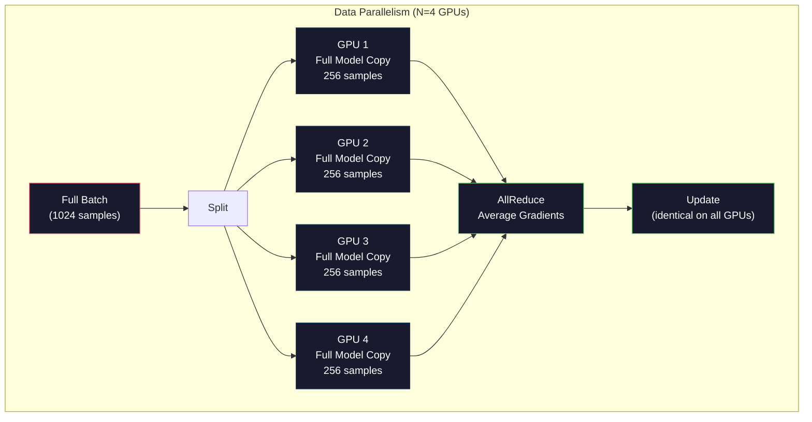
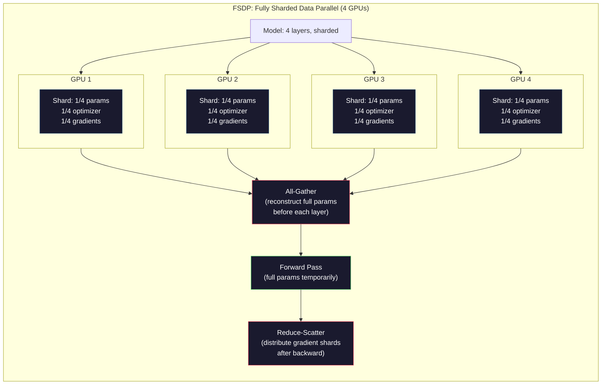
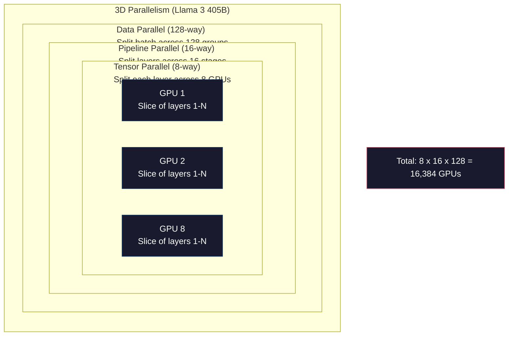

# 扩展：分布式训练，FSDP，DeepSpeed

> 你的124M模型在一张GPU上训练。现在尝试70亿参数。模型无法放入内存。数据在单机上需要数周。在规模扩展时，分布式训练不是可选的。它是唯一的前进道路。

**类型：** 构建
**语言：** Python
**先决条件：** 阶段10，第04课（预训练一个迷你GPT）
**时间：** ~120分钟

## 学习目标

- 解释三种并行方式（数据并行(Data Parallelism)、张量并行(Tensor Parallelism)、流水线并行(Pipeline Parallelism)）以及根据模型和集群规模每种方式何时必要
- 使用PyTorch DDP实现数据并行训练，并在多个GPU间进行梯度同步
- 计算给定模型大小的内存预算（权重+优化器状态+梯度+激活值），以确定最低硬件配置
- 配置FSDP或DeepSpeed ZeRO阶段以在GPU间分片模型状态，并适配超出单GPU内存的模型

## 问题

一个7B参数的模型在FP16下仅权重就需要14GB。Adam优化器为每个参数额外存储两份副本（一阶矩和二阶矩估计）。这又是28GB。反向传播期间的梯度再增加14GB。在存储任何激活值之前，你已经用了56GB。

一张NVIDIA A100拥有80GB内存。

80GB中消耗了56GB。剩下24GB用于激活值——前向传播过程中计算出的中间值，必须保留以用于反向传播。对于一个2048个token的序列，模型维度为4096，单层激活值大约需要64MB。有32层时，每个样本需要2GB。批次大小为8时需要16GB。你有24GB。批次大小为12时就会爆掉。

现在尝试70B参数。仅权重：FP16下140GB。一张GPU放不下。你至少需要2张A100（2×80GB=160GB）才能容纳权重。加上优化器状态和梯度，你需要更多：至少3张以上GPU，实际上根据分片策略需要8-16张。

Llama 3 405B在16,384张NVIDIA H100 GPU上训练。通过巧妙的架构（混合专家模型(Mixture of Experts)意味着每个token只有一小部分参数被激活）和训练效率，训练运行估计花费了$100 million in compute. DeepSeek V3 trained a comparable model for roughly $560万美元。

本课介绍使大规模训练成为可能的四种策略：数据并行(Data Parallelism)、张量并行(Tensor Parallelism)、流水线并行(Pipeline Parallelism)和完全分片数据并行(Fully Sharded Data Parallelism)。你将先用纯Python模拟每种策略来理解其机制，然后再接触分布式训练框架。

## 核心概念

### 为什么需要分布式

这里是真实模型的内存计算。每个数字都是计算出来的，不是估计的。

|  模型  |  参数  |  权重（FP16）  |  Adam状态  |  梯度（FP16）  |  总计（无激活值）  |
|-------|--------|----------------|-------------|------------------|----------------------|
|  GPT-2 Small  |  124M  |  248 MB  |  992 MB  |  248 MB  |  1.5 GB  |
|  Llama 3 8B  |  8B  |  16 GB  |  64 GB  |  16 GB  |  96 GB  |
|  Llama 3 70B  |  70B  |  140 GB  |  560 GB  |  140 GB  |  840 GB  |
|  Llama 3 405B  |  405B  |  810 GB  |  3,240 GB  |  810 GB  |  4,860 GB  |

“Adam状态”一列是关键。Adam为每个参数存储一个运行均值(m)和一个运行方差(v)，两者都是FP32。对于70B模型，那就是70B×4字节×2=560GB。仅优化器就需要七张A100。

单个H100有80GB。Llama 3 405B至少需要61张H100来容纳权重、优化器和梯度。加上激活值后数量进一步增加。Meta使用了16,384张GPU，不是因为他们想——而是因为他们不得不这么做。

### 数据并行(Data Parallelism)

最简单的分布式策略。将整个模型复制到N张GPU上。将每个训练批次分成N等份。每张GPU在其数据分片上运行前向和反向传播。反向传播后，平均所有GPU的梯度。每张GPU用相同的平均梯度更新其权重副本，保持所有副本同步。

**优点：** 线性吞吐量扩展。N张GPU每步处理N倍的数据。通信仅限于梯度平均，与计算重叠。

**缺点：** 每张GPU都持有模型、优化器状态和梯度的完整副本。对于70B模型，每张GPU需要840GB。数据并行对减少单GPU内存毫无作用。它只减少训练时间。

**计算：** 有效批次大小 = 每GPU批次大小 × N。对于N=64张GPU，每GPU批次为16，有效批次为1,024。Llama 3每步使用了1600万token的有效批次大小。



### 张量并行(Tensor Parallelism)

将单个层拆分到多张GPU上。单个矩阵乘法被分配给多张GPU，每张计算部分结果。

考虑前馈层中形状为(8192, 8192)的权重矩阵。采用4路张量并行，每张GPU持有一个(8192, 2048)的分片。每张GPU将输入与其分片相乘，产生部分结果。部分结果通过全规约(all-reduce)或全收集(all-gather)合并，产生完整输出。

**优点：** 减少模型权重的每GPU内存。70B模型拆分到8张GPU上，意味着每张GPU持有约87.5亿参数的权重。

**缺点：** 每层之后需要快速的GPU间通信。每次矩阵乘法后的全规约增加延迟。这在NVLink（同一节点内GPU间900 GB/s）上表现良好，但在由InfiniBand（400 Gb/s，约50 GB/s）连接的节点间表现不佳。张量并行几乎总是限制在单个节点内（8张GPU）。

**实际使用：** Megatron-LM率先采用了张量并行。Llama 3 405B在每节点内使用8路张量并行。

### 流水线并行(Pipeline Parallelism)

按层拆分模型。GPU 1 运行第 1-8 层，GPU 2 运行第 9-16 层，GPU 3 运行第 17-24 层，GPU 4 运行第 25-32 层。数据流经流水线：GPU 1 计算其层并将激活传递给 GPU 2，GPU 2 计算其层并传递给 GPU 3，依此类推。

**优点：** GPU 间通信量最小——仅传递层边界的激活值，与梯度或权重相比数据量很小。由于带宽需求低，可跨节点工作。

**缺点：** 流水线气泡。当 GPU 4 在微批次 1 上计算前向传播时，GPU 1、2 和 3 处于空闲状态（它们已转发完自己的部分）。反向传播时模式反转。使用朴素流水线时，GPU 利用率仅为 1/N（N 为流水线阶段数）。

**GPipe 和 PipeDream** 通过将批次拆分为微批次来解决气泡问题。GPU 1 在完成微批次 1 的前向传播后立即开始处理微批次 2。这使各流水线阶段的计算重叠。设微批次数为 M，阶段数为 N，气泡比例降至 (N-1)/M。使用 M=16 个微批和 N=4 个阶段时，气泡比例为 3/16 = 18.75% 的空闲时间。

### FSDP：全分片数据并行(Fully Sharded Data Parallel)

FSDP 结合了数据并行的可扩展性和分片的内存效率。每个 GPU 不再持有模型的完整副本，而是仅持有 1/N 的参数、梯度和优化器状态。

在某一层的前向传播之前，FSDP 执行一次**全收集(all-gather)**，从所有 GPU 收集完整参数到每个 GPU 内存中。前向传播后，每个 GPU 丢弃非本地的参数。反向传播时再次执行全收集以重建参数用于梯度计算。反向传播后，通过**归约分散(reduce-scatter)** 分发梯度分片，使得每个 GPU 仅存储 1/N 的梯度。

**70B 模型在 8 个 GPU 上的数学计算：**

|  组件  |  无 FSDP  |  有 FSDP  |
|-----------|-------------|-----------|
|  权重 (FP16)  |  每 GPU 140 GB  |  每 GPU 17.5 GB  |
|  Adam 状态 (FP32)  |  每 GPU 560 GB  |  每 GPU 70 GB  |
|  梯度 (FP16)  |  每 GPU 140 GB  |  每 GPU 17.5 GB  |
|  **总计**  |  **每 GPU 840 GB**  |  **每 GPU 105 GB**  |

没有 FSDP，70B 模型无法装进单个 80GB GPU。在 8 个 GPU 上使用 FSDP，每个 GPU 使用 105GB——等等，这仍然装不下。至少需要 16 个 GPU 才能使每 GPU 内存低于 80GB，或者将 FSDP 与激活检查点(activation checkpointing)结合（反向传播时重新计算激活而非存储）。

通信成本高于普通数据并行，因为每层之前都需要全收集。但内存节省使得原本无法进行的训练成为可能。



### DeepSpeed ZeRO

DeepSpeed 的 ZeRO（零冗余优化器，Zero Redundancy Optimizer）在概念上与 FSDP 相同，但由微软独立开发。它定义了三个阶段，每个阶段更激进地分片：

|  阶段  |  分片内容  |  内存节省  |  通信量  |
|-------|--------|---------------|---------------|
|  ZeRO-1  |  仅优化器状态  |  约 4 倍减少  |  与数据并行相同  |
|  ZeRO-2  |  + 梯度  |  约 8 倍减少  |  略多  |
|  ZeRO-3  |  + 参数  |  约 N 倍减少 (N 个 GPU)  |  每层全收集  |

ZeRO-3 等价于 FSDP。命名不同，机制相同。PyTorch 在 DeepSpeed 验证概念后添加了 FSDP 作为原生实现。

DeepSpeed 还引入了 ZeRO-Offload（将优化器状态卸载到 CPU 内存，更便宜且容量更大）和 ZeRO-Infinity（卸载到 NVMe SSD）。这些方法以计算速度为代价换取内存容量——卸载的操作速度较慢，但释放了 GPU 内存。

### 混合精度训练(Mixed Precision Training)

现代训练同时使用多种浮点格式：

- **前向传播**：FP16 或 BF16（16 位）。内存为 FP32 的一半。矩阵乘法在张量核心上运行速度快 2 倍。
- **主权重(Master weights)**：FP32（32 位）。优化器为保持数值精度而维护，用于权重更新。
- **损失缩放(Loss scaling)**：反向传播前将损失乘以一个大常数，以防止 FP16 梯度下溢为零。优化器步骤前除以相同常数。

BF16（脑浮点 16，Brain Float 16）的指数范围与 FP32 相同（8 位指数），但精度降低（7 位尾数，而 FP32 有 23 位）。由于能表示相同的值范围，它很少需要损失缩放。FP16 有 5 位指数和 10 位尾数——能表示精细值，但在极端大小下会溢出/下溢。

Google 的 TPU 原生使用 BF16。NVIDIA 的 A100 和 H100 同时支持 FP16 和 BF16。业界已基本转向 BF16，因为它消除了损失缩放带来的麻烦。

**7B 模型的内存对比：**

| 精度 | 权重 | 优化器 | 梯度 | 总计 |
|-----------|---------|-----------|-----------|-------|
| 全FP32 | 28 GB | 56 GB | 28 GB | 112 GB |
| 混合（BF16 + FP32主副本） | 14 GB | 56 GB | 14 GB | 84 GB |

混合精度在此模型上节省了28GB。无论精度如何，优化器状态始终以FP32存储——这是大多数内存的消耗所在。

### Megatron-LM与三维并行

真正的大规模训练结合了所有三种并行方式：

- **数据并行**跨节点组（扩展批量大小）
- **张量并行**在节点内（将层拆分到8个GPU）
- **流水线并行**跨节点（将层组拆分到不同机器）

Llama 3 405B在16,384个H100上：
- 每个节点内8路张量并行（每节点8个GPU）
- 跨节点16路流水线并行（16个流水线阶段）
- 剩余维度上128路数据并行（16,384 / 8 / 16 = 128）

这种三维分解（8 x 16 x 128 = 16,384）就是如何扩展到数千个GPU。每个GPU看到一个不同的数据分片（数据并行），持有每个层的一个切片（张量并行），并计算不同的一组层（流水线并行）。

DeepSeek V3采取了不同的方法。他们的混合专家(Mixture of Experts)架构每个令牌仅激活671B参数中的37B。这意味着每个GPU只需计算（并存储激活值）活跃参数。他们在2,048个H800 GPU上训练——不到Meta GPU数量的1/8——耗时$5.6M vs Meta's estimated $。



```figure
paged-kv-cache
```

## 动手构建

### 步骤1：模拟数据并行

将一个批次拆分到模拟的GPU上。每个GPU在其分片上执行前向计算。平均“梯度”（我们将其模拟为损失值）。

```python
import numpy as np

def simulate_data_parallelism(data, num_gpus, model_fn):
    batch_size = len(data)
    shard_size = batch_size // num_gpus
    remainder = batch_size % num_gpus

    gpu_losses = []
    gpu_gradients = []

    offset = 0
    for gpu_id in range(num_gpus):
        extra = 1 if gpu_id < remainder else 0
        shard = data[offset:offset + shard_size + extra]
        offset += shard_size + extra

        loss, grad = model_fn(shard)
        gpu_losses.append(loss)
        gpu_gradients.append(grad)

    avg_loss = np.mean(gpu_losses)
    avg_gradient = np.mean(gpu_gradients, axis=0)

    return avg_loss, avg_gradient
```

全规约操作（平均梯度）是数据并行中唯一的通信。在实践中，NVIDIA GPU上使用NCCL库，它实现了环形全规约：每个GPU将其1/N的梯度发送给邻居，从另一个邻居接收1/N，经过N-1步后每个GPU都获得完整的平均值。总通信量：2 x 梯度大小 x (N-1)/N，对于大N接近2倍梯度大小。

### 步骤2：模拟张量并行

将一个权重矩阵拆分到多个GPU上。每个GPU计算部分矩阵乘法。合并结果。

```python
def simulate_tensor_parallelism(input_data, weight_matrix, num_gpus):
    d_in, d_out = weight_matrix.shape
    assert d_out % num_gpus == 0, f"d_out {d_out} not divisible by num_gpus {num_gpus}"
    shard_size = d_out // num_gpus

    partial_results = []
    for gpu_id in range(num_gpus):
        start = gpu_id * shard_size
        end = start + shard_size
        weight_shard = weight_matrix[:, start:end]

        partial = input_data @ weight_shard
        partial_results.append(partial)

    full_output = np.concatenate(partial_results, axis=-1)

    direct_output = input_data @ weight_matrix
    error = np.abs(full_output - direct_output).max()

    return full_output, error
```

误差应为零（或机器精度）。张量并行在数学上是精确的——它产生与在单个GPU上计算完整矩阵乘法相同的结果。拆分沿输出维度进行，因此每个GPU生成不同的列块，拼接即可重建完整结果。

对于列并行线性层（拆分输出维度），使用拼接。对于行并行（拆分输入维度），使用求和。在Transformer的FFN中，第一个线性层（扩展）使用列并行，第二个线性层（收缩）使用行并行。这避免了两个层之间的全规约。

### 步骤3：模拟流水线并行

将模型的层拆分到虚拟GPU上。展示早期阶段空闲而后期阶段计算的泡沫问题。

```python
def simulate_pipeline_parallelism(num_layers, num_stages, num_microbatches):
    layers_per_stage = num_layers // num_stages

    timeline = {}
    clock = 0

    for mb in range(num_microbatches):
        for stage in range(num_stages):
            start_time = max(
                timeline.get((stage, mb - 1, "fwd"), (0, 0))[1] if mb > 0 else 0,
                timeline.get((stage - 1, mb, "fwd"), (0, 0))[1] if stage > 0 else 0,
            )
            end_time = start_time + layers_per_stage
            timeline[(stage, mb, "fwd")] = (start_time, end_time)

    last_fwd_end = max(v[1] for v in timeline.values())

    for mb in range(num_microbatches - 1, -1, -1):
        for stage in range(num_stages - 1, -1, -1):
            deps = [last_fwd_end]
            if mb < num_microbatches - 1 and (stage, mb + 1, "bwd") in timeline:
                deps.append(timeline[(stage, mb + 1, "bwd")][1])
            if stage < num_stages - 1 and (stage + 1, mb, "bwd") in timeline:
                deps.append(timeline[(stage + 1, mb, "bwd")][1])
            start_time = max(deps)
            end_time = start_time + layers_per_stage
            timeline[(stage, mb, "bwd")] = (start_time, end_time)

    total_time = max(v[1] for v in timeline.values())
    compute_time = num_microbatches * num_stages * layers_per_stage * 2
    bubble_fraction = 1.0 - compute_time / (total_time * num_stages)

    return timeline, total_time, bubble_fraction
```

对于4个阶段和1个微批次，泡沫占比为75%——任何时候都有四分之三的GPU空闲。使用16个微批次时，泡沫占比降至约19%。消除泡沫的代价是内存：必须同时存储所有运行中微批次的激活值。

### 步骤4：内存计算器

计算训练任何模型大小的确切内存需求。

```python
def memory_calculator(
    params_billions,
    precision_bytes=2,
    optimizer="adam",
    num_gpus=1,
    sharding="none",
    sequence_length=2048,
    batch_size_per_gpu=1,
    hidden_dim=None,
    num_layers=None,
):
    params = params_billions * 1e9

    weight_memory = params * precision_bytes

    if optimizer == "adam":
        optimizer_memory = params * 4 * 2
    elif optimizer == "sgd":
        optimizer_memory = params * 4
    else:
        optimizer_memory = 0

    gradient_memory = params * precision_bytes

    total_no_activation = weight_memory + optimizer_memory + gradient_memory

    if hidden_dim and num_layers:
        activation_per_layer = (
            sequence_length * batch_size_per_gpu * hidden_dim * precision_bytes * 4
        )
        activation_memory = activation_per_layer * num_layers
    else:
        activation_memory = params * precision_bytes * 0.5

    if sharding == "fsdp" or sharding == "zero3":
        weight_memory /= num_gpus
        optimizer_memory /= num_gpus
        gradient_memory /= num_gpus
    elif sharding == "zero2":
        optimizer_memory /= num_gpus
        gradient_memory /= num_gpus
    elif sharding == "zero1":
        optimizer_memory /= num_gpus

    per_gpu_total = weight_memory + optimizer_memory + gradient_memory + activation_memory

    return {
        "params_billions": params_billions,
        "weights_gb": weight_memory / 1e9,
        "optimizer_gb": optimizer_memory / 1e9,
        "gradients_gb": gradient_memory / 1e9,
        "activations_gb": activation_memory / 1e9,
        "per_gpu_total_gb": per_gpu_total / 1e9,
        "total_across_gpus_gb": per_gpu_total * num_gpus / 1e9,
        "fits_on_80gb": per_gpu_total / 1e9 <= 80,
        "num_gpus": num_gpus,
        "sharding": sharding,
    }
```

此计算器回答了每个机器学习工程师都会问的问题：“我需要多少GPU？”输入模型大小并查看是否适合。调整分片策略，直到每个GPU的总内存低于80GB。

### 步骤5：混合精度模拟

比较FP32、FP16和混合精度训练的内存使用。

```python
def mixed_precision_comparison(params_billions):
    params = params_billions * 1e9

    fp32_weights = params * 4
    fp32_optimizer = params * 4 * 2
    fp32_gradients = params * 4
    fp32_total = fp32_weights + fp32_optimizer + fp32_gradients

    fp16_weights = params * 2
    fp16_master = params * 4
    fp16_optimizer = params * 4 * 2
    fp16_gradients = params * 2
    fp16_total = fp16_weights + fp16_master + fp16_optimizer + fp16_gradients

    mixed_weights = params * 2
    mixed_optimizer = params * 4 * 2
    mixed_gradients = params * 2
    mixed_total = mixed_weights + mixed_optimizer + mixed_gradients

    return {
        "fp32_total_gb": fp32_total / 1e9,
        "fp16_with_master_gb": fp16_total / 1e9,
        "mixed_bf16_gb": mixed_total / 1e9,
        "savings_vs_fp32": 1 - mixed_total / fp32_total,
    }
```

对大多数人来说最大的意外：混合精度并不能将内存减半。优化器状态（Adam的m和v）无论精度如何都保持在FP32。对于7B模型，FP32训练使用112GB。混合精度使用84GB。这减少了25%，而不是50%。优化器占主导地位。

## 使用它

### 运行所有模拟

```python
def run_all_demos():
    print("=" * 70)
    print("DATA PARALLELISM SIMULATION")
    print("=" * 70)

    np.random.seed(42)
    data = np.random.randn(64, 32)
    weight = np.random.randn(32, 16)

    def model_fn(batch):
        output = batch @ weight
        loss = np.mean(output ** 2)
        grad = 2 * batch.T @ (batch @ weight) / len(batch)
        return loss, grad

    for n_gpus in [1, 2, 4, 8]:
        loss, grad = simulate_data_parallelism(data, n_gpus, model_fn)
        print(f"  {n_gpus} GPUs: loss={loss:.4f}, grad_norm={np.linalg.norm(grad):.4f}")

    print()
    print("=" * 70)
    print("TENSOR PARALLELISM SIMULATION")
    print("=" * 70)

    x = np.random.randn(4, 8192)
    W = np.random.randn(8192, 8192)

    for n_gpus in [1, 2, 4, 8]:
        output, error = simulate_tensor_parallelism(x, W, n_gpus)
        print(f"  {n_gpus} GPUs: output_shape={output.shape}, max_error={error:.2e}")

    print()
    print("=" * 70)
    print("PIPELINE PARALLELISM SIMULATION")
    print("=" * 70)

    for n_mb in [1, 4, 8, 16, 32]:
        _, total_t, bubble = simulate_pipeline_parallelism(32, 4, n_mb)
        print(f"  {n_mb:2d} micro-batches: total_time={total_t:4d}, bubble={bubble:.1%}")

    print()
    print("=" * 70)
    print("MEMORY CALCULATOR")
    print("=" * 70)

    configs = [
        (7, "none", 1),
        (7, "fsdp", 8),
        (70, "none", 1),
        (70, "fsdp", 8),
        (70, "fsdp", 16),
        (405, "fsdp", 64),
        (405, "fsdp", 128),
    ]

    print(f"  {'Model':>8} {'Sharding':>8} {'GPUs':>5} {'Per-GPU':>10} {'Fits 80GB':>10}")
    print("  " + "-" * 50)
    for params, shard, gpus in configs:
        result = memory_calculator(params, num_gpus=gpus, sharding=shard)
        fits = "Yes" if result["fits_on_80gb"] else "No"
        print(f"  {params:>6}B {shard:>8} {gpus:>5} {result['per_gpu_total_gb']:>8.1f}GB {fits:>10}")

    print()
    print("=" * 70)
    print("MIXED PRECISION COMPARISON")
    print("=" * 70)

    for params_b in [7, 13, 70, 405]:
        result = mixed_precision_comparison(params_b)
        print(f"  {params_b}B: FP32={result['fp32_total_gb']:.0f}GB, "
              f"Mixed BF16={result['mixed_bf16_gb']:.0f}GB, "
              f"Savings={result['savings_vs_fp32']:.0%}")
```

## 发布

本课生成`outputs/prompt-distributed-training-planner.md`——一个接受模型大小和可用硬件，然后输出完整分布式训练计划的提示：并行策略、内存预算、通信开销和预期吞吐量。

## 练习

1. 修改内存计算器以包含激活检查点。使用检查点时，仅每隔K层存储激活值（典型K=1，即全部重新计算）。展示内存与计算的权衡：检查点节省多少内存，以及会拖慢训练多少（完全检查点大约增加33%的计算量）？

2. 扩展流水线并行模拟以实现PipeDream使用的1F1B（一次前向，一次反向）调度。比较4个阶段和8个微批次下与朴素调度的气泡比例。由于1F1B调度更早开始反向传播，其峰值内存应更小。

3. 实现梯度累积模拟器。不在每个微批次后执行全规约，而是本地累积K步的梯度，然后进行全规约。展示这如何将通信量减少K倍，同时产生相同的最终梯度（从而训练结果相同）。

4. 构建一个成本估算器。给定模型大小、目标token数、GPU类型（A100，每小时$2/hr, H100 at $3.50美元）和并行策略，以美元估算总训练成本。对照已知成本验证：据报道Llama 3 405B成本约为$100M, DeepSeek V3 cost ~$5.6百万美元。

5. 在内存计算器中添加ZeRO-Offload。假设每个节点的CPU内存为512GB，NVMe为2TB。展示将优化器状态卸载到CPU如何使得70B模型可以在4个GPU上训练而不是16个，但代价是优化器步骤减慢30-50%。

## 关键术语

|  术语  |  人们的说法  |  实际含义  |
|------|----------------|----------------------|
|  数据并行  |  "将模型复制到每个GPU"  |  每个GPU处理不同的数据分片；每一步后通过全规约平均梯度  |
|  张量并行  |  "将一个层拆分到多个GPU"  |  划分权重矩阵，使每个GPU计算矩阵乘的一部分；需要快速的NVLink互连  |
|  流水线并行  |  "将层拆分到多个GPU"  |  每个GPU运行不同的层组；数据通过微批次在流水线中流动以减少气泡  |
|  FSDP  |  "分片一切"  |  全分片数据并行——每个GPU持有1/N的权重、梯度和优化器状态；计算前进行全收集  |
|  ZeRO  |  "DeepSpeed版本的FSDP"  |  零冗余优化器，分为3个阶段：分片优化器（阶段1）、+梯度（阶段2）、+参数（阶段3）  |
|  全规约  |  "跨GPU平均"  |  集合操作，每个GPU最终获得所有GPU输入的和（或平均值）——通常实现为环状全规约  |
|  全收集  |  "从所有GPU收集"  |  集合操作，每个GPU最终获得所有GPU数据的拼接——用于FSDP中重建完整参数  |
|  规约分散  |  "求和并分发"  |  集合操作，对数据进行规约（求和）并将不同块分发到不同GPU——用于FSDP中的梯度分片  |
|  混合精度  |  "半精度训练"  |  前向/反向使用FP16/BF16，优化器状态使用FP32——节省约25%内存而非50%，因为优化器占主导  |
|  流水线气泡  |  "流水线中的空闲时间"  |  GPU等待上一阶段数据而空闲的时间比例——通过使用更多微批次来减少  |

## 延伸阅读

- [Rajbhandari et al., 2020 -- "ZeRO: Memory Optimizations Toward Training Trillion Parameter Models"](https://arxiv.org/abs/1910.02054) —— 定义三个分片阶段的DeepSpeed ZeRO论文
- [Rajbhandari et al., 2020 -- "ZeRO: Memory Optimizations Toward Training Trillion Parameter Models"](https://arxiv.org/abs/1910.02054) —— NVIDIA用于Transformer的张量并行
- [Rajbhandari et al., 2020 -- "ZeRO: Memory Optimizations Toward Training Trillion Parameter Models"](https://arxiv.org/abs/1910.02054) —— 结合数据、张量和流水线的3D并行
- [Rajbhandari et al., 2020 -- "ZeRO: Memory Optimizations Toward Training Trillion Parameter Models"](https://arxiv.org/abs/1910.02054) —— PyTorch原生的FSDP实现
- [Rajbhandari et al., 2020 -- "ZeRO: Memory Optimizations Toward Training Trillion Parameter Models"](https://arxiv.org/abs/1910.02054) —— 16,384 GPU训练及3D并行细节
- [Rajbhandari et al., 2020 -- "ZeRO: Memory Optimizations Toward Training Trillion Parameter Models"](https://arxiv.org/abs/1910.02054) —— MoE架构如何将训练成本降低一个数量级
