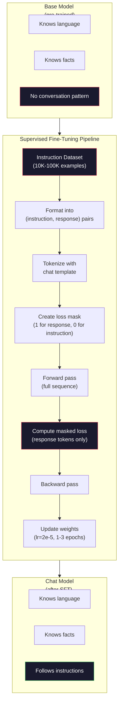

# 指令微调(Instruction Tuning, SFT)

> 基础模型只做一件事：预测下一个词元(token)。它不遵循指令，不回答问题，也不会拒绝有害请求。SFT 是连接词元预测器和有用助手的桥梁。你曾与之对话的每个模型——Claude、GPT、Llama Chat——都经历过这一步。

**类型：** 构建
**语言：** Python (使用 numpy)
**前置条件：** 第10阶段，第04课（预训练一个迷你GPT）
**时间：** ~90分钟

## 学习目标

- 实现监督式微调(Supervised Fine-Tuning, SFT)，将基础语言模型转换为遵循指令的助手
- 使用包含系统(system)、用户(user)和助手(assistant)角色的聊天模板格式化训练数据，并对非助手词元进行损失遮蔽(loss masking)
- 解释为什么需要SFT：基础模型继续文本而非回答问题
- 通过在保留指令集上比较基础模型与微调模型的响应，评估SFT质量

## 问题

你在第04课训练了一个模型。给定一个序列，它能预测下一个词元。输入“The transformer architecture”，它可能续写为“has revolutionized natural language processing.” 对于一个下一个词元预测器来说，这已经很了不起了。

现在试试这个：输入“What is the capital of France?” 基础模型不会回答“Paris”。它会延续模式。它可能生成“What is the capital of Germany? What is the capital of Spain?” 因为它从包含问题列表的文档中学习。或者它可能生成“is a question that many people ask”，因为这是一个合理的下一个词元续写。模型没有*回答*的概念。它只知道*延续*。

这就是GPT-3（基础模型，2020年6月发布）与ChatGPT（指令微调模型，2022年11月发布）之间的差距。相同的架构。相同的预训练。区别在于20,000到100,000个精心构建的（指令，响应）对，这些对教会了模型遵循对话模式。

Stanford Alpaca证明了不需要数百万个例子。2023年3月，他们在仅52,000个由GPT-3.5生成的指令-响应对上微调了Llama 7B。总成本：$600. The result was a chatbot that could follow instructions, answer questions, and hold conversations. Not as good as ChatGPT, but shockingly close for $600美元的API费用和几个小时的训练时间。

Meta的Llama 2 Chat在其初始SFT阶段仅使用了约27,000个高质量例子。关键见解：质量比数量更重要。由熟练标注员编写的27,000个例子胜过了从互联网抓取的100万个嘈杂例子。

## 核心概念

### SFT实际做了什么

监督式微调延续了预训练中的相同训练循环——前向传播、计算损失、反向传播、更新权重——但针对的是不同类型的数据。不再使用原始文本，而是在结构化对话上训练：

```json
{
  "system": "You are a helpful assistant.",
  "user": "What is the capital of France?",
  "assistant": "The capital of France is Paris."
}
```

模型已经知道巴黎是法国的首都。这是在维基百科、教科书和网页上的预训练中学到的。SFT不会教给模型新事实。它教会模型一种新的*行为*：当你看到一个问题时，生成一个答案。当你看到一个指令时，生成一个完成。当你看到一个有害请求时，生成一个拒绝。

可以这样理解：预训练赋予模型知识。SFT赋予模型礼仪。

### 数据格式

三种格式主导着业界。每种都以不同的分隔符编码相同的信息——谁说了什么。

**Alpaca格式**（斯坦福，2023年3月）：

```json
{
  "instruction": "Summarize the following article in 3 sentences.",
  "input": "The European Central Bank raised interest rates...",
  "output": "The ECB increased rates by 25 basis points..."
}
```

简单且广泛使用。`input`字段是可选的——许多指令不需要额外上下文。斯坦福以这种格式发布了52,000个例子，由GPT-3.5生成，花费600美元。这引发了开源指令微调运动。

**ShareGPT格式**（社区，2023年）：

```json
{
  "conversations": [
    {"from": "system", "value": "You are a helpful assistant."},
    {"from": "human", "value": "What causes tides?"},
    {"from": "gpt", "value": "Tides are caused by the gravitational pull of the Moon..."},
    {"from": "human", "value": "How often do they occur?"},
    {"from": "gpt", "value": "Most coastal areas experience two high tides and two low tides per day..."}
  ]
}
```

支持多轮对话。“from”字段按惯例使用“human”和“gpt”，无论实际模型是什么。Vicuna在从用户共享的ChatGPT转录中抓取的70,000个ShareGPT对话上进行了训练。

**ChatML格式**（OpenAI，许多开源模型使用）：

```
<|im_start|>system
You are a helpful assistant.<|im_end|>
<|im_start|>user
What is the capital of France?<|im_end|>
<|im_start|>assistant
The capital of France is Paris.<|im_end|>
```

使用特殊词元(`<|im_start|>`, `<|im_end|>`)分隔角色。这些词元在微调期间被添加到分词器(tokenizer)的词汇表中。Qwen、Yi和许多其他模型使用ChatML。

这三种格式都完成了同样的事情：它们告诉模型“这是指令，这是响应，学习这个模式。”

### 为什么有效

模型已经从预训练中了解了语言。它已经看过数十亿个例子：问题后接答案，指令后接完成，以及人们之间的对话。这些模式已经编码在权重中。

SFT集中了这种潜在能力。模型不再需要根据上下文来判断是回答问题还是继续文档，SFT明确地在对话模式上进行训练。经过几千个例子后，模型学会了：当你看到助手角色标记时，生成一个有用的响应。

这就是为什么27,000个例子就足够了。你不是在教模型英语。你不是在教它关于世界的事实。你是在教它一个简单的行为：响应指令。知识已经在那里了。

### 遮蔽损失(Masked Loss)

这是SFT中最重要的技术细节，但大多数教程都跳过了它。

在预训练期间，你在每个词元上计算损失。模型学习预测序列中的每一个下一个词元。在SFT期间，你只在*响应*词元上计算损失。指令词元作为上下文存在，但模型不会因“错误预测”它们而受到惩罚。

为什么？因为你不想让模型学习*生成*指令。你想让它学习*响应*指令。如果你在指令词元上计算损失，你就是在训练模型将“What is the capital of France?”预测为它自己在提问。这会浪费梯度信号，并可能混淆模型的角色。

实践中，你会创建一个损失掩码：回复令牌为1，指令令牌为0。在求平均之前，将每个令牌的损失乘以此掩码。

```
Tokens:    [SYS] You are helpful [USER] What is the capital? [ASST] Paris is the capital [EOS]
Loss mask:   0    0    0     0      0     0   0  0     0       1     1    1   1     1      1
```

只有`[ASST]`之后的令牌才参与损失计算。在前向传播过程中，模型会看到完整的对话（它需要指令来产生正确的回复），但只根据它预测回复的好坏来更新权重。

### 训练超参数

SFT使用的超参数与预训练截然不同。你不是从头开始训练，而是在调整一个已经能工作的模型。

| 参数 | 预训练（Llama 2 7B） | SFT（Llama 2 Chat） |
|-----------|---------------------------|---------------------|
| 学习率 | 3e-4（峰值） | 2e-5 |
| 训练轮次 | 1（数据单次遍历） | 2 |
| 批大小 | 400万令牌 | 64个样本 |
| 预热步数 | 2,000 | 0-100 |
| 权重衰减 | 0.1 | 0.0-0.1 |
| 数据规模 | 2万亿令牌 | 27,000个样本 |

SFT的学习率低15倍。这至关重要。微调期间的高学习率会破坏预训练知识。模型会“遗忘”已学内容，并对小规模微调数据集过拟合。这就是灾难性遗忘(Catastrophic Forgetting)。

两个训练轮次意味着每个训练样本被模型看到两次。在小数据集上超过3个轮次会导致记忆化——模型开始逐字复述训练样本，而不是泛化。

### 灾难性遗忘(Catastrophic Forgetting)

微调可能会破坏通用能力。在指令遵循数据上训练过久，模型会失去编写代码、做数学或创作文本的能力。它变得非常擅长训练数据的特定格式，而在其他所有方面表现糟糕。

三种缓解措施：

1. **低学习率。** 1e-5到5e-5。更小的更新意味着对预训练特征的破坏更少。

2. **短训练。** 1-3个轮次。在模型过拟合之前停止。

3. **混入预训练数据。** Llama 2 Chat在SFT数据集中混入少量（2-5%）原始预训练数据。这“提醒”模型其通用能力，同时学习新的指令遵循行为。

### 实际数据

在一个7B模型上微调10,000个高质量指令对，大约需要1小时，使用单张NVIDIA A100 80GB GPU。具体计算如下：

- 10,000个样本 x 512令牌平均 = 5.12M令牌
- 2个轮次 = 10.24M令牌总计
- A100在7B模型微调上的吞吐量：约3,000令牌/秒
- 10.24M / 3,000 = 约3,400秒 = 约57分钟

对于我们的迷你GPT（4层，128维），训练几乎是瞬间完成。关键在于理解机制，而非规模。



## 动手构建

### 步骤1：指令数据集(Instruction Dataset)

创建一个合成指令数据集。在生产中，像Scale AI和Anthropic这样的公司雇佣人类标注员来编写这些数据。我们以编程方式创建它们以演示格式。

```python
import numpy as np

INSTRUCTION_DATA = [
    {
        "instruction": "What is the capital of France?",
        "response": "The capital of France is Paris."
    },
    {
        "instruction": "Explain gravity in one sentence.",
        "response": "Gravity is the force that attracts objects with mass toward each other."
    },
    {
        "instruction": "Write a haiku about the ocean.",
        "response": "Waves crash on the shore, salt and foam beneath the sun, endless blue expanse."
    },
    {
        "instruction": "What is 15 multiplied by 7?",
        "response": "15 multiplied by 7 is 105."
    },
    {
        "instruction": "Name three programming languages.",
        "response": "Three programming languages are Python, Rust, and TypeScript."
    },
    {
        "instruction": "Summarize photosynthesis.",
        "response": "Photosynthesis converts sunlight, water, and carbon dioxide into glucose and oxygen."
    },
    {
        "instruction": "What year did World War II end?",
        "response": "World War II ended in 1945."
    },
    {
        "instruction": "Define machine learning.",
        "response": "Machine learning is a field where algorithms learn patterns from data to make predictions."
    },
]
```

八个样本非常小。Stanford Alpaca使用了52,000个。但无论你有8个还是52,000个，机制都是相同的：分词、掩码、仅对回复计算损失。

### 步骤2：使用聊天模板分词(Tokenize with Chat Template)

将指令-回复对转换为带有特殊角色标记的令牌序列。这些标记告诉模型指令在哪里结束，回复在哪里开始。

```python
SPECIAL_TOKENS = {
    "INST_START": 253,
    "INST_END": 254,
    "RESP_START": 255,
}


def tokenize_instruction_pair(instruction, response, vocab_size=256):
    inst_tokens = list(instruction.encode("utf-8"))
    resp_tokens = list(response.encode("utf-8"))

    inst_tokens = [min(t, vocab_size - 4) for t in inst_tokens]
    resp_tokens = [min(t, vocab_size - 4) for t in resp_tokens]

    tokens = (
        [SPECIAL_TOKENS["INST_START"]]
        + inst_tokens
        + [SPECIAL_TOKENS["INST_END"]]
        + [SPECIAL_TOKENS["RESP_START"]]
        + resp_tokens
    )

    return tokens


def create_loss_mask(tokens):
    mask = np.zeros(len(tokens), dtype=np.float32)
    in_response = False

    for i, token in enumerate(tokens):
        if token == SPECIAL_TOKENS["RESP_START"]:
            in_response = True
            continue
        if in_response:
            mask[i] = 1.0

    return mask
```

损失掩码中，指令令牌全为0，回复令牌全为1。`RESP_START` 令牌本身的掩码为0，因为它是一个分隔符，而不是回复内容的一部分。

### 步骤3：掩码交叉熵损失(Masked Cross-Entropy Loss)

标准交叉熵，但乘以损失掩码。只有响应词元(Response Token)对梯度有贡献。

```python
def masked_cross_entropy_loss(logits, targets, loss_mask):
    batch, seq_len, vocab_size = logits.shape
    logits_flat = logits.reshape(-1, vocab_size)
    targets_flat = targets.reshape(-1)
    mask_flat = loss_mask.reshape(-1)

    max_logits = logits_flat.max(axis=-1, keepdims=True)
    log_softmax = logits_flat - max_logits - np.log(
        np.exp(logits_flat - max_logits).sum(axis=-1, keepdims=True)
    )

    per_token_loss = -log_softmax[np.arange(len(targets_flat)), targets_flat]

    masked_loss = per_token_loss * mask_flat
    num_response_tokens = mask_flat.sum()
    if num_response_tokens == 0:
        return 0.0
    loss = masked_loss.sum() / num_response_tokens

    return loss
```

分母是`num_response_tokens`，不是`seq_len`。如果除以总序列长度，较长的指令会稀释梯度信号。除以响应词元数量可确保每个响应词元获得相同权重，无论指令长度如何。

### 第4步：监督微调训练循环

复用第04课的MiniGPT。训练循环与预训练几乎相同，但加入了指令格式化和掩码损失。

```python
import sys
import os
sys.path.insert(0, os.path.join(os.path.dirname(__file__), "..", "..", "04-pre-training-mini-gpt", "code"))
from main import MiniGPT, LayerNorm, FeedForward, MultiHeadAttention, TransformerBlock, Embedding


def sft_train(model, dataset, num_epochs=2, lr=2e-5, seq_len=64):
    formatted_data = []
    for example in dataset:
        tokens = tokenize_instruction_pair(example["instruction"], example["response"])
        mask = create_loss_mask(tokens)
        formatted_data.append((tokens, mask))

    print(f"SFT Training: {len(formatted_data)} examples, {num_epochs} epochs, lr={lr}")
    print(f"Total tokens: {sum(len(t) for t, _ in formatted_data):,}")
    print()

    losses = []

    for epoch in range(num_epochs):
        epoch_loss = 0.0
        num_batches = 0

        indices = np.random.permutation(len(formatted_data))

        for idx in indices:
            tokens, mask = formatted_data[idx]

            if len(tokens) < 3:
                continue
            if len(tokens) > seq_len:
                tokens = tokens[:seq_len]
                mask = mask[:seq_len]

            input_ids = np.array(tokens[:-1]).reshape(1, -1)
            target_ids = np.array(tokens[1:]).reshape(1, -1)
            loss_mask = np.array(mask[1:]).reshape(1, -1)

            logits = model.forward(input_ids)
            loss = masked_cross_entropy_loss(logits, target_ids, loss_mask)

            batch_size, s_len, v_size = logits.shape
            probs = np.exp(logits - logits.max(axis=-1, keepdims=True))
            probs = probs / probs.sum(axis=-1, keepdims=True)
            dlogits = probs.copy()
            dlogits[np.arange(batch_size)[:, None], np.arange(s_len), target_ids] -= 1.0

            mask_expanded = loss_mask[:, :, np.newaxis]
            num_resp = loss_mask.sum()
            if num_resp > 0:
                dlogits = dlogits * mask_expanded / num_resp

            for block in model.blocks:
                block.ffn.W1 -= lr * np.random.randn(*block.ffn.W1.shape) * 0.01
                block.ffn.W2 -= lr * np.random.randn(*block.ffn.W2.shape) * 0.01
                block.ffn.b1 -= lr * np.random.randn(*block.ffn.b1.shape) * 0.01
                block.ffn.b2 -= lr * np.random.randn(*block.ffn.b2.shape) * 0.01

            epoch_loss += loss
            num_batches += 1
            losses.append(loss)

        avg_loss = epoch_loss / max(num_batches, 1)
        print(f"Epoch {epoch + 1}/{num_epochs} | Avg Loss: {avg_loss:.4f}")

    return model, losses
```

学习率为2e-5，与Llama 2 Chat一致。对比预训练中使用的3e-4——小了15倍。梯度被掩码：指令词元产生零梯度。只有响应词元推动权重更新。

### 第5步：比较基座模型与监督微调模型

监督微调的全部意义在于行为改变。我们通过检查模型如何响应指令格式输入与原始文本续写来衡量这一点。

```python
def generate_response(model, prompt_tokens, max_new_tokens=50, temperature=0.8):
    tokens = list(prompt_tokens)
    seq_len = model.embedding.pos_embed.shape[0]

    for _ in range(max_new_tokens):
        context = np.array(tokens[-seq_len:]).reshape(1, -1)
        logits = model.forward(context)
        next_logits = logits[0, -1, :]

        next_logits = next_logits / max(temperature, 1e-8)
        probs = np.exp(next_logits - next_logits.max())
        probs = probs / probs.sum()
        probs = np.clip(probs, 1e-10, 1.0)
        probs = probs / probs.sum()

        next_token = np.random.choice(len(probs), p=probs)
        tokens.append(int(next_token))

    return tokens


def evaluate_instruction_following(model, instructions):
    print("Evaluating instruction following:")
    print("-" * 50)

    for instruction in instructions:
        tokens = (
            [SPECIAL_TOKENS["INST_START"]]
            + [min(t, 252) for t in list(instruction.encode("utf-8"))]
            + [SPECIAL_TOKENS["INST_END"]]
            + [SPECIAL_TOKENS["RESP_START"]]
        )

        output = generate_response(model, tokens, max_new_tokens=30, temperature=0.6)
        response_start = len(tokens)
        response_tokens = output[response_start:]
        response_bytes = bytes([t for t in response_tokens if t < 128])
        response_text = response_bytes.decode("utf-8", errors="replace")

        print(f"  Q: {instruction}")
        print(f"  A: {response_text[:80]}")
        print()
```

在仅有8个样本的小模型上，响应不会有意义。这是预期行为。重要的是*结构*：模型学会在响应标记之后生成输出，而不是继续生成更多指令。

### 第6步：衡量灾难性遗忘(Catastrophic Forgetting)

比较模型在监督微调前后的下一个词元预测能力。如果监督微调损害了通用能力，原始文本的损失会增加。

```python
def measure_forgetting(model, test_text, seq_len=64):
    tokens = np.array(list(test_text.encode("utf-8")[:512]))

    total_loss = 0.0
    num_windows = 0

    for start in range(0, len(tokens) - seq_len - 1, seq_len):
        input_ids = tokens[start:start + seq_len].reshape(1, -1)
        target_ids = tokens[start + 1:start + seq_len + 1].reshape(1, -1)

        logits = model.forward(input_ids)

        batch, s_len, vocab_size = logits.shape
        logits_flat = logits.reshape(-1, vocab_size)
        targets_flat = target_ids.reshape(-1)

        max_logits = logits_flat.max(axis=-1, keepdims=True)
        log_softmax = logits_flat - max_logits - np.log(
            np.exp(logits_flat - max_logits).sum(axis=-1, keepdims=True)
        )

        loss = -log_softmax[np.arange(len(targets_flat)), targets_flat].mean()
        total_loss += loss
        num_windows += 1

    return total_loss / max(num_windows, 1)
```

在实际微调中，你会在整个训练过程中跟踪这个指标。如果原始文本损失增加超过10-15%，你的监督微调过于激进。降低学习率或减少训练轮数。

## 使用它

### 完整监督微调流程演示

```python
if __name__ == "__main__":
    np.random.seed(42)

    test_text = """The transformer architecture processes sequences through self-attention.
Each layer applies multi-head attention followed by a feedforward network.
Residual connections and layer normalization stabilize deep networks.
The model learns to predict the next token given all previous tokens."""

    print("=" * 70)
    print("INSTRUCTION TUNING (SFT) DEMO")
    print("=" * 70)
    print()

    model = MiniGPT(
        vocab_size=256, embed_dim=128, num_heads=4,
        num_layers=4, max_seq_len=128, ff_dim=512
    )
    print(f"Model: {model.count_parameters():,} parameters")
    print(f"Config: 4 layers, 4 heads, 128 dims (mini GPT from Lesson 04)")
    print()

    print("PRE-SFT: Measuring base model loss on raw text")
    base_loss = measure_forgetting(model, test_text)
    print(f"  Base model loss: {base_loss:.4f}")
    print()

    print("=" * 70)
    print("SFT TRAINING")
    print("=" * 70)

    model, losses = sft_train(
        model, INSTRUCTION_DATA, num_epochs=3, lr=2e-5, seq_len=128
    )

    print()
    print("POST-SFT: Measuring fine-tuned model loss on raw text")
    sft_loss = measure_forgetting(model, test_text)
    print(f"  SFT model loss: {sft_loss:.4f}")
    print(f"  Change: {((sft_loss - base_loss) / base_loss * 100):+.1f}%")
    if abs(sft_loss - base_loss) / base_loss < 0.15:
        print("  Minimal forgetting (< 15% change)")
    else:
        print("  Significant forgetting detected")
    print()

    print("=" * 70)
    print("INSTRUCTION FOLLOWING EVALUATION")
    print("=" * 70)
    print()

    test_instructions = [
        "What is the capital of France?",
        "Name a programming language.",
        "Define gravity.",
    ]
    evaluate_instruction_following(model, test_instructions)

    print("=" * 70)
    print("DATA FORMAT EXAMPLES")
    print("=" * 70)
    print()

    for i, example in enumerate(INSTRUCTION_DATA[:3]):
        tokens = tokenize_instruction_pair(example["instruction"], example["response"])
        mask = create_loss_mask(tokens)
        resp_count = int(mask.sum())
        total_count = len(tokens)
        print(f"  Example {i + 1}: {total_count} tokens, {resp_count} response tokens ({resp_count/total_count:.0%} of sequence)")
        print(f"    Instruction: {example['instruction']}")
        print(f"    Response: {example['response']}")
        print()

    print("=" * 70)
    print("TRAINING LOSS CURVE")
    print("=" * 70)
    print()

    if losses:
        window = max(1, len(losses) // 5)
        for i in range(0, len(losses), window):
            chunk = losses[i:i + window]
            avg = sum(chunk) / len(chunk)
            print(f"  Steps {i:3d}-{i + len(chunk) - 1:3d}: avg loss = {avg:.4f}")
```

## 发布

本课产生`outputs/prompt-sft-data-curator.md`——一个提示，帮助你设计和策展监督微调的指令数据集。给定目标能力（代码生成、数学、对话），它生成包含格式规范、质量标准、多样性要求的数据收集计划。

## 练习

1. 添加系统提示(System Prompt)支持。修改`tokenize_instruction_pair`以接受系统消息，并将其前置到指令之前。创建5个具有不同系统提示（“你是一位诗人”，“你是一位数学导师”）的样本，并验证模型在训练中看到不同的系统提示。

2. 实现数据混合。创建一个函数，接受监督微调数据集和原始文本语料库，然后生成训练批次，其中5%的样本是原始文本（无掩码），95%是指令对（带掩码）。运行3个轮次，并将遗忘指标与纯监督微调训练进行比较。

3. 构建数据质量评分器。对于每个指令-响应对，计算：(a) 响应长度（以词元计），(b) 指令与响应比率，(c) 词汇多样性（唯一词元数/总词元数）。过滤掉响应长度 < 10个词元或多样性 < 0.3的样本。展示过滤如何影响最终损失。

4. 实现多轮对话训练。扩展词元化以处理3轮对话（用户-助手-用户-助手-用户-助手）。损失掩码应覆盖所有三个助手轮次。通过打印一个样本的词元-掩码对齐来验证掩码正确性。

5. 比较学习率。使用lr=1e-4、lr=2e-5、lr=1e-6 分别训练同一个模型三次。绘制损失曲线。1e-4 的运行应显示快速初始下降但最终损失更高（过拟合）。1e-6 的运行几乎不动。2e-5 的运行应是最佳点。

## 关键术语

|  术语  |  人们的说法  |  实际含义  |
|------|----------------|----------------------|
|  监督微调  |  “对对话进行微调”  |  监督微调：在（指令，响应）对上继续训练，损失仅计算在响应词元上  |
|  指令微调(Instruction Tuning)  |  “教模型遵循指令”  |  在显式的指令-响应对上训练，使基座模型学习对话模式，而非新知识  |
|  损失掩码(Loss Masking)  |  “忽略提示”  |  将指令词元的损失设为零，使梯度仅从响应词元预测中流动  |
|  ChatML  |  “聊天标记语言”  |  一种使用`<\ | im_start\ | >` and `<\ | im_end\ | >`分隔符标记对话中说话者角色的词元格式  |
|  Alpaca格式  |  “Stanford的格式”  |  一种JSON格式，包含instruction/input/output字段，用于52K个GPT-3.5生成的样本，成本为600美元  |
|  灾难性遗忘(Catastrophic Forgetting)  |  “模型变蠢了”  |  微调破坏了预训练能力，因为梯度更新用任务特定模式覆盖了通用知识  |
|  权重绑定(Weight Tying)  |  “共享嵌入”  |  使用同一个矩阵进行输入词元嵌入和输出预测头，节省参数并提高一致性  |
|  聊天模板(Chat Template)  |  “如何格式化提示”  |  为模型结构化对话的特定词元序列（角色标记、分隔符）  |

## 延伸阅读

- [Ouyang et al., 2022 -- "Training language models to follow instructions with human feedback" (InstructGPT)](https://arxiv.org/abs/2203.02155)——在OpenAI引入指令微调+RLHF的论文
- [Ouyang et al., 2022 -- "Training language models to follow instructions with human feedback" (InstructGPT)](https://arxiv.org/abs/2203.02155)——600美元52K指令样本，证明监督微调在小数据集上有效
- [Ouyang et al., 2022 -- "Training language models to follow instructions with human feedback" (InstructGPT)](https://arxiv.org/abs/2203.02155)——Meta的监督微调+RLHF流程，包含27K高质量样本
- [Ouyang et al., 2022 -- "Training language models to follow instructions with human feedback" (InstructGPT)](https://arxiv.org/abs/2203.02155)——在70K ShareGPT对话上训练
- [Ouyang et al., 2022 -- "Training language models to follow instructions with human feedback" (InstructGPT)](https://arxiv.org/abs/2203.02155)——证明1000个精心策展的样本可以匹配在更大数据集上的监督微调
