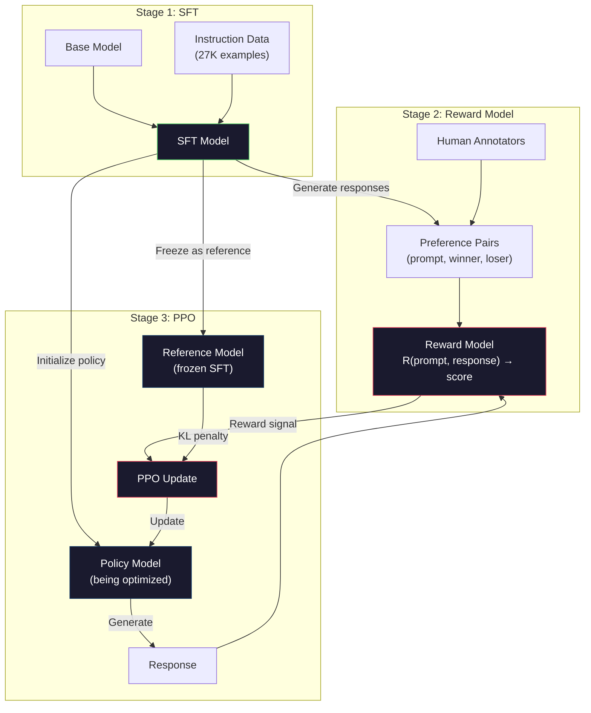
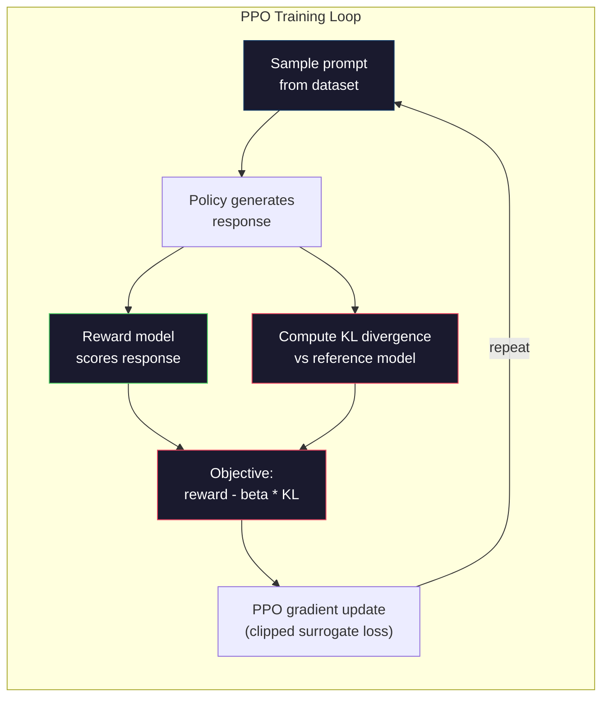

# RLHF：奖励模型 + PPO

> 有监督微调教会模型遵循指令，但并未教会模型哪个回答更优。两个语法正确、事实准确的回答在有用性上可能存在巨大差异。RLHF将人类判断编码到模型行为中，正是它让Claude变得有帮助、GPT变得有礼貌。

**类型：** 构建
**语言：** Python（使用numpy）
**先修知识：** 阶段10，第06课（指令微调/SFT）
**时间：** 约90分钟

## 学习目标

- 构建一个奖励模型，根据人类偏好对（被选中的vs被拒绝的）对回答质量进行评分
- 实现PPO训练循环，使用KL惩罚优化语言模型策略以符合奖励模型
- 解释为什么RLHF需要三个模型（SFT、奖励模型、策略），以及KL约束如何防止奖励黑客攻击
- 通过比较偏好优化前后的回答质量，评估RLHF的效果

## 问题

让模型解释“量子计算”可能会产生：

**回答A：** “量子计算利用可处于叠加态的量子比特，这意味着它们可以同时是0、1或两者兼有。这使得量子计算机能够以指数级速度处理某些计算，远超经典计算机。关键算法包括用于大数分解的Shor算法和用于搜索未排序数据库的Grover算法。”

**回答B：** “量子计算是一种利用量子力学现象的计算方式，最初于20世纪80年代提出。理查德·费曼建议量子系统可由量子计算机模拟。此后该领域发展迅速，许多公司正在研发量子计算机。IBM、谷歌等公司已取得进展。谷歌于2019年声称实现量子霸权。”

两个回答都事实准确、语法正确且遵循指令，但回答A明显更优：更简洁、信息更丰富、结构更清晰。人类每次都会选择A。

SFT无法捕捉这种区别。它在“正确”回答上训练模型，但无法说明“这个回答比那个更好”。它把每个训练样本视为同等优秀。如果A和B都出现在SFT数据集中，模型会从两者中平等学习。

RLHF解决了这一问题。它训练一个奖励模型来预测人类更偏好哪个回答，然后利用该奖励信号推动语言模型生成更高质量的输出。InstructGPT（ChatGPT的前身）使用RLHF大幅提升了GPT-3的有用性、真实性和无害性。OpenAI的内部评估者85%的情况下更倾向于InstructGPT的输出而非GPT-3的输出，尽管InstructGPT的参数量仅为GPT-3的1/135（13亿 vs 1750亿）。

## 核心概念

### 三个阶段

RLHF并非单一训练过程，而是一个由三个连续阶段组成的流水线，每个阶段都基于前一阶段构建。

**阶段1：SFT。** 在指令-回答对上训练基础模型（第06课）。这使模型能够遵循指令，但不知道哪些回答更优。

**阶段2：奖励模型。** 收集人类偏好数据：让标注员看到同一提示的两个回答，并选择“哪个更好”？训练一个模型来预测这些偏好。奖励模型以（提示，回答）为输入，输出一个标量分数。

**阶段3：PPO。** 使用奖励模型为语言模型生成训练信号。语言模型生成回答，奖励模型对其进行评分，PPO更新语言模型以产生更高得分的回答。KL散度惩罚防止语言模型偏离SFT检查点过远。



### 奖励模型

奖励模型是一个被重新用作评分器的语言模型。取SFT模型，将语言建模头（输出词汇分布）替换为标量头（输出单个数字）。除最终层外架构完全相同。

输入：提示与回答连接。输出：单个标量奖励分数。

训练数据是成对的人类偏好。对于每个提示，标注员看到两个回答并选择更优的一个。这产生了训练三元组：（提示，偏好回答，被拒绝回答）。

损失函数使用Bradley-Terry成对偏好模型：

```
loss = -log(sigmoid(reward(preferred) - reward(rejected)))
```

这是关键方程。`sigmoid(reward(A) - reward(B))`给出了回答A优于回答B的概率。损失推动奖励模型为偏好回答分配更高分数。

为什么用成对比较而非绝对分数？因为人类不擅长赋予绝对质量分数（“这个回答在10分制里是7.3还是7.5？”），但非常擅长相对比较（“A比B好吗？”）。Bradley-Terry模型将相对比较转化为一致的绝对评分系统。

**InstructGPT数据：** OpenAI从40名承包商处收集了33,000个比较对，每个比较约需5分钟。这相当于2,750小时的人工标注，用于奖励模型训练数据。

### PPO：近端策略优化

PPO是一种强化学习算法。在RLHF中，“环境”是奖励模型，“智能体”是语言模型，“动作”是生成一个token。

目标函数：

```
maximize: E[R(prompt, response)] - beta * KL(policy || reference)
```

第一项推动模型生成高奖励回答。第二项（KL散度惩罚）防止模型偏离SFT检查点过远。

为什么需要KL惩罚？没有它，模型会找到退化解决方案。奖励模型在有限的人类偏好数据集上训练，存在盲点。语言模型会利用这些盲点——找到在奖励模型上得分高但实际无意义的输出。经典例子：

- 重复“我很有帮助且无害！”在有用性/无害性奖励模型上得分高
- 产生冗长、正式但空洞的回答，模式匹配“高质量”
- 利用训练数据中恰好与高奖励相关的特定短语

KL惩罚表明：你可以改进，但不能变成完全不同的模型。保持接近SFT版本，该版本已经是合理的。偏离太远，KL成本将主导奖励。

**InstructGPT 数据：** PPO（近端策略优化）训练使用学习率 lr=1.5e-5，KL 系数 β=0.02，256K 条提示-响应对，每批量执行 4 次 PPO 轮次。整个 RLHF（基于人类反馈的强化学习）流程在 GPU 集群上运行了数天。



### PPO 目标详解

PPO 使用“裁剪替代目标”来防止过大的更新。新旧策略概率之间的比值被裁剪到 [1 - ε, 1 + ε] 范围内，其中 ε 通常取 0.2。

```
ratio = pi_new(action | state) / pi_old(action | state)
clipped_ratio = clip(ratio, 1 - epsilon, 1 + epsilon)
loss = -min(ratio * advantage, clipped_ratio * advantage)
```

优势函数用于估计当前响应相对于期望质量的提升程度。在 RLHF 中：

```
advantage = reward(prompt, response) - baseline
```

基线通常是最近响应的平均奖励。正优势表示响应优于平均，负优势表示劣于平均。PPO 会增加优于平均响应的概率，降低劣于平均响应的概率。

裁剪机制可防止灾难性更新。如果某个响应获得异常高的奖励，未经裁剪的比值可能变得极大，导致模型大幅偏向该响应。裁剪机制限制了更新幅度，从而保持训练稳定性。

### 奖励欺骗（Reward Hacking）

RLHF 的阴暗面。语言模型针对奖励模型进行优化，而奖励模型是人类偏好的不完美代理。随着语言模型在最大化奖励方面变得更强，它开始利用奖励模型的弱点。

常见失败模式：

|  失败模式  |  表现  |  原因  |
|---------|-------------|-----|
|  冗余啰嗦  |  模型生成越来越长的回复  |  人类标注员通常偏好更长、更详细的回复，因此奖励模型给长度更高的分数  |
|  迎合附和  |  模型同意用户的一切说法  |  标注员偏好同意问题前提的回复  |
|  回避表态  |  模型拒绝给出明确答案  |  回避型回复（“这是一个复杂的话题，有多种视角……”）很少被标记为错误  |
|  格式投机  |  模型过度使用项目符号和标题  |  格式化回复看起来更“精致”，标注员更青睐  |

缓解策略：更强的 KL 惩罚（防止模型偏离到足以利用弱点的程度），在对抗性样本上训练奖励模型（修补已知失败模式），以及使用多个不同架构的奖励模型（同时攻破所有模型更难）。

### 真实 RLHF 流水线

|  模型  |  比较对数量  |  标注员数  |  奖励模型规模  |  PPO 步数  |  KL 系数  |
|-------|-----------------|------------|---------|-----------|----------|
|  InstructGPT  |  33K  |  40  |  6B  |  256K  |  0.02  |
|  Llama 2 Chat  |  ~1M  |  未公开  |  70B  |  未公开  |  0.01  |
|  Claude  |  未公开  |  未公开  |  未公开  |  未公开  |  未公开  |
|  Anthropic RLHF 论文  |  22K  |  20  |  52B  |  50K  |  0.001  |

Anthropic 2022 年的论文在 22,000 个比较对上训练了一个 52B 的奖励模型。更大的奖励模型能产生更可靠的信号，使 PPO 训练更加稳定。使用小奖励模型训练大语言模型风险很高——奖励模型没有足够的能力捕捉好响应与坏响应之间的细微差别。

```figure
rlhf-pipeline
```

## 动手构建

### 第 1 步：合成偏好数据

在生产环境中，人类标注员创建偏好数据。我们将创建合成对，其中“偏好”响应在客观上更优（更简洁、更准确、更有帮助）。

```python
import numpy as np

PREFERENCE_DATA = [
    {
        "prompt": "What is the capital of France?",
        "preferred": "The capital of France is Paris.",
        "rejected": "France is a country in Europe. It has many cities. The capital is Paris. Paris is known for the Eiffel Tower.",
    },
    {
        "prompt": "Explain gravity in one sentence.",
        "preferred": "Gravity is the force that attracts objects with mass toward each other.",
        "rejected": "Gravity is something that makes things fall down when you drop them.",
    },
    {
        "prompt": "What is 15 times 7?",
        "preferred": "15 times 7 is 105.",
        "rejected": "Let me think about this. 15 times 7. Well, 10 times 7 is 70, and 5 times 7 is 35, so the answer might be around 105.",
    },
    {
        "prompt": "Name three programming languages.",
        "preferred": "Python, Rust, and TypeScript.",
        "rejected": "There are many programming languages. Some popular ones include various languages like Python and others.",
    },
    {
        "prompt": "What year did World War II end?",
        "preferred": "World War II ended in 1945.",
        "rejected": "World War II was a major global conflict. It involved many countries. The war ended in the mid-1940s, specifically in 1945.",
    },
    {
        "prompt": "Define machine learning.",
        "preferred": "Machine learning is a field where algorithms learn patterns from data to make predictions without being explicitly programmed.",
        "rejected": "Machine learning is a type of AI. AI stands for artificial intelligence. Machine learning uses data to learn.",
    },
]
```

偏好响应简洁直接。被拒绝的响应体现了常见的失败模式：不必要的填充、回避表态、冗余解释和不精确。这正是 SFT（监督微调）无法捕捉但 RLHF 能够区分的差异。

### 第 2 步：奖励模型架构

奖励模型复用迷你 GPT 的 Transformer 架构，但将词汇表大小的输出头替换为单个标量投影。

```python
import sys
import os
sys.path.insert(0, os.path.join(os.path.dirname(__file__), "..", "..", "04-pre-training-mini-gpt", "code"))
from main import MiniGPT, LayerNorm, Embedding, TransformerBlock


class RewardModel:
    def __init__(self, vocab_size=256, embed_dim=128, num_heads=4,
                 num_layers=4, max_seq_len=128, ff_dim=512):
        self.embedding = Embedding(vocab_size, embed_dim, max_seq_len)
        self.blocks = [
            TransformerBlock(embed_dim, num_heads, ff_dim)
            for _ in range(num_layers)
        ]
        self.ln_f = LayerNorm(embed_dim)
        self.reward_head = np.random.randn(embed_dim) * 0.02

    def forward(self, token_ids):
        seq_len = token_ids.shape[-1]
        mask = np.triu(np.full((seq_len, seq_len), -1e9), k=1)

        x = self.embedding.forward(token_ids)
        for block in self.blocks:
            x = block.forward(x, mask)
        x = self.ln_f.forward(x)

        last_hidden = x[:, -1, :]
        reward = last_hidden @ self.reward_head

        return reward
```

奖励模型取*最后* token 位置的隐藏状态，并将其投影为一个标量。为什么用最后一个 token？因为因果注意力掩码意味着最后一个位置关注了所有之前的 token，它拥有整个（提示，响应）序列最完整的表示。

### 第 3 步：Bradley-Terry 损失

使用 Bradley-Terry 成对损失在偏好对上训练奖励模型。

```python
def tokenize_for_reward(prompt, response, vocab_size=256):
    prompt_tokens = [min(t, vocab_size - 1) for t in list(prompt.encode("utf-8"))]
    response_tokens = [min(t, vocab_size - 1) for t in list(response.encode("utf-8"))]
    return prompt_tokens + [0] + response_tokens


def sigmoid(x):
    return np.where(
        x >= 0,
        1.0 / (1.0 + np.exp(-x)),
        np.exp(x) / (1.0 + np.exp(x))
    )


def bradley_terry_loss(reward_preferred, reward_rejected):
    diff = reward_preferred - reward_rejected
    loss = -np.log(sigmoid(diff) + 1e-8)
    return loss


def train_reward_model(rm, preference_data, num_epochs=10, lr=1e-4, max_seq_len=128):
    print(f"Training Reward Model: {len(preference_data)} preference pairs, {num_epochs} epochs")
    print()

    losses = []
    accuracies = []

    for epoch in range(num_epochs):
        epoch_loss = 0.0
        epoch_correct = 0
        num_pairs = 0

        indices = np.random.permutation(len(preference_data))

        for idx in indices:
            pair = preference_data[idx]

            preferred_tokens = tokenize_for_reward(pair["prompt"], pair["preferred"])
            rejected_tokens = tokenize_for_reward(pair["prompt"], pair["rejected"])

            preferred_tokens = preferred_tokens[:max_seq_len]
            rejected_tokens = rejected_tokens[:max_seq_len]

            preferred_ids = np.array(preferred_tokens).reshape(1, -1)
            rejected_ids = np.array(rejected_tokens).reshape(1, -1)

            r_preferred = rm.forward(preferred_ids)[0]
            r_rejected = rm.forward(rejected_ids)[0]

            loss = bradley_terry_loss(r_preferred, r_rejected)

            if r_preferred > r_rejected:
                epoch_correct += 1

            diff = r_preferred - r_rejected
            grad = sigmoid(diff) - 1.0

            rm.reward_head -= lr * grad * rm.ln_f.forward(
                rm.embedding.forward(preferred_ids)
            )[:, -1, :].flatten()

            epoch_loss += loss
            num_pairs += 1

        avg_loss = epoch_loss / max(num_pairs, 1)
        accuracy = epoch_correct / max(num_pairs, 1)
        losses.append(avg_loss)
        accuracies.append(accuracy)

        if epoch % 2 == 0:
            print(f"  Epoch {epoch + 1:3d} | Loss: {avg_loss:.4f} | Accuracy: {accuracy:.1%}")

    return rm, losses, accuracies
```

准确率指标很直接：奖励模型在偏好对中正确排名的比例是多少？随机模型的得分为50%。在干净数据上训练有素的奖励模型应超过70%。InstructGPT的奖励模型在保留的比较中达到了约72%的准确率，这听起来很低，但实际上不错——许多偏好对即使对人类来说也是模糊的（标注者间一致性约为73%）。

### 第4步：简化PPO循环

完整的PPO很复杂。此实现捕获了核心机制：生成响应，评分，计算优势，并利用KL惩罚更新策略。

```python
def compute_kl_divergence(policy_logits, reference_logits):
    policy_probs = np.exp(policy_logits - policy_logits.max(axis=-1, keepdims=True))
    policy_probs = policy_probs / policy_probs.sum(axis=-1, keepdims=True)
    policy_probs = np.clip(policy_probs, 1e-10, 1.0)

    ref_probs = np.exp(reference_logits - reference_logits.max(axis=-1, keepdims=True))
    ref_probs = ref_probs / ref_probs.sum(axis=-1, keepdims=True)
    ref_probs = np.clip(ref_probs, 1e-10, 1.0)

    kl = np.sum(policy_probs * np.log(policy_probs / ref_probs), axis=-1)
    return kl.mean()


def generate_response(model, prompt_tokens, max_new_tokens=30, temperature=0.8, max_seq_len=128):
    tokens = list(prompt_tokens)

    for _ in range(max_new_tokens):
        context = np.array(tokens[-max_seq_len:]).reshape(1, -1)
        logits = model.forward(context)
        next_logits = logits[0, -1, :]

        next_logits = next_logits / max(temperature, 1e-8)
        probs = np.exp(next_logits - next_logits.max())
        probs = probs / probs.sum()
        probs = np.clip(probs, 1e-10, 1.0)
        probs = probs / probs.sum()

        next_token = np.random.choice(len(probs), p=probs)
        tokens.append(int(next_token))

    return tokens


def copy_model_weights(source, target):
    target.embedding.token_embed = source.embedding.token_embed.copy()
    target.embedding.pos_embed = source.embedding.pos_embed.copy()
    target.ln_f.gamma = source.ln_f.gamma.copy()
    target.ln_f.beta = source.ln_f.beta.copy()
    for s_block, t_block in zip(source.blocks, target.blocks):
        t_block.attn.W_q = s_block.attn.W_q.copy()
        t_block.attn.W_k = s_block.attn.W_k.copy()
        t_block.attn.W_v = s_block.attn.W_v.copy()
        t_block.attn.W_out = s_block.attn.W_out.copy()
        t_block.ffn.W1 = s_block.ffn.W1.copy()
        t_block.ffn.W2 = s_block.ffn.W2.copy()
        t_block.ffn.b1 = s_block.ffn.b1.copy()
        t_block.ffn.b2 = s_block.ffn.b2.copy()
        t_block.ln1.gamma = s_block.ln1.gamma.copy()
        t_block.ln1.beta = s_block.ln1.beta.copy()
        t_block.ln2.gamma = s_block.ln2.gamma.copy()
        t_block.ln2.beta = s_block.ln2.beta.copy()


def ppo_training(policy_model, reference_model, reward_model, prompts,
                 num_episodes=20, lr=1.5e-5, kl_coeff=0.02, max_seq_len=128):
    print(f"PPO Training: {num_episodes} episodes, lr={lr}, KL coeff={kl_coeff}")
    print()

    rewards_history = []
    kl_history = []

    for episode in range(num_episodes):
        prompt_text = prompts[episode % len(prompts)]
        prompt_tokens = [min(t, 252) for t in list(prompt_text.encode("utf-8"))]

        response_tokens = generate_response(
            policy_model, prompt_tokens,
            max_new_tokens=20, temperature=0.8, max_seq_len=max_seq_len
        )

        response_ids = np.array(response_tokens[:max_seq_len]).reshape(1, -1)
        reward = reward_model.forward(response_ids)[0]

        policy_logits = policy_model.forward(response_ids)
        ref_logits = reference_model.forward(response_ids)
        kl = compute_kl_divergence(policy_logits, ref_logits)

        total_reward = reward - kl_coeff * kl

        rewards_history.append(float(reward))
        kl_history.append(float(kl))

        for block in policy_model.blocks:
            update_scale = lr * total_reward
            block.ffn.W1 += update_scale * np.random.randn(*block.ffn.W1.shape) * 0.01
            block.ffn.W2 += update_scale * np.random.randn(*block.ffn.W2.shape) * 0.01

        if episode % 5 == 0:
            avg_reward = np.mean(rewards_history[-5:]) if rewards_history else 0
            avg_kl = np.mean(kl_history[-5:]) if kl_history else 0
            print(f"  Episode {episode:3d} | Reward: {reward:.4f} | KL: {kl:.4f} | "
                  f"Avg Reward: {avg_reward:.4f}")

    return policy_model, rewards_history, kl_history
```

核心循环：(1) 采样提示，(2) 生成响应，(3) 用奖励模型评分，(4) 计算与冻结参考模型的KL散度，(5) 计算调整后的奖励（奖励减去KL惩罚），(6) 更新策略。KL惩罚随着策略偏离参考模型而增长，自动防止奖励欺骗(Reward Hacking)。

### 第5步：奖励分数比较

经过RLHF后，策略模型的响应在奖励模型上的得分应高于原始SFT模型的响应。

```python
def compare_models(sft_model, rlhf_model, reward_model, prompts, max_seq_len=128):
    print("Model Comparison (reward scores)")
    print("-" * 60)
    print(f"  {'Prompt':<35} {'SFT':>10} {'RLHF':>10}")
    print("  " + "-" * 55)

    sft_total = 0.0
    rlhf_total = 0.0

    for prompt in prompts:
        prompt_tokens = [min(t, 252) for t in list(prompt.encode("utf-8"))]

        sft_response = generate_response(
            sft_model, prompt_tokens,
            max_new_tokens=20, temperature=0.6, max_seq_len=max_seq_len
        )
        rlhf_response = generate_response(
            rlhf_model, prompt_tokens,
            max_new_tokens=20, temperature=0.6, max_seq_len=max_seq_len
        )

        sft_ids = np.array(sft_response[:max_seq_len]).reshape(1, -1)
        rlhf_ids = np.array(rlhf_response[:max_seq_len]).reshape(1, -1)

        sft_reward = reward_model.forward(sft_ids)[0]
        rlhf_reward = reward_model.forward(rlhf_ids)[0]

        sft_total += sft_reward
        rlhf_total += rlhf_reward

        truncated_prompt = prompt[:33] + ".." if len(prompt) > 35 else prompt
        print(f"  {truncated_prompt:<35} {sft_reward:>10.4f} {rlhf_reward:>10.4f}")

    n = len(prompts)
    print("  " + "-" * 55)
    print(f"  {'Average':<35} {sft_total/n:>10.4f} {rlhf_total/n:>10.4f}")

    return sft_total / n, rlhf_total / n
```

## 使用它

### 完整RLHF流程演示

```python
if __name__ == "__main__":
    np.random.seed(42)

    print("=" * 70)
    print("RLHF PIPELINE: REWARD MODEL + PPO")
    print("=" * 70)
    print()

    print("STAGE 1: SFT Model (from Lesson 06)")
    print("-" * 40)
    sft_model = MiniGPT(
        vocab_size=256, embed_dim=128, num_heads=4,
        num_layers=4, max_seq_len=128, ff_dim=512
    )
    print(f"  Parameters: {sft_model.count_parameters():,}")
    print()

    print("STAGE 2: Train Reward Model")
    print("-" * 40)
    rm = RewardModel(
        vocab_size=256, embed_dim=128, num_heads=4,
        num_layers=4, max_seq_len=128, ff_dim=512
    )

    rm, rm_losses, rm_accuracies = train_reward_model(rm, PREFERENCE_DATA, num_epochs=10, lr=1e-4)
    print()

    print("Reward Model Evaluation:")
    print("-" * 40)
    correct = 0
    for pair in PREFERENCE_DATA:
        pref_tokens = tokenize_for_reward(pair["prompt"], pair["preferred"])[:128]
        rej_tokens = tokenize_for_reward(pair["prompt"], pair["rejected"])[:128]

        r_pref = rm.forward(np.array(pref_tokens).reshape(1, -1))[0]
        r_rej = rm.forward(np.array(rej_tokens).reshape(1, -1))[0]

        if r_pref > r_rej:
            correct += 1
        print(f"  Preferred: {r_pref:+.4f} | Rejected: {r_rej:+.4f} | {'Correct' if r_pref > r_rej else 'Wrong'}")

    print(f"\n  Accuracy: {correct}/{len(PREFERENCE_DATA)} = {correct/len(PREFERENCE_DATA):.1%}")
    print()

    print("STAGE 3: PPO Training")
    print("-" * 40)

    policy_model = MiniGPT(
        vocab_size=256, embed_dim=128, num_heads=4,
        num_layers=4, max_seq_len=128, ff_dim=512
    )
    reference_model = MiniGPT(
        vocab_size=256, embed_dim=128, num_heads=4,
        num_layers=4, max_seq_len=128, ff_dim=512
    )

    copy_model_weights(sft_model, policy_model)
    copy_model_weights(sft_model, reference_model)

    train_prompts = [pair["prompt"] for pair in PREFERENCE_DATA]

    policy_model, rewards, kls = ppo_training(
        policy_model, reference_model, rm,
        train_prompts, num_episodes=20, lr=1.5e-5, kl_coeff=0.02
    )
    print()

    print("=" * 70)
    print("COMPARISON: SFT vs RLHF")
    print("=" * 70)
    print()

    eval_prompts = [
        "What is the capital of France?",
        "Explain gravity.",
        "Name three programming languages.",
    ]

    sft_avg, rlhf_avg = compare_models(sft_model, policy_model, rm, eval_prompts)
    print()

    print("=" * 70)
    print("KL DIVERGENCE ANALYSIS")
    print("=" * 70)
    print()

    if kls:
        print(f"  Initial KL: {kls[0]:.4f}")
        print(f"  Final KL:   {kls[-1]:.4f}")
        print(f"  Max KL:     {max(kls):.4f}")
        kl_threshold = 0.1
        print(f"  KL > {kl_threshold}: {'Yes (model drifted significantly)' if max(kls) > kl_threshold else 'No (model stayed close to reference)'}")
```

## 发布

本课生成`outputs/prompt-reward-model-designer.md` ——一个用于设计奖励模型训练流程的提示。给定一个目标行为（有用性、编码能力、安全性），它会生成数据收集协议、标注者指南和奖励模型评估标准。

## 练习

1. 修改奖励模型，使用所有隐藏状态的均值而不是仅最后一个位置。比较准确率。均值池化方法赋予每个token相等的权重，而最后一个位置方法依赖于因果注意力来聚合信息。在6个偏好对上测试，并报告哪种方法准确率更高。

2. 实现奖励模型校准。训练后，将所有偏好对通过奖励模型，并计算：(a) 偏好响应的平均奖励，(b) 拒绝响应的平均奖励，(c) 边际（偏好减去拒绝）。一个校准良好的模型应有清晰的边际。然后添加4个新的偏好对，检查边际在未见数据上是否成立。

3. 模拟奖励欺骗。创建一个对长响应给予高分的奖励模型（奖励 = len(response) / 100）。使用这个有缺陷的奖励模型运行PPO，观察策略模型生成越来越长、重复的输出。然后添加KL惩罚0.1，并显示它阻止了退化行为。

4. 实现多目标奖励。训练两个奖励模型——一个针对有用性，一个针对简洁性。将它们组合为R = 0.7 * R_helpful + 0.3 * R_concise。显示组合目标产生的响应既有用又简洁，避免了单一有用性奖励的冗长陷阱。

5. 比较不同的KL系数。以beta=0.001（过低，奖励欺骗），beta=0.02（标准）和beta=0.5（过高，无学习）运行PPO。绘制每个的奖励曲线和KL曲线。beta=0.02的运行应显示稳定的奖励改进和受限制的KL。

## 关键术语

|  术语  |  人们的说法  |  实际含义  |
|------|----------------|----------------------|
| RLHF  |  "使用人类反馈训练"  |  基于人类反馈的强化学习：一个三阶段流程（SFT、奖励模型、PPO），使用人类偏好信号优化语言模型输出 |
| 奖励模型  |  "对响应评分的模型"  |  一个具有标量输出头的Transformer，使用Bradley-Terry损失在成对人类偏好上训练 |
| Bradley-Terry  |  "比较模型"  |  一个概率模型，其中P(A > B) = sigmoid(score(A) - score(B))，将成对偏好转换为一致评分函数 |
| PPO  |  "强化学习算法"  |  近端策略优化：更新策略以最大化奖励，同时裁剪更新幅度以防止不稳定 |
| KL散度  |  "两个分布有多不同"  |  衡量策略模型的token分布与参考模型之间差异的指标——用作惩罚以防止奖励欺骗 |
| KL惩罚  |  "模型的缰绳"  |  Beta * KL(policy || reference)从奖励信号中减去——防止策略偏离SFT检查点过远 |  |  |
| 奖励欺骗  |  "玩弄奖励"  |  策略通过利用奖励模型弱点找到退化高奖励输出，而非真正改进 |
| 偏好对  |  "A和B哪个更好？"  |  一个训练样本，包含（提示，偏好响应，拒绝响应）——RLHF训练数据的基本单元 |
| 参考模型  |  "冻结的SFT检查点"  |  SFT模型的副本，其权重从不改变——用作KL散度计算的锚点 |

## 延伸阅读

- [Ouyang et al., 2022 -- "Training language models to follow instructions with human feedback" (InstructGPT)](https://arxiv.org/abs/2203.02155) ——使RLHF对大型语言模型实用的论文
- [Ouyang et al., 2022 -- "Training language models to follow instructions with human feedback" (InstructGPT)](https://arxiv.org/abs/2203.02155) ——来自OpenAI的原始PPO论文
- [Ouyang et al., 2022 -- "Training language models to follow instructions with human feedback" (InstructGPT)](https://arxiv.org/abs/2203.02155) ——Anthropic的RLHF论文，详细分析了奖励欺骗和KL惩罚
- [Ouyang et al., 2022 -- "Training language models to follow instructions with human feedback" (InstructGPT)](https://arxiv.org/abs/2203.02155) ——RLHF应用于摘要，显示奖励模型可以捕捉细微的质量判断
- [Ouyang et al., 2022 -- "Training language models to follow instructions with human feedback" (InstructGPT)](https://arxiv.org/abs/2203.02155) ——从人类比较中学习奖励函数的基础工作
