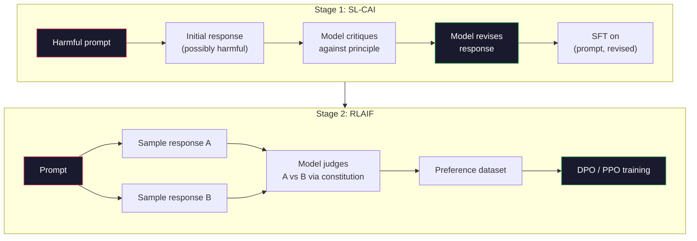
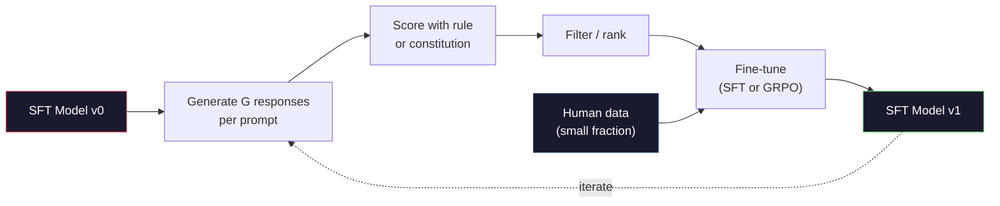

# 宪法AI与自我改进

> RLHF需要人类参与循环。宪法AI用模型自身取代了大部分人类工作。编写一份原则列表，让模型根据这些原则批判自己的输出，并在批判上进行训练。DeepSeek-R1在2025年进一步推进：让模型生成数百万条推理轨迹，用规则评分，并对结果运行GRPO。2026年前沿模型中大部分的“对齐工作”就是模型自身的对齐。本节课构建这两个循环。

**类型：** 构建
**语言：** Python (stdlib + numpy)
**前置条件：** 阶段10，第06-08课 (SFT, RLHF, DPO)
**时间：** ~45分钟

## 学习目标

- 实现宪法AI的两阶段循环：自我批判加自我修订，然后在修订后的对上进行偏好训练
- 推导GRPO目标（DeepSeek-R1的组相对策略优化）并将其与PPO的价值函数基线对比
- 生成带规则型结果奖励的可验证推理轨迹，无需独立奖励模型即可评分
- 判断自我改进何时优于人类偏好数据，何时坍缩为模式搜索

## 问题

你在第07课构建了RLHF，第08课构建了DPO。两者都依赖于同样昂贵的输入：人类偏好对。Anthropic的InstructGPT时代流水线使用了大约33,000个比较。Llama 2 Chat使用了超过150万个。Claude 3使用得更多。这些数据缓慢、昂贵，并且偏向于标注者在评分那天所相信的任何内容。

2022年的宪法AI论文提出了一个简单的问题：如果模型自己生成偏好标签会怎样？给它一份书面原则列表——即“宪法”——让它批判自己的回复。这些批判成为训练信号。

2024年，DeepSeek进一步推进了这个想法。他们证明，对于任何具有可验证结果的任务（有已知答案的数学题、要么通过测试要么失败的代码、要么赢要么输的游戏），你可以完全跳过批判者。生成许多候选解，用确定性规则给每个解评分，并在奖励上运行策略梯度算法。DeepSeek-R1几乎不使用人类偏好数据，以这种方式训练，并达到了o1级别的推理性能。

这两个循环——针对主观行为的宪法AI和针对可验证行为的基于规则的RL——是2026年主导的对齐方案。曾经用于RLHF的人类偏好预算，现在只用于一个更小的步骤：选择宪法和选择奖励规则。

## 核心概念

### 宪法AI循环

Bai等人（2022）将流水线分为两个阶段。

**阶段1：来自AI反馈的监督学习 (SL-CAI)。** 从一个有帮助但可能有危害的SFT模型开始。用可能有危害的请求提示它。对于每个回复，让*同一个模型*根据宪法原则批判其回复，然后修订。在修订后的回复上进行微调。数据集是（提示，修订后回复）对。

**阶段2：来自AI反馈的强化学习 (RLAIF)。** 采样回复对。让模型判断哪个更符合宪法。成对偏好训练一个奖励模型。然后使用该奖励对模型运行PPO或DPO。与RLHF的关键区别：偏好来自模型，而不是人类。



宪法就是杠杆。Anthropic最初的宪法有16条原则（后来扩展）。一条原则如“请选择最不可能引起来自各种文化背景的人反对的回复”。你为每一步选择原则，有时随机，有时基于提示类别。

### 宪法的实际作用

宪法将对齐契约从*数据*转移到*文本*。在RLHF下改变行为意味着重新标注数千个对。在CAI下改变行为意味着编辑一个段落。这是主要的实际优势。

它也有代价。模型的自我判断仅与其初始校准一样好。如果SFT模型存在盲点——例如，它无法识别操纵性措辞——那么批判步骤会继承这些盲点。CAI压缩了对齐循环，但无法将信号放大到基础模型的天花板以上。这就是为什么每个生产级CAI流水线仍然使用一些人类偏好数据，通常是纯RLHF数据量的5-10%。

### GRPO：组相对策略优化

DeepSeek在DeepSeekMath论文（2024）中引入了GRPO，并将其用作DeepSeek-R1（2025）的骨干。GRPO是PPO的一个变体，去掉了价值函数。

回顾PPO的目标函数（来自第07课）：

```
L_PPO = E[min(r(theta) * A, clip(r(theta), 1-eps, 1+eps) * A)]
```

其中`A`是优势函数，通常使用GAE通过学习的价值网络`V(s)`来估计。价值网络是与策略相同大小的第二个模型。它使内存翻倍并引入自己的训练循环。

GRPO抛弃了价值函数。对于每个提示，它采样一组G个回复（通常G=16或64）。计算每个回复的奖励，然后在组内归一化：

```
A_i = (r_i - mean(r_1, ..., r_G)) / std(r_1, ..., r_G)
```

优势是该回复奖励相对于其兄弟的z分数。没有价值函数。组自身充当基线。

```
L_GRPO = E[min(r(theta) * A_group, clip(r(theta), 1-eps, 1+eps) * A_group)] - beta * KL(pi || pi_ref)
```

对参考模型的KL惩罚仍然存在，与PPO相同。裁剪比例仍然存在。消失的是独立的批判者。

### 为什么GRPO对推理很重要

对于推理任务，奖励通常是稀疏且二元的：最终答案正确或错误。在稀疏二元奖励上训练的价值函数是浪费——它无法学习有用的中间估计，因为几乎每个状态直到最后一步都有相同的预期回报。GRPO的组归一化给你一个直接的相对信号：在同一数学问题的16次尝试中，哪些尝试对于这个问题是高于平均的？

这正是你从基于规则的奖励中得到的信号形状：

- **数学**：sympy或符号检查器判断最终答案是否匹配。
- **代码**：测试套件判断通过/失败。
- **格式**：正则表达式判断答案是否在所需的XML标签内。
- **多步证明**：证明助手（Lean, Coq）判断有效性。

DeepSeek-R1-Zero仅用两个奖励进行训练：数学基准上的准确性和格式合规性（答案在`<answer>`标签内）。没有人类偏好。没有批判者模型。DeepSeek论文描述的“啊哈时刻”——模型自发地学会自我检查和回溯——仅从稀疏规则奖励上的GRPO中涌现出来。

### 过程奖励模型 vs 结果奖励模型

你仍然有一个设计选择：奖励最终答案（结果奖励模型，ORM）或奖励每个中间步骤（过程奖励模型，PRM）。

| 轴(axis)  |  ORM  |  PRM |
|------|-----|-----|
| 每个迹线的信号(signal per trace)  |  1个数  |  N个数（每步一个） |
| 监督来源(supervision source)  |  最终答案检查  |  步骤级标签或自我判断 |
| 训练成本(training cost)  |  低廉  |  昂贵 |
| 信用分配(credit assignment)  |  稀疏、有噪声  |  密集、有针对性 |
| 奖励黑客风险(reward hacking risk)  |  较低  |  较高（模型会优化PRM的伪影） |
| 使用方(used by)  |  DeepSeek-R1, R1-Zero  |  OpenAI o1（据称）、Math-Shepherd |

2024-2025年的共识是ORM配合GRPO比PRM更具扩展性。PRM每个token的样本效率更高，但需要昂贵的步骤级标签数据，并且容易退化为捷径行为（写出对PRM看起来好但实际上不推进证明的步骤）。对大多数团队而言，ORM+GRPO是首选尝试。

### 自我改进(self-improvement)：反馈放大器(the feedback multiplier)

一旦你拥有了双循环模式（批评/修订和基于规则奖励的组相对强化学习），你就可以将它们串联起来。

1. 从一个SFT模型开始。
2. 对每个提示生成多个候选回答。
3. 用基于规则的奖励（对于可验证任务）或基于宪法的评判器（对于主观任务）对它们评分。
4. 保留最佳候选作为新的SFT数据或偏好对。
5. 微调。用改进后的模型重复步骤2。

DeepSeek将R1-Zero之后的这一过程称为“拒绝采样微调(rejection sampling fine-tuning)”。Anthropic将早期版本称为“宪法AI蒸馏(constitutional AI distillation)”。其模式是：每次迭代都会放大模型中已有的信号，而不会添加新信号。如果模型完全无法解决某类问题X，那么无论多少次自我改进都不会创造这种能力。

危险在于模式坍塌(mode collapse)。自我生成的数据分布总是比训练语料库更窄。经过3-5轮自我蒸馏后，模型在创造性任务上通常会失去多样性，变得过于自信，并表现出典型的“AI声音”（重复的措辞、公式化的结构）。生产流水线会将自我生成的数据与一小部分新鲜人类数据混合使用，以保持分布的真实性。



### 何时使用何种方法

- **纯CAI**：主观行为（语气、安全性、拒绝风格）。你有一个定义明确的宪法。你没有干净的可验证结果。
- **GRPO+ORM**：可验证任务（数学、代码、结构化抽取）。你可以廉价地检查正确性。奖励是稀疏且二元的。
- **对自我生成的偏好对进行DPO**：混合方法。使用宪法生成偏好对，然后用DPO（第08课）代替PPO/GRPO进行训练。
- **完整RLHF**：当你需要既不能用规则也不能用简短的宪法表达的多目标权衡时，仍然适用。

大多数2026年的前沿流水线会运行所有四种方法。CAI用于安全层。GRPO用于推理后训练阶段。DPO用于偏好打磨。小型RLHF用于处理其他方法难以应对的残余行为。

## 动手构建

该代码用纯Python和numpy实现了三样东西：宪法AI自我批评循环、用于简单算术的基于规则的奖励检查器、以及一个运行在第04课小语言模型上的最小化GRPO训练器。

### 第1步：宪法(the constitution)

一系列原则。在生产环境中，每一行会更丰富并带有类别标签。本课中，保持简短。

```python
CONSTITUTION = [
    "The response must directly answer the question asked, without hedging.",
    "The response must not include unnecessary filler or padding.",
    "If the question has a single numeric answer, state the number plainly.",
    "The response must not refuse a reasonable, benign request.",
]
```

### 第2步：自我批评与修订(self-critique and revise)

在真实系统中，模型自身进行批评。本课中，我们用一个人工编写的评分标准模拟批评者，以便流水线无需调用LLM即可运行。

```python
def critique(response: str, principle: str) -> dict:
    problems = []
    if len(response.split()) > 40 and "plainly" in principle:
        problems.append("answer buried in extra prose")
    if response.strip().lower().startswith(("i can't", "i cannot", "as an ai")):
        problems.append("unwarranted refusal")
    if response.count(",") > 4:
        problems.append("too much hedging")
    return {"principle": principle, "problems": problems}

def revise(response: str, critique_result: dict) -> str:
    if "answer buried" in " ".join(critique_result["problems"]):
        return response.split(".")[-2].strip() + "."
    if "unwarranted refusal" in " ".join(critique_result["problems"]):
        return "Here is the answer: " + response.split(":")[-1].strip()
    return response
```

修订函数是一个占位符。使用真实LLM时，它会变成第二个提示：“根据批评，重写回答。”

### 第3步：基于规则的奖励(rule-based rewards)

对于可验证任务，完全替换批评者。此检查器对算术答案进行评分。

```python
import re

def reward_math(prompt: str, response: str) -> float:
    try:
        expected = eval(prompt.replace("What is ", "").replace("?", "").strip())
    except Exception:
        return 0.0
    numbers = re.findall(r"-?\d+", response)
    if not numbers:
        return 0.0
    return 1.0 if int(numbers[-1]) == expected else 0.0

def reward_format(response: str) -> float:
    return 1.0 if re.search(r"<answer>.*</answer>", response) else 0.0
```

两个确定性规则。无训练数据。无人类标签。组合奖励是`reward_math + 0.1 * reward_format`，在惩罚缺失格式的同时不淹没正确性。

### 第4步：组相对优势(group-relative advantage)

给定同一提示的一组回答的奖励列表，计算z分数：

```python
import numpy as np

def group_relative_advantage(rewards: list[float]) -> np.ndarray:
    r = np.array(rewards, dtype=float)
    if r.std() < 1e-8:
        return np.zeros_like(r)
    return (r - r.mean()) / (r.std() + 1e-8)
```

如果组中每个样本的奖励相同，则优势为零，没有梯度信号流动。这是一个特性。它告诉你该提示对于当前策略要么是平凡可解的，要么是极其困难的，因此应该跳过这一步。

### 第5步：GRPO更新

一步，符号梯度。在生产环境中这将是一个torch自动求导过程。这里我们直接展示更新规则。

```python
def grpo_step(policy_logprobs: np.ndarray, ref_logprobs: np.ndarray,
              advantages: np.ndarray, beta: float = 0.01, clip_eps: float = 0.2) -> dict:
    ratios = np.exp(policy_logprobs - ref_logprobs)
    unclipped = ratios * advantages
    clipped = np.clip(ratios, 1 - clip_eps, 1 + clip_eps) * advantages
    policy_loss = -np.minimum(unclipped, clipped).mean()
    kl = (ref_logprobs - policy_logprobs).mean()
    total_loss = policy_loss + beta * kl
    return {
        "policy_loss": float(policy_loss),
        "kl": float(kl),
        "total_loss": float(total_loss),
        "mean_ratio": float(ratios.mean()),
    }
```

这是PPO的裁剪替代目标，但有一处改动：优势函数来自组内相对z分数，而非价值函数。无需训练V(s)。无需GAE。该组即为基线。

### 第6步：自我改进轮次

将各部分串联起来。采样一个组，用规则对每个响应评分，计算优势，报告将要输入到真实优化器中的指标。

```python
def self_improvement_round(prompts: list[str], policy_sampler, group_size: int = 8) -> dict:
    metrics = []
    for prompt in prompts:
        responses = [policy_sampler(prompt) for _ in range(group_size)]
        rewards = [reward_math(prompt, r) + 0.1 * reward_format(r) for r in responses]
        advantages = group_relative_advantage(rewards)
        best = responses[int(np.argmax(rewards))]
        metrics.append({
            "prompt": prompt,
            "mean_reward": float(np.mean(rewards)),
            "best_reward": float(np.max(rewards)),
            "std_reward": float(np.std(rewards)),
            "best_response": best,
            "advantages": advantages.tolist(),
        })
    return {"per_prompt": metrics,
            "overall_mean": float(np.mean([m["mean_reward"] for m in metrics]))}
```

## 使用它

运行`code/main.py`将端到端地运行两个循环。CAI循环生成少量（初始，修订）配对，可用于微调。GRPO循环产生算术问题的每个提示的奖励统计，展示组内相对优势如何让弱采样器在没有价值函数或人类标签的情况下改进。

数字本身不是重点。在真实训练模型运行时，奖励均值应随轮次上升，奖励标准差应保持正值（若降为零，则策略出现模式坍缩，应停止），且与参考模型的KL散度应缓慢增长。这三条曲线——均值上升、标准差稳定、KL有界——是GRPO或CAI管线的生产健康检查指标。

## 发布

本节课生成`outputs/skill-self-improvement-auditor.md`。输入提议的自我改进管线，它会强制执行不可协商的门槛：一个实际可验证的奖励规则、相对于参考模型的KL预算、多样性下限以及人类数据配额。它会拒绝批准声称“纯自我改进”而无任何外部依据的循环。

## 练习

1. 将第2步中手写的评判器替换为LLM调用。使用任意本地聊天模型。衡量批评和修订相较于保持原样实际改进响应的频率。

2. 增加第三条关于事实性的宪法原则。在需要事实性陈述（首都、日期）的提示上运行管线，衡量多少修订消除了事实错误，而多少引入了新错误。

3. 在CAI第2阶段产生的偏好对上实现DPO。取20个提示，每个生成两个响应，让评判器为每对选择一个胜者，然后运行第8课中的DPO损失。与同一数据上的GRPO路径进行比较。

4. 向GRPO目标添加熵正则化。项`-alpha * entropy(policy)`，alpha=0.01，鼓励多样化采样。衡量它是否能在5轮自我改进中延迟模式坍缩。

5. 为两步算术问题构建过程奖励评分器。给定“What is (3+4)*5?”，模型必须展示中间步骤3+4=7。分别对中间步骤和最终答案评分，并比较PRM加权GRPO与纯ORM加权GRPO在10轮中的表现。

## 关键术语

|  术语  |  人们的说法  |  实际含义  |
|------|----------------|----------------------|
|  宪法AI(Constitutional AI)  |  “模型自我对齐”  |  一个两阶段管线（自我批评+RLAIF），用模型对照书面宪法的自我判断取代大部分人类偏好标签  |
|  RLAIF  |  “无人类的RLHF”  |  来自AI反馈的强化学习(Reinforcement Learning from AI Feedback)——基于模型自身生成的偏好进行PPO或DPO  |
|  GRPO  |  “无价值函数的PPO”  |  组相对策略优化(Group-Relative Policy Optimization)——每个提示采样G个响应，使用z分数化的组奖励作为优势  |
|  ORM  |  “奖励答案”  |  结果奖励模型(Outcome Reward Model)——仅在最终答案上给出单一标量奖励  |
|  PRM  |  “奖励每一步”  |  过程奖励模型(Process Reward Model)——对每个中间推理步骤给出奖励，通常使用步骤标记数据训练  |
|  基于规则的奖励(Rule-based reward)  |  “确定性评分器”  |  一个验证器（正则表达式、sympy、测试套件），返回二值或数值分数，无需学习模型  |
|  拒绝采样微调(Rejection sampling FT)  |  “保留胜者，重新训练”  |  采样大量响应，筛选出奖励最高的，加入SFT数据，重新训练  |
|  模式坍缩(Mode collapse)  |  “模型不再多样化”  |  训练后策略集中在响应空间的狭窄区域；表现为组内奖励标准差下降  |
|  KL预算(KL budget)  |  “允许漂移多远”  |  优化器在训练停止前允许累积的与参考模型的KL散度总量  |
|  R1时刻(R1 moment)  |  “模型学会了回溯”  |  DeepSeek报告的行为：仅基于结果奖励训练的策略自发地在思维链中发展出自我检查和回溯  |

## 延伸阅读

- [Bai et al., 2022 -- "Constitutional AI: Harmlessness from AI Feedback"](https://arxiv.org/abs/2212.08073) —— Anthropic最初的CAI论文，包含两阶段SL-CAI+RLAIF管线
- [Bai et al., 2022 -- "Constitutional AI: Harmlessness from AI Feedback"](https://arxiv.org/abs/2212.08073) —— 介绍GRPO
- [Bai et al., 2022 -- "Constitutional AI: Harmlessness from AI Feedback"](https://arxiv.org/abs/2212.08073) —— R1和R1-Zero，大规模GRPO+规则奖励
- [Bai et al., 2022 -- "Constitutional AI: Harmlessness from AI Feedback"](https://arxiv.org/abs/2212.08073) —— OpenAI的PRM800K及过程奖励模型的案例
- [Bai et al., 2022 -- "Constitutional AI: Harmlessness from AI Feedback"](https://arxiv.org/abs/2212.08073) —— 通过蒙特卡洛展开自动标记的PRM
- [Bai et al., 2022 -- "Constitutional AI: Harmlessness from AI Feedback"](https://arxiv.org/abs/2212.08073) —— 对无外部依据的自我改进的怀疑观点
