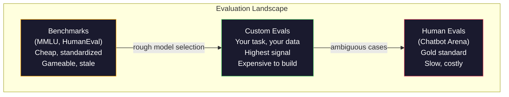
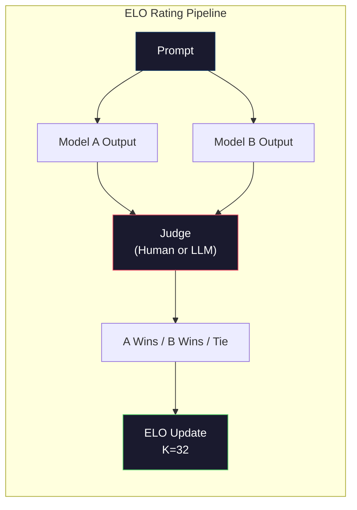

# 评估：基准测试、评估、LM Harness

> 古德哈特定律（Goodhart's Law）：当一项指标成为目标时，它就不再是一项好的指标。每个前沿实验室都在博弈基准测试。MMLU分数上升，但模型仍然无法可靠地数出“strawberry”中R的数量。唯一重要的评估是你的评估——针对你的任务，使用你的数据。

**类型：** 构建
**语言：** Python
**先修条件：** 阶段10，课程01-05（LLMs from Scratch）
**时间：** 约90分钟

## 学习目标

- 构建一个自定义评估任务框架，针对语言模型运行多项选择和开放式基准测试
- 解释为什么标准基准测试（MMLU、HumanEval）饱和而无法区分前沿模型
- 使用适当的指标实现特定任务的评估：精确匹配、F1、BLEU以及LLM作为评判者（LLM-as-judge）评分
- 设计一个针对你的特定用例的自定义评估套件，而不是仅仅依赖于公共排行榜

## 问题

MMLU于2020年发布，包含57个学科的15,908个问题。三年内，前沿模型使其饱和。GPT-4得分为86.4%。Claude 3 Opus得分为86.8%。Llama 3 405B得分为88.6%。排行榜被压缩到3个百分点的范围内，差异只是统计噪声，而非真正的能力差距。

与此同时，同样的模型在10岁孩子都能不假思索完成的任务上失败。Claude 3.5 Sonnet，在MMLU上得分88.7%，最初无法数出“strawberry”中的字母——这是一个不需要任何世界知识和推理、只需逐字符迭代的任务。HumanEval用164个问题测试代码生成。模型得分超过90%，同时生成的代码仍然在连初级开发者都能发现的边缘情况下崩溃。

基准测试性能与现实世界可靠性之间的差距是LLM评估的核心问题。基准测试告诉你模型在基准测试上的表现。它们几乎无法告诉你该模型在你的特定任务、使用你的特定数据、面对你的特定失败模式时的表现。如果你在构建一个客户支持机器人，MMLU无关紧要。如果你在构建一个代码助手，HumanEval只涵盖函数级生成——它没有涉及调试、重构或跨文件解释代码。

你需要自定义评估。不是因为基准测试没用——它们对于粗略的模型选择是有用的——而是因为最终评估必须与你的部署条件完全匹配。

## 核心概念

### 评估领域

评估分为三类，每类具有不同的成本和信号质量。

**基准测试**是标准化的测试套件。MMLU、HumanEval、SWE-bench、MATH、ARC、HellaSwag。你将模型在基准测试上运行并获得一个分数。优点：每个人都使用相同的测试，因此可以比较模型。缺点：模型和训练数据日益污染这些基准测试。实验室在包含基准测试问题的数据上进行训练。分数上升，但能力可能没有。

**自定义评估**是你为特定用例构建的测试套件。你定义输入、期望输出和评分函数。法律文档摘要器在法律文档上进行评估。SQL生成器在你的数据库模式上进行评估。这些评估创建成本高，但它们是唯一能预测生产性能的评估。

**人工评估**使用付费标注员根据有用性、正确性、流畅性和安全性等标准判断模型输出。这是自动评分失败时开放式任务的黄金标准。Chatbot Arena已收集了超过200万个涉及100多个模型的人类偏好投票。缺点：成本（$0.10-$每次判断2.00美元）和速度（数小时到数天）。



### 基准测试为何失效

三种机制导致基准测试分数不再反映真实能力。

**数据污染。** 训练语料库从互联网抓取。基准测试问题存在于互联网上。模型在训练过程中看到答案。这不是传统意义上的作弊——实验室不会故意包含基准测试数据。但网络规模的抓取使其几乎不可能排除。

**为考试而教。** 实验室优化训练混合以提升基准测试性能。如果训练混合中有5%是MMLU风格的多项选择，模型会学到格式和答案分布。MMLU是四选一多项选择。模型学会答案分布在A/B/C/D上大致均匀，即使模型不知道答案，这也有帮助。

**饱和。** 当每个前沿模型在基准测试上得分85-90%时，基准测试停止区分。剩下的10-15%的问题可能模棱两可、标注错误或需要晦涩的领域知识。在MMLU上从87%提高到89%可能意味着模型多记住了两个晦涩的问题，而不是变得更聪明。

### 困惑度：快速健康检查

困惑度衡量模型对一个token序列的惊讶程度。形式上，它是平均负对数似然的指数化：

```
PPL = exp(-1/N * sum(log P(token_i | context)))
```

困惑度为10意味着模型在每个token位置上平均像从10个选项中均匀选择一样不确定。越低越好。GPT-2在WikiText-103上获得约30的困惑度。GPT-3约为20。Llama 3 8B约为7。

困惑度对于在同一测试集上比较模型很有用，但它有盲点。一个模型可能因为善于预测常见模式而具有低困惑度，但在罕见但重要的模式上表现糟糕。它也不涉及指令遵循、推理或事实准确性。将其用作健康检查，而非最终结论。

### LLM作为评判者（LLM-as-Judge）

使用一个强模型来评估较弱模型的输出。想法很简单：让GPT-4o或Claude Sonnet按1-5分对响应的正确性、有用性和安全性进行评分。使用GPT-4o-mini每次判断成本约0.01美元，并且与人类判断的相关性出奇地高——在大多数任务上约80%的一致性。

评分提示比模型本身更重要。模糊的提示（“Rate this response”）会产生噪声分数。带有评量标准的结构化提示（“如果答案事实正确并引用来源，得5分；正确但未引用来源，得4分；部分正确，得3分...”）会产生一致且可复现的分数。

失败模式：评判模型表现出位置偏差（在成对比较中偏好第一个回答）、冗长偏差（偏好更长的回答）和自我偏好（GPT-4对GPT-4输出的评分高于等效的Claude输出）。缓解措施：随机化顺序、按长度归一化、使用与被评估模型不同的评判模型。

### 来自成对比较的ELO评级

Chatbot Arena的方法。展示来自不同模型的同一提示的两个回答。人类（或LLM评判者）选择更好的一个。从数千次这样的比较中，计算每个模型的ELO评级——与棋类比赛使用的系统相同。

ELO的优势：相对排名比绝对评分更可靠，能优雅处理平局，并且比独立评分每个输出需要更少的比较就能收敛。截至2026年初，Chatbot Arena排名显示GPT-4o、Claude 3.5 Sonnet和Gemini 1.5 Pro在顶部彼此相差20个ELO分以内。



### 评估框架

**lm-evaluation-harness**（EleutherAI）：标准的开源评估框架。支持200多个基准。一条命令即可针对MMLU、HellaSwag、ARC等基准运行任何Hugging Face模型。由Open LLM排行榜使用。

**RAGAS**：专为RAG流程设计的评估框架。衡量忠实度（答案是否与检索到的上下文匹配？）、相关性（检索到的上下文是否与问题相关？）以及答案的正确性。

**promptfoo**：基于配置的提示工程评估。在YAML中定义测试用例，针对多个模型运行，获得通过/失败报告。用于回归测试提示——确保提示更改不会破坏现有的测试用例。

### 构建自定义评估

对生产环境唯一重要的评估。过程如下：

1. **定义任务。** 模型具体应该做什么？必须精确。“回答问题”太过模糊。“给定一封客户投诉邮件，提取产品名称、问题类别和情感倾向”才是一个可评估的任务。

2. **创建测试用例。** 至少50个用于原型评估，200个以上用于生产。每个测试用例是一个（输入，预期输出）对。包括边缘情况：空输入、对抗性输入、模糊输入、其他语言的输入。

3. **定义评分。** 结构化输出用精确匹配。文本相似度用BLEU/ROUGE。开放式质量用LLM作为评审器。提取任务用F1。结合多个指标并分配权重。

4. **自动化。** 每条评估用一条命令运行。不要手动步骤。以支持随时间比较的格式存储结果。

5. **随时间跟踪。** 孤立的评估分数没有意义。你需要趋势线。上次提示更改后分数是否提高了？切换模型后是否下降了？将评估与提示一起进行版本控制。

|  评估类型  |  每次判断成本  |  与人类一致性  |  最适合  |
|-----------|------------------|----------------------|----------|
|  精确匹配  |  ~$0  |  100%（适用时）  |  结构化输出、分类  |
|  BLEU/ROUGE  |  ~$0  |  ~60%  |  翻译、摘要  |
|  LLM作为评审器  |  ~$0.01  |  ~80%  |  开放式生成  |
|  人工评估  |  $0.10-$2.00  |  不适用（是真实标准）  |  模糊、高风险任务  |

```figure
perplexity-loss
```

## 动手构建

### 第1步：最小评估框架

定义核心抽象。评估案例包含一个输入、一个预期输出和一个可选的元数据字典。评分器接受预测和参考，返回0到1之间的分数。

```python
import json
from collections import Counter

class EvalCase:
    def __init__(self, input_text, expected, metadata=None):
        self.input_text = input_text
        self.expected = expected
        self.metadata = metadata or {}

class EvalSuite:
    def __init__(self, name, cases, scorers):
        self.name = name
        self.cases = cases
        self.scorers = scorers

    def run(self, model_fn):
        results = []
        for case in self.cases:
            prediction = model_fn(case.input_text)
            scores = {}
            for scorer_name, scorer_fn in self.scorers.items():
                scores[scorer_name] = scorer_fn(prediction, case.expected)
            results.append({
                "input": case.input_text,
                "expected": case.expected,
                "prediction": prediction,
                "scores": scores,
            })
        return results
```

### 第2步：评分函数

构建精确匹配、token F1以及模拟的LLM作为评审器的评分器。

```python
def exact_match(prediction, expected):
    return 1.0 if prediction.strip().lower() == expected.strip().lower() else 0.0

def token_f1(prediction, expected):
    pred_tokens = set(prediction.lower().split())
    exp_tokens = set(expected.lower().split())
    if not pred_tokens or not exp_tokens:
        return 0.0
    common = pred_tokens & exp_tokens
    precision = len(common) / len(pred_tokens)
    recall = len(common) / len(exp_tokens)
    if precision + recall == 0:
        return 0.0
    return 2 * (precision * recall) / (precision + recall)

def llm_judge_simulated(prediction, expected):
    pred_words = set(prediction.lower().split())
    exp_words = set(expected.lower().split())
    if not exp_words:
        return 0.0
    overlap = len(pred_words & exp_words) / len(exp_words)
    length_penalty = min(1.0, len(prediction) / max(len(expected), 1))
    return round(overlap * 0.7 + length_penalty * 0.3, 3)
```

### 第3步：ELO评分系统

使用ELO更新实现两两比较。这正是Chatbot Arena用于对模型排序的系统。

```python
class ELOTracker:
    def __init__(self, k=32, initial_rating=1500):
        self.ratings = {}
        self.k = k
        self.initial_rating = initial_rating
        self.history = []

    def _ensure_player(self, name):
        if name not in self.ratings:
            self.ratings[name] = self.initial_rating

    def expected_score(self, rating_a, rating_b):
        return 1 / (1 + 10 ** ((rating_b - rating_a) / 400))

    def record_match(self, player_a, player_b, outcome):
        self._ensure_player(player_a)
        self._ensure_player(player_b)

        ea = self.expected_score(self.ratings[player_a], self.ratings[player_b])
        eb = 1 - ea

        if outcome == "a":
            sa, sb = 1.0, 0.0
        elif outcome == "b":
            sa, sb = 0.0, 1.0
        else:
            sa, sb = 0.5, 0.5

        self.ratings[player_a] += self.k * (sa - ea)
        self.ratings[player_b] += self.k * (sb - eb)

        self.history.append({
            "a": player_a, "b": player_b,
            "outcome": outcome,
            "rating_a": round(self.ratings[player_a], 1),
            "rating_b": round(self.ratings[player_b], 1),
        })

    def leaderboard(self):
        return sorted(self.ratings.items(), key=lambda x: -x[1])
```

### 第4步：困惑度计算

使用token概率计算困惑度。在实际中你会从模型的logits中获得这些概率。这里我们用概率分布模拟。

```python
import numpy as np

def perplexity(log_probs):
    if not log_probs:
        return float("inf")
    avg_neg_log_prob = -np.mean(log_probs)
    return float(np.exp(avg_neg_log_prob))

def token_log_probs_simulated(text, model_quality=0.8):
    np.random.seed(hash(text) % 2**31)
    tokens = text.split()
    log_probs = []
    for i, token in enumerate(tokens):
        base_prob = model_quality
        if len(token) > 8:
            base_prob *= 0.6
        if i == 0:
            base_prob *= 0.7
        prob = np.clip(base_prob + np.random.normal(0, 0.1), 0.01, 0.99)
        log_probs.append(float(np.log(prob)))
    return log_probs
```

### 第5步：汇总结果

计算一次评估运行中的汇总统计量：均值、中位数、阈值通过率以及每个指标的细分。

```python
def summarize_results(results, threshold=0.8):
    all_scores = {}
    for r in results:
        for metric, score in r["scores"].items():
            all_scores.setdefault(metric, []).append(score)

    summary = {}
    for metric, scores in all_scores.items():
        arr = np.array(scores)
        summary[metric] = {
            "mean": round(float(np.mean(arr)), 3),
            "median": round(float(np.median(arr)), 3),
            "std": round(float(np.std(arr)), 3),
            "min": round(float(np.min(arr)), 3),
            "max": round(float(np.max(arr)), 3),
            "pass_rate": round(float(np.mean(arr >= threshold)), 3),
            "n": len(scores),
        }
    return summary

def print_summary(summary, suite_name="Eval"):
    print(f"\n{'=' * 60}")
    print(f"  {suite_name} Summary")
    print(f"{'=' * 60}")
    for metric, stats in summary.items():
        print(f"\n  {metric}:")
        print(f"    Mean:      {stats['mean']:.3f}")
        print(f"    Median:    {stats['median']:.3f}")
        print(f"    Std:       {stats['std']:.3f}")
        print(f"    Range:     [{stats['min']:.3f}, {stats['max']:.3f}]")
        print(f"    Pass rate: {stats['pass_rate']:.1%} (threshold >= 0.8)")
        print(f"    N:         {stats['n']}")
```

### 第6步：运行完整流程

将所有部分连接起来。定义一个任务，创建测试用例，模拟两个模型，运行评估，从两两比较中计算ELO，并打印排行榜。

```python
def demo_model_good(prompt):
    responses = {
        "What is the capital of France?": "Paris",
        "What is 2 + 2?": "4",
        "Who wrote Hamlet?": "William Shakespeare",
        "What language is PyTorch written in?": "Python and C++",
        "What is the boiling point of water?": "100 degrees Celsius",
    }
    return responses.get(prompt, "I don't know")

def demo_model_bad(prompt):
    responses = {
        "What is the capital of France?": "Paris is the capital city of France",
        "What is 2 + 2?": "The answer is four",
        "Who wrote Hamlet?": "Shakespeare",
        "What language is PyTorch written in?": "Python",
        "What is the boiling point of water?": "212 Fahrenheit",
    }
    return responses.get(prompt, "Unknown")

cases = [
    EvalCase("What is the capital of France?", "Paris"),
    EvalCase("What is 2 + 2?", "4"),
    EvalCase("Who wrote Hamlet?", "William Shakespeare"),
    EvalCase("What language is PyTorch written in?", "Python and C++"),
    EvalCase("What is the boiling point of water?", "100 degrees Celsius"),
]

suite = EvalSuite(
    name="General Knowledge",
    cases=cases,
    scorers={
        "exact_match": exact_match,
        "token_f1": token_f1,
        "llm_judge": llm_judge_simulated,
    },
)

results_good = suite.run(demo_model_good)
results_bad = suite.run(demo_model_bad)

print_summary(summarize_results(results_good), "Model A (concise)")
print_summary(summarize_results(results_bad), "Model B (verbose)")
```

“好”模型给出精确答案。“差”模型给出冗长的解释。精确匹配严重惩罚了冗长模型。token F1和LLM作为评审器更宽容。这说明了为什么指标选择很重要：同一个模型的好坏取决于你如何评分。

### 第7步：ELO锦标赛

在多个轮次中运行模型之间的两两比较。

```python
elo = ELOTracker(k=32)

for case in cases:
    pred_a = demo_model_good(case.input_text)
    pred_b = demo_model_bad(case.input_text)

    score_a = token_f1(pred_a, case.expected)
    score_b = token_f1(pred_b, case.expected)

    if score_a > score_b:
        outcome = "a"
    elif score_b > score_a:
        outcome = "b"
    else:
        outcome = "tie"

    elo.record_match("model_a_concise", "model_b_verbose", outcome)

print("\nELO Leaderboard:")
for name, rating in elo.leaderboard():
    print(f"  {name}: {rating:.0f}")
```

### 第8步：困惑度比较

比较不同质量水平的“模型”之间的困惑度。

```python
test_text = "The quick brown fox jumps over the lazy dog in the garden"

for quality, label in [(0.9, "Strong model"), (0.7, "Medium model"), (0.4, "Weak model")]:
    log_probs = token_log_probs_simulated(test_text, model_quality=quality)
    ppl = perplexity(log_probs)
    print(f"  {label} (quality={quality}): perplexity = {ppl:.2f}")
```

## 使用它

### lm-evaluation-harness (EleutherAI)

用于在任何模型上运行基准测试的标准工具。

```python
# pip install lm-eval
# Command line:
# lm_eval --model hf --model_args pretrained=meta-llama/Llama-3.1-8B --tasks mmlu --batch_size 8

# Python API:
# import lm_eval
# results = lm_eval.simple_evaluate(
#     model="hf",
#     model_args="pretrained=meta-llama/Llama-3.1-8B",
#     tasks=["mmlu", "hellaswag", "arc_easy"],
#     batch_size=8,
# )
# print(results["results"])
```

### promptfoo

用于提示工程的配置驱动评估。在YAML中定义测试，并针对多个提供者运行。

```yaml
# promptfoo.yaml
providers:
  - openai:gpt-4o-mini
  - anthropic:claude-3-haiku

prompts:
  - "Answer in one word: {{question}}"

tests:
  - vars:
      question: "What is the capital of France?"
    assert:
      - type: contains
        value: "Paris"
  - vars:
      question: "What is 2 + 2?"
    assert:
      - type: equals
        value: "4"
```

### RAGAS用于RAG评估

```python
# pip install ragas
# from ragas import evaluate
# from ragas.metrics import faithfulness, answer_relevancy, context_precision
#
# result = evaluate(
#     dataset,
#     metrics=[faithfulness, answer_relevancy, context_precision],
# )
# print(result)
```

RAGAS测量通用评估遗漏的内容：模型的答案是否基于检索到的上下文，而不仅仅是答案在抽象上是否“正确”。

## 发布

本课程产生`outputs/prompt-eval-designer.md`——一个可复用的提示，为任何任务设计自定义评估套件。给它一个任务描述，它会生成测试用例、评分函数和通过/失败阈值建议。

它还产生`outputs/skill-llm-evaluation.md`——一个决策框架，根据任务类型、预算和延迟要求选择合适的评估策略。

## 练习

1. 添加一个“一致性”评分器，将相同输入通过模型运行5次，并测量输出匹配的频率。在确定性输入上的不一致回答揭示了脆弱的提示或高温度设置。

2. 扩展ELO跟踪器以支持多个评判函数（精确匹配、F1、LLM-as-judge）并加权。比较当您重视精确匹配与重视F1时，排行榜的变化。

3. 为特定任务构建评估套件：将电子邮件分为5个类别。创建100个包含多样化示例的测试用例，包括边缘情况（可能属于多个类别的电子邮件、空电子邮件、其他语言的电子邮件）。测量不同“模型”（基于规则的、关键词匹配的、模拟LLM）的表现。

4. 实现污染检测：给定一组评估问题和训练语料库，检查百分之多少的评估问题（或近义改写）出现在训练数据中。这就是研究人员审计基准有效性的方法。

5. 构建一个“模型差异”工具。给定两个模型版本的评估结果，突出显示哪些特定测试用例改进了、哪些退步了、哪些保持不变。这是评估领域的代码差异——对于理解更改是帮助还是损害至关重要。

## 关键术语

|  术语  |  人们的说法  |  实际含义  |
|------|----------------|----------------------|
|  MMLU  |  “基准测试”  |  大规模多任务语言理解（Massive Multitask Language Understanding）——涵盖57个学科的15,908道选择题，到2025年饱和率超过88%  |
|  HumanEval  |  “代码评估”  |  OpenAI提供的164个Python函数补全问题，仅测试独立的函数生成  |
|  SWE-bench  |  “真实编码评估”  |  来自12个Python仓库的2,294个GitHub问题，评估端到端bug修复，包括测试生成  |
|  困惑度  |  “模型有多困惑”  |  exp(-平均 log P(token_i | 上下文))——越低表示模型分配给实际词元的概率越高  |
|  ELO评分  |  “模型的国际象棋排名”  |  根据成对胜负记录计算的相对技能评分，Chatbot Arena用于对100多个模型进行排名  |
|  LLM-as-judge  |  “用AI给AI打分”  |  一个强模型根据评分标准对弱模型的输出进行评分，与人类评判者的一致性约80%，每次评判成本约$0.01  |
|  数据污染  |  “模型看过测试题”  |  训练数据包含基准测试问题，虚增分数而不提升实际能力  |
|  评估套件  |  “一组测试”  |  一个版本化的(输入，期望输出，评分器)三元组集合，用于衡量特定能力  |
|  通过率  |  “正确百分比”  |  评分超过阈值的评估案例比例——比平均分更具可操作性，因为它衡量可靠性  |
|  Chatbot Arena  |  “模型排名网站”  |  LMSYS平台，拥有200万+人类偏好投票，通过ELO评分生成最受信任的大模型排行榜  |

## 延伸阅读

- [Hendrycks et al., 2021 -- "Measuring Massive Multitask Language Understanding"](https://arxiv.org/abs/2009.03300)——MMLU论文，尽管已饱和，仍是引用最多的大模型基准
- [Hendrycks et al., 2021 -- "Measuring Massive Multitask Language Understanding"](https://arxiv.org/abs/2009.03300)——OpenAI的HumanEval论文，确立了代码生成评估方法论
- [Hendrycks et al., 2021 -- "Measuring Massive Multitask Language Understanding"](https://arxiv.org/abs/2009.03300)——使用大模型评估大模型的系统分析，包括位置偏差和冗长偏差发现
- [Hendrycks et al., 2021 -- "Measuring Massive Multitask Language Understanding"](https://arxiv.org/abs/2009.03300)——众包模型比较平台，拥有200万+投票，最受信任的真实世界大模型排名
