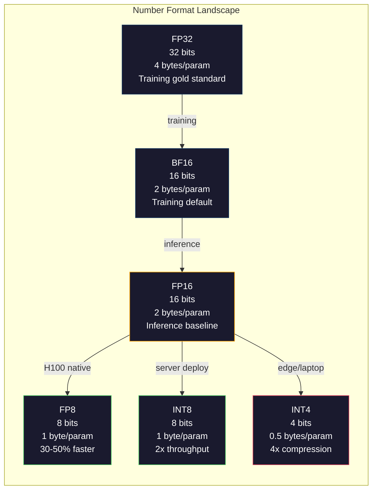
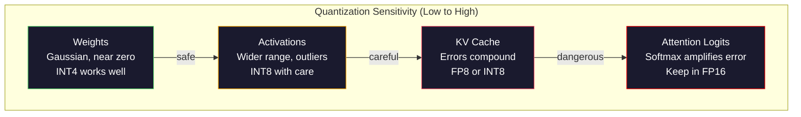
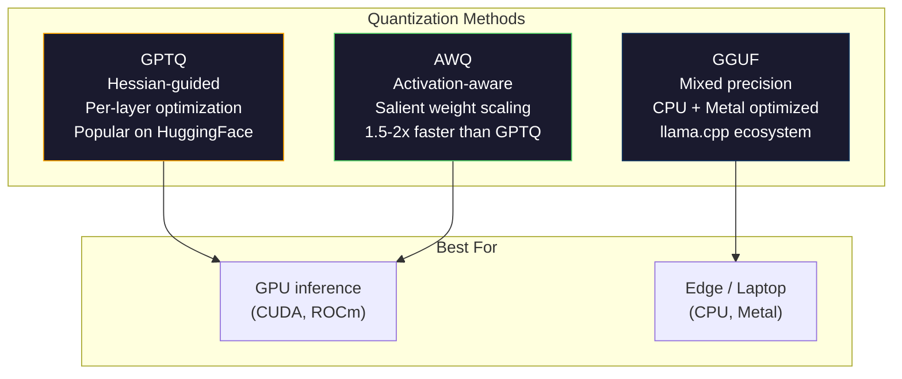

# 量化：让模型适应硬件

> 一个70B的FP16模型需要140GB显存。仅权重就需要两块A100。量化为FP8：一块80GB GPU即可。INT4：一台MacBook就够了。

**类型：** 构建
**语言：** Python (使用numpy)
**前置知识：** 阶段10，课程01-10 (从零构建LLM)
**时间：** 约120分钟

## 学习目标

- 实现从FP16到INT8和INT4的对称与非对称量化，包括逐张量和逐通道缩放
- 计算量化带来的内存节省，并确定哪种精度适合给定GPU的显存
- 解释训练后量化(PTQ)与量化感知训练(QAT)的区别
- 应用GPTQ或AWQ量化一个真实模型，并在基准测试中衡量精度-内存权衡

## 问题

Llama 3 70B有700亿个参数。每个参数是一个16位浮点数。这就是1400亿字节，即140GB。一块A100只有80GB显存。你甚至无法加载权重，更不用说在单块GPU上运行推理了。你需要两块A100（每块每小时2美元）才能服务一个模型。

但每个参数16位是浪费的。神经网络中的大多数权重都集中在零附近。FP16的完整动态范围（从0.000000059到65504）几乎完全没有用到。如果你测量Llama 3 70B中权重的实际分布，95%的权重落在-0.1到+0.1之间。你用16位来表示本可以用4位表示的值。

量化用低精度数替换高精度数。FP16到FP8将内存减半。FP16到INT4将内存减至四分之一。那个140GB的模型变成35GB，可以放在一块消费级GPU上。推到2位量化（激进、有损，但对某些任务可用），同一个模型可以在16GB的笔记本电脑上运行。

代价是精度。每移除一位就会破坏信息。问题在于丢失多少精度以及在哪里丢失。一个精心量化的INT4模型在大多数基准测试中保留了原始模型95-99%的质量。而朴素地量化为INT4可能会完全破坏模型。区别在于技术。

社区使用GPTQ将Llama 3量化为INT4后，在WikiText上大约损失了1-2个困惑度(Perplexity)点。Mistral发布了Mixtral 8x22B的FP8检查点，在MMLU上测得的质量损失为零。GGUF格式驱动llama.cpp，可以在搭载M系列芯片的MacBook上运行70B模型。量化不是黑客手段，而是所有大于7B的模型的标准部署路径。

## 核心概念

### 数值格式：每一位的作用

每个浮点数包含三部分：符号位、指数和尾数（也称为有效数字）。符号位占1位。指数决定范围（数字可以多大或多少）。尾数决定精度（有多少位十进制数字）。

```
FP32:  [1 sign] [8 exponent] [23 mantissa]  = 32 bits
FP16:  [1 sign] [5 exponent] [10 mantissa]  = 16 bits
BF16:  [1 sign] [8 exponent] [7  mantissa]  = 16 bits
FP8:   [1 sign] [4 exponent] [3  mantissa]  = 8  bits (E4M3)
FP8:   [1 sign] [5 exponent] [2  mantissa]  = 8  bits (E5M2)
INT8:  [1 sign] [7 value]                   = 8  bits (uniform steps)
INT4:  [1 sign] [3 value]                   = 4  bits (16 levels total)
```

**FP32**是完整精度。23位尾数提供约7位十进制数字的精度。范围：大约1.2 × 10^-38 到 3.4 × 10^38。训练曾经完全在FP32中进行。现在累积（矩阵乘法中的累加和）仍然使用FP32。

**FP16**将位数减半。10位尾数提供约3.3位十进制精度。指数缩小到5位，范围急剧减小（最大值约65504）。这对权重（集中在零附近）没问题，但对训练中可能激增的激活值和梯度来说很危险。FP16训练需要损失缩放(Loss Scaling)来防止下溢。

**BF16**（Brain Float 16）保留了FP32的8位指数，但将尾数缩减到7位。与FP32范围相同，精度低于FP16。Google专门为深度学习设计了它。直觉：对于神经网络，范围比精度更重要。一个在FP16中下溢为零的梯度10^-20在BF16中存活。一个权重0.07342在BF16中四舍五入到0.0734已经足够接近。每个现代训练回合都使用BF16或BF16/FP32混合。

**FP8**有两种变体。E4M3（4位指数，3位尾数）用于推理时的权重和激活值。E5M2（5位指数，2位尾数）用于训练时更注重范围的梯度。在H100 GPU上进行FP8推理相比FP16可实现30-50%的加速，且质量损失可忽略不计。

**INT8**是一种整数格式。没有指数，没有尾数。只有256个均匀间隔的值，范围从-128到127。你需要一个缩放因子(Scale Factor)将浮点权重映射到这个范围。优势：整数算术比浮点算术更快、更节能。A100上的INT8矩阵乘法运行速度为624 TOPS，而FP16为312 TFLOPS。

**INT4**更进一步。只有16个可能的值。缩放因子承担重任。质量完全取决于你如何选择缩放因子以及量化哪些权重。最先进的INT4方法（GPTQ、AWQ）保留了95%以上的原始模型质量。



### 量化的工作原理

核心操作很简单。取一个浮点值张量，找到缩放因子，相乘，四舍五入为最接近的整数，然后存储整数加上缩放因子。

**量化：**
```
scale = max(abs(tensor)) / max_int_value
quantized = round(tensor / scale)
```

**反量化：**
```
reconstructed = quantized * scale
```

对于对称范围(-127到127)的INT8：
```
scale = max(abs(tensor)) / 127
quantized = clamp(round(tensor / scale), -128, 127)
```

误差就是四舍五入误差。每个值最多偏差 `scale / 2`。整个层的总误差取决于你有多少权重以及模型对这些权重的扰动有多敏感。

**逐张量量化与逐通道量化。** 逐张量量化对整个权重矩阵使用一个缩放因子。简单但有损：如果一列具有大值而另一列具有小值，小值会失去大部分精度。逐通道量化对每个输出通道（权重矩阵的每行或每列）使用一个缩放因子。开销更大（需要存储N个缩放因子而不是1个），但质量显著提高。每个生产量化方法都使用逐通道或更细粒度的量化。

**非对称量化**添加了零点偏移：`quantized = round(tensor / scale) + zero_point`。这处理不以零为中心的分布。例如，ReLU激活函数总是非负的。对称量化将一半的整数范围浪费在从不出现的负值上。非对称量化将实际范围[min, max]映射到整个整数范围。

### 敏感性层级

模型中并非所有部分都能同样容忍量化。存在一个明确的层级。

**权重（最鲁棒）。** 模型权重在训练过程中变化缓慢，并且遵循以零为中心的大致高斯分布。它们量化效果很好。具有逐通道缩放因子的INT8权重产生几乎无损的结果。INT4需要更复杂的方法，但可行。

**激活值（中等敏感）。** 激活值是推理过程中流经网络的中间值。它们比权重具有更宽的动态范围，并且包含异常值(Outliers)。单个注意力头可能产生比均值大100倍的激活值。这些异常值对模型质量至关重要。朴素地量化它们会破坏信息。解决方案：将异常值通道保持在更高精度（LLM.int8()），使用逐词元或逐通道激活缩放因子。

**KV缓存（高度敏感）。** 键值缓存存储所有之前词元的注意力状态。在长上下文长度下，KV缓存占主导地位。对于70B模型在32K上下文下，仅KV缓存就需要40GB（FP16）。将KV缓存量化为FP8或INT8可节省大量内存，但任何误差都会在所有未来的注意力计算中累积。质量影响随序列长度增加而增加。

**注意力对数（最敏感）。**注意力中的softmax对其输入的微小变化高度敏感。预softmax对数中0.01的量化误差就能显著改变注意力分布。大多数量化方案即使在其他部分都被量化时，也保留注意力计算的高精度（FP16或BF16）。



### PTQ 与 QAT

**训练后量化(Post-Training Quantization, PTQ)** 将已训练的模型进行量化，无需重新训练。你取出FP16权重，计算缩放因子，四舍五入，然后部署。快速（几分钟到几小时）且廉价。在INT8和FP8上效果好。对于INT4，朴素PTQ通常失败严重，因为舍入误差累积。高级PTQ方法（GPTQ、AWQ）使用校准数据来最小化量化误差。

**量化感知训练(Quantization-Aware Training, QAT)** 在训练的前向传播中插入假量化操作。模型学会将权重放置在舍入误差较小的位置。梯度通过直通估计器(straight-through estimator, STE)流过假量化：假设舍入操作的梯度为1。QAT产生的INT4和INT2模型优于PTQ，但需要完整的训练过程。Google在Gemini的高效服务中使用了QAT。Meta在某些Llama部署目标中使用了QAT。

|  方面  |  PTQ  |  QAT  |
|--------|-----|-----|
|  成本  |  几分钟到几小时  |  完整的训练过程  |
|  INT8质量  |  优秀（损失<0.1%）  |  优秀  |
|  INT4质量  |  使用GPTQ/AWQ良好（损失1-3%）  |  更好（损失<1%）  |
|  INT2质量  |  差  |  对某些任务可用  |
|  校准数据  |  128-1024个样本  |  完整训练数据集  |
|  使用时机  |  部署、迭代  |  低比特宽下的最高质量  |

### GPTQ, AWQ, GGUF

**GPTQ(GPT Quantization, GPTQ)** 是一种一次性PTQ方法。它逐层量化权重，使用小的校准数据集（典型为128个样本）来测量海森矩阵(Hessian)（关于输出对每个权重的敏感度的二阶信息）。海森矩阵认为重要的权重会被更仔细地量化。GPTQ是首个使INT4量化对LLM实用的方法。Hugging Face上的TheBloke通过发布数百个模型的量化版本推广了GPTQ。

**AWQ(Activation-Aware Weight Quantization, AWQ)** 观察到一小部分权重（约1%）因其与大的激活值相乘而变得异常重要。AWQ使用校准数据识别这些显著权重，在量化前将其放大（然后相应缩小对应激活值）。这使得重要权重保持在INT4量化精确的范围内。AWQ的质量通常与GPTQ相当或略优，而应用速度快1.5-2倍。

**GGUF(GPT-Generated Unified Format, GGUF)** 是llama.cpp及其生态系统使用的文件格式。它支持混合量化：不同层使用不同比特宽度。第一层和最后一层（嵌入层和输出头）通常保持较高精度。中间层使用INT4或INT3。GGUF文件自包含：权重、分词器、元数据均在一个文件中。该格式专为CPU推理和Apple Silicon设计，将整个模型加载到内存中并在CPU或Metal GPU上运行矩阵乘法是标准路径。Q4_K_M是最流行的GGUF量化变体，平衡了质量和大小。



### 质量衡量

如何判断量化后的模型仍然良好？

**困惑度(Perplexity)。**最常用的指标。越低越好。在保留数据集（WikiText-2是标准）上计算原始模型和量化模型的困惑度。差值告诉你量化破坏了多少信息。经验法则：差值<0.5为优秀，0.5-1.0为良好，1.0-2.0对大多数任务可接受，>2.0意味着出了问题。

**特定任务基准。**在MMLU、HumanEval、GSM8K或你的自定义评测套件上运行量化模型。与原始模型比较。量化对不同能力的影响不均。数学和代码任务对精度损失比通用知识更敏感。

**输出对比。**在相同提示词下生成两个模型的响应并比较。LLM作为裁判(LLM-as-judge, 第10课)在此效果很好。计算胜率：量化模型匹配或超过原始模型提示词的占比。

**延迟和吞吐量。**量化的目的是使模型更快更便宜。测量每秒token数、首token时间以及内存使用。一个比原始模型更慢的量化模型甚至不如不用。

|  模型  |  格式  |  大小  |  困惑度(WikiText-2)  |  MMLU  |  tokens/秒 (A100)  |
|-------|--------|------|------------------------|------|-------------------|
|  Llama 3 70B  |  FP16  |  140GB  |  3.12  |  79.5%  |  38  |
|  Llama 3 70B  |  FP8  |  70GB  |  3.14  |  79.3%  |  55  |
|  Llama 3 70B  |  GPTQ INT4  |  35GB  |  4.32  |  77.8%  |  72  |
|  Llama 3 70B  |  AWQ INT4  |  35GB  |  4.18  |  78.1%  |  75  |
|  Llama 3 70B  |  GGUF Q4_K_M  |  40GB  |  4.25  |  77.9%  |  28 (CPU)  |

模式：FP8几乎免费。INT4损失1-2个MMLU点，但吞吐量翻倍，内存减少四分之三。这种权衡对几乎每次部署都是值得的。

### 实际数据

H100上从FP16到FP8：推理加速30-50%，质量损失<0.1%。这是无需思考的量化。每个H100部署都应使用。

FP16到INT8 (LLM.int8())：内存减少2倍，质量损失<0.5%。混合精度方法将异常特征保留在FP16，同时将其他所有内容量化为INT8。

FP16 到 INT4（GPTQ/AWQ）：内存减少 4 倍，质量损失取决于模型和方法，约为 1-3%。可在单个 48GB GPU 上运行 70B 模型。

FP16 到 INT4（GGUF Q4_K_M）：内存减少 3.5 倍，质量损失 1-2%。针对 CPU 推理优化。Q4_K_M 下的 70B 模型大约为 40GB，在配备 64GB 内存的 M3 Max 上以 10-15 个令牌/秒的速度运行。

FP16 到 INT2：内存减少 8 倍，质量损失 5-15%。仅适用于可以容忍质量下降的特定狭窄任务。属于研究前沿，尚未准备好用于通用生产。

```figure
quantization
```

## 动手构建

### 步骤 1：数字格式表示

构建每种格式的位级表示，以确切了解符号位、指数和尾数的作用。

```python
import numpy as np


def float_to_fp32_bits(value):
    bits = np.float32(value).view(np.uint32)
    sign = (bits >> 31) & 1
    exponent = (bits >> 23) & 0xFF
    mantissa = bits & 0x7FFFFF
    return {"sign": int(sign), "exponent": int(exponent), "mantissa": int(mantissa),
            "exponent_bits": format(int(exponent), '08b'),
            "mantissa_bits": format(int(mantissa), '023b'),
            "value": float(value),
            "actual_exponent": int(exponent) - 127}


def float_to_fp16_bits(value):
    fp16 = np.float16(value)
    bits = fp16.view(np.uint16)
    sign = (bits >> 15) & 1
    exponent = (bits >> 10) & 0x1F
    mantissa = bits & 0x3FF
    return {"sign": int(sign), "exponent": int(exponent), "mantissa": int(mantissa),
            "exponent_bits": format(int(exponent), '05b'),
            "mantissa_bits": format(int(mantissa), '010b'),
            "value": float(fp16),
            "actual_exponent": int(exponent) - 15}


def float_to_bf16_bits(value):
    fp32_bits = np.float32(value).view(np.uint32)
    bf16_bits = (fp32_bits >> 16).astype(np.uint16)
    sign = (bf16_bits >> 15) & 1
    exponent = (bf16_bits >> 7) & 0xFF
    mantissa = bf16_bits & 0x7F
    reconstructed = np.uint32(bf16_bits.astype(np.uint32) << 16).view(np.float32)
    return {"sign": int(sign), "exponent": int(exponent), "mantissa": int(mantissa),
            "exponent_bits": format(int(exponent), '08b'),
            "mantissa_bits": format(int(mantissa), '07b'),
            "value": float(reconstructed),
            "actual_exponent": int(exponent) - 127}


def simulate_fp8_e4m3(value):
    sign = 1 if value < 0 else 0
    abs_val = abs(value)
    max_val = 448.0
    abs_val = min(abs_val, max_val)
    if abs_val == 0:
        return {"sign": sign, "exponent": 0, "mantissa": 0, "value": 0.0,
                "exponent_bits": "0000", "mantissa_bits": "000"}
    exp = int(np.floor(np.log2(abs_val)))
    exp = max(-6, min(8, exp))
    mantissa_val = abs_val / (2.0 ** exp) - 1.0
    mantissa_quant = round(mantissa_val * 8) / 8
    mantissa_quant = max(0, min(0.875, mantissa_quant))
    reconstructed = (1.0 + mantissa_quant) * (2.0 ** exp)
    if sign:
        reconstructed = -reconstructed
    mantissa_int = int(round(mantissa_quant * 8))
    return {"sign": sign, "exponent": exp + 7, "mantissa": mantissa_int,
            "exponent_bits": format(exp + 7, '04b'),
            "mantissa_bits": format(mantissa_int, '03b'),
            "value": float(reconstructed),
            "actual_exponent": exp}


def display_format_comparison(value):
    fp32 = float_to_fp32_bits(value)
    fp16 = float_to_fp16_bits(value)
    bf16 = float_to_bf16_bits(value)
    fp8 = simulate_fp8_e4m3(value)

    print(f"\n  Value: {value}")
    print(f"  {'Format':<8} {'Stored Value':>14} {'Error':>12} {'Sign':>5} {'Exp Bits':>10} {'Man Bits':>25}")
    print(f"  {'-'*76}")
    print(f"  {'FP32':<8} {fp32['value']:>14.6f} {abs(fp32['value'] - value):>12.8f} {fp32['sign']:>5} {fp32['exponent_bits']:>10} {fp32['mantissa_bits']:>25}")
    print(f"  {'FP16':<8} {fp16['value']:>14.6f} {abs(fp16['value'] - value):>12.8f} {fp16['sign']:>5} {fp16['exponent_bits']:>10} {fp16['mantissa_bits']:>25}")
    print(f"  {'BF16':<8} {bf16['value']:>14.6f} {abs(bf16['value'] - value):>12.8f} {bf16['sign']:>5} {bf16['exponent_bits']:>10} {bf16['mantissa_bits']:>25}")
    print(f"  {'FP8e4m3':<8} {fp8['value']:>14.6f} {abs(fp8['value'] - value):>12.8f} {fp8['sign']:>5} {fp8['exponent_bits']:>10} {fp8['mantissa_bits']:>25}")
```

### 步骤 2：对称量化（逐张量和逐通道）

基本量化操作。逐张量对整个矩阵使用一个缩放因子。逐通道对每行或每列使用一个缩放因子。

```python
def quantize_symmetric(tensor, num_bits=8):
    qmin = -(2 ** (num_bits - 1))
    qmax = 2 ** (num_bits - 1) - 1
    abs_max = np.max(np.abs(tensor))
    if abs_max == 0:
        return np.zeros_like(tensor, dtype=np.int32), 1.0
    scale = abs_max / qmax
    quantized = np.clip(np.round(tensor / scale), qmin, qmax).astype(np.int32)
    return quantized, float(scale)


def dequantize_symmetric(quantized, scale):
    return quantized.astype(np.float64) * scale


def quantize_per_channel(tensor, num_bits=8, axis=0):
    qmin = -(2 ** (num_bits - 1))
    qmax = 2 ** (num_bits - 1) - 1

    if axis == 0:
        abs_max = np.max(np.abs(tensor), axis=1, keepdims=True)
    else:
        abs_max = np.max(np.abs(tensor), axis=0, keepdims=True)

    abs_max = np.where(abs_max == 0, 1.0, abs_max)
    scales = abs_max / qmax
    quantized = np.clip(np.round(tensor / scales), qmin, qmax).astype(np.int32)
    return quantized, scales.squeeze()


def dequantize_per_channel(quantized, scales, axis=0):
    if axis == 0:
        return quantized.astype(np.float64) * scales.reshape(-1, 1)
    else:
        return quantized.astype(np.float64) * scales.reshape(1, -1)


def quantize_asymmetric(tensor, num_bits=8):
    qmin = 0
    qmax = 2 ** num_bits - 1
    t_min = np.min(tensor)
    t_max = np.max(tensor)
    if t_max == t_min:
        return np.zeros_like(tensor, dtype=np.int32), 1.0, 0
    scale = (t_max - t_min) / (qmax - qmin)
    zero_point = int(np.round(qmin - t_min / scale))
    zero_point = max(qmin, min(qmax, zero_point))
    quantized = np.clip(np.round(tensor / scale + zero_point), qmin, qmax).astype(np.int32)
    return quantized, float(scale), int(zero_point)


def dequantize_asymmetric(quantized, scale, zero_point):
    return (quantized.astype(np.float64) - zero_point) * scale
```

### 步骤 3：质量测量

衡量量化破坏了多少信息。原始张量与重建张量之间的均方误差、信噪比和余弦相似度。

```python
def quantization_error(original, reconstructed):
    diff = original - reconstructed
    mse = float(np.mean(diff ** 2))
    rmse = float(np.sqrt(mse))
    max_error = float(np.max(np.abs(diff)))
    signal_power = float(np.mean(original ** 2))
    snr_db = 10 * np.log10(signal_power / max(mse, 1e-20))

    orig_flat = original.flatten()
    recon_flat = reconstructed.flatten()
    norm_orig = np.linalg.norm(orig_flat)
    norm_recon = np.linalg.norm(recon_flat)
    if norm_orig == 0 or norm_recon == 0:
        cosine_sim = 0.0
    else:
        cosine_sim = float(np.dot(orig_flat, recon_flat) / (norm_orig * norm_recon))

    return {"mse": mse, "rmse": rmse, "max_error": max_error,
            "snr_db": float(snr_db), "cosine_similarity": cosine_sim}


def compare_quantization_methods(tensor, num_bits=8):
    q_pt, s_pt = quantize_symmetric(tensor, num_bits)
    recon_pt = dequantize_symmetric(q_pt, s_pt)
    err_pt = quantization_error(tensor, recon_pt)

    q_pc, s_pc = quantize_per_channel(tensor, num_bits, axis=0)
    recon_pc = dequantize_per_channel(q_pc, s_pc, axis=0)
    err_pc = quantization_error(tensor, recon_pc)

    q_asym, s_asym, zp = quantize_asymmetric(tensor, num_bits)
    recon_asym = dequantize_asymmetric(q_asym, s_asym, zp)
    err_asym = quantization_error(tensor, recon_asym)

    print(f"\n  Quantization Comparison ({num_bits}-bit, tensor shape {tensor.shape}):")
    print(f"  {'Method':<20} {'MSE':>12} {'SNR (dB)':>10} {'Cosine Sim':>12} {'Max Error':>12}")
    print(f"  {'-'*68}")
    print(f"  {'Per-tensor sym':<20} {err_pt['mse']:>12.8f} {err_pt['snr_db']:>10.2f} {err_pt['cosine_similarity']:>12.8f} {err_pt['max_error']:>12.8f}")
    print(f"  {'Per-channel sym':<20} {err_pc['mse']:>12.8f} {err_pc['snr_db']:>10.2f} {err_pc['cosine_similarity']:>12.8f} {err_pc['max_error']:>12.8f}")
    print(f"  {'Asymmetric':<20} {err_asym['mse']:>12.8f} {err_asym['snr_db']:>10.2f} {err_asym['cosine_similarity']:>12.8f} {err_asym['max_error']:>12.8f}")

    return {"per_tensor": err_pt, "per_channel": err_pc, "asymmetric": err_asym}
```

### 步骤 4：位宽扫描

以不同位宽（2、3、4、8、16）量化同一张量，并测量每个级别的质量。这能精确显示质量悬崖在哪。

```python
def bit_width_sweep(tensor):
    print(f"\n  Bit-Width Sweep (tensor shape {tensor.shape}):")
    print(f"  {'Bits':>6} {'Levels':>8} {'MSE':>14} {'SNR (dB)':>10} {'Cosine Sim':>12} {'Compression':>12}")
    print(f"  {'-'*64}")

    results = []
    for bits in [2, 3, 4, 8, 16]:
        q, s = quantize_per_channel(tensor, bits, axis=0)
        recon = dequantize_per_channel(q, s, axis=0)
        err = quantization_error(tensor, recon)
        levels = 2 ** bits
        compression = 32.0 / bits

        print(f"  {bits:>6} {levels:>8} {err['mse']:>14.8f} {err['snr_db']:>10.2f} {err['cosine_similarity']:>12.8f} {compression:>11.1f}x")
        results.append({"bits": bits, "levels": levels, "error": err, "compression": compression})

    return results
```

### 步骤 5：敏感性实验

模拟量化 transformer 的不同部分，并测量哪些组件最敏感。这展示了敏感性层级：权重 < 激活值 < KV 缓存 < 注意力。

```python
def simulate_transformer_layer(input_data, weights, kv_scale=1.0):
    hidden = input_data @ weights["qkv"]
    seq_len = hidden.shape[1]
    d_model = weights["qkv"].shape[1] // 3
    q, k, v = hidden[:, :, :d_model], hidden[:, :, d_model:2*d_model], hidden[:, :, 2*d_model:]

    attn_scores = (q @ k.transpose(0, 2, 1)) / np.sqrt(d_model) * kv_scale
    attn_max = np.max(attn_scores, axis=-1, keepdims=True)
    attn_exp = np.exp(attn_scores - attn_max)
    attn_weights = attn_exp / np.sum(attn_exp, axis=-1, keepdims=True)

    attn_output = attn_weights @ v
    output = attn_output @ weights["out"]
    return output, {"q": q, "k": k, "v": v, "attn_scores": attn_scores,
                    "attn_weights": attn_weights, "attn_output": attn_output}


def sensitivity_experiment(batch_size=2, seq_len=16, d_model=64, num_bits=8):
    np.random.seed(42)
    input_data = np.random.randn(batch_size, seq_len, d_model) * 0.1

    weights = {
        "qkv": np.random.randn(d_model, 3 * d_model) * (2.0 / d_model) ** 0.5,
        "out": np.random.randn(d_model, d_model) * (2.0 / d_model) ** 0.5,
    }

    baseline_output, baseline_internals = simulate_transformer_layer(input_data, weights)

    experiments = {}

    q_qkv, s_qkv = quantize_per_channel(weights["qkv"], num_bits, axis=0)
    q_out, s_out = quantize_per_channel(weights["out"], num_bits, axis=0)
    quantized_weights = {
        "qkv": dequantize_per_channel(q_qkv, s_qkv, axis=0),
        "out": dequantize_per_channel(q_out, s_out, axis=0),
    }
    weight_quant_output, _ = simulate_transformer_layer(input_data, quantized_weights)
    experiments["Weights only"] = quantization_error(baseline_output, weight_quant_output)

    _, fresh_internals = simulate_transformer_layer(input_data, weights)
    q_act, s_act = quantize_per_channel(
        fresh_internals["attn_output"].reshape(-1, d_model), num_bits, axis=0
    )
    quant_attn_out = dequantize_per_channel(q_act, s_act, axis=0).reshape(batch_size, seq_len, d_model)
    act_quant_output = quant_attn_out @ weights["out"]
    experiments["Activations only"] = quantization_error(baseline_output, act_quant_output)

    q_k, s_k = quantize_per_channel(fresh_internals["k"].reshape(-1, d_model), num_bits, axis=0)
    q_v, s_v = quantize_per_channel(fresh_internals["v"].reshape(-1, d_model), num_bits, axis=0)
    quant_k = dequantize_per_channel(q_k, s_k, axis=0).reshape(batch_size, seq_len, d_model)
    quant_v = dequantize_per_channel(q_v, s_v, axis=0).reshape(batch_size, seq_len, d_model)
    attn_scores_kv = (fresh_internals["q"] @ quant_k.transpose(0, 2, 1)) / np.sqrt(d_model)
    attn_max_kv = np.max(attn_scores_kv, axis=-1, keepdims=True)
    attn_exp_kv = np.exp(attn_scores_kv - attn_max_kv)
    attn_weights_kv = attn_exp_kv / np.sum(attn_exp_kv, axis=-1, keepdims=True)
    kv_quant_output = (attn_weights_kv @ quant_v) @ weights["out"]
    experiments["KV cache only"] = quantization_error(baseline_output, kv_quant_output)

    noise_scale = np.std(fresh_internals["attn_scores"]) * 0.05
    noisy_scores = fresh_internals["attn_scores"] + np.random.randn(*fresh_internals["attn_scores"].shape) * noise_scale
    noisy_max = np.max(noisy_scores, axis=-1, keepdims=True)
    noisy_exp = np.exp(noisy_scores - noisy_max)
    noisy_weights = noisy_exp / np.sum(noisy_exp, axis=-1, keepdims=True)
    attn_quant_output = (noisy_weights @ fresh_internals["v"]) @ weights["out"]
    experiments["Attention logits (5% noise)"] = quantization_error(baseline_output, attn_quant_output)

    print(f"\n  Sensitivity Experiment ({num_bits}-bit quantization):")
    print(f"  {'Component':<30} {'MSE':>14} {'SNR (dB)':>10} {'Cosine Sim':>12}")
    print(f"  {'-'*68}")
    for name, err in sorted(experiments.items(), key=lambda x: x[1]["mse"]):
        print(f"  {name:<30} {err['mse']:>14.8f} {err['snr_db']:>10.2f} {err['cosine_similarity']:>12.8f}")

    return experiments
```

### 步骤 6：模拟 GPTQ

GPTQ 逐列量化，利用 Hessian 矩阵决定如何分配舍入误差。这是一个简化版本，捕捉了核心思想：使用校准数据衡量权重重要性，然后更激进地量化最不重要的权重。

```python
def simulated_gptq(weight_matrix, calibration_inputs, num_bits=4):
    n_in, n_out = weight_matrix.shape
    qmin = -(2 ** (num_bits - 1))
    qmax = 2 ** (num_bits - 1) - 1

    H = np.zeros((n_in, n_in))
    for x in calibration_inputs:
        x = x.reshape(-1, 1) if x.ndim == 1 else x
        for row in range(x.shape[0]):
            xi = x[row].reshape(-1, 1)
            H += xi @ xi.T
    H /= len(calibration_inputs)
    H += np.eye(n_in) * 1e-4

    weight_importance = np.diag(H)

    quantized = np.zeros_like(weight_matrix, dtype=np.int32)
    scales = np.zeros(n_out)
    errors = np.zeros(n_out)

    W = weight_matrix.copy()

    for col in range(n_out):
        w_col = W[:, col]
        abs_max = np.max(np.abs(w_col))
        if abs_max == 0:
            scales[col] = 1.0
            continue
        scale = abs_max / qmax
        scales[col] = scale

        q_col = np.clip(np.round(w_col / scale), qmin, qmax).astype(np.int32)
        quantized[:, col] = q_col

        quant_error = w_col - q_col * scale
        errors[col] = np.sqrt(np.mean(quant_error ** 2))

        if col < n_out - 1:
            importance_weights = weight_importance / (np.max(weight_importance) + 1e-10)
            for next_col in range(col + 1, min(col + 4, n_out)):
                compensation = quant_error * importance_weights * 0.1
                W[:, next_col] += compensation

    return quantized, scales, {"column_errors": errors,
                               "mean_error": float(np.mean(errors)),
                               "max_error": float(np.max(errors))}


def dequantize_gptq(quantized, scales):
    result = np.zeros_like(quantized, dtype=np.float64)
    for col in range(quantized.shape[1]):
        result[:, col] = quantized[:, col] * scales[col]
    return result
```

### 步骤 7：AWQ 模拟

AWQ 识别重要权重（与较大激活值相乘的权重），并通过在量化前进行缩放来保护它们。

```python
def simulated_awq(weight_matrix, calibration_inputs, num_bits=4, salient_fraction=0.01):
    n_in, n_out = weight_matrix.shape
    qmin = -(2 ** (num_bits - 1))
    qmax = 2 ** (num_bits - 1) - 1

    activation_magnitudes = np.zeros(n_in)
    for x in calibration_inputs:
        if x.ndim == 1:
            activation_magnitudes += np.abs(x)
        else:
            activation_magnitudes += np.mean(np.abs(x), axis=0)
    activation_magnitudes /= len(calibration_inputs)

    n_salient = max(1, int(n_in * salient_fraction))
    salient_indices = np.argsort(activation_magnitudes)[-n_salient:]

    scale_factors = np.ones(n_in)
    for idx in salient_indices:
        col_max = np.max(np.abs(weight_matrix[idx, :]))
        if col_max > 0:
            scale_factors[idx] = min(4.0, 1.0 / (col_max + 1e-8) * np.mean(np.abs(weight_matrix)))

    scaled_weights = weight_matrix * scale_factors.reshape(-1, 1)

    quantized, scales = quantize_per_channel(scaled_weights, num_bits, axis=0)
    dequantized = dequantize_per_channel(quantized, scales, axis=0)

    result = dequantized / scale_factors.reshape(-1, 1)

    err = quantization_error(weight_matrix, result)

    return result, {"salient_indices": salient_indices,
                    "scale_factors": scale_factors[salient_indices],
                    "error": err,
                    "n_salient": n_salient}
```

### 步骤 8：完整流程

将所有环节串联起来。在同一权重矩阵上比较朴素量化、逐通道量化、GPTQ 和 AWQ。

```python
def full_quantization_comparison(d_in=256, d_out=512, num_bits=4, n_calibration=32):
    np.random.seed(42)

    weight = np.random.randn(d_in, d_out) * 0.02
    outlier_rows = np.random.choice(d_in, size=5, replace=False)
    weight[outlier_rows] *= 10

    calibration = [np.random.randn(8, d_in) * 0.1 for _ in range(n_calibration)]

    q_naive, s_naive = quantize_symmetric(weight, num_bits)
    recon_naive = dequantize_symmetric(q_naive, s_naive)
    err_naive = quantization_error(weight, recon_naive)

    q_pc, s_pc = quantize_per_channel(weight, num_bits, axis=0)
    recon_pc = dequantize_per_channel(q_pc, s_pc, axis=0)
    err_pc = quantization_error(weight, recon_pc)

    q_gptq, s_gptq, gptq_info = simulated_gptq(weight, calibration, num_bits)
    recon_gptq = dequantize_gptq(q_gptq, s_gptq)
    err_gptq = quantization_error(weight, recon_gptq)

    recon_awq, awq_info = simulated_awq(weight, calibration, num_bits)
    err_awq = awq_info["error"]

    print(f"\n  Full Quantization Comparison ({num_bits}-bit, {d_in}x{d_out} matrix)")
    print(f"  Matrix has {len(outlier_rows)} outlier rows (10x scale)")
    print()
    print(f"  {'Method':<20} {'MSE':>14} {'SNR (dB)':>10} {'Cosine Sim':>12}")
    print(f"  {'-'*58}")
    print(f"  {'Naive per-tensor':<20} {err_naive['mse']:>14.8f} {err_naive['snr_db']:>10.2f} {err_naive['cosine_similarity']:>12.8f}")
    print(f"  {'Per-channel':<20} {err_pc['mse']:>14.8f} {err_pc['snr_db']:>10.2f} {err_pc['cosine_similarity']:>12.8f}")
    print(f"  {'Simulated GPTQ':<20} {err_gptq['mse']:>14.8f} {err_gptq['snr_db']:>10.2f} {err_gptq['cosine_similarity']:>12.8f}")
    print(f"  {'Simulated AWQ':<20} {err_awq['mse']:>14.8f} {err_awq['snr_db']:>10.2f} {err_awq['cosine_similarity']:>12.8f}")

    test_input = np.random.randn(4, d_in) * 0.1
    baseline = test_input @ weight
    output_naive = test_input @ recon_naive
    output_pc = test_input @ recon_pc
    output_gptq = test_input @ recon_gptq
    output_awq = test_input @ recon_awq

    print(f"\n  End-to-End Output Error (matmul with test input):")
    print(f"  {'Method':<20} {'Output MSE':>14} {'Output Cosine':>14}")
    print(f"  {'-'*50}")
    for name, output in [("Naive", output_naive), ("Per-channel", output_pc),
                          ("GPTQ", output_gptq), ("AWQ", output_awq)]:
        out_err = quantization_error(baseline, output)
        print(f"  {name:<20} {out_err['mse']:>14.8f} {out_err['cosine_similarity']:>14.8f}")

    return {"naive": err_naive, "per_channel": err_pc, "gptq": err_gptq, "awq": err_awq}


def memory_calculator(num_params_billions, bits_per_param):
    bytes_per_param = bits_per_param / 8
    total_bytes = num_params_billions * 1e9 * bytes_per_param
    total_gb = total_bytes / (1024 ** 3)
    return total_gb


def print_memory_table():
    print("\n  Memory Requirements by Model and Precision:")
    print(f"  {'Model':<15} {'FP32':>8} {'FP16':>8} {'FP8':>8} {'INT8':>8} {'INT4':>8} {'INT2':>8}")
    print(f"  {'-'*64}")
    for name, params in [("7B", 7), ("13B", 13), ("34B", 34), ("70B", 70), ("405B", 405)]:
        fp32 = memory_calculator(params, 32)
        fp16 = memory_calculator(params, 16)
        fp8 = memory_calculator(params, 8)
        int8 = memory_calculator(params, 8)
        int4 = memory_calculator(params, 4)
        int2 = memory_calculator(params, 2)
        print(f"  {name:<15} {fp32:>7.1f}G {fp16:>7.1f}G {fp8:>7.1f}G {int8:>7.1f}G {int4:>7.1f}G {int2:>7.1f}G")


if __name__ == "__main__":
    np.random.seed(42)

    print("=" * 70)
    print("QUANTIZATION: MAKING MODELS FIT")
    print("=" * 70)

    print("\nSTEP 1: Number Format Comparison")
    print("-" * 50)
    for val in [0.1, 3.14159, -0.00073, 42.5, 0.0000012]:
        display_format_comparison(val)

    print("\n\nSTEP 2: Memory Requirements")
    print("-" * 50)
    print_memory_table()

    print("\n\nSTEP 3: Quantization Methods Comparison")
    print("-" * 50)
    weight_matrix = np.random.randn(128, 256) * 0.02
    weight_matrix[0] *= 15
    weight_matrix[42] *= 8
    compare_quantization_methods(weight_matrix, num_bits=8)
    compare_quantization_methods(weight_matrix, num_bits=4)

    print("\n\nSTEP 4: Bit-Width Sweep")
    print("-" * 50)
    sweep_tensor = np.random.randn(64, 128) * 0.05
    bit_width_sweep(sweep_tensor)

    print("\n\nSTEP 5: Sensitivity Experiment")
    print("-" * 50)
    print("\n  INT8:")
    sensitivity_experiment(num_bits=8)
    print("\n  INT4:")
    sensitivity_experiment(num_bits=4)

    print("\n\nSTEP 6: GPTQ vs AWQ vs Naive (INT4)")
    print("-" * 50)
    full_quantization_comparison(d_in=256, d_out=512, num_bits=4)

    print("\n\nSTEP 7: Distribution Analysis")
    print("-" * 50)
    np.random.seed(0)
    simulated_weights = np.random.randn(1000) * 0.02
    abs_vals = np.abs(simulated_weights)
    pct_in_range = np.mean(abs_vals < 0.1) * 100
    print(f"\n  Simulated weight distribution (1000 params, std=0.02):")
    print(f"  Weights in [-0.1, 0.1]: {pct_in_range:.1f}%")
    print(f"  Weights in [-0.05, 0.05]: {np.mean(abs_vals < 0.05) * 100:.1f}%")
    print(f"  Weights in [-0.01, 0.01]: {np.mean(abs_vals < 0.01) * 100:.1f}%")
    print(f"  Max absolute value: {np.max(abs_vals):.6f}")
    print(f"  Mean absolute value: {np.mean(abs_vals):.6f}")

    histogram = np.histogram(simulated_weights, bins=20)
    print(f"\n  Weight histogram:")
    max_count = max(histogram[0])
    for i in range(len(histogram[0])):
        bar_len = int(histogram[0][i] / max_count * 40)
        lo = histogram[1][i]
        hi = histogram[1][i + 1]
        print(f"  [{lo:>7.4f}, {hi:>7.4f}] {'#' * bar_len} ({histogram[0][i]})")

    print("\n\n" + "=" * 70)
    print("DONE")
    print("=" * 70)
```

## 使用它

### 使用 AutoGPTQ 进行量化

```python
# pip install auto-gptq transformers
# from auto_gptq import AutoGPTQForCausalLM, BaseQuantizeConfig
# from transformers import AutoTokenizer
#
# model_id = "meta-llama/Llama-3.1-8B"
# quantize_config = BaseQuantizeConfig(
#     bits=4,
#     group_size=128,
#     desc_act=False,
# )
#
# tokenizer = AutoTokenizer.from_pretrained(model_id)
# model = AutoGPTQForCausalLM.from_pretrained(model_id, quantize_config)
#
# calibration = [tokenizer(t, return_tensors="pt") for t in calibration_texts[:128]]
# model.quantize(calibration)
# model.save_quantized("llama-8b-gptq-int4")
```

### 使用 AutoAWQ 进行量化

```python
# pip install autoawq
# from awq import AutoAWQForCausalLM
# from transformers import AutoTokenizer
#
# model_id = "meta-llama/Llama-3.1-8B"
# model = AutoAWQForCausalLM.from_pretrained(model_id)
# tokenizer = AutoTokenizer.from_pretrained(model_id)
#
# model.quantize(tokenizer, quant_config={"zero_point": True, "q_group_size": 128, "w_bit": 4})
# model.save_quantized("llama-8b-awq-int4")
```

### 转换为 GGUF 格式

```bash
# pip install llama-cpp-python
# python convert_hf_to_gguf.py meta-llama/Llama-3.1-8B --outtype q4_k_m --outfile llama-8b-q4km.gguf
# llama-server -m llama-8b-q4km.gguf -c 4096 -ngl 99
```

### 使用 vLLM 提供服务

```python
# pip install vllm
# vllm serve model-awq --quantization awq --dtype half --max-model-len 8192
```

vLLM 原生支持 AWQ 和 GPTQ 模型。它在矩阵乘法期间处理反量化，并使用分页注意力机制处理 KV 缓存。对于 H100 上的 FP8，请添加 `--dtype float8_e4m3fn`。

## 发布

本课程产出 `outputs/skill-quantization.md`，一个用于选择正确量化策略的决策框架。给定模型大小、目标硬件和质量要求，它将告知使用哪种格式、方法以及验证步骤。它包含内存预算计算、每个组件的精度建议以及针对 vLLM、llama.cpp 和 TensorRT-LLM 的部署方案。

## 练习

1. 实现分组量化。不再使用每个通道一个缩放因子，而是在每个通道内每 128 个权重为一组使用一个缩放因子。这正是 GPTQ 和 AWQ 实际使用的方法。在同一权重矩阵上比较组大小分别为 32、64、128 和 256 的情况。组越小，质量越好，但缩放因子的存储开销也越大。

2. 构建混合精度量化器。将多层网络的第一层和最后一层以 INT8 量化，而中间层以 INT4 量化。比较端到端输出质量与统一的 INT4 和统一的 INT8 的差异。测量与全 INT8 相比的内存节省。

3. 实现用于量化感知训练的直通估计器(STE, Straight-Through Estimator)。在用于回归任务的简单两层网络的前向传播中插入伪量化/反量化操作。比较正常训练后通过 PTQ 到 INT4 的模型与从一开始就使用 QAT 训练的模型之间的最终损失。

4. 构建一个受 LLM.int8() 启发的异常值感知量化器。检测激活值幅度超过均值 6 倍的通道。将这些通道保留在 FP16，并将所有其他通道量化到 INT8。在步骤 5 的 transformer 层上测量端到端质量，使用不同的异常值阈值（3 倍、6 倍、10 倍）。

5. 实现一个量化质量仪表盘。给定一个权重矩阵，计算并显示：权重分布直方图、量化误差分布、每个通道的缩放因子、量化效果最差的通道（重建误差最高）、以及 100 个随机输入下原始输出与量化输出之间的余弦相似度。确定哪些通道应保持更高精度。

## 关键术语

|  术语  |  人们的说法  |  实际含义  |
|------|----------------|----------------------|
|  FP16  |  "半精度"  |  16位浮点数，5位指数和10位尾数，最大值65,504，标准推理格式  |
|  BF16  |  "Brain float"  |  16位浮点数，8位指数（与FP32相同范围）和7位尾数，由Google为训练设计  |
|  FP8  |  "8位浮点数"  |  两种变体：E4M3（推理，更多精度）和E5M2（训练，更大范围），在H100上原生支持  |
|  INT8  |  "8位整数"  |  256个均匀间隔的值从-128到127，需要缩放因子从浮点数映射  |
|  INT4  |  "4位整数"  |  总共16个级别，需要复杂的方法（GPTQ，AWQ）来保持质量  |
|  逐通道量化  |  "每行一个缩放因子"  |  为每个输出通道使用独立的缩放因子，而不是整个张量用一个，显著减少误差  |
|  GPTQ  |  "海森方法"  |  使用二阶信息的训练后量化，最小化输出误差，逐层进行  |
|  AWQ  |  "激活感知"  |  在量化前缩放显著权重（那些乘以大激活的权重）以保护它们  |
|  GGUF  |  "llama.cpp格式"  |  自包含的模型文件，具有混合精度层，针对CPU和Apple Silicon推理优化  |
|  PTQ  |  "训练后量化"  |  将训练好的模型权重转换为较低精度而无需重新训练，速度快但在极端压缩下受限  |
|  QAT  |  "训练中量化"  |  在前向传播中插入伪量化，使模型学会容忍舍入，在INT4/INT2上更好  |
|  校准数据  |  "128个示例"  |  一个小型数据集，通过模型运行以计算激活统计量，用于设置缩放因子  |
|  缩放因子  |  "乘数"  |  在浮点数范围和整数范围之间转换：`float_val = int_val * scale`  |
|  困惑度增量  |  "差多少"  |  原始模型和量化模型之间的困惑度差异，小于0.5为优秀，大于2.0存在问题  |

## 延伸阅读

- [Frantar et al., 2022 -- "GPTQ: Accurate Post-Training Quantization for Generative Pre-trained Transformers"](https://arxiv.org/abs/2210.17323) -- 使用海森引导的权重舍入使LLM的INT4量化变得实用的论文
- [Frantar et al., 2022 -- "GPTQ: Accurate Post-Training Quantization for Generative Pre-trained Transformers"](https://arxiv.org/abs/2210.17323) -- 通过量化前缩放保护显著权重，匹配或超越GPTQ
- [Frantar et al., 2022 -- "GPTQ: Accurate Post-Training Quantization for Generative Pre-trained Transformers"](https://arxiv.org/abs/2210.17323) -- 保持异常特征在FP16中的混合精度INT8，实现无质量损失的INT8推理
- [Frantar et al., 2022 -- "GPTQ: Accurate Post-Training Quantization for Generative Pre-trained Transformers"](https://arxiv.org/abs/2210.17323) -- 将量化难度从激活迁移到权重，用于W8A8部署
- [Frantar et al., 2022 -- "GPTQ: Accurate Post-Training Quantization for Generative Pre-trained Transformers"](https://arxiv.org/abs/2210.17323) -- 定义E4M3和E5M2格式的NVIDIA/ARM/Intel论文，现在在H100上原生支持
