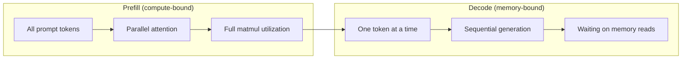
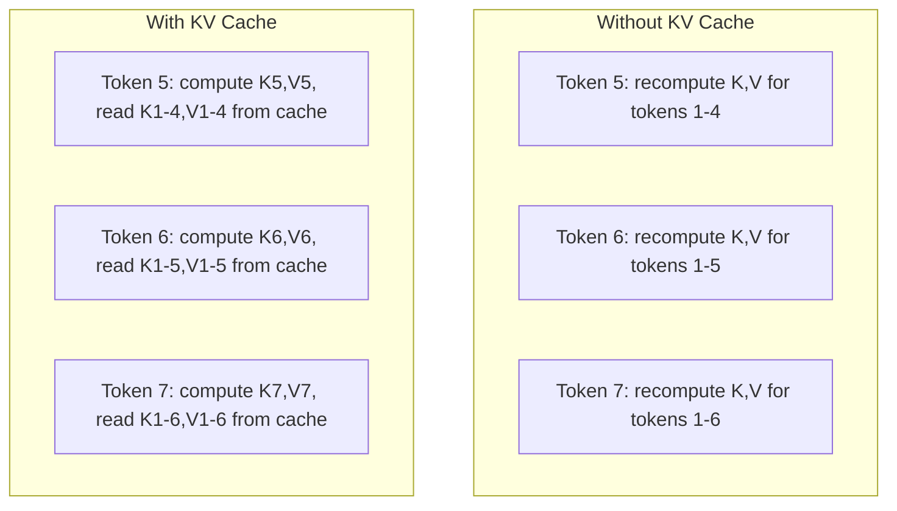
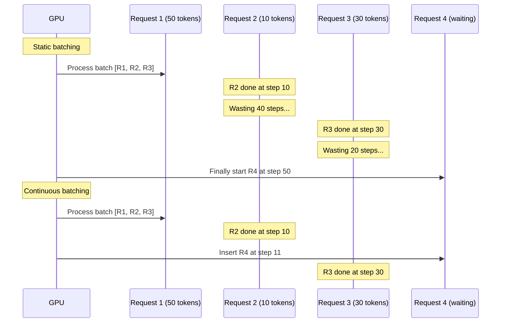
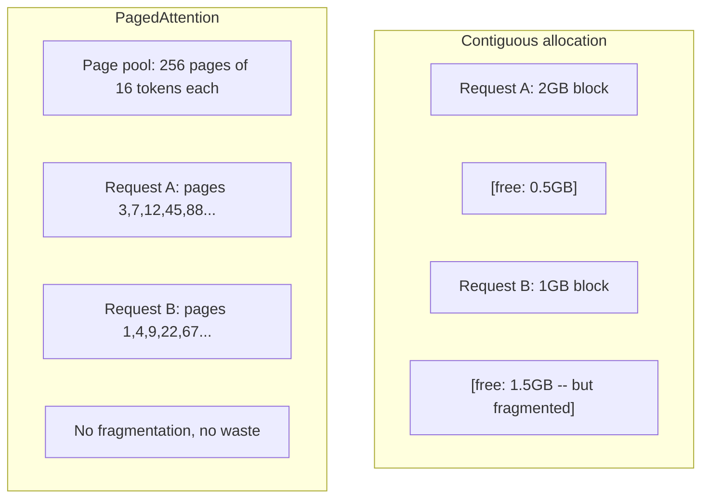
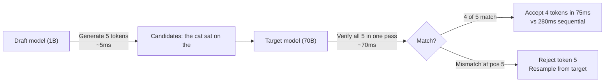

# 推理优化

> 两个阶段定义了LLM推理。预填充(Prefill)并行处理你的提示词——受计算限制。解码(Decode)逐个生成词元——受内存限制。每一个优化都针对其中一个或两个阶段。

**类型：** 构建
**语言：** Python
**先决条件：** 第10阶段，第01-08课（Transformer架构，注意力机制）
**时间：** ~120分钟

## 学习目标

- 实现KV缓存(KV-cache)以消除自回归词元生成中的冗余计算
- 解释LLM推理的预填充阶段与解码阶段的区别，以及为什么每个阶段有不同的瓶颈（受计算限制 vs 受内存限制）
- 实现连续批处理(continuous batching)和分页注意力(PagedAttention)的概念，以在并发请求下最大化GPU利用率
- 比较推理优化技术（KV缓存、推测解码(speculative decoding)、Flash Attention）及其吞吐量/延迟权衡

## 问题

你在4块A100 GPU上部署Llama 3 70B。单个用户获得约每秒50个词元。感觉很快。然后100个用户同时访问端点。吞吐量下降到每个用户每秒3个词元。你每月25,000美元的GPU账单提供的响应速度比人类打字还慢。

模型本身在1个用户和100个用户之间没有变化。相同的权重，相同的架构，相同的数学运算。变化的是你如何调度工作。朴素的推理浪费了90%以上的可用GPU算力。等待第47个词元的用户占着一个完整的批次槽，而GPU内存总线在矩阵乘法之间空闲。与此同时，一个新用户的2000词元提示本可以用有用的计算填满那段时间。

这不是一个扩展问题。这是一个调度问题。本课中的技术——KV缓存、连续批处理、分页注意力、推测解码、前缀缓存——是区分一个月$25k/month inference bill from a $5k的解决方案与另一台服务相同流量的方案的关键。

vLLM在4块A100-80GB上服务Llama 3 70B，在低并发下实现约50词元/秒/用户，并通过连续批处理和分页注意力在100个并发请求下维持15-25 TPS/用户。如果没有这些优化，同样的硬件在该并发下只能提供5 TPS/用户。同样的GPU，同样的模型，吞吐量提升了4倍。

## 核心概念

### 预填充 vs 解码

每个LLM推理请求都有两个不同的阶段。

**预填充**处理整个输入提示词。所有词元都是已知的，因此可以对整个序列并行计算注意力。这是一个大型矩阵乘法——GPU核心保持忙碌。瓶颈是计算：你的硬件每秒能提供多少FLOPS。一块A100提供312 TFLOPS（BF16）。在单个A100上，对70B模型进行4096词元提示的预填充大约需要400毫秒。

**解码**逐个生成输出词元。每个新词元关注所有之前的词元，但每次前向传播只产生一个词元。权重矩阵的大小与预填充时相同，但你将它们乘以单个向量而不是矩阵。GPU核心在微秒内完成计算，然后等待下一批权重从内存中到达。瓶颈是内存带宽：你能多快将模型权重从HBM流式传输到计算单元。一块A100的带宽为2 TB/s。一个FP16的70B模型大小为140 GB。读取一次完整模型需要70毫秒——这是单步解码的下限。



**操作数与字节比**（也称为算术强度）捕捉了这一权衡。它衡量每从内存加载一个字节执行了多少次操作。

```
ops:byte ratio = FLOPs per token / bytes read from memory
```

在预填充阶段，当批次大小为4096个词元时，每加载一个权重执行约4096次乘加运算。比率高——你受计算限制。在解码阶段，当批次大小为1时，每加载一个权重执行约1次运算。比率低——你受内存限制。

基本洞察：*解码受内存限制，因为你读取整个模型只产生一个词元*。下面的每个优化要么减少读取内容，要么增加每次读取处理的词元批次，要么完全避免读取。

### KV缓存

在注意力机制中，每个词元的查询关注所有先前词元的键和值向量。没有缓存时，生成第N个词元需要重新计算前面N-1个词元的键和值投影。生成第2个词元时对第1个词元进行投影，生成第3个词元时再次投影，生成第4个词元时再次投影。到第1000个词元时，你已经对第1个词元投影了总共999次。

KV缓存存储所有先前词元的键和值投影。生成第N个词元时，你只计算第N个词元的键和值，然后将它们与从第1到第N-1个词元缓存的K/V连接起来。



**KV缓存的内存公式：**

```
KV cache size = 2 * num_layers * num_kv_heads * head_dim * seq_len * bytes_per_param
```

对于Llama 3 70B（80层，8个KV头，使用GQA，head_dim=128，BF16）：

```
per token: 2 * 80 * 8 * 128 * 2 bytes = 327,680 bytes = 320 KB
at 4,096 tokens: 320 KB * 4,096 = 1.28 GB
at 128K tokens: 320 KB * 131,072 = 40 GB
```

Llama 3 70B的一个128K上下文对话消耗40 GB的KV缓存——一块A100内存的一半。如果有100个并发用户，每个用户4K个词元，仅KV缓存就需要128 GB。这就是为什么KV缓存管理是推理优化的核心挑战。

### 连续批处理

静态批处理等待一批N个请求到达，一起处理它们，并等待所有请求完成后才接受新请求。如果一个请求需要500个词元，另一个需要10个，短请求在完成后会空闲490个解码步骤。

连续批处理（也称为迭代级批处理）在任何请求完成后立即将新请求插入到批次中。批次在每个解码步骤重新评估。一个在10个词元后完成的请求立即被一个等待的请求替换。



吞吐量的提升取决于输出长度的变化程度。长度均匀时，连续批处理与静态批处理相当。长度变化时（常见情况），连续批处理可以提供2-5倍的吞吐量提升，因为GPU槽永远不会闲置。

### 分页注意力

每个请求的KV缓存是一个连续的内存块。随着请求的到达和离开，内存碎片化——就像操作系统中的RAM碎片化一样。一个4K词元的请求需要1.28 GB连续内存。即使你总共有2 GB空闲，也可能没有1.28 GB*连续*内存。你要么浪费内存，要么拒绝请求。

分页注意力（来自vLLM）将操作系统风格的虚拟内存应用于KV缓存。它不是为每个请求分配一个连续块，而是分配固定大小的“页”（通常每个页16个词元）。页可以位于物理GPU内存的任何位置。一个页表将每个请求的逻辑序列位置映射到物理页位置。



分页注意力还支持共享前缀的**写时复制**。如果50个请求共享相同的系统提示词，该系统提示词的KV缓存页只存储一次，并被所有50个请求引用。只有当请求出现分歧（不同的用户消息）时，它才拥有自己的页。这极大地减少了具有共享系统提示词的应用程序的内存使用。

vLLM报告通过分页注意力实现了近乎零的内存浪费（约4%对比朴素分配的约60-80%）。

### 推测解码(Speculative Decoding)

解码过程缓慢，因为它是顺序的——先生成一个token，再将其反馈，然后生成下一个。但如果你能廉价地猜测接下来的5个token，然后一次性验证它们呢？

推测解码使用一个较小、较快的**草稿模型(draft model)** 生成K个候选token。然后大型**目标模型(target model)** 在单次前向传播中处理所有K个候选（这看起来像预填充(prefill)——并行、计算密集型、高效）。如果目标模型与草稿模型的预测一致，你就在一次目标前向传播的时间内接受了所有K个token。如果在位置j出现不一致，则接受第1到第j-1个token，并丢弃其余部分。



加速效果取决于**接受率(acceptance rate)**——草稿模型的预测与目标模型匹配的频率。对于使用Llama 3 8B为Llama 3 70B起草，自然语言上的接受率通常为70-85%。这相当于2-3倍的解码加速。

推测解码的三种方法：

|  方法  |  草稿来源  |  接受率  |  开销  |
|--------|-------------|-----------------|----------|
|  Draft-target (Leviathan等人)  |  单独的小模型  |  70-85%  |  草稿模型内存  |
|  EAGLE (Li等人)  |  目标模型上的轻量级头  |  75-90%  |  约1%额外参数  |
|  N-gram查找  |  Token n-gram表  |  40-60%  |  可忽略  |

**EAGLE**在目标模型的隐藏状态之上训练一个小型自回归头。它利用目标模型倒数第二层的特征预测下一个token的嵌入。由于它在目标模型自身的表示（而非单独模型）上运行，因此能以最小的额外内存实现更高的接受率。EAGLE-2增加了一个动态草稿树，可根据上下文调整候选数量。

**N-gram推测解码**维护一个n-gram延续表，这些延续来自当前上下文或预构建的语料库。如果草稿与同一对话中之前出现的内容（重复模式、代码、结构化输出）匹配，则无需神经网络开销即可生效。平均接受率较低，但每次推测的成本几乎为零。

推测解码是*数学上精确的*——输出分布与目标模型的分布相同。这不是近似。验证步骤确保每个被接受的token都具有目标模型本应分配的确切概率。

### 前缀缓存(Prefix Caching)

许多请求共享相同的前缀。一个聊天机器人的系统提示。一个RAG上下文块。一个少样本示例集。如果没有前缀缓存，每个请求都会从头开始为这些共享token重新计算KV缓存。

前缀缓存存储常见前缀的KV缓存，并在请求之间复用。当新请求到来且包含已知前缀时，系统复制（或引用）缓存的KV条目，仅计算唯一后缀的KV。

对于所有请求共享的2000 token系统提示，前缀缓存消除了每次请求约400ms的预填充时间。在每秒100个请求时，每秒节省40秒的GPU计算——超过一个GPU的工作量。

SGLang的RadixAttention使用基数树(radix tree)（前缀树(trie)）实现前缀缓存，该树按token内容索引前缀。任何与存储前缀匹配的请求都能免费获得KV缓存。该树支持部分前缀匹配——如果与缓存条目共享2000个前缀token中的1500个，则复用那1500个，仅重新计算500个。

### 推理引擎(Inference Engines)

三个引擎主导了生产级LLM服务：

|  引擎  |  关键创新  |  最适合  |
|--------|---------------|----------|
|  vLLM  |  PagedAttention、连续批处理  |  通用服务，最高兼容性  |
|  SGLang  |  RadixAttention（前缀缓存）、结构化生成  |  多轮聊天机器人、约束解码  |
|  TensorRT-LLM  |  NVIDIA内核融合、FP8量化  |  在NVIDIA硬件上实现单GPU最大吞吐量  |

**vLLM**是默认的起点。它支持最广泛的模型，可在任何GPU供应商（NVIDIA、AMD、Intel）上运行，并通过PagedAttention+连续批处理实现强劲的吞吐量。兼容OpenAI的API意味着你可以将其作为任何OpenAI API调用的替代方案。

**SGLang**建立在与vLLM相同的基础上，但增加了RadixAttention用于前缀缓存，以及用于结构化LLM程序的领域特定语言。如果你的工作负载涉及多轮对话、工具使用或约束解码（JSON输出、正则表达式引导生成），SGLang通常通过前缀复用比vLLM性能提升2-5倍。

**TensorRT-LLM**将模型编译为优化的NVIDIA GPU内核。它融合操作（注意力+线性+激活在一个内核中），在H100 GPU上使用FP8，并与NVIDIA Triton推理服务器集成用于生产部署。它在NVIDIA硬件上实现了最高的单GPU吞吐量，但需要更多设置，且仅适用于NVIDIA GPU。

Llama 3 70B (4xA100-80GB, BF16)的实际数据：

|  指标  |  vLLM  |  SGLang  |  TensorRT-LLM  |
|--------|------|--------|---------------|
|  吞吐量（1用户）  |  ~50 TPS  |  ~55 TPS  |  ~65 TPS  |
|  吞吐量（100用户）  |  ~2,500总TPS  |  ~3,200总TPS  |  ~3,000总TPS  |
|  首次输出令牌时间 |  约400毫秒 |  约300毫秒（前缀命中） |  约350毫秒  |
|  最大上下文 |  128K |  128K |  128K  |

### 运算字节比（Ops:Byte）框架

你无法优化你无法衡量的东西。运算字节比（ops:byte）告诉你，你的瓶颈是计算受限还是内存受限，这决定了哪些优化是重要的。

```
Compute roof: peak FLOPS of the GPU
Memory roof:  peak bandwidth * ops:byte ratio
```

当运算字节比较低（解码，小批次）时，你触及了内存带宽天花板。增加更多计算（更高频率、更多核心）无济于事。你需要减少内存读取（量化、KV缓存压缩）或增加批次大小，以将读取平摊到更多有用的工作。

当运算字节比较高（预填充，大批次）时，你触及了计算天花板。内存带宽优化无济于事。你需要更快的GPU、内核融合或降低精度以榨取更多FLOPS。

|  场景 |  ops:byte |  瓶颈 |  优化方法  |
|----------|----------|-------|---------------|
|  预填充，批次=1 |  ~4,096 |  计算 |  内核融合、FP8  |
|  解码，批次=1 |  ~1 |  内存 |  量化、KV压缩  |
|  解码，批次=32 |  ~32 |  内存 |  更大批次、连续批处理  |
|  解码，批次=256 |  ~256 |  过渡 |  两者都重要  |
|  解码，批次=1024 |  ~1,024 |  计算 |  内核融合、张量并行  |

A100上的交叉点大约在运算字节比=156（312 TFLOPS / 2 TB/s）。低于156，你是内存受限；高于156，你是计算受限。连续批处理通过每次迭代打包更多令牌，将解码推向这个交叉点。

```figure
context-window-slide
```

## 动手构建

### 步骤1：从头构建KV缓存

我们构建一个多头KV缓存，存储每层、每头的键和值投影，并展示内存增长模式。

```python
import numpy as np

class KVCache:
    def __init__(self, num_layers, num_heads, head_dim, max_seq_len, dtype=np.float16):
        self.num_layers = num_layers
        self.num_heads = num_heads
        self.head_dim = head_dim
        self.max_seq_len = max_seq_len
        self.dtype = dtype

        self.k_cache = np.zeros(
            (num_layers, num_heads, max_seq_len, head_dim), dtype=dtype
        )
        self.v_cache = np.zeros(
            (num_layers, num_heads, max_seq_len, head_dim), dtype=dtype
        )
        self.seq_len = 0

    def update(self, layer_idx, new_keys, new_values):
        num_new = new_keys.shape[1]
        end = self.seq_len + num_new
        self.k_cache[layer_idx, :, self.seq_len:end, :] = new_keys
        self.v_cache[layer_idx, :, self.seq_len:end, :] = new_values
        return (
            self.k_cache[layer_idx, :, :end, :],
            self.v_cache[layer_idx, :, :end, :]
        )

    def advance(self, num_tokens):
        self.seq_len += num_tokens

    def memory_bytes(self):
        return self.k_cache.nbytes + self.v_cache.nbytes

    def used_bytes(self):
        per_token = 2 * self.num_layers * self.num_heads * self.head_dim * np.dtype(self.dtype).itemsize
        return per_token * self.seq_len
```

### 步骤2：带KV缓存的注意力

一个简化的多头注意力，使用KV缓存进行解码步骤。

```python
def scaled_dot_product_attention(query, keys, values):
    head_dim = query.shape[-1]
    scores = np.matmul(query, keys.transpose(0, 1, 3, 2)) / np.sqrt(head_dim)
    seq_len_q = scores.shape[-2]
    seq_len_k = scores.shape[-1]
    if seq_len_q > 1:
        mask = np.triu(np.ones((seq_len_q, seq_len_k), dtype=np.float32), k=seq_len_k - seq_len_q + 1)
        scores = scores + mask * (-1e9)
    max_scores = np.max(scores, axis=-1, keepdims=True)
    exp_scores = np.exp(scores - max_scores)
    attn_weights = exp_scores / np.sum(exp_scores, axis=-1, keepdims=True)
    return np.matmul(attn_weights, values)


class MultiHeadAttention:
    def __init__(self, d_model, num_heads):
        self.num_heads = num_heads
        self.head_dim = d_model // num_heads
        scale = np.sqrt(2.0 / d_model)
        self.W_q = np.random.randn(d_model, d_model).astype(np.float32) * scale
        self.W_k = np.random.randn(d_model, d_model).astype(np.float32) * scale
        self.W_v = np.random.randn(d_model, d_model).astype(np.float32) * scale
        self.W_o = np.random.randn(d_model, d_model).astype(np.float32) * scale

    def forward(self, x, kv_cache=None, layer_idx=0):
        batch, seq_len, d_model = x.shape
        Q = np.matmul(x, self.W_q).reshape(batch, seq_len, self.num_heads, self.head_dim).transpose(0, 2, 1, 3)
        K = np.matmul(x, self.W_k).reshape(batch, seq_len, self.num_heads, self.head_dim).transpose(0, 2, 1, 3)
        V = np.matmul(x, self.W_v).reshape(batch, seq_len, self.num_heads, self.head_dim).transpose(0, 2, 1, 3)

        if kv_cache is not None:
            K_full, V_full = kv_cache.update(layer_idx, K[0], V[0])
            K = K_full[np.newaxis, :, :, :]
            V = V_full[np.newaxis, :, :, :]
            if seq_len == 1:
                kv_cache.advance(1)

        attn_out = scaled_dot_product_attention(Q, K, V)
        attn_out = attn_out.transpose(0, 2, 1, 3).reshape(batch, -1, d_model)
        return np.matmul(attn_out, self.W_o)
```

### 步骤3：连续批处理模拟器

这模拟了静态批处理和连续批处理之间的调度差异。

```python
import heapq

class Request:
    def __init__(self, request_id, prompt_tokens, output_tokens, arrival_step):
        self.request_id = request_id
        self.prompt_tokens = prompt_tokens
        self.output_tokens = output_tokens
        self.arrival_step = arrival_step
        self.tokens_generated = 0
        self.start_step = None
        self.end_step = None

    def is_done(self):
        return self.tokens_generated >= self.output_tokens


def simulate_static_batching(requests, batch_size):
    step = 0
    completed = []
    queue = list(requests)
    queue.sort(key=lambda r: r.arrival_step)

    while queue:
        batch = []
        while queue and len(batch) < batch_size:
            r = queue.pop(0)
            r.start_step = max(step, r.arrival_step)
            batch.append(r)

        if batch:
            step = max(step, max(r.start_step for r in batch))
            max_output = max(r.output_tokens for r in batch)
            for r in batch:
                r.tokens_generated = r.output_tokens
                r.end_step = step + max_output
            step += max_output
            completed.extend(batch)

    return completed


def simulate_continuous_batching(requests, batch_size):
    step = 0
    completed = []
    queue = sorted(requests, key=lambda r: r.arrival_step)
    queue_idx = 0
    active = []
    waiting = []

    while queue_idx < len(queue) or active or waiting:
        while queue_idx < len(queue) and queue[queue_idx].arrival_step <= step:
            waiting.append(queue[queue_idx])
            queue_idx += 1

        while waiting and len(active) < batch_size:
            r = waiting.pop(0)
            r.start_step = step
            active.append(r)

        if not active:
            if waiting:
                step += 1
                continue
            elif queue_idx < len(queue):
                step = queue[queue_idx].arrival_step
                continue
            else:
                break

        for r in active:
            r.tokens_generated += 1

        done = [r for r in active if r.is_done()]
        for r in done:
            r.end_step = step + 1
            completed.append(r)
        active = [r for r in active if not r.is_done()]

        step += 1

    return completed


def batching_stats(completed):
    latencies = [r.end_step - r.arrival_step for r in completed]
    total_time = max(r.end_step for r in completed) - min(r.arrival_step for r in completed)
    total_tokens = sum(r.output_tokens for r in completed)
    return {
        "avg_latency": np.mean(latencies),
        "p50_latency": np.median(latencies),
        "p99_latency": np.percentile(latencies, 99),
        "total_time": total_time,
        "throughput": total_tokens / total_time if total_time > 0 else 0,
    }
```

### 步骤4：前缀缓存

一个基于trie的前缀缓存，存储共享前缀的KV条目。

```python
class TrieNode:
    def __init__(self):
        self.children = {}
        self.kv_data = None
        self.hit_count = 0


class PrefixCache:
    def __init__(self, max_entries=1000):
        self.root = TrieNode()
        self.max_entries = max_entries
        self.total_entries = 0
        self.hits = 0
        self.misses = 0

    def _walk(self, token_ids):
        node = self.root
        depth = 0
        for tid in token_ids:
            if tid not in node.children:
                break
            node = node.children[tid]
            depth += 1
        return node, depth

    def lookup(self, token_ids):
        node, depth = self._walk(token_ids)
        if depth > 0:
            self.hits += 1
            current = self.root
            for tid in token_ids[:depth]:
                current = current.children[tid]
                current.hit_count += 1
            kv_entries = []
            current = self.root
            for tid in token_ids[:depth]:
                current = current.children[tid]
                if current.kv_data is not None:
                    kv_entries.append(current.kv_data)
            return depth, kv_entries
        self.misses += 1
        return 0, []

    def insert(self, token_ids, kv_per_token):
        node = self.root
        for i, tid in enumerate(token_ids):
            if tid not in node.children:
                if self.total_entries >= self.max_entries:
                    return i
                node.children[tid] = TrieNode()
                self.total_entries += 1
            node = node.children[tid]
            if i < len(kv_per_token):
                node.kv_data = kv_per_token[i]
        return len(token_ids)

    def hit_rate(self):
        total = self.hits + self.misses
        return self.hits / total if total > 0 else 0.0
```

### 步骤5：推测解码模拟器

我们模拟了可配置接受率的草稿-目标推测解码。

```python
class DraftModel:
    def __init__(self, vocab_size, acceptance_rate=0.8):
        self.vocab_size = vocab_size
        self.acceptance_rate = acceptance_rate

    def generate(self, context, num_tokens):
        tokens = np.random.randint(0, self.vocab_size, size=num_tokens)
        return tokens

    def get_probs(self, context, token):
        probs = np.random.dirichlet(np.ones(self.vocab_size))
        return probs


class TargetModel:
    def __init__(self, vocab_size):
        self.vocab_size = vocab_size

    def get_probs(self, context, tokens=None):
        if tokens is not None:
            return [np.random.dirichlet(np.ones(self.vocab_size)) for _ in tokens]
        return np.random.dirichlet(np.ones(self.vocab_size))


def speculative_decode(draft_model, target_model, context, num_speculative=5,
                       draft_cost=1.0, target_cost=10.0, verify_cost=12.0):
    total_tokens = 0
    total_cost = 0.0
    accepted_counts = []
    context = list(context)

    max_tokens = 100

    while total_tokens < max_tokens:
        draft_tokens = draft_model.generate(context, num_speculative)
        total_cost += draft_cost * num_speculative

        target_probs = target_model.get_probs(context, draft_tokens)
        total_cost += verify_cost

        accepted = 0
        for i, token in enumerate(draft_tokens):
            draft_p = draft_model.get_probs(context + list(draft_tokens[:i]), token)
            target_p = target_probs[i]

            r = np.random.random()
            acceptance_prob = min(1.0, target_p[token] / (draft_p[token] + 1e-10))

            if r < draft_model.acceptance_rate:
                accepted += 1
                context.append(token)
                total_tokens += 1
            else:
                new_token = np.random.choice(draft_model.vocab_size, p=target_p)
                context.append(new_token)
                total_tokens += 1
                break

        accepted_counts.append(accepted)

        if accepted == num_speculative:
            bonus_probs = target_model.get_probs(context)
            bonus_token = np.random.choice(draft_model.vocab_size, p=bonus_probs)
            context.append(bonus_token)
            total_tokens += 1

    sequential_cost = total_tokens * target_cost
    return {
        "total_tokens": total_tokens,
        "speculative_cost": total_cost,
        "sequential_cost": sequential_cost,
        "speedup": sequential_cost / total_cost if total_cost > 0 else 1.0,
        "avg_accepted": np.mean(accepted_counts),
        "acceptance_rate": np.mean(accepted_counts) / num_speculative,
    }


def compare_speculation_strategies(vocab_size=1000, num_trials=20):
    results = {}

    for name, acceptance_rate, spec_tokens in [
        ("Draft-target (8B->70B)", 0.78, 5),
        ("EAGLE", 0.85, 6),
        ("N-gram", 0.50, 4),
        ("No speculation", 0.0, 0),
    ]:
        if spec_tokens == 0:
            results[name] = {
                "speedup": 1.0,
                "acceptance_rate": 0.0,
                "avg_accepted": 0.0,
            }
            continue

        trial_results = []
        for _ in range(num_trials):
            draft = DraftModel(vocab_size, acceptance_rate=acceptance_rate)
            target = TargetModel(vocab_size)
            context = list(np.random.randint(0, vocab_size, size=10))
            result = speculative_decode(draft, target, context, num_speculative=spec_tokens)
            trial_results.append(result)

        results[name] = {
            "speedup": np.mean([r["speedup"] for r in trial_results]),
            "acceptance_rate": np.mean([r["acceptance_rate"] for r in trial_results]),
            "avg_accepted": np.mean([r["avg_accepted"] for r in trial_results]),
        }

    return results
```

### 步骤6：KV缓存内存分析器

计算实际模型配置的KV缓存内存需求。

```python
MODEL_CONFIGS = {
    "Llama-3-8B": {
        "num_layers": 32, "num_kv_heads": 8, "head_dim": 128,
        "model_params_b": 8, "gqa": True,
    },
    "Llama-3-70B": {
        "num_layers": 80, "num_kv_heads": 8, "head_dim": 128,
        "model_params_b": 70, "gqa": True,
    },
    "Llama-3-405B": {
        "num_layers": 126, "num_kv_heads": 8, "head_dim": 128,
        "model_params_b": 405, "gqa": True,
    },
    "Mistral-7B": {
        "num_layers": 32, "num_kv_heads": 8, "head_dim": 128,
        "model_params_b": 7, "gqa": True,
    },
    "GPT-4-est": {
        "num_layers": 120, "num_kv_heads": 96, "head_dim": 128,
        "model_params_b": 1800, "gqa": False,
    },
}


def kv_cache_memory(config, seq_len, dtype_bytes=2):
    per_token = 2 * config["num_layers"] * config["num_kv_heads"] * config["head_dim"] * dtype_bytes
    total = per_token * seq_len
    return {
        "per_token_bytes": per_token,
        "per_token_kb": per_token / 1024,
        "total_bytes": total,
        "total_mb": total / (1024 ** 2),
        "total_gb": total / (1024 ** 3),
    }


def memory_budget(config, gpu_memory_gb, model_dtype_bytes=2, kv_dtype_bytes=2):
    model_memory_gb = config["model_params_b"] * 1e9 * model_dtype_bytes / (1024 ** 3)
    overhead_gb = gpu_memory_gb * 0.1
    available_for_kv = gpu_memory_gb - model_memory_gb - overhead_gb

    if available_for_kv <= 0:
        return {"error": "Model does not fit in GPU memory", "model_memory_gb": model_memory_gb}

    per_token = 2 * config["num_layers"] * config["num_kv_heads"] * config["head_dim"] * kv_dtype_bytes
    max_tokens = int(available_for_kv * (1024 ** 3) / per_token)

    return {
        "gpu_memory_gb": gpu_memory_gb,
        "model_memory_gb": round(model_memory_gb, 1),
        "overhead_gb": round(overhead_gb, 1),
        "available_for_kv_gb": round(available_for_kv, 1),
        "max_total_tokens": max_tokens,
        "max_users_at_2k": max_tokens // 2048,
        "max_users_at_4k": max_tokens // 4096,
        "max_users_at_32k": max_tokens // 32768,
    }
```

## 使用它

使用vLLM：

```python
from vllm import LLM, SamplingParams

llm = LLM(
    model="meta-llama/Llama-3-70B-Instruct",
    tensor_parallel_size=4,
    enable_prefix_caching=True,
    max_model_len=8192,
    gpu_memory_utilization=0.9,
)

params = SamplingParams(temperature=0.7, max_tokens=256)
outputs = llm.generate(["Explain inference optimization in one paragraph."], params)
```

使用SGLang进行前缀缓存+结构化输出：

```python
import sglang as sgl

@sgl.function
def classify(s, text):
    s += sgl.system("You are a classifier. Output JSON only.")
    s += sgl.user(f"Classify this text: {text}")
    s += sgl.assistant(sgl.gen("result", regex=r'\{"label": "(positive|negative|neutral)"\}'))

runtime = sgl.Runtime(model_path="meta-llama/Llama-3-70B-Instruct", tp_size=4)
sgl.set_default_backend(runtime)

results = classify.run_batch([
    {"text": "This product is amazing!"},
    {"text": "Terrible experience."},
    {"text": "It was okay I guess."},
])
```

使用TensorRT-LLM：

```python
import tensorrt_llm
from tensorrt_llm.runtime import ModelRunner

runner = ModelRunner.from_dir("./llama-70b-trt-engine/", rank=0)

outputs = runner.generate(
    batch_input_ids=[tokenizer.encode("Explain KV caching.")],
    max_new_tokens=256,
    temperature=0.7,
)
```

## 发布

本課(lesson)产出：
- `outputs/skill-inference-optimization.md` —— 诊断和优化LLM推理服务的技能

## 练习

1. 修改KV缓存分析器，比较FP16、FP8和INT4 KV缓存量化。对于Llama 3 70B在4K上下文下，计算每种量化方式在4xA100-80GB上的最大并发用户数。KV量化到INT4应该大约将用户容量提升4倍。

2. 扩展连续批处理模拟器以追踪GPU利用率（每步填充的批处理槽位比例）。绘制静态批处理和连续批处理在50个请求下的利用率随时间变化图，这些请求的输出长度服从Pareto分布（形状参数=1.5，尺度参数=20）。连续批处理应保持>80%的利用率。

3. 实现KV缓存的分组查询注意力(GQA)版本，其中`num_kv_heads < num_query_heads`。Llama 3 70B使用64个查询头但仅有8个KV头。计算与完整多头注意力相比的内存节省（KV缓存大小减少8倍）。

4. 构建一个使用LRU淘汰策略的前缀缓存。设置最大条目数为500，生成1,000个请求，其中60%共享5个常见前缀中的某一个。测量命中率并与无限缓存比较。在良好的淘汰策略下，命中率应保持在55%以上。

5. 扩展推测解码模拟器以实现基于树的推测（EAGLE-2风格）。不是生成单一链的K个草稿令牌，而是生成一个候选树（例如，每层2个分支，共3层 = 8个叶候选）。比较每轮验证中接受的令牌总数与线性推测的差异。

## 关键术语

|  术语  |  人们的说法  |  实际含义  |
|------|----------------|----------------------|
|  Prefill  |  “处理提示”  |  并行计算所有输入令牌的注意力——计算受限，因为完整的矩阵乘法使GPU核心保持忙碌  |
|  Decode  |  “生成令牌”  |  每次前向传播生成一个令牌，每次读取完整的模型权重——内存受限，因为计算在下一次权重到来之前完成  |
|  KV cache  |  “缓存注意力状态”  |  存储所有先前令牌的键和值投影，以便在每个解码步骤中不必重新计算——用内存换取计算  |
|  Continuous batching  |  “动态批处理”  |  一旦任何请求完成，立即将新请求插入正在运行的批处理中，在每个解码迭代时评估，而不是等待整个批处理  |
|  PagedAttention  |  “KV缓存的虚拟内存”  |  以固定大小的页而不是连续块分配KV缓存，消除内存碎片，并为共享前缀启用写时复制  |
|  Speculative decoding  |  “草稿与验证”  |  使用快速草稿模型提出多个令牌，然后在一次目标模型前向传播中全部验证——数学上精确，2-3倍加速  |
|  EAGLE  |  “自我推测解码”  |  一种推测解码变体，在目标模型自身的隐藏状态上训练轻量级头部，实现比独立草稿模型更高的接受率  |
|  Prefix caching  |  “复用系统提示KV”  |  存储常见前缀（系统提示、少样本示例）的计算后KV缓存条目，并在请求间复用，以跳过冗余预填充  |
|  Ops:byte ratio  |  “算术强度”  |  计算操作数与读取内存字节数的比值——决定工作负载是计算受限（高比值）还是内存受限（低比值）  |
|  Time to first token  |  “TTFT”  |  从接收到请求到产生第一个输出令牌的延迟——对于长提示，主要由预填充时间主导  |

## 延伸阅读

- Kwon等人，《利用PagedAttention实现大语言模型服务的高效内存管理》(2023)——提出分页KV缓存管理的vLLM论文，现已成为推理服务的行业标准
- Leviathan等人，《通过推测解码实现Transformer的快速推理》(2023)——基础性论文，证明草稿验证推测能产生精确的目标模型分布，同时实现2-3倍加速
- Li等人，《EAGLE：推测采样需要重新思考特征不确定性》(2024)——通过在目标模型自身特征上训练头部来实现更高接受率，而不是使用独立的草稿模型
- Zheng等人，《SGLang：结构化语言模型程序的高效执行》(2024)——引入RadixAttention用于前缀缓存，以及多调用LLM程序的编程模型
- Williams等人，《Roofline：多核架构的洞察性可视化性能模型》(2009)——原创的Roofline论文，形式化了用于推理计算与内存瓶颈的Ops:Byte框架
