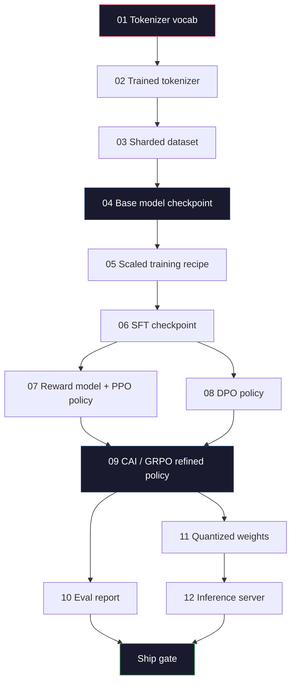
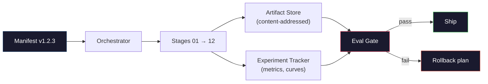

# 构建完整的LLM流水线

> 第01课到第12课的所有内容都是单条流水线的一个阶段。本节课是将这些阶段整合为单个端到端运行（tokenize、pre-train、scale、SFT、align、evaluate、quantize、serve）的脚手架。你不会在笔记本电脑上训练一个70B模型，而是会生成编排层、清单、评估门控和回滚计划——这些正是2026年前沿团队用来决定发布什么的内容。这是顶点项目。

**类型：** 构建
**语言：** Python（标准库）
**前置条件：** 阶段10全部课程01-12
**时间：** ~120分钟

## 学习目标

- 将前面的十一课（tokenizer、data、pre-training、scaling、SFT、RLHF、DPO、CAI、eval、quantization、inference）组合成单个可重现的流水线规范
- 定义阶段之间的产物契约：每个阶段消耗什么、产出什么，以及下一阶段如何验证输入
- 构建一个编排器，用于跟踪实验、哈希产物，并基于评估阈值门控发布决策
- 设计回滚计划：哪些产物可以低成本重新运行，哪些成本高昂，以及损坏的检查点会造成何种损失

## 问题

之前的每节课都是可运行的。Tokenizer已训练。小型GPT已预训练。SFT数据集已组装。奖励模型已训练。DPO已运行。评估已测量。量化权重已导出。推理服务器已启动。每节课都是一个Notebook，各有其约定、输出路径和种子。

前沿模型训练不是一个Notebook。Llama 3 405B在大约54天内消耗了3000万H100 GPU小时。DeepSeek-V3使用了大约280万H800 GPU小时。在此期间，一个损坏的检查点、一次数据污染或一次评估回归就可能使团队损失一周的挂钟时间和一个月的GPU预算。团队应对这种情况的方法是流水线卫生：每个阶段都有确定的输入、确定的输出、清单、哈希和门控。

这是顶点项目。你不会在笔记本电脑上端到端地运行流水线。你将编写协调各阶段的编排器、描述运行的清单、门控发布决策的验证器，以及允许第三方从单个文件重新运行你工作的重放计划。代码量很小，纪律性很大。

该模式从100M到1T参数不变地扩展。同样的四个组件——清单、编排器、评估门控、产物存储——既运行Llama 3，也运行你的业余GPT。不同之处在于每个阶段配置中的数字大小，而不是流水线的形状。

## 核心概念

### 十二个阶段

阶段10的每节课都是一个阶段。这是完整的依赖图。



阶段07和08可以并行运行。其他所有阶段都是硬依赖。阶段02（Tokenizer）的更改会使所有下游产物失效。阶段10（评估）的更改仅使发布决策失效。

### 清单

清单是一个单一文件，足以完整描述一次运行并支持重放。流水线产生的任何内容都不应依赖于清单中未包含的状态。这些字段枯燥但必须。

```
pipeline_version: 1.2.3
seed: 42
git_commit: a1b2c3d4
stages:
  01_tokenizer:
    recipe: bpe_32k
    input_hash: sha256:...
    output_hash: sha256:...
    wall_clock_sec: 3600
    cost_usd: 12
```

阶段N的输出哈希是阶段N+1的输入哈希。任何偏差都会导致流水线停止。这就是尽早捕获数据损坏的方式。这也是不同大洲的队友验证他们的重放是否产生与你们相同产物的方式。

实践中，团队使用一个小型YAML模式加上一个清单检查器，与上一次成功运行进行差异比较。任何超出预期字段（成本、挂钟时间）的差异都是危险信号。

### 产物类型化

每个阶段的输出都是一个类型化的产物。不是目录blob，不是pickle，而是具有已知模式的命名类型。

|  阶段  |  产物类型  |  关键字段  |
|-------|--------------|-----------|
|  01-02  |  Tokenizer  |  vocab.json, merges.txt, config.json, hash  |
|  03  |  Dataset  |  shards[], 行数, token数, 去重统计  |
|  04-05  |  Checkpoint  |  weights.safetensors, config.json, 优化器状态, 步骤数  |
|  06  |  SFT Model  |  checkpoint + SFT配方 + 数据混合  |
|  07  |  Reward Model  |  RM checkpoint + 偏好数据hash  |
|  08-09  |  Policy  |  checkpoint + 参考hash + beta + 已消耗KL预算  |
|  10  |  Eval Report  |  基准得分 + 回归差异 + 评估数据hash  |
|  11  |  Quantized Model  |  量化权重 + 校准数据 + 与FP16的精度差异  |
|  12  |  Server Spec  |  端点 + 模型hash + 配置 + 可观测性钩子  |

类型化防止了最常见的失败模式：将阶段08的输出用作阶段06的输入，通过SFT路径发布DPO训练后的模型。类型化产物和类型化阶段签名使这些错误成为编译时失败，而非第五天失败。

### 评估门控

"发布"不是"训练完成"。"发布"是"训练完成并且评估门控通过"。门控在运行开始前就已定义。

```
gates:
  mmlu:      >= baseline + 0.5   # no regression
  humaneval: >= baseline + 1.0
  truthfulqa: >= baseline         # no drop
  safety_refusal_rate: <= 0.05
  kl_from_reference: <= 25.0
  cost_total_usd: <= 50000
```

每个门控都是一个数值阈值。没有“看起来不错”的门控。没有主观签署。如果每个门控都通过，工件被标记为可交付。如果任何门控失败，运行将被暂停，等待指定审查者的明确覆盖，该覆盖本身会记录在清单中。

两个门控可以捕获大多数灾难。一个*回归*门控（新模型在核心基准上至少要与之前一样好）可以捕获训练错误。一个*KL预算*门控（对齐策略与参考的偏离不得超过X）可以捕获过度对齐。每个生产流水线都有这两个门控。

### 编排器

一小段代码，用于读取清单、调度阶段、跟踪工件，并在任何契约违规时停止。这不是Airflow。这不是Kubeflow。为了流水线的整洁，你需要一个你自己编写的、无聊的东西。

编排器的职责很窄：

1. 从清单解析DAG。
2. 对于每个阶段，检查预期输出是否已存在于正确的哈希（如果是，则跳过）。
3. 运行阶段，捕获stdout/stderr，测量墙钟时间和成本。
4. 将输出哈希与下游阶段期望的输入哈希进行验证。
5. 如果失败，写入包含确切失败阶段的局部清单，并以非零退出。

这是200行Python代码。它看起来像本课中的文件`code/main.py`。在底层，实际流水线使用`torchrun`或`ray`在集群上执行各个阶段，但编排器本身在单个机器上运行。

### 实验跟踪和工件存储

两个外部系统支撑了流水线。

**实验跟踪器（wandb、neptune、mlflow）。**记录每个阶段的损失曲线、评估指标、系统遥测数据。当你需要在三周后比较运行A与运行B时，跟踪器是你的去处。团队几乎总是使用托管跟踪器来实现这一点——自己编写会浪费本应用于训练的时间。

**工件存储（S3、R2、GCS）。**用于检查点、数据集、分词器、评估报告的不可变对象存储。工件通过哈希寻址，而不是文件名。像`latest.pt`这样的文件名是自伤武器；`ckpt-7b-step-20000-sha256:abc123.safetensors`是一个契约。

编排器同时写入两者。跟踪器供人类查看图表。工件存储供下一阶段查找输入。

### 成本核算

一次前沿运行有一个美元数字。预算纪律在两个地方执行。

**运行前估算。**从清单中计算预期的FLOPs（对于预训练：6 x 参数 x 令牌数）、预期的GPU小时数（FLOPs / 峰值吞吐量 / 利用率）和当前租赁费率下的美元成本。如果估算超过预算门控，流水线拒绝启动。

**运行中跟踪。**逐阶段的墙钟时间和成本记录到清单中。每个阶段后，检查剩余预算。如果某个阶段超支，则使用新的剩余预算评估下一个阶段的门控。你不会在风投打电话时才发现自己没钱了。

Llama 3报告的主要预训练运行成本是$61M. DeepSeek-V3 reported $560万。这个比例主要来自硬件效率和混合专家（MoE）——但具体成本可见是因为两个团队都按阶段跟踪，而不是按运行跟踪。

### 可复现性与确定性

这两者不同。*可复现*意味着相同的清单、相同的代码和相同的基础设施产生具有等效下游指标的检查点。*确定性*意味着比特位完全相同的输出。

现代LLM训练是可复现的但不是确定性的。分布式训练的规约顺序、GPU内核非确定性（cuBLAS、flash-attn）以及混合精度舍入共同导致运行之间浮点数在1e-5级别有差异。这对于不会变动的最终指标来说没问题。但如果你试图用比特级差异进行调试，则是致命的。解决方法是记录每个阶段的输入哈希、输出哈希和主要指标——如果这些匹配，运行就被“复现”了，即使权重不是比特级相同的。



### 回滚计划

在运行开始前，记录每个阶段失败时会发生什么。分为三类。

- **重新运行代价低**（几小时）：分词器、评估、量化、推理服务器。只需重新运行。
- **中等**（几天）：SFT、DPO、CAI。保留基础模型；仅重新运行对齐阶段。
- **代价高**（几周和数百万美元）：预训练。这里的回滚计划不是“重新运行”。而是“使用最后一个好的检查点，并用修订后的数据重新运行更便宜的下游阶段。”

由于阶段依赖关系是类型化且哈希的，编排器可以自动计算回滚集：使失败阶段及其所有后代失效。阶段06（SFT）失败会使06、07、08、09、10、11、12失效。阶段11（量化）失败仅使11和12失效。提前命名这些可以避免团队在凌晨4点筋疲力尽时临时应付。

### 2026年观察到的生产配方

大多数前沿团队收敛到了相同的骨架。

- 分词器：128k BPE，带字节回退。在小的、平衡的多语言切片上训练。
- 预训练：10-20T令牌，主要来自网页、代码和合成数据。Muon或AdamW优化器。FSDP2或DeepSpeed ZeRO-3。梯度检查点。BF16权重，FP32主权重。
- SFT：50万-200万指令对，混合人类和合成，对评估集严格去重。
- 对齐：DPO或CAI + GRPO。仅当偏好信号对于DPO过于多维时才使用RLHF。
- 评估：MMLU-Pro、MATH、HumanEval+、GPQA、SWE-Bench Verified、LiveBench，外加一个公共从未见过的私有保留集。
- 量化：用于服务的4位GPTQ或AWQ，用于精度差异重要的安全评估的8位。
- 服务：vLLM、TensorRT-LLM或自研。连续批处理。推测解码。KV缓存驱逐。

数字每六个月变化一次。骨架不变。

```figure
beam-search
```

## 动手构建

本课的代码是一个编排器和一个清单检查器，而不是十二个训练脚本。每个阶段用一个占位符模拟，该占位符产生具有正确形状和哈希的输出工件。端到端运行编排器可以证明流水线的管道工作正常，然后你才在真实阶段上烧GPU钱。

完整实现见`code/main.py`。关键部分：

- `Manifest` 数据类：流水线版本、种子、Git提交、阶段、门控。
- `Manifest` 数据类：名称、类型、输入（哈希）、输出（哈希）、挂钟时间、成本。
- `Manifest`：解析DAG、调度阶段、验证哈希值、更新清单。
- `Manifest`：读取阈值，与最新评估报告比较，返回通过/失败。
- `Manifest`（内存存根）：按哈希存取，模拟S3。
- `Manifest`：每阶段及累积，超出上限时暂停。

`main.py`中的流水线运行了12个占位阶段，生成一份清单，并测试一个失败的评估门控以展示暂停运行的样貌。将每个占位符替换为相应课程的真实训练脚本，你就拥有了一个真实前沿流水线所使用的骨架。

## 使用它

标准工作流程包含三个命令。

```
python code/main.py plan    # validate manifest, compute cost estimate, print DAG
python code/main.py run     # execute stages, writing to manifest.out.yaml
python code/main.py gate    # read manifest.out.yaml, apply eval gates, ship-or-hold
```

每次首先运行`plan`。大多数流水线错误在计划阶段就会暴露——缺少门控阈值、过期的哈希值、预算超支。运行`plan`是免费的。运行`run`很昂贵。通过尽早发现错误来节省成本。

`gate`的输出要么是`SHIP`，要么是`HOLD: <reason>`。暂停运行不是失败，而是一个决策点。指定的审核者要么覆盖（覆盖操作会被记录），要么批准回滚。

## 发布

本课产出`outputs/skill-llm-pipeline-reviewer.md`。向其提供一个提议的流水线清单，它会检查所有合约：阶段类型、哈希链、门控、回滚计划、成本估算。如果清单缺少评估门控、无界KL预算，或者混合了评估与训练数据的运行，它会拒绝批准。

## 练习

1. 扩展编排器以支持阶段07和08的并行执行。使用标准库的`concurrent.futures`模块。确认最终清单记录了这两个阶段的输出，并且阶段09的输入哈希是两者的确定性组合。

2. 添加一个“污染检查”门控。给定评估数据集哈希和训练数据集分片，计算重叠（精确字符串匹配或13-gram匹配）。如果重叠超过0.1%，门控失败。使用一个受污染的训练集进行测试，确认门控阻止了运行。

3. 从基本原理实现成本估算器。对于阶段04（预训练），估算FLOPs为6 x 参数 x 令牌，假设在H100上以989 TFLOPS BF16运行时MFU（模型FLOPs利用率）为40%，每GPU小时$2.50。报告一个7B模型在2T令牌上训练的估算值。与已发布的Llama 2数字进行比较。

4. 构建部分回滚。模拟阶段09（CAI）失败，然后重新运行阶段09到12，同时缓存阶段01-08。编排器应通过哈希值检测到缓存的工件并跳过它们。测量与完全重新运行相比节省的挂钟时间。

5. 添加可观测性。为每个阶段发出OpenTelemetry跨度，附带参数、令牌数、损失和成本等属性。将跨度传输到本地收集器。重点不在于仪表板，而在于每个阶段的健康状况可通过单一跟踪ID追溯。

## 关键术语

|  术语  |  人们的说法  |  实际含义  |
|------|----------------|----------------------|
|  清单  |  "配方文件"  |  描述流水线版本、种子、每阶段配置和门控阈值的YAML或JSON——足以复现一次运行  |
|  内容寻址  |  "按哈希而非名称"  |  工件按其内容的SHA-256哈希存储，因此永远不会混淆版本A与版本B  |
|  评估门控  |  "发布标准"  |  基准指标和安全分数上的数值阈值，工件必须通过才能标记为可发布  |
|  KL预算  |  "对齐漂移了多远"  |  对齐阶段中累积KL(策略 |  |  参考)的上限，作为门控强制执行  |
|  MFU  |  "你使用了多少GPU"  |  模型FLOPs利用率——实际FLOPs除以理论峰值。在70B规模下典型值为40%，在7B下为55%  |
|  回滚计划  |  "出问题时的应对措施"  |  针对每个阶段在失败时的预编写操作集：重新运行、回退、使用修订的输入重新训练  |
|  编排器  |  "指挥者"  |  读取清单、调度阶段、验证哈希值、在违反任何合约时停止的进程  |
|  工件存储  |  "带版本控制的S3用于权重"  |  不可变的内容寻址对象存储——检查点、数据集、评估报告的单一真实来源  |
|  可复现  |  "复现时相同指标"  |  不同的比特级权重但等效的下游指标——分布式LLM训练的现实目标  |
|  成本门控  |  "你不能超过X"  |  运行前成本估算加上运行中跟踪器——如果估算超过预算，流水线拒绝启动  |

## 延伸阅读

- [Dubey et al., 2024 -- "The Llama 3 Herd of Models"](https://arxiv.org/abs/2407.21783) —— 最详细的公开前沿流水线描述，包括数据、训练、对齐、评估
- [Dubey et al., 2024 -- "The Llama 3 Herd of Models"](https://arxiv.org/abs/2407.21783) —— 效率优先的流水线，成本约为Llama 3类训练的十分之一
- [Dubey et al., 2024 -- "The Llama 3 Herd of Models"](https://arxiv.org/abs/2407.21783) —— 原始的计算-数据-参数缩放关系
- [Dubey et al., 2024 -- "The Llama 3 Herd of Models"](https://arxiv.org/abs/2407.21783) —— 对Kaplan的修正，重新校准了现代数据预算
- [Dubey et al., 2024 -- "The Llama 3 Herd of Models"](https://arxiv.org/abs/2407.21783) —— 在PyTorch 2.4+中替代FSDP1的分布式训练原语
- [Dubey et al., 2024 -- "The Llama 3 Herd of Models"](https://arxiv.org/abs/2407.21783) —— 开源LLM运行的真实清单和实验跟踪器输出，可作为可抄袭的模板
