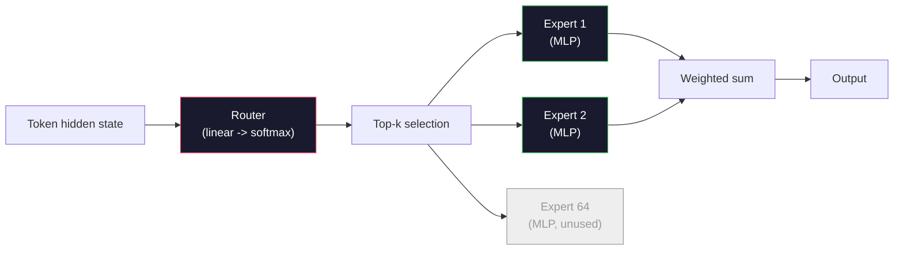

# 开放模型：架构解析

> 你在第04课中从零构建了一个GPT-2 Small。2026年的前沿开放模型属于同一家族，仅包含五六个具体变化：用RMSNorm替代LayerNorm；用SwiGLU替代GELU；用RoPE替代学习型位置编码；用GQA或MLA替代完整MHA；大规模使用混合专家(Mixture-of-Experts)。你已有的数学知识覆盖了其中95%。本节课将并排阅读Llama 3、DeepSeek-V3、Mixtral、Qwen和Gemma，并明确指出每个架构分歧处的具体行。

**类型:** 学习
**语言:** Python (stdlib)
**先修要求:** 阶段10, 第04、05、12课（预训练、规模扩展、推理）
**时长:** ~45分钟

## 学习目标

- 阅读Llama 3、Mistral、Mixtral、Gemma 2、Qwen 2.5和DeepSeek-V3的config.json，并解释每个字段
- 指出每个模型相对于GPT-2 Small所做的具体架构变化，并从基本原理出发进行论证
- 仅根据任何开放模型的配置文件计算其参数数量、KV缓存大小和激活内存
- 根据延迟、内存和能力约束，为部署目标选择合适的开放模型

## 问题

在第04课中，你编写了350行numpy代码，并拥有了一个GPT-2形状的模型。Llama 3 405B有一份200页的技术报告。你的直觉是它们是不同的东西。实际上并非如此。这200页描述的是同一个对象，只做了五六个动机明确的修改，加上大量关于规模扩展的实现细节。其骨架——嵌入层、Transformer块、注意力机制、MLP、归一化、输出层——保持不变。

本节课是一份差异对比(diff)。对于每个主要的开放模型家族，我们列出相对于GPT-2的具体变化、原因及代价。完成后，你能够阅读一个新的模型卡，并在脑海中将其翻译回GPT-2基线。

实际收益是：当Meta发布Llama 5或DeepSeek发布V4时，你不需要建立新的心智模型。你只需查看配置，看看哪些已知的旋钮发生了变化，并了解其对下游的影响。2026年的架构是一个有限的工具箱。每个新模型都选择不同的子集。

## 核心概念

### 不变的核心

所有自回归开放模型共享：

- 词元嵌入矩阵(token embedding matrix)（vocab_size x hidden_dim）。
- N个解码器块(decoder block)的堆叠：归一化、自注意力(self-attention)、残差连接(residual)、归一化、MLP、残差连接。
- 最终的归一化和投影到vocab_size的线性输出层（通常与嵌入层权重绑定）。
- 因果掩码(causal mask)、下一个词元交叉熵损失(next-token cross-entropy loss)。

这就是形状。其余的都是旋钮。

### 实际变动的六个旋钮

在所有2024-2026年的前沿开放模型中，同样的六个设计选择被反复采用：

1. **归一化(Normalization).** LayerNorm → RMSNorm。
2. **位置编码(Positional encoding).** 学习型绝对位置(Learned absolute) → RoPE（以及变体：YaRN、NTK）。
3. **激活函数(Activation).** GELU → SwiGLU（或GeGLU）。
4. **注意力头共享(Attention head sharing).** MHA → GQA → MQA → MLA。
5. **密集与稀疏MLP(Dense vs sparse MLP).** 密集层(Dense) → 混合专家(Mixture-of-Experts)。
6. **前置归一化位置(Pre-norm placement).** 前置归一化(Pre-norm)保持不变。后置归一化(Post-norm)已消失。

其他所有内容（学习率调度、数据配比、批量大小、上下文长度）都存在于训练配置中，而非架构中。六个旋钮。

### 旋钮1: RMSNorm

LayerNorm减去均值，除以标准差，缩放并平移。RMSNorm仅保留缩放：

```
RMSNorm(x) = x / sqrt(mean(x^2) + eps) * gamma
```

无均值减法。无偏置。每个词元减少一次矩阵乘法。Zhang和Sennrich (2019)提出其在机器翻译任务上与LayerNorm性能相当，同时速度提升10%。每个现代开放模型都使用它。

代价：无。收益：小幅吞吐量提升，代码更简洁。

### 旋钮2: RoPE

学习型位置嵌入(Learned position embeddings)在GPT-2中是一个1024槽位的查找表。上下文长度1025超出表格末尾。模型无法外推超过其训练长度。

旋转位置嵌入(Rotary Position Embedding, RoPE, Su et al. 2021)通过在注意力点积之前成对旋转每个Q和K向量来注入位置信息。旋转角度是位置的确定性函数，因此没有需要学习的内容，也不会耗尽。借助缩放技巧（NTK感知插值、YaRN），在8k上下文上训练的模型可以在推理时扩展到128k，且精度损失较小。

```
q_rotated = rotate(q, angle(pos))
k_rotated = rotate(k, angle(pos))
score = q_rotated . k_rotated
```

所有Llama、Mistral、Qwen、DeepSeek和Gemma模型均使用RoPE。Gemma 2使用混合方案（大多数层使用RoPE，其他层使用局部滑动窗口注意力(local sliding-window attention)）。

### 旋钮3: SwiGLU

GPT-2的MLP是`x -> gelu(xW1 + b1) -> (...)W2 + b2`。SwiGLU (Shazeer 2020)将激活函数替换为门控乘积：

```
SwiGLU(x) = (xW1) * sigmoid(xW1) * xV
```

两个投影并行而非一个，由Swish激活函数进行门控。实验表明每个参数对困惑度(perplexity)的提升更强。Llama 2采用了它，所有后续模型跟进。MLP的隐藏大小通常设置为使总参数数量与原始密集MLP相匹配：如果GPT-2使用`ff_dim = 4 * hidden`，则SwiGLU使用`ff_dim = (2/3) * 4 * hidden = 8/3 * hidden`。

### 旋钮4: 注意力头共享

GPT-2使用了**多头注意力(Multi-Head Attention, MHA)**：每个头都有自己的Q、K、V投影。

**多查询注意力(Multi-Query Attention, MQA, Shazeer 2019)**在所有头之间共享一个K和一个V。KV缓存减少num_heads倍，在典型模型上减少12到32倍。在困难基准上精度略有下降。

**分组查询注意力(Grouped-Query Attention, GQA, Ainslie et al. 2023)**是中间方案：G组Q头共享一个K和一个V。Llama 3 8B使用GQA，有32个Q头和8个KV头（G=8），因此KV缓存相对于完整MHA缩小了4倍。

**多头潜在注意力(Multi-Head Latent Attention, MLA, DeepSeek 2024)** 将键(K)和值(V)压缩到一个共享的低秩潜在空间中，再为每个头投影回原来的维度。在保持每个头表达能力的同时，进一步减少了键值缓存(KV cache)。DeepSeek-V2 和 V3 依靠它来实现长上下文性能。

|  方案  |  KV头数  |  KV缓存  |  准确率  |
|--------|----------|----------|----------|
|  MHA     |  num_heads  |  完整  |  最佳  |
|  GQA     |  num_groups (G < num_heads)  |  num_heads / G 的缩减量  |  接近MHA  |
|  MQA     |  1  |  num_heads 缩减量  |  轻微损失  |
|  MLA     |  潜在，按头解压缩  |  小于MQA  |  接近MHA  |

对于任何大于约130亿参数的模型，GQA或MLA几乎是强制性的。大规模的全MHA是一场KV缓存灾难。

### 旋钮5：混合专家(Mixture of Experts)

一个稠密的MLP会为每个词元激活其所有参数。而一个MoE MLP每个块有K个专家，以及一个路由器，它会为每个词元选择top-k个专家（通常是top-2）。只有这些专家的权重会对该词元进行前向传播。

```
router_logits = xW_r
indices, weights = top_k(router_logits, k=2)
output = sum_i weights[i] * expert[indices[i]](x)
```

其吸引力在于：你可以拥有64个大小为7B的专家（因此总参数量巨大），但每个词元只运行其中两个（因此每个词元的计算量与一个稠密的7B模型相当）。Mixtral 8x7B总参数为47B，但每个词元只激活13B。DeepSeek-V3总参数为671B，但每个词元只激活37B。



优点：相同计算量，更多参数，更好的容量。缺点：专家权重仍然需要占用内存（因此部署时需要的显存比同等稠密模型要多），路由器负载均衡困难，并且在对齐阶段微调路由器本身就是一个研究领域。

### 旋钮6：预归一化(Pre-norm)保持不变

原始Transformer在每个子层之后应用层归一化。自GPT-2以来的每个开源模型都将它放在每个子层*之前*。在深层网络中，预归一化明显更容易训练。这没什么好争论的。

### 逐模型差异

下表使所有这些具体化。

|  模型  |  年份  |  总参数量  |  激活参数量  |  归一化  |  激活函数  |  位置编码  |  注意力机制  |  MoE  |  上下文长度  |
|-------|------|-------------|---------------|------|-----------|----------|-----------|-----|---------|
|  GPT-2 Small  |  2019  |  124M  |  124M  |  LayerNorm  |  GELU  |  可学习  |  MHA (12头)  |  否  |  1k  |
|  Llama 3 8B  |  2024  |  8B  |  8B  |  RMSNorm  |  SwiGLU  |  RoPE  |  GQA (32/8)  |  否  |  128k  |
|  Llama 3 70B  |  2024  |  70B  |  70B  |  RMSNorm  |  SwiGLU  |  RoPE  |  GQA (64/8)  |  否  |  128k  |
|  Llama 3 405B  |  2024  |  405B  |  405B  |  RMSNorm  |  SwiGLU  |  RoPE  |  GQA (128/16)  |  否  |  128k  |
|  Mistral 7B  |  2023  |  7.2B  |  7.2B  |  RMSNorm  |  SwiGLU  |  RoPE  |  GQA  |  否  |  32k  |
|  Mixtral 8x7B  |  2023  |  47B  |  13B  |  RMSNorm  |  SwiGLU  |  RoPE  |  GQA  |  是 (8个专家，top-2)  |  32k  |
|  Gemma 2 9B  |  2024  |  9B  |  9B  |  RMSNorm (pre+post)  |  GeGLU  |  RoPE + 滑动窗口  |  GQA  |  否  |  8k  |
|  Qwen 2.5 72B  |  2024  |  72B  |  72B  |  RMSNorm  |  SwiGLU  |  RoPE (YaRN)  |  GQA (64/8)  |  否  |  128k  |
|  DeepSeek V2 236B  |  2024  |  236B  |  21B  |  RMSNorm  |  SwiGLU  |  RoPE  |  MLA  |  是 (160个专家，top-6)  |  128k  |
|  DeepSeek V3  |  2024  |  671B  |  37B  |  RMSNorm  |  SwiGLU  |  RoPE  |  MLA  |  是 (256个专家，top-8)  |  128k  |

扫视各列。RMSNorm是通用的。SwiGLU或其表亲GeGLU是通用的。RoPE是通用的。GQA在7B以上是通用的，除非被MLA取代。MoE是顶端的差异化因素。

### 读取config.json

Llama 3 8B 配置：

```
{
  "hidden_size": 4096,
  "intermediate_size": 14336,
  "num_hidden_layers": 32,
  "num_attention_heads": 32,
  "num_key_value_heads": 8,
  "max_position_embeddings": 131072,
  "rope_theta": 500000.0,
  "rms_norm_eps": 1e-5,
  "vocab_size": 128256
}
```

每个字段都对应着您已经实现的内容。

- `hidden_size`：嵌入维度(embedding dimension)。
- `hidden_size`：MLP隐藏大小(MLP hidden size)（3.5倍隐藏层——SwiGLU数学）。
- `hidden_size`：堆叠深度(stack depth)。
- `hidden_size`：Q头数(Q heads)。
- `hidden_size`：KV头数(KV heads)（GQA）。
- `hidden_size`：训练上下文长度(training context length)。
- `hidden_size`：RoPE基频率(RoPE base frequency)。Meta将其从默认的10k扩展到500k，用于长上下文外推(long-context extrapolation)。
- `hidden_size`：数值稳定性(numerical stability)。
- `hidden_size`：令牌数(tokens)。

仅凭这些，你就可以计算出总参数(total parameters)、KV缓存(KV cache)和峰值激活内存(peak activation memory)。具体公式请参见`code/main.py`。

### 激活内存预算(Activation memory budget)

在几十亿参数以上时，激活(Activations)主导训练内存(training memory)。预训练(pre-training)的经验法则（使用梯度检查点(gradient checkpointing)）：

```
activation_mem ~ batch_size * seq_len * hidden_size * num_layers * bytes_per_element
```

对于Llama 3 8B，批量大小(batch)为1，序列长度(seq)8192，BF16，32层，隐藏层大小(hidden)4096：使用检查点(checkpointing)时激活(activations)约需8 GB，不使用则需40 GB。这就是flash-attention和ring-attention重要的原因——它们重写了注意力计算，使得激活(activations)能够适配。

### KV缓存预算(KV Cache budget)

对于最大上下文(max context)的推理(inference)：

```
kv_cache = 2 * num_layers * num_kv_heads * head_dim * max_seq_len * bytes_per_element
```

Llama 3 8B在128k上下文(context)，BF16，head_dim = hidden / num_heads = 128：
`2 * 32 * 8 * 128 * 131072 * 2 = 17.2 GB` 每个序列(per sequence)。

8B权重(weights)在BF16下为16 GB。单个128k序列的KV缓存(KV cache)比权重(weights)还大。这就是推动GQA、MLA和KV缓存量化(KV cache quantization)研究的内存压力(memory pressure)。

### 每种模型的适用场景

- **单块80GB GPU，无MoE**：Llama 3 8B，Mistral 7B，Gemma 2 9B。易于部署(serve)，工具丰富。
- **单节点(8x80GB)，大容量**：Llama 3 70B，Qwen 2.5 72B。最强的密集开放能力(dense open capability)。
- **最强开放能力，接受MoE复杂性**：DeepSeek V3，Mixtral 8x22B。每活跃FLOP(active FLOP)的最佳能力。
- **长上下文需求**：Llama 3（128k，带RoPE缩放(RoPE scaling)），DeepSeek（MLA优势）。
- **低延迟部署**：Gemma 2 9B（滑动窗口(sliding window)减少长上下文计算）。

```figure
rmsnorm-vs-layernorm
```

## 动手构建

本课的代码是一个计算器(calculator)。给定任何config.json，它会按组件打印参数数量(parameter count)、最大上下文(max context)下的KV缓存(KV cache)、SwiGLU MLP比例，以及对架构的简短判断（密集(dense) / GQA / MLA / MoE）。

```python
config = {
    "hidden_size": 4096, "intermediate_size": 14336,
    "num_hidden_layers": 32, "num_attention_heads": 32,
    "num_key_value_heads": 8, "vocab_size": 128256,
    "max_position_embeddings": 131072,
}
```

该脚本逐字段遍历架构，计算嵌入层(embedding)、注意力（带GQA缩减）、MLP（带SwiGLU扩展）、层归一化(layernorms)和输出头(head)的参数数量。然后计算所述上下文长度(context length)下的KV缓存(KV cache)，并打印摘要。

实现请参见`code/main.py`。

## 使用它

在脚本附带的Llama 3 8B、Mistral 7B、Mixtral 8x7B和DeepSeek V3配置上运行计算器。比较参数分解(parameter breakdowns)。注意，MoE模型的总参数数量(total param count)远超密集模型(dense models)，但活跃参数数量(active param count)通常更小。注意，DeepSeek V3的KV缓存(KV cache)比Llama 3 405B小，尽管其总参数更多——这就是MLA的作用。

然后，为本地拥有的任何模型插入配置，阅读摘要，并判断它是否适配你的GPU。

## 发布

本课产生`outputs/skill-open-model-picker.md`。给定一个部署目标（GPU类型、VRAM、上下文长度(context length)、延迟预算(latency budget)）和一个任务剖面（聊天(chat)、代码(code)、推理(reasoning)、长上下文(long-context)），它会推荐一个开放模型(open model)、第11课的量化方案(quantization scheme)以及第12课的推理栈(inference stack)，并明确解释六个架构旋钮(architectural knobs)的影响。

## 练习

1. 从HuggingFace读取Qwen 2.5 72B配置。从头计算总参数(total parameters)。与HF报告的值进行比较，并找出任何差异的来源（head_dim四舍五入、KV共享因子等）。

2. DeepSeek V3使用256个专家(expert)，top-8路由。计算激活专家数(activated experts)与总专家数(total experts)的比例，并与Mixtral 8x7B的top-2 of 8进行比较。从稀疏(sparse)（25%）到更稀疏(denser sparse)（3%）的转变对每FLOP容量(capacity per FLOP)意味着什么？

3. 计算Llama 3 405B在128k上下文(context)下，FP8和BF16的KV缓存(KV cache)。FP8下是BF16数字的一半。在单个8xH100节点（每个80GB，总共640GB，减去权重内存(weight memory)）上，可以同时处理多少个并行序列(parallel sequences)？

4. Gemma 2交替使用全注意力(full-attention)和滑动窗口注意力(sliding-window-attention)层。当一半层使用4096令牌的滑动窗口(sliding window)而不是完整上下文(full context)时，写出KV缓存(KV cache)的数学表达式。在总上下文(total context)为8k时，能节省多少内存？

5. 找一篇本课后发布的最新前沿开放模型(frontier open model)。识别它选择了六个旋钮中的哪些，以及是否引入了第七个旋钮。本课程可能在新的架构发布时显得过时——目标是更新你的表格，而无需重建你的心智模型(mental model)。

## 关键术语

|  术语  |  人们的说法  |  实际含义  |
|------|----------------|----------------------|
|  RMSNorm  |  "无均值的层归一化"  |  仅按均方根(root mean square)归一化，带可学习缩放(learned scale)——比LayerNorm更便宜且效果相当  |
|  RoPE  |  "旋转位置"  |  将每个Q和K向量按2D对旋转，旋转角度依赖于位置——通过缩放技巧外推(extrapolate)到训练长度之外  |
|  SwiGLU  |  "新的MLP激活"  |  带Swish的门控线性单元(gated linear unit)：`(xW1) * sigmoid(xW1) * xV`——所有2024+开放模型的标准  |
|  GQA  |  "注意力折中方案"  |  分组查询注意力(Grouped-Query Attention)：G组Q头共享一个K头和一个V头——缩小KV缓存(KV cache)，且不损失MQA的准确性  |
|  MLA  |  "DeepSeek的注意力"  |  多头潜在注意力(Multi-Head Latent Attention)：将K/V压缩到共享的低秩潜在(low-rank latent)中，按头解压——大型模型中最小的KV缓存(KV cache)  |
|  MoE  |  "稀疏专家"  |  混合专家(Mixture of Experts)：每个块有N个MLP，路由器(router)为每个令牌选择top-k——总参数巨大，活跃参数小  |
|  Top-k路由  |  "每个令牌选k个专家"  |  路由器为每个专家计算分数，并激活最高的k个——典型k值为2（Mixtral）到8（DeepSeek）  |
|  YaRN  |  "拉伸RoPE"  |  另一种RoPE扩展——插值(interpolate)旋转角度，将上下文(context)从8k扩展到128k以上，在推理时间使用  |
| 滑动窗口注意力 | "不要关注所有内容" | 每个令牌只关注最后W个令牌——将每个令牌的注意力成本限制在O(W)，用于Gemma 2和早期Mistral模型 |
| 激活参数 | "每个令牌运行的内容" | 对于MoE模型，每个令牌前向传播所涉及的参数数量（远小于总参数）——决定每个令牌的FLOPs |

## 延伸阅读

- [Dubey et al., 2024 -- "The Llama 3 Herd of Models"](https://arxiv.org/abs/2407.21783) -- 密集Llama 3系列的架构和训练参考
- [Dubey et al., 2024 -- "The Llama 3 Herd of Models"](https://arxiv.org/abs/2407.21783) -- MLA加上无辅助损失的负载均衡加上671B MoE
- [Dubey et al., 2024 -- "The Llama 3 Herd of Models"](https://arxiv.org/abs/2407.21783) -- 经典的MoE开放模型论文
- [Dubey et al., 2024 -- "The Llama 3 Herd of Models"](https://arxiv.org/abs/2407.21783) -- RoPE论文
- [Dubey et al., 2024 -- "The Llama 3 Herd of Models"](https://arxiv.org/abs/2407.21783) -- SwiGLU、GeGLU及其变体
- [Dubey et al., 2024 -- "The Llama 3 Herd of Models"](https://arxiv.org/abs/2407.21783) -- GQA论文
- [Dubey et al., 2024 -- "The Llama 3 Herd of Models"](https://arxiv.org/abs/2407.21783) -- 混合全注意力+滑动注意力，前置+后置层归一化
- [Dubey et al., 2024 -- "The Llama 3 Herd of Models"](https://arxiv.org/abs/2407.21783) -- YaRN上下文扩展和长上下文训练方法
