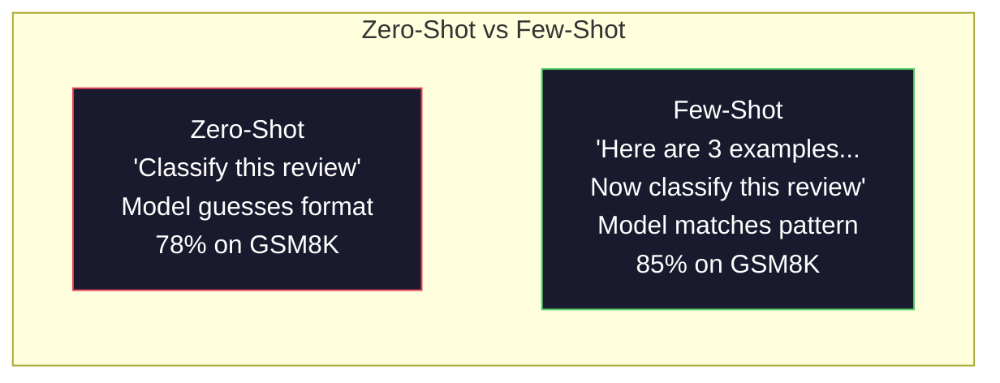
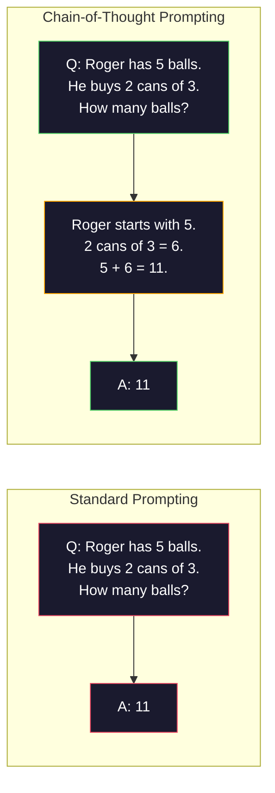
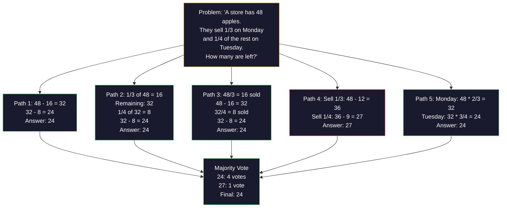
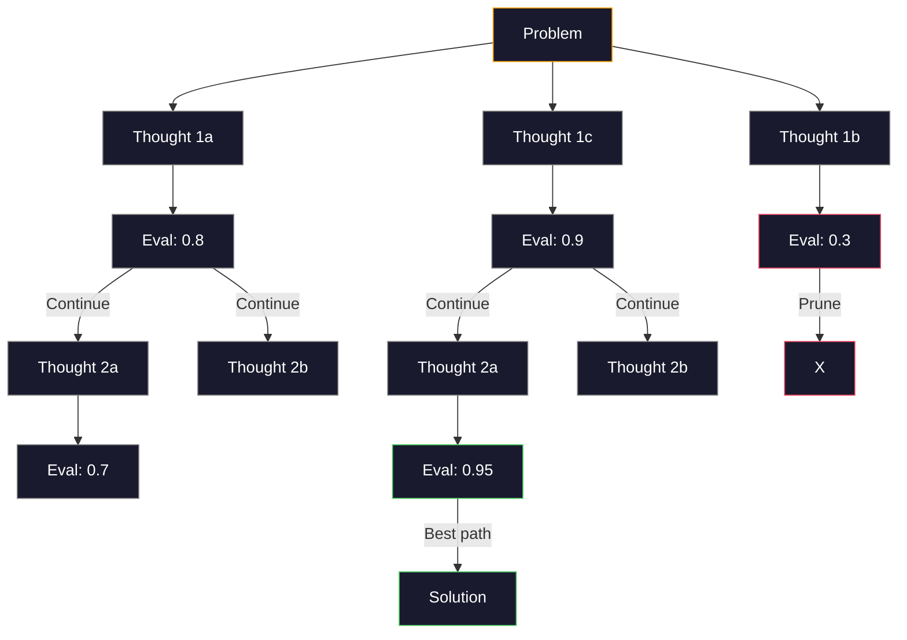
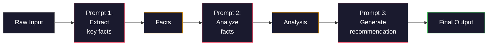

# 少样本, 思维链, 思维树

> 告诉模型该做什么是提示。展示它如何思考是工程。在相同模型、相同任务、相同数据上，从78%到91%准确率的差距并不是更好的模型。而是更好的推理策略。

**类型:** 构建
**语言:** Python
**先修:** 第11.01课（提示工程）
**时间:** 约45分钟

## 学习目标

- 通过选择和格式化示例演示来实现少样本提示，从而最大化任务准确率
- 应用思维链(Chain-of-Thought, CoT)推理来提高多步骤问题（如数学应用题）的准确率
- 构建一个思维树(Tree-of-Thought)提示，探索多条推理路径并选择最佳路径
- 在标准基准上测量零样本(Zero-Shot)与少样本(Few-Shot)与思维链(CoT)之间的准确率提升

## 问题

你构建了一个数学辅导应用。你的提示写着：“解这道应用题。”GPT-5在GSM8K（标准小学数学基准）上的正确率为94%。你认为自己已经达到顶峰。其实并没有——思维链仍然可以增加3到4个百分点。

加上五个字——“让我们一步步思考”——准确率跃升至91%。加上几个已解决的问题示例，准确率达到95%。相同模型，相同温度，相同API成本。唯一的区别是你给了模型一张草稿纸。

这不是一个技巧。这就是推理的工作原理。人类不会在一次心理跳跃中解决多步骤问题。变压器模型也不会。当你强制模型生成中间令牌时，这些令牌成为下一个令牌上下文的一部分。每个推理步骤为下一步提供输入。模型实际上是通过计算一步步得出答案的。

但“一步步思考”只是开始，不是结束。如果你采样五条推理路径并进行多数投票会怎样？如果你让模型探索一棵可能性树，评估并修剪分支会怎样？如果你将推理与工具使用交错进行会怎样？这些不是假设。它们是已发表并且有实测改进的技术，你将在本节课中构建所有这些技术。

## 核心概念

### 零样本与少样本：何时示例胜过指令

零样本提示只给模型一个任务，没有其他信息。少样本提示先给模型示例。

Wei等人(2022)在8个基准上测量了这一点。对于情感分类等简单任务，零样本和少样本的性能相差在2%以内。对于多步骤算术和符号推理等复杂任务，少样本将准确率提高了10%到25%。

直观理解：示例是压缩后的指令。你不需要描述输出格式，而是展示它。不需要解释推理过程，而是演示它。模型在示例上模式匹配比解释抽象指令更可靠。



**少样本胜出时：** 格式敏感任务、分类、结构化提取、领域特定术语、任何模型需要匹配特定模式的任务。

**零样本胜出时：** 简单事实性问题、示例会限制创造力的创造性任务、寻找好示例比编写好指令更困难的任务。

### 示例选择：相似性胜过随机性

并非所有示例都是平等的。选择与目标输入相似的示例在分类任务上比随机选择好5%到15%（Liu等人，2022）。三个原则：

1. **语义相似性**：选择嵌入空间中与输入最接近的示例
2. **标签多样性**：涵盖示例中所有输出类别
3. **难度匹配**：匹配目标问题的复杂程度

大多数任务的最佳示例数量是3到5个。少于3个，模型没有足够的信号来提取模式。多于5个，你会遇到收益递减并浪费上下文窗口标记。对于多标签分类，每个标签使用一个示例。

### 思维链：给模型提供草稿纸

思维链(Chain-of-Thought, CoT)提示由Google Brain的Wei等人(2022)提出。想法很简单：不只要求模型给出答案，还要它先展示推理步骤。



为什么这在机制上有效？变压器模型生成的每个令牌都成为下一个令牌的上下文。没有CoT，模型必须将所有推理压缩到单次前向传递的隐藏状态中。有了CoT，模型将中间计算外部化为令牌。每个推理令牌扩展了有效计算深度。

**GSM8K基准（小学数学，8.5K个问题）：**

|  模型  |  零样本  |  零样本CoT  |  少样本CoT  |
|-------|-----------|---------------|--------------|
|  GPT-4o  |  78%  |  91%  |  95%  |
|  GPT-5  |  94%  |  97%  |  98%  |
|  o4-mini (reasoning)  |  97%  |  —  |  —  |
|  Claude Opus 4.7  |  93%  |  97%  |  98%  |
|  Gemini 3 Pro  |  92%  |  96%  |  98%  |
|  Llama 4 70B  |  80%  |  89%  |  94%  |
|  DeepSeek-V3.1  |  89%  |  94%  |  96%  |

**关于推理模型的说明。** 像OpenAI的o系列（o3、o4-mini）和DeepSeek-R1这样的模型在输出答案之前会内部运行思维链。对推理模型添加“让我们一步步思考”是多余的，有时甚至适得其反——它们已经这么做了。

两种CoT风格：

**零样本CoT**：在提示中追加“让我们一步步思考”。不需要示例。Kojima等人（2022）表明，这一句话就能提高算术、常识和符号推理任务的准确性。

**少样本CoT**：提供包含推理步骤的示例。比零样本CoT更有效，因为模型看到了你期望的精确推理格式。

**CoT可能有害的情况**：简单的事实回忆（“法国首都是哪里？”）、单步分类、速度比准确性更重要的任务。CoT每次查询会增加50-200个token的推理开销。对于高吞吐量、低复杂度的任务，这浪费了成本。

### 自我一致性：多次采样，一次投票

Wang等人（2023）引入了自我一致性。其洞见是：单一的CoT路径可能包含推理错误。但如果你采样N条独立的推理路径（使用temperature > 0），并对最终答案进行多数投票，错误就会相互抵消。



在原始PaLM 540B实验中，自我一致性将GSM8K准确性从56.5%（单一CoT）提高到N=40时的74.4%。在GPT-5上，改进很小（从97%到98%），因为基础准确性已经饱和。该技术最适用于基础CoT准确性在60-85%的模型——这是单路径错误频繁但非系统性的最佳点。对于推理模型（o系列、R1），自我一致性已被内置的内部采样所取代。

权衡：N次采样意味着N倍的API成本和延迟。在实践中，N=5能获得大部分收益。N=3是有效投票的最低要求。对于大多数任务，N>10的收益递减。

### 思维树：分支探索

Yao等人（2023）引入了思维树（Tree-of-Thought, ToT）。CoT遵循一条线性推理路径，而ToT则探索多个分支，并评估哪些分支最有希望，然后再继续。



ToT包含三个组成部分：

1. **思维生成**：生成多个候选下一步
2. **状态评估**：对每个候选进行评分（可以使用LLM本身作为评估器）
3. **搜索算法**：通过树进行广度优先搜索或深度优先搜索，剪枝低分分支

在24点游戏任务（用算术组合4个数字得到24）中，使用标准提示的GPT-4解决了7.3%的问题。使用CoT时，4.0%（CoT在这里实际上有害，因为搜索空间很大）。使用ToT时，74%。

ToT成本高昂。树中的每个节点都需要一次LLM调用。分支因子为3、深度为3的树最多需要39次LLM调用。仅用于搜索空间大但可评估的问题——规划、谜题求解、带约束的创意问题解决。

### ReAct：思考 + 行动

Yao等人（2022）将推理痕迹与行动结合起来。模型在思考（生成推理）和行动（调用工具、搜索、计算）之间交替。

```mermaid
graph LR
    Q["Question:\nWhat is the\npopulation of the\ncountry where\nthe Eiffel Tower\nis located?"]
    T1["Thought: I need to\nfind which country\nhas the Eiffel Tower"]
    A1["Action: search\n'Eiffel Tower location'"]
    O1["Observation:\nParis, France"]
    T2["Thought: Now I need\nFrance's population"]
    A2["Action: search\n'France population 2024'"]
    O2["Observation:\n68.4 million"]
    T3["Thought: I have\nthe answer"]
    F["Answer:\n68.4 million"]

    Q --> T1 --> A1 --> O1 --> T2 --> A2 --> O2 --> T3 --> F

    style Q fill:#1a1a2e,stroke:#ffa500,color:#fff
    style T1 fill:#1a1a2e,stroke:#51cf66,color:#fff
    style A1 fill:#1a1a2e,stroke:#e94560,color:#fff
    style O1 fill:#1a1a2e,stroke:#808080,color:#fff
    style T2 fill:#1a1a2e,stroke:#51cf66,color:#fff
    style A2 fill:#1a1a2e,stroke:#e94560,color:#fff
    style O2 fill:#1a1a2e,stroke:#808080,color:#fff
    style T3 fill:#1a1a2e,stroke:#51cf66,color:#fff
    style F fill:#1a1a2e,stroke:#51cf66,color:#fff
```



在知识密集型任务上，ReAct优于纯CoT，因为它可以将推理建立在真实数据上。在HotpotQA（多跳问答）上，使用GPT-4的ReAct实现了35.1%的精确匹配，而单独的CoT为29.4%。真正的优势在于推理错误可以通过观察得到纠正——模型可以在执行过程中更新其计划。

ReAct是现代AI代理的基础。每个代理框架（LangChain、CrewAI、AutoGen）都实现了某种变体的“思考-行动-观察”循环。你将在第14阶段构建完整的代理。本课涵盖提示模式。

### 结构化提示：XML标签、分隔符、标题

随着提示变得复杂，结构可以防止模型混淆不同部分。三种方法：

**XML标签**（在Claude上效果最好，其他模型也稳定）：
```
<context>
You are reviewing a pull request.
The codebase uses TypeScript and React.
</context>

<task>
Review the following diff for bugs, security issues, and style violations.
</task>

<diff>
{diff_content}
</diff>

<output_format>
List each issue with: file, line, severity (critical/warning/info), description.
</output_format>
```

**Markdown标题**（通用）：
```
## Role
Senior security engineer at a fintech company.

## Task
Analyze this API endpoint for vulnerabilities.

## Input
{api_code}

## Rules
- Focus on OWASP Top 10
- Rate each finding: critical, high, medium, low
- Include remediation steps
```

**分隔符**（简单但有效）：
```
---INPUT---
{user_text}
---END INPUT---

---INSTRUCTIONS---
Summarize the above in 3 bullet points.
---END INSTRUCTIONS---
```

### 提示链：顺序分解

有些任务对于单个提示来说过于复杂。提示链将它们分解为多个步骤，其中一个提示的输出成为下一个提示的输入。



链式提示优于单一提示的原因有三个：

1. **每一步更简单**：模型处理一个聚焦的任务，而不是同时处理所有事情
2. **中间输出可检查**：你可以在步骤之间验证和纠正
3. **不同步骤可以使用不同模型**：使用廉价模型进行提取，使用昂贵模型进行推理

### 性能对比

|  技术  |  最佳适用场景  |  GSM8K准确率（GPT-5）  |  API调用次数  |  Token开销  |  复杂度  |
|-----------|----------|------------------------|-----------|----------------|------------|
| 零样本 | 简单任务 | 94% | 1 | 无 | 简单 |
| 少样本 | 格式匹配 | 96% | 1 | 200-500 tokens | 低 |
| 零样本思维链 | 快速推理提升 | 97% | 1 | 50-200 tokens | 简单 |
| 少样本思维链 | 最高单次调用准确率 | 98% | 1 | 300-600 tokens | 低 |
| 自洽性（N=5）||| 高风险推理 | 98.5% | 5 | 5x token cost | 中等 |  |
| 推理模型（o4-mini）||| 替换式思维链 | 97% | 1 | 隐藏（内部2-10倍）||| 简单 |  |  |
| 思维树 | 搜索/规划问题 | 无（24点游戏上74%）||| 10-40+ | 10-40x token cost | 高 |  |
| ReAct | 基于知识的推理 | 无（HotpotQA上35.1%）||| 3-10+ | 可变 | 高 |  |
| 提示链 | 复杂多步骤任务 | 96%（流水线）||| 2-5 | 2-5x token cost | 中等 |  |

正确的技术取决于三个因素：准确率要求、延迟预算和成本容忍度。对于大多数生产系统，少样本思维链配合3样本自洽性回退覆盖了90%的使用场景。

## 动手构建

我们将构建一个数学问题求解器，将少样本提示、思维链推理和自洽性投票整合到一条流水线中。然后，我们将为困难问题添加思维树。

完整实现在 `code/advanced_prompting.py` 中。以下是关键组件。

### 步骤1：少样本示例库

第一个组件管理少样本示例，并为给定问题选择最相关的示例。

```python
GSM8K_EXAMPLES = [
    {
        "question": "Janet's ducks lay 16 eggs per day. She eats three for breakfast every morning and bakes muffins for her friends every day with four. She sells every egg at the farmers' market for $2. How much does she make every day at the farmers' market?",
        "reasoning": "Janet's ducks lay 16 eggs per day. She eats 3 and bakes 4, using 3 + 4 = 7 eggs. So she has 16 - 7 = 9 eggs left. She sells each for $2, so she makes 9 * 2 = $18 per day.",
        "answer": "18"
    },
    ...
]
```

每个示例包含三部分：问题、推理链和最终答案。推理链将普通的少样本示例转化为思维链少样本示例。

### 步骤2：思维链提示构建器

提示构建器将系统消息、带推理链的少样本示例以及目标问题组合成单个提示。

```python
def build_cot_prompt(question, examples, num_examples=3):
    system = (
        "You are a math problem solver. "
        "For each problem, show your step-by-step reasoning, "
        "then give the final numerical answer on the last line "
        "in the format: 'The answer is [number]'."
    )

    example_text = ""
    for ex in examples[:num_examples]:
        example_text += f"Q: {ex['question']}\n"
        example_text += f"A: {ex['reasoning']} The answer is {ex['answer']}.\n\n"

    user = f"{example_text}Q: {question}\nA:"
    return system, user
```

格式约束（"The answer is [number]"）至关重要。没有它，自洽性将无法提取和比较不同样本的答案。

### 步骤3：自洽性投票

采样N条推理路径，取多数答案。

```python
def self_consistency_solve(question, examples, client, model, n_samples=5):
    system, user = build_cot_prompt(question, examples)

    answers = []
    reasonings = []
    for _ in range(n_samples):
        response = client.chat.completions.create(
            model=model,
            messages=[
                {"role": "system", "content": system},
                {"role": "user", "content": user}
            ],
            temperature=0.7
        )
        text = response.choices[0].message.content
        reasonings.append(text)
        answer = extract_answer(text)
        if answer is not None:
            answers.append(answer)

    vote_counts = Counter(answers)
    best_answer = vote_counts.most_common(1)[0][0] if vote_counts else None
    confidence = vote_counts[best_answer] / len(answers) if best_answer else 0

    return best_answer, confidence, reasonings, vote_counts
```

温度参数0.7很重要。温度为0.0时，所有N个样本将完全相同，从而失去意义。你需要足够的随机性来产生多样化的推理路径，但又不能太多以免模型胡言乱语。

### 步骤4：思维树求解器

对于线性推理失败的问题，思维树探索多种方法，并评估哪个方向最有前景。

```python
def tree_of_thought_solve(question, client, model, breadth=3, depth=3):
    thoughts = generate_initial_thoughts(question, client, model, breadth)
    scored = [(t, evaluate_thought(t, question, client, model)) for t in thoughts]
    scored.sort(key=lambda x: x[1], reverse=True)

    for current_depth in range(1, depth):
        next_thoughts = []
        for thought, score in scored[:2]:
            extensions = extend_thought(thought, question, client, model, breadth)
            for ext in extensions:
                ext_score = evaluate_thought(ext, question, client, model)
                next_thoughts.append((ext, ext_score))
        scored = sorted(next_thoughts, key=lambda x: x[1], reverse=True)

    best_thought = scored[0][0] if scored else ""
    return extract_answer(best_thought), best_thought
```

评估器本身是一次LLM调用。你问模型："On a scale of 0.0 to 1.0, how promising is this reasoning path for solving the problem?" 这是思维树的关键见解——模型评估自己的部分解决方案。

### 步骤5：完整流水线

该流水线将所有技术与升级策略相结合。

```python
def solve_with_escalation(question, examples, client, model):
    system, user = build_cot_prompt(question, examples)
    single_response = call_llm(client, model, system, user, temperature=0.0)
    single_answer = extract_answer(single_response)

    sc_answer, confidence, _, _ = self_consistency_solve(
        question, examples, client, model, n_samples=5
    )

    if confidence >= 0.8:
        return sc_answer, "self_consistency", confidence

    tot_answer, _ = tree_of_thought_solve(question, client, model)
    return tot_answer, "tree_of_thought", None
```

升级逻辑：先尝试低成本（单次思维链）。如果自洽性置信度低于0.8（5个样本中少于4个一致），则升级到思维树。这在成本与准确率之间取得平衡——大多数问题以低成本解决，困难问题获得更多计算。

## 使用它

### 使用 LangChain

LangChain 提供了对提示模板和输出解析的内置支持，简化了少样本和思维链模式：

```python
from langchain_core.prompts import FewShotPromptTemplate, PromptTemplate
from langchain_openai import ChatOpenAI

example_prompt = PromptTemplate(
    input_variables=["question", "reasoning", "answer"],
    template="Q: {question}\nA: {reasoning} The answer is {answer}."
)

few_shot_prompt = FewShotPromptTemplate(
    examples=examples,
    example_prompt=example_prompt,
    suffix="Q: {input}\nA: Let's think step by step.",
    input_variables=["input"]
)

llm = ChatOpenAI(model="gpt-4o", temperature=0.7)
chain = few_shot_prompt | llm
result = chain.invoke({"input": "If a train travels 120 km in 2 hours..."})
```

LangChain 还有用于语义相似性选择的 `ExampleSelector` 类：

```python
from langchain_core.example_selectors import SemanticSimilarityExampleSelector
from langchain_openai import OpenAIEmbeddings

selector = SemanticSimilarityExampleSelector.from_examples(
    examples,
    OpenAIEmbeddings(),
    k=3
)
```

### 使用DSPy

DSPy将提示策略视为可优化的模块。无需手动设计思维链(Chain-of-Thought, CoT)提示，只需定义签名(Signature)，让DSPy优化提示：

```python
import dspy

dspy.configure(lm=dspy.LM("openai/gpt-4o", temperature=0.7))

class MathSolver(dspy.Module):
    def __init__(self):
        self.solve = dspy.ChainOfThought("question -> answer")

    def forward(self, question):
        return self.solve(question=question)

solver = MathSolver()
result = solver(question="Janet's ducks lay 16 eggs per day...")
```

DSPy的`ChainOfThought`自动添加推理轨迹。`dspy.majority`实现了自一致性(Self-Consistency)：

```python
result = dspy.majority(
    [solver(question=q) for _ in range(5)],
    field="answer"
)
```

### 对比：从头实现 vs 框架

|  特性  |  从头实现（本课）  |  LangChain  |  DSPy  |
|---------|--------------------------|-----------|------|
|  对提示格式的控制  |  完全  |  基于模板  |  自动  |
|  自一致性  |  手动投票  |  手动  |  内置 (`dspy.majority`)  |
|  示例选择  |  自定义逻辑  |  `ExampleSelector`  |  `dspy.BootstrapFewShot`  |
|  思维树(Tree-of-Thought)  |  自定义树搜索  |  社区链  |  未内置  |
|  提示优化  |  手动迭代  |  手动  |  自动编译  |
|  最适合  |  学习、自定义流水线  |  标准工作流  |  研究、优化  |

## 发布

本课产出两个成品。

**1. 推理链提示** (`outputs/prompt-reasoning-chain.md`)：一个生产级提示模板，用于少样本思维链(Few-Shot CoT)与自一致性。插入你的示例和问题领域即可使用。

**2. 思维链模式选择技巧** (`outputs/skill-cot-patterns.md`)：一个决策框架，用于根据任务类型、准确率要求和成本约束选择正确的推理技术。

## 练习

1. **测量差距**：选取10个GSM8K问题。分别用零样本、少样本、零样本思维链、少样本思维链求解。记录每种方法的准确率。哪种技术对你的模型提升最大？

2. **示例选择实验**：对同样的10个问题，比较随机选择示例与手动挑选相似示例。测量准确率差异。在什么情况下，示例质量比数量更重要？

3. **自一致性成本曲线**：对20个GSM8K问题，分别以N=1,3,5,7,10运行自一致性。绘制准确率 vs 成本（总词元数(Total Tokens)）曲线。你的模型的曲率拐点在哪里？

4. **构建ReAct循环**：用计算器工具扩展流水线。当模型生成数学表达式时，使用Python的`eval()`（在沙箱中）执行，并将结果反馈给模型。测量基于工具的推理是否优于纯思维链。

5. **用于创意任务的思维树**：将思维树求解器适配到一个创意写作任务：“写一个6词故事，既有趣又悲伤。”使用LLM作为评估器。分支探索是否比单次生成产生更好的创意输出？

## 关键术语

|  术语  |  人们的说法  |  实际含义  |
|------|----------------|----------------------|
|  少样本提示(Few-shot prompting)  |  “给一些例子”  |  在提示中包含输入-输出示例，以固定模型的输出格式和行为  |
|  思维链(Chain-of-Thought)  |  “让它一步步思考”  |  引导模型在生成最终答案前产生中间推理词元(Reasoning Tokens)，以扩展有效计算  |
|  自一致性(Self-Consistency)  |  “运行多次”  |  在温度>0时采样N条不同推理路径，通过多数投票选择最常出现的最终答案  |
|  思维树(Tree-of-Thought)  |  “让它探索选项”  |  对推理分支进行结构化搜索，评估每个部分解，只扩展有希望的路径  |
|  ReAct  |  “思考+工具使用”  |  在“思考-行动-观察”循环中，将推理轨迹与外部行动（搜索、计算、API调用）交织  |
|  提示链(Prompt chaining)  |  “分解成步骤”  |  将复杂任务分解为顺序提示，每个输出作为下一个输入  |
|  零样本思维链(Zero-shot CoT)  |  “只需加上‘一步步思考’”  |  在提示后附加推理触发短语，无需任何示例，依赖模型的潜在推理能力  |

## 延伸阅读

- [Chain-of-Thought Prompting Elicits Reasoning in Large Language Models](https://arxiv.org/abs/2201.11903) -- Wei et al. 2022. 原始思维链论文，来自Google Brain。阅读第2-3节以获取核心结果。
- [Chain-of-Thought Prompting Elicits Reasoning in Large Language Models](https://arxiv.org/abs/2201.11903) -- Wang et al. 2023. 自一致性论文。表1包含了所有需要的数值。
- [Chain-of-Thought Prompting Elicits Reasoning in Large Language Models](https://arxiv.org/abs/2201.11903) -- Yao et al. 2023. 思维树论文。第4节中的“24点”游戏结果是亮点。
- [Chain-of-Thought Prompting Elicits Reasoning in Large Language Models](https://arxiv.org/abs/2201.11903) -- Yao et al. 2022. 现代AI智能体的基础。第3节解释了思考-行动-观察循环。
- [Chain-of-Thought Prompting Elicits Reasoning in Large Language Models](https://arxiv.org/abs/2201.11903) -- Kojima et al. 2022. “让我们一步步思考”论文。如此简单却出奇有效。
- [Chain-of-Thought Prompting Elicits Reasoning in Large Language Models](https://arxiv.org/abs/2201.11903) -- Khattab et al. 2023. 将提示视为编译问题。如果你想超越手动提示工程，请阅读。
- [Chain-of-Thought Prompting Elicits Reasoning in Large Language Models](https://arxiv.org/abs/2201.11903) -- 供应商关于思维链何时变为内部按词元计价的“推理”模式与提示级技巧的指导。
- [Chain-of-Thought Prompting Elicits Reasoning in Large Language Models](https://arxiv.org/abs/2201.11903) -- 过程奖励模型(Process Reward Model, PRM)，对思维链的每一步进行评分；这是超越结果奖励的推理监督信号。
- [Chain-of-Thought Prompting Elicits Reasoning in Large Language Models](https://arxiv.org/abs/2201.11903) -- 对思维链长度、自一致性采样和蒙特卡洛树搜索(MCTS)的系统研究；当准确率比延迟更重要时，“一步步思考”会走向何方。
