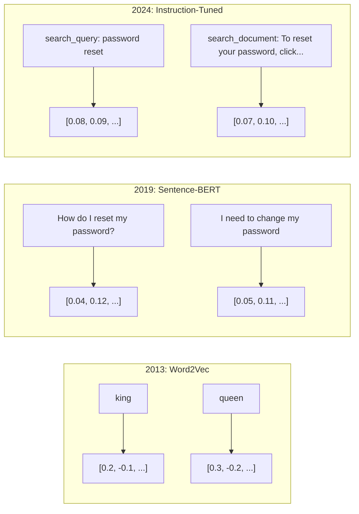
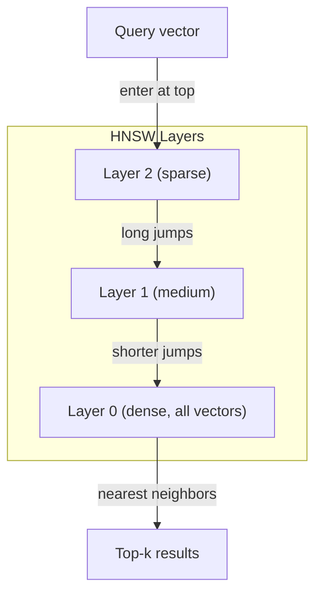

# 嵌入(Embeddings)与向量表示(Vector Representations)

> 文本是离散的，而数学是连续的。每当你让大语言模型(LLM)查找“相似”文档、比较含义或进行超越关键词的搜索时，你都在依赖连接这两个世界的桥梁。这座桥梁就是嵌入(Embedding)。如果你不理解嵌入，你就不理解现代人工智能(AI)。你只是在使用它。

**类型：** 构建
**语言：** Python
**前置要求：** 阶段11，第01课（提示工程(Prompt Engineering)）
**时间：** ~75分钟
**相关：** 阶段5·22（嵌入模型深入探讨(Embedding Models Deep Dive)）涵盖了密集(dense)与稀疏(sparse)以及多向量(multi-vector)、马特罗什卡截断(Matryoshka truncation)以及每轴模型选择。本课关注生产流水线（向量数据库(vector DBs)、HNSW、相似度计算）。在选择模型前请先阅读阶段5·22。

## 学习目标

- 使用API提供商和开源模型生成文本嵌入(Text Embeddings)，并计算它们之间的余弦相似度(Cosine Similarity)
- 解释为什么嵌入能够解决关键词搜索无法处理的词汇不匹配问题
- 构建一个按语义而非精确关键词匹配检索文档的语义搜索索引
- 使用检索基准（精确率@k(precision@k)、召回率(recall)）评估嵌入质量，并为你的任务选择合适的嵌入模型。

## 问题

你有10,000张支持工单。一位客户写道“my payment didn't go through.”你需要找到类似的过往工单。关键词搜索会找到包含“payment”和“didn't go through”的工单，但会漏掉“transaction failed”、“charge was declined”和“billing error”。这些工单用完全不同的词语描述了完全相同的问题。

这就是词汇不匹配问题。人类语言有几十种方式来表达同一件事。关键词搜索将每个词视为没有意义的独立符号，它无法知道“declined”和“didn't go through”指的是同一个概念。

你需要一种文本表示，其中相似性由含义而非拼写决定。你需要一种方法，将“my payment didn't go through”和“transaction was declined”在某个数学空间中紧密放置在一起，同时将“my payment arrived on time”推远，尽管它们共享单词“payment”。

这种表示就是嵌入(Embedding)。

## 核心概念

### 什么是嵌入(Embedding)？

嵌入是一个由浮点数组成的密集向量，表示文本的含义。“密集(dense)”这个词很重要——每个维度都携带信息，而稀疏表示（词袋(Bag-of-Words)、TF-IDF）中大部分维度为零。

“The cat sat on the mat”变成类似`[0.023, -0.041, 0.087, ..., 0.012]`的东西——根据模型不同，包含768到3072个数字的列表。这些数字编码了含义。你从不直接检查它们，而是比较它们。

### Word2Vec的突破

2013年，托马斯·米科洛夫(Tomas Mikolov)及其在谷歌的同事发表了Word2Vec。核心思想：训练一个神经网络，根据一个词的上下文预测该词（或根据一个词预测其上下文），隐藏层的权重就变成了有意义的向量表示。

著名结果：

```
king - man + woman = queen
```

词嵌入(Word Embeddings)上的向量算术能够捕捉语义关系。从“man”到“woman”的方向大致与从“king”到“queen”的方向相同。这一刻，领域意识到几何可以编码意义。

Word2Vec生成300维的向量。每个词无论上下文都得到一个向量。“river bank”中的“bank”和“bank account”中的“bank”具有相同的嵌入。这个限制推动了接下来十年的研究。

### 从词到句子

词嵌入表示单个词元(Token)。生产系统需要嵌入整个句子、段落或文档。出现了四种方法：

**平均(Averaging)**：取句子中所有词向量的均值。廉价、有损、对于短文本效果出奇地好。完全丢失词序——"dog bites man"和"man bites dog"得到相同的嵌入。

**CLS词元(token)**：Transformer模型(BERT, 2018)输出一个特殊的[CLS]词元嵌入，代表整个输入。优于平均，但[CLS]词元是为下一句预测(Next-Sentence Prediction)训练的，而非相似度。

**对比学习(Contrastive Learning)**：显式训练模型将相似对拉近，不相似对推远。Sentence-BERT (Reimers & Gurevych, 2019) 使用了这种方法，并成为现代嵌入模型的基础。给定“How do I reset my password?”和“I need to change my password”，模型学习到它们应该有几乎相同的向量。

**指令微调嵌入(Instruction-tuned Embeddings)**：最新方法。像E5和GTE这样的模型接受一个任务前缀（“search_query:”、“search_document:”），告诉模型生成哪种嵌入。这使得一个模型可以服务多个任务。



### 现代嵌入模型

市场已经稳定在少数几个生产级选项上（截至2026年初的MTEB评分，MTEB v2）：

|  模型  |  提供商  |  维度  |  MTEB  |  上下文  |  每百万词元成本  |
|-------|----------|-----------|------|---------|------------------|
|  Gemini Embedding 2  |  Google  |  3072 (Matryoshka)  |  67.7 (检索)  |  8192  |  $0.15  |
|  embed-v4  |  Cohere  |  1024 (Matryoshka)  |  65.2  |  128K  |  $0.12  |
|  voyage-4  |  Voyage AI  |  1024/2048 (Matryoshka)  |  66.8  |  32K  |  $0.12  |
|  text-embedding-3-large  |  OpenAI  |  3072 (Matryoshka)  |  64.6  |  8192  |  $0.13  |
|  text-embedding-3-small  |  OpenAI  |  1536 (Matryoshka)  |  62.3  |  8192  |  $0.02  |
|  BGE-M3  |  BAAI  |  1024 (稠密+稀疏+ColBERT)  |  63.0 多语言  |  8192  |  开放权重  |
|  Qwen3-Embedding  |  阿里巴巴  |  4096 (套娃 Matryoshka)  |  66.9  |  32K  |  开放权重  |
|  Nomic-embed-v2  |  Nomic  |  768 (套娃 Matryoshka)  |  63.1  |  8192  |  开放权重  |

MTEB（大规模文本嵌入基准测试）v2涵盖检索(Retrieval)、分类(Classification)、聚类(Clustering)、重排序(Reranking)和摘要(Summarization)等100多项任务。分数越高越好。到2026年，开放权重模型（Qwen3-Embedding、BGE-M3）在大多数指标上达到或超越封闭托管模型。Gemini Embedding 2在纯检索方面领先；Voyage/Cohere在特定领域（金融、法律、代码）领先。在投入生产前，务必用你自己的查询进行基准测试。

### 相似性度量

给定两个嵌入向量，有三种方式衡量它们的相似程度：

**余弦相似度(Cosine similarity)**：两个向量夹角的余弦值。范围从-1（相反）到1（方向相同）。忽略幅度——一个10词的句子和一个500词的文档如果方向相同，得分可以是1.0。这是90%用例的默认选择。

```
cosine_sim(a, b) = dot(a, b) / (||a|| * ||b||)
```

**点积(Dot product)**：两个向量的原始内积。当向量被归一化（单位长度）时，与余弦相似度相同。计算更快。OpenAI的嵌入已归一化，因此点积和余弦给出相同的排序。

```
dot(a, b) = sum(a_i * b_i)
```

**欧氏距离(Euclidean (L2) distance)**：向量空间中的直线距离。越小越相似。对幅度差异敏感。当空间中的绝对位置重要时使用，而不仅仅是方向。

```
L2(a, b) = sqrt(sum((a_i - b_i)^2))
```

何时使用哪种：

|  度量  |  使用时  |  避免时  |
|--------|----------|------------|
|  余弦相似度  |  比较不同长度的文本；大多数检索任务  |  幅度携带信息  |
|  点积  |  嵌入已归一化；追求最大速度  |  向量幅度变化  |
|  欧氏距离  |  聚类；空间最近邻问题  |  比较长度差异巨大的文档  |

### 向量数据库与HNSW

暴力相似性搜索将查询与每个存储的向量进行比较。对于100万个1536维向量，每次查询需要进行15亿次乘加运算。太慢了。

向量数据库通过近似最近邻(ANN)算法解决这个问题。主导算法是HNSW（分层可导航小世界）：

1. 构建一个多层向量图
2. 顶层稀疏——远距离集群之间的长程连接
3. 底层密集——邻近向量之间的细粒度连接
4. 搜索从顶层开始，贪婪地向下细化
5. 以O(log n)而非O(n)的时间返回近似top-k结果

HNSW用微小的精度损失（通常95-99%召回率）换取巨大的速度提升。对于1000万个向量，暴力搜索需要数秒，HNSW只需毫秒。



生产选项：

|  数据库  |  类型  |  最佳用途  |  最大规模  |
|----------|------|----------|-----------|
|  Pinecone  |  托管SaaS  |  零运维生产  |  十亿级  |
|  Weaviate  |  开源  |  自托管，混合搜索  |  1亿+  |
|  Qdrant  |  开源  |  高性能，过滤  |  1亿+  |
|  ChromaDB  |  嵌入式  |  原型开发，本地开发  |  100万  |
|  pgvector  |  Postgres扩展  |  已在使用Postgres  |  1000万  |
|  FAISS  |  库  |  进程内，研究  |  10亿+  |

### 分块策略

文档太长了，无法作为单个向量嵌入。一份50页的PDF涵盖了几十个主题——它的嵌入变成了所有内容的平均值，与任何具体内容都不相似。你需要将文档拆分为块，然后分别嵌入每个块。

**固定大小分块(Fixed-size chunking)**：每N个令牌分割一次，重叠M个令牌。简单且可预测。当文档没有清晰结构时效果良好。一个512令牌的块，重叠50令牌：块1是令牌0-511，块2是令牌462-973。

**基于句子的分块(Sentence-based chunking)**：在句子边界处分割，将句子分组，直到达到令牌限制。每个块(chunk)至少是一个完整的句子。优于固定大小，因为你永远不会把一个想法切成两半。

**递归分块(Recursive chunking)**：首先尝试在最大的边界处分割（章节标题）。如果仍然太大，尝试段落边界。然后是句子边界。然后是字符限制。这是LangChain的`RecursiveCharacterTextSplitter`，适用于混合格式语料库。

**语义分块(Semantic chunking)**：嵌入(embed)每个句子，然后将嵌入(embedding)相似的连续句子分组。当嵌入相似度低于阈值时，开始新的块(chunk)。代价高（需要单独嵌入每个句子），但产生最连贯的块。

|  策略  |  复杂度  |  质量  |  最佳适用场景  |
|----------|-----------|---------|----------|
|  固定大小  |  低  |  尚可  |  非结构化文本、日志  |
|  基于句子  |  低  |  良好  |  文章、电子邮件  |
|  递归  |  中  |  良好  |  Markdown、HTML、混合文档  |
|  语义  |  高  |  最佳  |  关键检索质量  |

大多数系统的最佳点：256-512个令牌块，重叠50个令牌。

### 双编码器(Bi-Encoders) vs 交叉编码器(Cross-Encoders)

双编码器(bi-encoder)独立嵌入查询和文档，然后比较向量。快速——你嵌入一次查询，然后与预先计算的文档嵌入进行比较。这就是你用于检索的方法。

交叉编码器(cross-encoder)将查询和文档作为单个输入，输出相关性分数。慢——它通过完整模型处理每个查询-文档对。但准确度高得多，因为它可以同时关注查询和文档令牌。

生产模式：双编码器检索前100个候选，交叉编码器将它们重新排序到前10个。这就是检索-然后-重排序(retrieve-then-rerank)流程。


重排序模型：Cohere Rerank 3.5（每1000次查询2美元），BGE-reranker-v2（免费，开源），Jina Reranker v2（免费，开源）。

### 套娃嵌入(Matryoshka Embeddings)

传统嵌入是全有或全无的。一个1536维的向量使用1536个浮点数。你不能在没有重新训练的情况下截断到256维。

套娃表示学习(Matryoshka Representation Learning)（Kusupati等人，2022年）解决了这个问题。模型被训练成使得前N个维度捕获最重要的信息，就像一个俄罗斯套娃。将一个1536维的套娃嵌入截断到256维会丢失一些精度，但仍然可用。

OpenAI的text-embedding-3-small和text-embedding-3-large通过`dimensions`参数支持套娃截断。请求256维而不是1536维可以将存储减少6倍，在MTEB基准测试上大约有3-5%的精度损失。

### 二值量化(Binary Quantization)

一个以float32存储的1536维嵌入占用6,144个字节。乘以1000万个文档：仅向量就61GB。

二值量化将每个浮点数转换为单个位：正值变为1，负值变为0。存储从6,144字节下降到192字节——减少了32倍。相似度使用汉明距离(Hamming distance)计算（统计不同位的数量），CPU可以在一条指令内完成。

在检索召回率上精度损失约为5-10%。常见模式：对数百万向量进行第一次搜索使用二值量化，然后用全精度向量对前1000个重新评分。这样在减少32倍内存的情况下获得全精度95%以上的精度。

```figure
cosine-similarity
```

## 动手构建

我们从零开始构建一个语义搜索引擎。没有向量数据库。没有外部嵌入API。纯Python，使用numpy进行数学计算。

### 步骤1：文本分块(Text Chunking)

```python
def chunk_text(text, chunk_size=200, overlap=50):
    words = text.split()
    chunks = []
    start = 0
    while start < len(words):
        end = start + chunk_size
        chunk = " ".join(words[start:end])
        chunks.append(chunk)
        start += chunk_size - overlap
    return chunks


def chunk_by_sentences(text, max_chunk_tokens=200):
    sentences = text.replace("\n", " ").split(".")
    sentences = [s.strip() + "." for s in sentences if s.strip()]
    chunks = []
    current_chunk = []
    current_length = 0
    for sentence in sentences:
        sentence_length = len(sentence.split())
        if current_length + sentence_length > max_chunk_tokens and current_chunk:
            chunks.append(" ".join(current_chunk))
            current_chunk = []
            current_length = 0
        current_chunk.append(sentence)
        current_length += sentence_length
    if current_chunk:
        chunks.append(" ".join(current_chunk))
    return chunks
```

### 步骤2：从头构建嵌入(Embeddings)

我们使用TF-IDF结合L2归一化实现一个简单的稠密嵌入。这不是神经嵌入，但它遵循相同的契约：输入文本，输出固定大小的向量，相似文本产生相似向量。

```python
import math
import numpy as np
from collections import Counter

class SimpleEmbedder:
    def __init__(self):
        self.vocab = []
        self.idf = []
        self.word_to_idx = {}

    def fit(self, documents):
        vocab_set = set()
        for doc in documents:
            vocab_set.update(doc.lower().split())
        self.vocab = sorted(vocab_set)
        self.word_to_idx = {w: i for i, w in enumerate(self.vocab)}
        n = len(documents)
        self.idf = np.zeros(len(self.vocab))
        for i, word in enumerate(self.vocab):
            doc_count = sum(1 for doc in documents if word in doc.lower().split())
            self.idf[i] = math.log((n + 1) / (doc_count + 1)) + 1

    def embed(self, text):
        words = text.lower().split()
        count = Counter(words)
        total = len(words) if words else 1
        vec = np.zeros(len(self.vocab))
        for word, freq in count.items():
            if word in self.word_to_idx:
                tf = freq / total
                vec[self.word_to_idx[word]] = tf * self.idf[self.word_to_idx[word]]
        norm = np.linalg.norm(vec)
        if norm > 0:
            vec = vec / norm
        return vec
```

### 步骤3：相似度函数(Similarity Functions)

```python
def cosine_similarity(a, b):
    dot = np.dot(a, b)
    norm_a = np.linalg.norm(a)
    norm_b = np.linalg.norm(b)
    if norm_a == 0 or norm_b == 0:
        return 0.0
    return float(dot / (norm_a * norm_b))


def dot_product(a, b):
    return float(np.dot(a, b))


def euclidean_distance(a, b):
    return float(np.linalg.norm(a - b))
```

### 步骤4：向量索引与暴力搜索(Brute-Force Search)

```python
class VectorIndex:
    def __init__(self):
        self.vectors = []
        self.texts = []
        self.metadata = []

    def add(self, vector, text, meta=None):
        self.vectors.append(vector)
        self.texts.append(text)
        self.metadata.append(meta or {})

    def search(self, query_vector, top_k=5, metric="cosine"):
        scores = []
        for i, vec in enumerate(self.vectors):
            if metric == "cosine":
                score = cosine_similarity(query_vector, vec)
            elif metric == "dot":
                score = dot_product(query_vector, vec)
            elif metric == "euclidean":
                score = -euclidean_distance(query_vector, vec)
            else:
                raise ValueError(f"Unknown metric: {metric}")
            scores.append((i, score))
        scores.sort(key=lambda x: x[1], reverse=True)
        results = []
        for idx, score in scores[:top_k]:
            results.append({
                "text": self.texts[idx],
                "score": score,
                "metadata": self.metadata[idx],
                "index": idx
            })
        return results

    def size(self):
        return len(self.vectors)
```

### 步骤5：语义搜索引擎

```python
class SemanticSearchEngine:
    def __init__(self, chunk_size=200, overlap=50):
        self.embedder = SimpleEmbedder()
        self.index = VectorIndex()
        self.chunk_size = chunk_size
        self.overlap = overlap

    def index_documents(self, documents, source_names=None):
        all_chunks = []
        all_sources = []
        for i, doc in enumerate(documents):
            chunks = chunk_text(doc, self.chunk_size, self.overlap)
            all_chunks.extend(chunks)
            name = source_names[i] if source_names else f"doc_{i}"
            all_sources.extend([name] * len(chunks))
        self.embedder.fit(all_chunks)
        for chunk, source in zip(all_chunks, all_sources):
            vec = self.embedder.embed(chunk)
            self.index.add(vec, chunk, {"source": source})
        return len(all_chunks)

    def search(self, query, top_k=5, metric="cosine"):
        query_vec = self.embedder.embed(query)
        return self.index.search(query_vec, top_k, metric)

    def search_with_scores(self, query, top_k=5):
        results = self.search(query, top_k)
        return [
            {
                "text": r["text"][:200],
                "source": r["metadata"].get("source", "unknown"),
                "score": round(r["score"], 4)
            }
            for r in results
        ]
```

### 步骤6：比较相似度度量(Similarity Metrics)

```python
def compare_metrics(engine, query, top_k=3):
    results = {}
    for metric in ["cosine", "dot", "euclidean"]:
        hits = engine.search(query, top_k=top_k, metric=metric)
        results[metric] = [
            {"score": round(h["score"], 4), "preview": h["text"][:80]}
            for h in hits
        ]
    return results
```

## 使用它

对于生产环境的嵌入API，架构保持不变。只有嵌入器发生变化：

```python
from openai import OpenAI

client = OpenAI()

def openai_embed(texts, model="text-embedding-3-small", dimensions=None):
    kwargs = {"model": model, "input": texts}
    if dimensions:
        kwargs["dimensions"] = dimensions
    response = client.embeddings.create(**kwargs)
    return [item.embedding for item in response.data]
```

OpenAI的套娃截断——相同模型，更少维度，更低存储：

```python
full = openai_embed(["semantic search query"], dimensions=1536)
compact = openai_embed(["semantic search query"], dimensions=256)
```

256维向量节省6倍存储空间。对于1000万文档，即10GB对比61GB。在标准基准测试中，准确率下降约3-5%。

对于使用Cohere重排序：

```python
import cohere

co = cohere.ClientV2()

results = co.rerank(
    model="rerank-v3.5",
    query="What is the refund policy?",
    documents=["Full refund within 30 days...", "No refunds after 90 days..."],
    top_n=3
)
```

对于无API依赖的本地嵌入：

```python
from sentence_transformers import SentenceTransformer

model = SentenceTransformer("BAAI/bge-small-en-v1.5")
embeddings = model.encode(["semantic search query", "another document"])
```

我们构建的VectorIndex类适用于上述任何一种。只需更换嵌入函数，保持搜索逻辑不变。

## 发布

本課(lesson)产出：
- `outputs/prompt-embedding-advisor.md` —— 为特定用例选择嵌入模型和策略的提示
- `outputs/prompt-embedding-advisor.md` —— 教授智能体如何在生产环境中有效使用嵌入的技能

## 练习

1. **指标比较**：使用余弦相似度、点积和欧几里得距离对样本文档运行相同的5个查询。记录每个指标的前3个结果。哪些查询的指标不一致？为什么？

2. **分块大小实验**：使用50、100、200和500词的分块大小对样本文档进行索引。对每种分块，运行5个查询并记录最高相似度分数。绘制分块大小与检索质量的关系图。找到更大分块开始损害性能的临界点。

3. **套娃模拟**：构建一个生成500维向量的SimpleEmbedder。截断为50、100、200和500维。测量每次截断时检索召回率如何下降。这模拟了套娃行为，无需真正的训练技巧。

4. **二值量化**：从搜索引擎获取嵌入，将其转换为二值（正数为1，负数为0），并实现汉明距离搜索。将前10个结果与全精度余弦相似度进行比较。测量重叠百分比。

5. **基于句子的分块**：用`chunk_by_sentences`替换固定大小分块。运行相同的查询并比较检索分数。尊重句子边界是否能改善结果？

## 关键术语

|  术语  |  人们的说法  |  实际含义  |
|------|----------------|----------------------|
|  嵌入  |  "文本转数字"  |  密集向量，其几何接近度编码语义相似性  |
|  Word2Vec  |  "最初的嵌入"  |  2013年通过预测上下文词学习词向量的模型；证明了向量算术编码语义  |
|  余弦相似度  |  "两个向量有多相似"  |  向量之间夹角的余弦值；1=方向相同，0=正交，-1=相反  |
|  HNSW  |  "快速向量搜索"  |  分层可导航小世界图——支持O(log n)近似最近邻搜索的多层结构  |
|  双编码器  |  "分别嵌入，快速比较"  |  将查询和文档独立编码为向量；支持预计算和快速检索  |
|  交叉编码器  |  "慢但准确的重排序器"  |  将查询-文档对通过完整模型联合处理；准确率更高，无预计算  |
|  套娃嵌入  |  "可截断向量"  |  经过训练的嵌入，使得前N个维度捕捉最重要的信息，实现可变大小存储  |
|  二值量化  |  "1位嵌入"  |  将浮点向量转换为二进制（仅符号位），通过汉明距离搜索实现32倍存储缩减  |
|  分块  |  "分割文档以嵌入"  |  将文档拆分为256-512个token的片段，以便每个片段可以独立嵌入和检索  |
|  向量数据库  |  "嵌入的搜索引擎"  |  专为存储向量和进行大规模近似最近邻搜索而优化的数据存储  |
|  对比学习  |  "通过比较训练"  |  将相似对嵌入推近、不相似对嵌入拉远的训练方法  |
|  MTEB  |  "嵌入基准测试"  |  大规模文本嵌入基准——8个任务中的56个数据集；比较嵌入模型的标准  |

## 延伸阅读

- Mikolov等人，"Efficient Estimation of Word Representations in Vector Space"（2013）—— 以国王-女王类比开启嵌入革命的Word2Vec论文
- Reimers和Gurevych，"Sentence-BERT: Sentence Embeddings using Siamese BERT-Networks"（2019）—— 如何训练双编码器进行句子级相似度，现代嵌入模型的基础
- Kusupati等人，"Matryoshka Representation Learning"（2022）—— OpenAI在text-embedding-3中采用的可变维度嵌入技术
- Malkov和Yashunin，"Efficient and Robust Approximate Nearest Neighbor using Hierarchical Navigable Small World Graphs"（2018）—— HNSW论文，大多数生产级向量搜索背后的算法
- OpenAI嵌入指南（platform.openai.com/docs/guides/embeddings）—— text-embedding-3模型（包括套娃维度缩减）的实用参考
- MTEB排行榜（huggingface.co/spaces/mteb/leaderboard）—— 所有嵌入模型在任务和语言上的实时基准比较
- [Muennighoff et al., "MTEB: Massive Text Embedding Benchmark" (EACL 2023)](https://arxiv.org/abs/2210.07316) —— 定义了排行榜报告的8个任务类别（分类、聚类、对分类、重排序、检索、语义文本相似度、摘要、双语文本挖掘）的基准；在信任任何单一MTEB分数前先阅读。
- [Muennighoff et al., "MTEB: Massive Text Embedding Benchmark" (EACL 2023)](https://arxiv.org/abs/2210.07316) —— 双编码器与交叉编码器、池化策略以及本课程实现的摄取-分割-嵌入-存储RAG流水线的权威参考。
