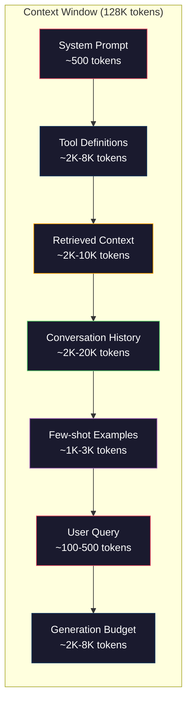
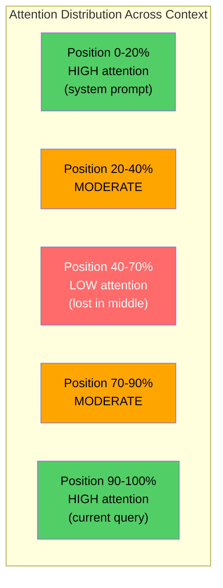
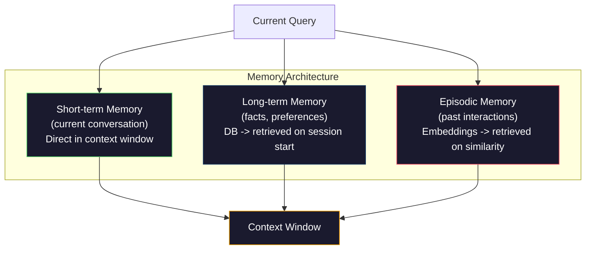

# 上下文工程：窗口、预算、内存与检索

> 提示工程只是一个子集。上下文工程才是全局。提示是你输入的一串文本。上下文是进入模型窗口的一切：系统指令、检索到的文档、工具定义、对话历史、少样本示例以及提示本身。到2026年，最优秀的AI工程师都是上下文工程师。他们决定什么进入窗口、什么留在外面，以及以何种顺序排列。

**类型：** 构建
**语言：** Python
**前置条件：** 阶段10（从零构建LLM），阶段11课程01-02
**时间：** 约90分钟
**相关：** 阶段11·15（提示缓存）——缓存友好的布局是上下文工程的扩展。阶段5·28（长上下文评估）——如何用NIAH/RULER测量中间丢失效应。

## 学习目标

- 计算所有上下文窗口组件的令牌预算（系统提示、工具、历史、检索到的文档、生成预留空间）
- 实现上下文窗口管理策略：截断、摘要和滑动窗口用于对话历史
- 对上下文组件进行优先级排序和排序，以最大化模型对最相关信息的注意力
- 构建一个上下文汇编器，根据查询类型和可用窗口空间动态分配令牌

## 问题

Claude Opus 4.7拥有200K令牌的窗口（测试版为1M）。GPT-5有400K。Gemini 3 Pro有2M。Llama 4声称达到10M。这些数字听起来巨大，直到你把它们填满。

以下是编程助手的实际分解。系统提示：500个令牌。50个工具的工具定义：8,000个令牌。检索到的文档：4,000个令牌。对话历史（10轮）：6,000个令牌。当前用户查询：200个令牌。生成预算（最大输出）：4,000个令牌。总计：22,700个令牌。这仅占128K窗口的18%。

但注意力并不随上下文长度线性扩展。一个拥有128K令牌上下文的模型需要承受二次注意力成本（在标准Transformer中是O(n^2)，不过大多数生产模型使用高效的注意力变体）。更重要的是，检索准确度会下降。

实际教训：拥有200K令牌的可用空间并不意味着使用200K令牌是有效的。一个精心策划的10K令牌上下文通常胜过一股脑放进去的100K令牌上下文。上下文工程是在上下文窗口内最大化信噪比的学科。

你放进窗口的每个令牌都会挤掉一个可能携带更相关信息的令牌。每个不相关的工具定义、每个过时的对话轮次、每个检索到但并未回答问题的文本片段——每一个都会使模型在任务上表现稍差。

## 核心概念

### 上下文窗口是一种稀缺资源

将上下文窗口视为RAM而非磁盘。它快速且可直接访问，但容量有限。你无法容纳所有内容。你必须做出选择。



每个组件都在争夺空间。添加更多工具定义意味着减少对话历史的空间。添加更多检索到的上下文意味着减少少样本示例的空间。上下文工程是分配这个预算以最大化任务性能的艺术。

### 中间丢失效应

上下文工程中最重要的实验发现。模型对上下文开头和结尾的信息关注更好。中间的信息获得较低的注意力分数，更容易被忽略。

Liu等人（2023）系统地测试了这一点。他们将一个相关文档放置在20个不相关文档中的不同位置，并测量答案准确度。当相关文档在开头或结尾时，准确度为85-90%。当它在中间（20个中的第10位）时，准确度下降到60-70%。

这对工程有直接影响：

- 将最重要的信息放在开头（系统提示、关键指令）
- 将当前查询和最相关的上下文放在最后（近因偏差有帮助）
- 将上下文的中间视为最低优先级区域
- 如果必须在中间包含信息，请在结尾重复关键点



### 上下文组件

**系统提示**：设定设定角色、约束和行为规则。这部分放在开头，并在各轮次之间保持不变。Claude Code的系统提示（包括工具定义和行为指令）大约使用6,000个令牌。保持简洁。系统提示中的每个单词在每个API调用中都会被重复。

**工具定义**：每个工具增加50-200个令牌（名称、描述、参数模式）。50个工具每个150个令牌，在进行任何对话之前就是7,500个令牌。动态工具选择——只包含与当前查询相关的工具——可以减少60-80%的令牌消耗。

**检索到的上下文**：来自矢量数据库的文档、搜索结果、文件内容。检索质量直接决定响应质量。糟糕的检索比没有检索更糟糕——它用噪声填满窗口并主动误导模型。

**对话历史**：每个先前的用户消息和助手响应。随对话长度线性增长。50轮对话每轮200个令牌就是10,000个令牌的历史记录。其中大部分与当前查询无关。

**少样本示例**：展示所需行为的输入/输出对。两到三个精心挑选的示例通常比数千个令牌的指令更能提升输出质量。但它们会占用空间。

**生成预算**：为模型响应预留的令牌。如果窗口被填满到极限，模型将没有空间回答。至少预留2,000-4,000个令牌用于生成。

### 上下文压缩策略

**历史摘要**：不是保留所有先前的逐字轮次，而是定期总结对话。“我们讨论了X，决定了Y，用户想要Z”——用100个令牌取代了占用2,000个令牌的10轮对话。当历史超过阈值（例如5,000个令牌）时执行摘要。

**相关性过滤**：根据当前查询对每个检索到的文档进行评分，并丢弃低于阈值的文档。如果你检索了10个片段但只有3个相关，则丢弃另外7个。拥有3个高度相关的片段比10个平庸的片段更好。

**工具剪枝**：对用户查询意图进行分类，只包含与该意图相关的工具。代码问题不需要日历工具。调度问题不需要文件系统工具。这可以将工具定义从8,000个令牌减少到1,000个。

**递归摘要**：对于非常长的文档，分阶段进行摘要。首先对每个部分进行摘要，然后对摘要进行摘要。一份50页的文档变成一个500个令牌的摘要，捕捉关键点。

### 内存系统

上下文工程涵盖三个时间跨度。

**短期记忆**：当前对话。直接存储在上下文窗口中。每轮对话都会增长。通过摘要和截断来管理。

**长期记忆**：跨对话持久化的事实和偏好。“用户偏好 TypeScript。”“项目使用 PostgreSQL。”存储在数据库中，在会话启动时检索。Claude Code 将其存储在 CLAUDE.md 文件中。ChatGPT 将其存储在其记忆功能中。

**情景记忆**：可能相关的特定过去交互。“上周二，我们在 auth 模块中调试了类似问题。”存储为嵌入向量，在当前对话与过去情景匹配时检索。



### 动态上下文组装

关键见解：不同的查询需要不同的上下文。静态的系统提示 + 静态工具 + 静态历史是浪费的。最佳系统会针对每个查询动态组装上下文。

1. 对查询意图进行分类
2. 选择相关工具（而不是所有工具）
3. 检索相关文档（而不是固定集合）
4. 包含相关的历史轮次（而不是所有历史）
5. 添加与任务类型匹配的少样本示例
6. 按重要性排序：最重要的放在开头和结尾，次重要的放在中间，可选的放在中间

这正是优秀 AI 应用与卓越 AI 应用的区别。模型相同，上下文是差异化因素。

## 动手构建

### 第 1 步：Token 计数器

无法度量就无法预算。构建一个简单的 token 计数器（使用空白分割近似，因为精确计数取决于分词器）。

```python
import json
import numpy as np
from collections import OrderedDict

def count_tokens(text):
    if not text:
        return 0
    return int(len(text.split()) * 1.3)

def count_tokens_json(obj):
    return count_tokens(json.dumps(obj))
```

### 第 2 步：上下文预算管理器

核心抽象。预算管理器跟踪每个组件使用的 token 数量并强制执行限制。

```python
class ContextBudget:
    def __init__(self, max_tokens=128000, generation_reserve=4000):
        self.max_tokens = max_tokens
        self.generation_reserve = generation_reserve
        self.available = max_tokens - generation_reserve
        self.allocations = OrderedDict()

    def allocate(self, component, content, max_tokens=None):
        tokens = count_tokens(content)
        if max_tokens and tokens > max_tokens:
            words = content.split()
            target_words = int(max_tokens / 1.3)
            content = " ".join(words[:target_words])
            tokens = count_tokens(content)

        used = sum(self.allocations.values())
        if used + tokens > self.available:
            allowed = self.available - used
            if allowed <= 0:
                return None, 0
            words = content.split()
            target_words = int(allowed / 1.3)
            content = " ".join(words[:target_words])
            tokens = count_tokens(content)

        self.allocations[component] = tokens
        return content, tokens

    def remaining(self):
        used = sum(self.allocations.values())
        return self.available - used

    def utilization(self):
        used = sum(self.allocations.values())
        return used / self.max_tokens

    def report(self):
        total_used = sum(self.allocations.values())
        lines = []
        lines.append(f"Context Budget Report ({self.max_tokens:,} token window)")
        lines.append("-" * 50)
        for component, tokens in self.allocations.items():
            pct = tokens / self.max_tokens * 100
            bar = "#" * int(pct / 2)
            lines.append(f"  {component:<25} {tokens:>6} tokens ({pct:>5.1f}%) {bar}")
        lines.append("-" * 50)
        lines.append(f"  {'Used':<25} {total_used:>6} tokens ({total_used/self.max_tokens*100:.1f}%)")
        lines.append(f"  {'Generation reserve':<25} {self.generation_reserve:>6} tokens")
        lines.append(f"  {'Remaining':<25} {self.remaining():>6} tokens")
        return "\n".join(lines)
```

### 第 3 步：中间丢失重排序

实现重排序策略：最重要的项放在开头和结尾，最不重要的放在中间。

```python
def reorder_lost_in_middle(items, scores):
    paired = sorted(zip(scores, items), reverse=True)
    sorted_items = [item for _, item in paired]

    if len(sorted_items) <= 2:
        return sorted_items

    first_half = sorted_items[::2]
    second_half = sorted_items[1::2]
    second_half.reverse()

    return first_half + second_half

def score_relevance(query, documents):
    query_words = set(query.lower().split())
    scores = []
    for doc in documents:
        doc_words = set(doc.lower().split())
        if not query_words:
            scores.append(0.0)
            continue
        overlap = len(query_words & doc_words) / len(query_words)
        scores.append(round(overlap, 3))
    return scores
```

### 第 4 步：对话历史压缩器

总结旧的对话轮次以回收 token 预算。

```python
class ConversationManager:
    def __init__(self, max_history_tokens=5000):
        self.turns = []
        self.summaries = []
        self.max_history_tokens = max_history_tokens

    def add_turn(self, role, content):
        self.turns.append({"role": role, "content": content})
        self._compress_if_needed()

    def _compress_if_needed(self):
        total = sum(count_tokens(t["content"]) for t in self.turns)
        if total <= self.max_history_tokens:
            return

        while total > self.max_history_tokens and len(self.turns) > 4:
            old_turns = self.turns[:2]
            summary = self._summarize_turns(old_turns)
            self.summaries.append(summary)
            self.turns = self.turns[2:]
            total = sum(count_tokens(t["content"]) for t in self.turns)

    def _summarize_turns(self, turns):
        parts = []
        for t in turns:
            content = t["content"]
            if len(content) > 100:
                content = content[:100] + "..."
            parts.append(f"{t['role']}: {content}")
        return "Previous: " + " | ".join(parts)

    def get_context(self):
        parts = []
        if self.summaries:
            parts.append("[Conversation Summary]")
            for s in self.summaries:
                parts.append(s)
        parts.append("[Recent Conversation]")
        for t in self.turns:
            parts.append(f"{t['role']}: {t['content']}")
        return "\n".join(parts)

    def token_count(self):
        return count_tokens(self.get_context())
```

### 第 5 步：动态工具选择器

只包含与当前查询相关的工具。对意图进行分类，然后过滤。

```python
TOOL_REGISTRY = {
    "read_file": {
        "description": "Read contents of a file",
        "tokens": 120,
        "categories": ["code", "files"],
    },
    "write_file": {
        "description": "Write content to a file",
        "tokens": 150,
        "categories": ["code", "files"],
    },
    "search_code": {
        "description": "Search for patterns in codebase",
        "tokens": 130,
        "categories": ["code"],
    },
    "run_command": {
        "description": "Execute a shell command",
        "tokens": 140,
        "categories": ["code", "system"],
    },
    "create_calendar_event": {
        "description": "Create a new calendar event",
        "tokens": 180,
        "categories": ["calendar"],
    },
    "list_emails": {
        "description": "List recent emails",
        "tokens": 160,
        "categories": ["email"],
    },
    "send_email": {
        "description": "Send an email message",
        "tokens": 200,
        "categories": ["email"],
    },
    "web_search": {
        "description": "Search the web for information",
        "tokens": 140,
        "categories": ["research"],
    },
    "query_database": {
        "description": "Run a SQL query on the database",
        "tokens": 170,
        "categories": ["code", "data"],
    },
    "generate_chart": {
        "description": "Generate a chart from data",
        "tokens": 190,
        "categories": ["data", "visualization"],
    },
}

def classify_intent(query):
    query_lower = query.lower()

    intent_keywords = {
        "code": ["code", "function", "bug", "error", "file", "implement", "refactor", "debug", "test"],
        "calendar": ["meeting", "schedule", "calendar", "appointment", "event"],
        "email": ["email", "mail", "send", "inbox", "message"],
        "research": ["search", "find", "what is", "how does", "explain", "look up"],
        "data": ["data", "query", "database", "chart", "graph", "analytics", "sql"],
    }

    scores = {}
    for intent, keywords in intent_keywords.items():
        score = sum(1 for kw in keywords if kw in query_lower)
        if score > 0:
            scores[intent] = score

    if not scores:
        return ["code"]

    max_score = max(scores.values())
    return [intent for intent, score in scores.items() if score >= max_score * 0.5]

def select_tools(query, token_budget=2000):
    intents = classify_intent(query)
    relevant = {}
    total_tokens = 0

    for name, tool in TOOL_REGISTRY.items():
        if any(cat in intents for cat in tool["categories"]):
            if total_tokens + tool["tokens"] <= token_budget:
                relevant[name] = tool
                total_tokens += tool["tokens"]

    return relevant, total_tokens
```

### 第 6 步：完整上下文组装管线

将所有部分连接起来。给定一个查询，动态组装最优上下文。

```python
class ContextEngine:
    def __init__(self, max_tokens=128000, generation_reserve=4000):
        self.budget = ContextBudget(max_tokens, generation_reserve)
        self.conversation = ConversationManager(max_history_tokens=5000)
        self.system_prompt = (
            "You are a helpful AI assistant. You have access to tools for "
            "code editing, file management, web search, and data analysis. "
            "Use the appropriate tools for each task. Be concise and accurate."
        )
        self.knowledge_base = [
            "Python 3.12 introduced type parameter syntax for generic classes using bracket notation.",
            "The project uses PostgreSQL 16 with pgvector for embedding storage.",
            "Authentication is handled by Supabase Auth with JWT tokens.",
            "The frontend is built with Next.js 15 using the App Router.",
            "API rate limits are set to 100 requests per minute per user.",
            "The deployment pipeline uses GitHub Actions with Docker multi-stage builds.",
            "Test coverage must be above 80% for all new modules.",
            "The codebase follows the repository pattern for data access.",
        ]

    def assemble(self, query):
        self.budget = ContextBudget(self.budget.max_tokens, self.budget.generation_reserve)

        system_content, _ = self.budget.allocate("system_prompt", self.system_prompt, max_tokens=1000)

        tools, tool_tokens = select_tools(query, token_budget=2000)
        tool_text = json.dumps(list(tools.keys()))
        tool_content, _ = self.budget.allocate("tools", tool_text, max_tokens=2000)

        relevance = score_relevance(query, self.knowledge_base)
        threshold = 0.1
        relevant_docs = [
            doc for doc, score in zip(self.knowledge_base, relevance)
            if score >= threshold
        ]

        if relevant_docs:
            doc_scores = [s for s in relevance if s >= threshold]
            reordered = reorder_lost_in_middle(relevant_docs, doc_scores)
            doc_text = "\n".join(reordered)
            doc_content, _ = self.budget.allocate("retrieved_context", doc_text, max_tokens=3000)

        history_text = self.conversation.get_context()
        if history_text.strip():
            history_content, _ = self.budget.allocate("conversation_history", history_text, max_tokens=5000)

        query_content, _ = self.budget.allocate("user_query", query, max_tokens=500)

        return self.budget

    def chat(self, query):
        self.conversation.add_turn("user", query)
        budget = self.assemble(query)
        response = f"[Response to: {query[:50]}...]"
        self.conversation.add_turn("assistant", response)
        return budget


def run_demo():
    print("=" * 60)
    print("  Context Engineering Pipeline Demo")
    print("=" * 60)

    engine = ContextEngine(max_tokens=128000, generation_reserve=4000)

    print("\n--- Query 1: Code task ---")
    budget = engine.chat("Fix the bug in the authentication module where JWT tokens expire too early")
    print(budget.report())

    print("\n--- Query 2: Research task ---")
    budget = engine.chat("What is the best approach for implementing vector search in PostgreSQL?")
    print(budget.report())

    print("\n--- Query 3: After conversation history builds up ---")
    for i in range(8):
        engine.conversation.add_turn("user", f"Follow-up question number {i+1} about the implementation details of the system")
        engine.conversation.add_turn("assistant", f"Here is the response to follow-up {i+1} with technical details about the architecture")

    budget = engine.chat("Now implement the changes we discussed")
    print(budget.report())

    print("\n--- Tool Selection Examples ---")
    test_queries = [
        "Fix the bug in auth.py",
        "Schedule a meeting with the team for Tuesday",
        "Show me the database query performance stats",
        "Search for best practices on error handling",
    ]

    for q in test_queries:
        tools, tokens = select_tools(q)
        intents = classify_intent(q)
        print(f"\n  Query: {q}")
        print(f"  Intents: {intents}")
        print(f"  Tools: {list(tools.keys())} ({tokens} tokens)")

    print("\n--- Lost-in-the-Middle Reordering ---")
    docs = ["Doc A (most relevant)", "Doc B (somewhat relevant)", "Doc C (least relevant)",
            "Doc D (relevant)", "Doc E (moderately relevant)"]
    scores = [0.95, 0.60, 0.20, 0.80, 0.50]
    reordered = reorder_lost_in_middle(docs, scores)
    print(f"  Original order: {docs}")
    print(f"  Scores:         {scores}")
    print(f"  Reordered:      {reordered}")
    print(f"  (Most relevant at start and end, least relevant in middle)")
```

## 使用它

### Claude Code 的上下文策略

Claude Code 使用分层方法管理上下文。系统提示包括行为规则和工具定义（约 6K token）。当你打开一个文件时，其内容被注入为上下文。当你搜索时，结果被添加。旧对话轮次被总结。CLAUDE.md 提供了跨会话持久化的长期记忆。

关键的工程决策：Claude Code 不会将整个代码库转储到上下文中。它按需检索相关文件。这就是上下文工程在实践中的应用。

### Cursor 的动态上下文加载

Cursor 将整个代码库索引为嵌入向量。当你输入查询时，它使用向量相似性检索最相关的文件和代码块。只有这些部分进入上下文窗口。一个 50 万行的代码库被压缩为 5-10 个最相关的代码块。

这就是模式：嵌入所有内容，按需检索，只包含重要的部分。

### ChatGPT 记忆

ChatGPT 将用户偏好和事实存储为长期记忆。每次对话开始时，相关记忆被检索并包含在系统提示中。“用户偏好 Python”花费 5 个 token，但节省了跨对话重复指令的数百个 token。

### RAG 作为上下文工程

检索增强生成是上下文工程的规范化形式。不将知识塞入模型权重（训练）或系统提示（静态上下文），而是在查询时检索相关文档并将其注入上下文窗口。整个 RAG 管线——分块、嵌入、检索、重排序——存在的目的只有一个：将正确信息放入上下文窗口。

## 发布

本课产生`outputs/prompt-context-optimizer.md`——一个可复用的提示，用于审计上下文组装策略并推荐优化。将系统提示、工具数量、平均历史长度和检索策略输入其中，它就能识别令牌浪费并建议改进。

它还产生`outputs/skill-context-engineering.md`——一个基于任务类型、上下文窗口大小和延迟预算设计上下文组装流水线的决策框架。

## 练习

1. 向ContextBudget类添加一个“令牌浪费检测器”。它应标记使用超过30%预算的组件，并针对每种组件类型建议特定的压缩策略（总结历史、修剪工具、重新排序文档）。

2. 为检索到的上下文实现语义去重。如果两个检索到的文档相似度超过80%（通过词重叠或其嵌入的余弦相似度），则只保留得分较高的那个。测量这能恢复多少令牌预算。

3. 构建一个“上下文回放”工具。给定一个对话记录，通过ContextEngine回放它，并可视化预算分配如何逐轮变化。绘制每个组件随时间变化的令牌使用量。确定上下文开始被压缩的那一轮。

4. 实现一个基于优先级的工具选择器。不再是二元包含/排除，而是为每个工具分配一个与当前查询的相关性分数。按相关性降序包含工具，直到工具预算耗尽。比较包含5、10、20和50个工具时的任务性能。

5. 构建一个多策略上下文压缩器。实现三种压缩策略（截断、摘要、关键句提取），并在20个文档的集合上进行基准测试。测量压缩率和信息保留之间的权衡（压缩版本是否仍包含查询答案？）。

## 关键术语

|  术语  |  人们的说法  |  实际含义  |
|------|----------------|----------------------|
| 上下文窗口 | “模型能读取多少” | 模型在单次前向传播中处理的最大令牌数（输入+输出）——GPT-5为400K，Claude Opus 4.7为200K（1M测试版），Gemini 3 Pro为2M |
| 上下文工程 | “高级提示工程” | 决定什么内容进入上下文窗口、以什么顺序以及以什么优先级的学科——涵盖检索、压缩、工具选择和内存管理 |
| 中间丢失 | “模型忘记中间的内容” | 经验发现，LLM对上下文的开头和结尾关注更好，中间位置的信息准确率下降10-20% |
| 令牌预算 | “你还有多少令牌” | 对上下文窗口容量在各组件（系统提示、工具、历史、检索、生成）之间的明确分配，并带有每个组件的限制 |
| 动态上下文 | “即时加载内容” | 基于意图分类、相关工具选择和检索结果，为每个查询以不同方式组装上下文窗口 |
| 历史摘要 | “压缩对话” | 用简洁的摘要替换逐字记录的旧对话轮次，在保留关键信息的同时减少令牌成本 |
| 工具修剪 | “只包含相关工具” | 对查询意图进行分类，仅包含匹配的工具定义，将工具令牌成本降低60-80% |
| 长期记忆 | “跨会话记忆” | 存储在数据库中并在会话开始时检索的事实和偏好——CLAUDE.md、ChatGPT Memory及类似系统 |
| 情景记忆 | “记住特定的过去事件” | 存储为嵌入的过去交互，在当前查询与过去对话相似时进行检索 |
| 生成预算 | “答案的空间” | 为模型输出保留的令牌——如果上下文完全填满窗口，模型就没有空间响应 |

## 延伸阅读

- [Liu et al., 2023 -- "Lost in the Middle: How Language Models Use Long Contexts"](https://arxiv.org/abs/2307.03172)——关于位置依赖注意力的权威研究，表明模型在长上下文中间的信息处理上存在困难
- [Liu et al., 2023 -- "Lost in the Middle: How Language Models Use Long Contexts"](https://arxiv.org/abs/2307.03172)——Anthropic如何处理上下文感知的分块检索，将检索失败率降低49%
- [Liu et al., 2023 -- "Lost in the Middle: How Language Models Use Long Contexts"](https://arxiv.org/abs/2307.03172)——命名该学科并将其与提示工程区分开来的博客文章
- [Liu et al., 2023 -- "Lost in the Middle: How Language Models Use Long Contexts"](https://arxiv.org/abs/2307.03172)——检索增强生成作为上下文工程模式的实际实现
- [Liu et al., 2023 -- "Lost in the Middle: How Language Models Use Long Contexts"](https://arxiv.org/abs/2307.03172)——揭示所有主要模型位置相关检索失败的基准测试
- [Liu et al., 2023 -- "Lost in the Middle: How Language Models Use Long Contexts"](https://arxiv.org/abs/2307.03172)——为什么上下文长度驱动内存和延迟，以及KV缓存、MQA和GQA如何改变预算计算。
- [Liu et al., 2023 -- "Lost in the Middle: How Language Models Use Long Contexts"](https://arxiv.org/abs/2307.03172)——推理的两个阶段使得长提示在TTFT上昂贵但在TPOT上便宜；上下文打包权衡背后的真相。
- [Liu et al., 2023 -- "Lost in the Middle: How Language Models Use Long Contexts"](https://arxiv.org/abs/2307.03172)——分组查询注意力论文，在生产解码器中将KV内存减少了8倍而无质量损失。
