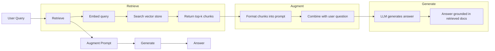
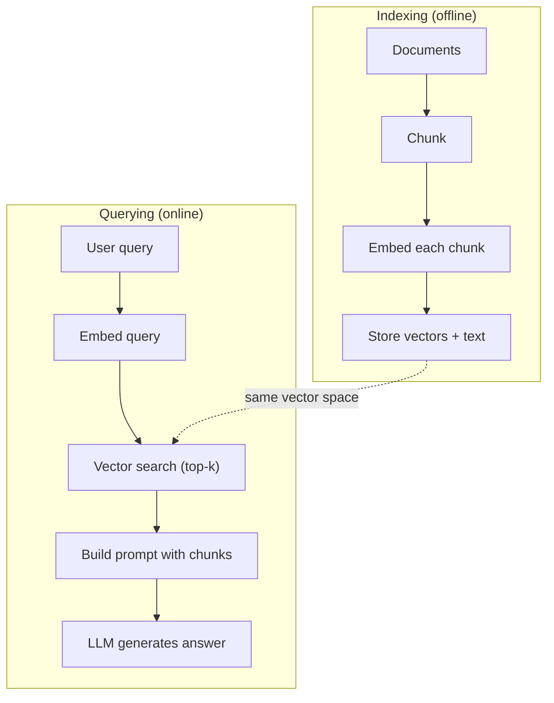

# RAG（检索增强生成）

> 你的LLM知道其训练截止日期之前的一切。它对你的公司文档、代码库或上周的会议记录一无所知。RAG通过检索相关文档并将它们塞入提示词来解决这个问题。这是生产环境AI中部署最广泛的模式。如果你本课程只想学一件事，那就构建一个RAG流水线。

**类型：**构建
**语言：**Python
**前提条件：**阶段10（从零开始构建LLM），阶段11第01-05课
**时间：**约90分钟
**相关：**阶段5·23（RAG的分块策略）了解六种分块算法及其适用场景。阶段5·22（嵌入模型深度剖析）用于选择嵌入器。阶段11·07（高级RAG）用于混合搜索、重排序和查询变换。

## 学习目标

- 构建完整的RAG流水线：文档加载、分块、嵌入、向量存储、检索和生成
- 使用带恰当索引的向量数据库（ChromaDB、FAISS或Pinecone）实现语义搜索
- 解释为什么对于知识型应用，RAG优于微调（成本、新鲜度、可归因性）
- 使用检索指标（精确率、召回率）和生成指标（忠实度、相关性）评估RAG质量

## 问题

你为你的公司构建了一个聊天机器人。客户问“企业版套餐的退款政策是什么？”LLM回复了一个关于典型SaaS退款政策的通用答案。实际政策埋在一份200页的内部wiki中，内容是：企业客户有60天窗口期，按比例退款。LLM从未见过这份文档。它不可能知道未训练过的内容。

微调是一种解决方案。获取LLM，在你的内部文档上训练它，然后部署更新后的模型。这可行，但有严重问题。微调花费数千美元的计算成本。文档一旦变化，模型就变得过时。你无法知道模型是从哪个源获取信息。如果公司下个月收购了另一条产品线，你就得再次微调。

RAG是另一种解决方案。保持模型不变。当问题来了，搜索你的文档库以找到相关段落，将它们粘贴到问题之前的提示词中，然后让模型使用这些段落作为上下文来回答。文档库可以在几分钟内更新。你可以精确看到哪些文档被检索到。模型本身从未改变。这就是为什么RAG是生产中的主导模式：它更便宜、更新鲜、更可审计，并且适用于任何LLM。

## 核心概念

### RAG模式

整个模式分为四个步骤：



查询 -> 检索 -> 增强提示词 -> 生成。每个RAG系统都遵循这个模式。生产级RAG系统之间的差异在于每个步骤的细节：如何分块、如何嵌入、如何搜索以及如何构建提示词。

### 为什么RAG优于微调

|  方面  |  微调  |  RAG  |
|---------|------------|-----|
|  成本  |  $1,000-$每次训练运行100,000+  |  $0.01-$每次查询0.10美元（嵌入+LLM）  |
|  新鲜度  |  重新训练前过时  |  通过重新索引文档，几分钟内更新  |
|  可审计性  |  无法追溯答案来源  |  可以显示精确检索到的段落  |
|  幻觉  |  仍然自由地产生幻觉  |  基于检索到的文档  |
|  数据隐私  |  训练数据嵌入权重中  |  文档保留在你的向量存储中  |

微调永久改变模型的权重。RAG暂时改变模型的上下文。对于大多数应用，临时上下文正是你需要的。

微调胜出的唯一情况是：当你需要模型采用无法仅通过提示词实现的特定风格、语气或推理模式时。对于事实知识检索，RAG每次都胜出。

### 嵌入模型

嵌入模型将文本转换为稠密向量。相似的文本在高维空间中产生的向量彼此靠近。"How do I reset my password?"和"I need to change my password"产生几乎相同的向量，尽管共用的词很少。"The cat sat on the mat"产生一个非常不同的向量。

常见嵌入模型（2026年阵容——详见阶段5·22）：

|  模型  |  维度  |  提供商  |  备注  |
|-------|-----------|----------|-------|
|  text-embedding-3-small  |  1536 (Matryoshka)  |  OpenAI  |  大多数用例的最佳性价比  |
|  text-embedding-3-large  |  3072 (Matryoshka)  |  OpenAI  |  更高精度，可截断至256/512/1024  |
|  Gemini Embedding 2  |  3072 (Matryoshka)  |  Google  |  MTEB检索顶尖；8K上下文  |
|  voyage-4  |  1024/2048 (Matryoshka)  |  Voyage AI  |  领域变体（代码、金融、法律）  |
|  Cohere embed-v4  |  1024 (Matryoshka)  |  Cohere  |  强大多语言，128K上下文  |
|  BGE-M3  |  1024 (dense + sparse + ColBERT)  |  BAAI（开放权重）  |  单一模型三种视角  |
|  Qwen3-Embedding  |  4096 (Matryoshka)  |  Alibaba（开放权重）  |  开放权重检索得分顶尖  |
| all-MiniLM-L6-v2  |  384  |  开放权重（Sentence Transformers）  |  原型基准 |

在本课中，我们使用TF-IDF构建自己的简单嵌入。不是因为TF-IDF是生产系统使用的，而是因为它让概念具体化：文本输入，向量输出，相似文本产生相似向量。

### 向量相似度（Vector Similarity）

给定两个向量，如何衡量相似度？三种选择：

**余弦相似度（Cosine similarity）**：两个向量之间夹角的余弦值。范围从-1（相反）到1（完全相同）。忽略大小，只关心方向。这是RAG的默认方法。

```
cosine_sim(a, b) = dot(a, b) / (||a|| * ||b||)
```

**点积（Dot product）**：原始内积。较大的向量得分更高。当大小携带信息时（较长的文档可能更相关），此方法有用。

```
dot(a, b) = sum(a_i * b_i)
```

**L2（欧几里得）距离**：向量空间中的直线距离。距离越小 = 越相似。对大小差异敏感。

```
L2(a, b) = sqrt(sum((a_i - b_i)^2))
```

余弦相似度是标准方法。它能优雅地处理不同长度的文档，因为它通过大小进行归一化。当人们说“向量搜索”时，几乎总是指余弦相似度。

### 分块策略

文档太长，无法作为单个向量嵌入。一份50页的PDF可能产生糟糕的嵌入，因为它包含几十个主题。相反，你应该将文档分割成块，并分别嵌入每个块。

**固定大小分块**：每N个令牌分割一次。简单且可预测。512令牌的块，重叠50令牌，意味着块1是令牌0-511，块2是令牌462-973，依此类推。重叠确保你不会在不幸的边界处分割句子。

**语义分块**：在自然边界处分割。段落、章节或Markdown标题。每个块是一个连贯的意义单元。实现更复杂，但检索效果更好。

**递归分块**：首先尝试在最大的边界（章节标题）处分割。如果某个章节仍然太大，则在段落边界处分割。如果段落仍然太大，则在句子边界处分割。这是LangChain的RecursiveCharacterTextSplitter方法，在实践中效果很好。

块大小比人们想象的更重要：

- 太小（64-128令牌）：每个块缺乏上下文。"上一季度增长了15%" 不知道"它"指代什么就没有意义。
- 太大（2048+令牌）：每个块涵盖多个主题，稀释相关性。当你搜索收入数据时，你会得到一个10%关于收入、90%关于人数的块。
- 最佳点（256-512令牌）：有足够的上下文使其自包含，足够聚焦从而相关。

大多数生产RAG系统使用256-512令牌的块，重叠50令牌。Anthropic的RAG指南推荐这个范围。

### 向量数据库（Vector Databases）

一旦你有了嵌入，就需要一个地方来存储和搜索它们。选择：

|  数据库  |  类型  |  最佳用途 |
|----------|------|----------|
|  FAISS  |  库（进程内）  |  原型开发，中小型数据集 |
|  Chroma  |  轻量级数据库  |  本地开发，小型部署 |
|  Pinecone  |  托管服务  |  无需运维开销的生产环境 |
|  Weaviate  |  开源数据库  |  自托管生产环境 |
|  pgvector  |  Postgres扩展  |  已在使用Postgres |
|  Qdrant  |  开源数据库  |  高性能自托管 |

对于本课，我们构建一个简单的内存向量存储。它将向量存储在列表中，并执行暴力余弦相似度搜索。这相当于使用平面索引的FAISS。在变慢之前，它可能扩展到约10万个向量。生产系统使用近似最近邻（ANN）算法，如HNSW，以毫秒级搜索数百万个向量。

### 完整管道



索引阶段每文档运行一次（或文档更新时运行）。查询阶段每个用户请求运行一次。在生产中，索引可能需要在数小时内处理数百万个文档。查询必须在不到一秒内响应。

### 实际数据

大多数生产RAG系统使用这些参数：

- **k = 5 到 10** 每个查询检索的块数
- **块大小 = 256 到 512 令牌**，重叠50令牌
- **上下文预算**：每个查询检索内容的2500-5000令牌
- **总提示**：约8000-16000令牌（系统提示 + 检索块 + 对话历史 + 用户查询）
- **嵌入维度**：384-3072，取决于模型
- **索引吞吐量**：使用API嵌入时，每秒100-1000个文档
- **查询延迟**：检索50-200ms，生成500-3000ms

```figure
rag-chunking
```

## 动手构建

### 步骤1：文档分块（Document Chunking）

```python
def chunk_text(text, chunk_size=200, overlap=50):
    words = text.split()
    chunks = []
    start = 0
    while start < len(words):
        end = start + chunk_size
        chunk = " ".join(words[start:end])
        chunks.append(chunk)
        start += chunk_size - overlap
    return chunks
```

### 步骤2：TF-IDF嵌入（TF-IDF Embeddings）

我们构建一个简单的嵌入(Embedding)函数。TF-IDF（词频-逆文档频率）不是神经嵌入，但它通过捕捉词的重要性将文本转换为向量。文档中频繁出现的词获得较高的TF，整个语料库中罕见的词获得较高的IDF。两者的乘积得到一个向量，其中重要且独特的词具有较高的值。

```python
import math
from collections import Counter

def build_vocabulary(documents):
    vocab = set()
    for doc in documents:
        vocab.update(doc.lower().split())
    return sorted(vocab)

def compute_tf(text, vocab):
    words = text.lower().split()
    count = Counter(words)
    total = len(words)
    return [count.get(word, 0) / total for word in vocab]

def compute_idf(documents, vocab):
    n = len(documents)
    idf = []
    for word in vocab:
        doc_count = sum(1 for doc in documents if word in doc.lower().split())
        idf.append(math.log((n + 1) / (doc_count + 1)) + 1)
    return idf

def tfidf_embed(text, vocab, idf):
    tf = compute_tf(text, vocab)
    return [t * i for t, i in zip(tf, idf)]
```

### 步骤3：余弦相似度搜索

```python
def cosine_similarity(a, b):
    dot = sum(x * y for x, y in zip(a, b))
    norm_a = math.sqrt(sum(x * x for x in a))
    norm_b = math.sqrt(sum(x * x for x in b))
    if norm_a == 0 or norm_b == 0:
        return 0.0
    return dot / (norm_a * norm_b)

def search(query_embedding, stored_embeddings, top_k=5):
    scores = []
    for i, emb in enumerate(stored_embeddings):
        sim = cosine_similarity(query_embedding, emb)
        scores.append((i, sim))
    scores.sort(key=lambda x: x[1], reverse=True)
    return scores[:top_k]
```

### 步骤4：提示词构建

这就是RAG中“增强(Augmented)”发生的地方。将检索到的块(Chunk)格式化成一个提示词(Prompt)，让LLM根据提供的上下文来回答。

```python
def build_rag_prompt(query, retrieved_chunks):
    context = "\n\n---\n\n".join(
        f"[Source {i+1}]\n{chunk}"
        for i, chunk in enumerate(retrieved_chunks)
    )
    return f"""Answer the question based ONLY on the following context.
If the context doesn't contain enough information, say "I don't have enough information to answer that."

Context:
{context}

Question: {query}

Answer:"""
```

### 步骤5：完整的RAG管道

```python
class RAGPipeline:
    def __init__(self):
        self.chunks = []
        self.embeddings = []
        self.vocab = []
        self.idf = []

    def index(self, documents):
        all_chunks = []
        for doc in documents:
            all_chunks.extend(chunk_text(doc))
        self.chunks = all_chunks
        self.vocab = build_vocabulary(all_chunks)
        self.idf = compute_idf(all_chunks, self.vocab)
        self.embeddings = [
            tfidf_embed(chunk, self.vocab, self.idf)
            for chunk in all_chunks
        ]

    def query(self, question, top_k=5):
        query_emb = tfidf_embed(question, self.vocab, self.idf)
        results = search(query_emb, self.embeddings, top_k)
        retrieved = [(self.chunks[i], score) for i, score in results]
        prompt = build_rag_prompt(
            question, [chunk for chunk, _ in retrieved]
        )
        return prompt, retrieved
```

### 步骤6：生成（模拟）

在生产环境中，这里是调用LLM API的地方。在本课中，我们通过从检索到的上下文中提取最相关的句子来模拟生成。

```python
def simple_generate(prompt, retrieved_chunks):
    query_words = set(prompt.lower().split("question:")[-1].split())
    best_sentence = ""
    best_score = 0
    for chunk in retrieved_chunks:
        for sentence in chunk.split("."):
            sentence = sentence.strip()
            if not sentence:
                continue
            words = set(sentence.lower().split())
            overlap = len(query_words & words)
            if overlap > best_score:
                best_score = overlap
                best_sentence = sentence
    return best_sentence if best_sentence else "I don't have enough information."
```

## 使用它

使用真正的嵌入模型和LLM，代码几乎不变：

```python
from openai import OpenAI

client = OpenAI()

def embed(text):
    response = client.embeddings.create(
        model="text-embedding-3-small",
        input=text
    )
    return response.data[0].embedding

def generate(prompt):
    response = client.chat.completions.create(
        model="gpt-4o-mini",
        messages=[{"role": "user", "content": prompt}],
        temperature=0
    )
    return response.choices[0].message.content
```

或者使用Anthropic：

```python
import anthropic

client = anthropic.Anthropic()

def generate(prompt):
    response = client.messages.create(
        model="claude-sonnet-4-20250514",
        max_tokens=1024,
        messages=[{"role": "user", "content": prompt}]
    )
    return response.content[0].text
```

管道是一样的。更换嵌入函数。更换生成函数。检索逻辑、分块、提示词构建——无论使用哪种模型，都是相同的。

对于大规模向量存储，用合适的向量数据库替换暴力搜索：

```python
import chromadb

client = chromadb.Client()
collection = client.create_collection("my_docs")

collection.add(
    documents=chunks,
    ids=[f"chunk_{i}" for i in range(len(chunks))]
)

results = collection.query(
    query_texts=["What is the refund policy?"],
    n_results=5
)
```

Chroma在内部处理嵌入（默认使用all-MiniLM-L6-v2），并将向量存储在本地的数据库中。相同的模式，不同的管道实现。

## 发布

本課(lesson)产出：
- `outputs/prompt-rag-architect.md` —— 为特定用例设计RAG系统的提示词
- `outputs/prompt-rag-architect.md` —— 教智能体如何构建和调试RAG管道的技能

## 练习

1. 用简单的词袋方法（二值：词出现为1，否则为0）替换TF-IDF嵌入。在样本文档上比较检索质量。TF-IDF应该表现更好，因为它对罕见词赋予更高的权重。

2. 尝试不同的块大小：在同一文档集上尝试50、100、200和500词。对于每种大小，运行相同的5个查询，并统计在top-3中有多少个返回相关块。找到检索质量达到峰值的理想大小。

3. 为每个块添加元数据（源文档名称、块位置）。修改提示词模板以包含来源归属，使LLM引用其来源。

4. 实现一个简单的评估：给定10个问答对，将每个问题通过RAG管道运行，并衡量检索到的块中包含答案的百分比。这是top-k的检索召回率(Recall)。

5. 构建一个感知对话的RAG管道：维护最近3次交互的历史，并将其与检索到的块一起包含在提示词中。用诸如在询问定价后提出“那企业版呢？”这样的后续问题来测试。

## 关键术语

|  术语  |  人们的说法  |  实际含义  |
|------|----------------|----------------------|
|  RAG  |  "读取你的文档的AI"  |  检索相关文档，粘贴到提示词中，并基于这些文档生成答案 |
|  Embedding  |  "将文本转换为数字"  |  文本的密集向量表示，其中相似的含义产生相似的向量 |
|  Vector database  |  "AI的搜索引擎"  |  为存储向量和按相似性查找最近邻而优化的数据存储 |
|  Chunking  |  "将文档分割成片段"  |  将文档分解成更小的片段（通常256-512个token），以便每个片段可以独立嵌入和检索 |
|  Cosine similarity  |  "两个向量有多相似"  |  两个向量之间夹角的余弦；1表示方向相同，0表示正交，-1表示相反 |
|  Top-k retrieval  |  "获取最佳k个匹配"  |  从向量存储中返回与查询最相似的k个块 |
|  Context window  |  "LLM能看到的文本量"  |  LLM在单个请求中能处理的最大token数；检索到的块必须适合此窗口 |
|  Augmented generation  |  "使用给定上下文回答"  |  使用检索到的文档作为上下文生成响应，而不是仅依赖训练好的知识 |
|  TF-IDF  |  "词重要性评分"  |  词频乘以逆文档频率；根据词在语料库中的独特性对词加权 |
|  Indexing  |  "为搜索准备文档"  |  分块、嵌入和存储文档的离线过程，以便在查询时进行搜索 |

## 延伸阅读

- Lewis等人，《Retrieval-Augmented Generation for Knowledge-Intensive NLP Tasks》（2020）——来自Facebook AI Research的原始RAG论文，形式化了先检索后生成(Retrieve-then-Generate)的模式
- Anthropic的RAG文档（docs.anthropic.com）——关于块大小、提示词构建和评估的实用指南
- Pinecone学习中心，《What is RAG?》——带有生产考量的RAG管道的清晰可视化解释
- Sentence-BERT: Reimers & Gurevych（2019）——all-MiniLM嵌入模型背后的论文，展示了如何训练用于语义相似性的双编码器
- [Karpukhin et al., "Dense Passage Retrieval for Open-Domain Question Answering" (EMNLP 2020)](https://arxiv.org/abs/2004.04906)——DPR论文，证明了密集双编码器检索在开放域问答上击败了BM25，并奠定了现代RAG检索器的模式
- [Karpukhin et al., "Dense Passage Retrieval for Open-Domain Question Answering" (EMNLP 2020)](https://arxiv.org/abs/2004.04906)——构建RAG管道时要了解的主要概念：数据加载器、节点解析器、索引、检索器、响应合成器
- [Karpukhin et al., "Dense Passage Retrieval for Open-Domain Question Answering" (EMNLP 2020)](https://arxiv.org/abs/2004.04906)——相反风格的编排器；相同先检索后生成模式的链式可运行对象视图
