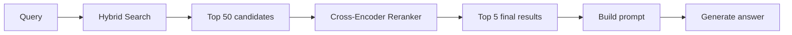
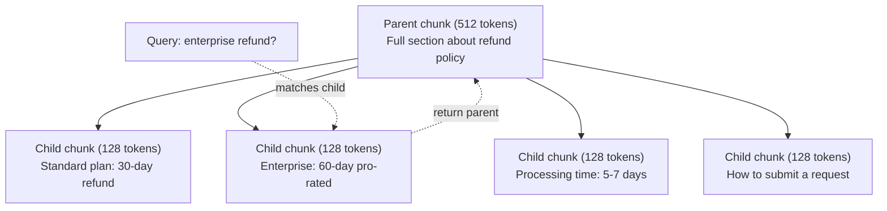
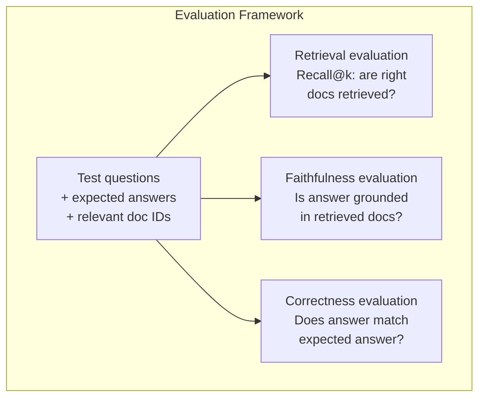

# 高级RAG（分块、重排序、混合搜索）

> 基础RAG检索前k个最相似的分块。这对于简单问题有效。但对于多跳推理、模糊查询和大型语料库则失效。高级RAG是区别在于一个能在10个文档上运行的演示和一个能在1000万个文档上运行的系统之间的差异。

**类型：** 构建
**语言：** Python
**前提条件：** 第11阶段，第06课（RAG）
**时间：** 约90分钟
**相关：** 第5阶段·第23课（RAG的分块策略）涵盖了所有六种分块算法——递归、语义、句子、父文档、延迟分块、上下文检索——并附有Vectara/Anthropic基准测试。本课在此基础上构建：混合搜索、重排序、查询转换。

## 学习目标

- 实现高级分块策略（语义、递归、父子），以保留文档结构和上下文
- 构建混合搜索管道，结合BM25关键词匹配与语义向量搜索以及交叉编码器重排序
- 应用查询转换技术（HyDE、多查询、回退）以改善模糊或复杂问题的检索
- 诊断并修复常见的RAG失败：检索错误块、答案不在上下文中、多跳推理中断

## 问题

你在第06课中构建了一个基础RAG管道。它适用于小型语料库上的简单问题。现在尝试以下情况：

**模糊查询**：“上季度的收入是多少？”语义搜索返回关于收入策略、收入预测以及CFO对收入增长看法的块。所有这些都与“收入”一词在语义上相似。但没有一个包含实际数字。正确的块包含“$47.2M in Q3 2025" but uses the word "earnings" instead of "revenue." The embedding model thinks "revenue strategy" is closer to the query than "Q3 earnings were $47.2M”。

**多跳问题**：“哪个团队的客户满意度评分提升最大？”这需要找出每个团队的满意度评分，进行比较，并识别出最大值。没有一个单独的块包含答案。信息分散在各个团队报告中。

**大型语料库问题**：你有200万个块。正确答案在第1,847,293块。你的前5个检索结果拉出了第14、89,201、1,200,000、44和901,333块。在嵌入空间中接近，但没有一个包含答案。在这种规模下，近似最近邻搜索引入了足够的误差，使得相关结果被挤出前k。

基础RAG失效的原因是向量相似性与相关性并不等同。一个块可能在语义上与查询相似，但对回答问题却毫无用处。高级RAG通过四种技术解决这个问题：混合搜索（添加关键词匹配）、重排序（更仔细地对候选结果评分）、查询转换（在搜索前修正查询）以及更好的分块（以正确的粒度检索）。

## 核心概念

### 混合搜索：语义 + 关键词

语义搜索（向量相似性）擅长理解含义。“如何取消订阅？”匹配“终止计划的步骤”，即使它们没有共享任何词汇。但它会遗漏精确匹配。错误代码“E-4021”可能无法匹配包含“E-4021”的块，如果嵌入模型将其视为噪声。

关键词搜索（BM25）则相反。它擅长精确匹配。“E-4021”完美匹配。但如果文档说“终止你的计划”，那么“取消我的订阅”将返回零结果。

混合搜索同时运行两者，然后合并结果。

**BM25**（最佳匹配25）是标准的关键词搜索算法。自20世纪90年代以来，它一直是搜索引擎的支柱。公式如下：
$$ \text{Score}(d, q) = \sum_{t \in q} \text{IDF}(t) \cdot \frac{\text{tf}(t, d) \cdot (k_1 + 1)}{\text{tf}(t, d) + k_1 \cdot (1 - b + b \cdot \frac{|d|}{\text{avgdl}})} $$
其中tf(t,d)是术语t在文档d中的词频，IDF(t)是逆文档频率，|d|是文档长度，avgdl是平均文档长度，k1控制词频饱和度（默认1.2），b控制长度归一化（默认0.75）。

```
BM25(q, d) = sum over terms t in q:
    IDF(t) * (tf(t,d) * (k1 + 1)) / (tf(t,d) + k1 * (1 - b + b * |d| / avgdl))
```

通俗地说：BM25对包含查询术语（尤其是罕见术语）的文档给出更高的分数，但重复术语的收益递减。一个出现50次“收入”一词的文档，其相关性并不是出现一次文档的50倍。

倒数排名融合（RRF）

### 你有两个排名列表：一个来自向量搜索，一个来自BM25。如何合并它们？倒数排名融合是标准方法。

$$ \text{RRFScore}(d) = \sum_{r \in R(d)} \frac{1}{k + r} $$

```
RRF_score(d) = sum over rankings R:
    1 / (k + rank_R(d))
```

其中k是一个常数（通常为60），防止排名最高的结果占据主导。

一个在向量搜索中排名第1、在BM25中排名第5的文档得到：1/(60+1) + 1/(60+5) = 0.0164 + 0.0154 = 0.0318

一个在向量搜索中排名第3、在BM25中排名第2的文档得到：1/(60+3) + 1/(60+2) = 0.0159 + 0.0161 = 0.0320

RRF自然平衡了这两种信号。在两个列表中都排名高的文档获得最佳分数。在一个列表中排名第一但在另一个列表中缺失的文档获得中等分数。这种方法很稳健，因为它使用排名而不是原始分数，所以两个系统之间分数分布的差异无关紧要。

### 重排序

检索（无论是向量、关键词还是混合）速度快但不精确。它使用双编码器：查询和每个文档分别嵌入，然后进行比较。嵌入只计算一次并缓存。这可以扩展到数百万个文档。

重排序使用交叉编码器：将查询和候选文档一起输入到一个模型中，该模型输出相关性分数。该模型同时看到两个文本，并可以捕捉它们之间的细粒度交互。交叉编码器能够理解“第三季度收益是多少？”与包含“第三季度4720万美元”的块高度相关，即使双编码器错过了这种联系。

权衡：交叉编码器比双编码器慢100-1000倍，因为它们联合处理查询-文档对。您无法预先计算一百万个文档的交叉编码器分数。解决方案：检索一个更大的候选集（来自混合搜索的前50个），然后使用交叉编码器进行重排序，以获得最终的前5个。



常见的重排序模型（2026年阵容）：
- Cohere Rerank 3.5：托管API，多语言，混合语料库上最佳召回率提升
- Voyage rerank-2.5：托管API，托管选项中延迟最低
- Jina-Reranker-v2 Multilingual：开放权重，支持100+种语言
- bge-reranker-v2-m3：开放权重，强基线
- cross-encoder/ms-marco-MiniLM-L-6-v2：开放权重，可在CPU上运行用于原型开发
- ColBERTv2 / Jina-ColBERT-v2：后期交互多向量重排序器——评分时复杂度为O(令牌)而非O(文档)

### 查询转换

有时问题不在于检索，而在于查询本身。“那个关于新政策变化的东西是什么？”这是一个糟糕的搜索查询。它不包含具体术语。嵌入是模糊的。任何检索系统都无法找到正确的文档。

**查询重写**：将用户的查询改写为更佳的搜索查询。大语言模型可以做到：

```
User: "What was that thing about the new policy change?"
Rewritten: "Recent policy changes and updates"
```

**HyDE（假设文档嵌入）**：不是用查询进行搜索，而是生成一个假设答案，将其嵌入，然后搜索相似的真实文档。

```
Query: "What is the refund policy for enterprise?"
Hypothetical answer: "Enterprise customers are eligible for a full refund
within 60 days of purchase. Refunds are pro-rated based on the remaining
subscription period and processed within 5-7 business days."
```

嵌入假设答案并搜索与之相似的真实文档。直觉是：假设答案在嵌入空间中比原始问题更接近真实答案。问题和答案具有不同的语言结构。通过生成假设答案，你可以弥合嵌入中“问题空间”和“答案空间”之间的差距。

HyDE 在检索前增加了一次大语言模型调用。这增加了 500-2000 毫秒的延迟。当原始查询的检索质量较差时，这是值得的。

### 父子分块(Parent-Child Chunking)

标准分块迫使进行权衡：小块用于精确检索，大块用于足够的上下文。父子分块消除了这种权衡。

索引小块（128 个 token）用于检索。当检索到一个小块时，返回其父块（512 个 token）用于提示。小块精确匹配查询。父块为大语言模型提供足够的上下文以生成好的答案。



查询“企业退款？”精确匹配子块 C2。但提示接收到完整的父块 P，其中包含关于处理时间和提交过程的周围上下文。

### 元数据过滤(Metadata Filtering)

在进行向量搜索之前，通过元数据过滤语料库：日期、来源、类别、作者、语言。这减少了搜索空间并防止了不相关的结果。

“上个月安全策略有什么变化？”应该只搜索安全类别中过去 30 天的文档。如果没有元数据过滤，你会搜索整个语料库，并可能检索到两年前的安全文档，恰好语义相似。

生产级 RAG 系统将元数据与每个块一起存储：源文档、创建日期、类别、作者、版本。向量数据库支持在相似性搜索之前通过元数据进行预过滤，这对于大规模性能至关重要。

### 评估

你构建了一个 RAG 系统。如何知道它是否有效？三个指标：

**检索相关性 (Recall@k)**：对于一组已知相关文档的测试问题，相关文档出现在前 k 个结果中的百分比？如果问题的答案在块 #47 中，块 #47 是否出现在前 5 个中？

**忠实性 (Faithfulness)**：生成的答案是否基于检索到的文档？如果检索到的块说“60 天退款窗口”，而模型说“90 天退款窗口”，那就是忠实性失败。模型尽管有正确的上下文，仍然产生了幻觉。

**答案正确性 (Answer Correctness)**：生成的答案是否与预期答案匹配？这是端到端的指标。它结合了检索质量和生成质量。

一个简单的忠实性检查：提取生成答案中的每个声明，并验证它是否（在实质上）出现在检索到的块中。如果答案包含任何检索块中都没有的事实，则很可能是幻觉。



## 动手构建

### 步骤 1：BM25 实现

```python
import math
from collections import Counter

class BM25:
    def __init__(self, k1=1.2, b=0.75):
        self.k1 = k1
        self.b = b
        self.docs = []
        self.doc_lengths = []
        self.avg_dl = 0
        self.doc_freqs = {}
        self.n_docs = 0

    def index(self, documents):
        self.docs = documents
        self.n_docs = len(documents)
        self.doc_lengths = []
        self.doc_freqs = {}

        for doc in documents:
            words = doc.lower().split()
            self.doc_lengths.append(len(words))
            unique_words = set(words)
            for word in unique_words:
                self.doc_freqs[word] = self.doc_freqs.get(word, 0) + 1

        self.avg_dl = sum(self.doc_lengths) / self.n_docs if self.n_docs else 1

    def score(self, query, doc_idx):
        query_words = query.lower().split()
        doc_words = self.docs[doc_idx].lower().split()
        doc_len = self.doc_lengths[doc_idx]
        word_counts = Counter(doc_words)
        score = 0.0

        for term in query_words:
            if term not in word_counts:
                continue
            tf = word_counts[term]
            df = self.doc_freqs.get(term, 0)
            idf = math.log((self.n_docs - df + 0.5) / (df + 0.5) + 1)
            numerator = tf * (self.k1 + 1)
            denominator = tf + self.k1 * (1 - self.b + self.b * doc_len / self.avg_dl)
            score += idf * numerator / denominator

        return score

    def search(self, query, top_k=10):
        scores = [(i, self.score(query, i)) for i in range(self.n_docs)]
        scores.sort(key=lambda x: x[1], reverse=True)
        return scores[:top_k]
```

### 步骤 2：倒数排名融合(Reciprocal Rank Fusion)

```python
def reciprocal_rank_fusion(ranked_lists, k=60):
    scores = {}
    for ranked_list in ranked_lists:
        for rank, (doc_id, _) in enumerate(ranked_list):
            if doc_id not in scores:
                scores[doc_id] = 0.0
            scores[doc_id] += 1.0 / (k + rank + 1)
    fused = sorted(scores.items(), key=lambda x: x[1], reverse=True)
    return fused
```

### 步骤 3：混合搜索管道(Hybrid Search Pipeline)

```python
def hybrid_search(query, chunks, vector_embeddings, vocab, idf, bm25_index, top_k=5, fusion_k=60):
    query_emb = tfidf_embed(query, vocab, idf)
    vector_results = search(query_emb, vector_embeddings, top_k=top_k * 3)
    bm25_results = bm25_index.search(query, top_k=top_k * 3)
    fused = reciprocal_rank_fusion([vector_results, bm25_results], k=fusion_k)
    return fused[:top_k]
```

### 步骤 4：简单重排序器(Simple Reranker)

在生产中，你会使用交叉编码器模型。这里我们构建一个重排序器，使用词重叠、词重要性和短语匹配来评分查询-文档相关性。

```python
def rerank(query, candidates, chunks):
    query_words = set(query.lower().split())
    stop_words = {"the", "a", "an", "is", "are", "was", "were", "what", "how",
                  "why", "when", "where", "do", "does", "for", "of", "in", "to",
                  "and", "or", "on", "at", "by", "it", "its", "this", "that",
                  "with", "from", "be", "has", "have", "had", "not", "but"}
    query_terms = query_words - stop_words

    scored = []
    for doc_id, initial_score in candidates:
        chunk = chunks[doc_id].lower()
        chunk_words = set(chunk.split())

        term_overlap = len(query_terms & chunk_words)

        query_bigrams = set()
        q_list = [w for w in query.lower().split() if w not in stop_words]
        for i in range(len(q_list) - 1):
            query_bigrams.add(q_list[i] + " " + q_list[i + 1])
        bigram_matches = sum(1 for bg in query_bigrams if bg in chunk)

        position_boost = 0
        for term in query_terms:
            pos = chunk.find(term)
            if pos != -1 and pos < len(chunk) // 3:
                position_boost += 0.5

        rerank_score = (
            term_overlap * 1.0
            + bigram_matches * 2.0
            + position_boost
            + initial_score * 5.0
        )
        scored.append((doc_id, rerank_score))

    scored.sort(key=lambda x: x[1], reverse=True)
    return scored
```

### 步骤 5：HyDE（假设文档嵌入）

```python
def hyde_generate_hypothesis(query):
    templates = {
        "what": "The answer to '{query}' is as follows: Based on our documentation, {topic} involves specific policies and procedures that define how the process works.",
        "how": "To address '{query}': The process involves several steps. First, you need to initiate the request. Then, the system processes it according to the defined rules.",
        "default": "Regarding '{query}': Our records indicate specific details and policies related to this topic that provide a comprehensive answer."
    }
    query_lower = query.lower()
    if query_lower.startswith("what"):
        template = templates["what"]
    elif query_lower.startswith("how"):
        template = templates["how"]
    else:
        template = templates["default"]

    topic_words = [w for w in query.lower().split()
                   if w not in {"what", "is", "the", "how", "do", "does", "a", "an",
                                "for", "of", "to", "in", "on", "at", "by", "and", "or"}]
    topic = " ".join(topic_words) if topic_words else "this topic"

    return template.format(query=query, topic=topic)


def hyde_search(query, chunks, vector_embeddings, vocab, idf, top_k=5):
    hypothesis = hyde_generate_hypothesis(query)
    hypothesis_emb = tfidf_embed(hypothesis, vocab, idf)
    results = search(hypothesis_emb, vector_embeddings, top_k)
    return results, hypothesis
```

### 步骤 6：父子分块

```python
def create_parent_child_chunks(text, parent_size=200, child_size=50):
    words = text.split()
    parents = []
    children = []
    child_to_parent = {}

    parent_idx = 0
    start = 0
    while start < len(words):
        parent_end = min(start + parent_size, len(words))
        parent_text = " ".join(words[start:parent_end])
        parents.append(parent_text)

        child_start = start
        while child_start < parent_end:
            child_end = min(child_start + child_size, parent_end)
            child_text = " ".join(words[child_start:child_end])
            child_idx = len(children)
            children.append(child_text)
            child_to_parent[child_idx] = parent_idx
            child_start += child_size

        parent_idx += 1
        start += parent_size

    return parents, children, child_to_parent
```

### 步骤 7：忠实性评估

```python
def evaluate_faithfulness(answer, retrieved_chunks):
    answer_sentences = [s.strip() for s in answer.split(".") if len(s.strip()) > 10]
    if not answer_sentences:
        return 1.0, []

    grounded = 0
    ungrounded = []
    context = " ".join(retrieved_chunks).lower()

    for sentence in answer_sentences:
        words = set(sentence.lower().split())
        stop_words = {"the", "a", "an", "is", "are", "was", "were", "and", "or",
                      "to", "of", "in", "for", "on", "at", "by", "it", "this", "that"}
        content_words = words - stop_words
        if not content_words:
            grounded += 1
            continue

        matched = sum(1 for w in content_words if w in context)
        ratio = matched / len(content_words) if content_words else 0

        if ratio >= 0.5:
            grounded += 1
        else:
            ungrounded.append(sentence)

    score = grounded / len(answer_sentences) if answer_sentences else 1.0
    return score, ungrounded


def evaluate_retrieval_recall(queries_with_relevant, retrieval_fn, k=5):
    total_recall = 0.0
    results = []

    for query, relevant_indices in queries_with_relevant:
        retrieved = retrieval_fn(query, k)
        retrieved_indices = set(idx for idx, _ in retrieved)
        relevant_set = set(relevant_indices)
        hits = len(retrieved_indices & relevant_set)
        recall = hits / len(relevant_set) if relevant_set else 1.0
        total_recall += recall
        results.append({
            "query": query,
            "recall": recall,
            "hits": hits,
            "total_relevant": len(relevant_set)
        })

    avg_recall = total_recall / len(queries_with_relevant) if queries_with_relevant else 0
    return avg_recall, results
```

## 使用它

使用真实的交叉编码器进行重排序：

```python
from sentence_transformers import CrossEncoder

reranker = CrossEncoder("cross-encoder/ms-marco-MiniLM-L-6-v2")

def rerank_with_cross_encoder(query, candidates, chunks, top_k=5):
    pairs = [(query, chunks[doc_id]) for doc_id, _ in candidates]
    scores = reranker.predict(pairs)
    scored = list(zip([doc_id for doc_id, _ in candidates], scores))
    scored.sort(key=lambda x: x[1], reverse=True)
    return scored[:top_k]
```

使用 Cohere 的托管重排序器：

```python
import cohere

co = cohere.Client()

def rerank_with_cohere(query, candidates, chunks, top_k=5):
    docs = [chunks[doc_id] for doc_id, _ in candidates]
    response = co.rerank(
        model="rerank-english-v3.0",
        query=query,
        documents=docs,
        top_n=top_k
    )
    return [(candidates[r.index][0], r.relevance_score) for r in response.results]
```

对于使用真实大语言模型的 HyDE：

```python
import anthropic

client = anthropic.Anthropic()

def hyde_with_llm(query):
    response = client.messages.create(
        model="claude-sonnet-4-20250514",
        max_tokens=256,
        messages=[{
            "role": "user",
            "content": f"Write a short paragraph that would be a good answer to this question. Do not say you don't know. Just write what the answer would look like.\n\nQuestion: {query}"
        }]
    )
    return response.content[0].text
```

对于使用 Weaviate 的生产级混合搜索：

```python
import weaviate

client = weaviate.connect_to_local()

collection = client.collections.get("Documents")
response = collection.query.hybrid(
    query="enterprise refund policy",
    alpha=0.5,
    limit=10
)
```

alpha 参数控制平衡：0.0 = 纯关键词(BM25)，1.0 = 纯向量，0.5 = 等权重。大多数生产系统使用 0.3 到 0.7 之间的 alpha。

## 发布

本課(lesson)产出：
- `outputs/prompt-advanced-rag-debugger.md` -- 用于诊断和修复RAG质量问题的提示
- `outputs/prompt-advanced-rag-debugger.md` -- 构建生产级RAG（混合搜索与重排序）的技能

## 练习

1. 在示例文档上比较BM25、向量搜索和混合搜索。对于5个测试查询中的每一个，记录哪个方法在#1位置返回最相关的块。混合搜索应至少在5次中胜出3次。

2. 实现元数据过滤器。为每个文档添加"category"字段（security, billing, api, product）。在运行向量搜索之前，将块过滤到仅相关类别。使用"What encryption is used?"测试，并验证它仅搜索security类别的块。

3. 使用第06课的简单生成函数构建完整的HyDE流水线。在所有5个测试查询上比较直接查询搜索和HyDE搜索的检索质量（前3相关性）。HyDE应改善模糊查询的结果。

4. 在示例文档上实现父子分块策略。使用child_size=30和parent_size=100。使用子块搜索，但在提示中返回父块。将生成的答案与标准分块（chunk_size=50）进行比较。

5. 创建一个评估数据集：10个带有已知答案块的问题。测量Recall@3、Recall@5和Recall@10，分别针对(a)仅向量搜索、(b)仅BM25、(c)混合搜索、(d)混合+重排序。绘制结果并确定重排序在何处帮助最大。

## 关键术语

|  术语  |  人们的说法  |  实际含义  |
|------|----------------|----------------------|
|  BM25  |  "关键词搜索"  |  一种概率排序算法，通过词频、逆文档频率和文档长度归一化对文档进行评分  |
|  混合搜索  |  "两全其美"  |  并行运行语义（向量）和关键词（BM25）搜索，然后通过排名融合合并结果  |
|  倒数排序融合  |  "合并排名列表"  |  通过对每个文档在所有列表中求和1/(k + rank)来合并多个排名列表  |
|  重排序  |  "二次打分"  |  使用更昂贵的交叉编码器模型对初始检索的候选集重新评分  |
|  交叉编码器  |  "联合查询-文档模型"  |  一种将查询和文档作为单个输入，产生相关性分数的模型；比双编码器更准确，但对整个语料库搜索来说太慢  |
|  双编码器  |  "独立嵌入模型"  |  一种独立嵌入查询和文档的模型；由于嵌入是预先计算的，速度很快，但不如交叉编码器准确  |
|  HyDE  |  "使用虚构答案搜索"  |  生成查询的假设答案，对其进行嵌入，然后搜索与之相似的真实文档  |
|  父子分块  |  "小搜索，大上下文"  |  索引小块以实现精确检索，但返回较大的父块以提供足够的上下文  |
|  元数据过滤  |  "搜索前缩小范围"  |  在运行向量搜索之前，通过属性（日期、来源、类别）过滤文档以减少搜索空间  |
|  忠实性  |  "是否基于事实"  |  生成的答案是否由检索到的文档支持，而非来自模型训练数据的幻觉  |

## 延伸阅读

- Robertson & Zaragoza, "The Probabilistic Relevance Framework: BM25 and Beyond" (2009) -- BM25的权威参考，解释了公式背后的概率基础
- Cormack等人, "Reciprocal Rank Fusion Outperforms Condorcet and Individual Rank Learning Methods" (2009) -- 原始的RRF论文，表明它击败了更复杂的融合方法
- Gao等人, "Precise Zero-Shot Dense Retrieval without Relevance Labels" (2022) -- HyDE论文，展示了假设文档嵌入在无训练数据的情况下改善了检索
- Nogueira & Cho, "Passage Re-ranking with BERT" (2019) -- 表明在BM25之上进行交叉编码器重排序显著提高了检索质量
- [Khattab et al., "DSPy: Compiling Declarative Language Model Calls into Self-Improving Pipelines" (2023)](https://arxiv.org/abs/2310.03714) -- 将提示构建和权重选择视为检索流水线的优化问题；阅读此篇以了解“编程LLM”而非“提示LLM”。
- [Khattab et al., "DSPy: Compiling Declarative Language Model Calls into Self-Improving Pipelines" (2023)](https://arxiv.org/abs/2310.03714) -- GraphRAG论文：实体-关系提取 + Leiden社区检测以进行查询聚焦摘要；全局与局部检索的区别。
- [Khattab et al., "DSPy: Compiling Declarative Language Model Calls into Self-Improving Pipelines" (2023)](https://arxiv.org/abs/2310.03714) -- 使用反思令牌进行自我评估RAG；超越静态检索-生成的前沿代理。
- [Khattab et al., "DSPy: Compiling Declarative Language Model Calls into Self-Improving Pipelines" (2023)](https://arxiv.org/abs/2310.03714) -- 如何将自然语言查询转换为结构化数据库查询（Text-to-SQL, Cypher）作为预检索步骤。
