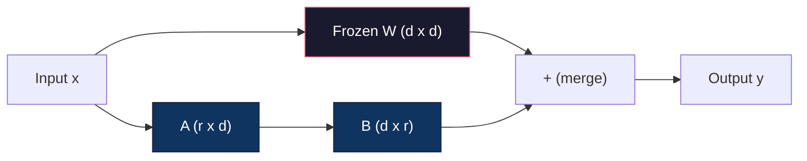
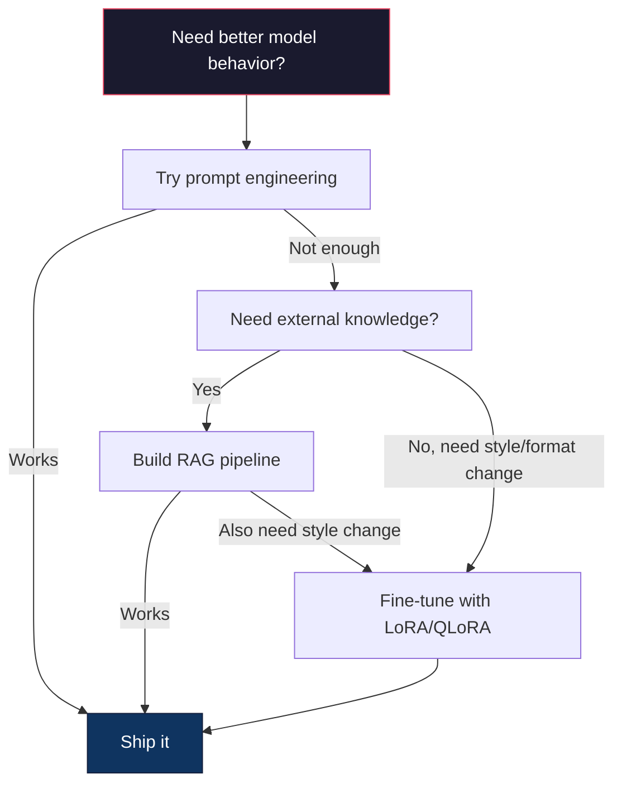

# 使用LoRA和QLoRA进行微调

> 完整微调一个7B模型需要56GB的显存。你没有那么多。大多数公司也没有。LoRA让你仅需6GB就能微调同一模型，只需训练不到1%的参数。这不是妥协——在大多数任务上，它的质量与完整微调相当。整个开源微调生态系统都依赖于这一技巧。

**类型：** 构建
**语言：** Python
**前置要求：** 阶段10，第06课（指令微调 / SFT）
**时间：** 约75分钟
**相关：** 阶段10从头讲解了SFT/DPO循环。本课将这些内容应用到2026年的PEFT工具包（PEFT、TRL、Unsloth、Axolotl、LLaMA-Factory）上。

## 学习目标

- 通过将低秩适配器矩阵（A和B）注入预训练模型的注意力层来实现LoRA
- 计算LoRA与完整微调相比的参数节省：秩为r、d_model维度时训练2*r*d个参数，而非d^2
- 使用QLoRA（4位量化基座+LoRA适配器）微调模型，以适应消费级GPU内存
- 将LoRA权重合并回基座模型进行部署，并比较有无适配器的推理速度

## 问题

你有一个基座模型：Llama 3 8B。你想让它以你公司的语气回答客户支持工单。SFT是解决方案。但SFT有一个成本问题。

完整微调会更新模型中的每个参数。Llama 3 8B有80亿个参数。在fp16下，每个参数占用2字节。仅加载权重就需要16GB。训练期间，你还需要梯度（16GB）、Adam优化器状态（动量+方差占用32GB）以及激活值。总计：单个8B模型大约需要56GB的显存。

一张A100 80GB勉强能装下。两张A100每次实验花费$3-4/hour on cloud providers. Training for 3 epochs on 50,000 examples takes 6-10 hours. That's $30-40美元。运行10次实验以调好超参数，在部署之前你就花掉了400美元。

把这个规模扩大到Llama 3 70B，数字就变得荒谬了。仅权重就需要140GB。你需要一个集群。每次实验100多美元。

还有一个更深层次的问题。完整微调会修改模型中的每一个权重。如果你在客户支持数据上微调，可能会降低模型的通用能力。这被称为灾难性遗忘(Catastrophic Forgetting)。模型在你的任务上变得更好，而在其他所有任务上变得更差。

你需要一种训练更少参数、占用更少内存、且不破坏模型现有知识的方法。

## 核心概念

### LoRA：低秩适配(Low-Rank Adaptation)

Edward Hu及其微软同事于2021年6月发表了LoRA。该论文的洞见：微调期间的权重更新具有低内在秩。你无需更新4096x4096权重矩阵中的所有1670万个参数。更新中的有用信息可以通过一个秩为16或32的矩阵来捕获。

以下是数学原理。一个标准线性层计算：

```
y = Wx
```

其中W是d_out x d_in矩阵。对于一个4096x4096的注意力投影，这就有16,777,216个参数。

LoRA冻结W并添加一个低秩分解：

```
y = Wx + BAx
```

其中B是(d_out x r)，A是(r x d_in)。秩r远小于d——通常为8、16或32。

对于4096x4096层且r=16时：
- 原始参数：4096 x 4096 = 16,777,216
- LoRA参数：(4096 x 16) + (16 x 4096) = 65,536 + 65,536 = 131,072
- 减少比例：131,072 / 16,777,216 = 0.78%

你只训练了0.78%的参数，却能得到95-100%的质量。



A使用随机高斯分布初始化。B初始化为零。这意味着LoRA的贡献从零开始——模型从其原始行为开始训练，并逐渐学习适配。

### 缩放因子：Alpha

LoRA引入了一个缩放因子alpha，用于控制低秩更新对输出的影响程度：

```
y = Wx + (alpha / r) * BAx
```

当alpha = r时，缩放为1倍。当alpha = 2r（常见默认值）时，缩放为2倍。这个超参数独立于基础学习率，控制LoRA路径的学习率。

实用指导：
- alpha = 2 * rank 是常见的社区约定（原始论文在大多数实验中使用 alpha = rank）
- alpha = rank 提供1倍缩放，保守但稳定
- 更高的alpha意味着每步更新更大，可能加速收敛或导致不稳定

### 在哪里应用LoRA

一个Transformer有许多线性层。你不需要在所有层上都添加LoRA。原始论文测试了不同的组合：

|  目标层  |  可训练参数（7B）  |  质量  |
|--------------|----------------------|---------|
|  仅 q_proj  |  4.7M  |  好  |
|  q_proj + v_proj  |  9.4M  |  更好  |
|  q_proj + k_proj + v_proj + o_proj  |  18.9M  |  最适合注意力机制  |
|  所有线性层（注意力+MLP）  |  37.7M  |  边际收益，参数量翻倍  |

大多数任务的最佳选择：q_proj + v_proj。这针对自注意力中的查询(query)和值(value)投影，控制模型关注什么以及提取什么信息。对于复杂任务（如代码生成），添加MLP层有帮助，但会使参数量翻倍，且对简单任务的收益递减。

### 秩的选择

秩 r 控制适配的表示能力：

|  秩  |  可训练参数量（每层）  |  最适合  |
|------|---------------------------|----------|
|  4  |  32,768  |  简单分类、情感分析  |
|  8  |  65,536  |  单领域问答、摘要  |
|  16  |  131,072  |  多领域任务、指令遵循  |
|  32  |  262,144  |  复杂推理、代码生成  |
|  64  |  524,288  |  对大多数任务收益递减  |
|  128  |  1,048,576  |  很少有必要  |

Hu 等人表明，对于简单任务，r=4 已经能捕获大部分适配能力。r=8 和 r=16 是实践中最常见的选择。超过 r=64 很少能提升质量，并且开始失去 LoRA 的内存优势。

### QLoRA：4位量化 + LoRA

华盛顿大学的 Tim Dettmers 及其同事于 2023 年 5 月发表了 QLoRA。其思想是：将冻结的基础模型量化为 4 位精度，然后在上面附加 fp16 的 LoRA 适配器。

这极大地改变了内存公式：

|  方法  |  权重内存（7B）  |  训练内存（7B）  |  所需 GPU  |
|--------|-------------------|---------------------|-------------|
|  全参数微调（fp16）  |  14GB  |  ~56GB  |  1x A100 80GB  |
|  LoRA（fp16基础）  |  14GB  |  ~18GB  |  1x A100 40GB  |
|  QLoRA（4位基础）  |  3.5GB  |  ~6GB  |  1x RTX 3090 24GB  |

QLoRA 做出了三项技术贡献：

**NF4（正常浮点4位）**：一种专门为神经网络权重设计的新数据类型。神经网络权重近似服从正态分布。NF4 将其 16 个量化级别置于标准正态分布的分位数上。这对于正态分布的数据在信息论上是最优的。相比均匀 4 位量化（INT4）或标准浮点4位，它丢失的信息更少。

**双重量化**：量化常数本身会占用内存。每 64 个权重块需要一个 fp32 缩放因子（4 字节）。对于 7B 模型，这额外增加了 0.4GB。双重量化将这些常数量化为 fp8，将开销降至 0.1GB。虽然很小，但积少成多。

**分页优化器**：在训练过程中，优化器状态（Adam 的动量和方差）在长序列时可能超出 GPU 内存。分页优化器利用 NVIDIA 的统一内存，在 GPU 内存耗尽时自动将优化器状态换出到 CPU RAM，并在需要时换回。这避免了 OOM 崩溃，但会牺牲一些吞吐量。

### 质量之问

减少参数或量化基础模型会损害质量吗？多篇论文的结果如下：

|  方法  |  MMLU（5-shot）  |  MT-Bench  |  HumanEval  |
|--------|--------------|----------|-----------|
|  全参数微调（Llama 2 7B）  |  48.3  |  6.72  |  14.6  |
|  LoRA r=16  |  47.9  |  6.68  |  14.0  |
|  QLoRA r=16（NF4）  |  47.5  |  6.61  |  13.4  |
|  QLoRA r=64 (NF4)  |  48.1  |  6.70  |  14.2  |

在大多数基准测试中，LoRA（r=16）的性能与全量微调相差在1%以内。QLoRA（r=16）会再损失零点几个百分点。QLoRA（r=64）基本上与全量微调匹配，同时节省90%的内存。

### 实际成本

在50,000个样本上微调Llama 3 8B（3个epoch）：

|  方法 | GPU | 时间 | 成本  |
|--------|-----|------|------|
|  全量微调 | 2x A100 80GB | 8小时 | 约$32  |
|  LoRA r=16 | 1x A100 40GB | 4小时 | 约$8  |
|  QLoRa r=16 | 1x RTX 4090 24GB | 6小时 | 约$5  |
|  QLoRa r=16 (Unsloth) | 1x RTX 4090 24GB | 2.5小时 | 约$2  |
|  QLoRa r=16 | 1x T4 16GB | 12小时 | 约$4  |

在单个消费级GPU上运行QLoRA的成本还不到一顿午饭。这就是为什么开放权重微调社区在2023年爆发，以及为什么到2026年下面每个训练框架都默认内置QLoRA。

### 2026年的PEFT技术栈

|  框架 | 描述 | 适用场景  |
|-----------|-----------|-----------|
|  **Hugging Face PEFT** | 官方的LoRA/QLoRA/DoRA/IA3库 | 你需要原始控制，且训练循环已在`transformers.Trainer`上  |
|  **TRL** | HF的基于反馈的强化学习训练器（SFT, DPO, GRPO, PPO, ORPO） | 在SFT后需要DPO/GRPO；基于PEFT构建  |
|  **Unsloth** | 对前向/反向传播的Triton内核重写 | 你想要2-5倍加速+一半显存且无精度损失；适用于Llama/Mistral/Qwen系列  |
|  **Axolotl** | 基于PEFT + TRL + DeepSpeed + Unsloth的YAML配置封装 | 你想要可复现、可版本控制的训练运行  |
|  **LLaMA-Factory** | 基于PEFT + TRL的GUI/CLI/API | 你想要零代码微调；支持100+模型系列  |
|  **torchtune** | 原生PyTorch配方，无`transformers`依赖 | 你想要最小依赖，且你的组织已标准化使用PyTorch  |

经验法则：研究用途或一次性实验 → PEFT。可重复的生产流水线 → 启用Unsloth内核的Axolotl。一次性原型开发 → LLaMA-Factory。

### 合并适配器(Adapter)

训练后，你得到两样东西：冻结的基座模型和一个小型LoRA适配器（通常10-100MB）。你可以选择：

1. **保持分离**：加载基座模型，再加载适配器。为不同任务切换适配器。这就是如何从一个基座模型提供多个微调变体的方法。

2. **永久合并**：计算 W' = W + (alpha/r) * BA，并将结果保存为新的完整模型。合并后的模型大小与原始模型相同。无推理开销。无需管理适配器。

对于服务多个任务（客服适配器、代码适配器、翻译适配器），保持分离。对于部署单一专用模型，合并。

用于组合多个适配器的高级合并技术：

- **TIES-Merging**（Yadav等人，2023）：修剪幅度小的参数，解决符号冲突，然后合并。减少适配器之间的干扰。
- **DARE**（Yu等人，2023）：在合并前随机丢弃适配器参数并重新缩放剩余部分。在组合能力方面出奇地有效。
- **任务算术**：简单地相加或相减适配器权重。添加一个“代码”适配器和一个“数学”适配器通常会产生一个两者都擅长的模型。

### 何时不微调

微调是第三选择，而不是第一选择。

**第一：提示工程(Prompt Engineering)。**编写更好的系统提示。添加少量样本示例。使用思维链(Chain-of-Thought)。这无需成本，只需几分钟。如果提示就能完成80%的工作，你可能不需要微调。

**第二：RAG（检索增强生成）。** 如果模型需要了解你的特定数据（文档、知识库、产品目录），检索比将数据融入权重更经济且更易维护。参见第06课。

**第三：微调。** 当需要通过提示无法实现的特定风格、格式或推理模式时使用此方法。当需要一致的结构化输出时。当需要将大模型蒸馏成小模型时。当延迟很重要且无法承担来自少样本提示的额外token时。



```figure
lora-params
```

## 动手构建

我们在纯PyTorch中从头实现LoRA。无库。无黑魔法。你将构建LoRA层，将其注入模型，训练它，然后合并权重。

### 第1步：LoRA层

```python
import torch
import torch.nn as nn
import math

class LoRALayer(nn.Module):
    def __init__(self, in_features, out_features, rank=8, alpha=16):
        super().__init__()
        self.rank = rank
        self.alpha = alpha
        self.scaling = alpha / rank

        self.A = nn.Parameter(torch.randn(in_features, rank) * (1 / math.sqrt(rank)))
        self.B = nn.Parameter(torch.zeros(rank, out_features))

    def forward(self, x):
        return (x @ self.A @ self.B) * self.scaling
```

A矩阵以缩放后的随机值初始化。B矩阵初始化为零。乘积BA从零开始，因此模型以原始行为启动。

### 第2步：LoRA包裹的线性层

```python
class LinearWithLoRA(nn.Module):
    def __init__(self, linear, rank=8, alpha=16):
        super().__init__()
        self.linear = linear
        self.lora = LoRALayer(
            linear.in_features, linear.out_features, rank, alpha
        )

        for param in self.linear.parameters():
            param.requires_grad = False

    def forward(self, x):
        return self.linear(x) + self.lora(x)
```

原始线性层被冻结。只有LoRA参数（A和B）可训练。

### 第3步：将LoRA注入模型

```python
def inject_lora(model, target_modules, rank=8, alpha=16):
    for param in model.parameters():
        param.requires_grad = False

    lora_layers = {}
    for name, module in model.named_modules():
        if isinstance(module, nn.Linear):
            if any(t in name for t in target_modules):
                parent_name = ".".join(name.split(".")[:-1])
                child_name = name.split(".")[-1]
                parent = dict(model.named_modules())[parent_name]
                lora_linear = LinearWithLoRA(module, rank, alpha)
                setattr(parent, child_name, lora_linear)
                lora_layers[name] = lora_linear
    return lora_layers
```

首先，冻结模型中的每个参数。然后遍历模型树，找到与目标名称匹配的线性层，并用LoRA包裹版本替换它们。整个模型中只有LoRA的A和B矩阵是可训练参数。

### 第4步：统计参数数量

```python
def count_parameters(model):
    total = sum(p.numel() for p in model.parameters())
    trainable = sum(p.numel() for p in model.parameters() if p.requires_grad)
    frozen = total - trainable
    return {
        "total": total,
        "trainable": trainable,
        "frozen": frozen,
        "trainable_pct": 100 * trainable / total if total > 0 else 0
    }
```

### 第5步：合并回权重

```python
def merge_lora_weights(model):
    for name, module in model.named_modules():
        if isinstance(module, LinearWithLoRA):
            with torch.no_grad():
                merged = (
                    module.lora.A @ module.lora.B
                ) * module.lora.scaling
                module.linear.weight.data += merged.T
            parent_name = ".".join(name.split(".")[:-1])
            child_name = name.split(".")[-1]
            if parent_name:
                parent = dict(model.named_modules())[parent_name]
            else:
                parent = model
            setattr(parent, child_name, module.linear)
```

合并后，LoRA层消失。模型大小与原始模型相同，适配已融入权重。无推理开销。

### 第6步：模拟QLoRA量化

```python
def quantize_to_nf4(tensor, block_size=64):
    blocks = tensor.reshape(-1, block_size)
    scales = blocks.abs().max(dim=1, keepdim=True).values / 7.0
    scales = torch.clamp(scales, min=1e-8)
    quantized = torch.round(blocks / scales).clamp(-8, 7).to(torch.int8)
    return quantized, scales

def dequantize_from_nf4(quantized, scales, original_shape):
    dequantized = quantized.float() * scales
    return dequantized.reshape(original_shape)
```

通过将权重映射到64个块内的16个离散级别来模拟4位量化。生产环境中的QLoRA使用bitsandbytes库在GPU上实现真正的NF4。

### 第7步：训练循环

```python
def train_lora(model, data, epochs=5, lr=1e-3, batch_size=4):
    optimizer = torch.optim.AdamW(
        [p for p in model.parameters() if p.requires_grad], lr=lr
    )
    criterion = nn.MSELoss()

    losses = []
    for epoch in range(epochs):
        epoch_loss = 0.0
        n_batches = 0
        indices = torch.randperm(len(data["inputs"]))

        for i in range(0, len(indices), batch_size):
            batch_idx = indices[i:i + batch_size]
            x = data["inputs"][batch_idx]
            y = data["targets"][batch_idx]

            output = model(x)
            loss = criterion(output, y)

            optimizer.zero_grad()
            loss.backward()
            optimizer.step()

            epoch_loss += loss.item()
            n_batches += 1

        avg_loss = epoch_loss / n_batches
        losses.append(avg_loss)

    return losses
```

### 第8步：完整演示

```python
def demo():
    torch.manual_seed(42)
    d_model = 256
    n_classes = 10

    model = nn.Sequential(
        nn.Linear(d_model, 512),
        nn.ReLU(),
        nn.Linear(512, 512),
        nn.ReLU(),
        nn.Linear(512, n_classes),
    )

    n_samples = 500
    x = torch.randn(n_samples, d_model)
    y = torch.randint(0, n_classes, (n_samples,))
    y_onehot = torch.zeros(n_samples, n_classes).scatter_(1, y.unsqueeze(1), 1.0)

    data = {"inputs": x, "targets": y_onehot}

    params_before = count_parameters(model)

    lora_layers = inject_lora(
        model, target_modules=["0", "2"], rank=8, alpha=16
    )

    params_after = count_parameters(model)

    losses = train_lora(model, data, epochs=20, lr=1e-3)

    merge_lora_weights(model)
    params_merged = count_parameters(model)

    return {
        "params_before": params_before,
        "params_after": params_after,
        "params_merged": params_merged,
        "losses": losses,
    }
```

该演示创建一个小模型，将LoRA注入两个层，训练它，然后合并回权重。在LoRA训练期间，参数数量从完全可训练下降到约1%可训练，合并后恢复到原始架构。

## 使用它

使用Hugging Face生态，在真实模型上使用LoRA大约只需20行代码：

```python
from transformers import AutoModelForCausalLM, AutoTokenizer
from peft import LoraConfig, get_peft_model, TaskType

model = AutoModelForCausalLM.from_pretrained("meta-llama/Llama-3.1-8B")
tokenizer = AutoTokenizer.from_pretrained("meta-llama/Llama-3.1-8B")

lora_config = LoraConfig(
    task_type=TaskType.CAUSAL_LM,
    r=16,
    lora_alpha=32,
    lora_dropout=0.05,
    target_modules=["q_proj", "v_proj"],
)

model = get_peft_model(model, lora_config)
model.print_trainable_parameters()
```

对于QLoRA，添加bitsandbytes量化：

```python
from transformers import BitsAndBytesConfig

bnb_config = BitsAndBytesConfig(
    load_in_4bit=True,
    bnb_4bit_quant_type="nf4",
    bnb_4bit_compute_dtype=torch.bfloat16,
    bnb_4bit_use_double_quant=True,
)

model = AutoModelForCausalLM.from_pretrained(
    "meta-llama/Llama-3.1-8B",
    quantization_config=bnb_config,
    device_map="auto",
)

model = get_peft_model(model, lora_config)
```

就是这样。相同的训练循环。相同的数据管道。基础模型现在以4位存储，LoRA适配器以fp16训练，整个模型适合6GB显存。

使用Hugging Face Trainer进行训练：

```python
from transformers import TrainingArguments, Trainer
from datasets import load_dataset

dataset = load_dataset("tatsu-lab/alpaca", split="train[:5000]")

training_args = TrainingArguments(
    output_dir="./lora-llama",
    num_train_epochs=3,
    per_device_train_batch_size=4,
    gradient_accumulation_steps=4,
    learning_rate=2e-4,
    fp16=True,
    logging_steps=10,
    save_strategy="epoch",
    optim="paged_adamw_8bit",
)

trainer = Trainer(
    model=model,
    args=training_args,
    train_dataset=dataset,
)

trainer.train()

model.save_pretrained("./lora-adapter")
```

保存的适配器大小为10-100MB。基础模型保持不变。你可以在Hugging Face Hub上共享适配器，而无需重新分发完整模型。

## 发布

本課(lesson)产出：
- `outputs/prompt-lora-advisor.md` —— 帮助你为特定任务决定LoRA秩、目标模块和超参数的提示
- `outputs/prompt-lora-advisor.md` —— 一种教智能体何时以及如何微调的决策树技能

## 练习

1. **秩消融研究。** 分别以秩2、4、8、16、32和64运行演示。绘制最终损失与秩的关系图。找到收益递减点，即秩翻倍后损失不再减半。对于256维特征上的简单分类任务，该点应在r=8-16附近。

2. **目标模块比较。** 修改inject_lora以仅针对层"0"、仅层"2"、仅层"4"、以及所有三个层。每个变体训练20个周期。比较收敛速度和最终损失。这反映了实际中针对q_proj vs v_proj vs所有线性层的决策。

3. **量化误差分析。** 获取训练后模型的权重矩阵，在quantize_to_nf4/dequantize_from_nf4前后进行比较。计算均方误差、最大绝对误差以及原始和重建权重之间的相关性。实验块大小值32、64、128和256。

4. **多适配器服务。** 在数据的不同子集（偶数索引 vs 奇数索引）上训练两个LoRA适配器。保存两个适配器。加载基础模型一次，然后交换适配器并验证每个适配器在相同输入上产生不同的输出。这就是生产系统如何从一个基础模型服务于多个微调模型的方式。

5. **合并与未合并推理对比。** 对于相同的100个输入，比较LoRA模型在merge_lora_weights之前和之后的输出。验证输出是否相同（在浮点容差1e-5内）。然后对两者进行推理速度基准测试——合并后的应稍快，因为它是单个矩阵乘法而非两个。

## 关键术语

|  术语  |  人们的说法  |  实际含义  |
|------|----------------|----------------------|
|  LoRA  |  "高效微调"  |  低秩适配：冻结基础权重，训练两个小矩阵A和B，其乘积近似完整的权重更新 |
|  QLoRA  |  "在笔记本上微调"  |  量化LoRA：以4位NF4加载基础模型，在其上以fp16训练LoRA适配器，使得在6GB显存中微调7B模型成为可能 |
| 秩 (r)  |  "模型能学习多少"  |  A和B矩阵的内部维度；控制表达能力与参数数量之间的平衡 |
| Alpha  |  "LoRA学习率"  |  应用于LoRA输出的缩放因子；alpha/r缩放适配对最终输出的贡献 |
| NF4  |  "4位量化"  |  规格化浮点4：一种4位数据类型，量化级别位于正态分布分位数处，对神经网络权重最优 |
| 适配器(Adapter)  |  "小型训练部分"  |  LoRA A和B矩阵保存为单独文件（10-100MB），可加载到任何基础模型副本之上 |
| 目标模块(Target modules)  |  "哪些层应用LoRA"  |  注入LoRA适配器的特定线性层（如q_proj、v_proj等） |
| 合并(Merging)  |  "烘焙到模型中"  |  计算W + (alpha/r) * BA并替换原始权重，消除推理时的适配器开销 |
| 分页优化器(Paged optimizers)  |  "训练时避免OOM"  |  当GPU内存耗尽时将优化器状态（Adam动量、方差）卸载到CPU |
| 灾难性遗忘(Catastrophic forgetting)  |  "微调破坏了其他能力"  |  当更新所有权重导致模型丢失先前学到的能力时 |

## 延伸阅读

- Hu等人，《LoRA：大型语言模型的低秩适配》(2021)——首次提出低秩分解方法的论文，在GPT-3 175B上测试，秩低至4
- Dettmers等人，《QLoRA：量化语言模型的高效微调》(2023)——引入了NF4、双重量化和分页优化器，使得在单个48GB GPU上可以微调65B模型
- PEFT库文档(huggingface.co/docs/peft)——Hugging Face生态系统中用于LoRA、QLoRA和其他参数高效方法的标准库
- Yadav等人，《TIES-Merging：解决模型合并时的干扰》(2023)——在不降低质量的情况下组合多个LoRA适配器的技术
- [Rafailov et al., "Direct Preference Optimization: Your Language Model is Secretly a Reward Model" (NeurIPS 2023)](https://arxiv.org/abs/2305.18290)——DPO推导；SFT之后的偏好调整阶段，无需奖励模型
- [Rafailov et al., "Direct Preference Optimization: Your Language Model is Secretly a Reward Model" (NeurIPS 2023)](https://arxiv.org/abs/2305.18290)——[TRL documentation](https://huggingface.co/docs/trl/)、`SFTTrainer`、`DPOTrainer`的官方参考，以及与PEFT/bitsandbytes/Unsloth的集成接口
- [Rafailov et al., "Direct Preference Optimization: Your Language Model is Secretly a Reward Model" (NeurIPS 2023)](https://arxiv.org/abs/2305.18290)——融合内核，使微调吞吐量翻倍并使内存减半；TRL下的性能层
- [Rafailov et al., "Direct Preference Optimization: Your Language Model is Secretly a Reward Model" (NeurIPS 2023)](https://arxiv.org/abs/2305.18290)——YAML配置的多GPU SFT/DPO/QLoRA训练器；作为手工脚本的替代方案的配置即代码
